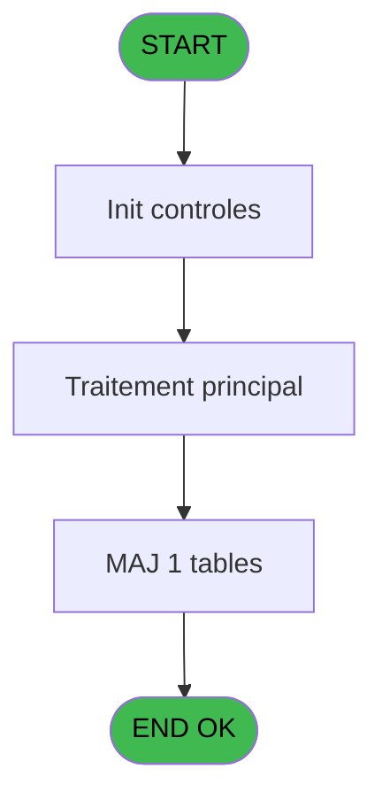

# PBG IDE 181 - Creation Historique

> **Analyse**: Phases 1-4 2026-02-03 10:00 -> 10:00 (18s) | Assemblage 10:00
> **Pipeline**: V7.2 Enrichi
> **Structure**: 4 onglets (Resume | Ecrans | Donnees | Connexions)

<!-- TAB:Resume -->

## 1. FICHE D'IDENTITE

| Attribut | Valeur |
|----------|--------|
| Projet | PBG |
| IDE Position | 181 |
| Nom Programme | Creation Historique |
| Fichier source | `Prg_181.xml` |
| Domaine metier | General |
| Taches | 1 (0 ecrans visibles) |
| Tables modifiees | 1 |
| Programmes appeles | 0 |

## 2. DESCRIPTION FONCTIONNELLE

**Creation Historique** assure la gestion complete de ce processus, accessible depuis [Logement Client (IDE 0)](PBG-IDE-0.md), [Logement Exterieur (IDE 0)](PBG-IDE-0.md), [Logement Personnel (IDE 0)](PBG-IDE-0.md), [Logement Exterieur (IDE 171)](PBG-IDE-171.md), [Logement Personnel (IDE 172)](PBG-IDE-172.md), [Logement Client (IDE 173)](PBG-IDE-173.md), [Logement Client pms-626 (IDE 174)](PBG-IDE-174.md), [Logement Client (IDE 385)](PBG-IDE-385.md), [  Creation personnel identites (IDE 194)](PBG-IDE-194.md), [Personnel Identites (IDE 195)](PBG-IDE-195.md), [Module personnel identites (IDE 373)](PBG-IDE-373.md), [Creation personnel identites S (IDE 380)](PBG-IDE-380.md).

Le flux de traitement s'organise en **1 blocs fonctionnels** :

- **Creation** (1 tache) : insertion d'enregistrements en base (mouvements, prestations)

**Donnees modifiees** : 1 tables en ecriture (historik_station).

## 3. BLOCS FONCTIONNELS

### 3.1 Creation (1 tache)

Insertion de nouveaux enregistrements en base.

---

#### 181 - Creation Historique

**Role** : Consultation/chargement : Creation Historique.
**Variables liees** : A (P0-Code Historique)

## 5. REGLES METIER

*(Aucune regle metier identifiee)*

## 6. CONTEXTE

- **Appele par**: [Logement Client (IDE 0)](PBG-IDE-0.md), [Logement Exterieur (IDE 0)](PBG-IDE-0.md), [Logement Personnel (IDE 0)](PBG-IDE-0.md), [Logement Exterieur (IDE 171)](PBG-IDE-171.md), [Logement Personnel (IDE 172)](PBG-IDE-172.md), [Logement Client (IDE 173)](PBG-IDE-173.md), [Logement Client pms-626 (IDE 174)](PBG-IDE-174.md), [Logement Client (IDE 385)](PBG-IDE-385.md), [  Creation personnel identites (IDE 194)](PBG-IDE-194.md), [Personnel Identites (IDE 195)](PBG-IDE-195.md), [Module personnel identites (IDE 373)](PBG-IDE-373.md), [Creation personnel identites S (IDE 380)](PBG-IDE-380.md)
- **Appelle**: 0 programmes | **Tables**: 1 (W:1 R:0 L:0) | **Taches**: 1 | **Expressions**: 6

<!-- TAB:Ecrans -->

## 8. ECRANS

*(Programme sans ecran visible)*

## 9. NAVIGATION

### 9.3 Structure hierarchique (1 tache)

| Position | Tache | Type | Dimensions | Bloc |
|----------|-------|------|------------|------|
| **181.1** | [**Creation Historique** (181)](#t1) | MDI | - | Creation |

### 9.4 Algorigramme

> **Legende**: Vert = START/END OK | Rouge = END KO | Bleu = Decisions
> *Algorigramme auto-genere. Utiliser `/algorigramme` pour une synthese metier detaillee.*

<!-- TAB:Donnees -->

## 10. TABLES

### Tables utilisees (1)

| ID | Nom | Description | Type | R | W | L | Usages |
|----|-----|-------------|------|---|---|---|--------|
| 88 | historik_station | Historique / journal | DB |   | **W** |   | 1 |

### Colonnes par table (1 / 1 tables avec colonnes identifiees)

Table 88 - historik_station (**W**) - 1 usages

| Lettre | Variable | Acces | Type |
|--------|----------|-------|------|
| A | P0-Code Historique | W | Alpha |
| B | P0-Libelle | W | Alpha |

## 11. VARIABLES

### 11.1 Autres (2)

Variables diverses.

| Lettre | Nom | Type | Usage dans |
|--------|-----|------|-----------|
| A | P0-Code Historique | Alpha | [181](#t1) |
| B | P0-Libelle | Alpha | 1x refs |

## 12. EXPRESSIONS

**6 / 6 expressions decodees (100%)**

### 12.1 Repartition par type

| Type | Expressions | Regles |
|------|-------------|--------|
| DATE | 1 | 0 |
| OTHER | 4 | 0 |
| REFERENCE_VG | 1 | 0 |

### 12.2 Expressions cles par type

#### DATE (1 expressions)

| Type | IDE | Expression | Regle |
|------|-----|------------|-------|
| DATE | 4 | `Date ()` | - |

#### OTHER (4 expressions)

| Type | IDE | Expression | Regle |
|------|-----|------------|-------|
| OTHER | 5 | `Time ()` | - |
| OTHER | 6 | `P0-Libelle [B]` | - |
| OTHER | 1 | `GetParam ('SOCIETE')` | - |
| OTHER | 3 | `P0-Code Historique [A]` | - |

#### REFERENCE_VG (1 expressions)

| Type | IDE | Expression | Regle |
|------|-----|------------|-------|
| REFERENCE_VG | 2 | `VG20` | - |

<!-- TAB:Connexions -->

## 13. GRAPHE D'APPELS

### 13.1 Chaine depuis Main (Callers)

Main -> ... -> [Logement Client (IDE 0)](PBG-IDE-0.md) -> **Creation Historique (IDE 181)**

Main -> ... -> [Logement Exterieur (IDE 0)](PBG-IDE-0.md) -> **Creation Historique (IDE 181)**

Main -> ... -> [Logement Personnel (IDE 0)](PBG-IDE-0.md) -> **Creation Historique (IDE 181)**

Main -> ... -> [Logement Exterieur (IDE 171)](PBG-IDE-171.md) -> **Creation Historique (IDE 181)**

Main -> ... -> [Logement Personnel (IDE 172)](PBG-IDE-172.md) -> **Creation Historique (IDE 181)**

Main -> ... -> [Logement Client (IDE 173)](PBG-IDE-173.md) -> **Creation Historique (IDE 181)**

Main -> ... -> [Logement Client pms-626 (IDE 174)](PBG-IDE-174.md) -> **Creation Historique (IDE 181)**

Main -> ... -> [Logement Client (IDE 385)](PBG-IDE-385.md) -> **Creation Historique (IDE 181)**

Main -> ... -> [  Creation personnel identites (IDE 194)](PBG-IDE-194.md) -> **Creation Historique (IDE 181)**

Main -> ... -> [Personnel Identites (IDE 195)](PBG-IDE-195.md) -> **Creation Historique (IDE 181)**

Main -> ... -> [Module personnel identites (IDE 373)](PBG-IDE-373.md) -> **Creation Historique (IDE 181)**

Main -> ... -> [Creation personnel identites S (IDE 380)](PBG-IDE-380.md) -> **Creation Historique (IDE 181)**

### 13.2 Callers

| IDE | Nom Programme | Nb Appels |
|-----|---------------|-----------|
| [0](PBG-IDE-0.md) | Logement Client | 2 |
| [0](PBG-IDE-0.md) | Logement Exterieur | 2 |
| [0](PBG-IDE-0.md) | Logement Personnel | 2 |
| [171](PBG-IDE-171.md) | Logement Exterieur | 2 |
| [172](PBG-IDE-172.md) | Logement Personnel | 2 |
| [173](PBG-IDE-173.md) | Logement Client | 2 |
| [174](PBG-IDE-174.md) | Logement Client pms-626 | 2 |
| [385](PBG-IDE-385.md) | Logement Client | 2 |
| [194](PBG-IDE-194.md) |   Creation personnel identites | 1 |
| [195](PBG-IDE-195.md) | Personnel Identites | 1 |
| [373](PBG-IDE-373.md) | Module personnel identites | 1 |
| [380](PBG-IDE-380.md) | Creation personnel identites S | 1 |

### 13.3 Callees (programmes appeles)

### 13.4 Detail Callees avec contexte

| IDE | Nom Programme | Appels | Contexte |
|-----|---------------|--------|----------|
| - | (aucun) | - | - |

## 14. RECOMMANDATIONS MIGRATION

### 14.1 Profil du programme

| Metrique | Valeur | Impact migration |
|----------|--------|-----------------|
| Lignes de logique | 19 | Programme compact |
| Expressions | 6 | Peu de logique |
| Tables WRITE | 1 | Impact faible |
| Sous-programmes | 0 | Peu de dependances |
| Ecrans visibles | 0 | Ecran unique ou traitement batch |
| Code desactive | 0% (0 / 19) | Code sain |
| Regles metier | 0 | Pas de regle identifiee |

### 14.2 Plan de migration par bloc

#### Creation (1 tache: 0 ecran, 1 traitement)

- **Strategie** : Repository pattern avec Entity Framework Core.
- Insertion via `IRepository<T>.CreateAsync()`

### 14.3 Dependances critiques

| Dependance | Type | Appels | Impact |
|------------|------|--------|--------|
| historik_station | Table WRITE (Database) | 1x | Schema + repository |

---
*Spec DETAILED generee par Pipeline V7.2 - 2026-02-03 10:00*
