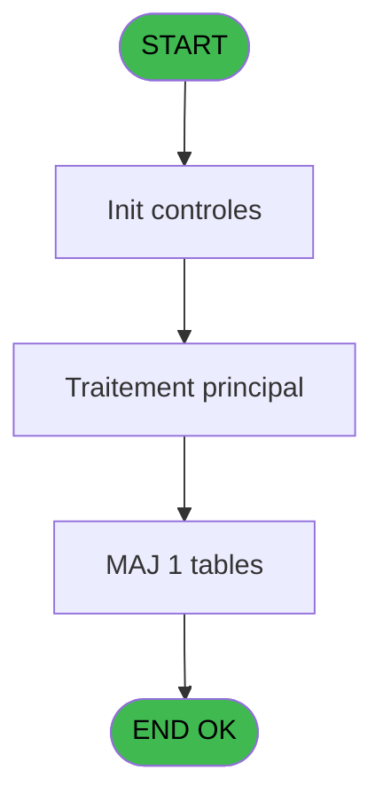
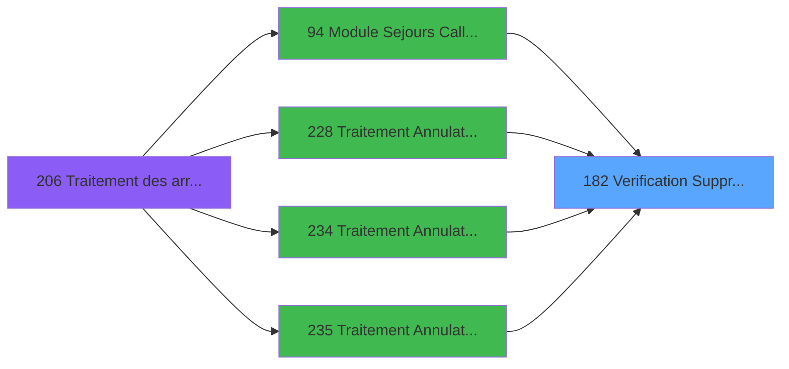

# PBG IDE 182 - Verification Suppression

> **Analyse**: Phases 1-4 2026-02-03 10:00 -> 10:00 (21s) | Assemblage 10:00
> **Pipeline**: V7.2 Enrichi
> **Structure**: 4 onglets (Resume | Ecrans | Donnees | Connexions)

<!-- TAB:Resume -->

## 1. FICHE D'IDENTITE

| Attribut | Valeur |
|----------|--------|
| Projet | PBG |
| IDE Position | 182 |
| Nom Programme | Verification Suppression |
| Fichier source | `Prg_182.xml` |
| Domaine metier | General |
| Taches | 2 (0 ecrans visibles) |
| Tables modifiees | 1 |
| Programmes appeles | 0 |

## 2. DESCRIPTION FONCTIONNELLE

**Verification Suppression** assure la gestion complete de ce processus, accessible depuis [Module Sejours CallTask (IDE 0)](PBG-IDE-0.md), [Module Sejours CallTask (IDE 94)](PBG-IDE-94.md), [Traitement Annulation Existant (IDE 228)](PBG-IDE-228.md), [Traitement Annulation sur modi (IDE 234)](PBG-IDE-234.md), [Traitement Annulation/pms-682 (IDE 235)](PBG-IDE-235.md), [Traitement Annulation/pms-912 (IDE 236)](PBG-IDE-236.md), [Traitement Annulation (IDE 238)](PBG-IDE-238.md), [Module Sejours SubForm (IDE 391)](PBG-IDE-391.md).

Le flux de traitement s'organise en **2 blocs fonctionnels** :

- **Traitement** (1 tache) : traitements metier divers
- **Validation** (1 tache) : controles et verifications de coherence

**Donnees modifiees** : 1 tables en ecriture (import_avertiss__mod2).

Detail : phases du traitement

#### Phase 1 : Validation (1 tache)

- **182** - Verification Suppression

#### Phase 2 : Traitement (1 tache)

- **182.1** - Analyse suppression

#### Tables impactees

| Table | Operations | Role metier |
|-------|-----------|-------------|
| import_avertiss__mod2 | **W** (1 usages) |  |

## 3. BLOCS FONCTIONNELS

### 3.1 Validation (1 tache)

Controles de coherence : 1 tache verifie les donnees et conditions.

---

#### 182 - Verification Suppression

**Role** : Verification : Verification Suppression.

### 3.2 Traitement (1 tache)

Traitements internes.

---

#### 182.1 - Analyse suppression

**Role** : Traitement : Analyse suppression.

## 5. REGLES METIER

*(Aucune regle metier identifiee)*

## 6. CONTEXTE

- **Appele par**: [Module Sejours CallTask (IDE 0)](PBG-IDE-0.md), [Module Sejours CallTask (IDE 94)](PBG-IDE-94.md), [Traitement Annulation Existant (IDE 228)](PBG-IDE-228.md), [Traitement Annulation sur modi (IDE 234)](PBG-IDE-234.md), [Traitement Annulation/pms-682 (IDE 235)](PBG-IDE-235.md), [Traitement Annulation/pms-912 (IDE 236)](PBG-IDE-236.md), [Traitement Annulation (IDE 238)](PBG-IDE-238.md), [Module Sejours SubForm (IDE 391)](PBG-IDE-391.md)
- **Appelle**: 0 programmes | **Tables**: 17 (W:1 R:1 L:15) | **Taches**: 2 | **Expressions**: 17

<!-- TAB:Ecrans -->

## 8. ECRANS

*(Programme sans ecran visible)*

## 9. NAVIGATION

### 9.3 Structure hierarchique (2 taches)

| Position | Tache | Type | Dimensions | Bloc |
|----------|-------|------|------------|------|
| **182.1** | [**Verification Suppression** (182)](#t1) | MDI | - | Validation |
| **182.2** | [**Analyse suppression** (182.1)](#t2) | MDI | - | Traitement |

### 9.4 Algorigramme

> **Legende**: Vert = START/END OK | Rouge = END KO | Bleu = Decisions
> *Algorigramme auto-genere. Utiliser `/algorigramme` pour une synthese metier detaillee.*

<!-- TAB:Donnees -->

## 10. TABLES

### Tables utilisees (17)

| ID | Nom | Description | Type | R | W | L | Usages |
|----|-----|-------------|------|---|---|---|--------|
| 30 | gm-recherche_____gmr | Index de recherche | DB | R |   |   | 1 |
| 31 | gm-complet_______gmc |  | DB |   |   | L | 1 |
| 38 | comptable_gratuite |  | DB |   |   | L | 1 |
| 39 | depot_garantie___dga | Depots et garanties | DB |   |   | L | 1 |
| 40 | comptable________cte |  | DB |   |   | L | 1 |
| 41 | depot_objets_____doa | Depots et garanties | DB |   |   | L | 1 |
| 42 | depot_devises____dda | Depots et garanties | DB |   |   | L | 1 |
| 43 | solde_devises____sda | Devises / taux de change | DB |   |   | L | 1 |
| 44 | change___________chg |  | DB |   |   | L | 1 |
| 79 | gratuites________gra |  | DB |   |   | L | 1 |
| 80 | codes_autocom____aut |  | DB |   |   | L | 1 |
| 147 | change_vente_____chg | Donnees de ventes | DB |   |   | L | 1 |
| 263 | vente | Donnees de ventes | DB |   |   | L | 1 |
| 272 | cc_type_detail |  | DB |   |   | L | 1 |
| 312 | ez_card |  | DB |   |   | L | 1 |
| 561 | import_avertiss__mod2 |  | DB |   | **W** |   | 1 |
| 569 | pointage_articles_caution | Articles et stock | TMP |   |   | L | 1 |

### Colonnes par table (14 / 2 tables avec colonnes identifiees)

Table 30 - gm-recherche_____gmr (R) - 1 usages

| Lettre | Variable | Acces | Type |
|--------|----------|-------|------|
| A | P0 Societe | R | Alpha |
| B | P0 Compte | R | Numeric |
| C | P0 Filiation | R | Numeric |
| D | P0 N° Cas | R | Numeric |
| E | P0 Autorisation | R | Alpha |
| F | P From Arrivant | R | Logical |
| G | v.ret lien comptable gratuit | R | Logical |
| H | v.ret lien garanties | R | Logical |
| I | v.ret lien comptable | R | Logical |
| J | v.ret lien depot objets | R | Logical |
| K | v.ret lien depot devises | R | Logical |
| L | v.ret lien sortie devises | R | Logical |
| M | v.ret lien change | R | Logical |
| N | v.ret lien gratuites | R | Logical |
| O | v.ret lien code autocom | R | Logical |
| P | v.ret lien change vente | R | Logical |
| Q | v.Existe ezcard | R | Logical |
| R | v.Existe credit conso | R | Logical |
| S | v.ret lien caisse_vente | R | Logical |
| T | v.ret lien import_identite | R | Logical |
| U | v. ret lien gm complet c9 | R | Logical |
| V | W0 fin tache | R | Alpha |

Table 561 - import_avertiss__mod2 (**W**) - 1 usages

| Lettre | Variable | Acces | Type |
|--------|----------|-------|------|
| T | v.ret lien import_identite | W | Logical |

## 11. VARIABLES

### 11.1 Parametres entrants (6)

Variables recues du programme appelant ([Module Sejours CallTask (IDE 0)](PBG-IDE-0.md)).

| Lettre | Nom | Type | Usage dans |
|--------|-----|------|-----------|
| A | P0 Societe | Alpha | 1x parametre entrant |
| B | P0 Compte | Numeric | 1x parametre entrant |
| C | P0 Filiation | Numeric | 1x parametre entrant |
| D | P0 N° Cas | Numeric | 2x parametre entrant |
| E | P0 Autorisation | Alpha | - |
| F | P From Arrivant | Logical | 5x parametre entrant |

### 11.2 Variables de session (15)

Variables persistantes pendant toute la session.

| Lettre | Nom | Type | Usage dans |
|--------|-----|------|-----------|
| G | v.ret lien comptable gratuit | Logical | - |
| H | v.ret lien garanties | Logical | - |
| I | v.ret lien comptable | Logical | - |
| J | v.ret lien depot objets | Logical | - |
| K | v.ret lien depot devises | Logical | - |
| L | v.ret lien sortie devises | Logical | - |
| M | v.ret lien change | Logical | - |
| N | v.ret lien gratuites | Logical | - |
| O | v.ret lien code autocom | Logical | - |
| P | v.ret lien change vente | Logical | - |
| Q | v.Existe ezcard | Logical | - |
| R | v.Existe credit conso | Logical | - |
| S | v.ret lien caisse_vente | Logical | - |
| T | v.ret lien import_identite | Logical | - |
| U | v. ret lien gm complet c9 | Logical | - |

### 11.3 Variables de travail (1)

Variables internes au programme.

| Lettre | Nom | Type | Usage dans |
|--------|-----|------|-----------|
| V | W0 fin tache | Alpha | - |

Toutes les 22 variables (liste complete)

| Cat | Lettre | Nom Variable | Type |
|-----|--------|--------------|------|
| P0 | **A** | P0 Societe | Alpha |
| P0 | **B** | P0 Compte | Numeric |
| P0 | **C** | P0 Filiation | Numeric |
| P0 | **D** | P0 N° Cas | Numeric |
| P0 | **E** | P0 Autorisation | Alpha |
| P0 | **F** | P From Arrivant | Logical |
| W0 | **V** | W0 fin tache | Alpha |
| V. | **G** | v.ret lien comptable gratuit | Logical |
| V. | **H** | v.ret lien garanties | Logical |
| V. | **I** | v.ret lien comptable | Logical |
| V. | **J** | v.ret lien depot objets | Logical |
| V. | **K** | v.ret lien depot devises | Logical |
| V. | **L** | v.ret lien sortie devises | Logical |
| V. | **M** | v.ret lien change | Logical |
| V. | **N** | v.ret lien gratuites | Logical |
| V. | **O** | v.ret lien code autocom | Logical |
| V. | **P** | v.ret lien change vente | Logical |
| V. | **Q** | v.Existe ezcard | Logical |
| V. | **R** | v.Existe credit conso | Logical |
| V. | **S** | v.ret lien caisse_vente | Logical |
| V. | **T** | v.ret lien import_identite | Logical |
| V. | **U** | v. ret lien gm complet c9 | Logical |

## 12. EXPRESSIONS

**17 / 17 expressions decodees (100%)**

### 12.1 Repartition par type

| Type | Expressions | Regles |
|------|-------------|--------|
| CONSTANTE | 3 | 0 |
| OTHER | 9 | 0 |
| CAST_LOGIQUE | 2 | 0 |
| CONDITION | 1 | 0 |
| NEGATION | 1 | 0 |
| REFERENCE_VG | 1 | 0 |

### 12.2 Expressions cles par type

#### CONSTANTE (3 expressions)

| Type | IDE | Expression | Regle |
|------|-----|------------|-------|
| CONSTANTE | 9 | `'O'` | - |
| CONSTANTE | 7 | `'F'` | - |
| CONSTANTE | 4 | `'N'` | - |

#### OTHER (9 expressions)

| Type | IDE | Expression | Regle |
|------|-----|------------|-------|
| OTHER | 15 | `[GS]` | - |
| OTHER | 13 | `P From Arrivant [F]` | - |
| OTHER | 17 | `[GR]` | - |
| OTHER | 16 | `[GQ]` | - |
| OTHER | 12 | `P From Arrivant [F]` | - |
| ... | | *+4 autres* | |

#### CAST_LOGIQUE (2 expressions)

| Type | IDE | Expression | Regle |
|------|-----|------------|-------|
| CAST_LOGIQUE | 6 | `P0 N° Cas [D]<>2 AND ([BP] OR [BQ] OR [BR] OR [BV] OR [BY] OR [BZ] OR [CC] OR [FX] OR IF(P From Arrivant [F],NOT([GK]) OR [GU]='O','FALSE'LOG) OR IF(P From Arrivant [F],[HA] AND [GY]=0,'FALSE'LOG))` | - |
| CAST_LOGIQUE | 5 | `P0 N° Cas [D]=2 AND ([BP] OR [BQ] OR [BR] OR [BS] OR [BT] OR [BU] OR [BV] OR [BY] OR [BZ] OR [CC] OR [FX] OR IF(P From Arrivant [F],NOT([GK]) OR [GU]='O','FALSE'LOG) OR IF(P From Arrivant [F],[HA] AND [GY]=0,'FALSE'LOG))` | - |

#### CONDITION (1 expressions)

| Type | IDE | Expression | Regle |
|------|-----|------------|-------|
| CONDITION | 8 | `[CH]='F'` | - |

#### NEGATION (1 expressions)

| Type | IDE | Expression | Regle |
|------|-----|------------|-------|
| NEGATION | 11 | `NOT (P From Arrivant [F])` | - |

#### REFERENCE_VG (1 expressions)

| Type | IDE | Expression | Regle |
|------|-----|------------|-------|
| REFERENCE_VG | 14 | `VG20` | - |

<!-- TAB:Connexions -->

## 13. GRAPHE D'APPELS

### 13.1 Chaine depuis Main (Callers)

Main -> ... -> [Module Sejours CallTask (IDE 0)](PBG-IDE-0.md) -> **Verification Suppression (IDE 182)**

Main -> ... -> [Module Sejours CallTask (IDE 94)](PBG-IDE-94.md) -> **Verification Suppression (IDE 182)**

Main -> ... -> [Traitement Annulation Existant (IDE 228)](PBG-IDE-228.md) -> **Verification Suppression (IDE 182)**

Main -> ... -> [Traitement Annulation sur modi (IDE 234)](PBG-IDE-234.md) -> **Verification Suppression (IDE 182)**

Main -> ... -> [Traitement Annulation/pms-682 (IDE 235)](PBG-IDE-235.md) -> **Verification Suppression (IDE 182)**

Main -> ... -> [Traitement Annulation/pms-912 (IDE 236)](PBG-IDE-236.md) -> **Verification Suppression (IDE 182)**

Main -> ... -> [Traitement Annulation (IDE 238)](PBG-IDE-238.md) -> **Verification Suppression (IDE 182)**

Main -> ... -> [Module Sejours SubForm (IDE 391)](PBG-IDE-391.md) -> **Verification Suppression (IDE 182)**

### 13.2 Callers

| IDE | Nom Programme | Nb Appels |
|-----|---------------|-----------|
| [0](PBG-IDE-0.md) | Module Sejours CallTask | 1 |
| [94](PBG-IDE-94.md) | Module Sejours CallTask | 1 |
| [228](PBG-IDE-228.md) | Traitement Annulation Existant | 1 |
| [234](PBG-IDE-234.md) | Traitement Annulation sur modi | 1 |
| [235](PBG-IDE-235.md) | Traitement Annulation/pms-682 | 1 |
| [236](PBG-IDE-236.md) | Traitement Annulation/pms-912 | 1 |
| [238](PBG-IDE-238.md) | Traitement Annulation | 1 |
| [391](PBG-IDE-391.md) | Module Sejours SubForm | 1 |

### 13.3 Callees (programmes appeles)

### 13.4 Detail Callees avec contexte

| IDE | Nom Programme | Appels | Contexte |
|-----|---------------|--------|----------|
| - | (aucun) | - | - |

## 14. RECOMMANDATIONS MIGRATION

### 14.1 Profil du programme

| Metrique | Valeur | Impact migration |
|----------|--------|-----------------|
| Lignes de logique | 231 | Taille moyenne |
| Expressions | 17 | Peu de logique |
| Tables WRITE | 1 | Impact faible |
| Sous-programmes | 0 | Peu de dependances |
| Ecrans visibles | 0 | Ecran unique ou traitement batch |
| Code desactive | 0% (0 / 231) | Code sain |
| Regles metier | 0 | Pas de regle identifiee |

### 14.2 Plan de migration par bloc

#### Validation (1 tache: 0 ecran, 1 traitement)

- **Strategie** : FluentValidation avec validators specifiques.
- Chaque tache de validation -> un validator injectable

#### Traitement (1 tache: 0 ecran, 1 traitement)

- **Strategie** : 1 service(s) backend injectable(s) (Domain Services).
- Decomposer les taches en services unitaires testables.

### 14.3 Dependances critiques

| Dependance | Type | Appels | Impact |
|------------|------|--------|--------|
| import_avertiss__mod2 | Table WRITE (Database) | 1x | Schema + repository |

---
*Spec DETAILED generee par Pipeline V7.2 - 2026-02-03 10:00*
