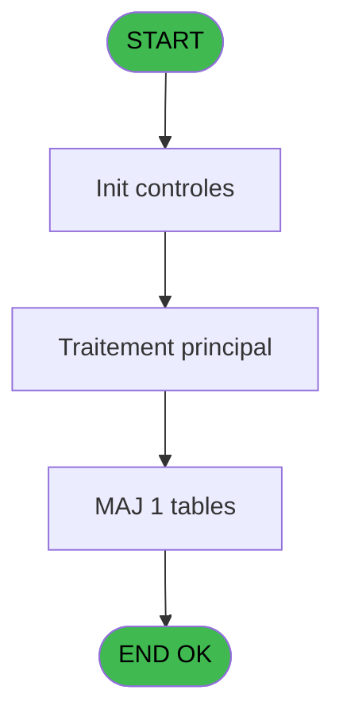
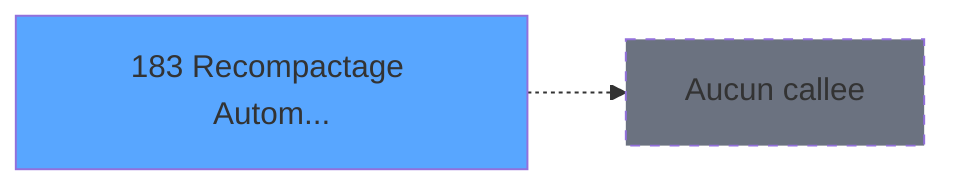

# PBG IDE 183 - Recompactage Automatique

> **Analyse**: Phases 1-4 2026-02-03 10:01 -> 10:01 (21s) | Assemblage 10:01
> **Pipeline**: V7.2 Enrichi
> **Structure**: 4 onglets (Resume | Ecrans | Donnees | Connexions)

<!-- TAB:Resume -->

## 1. FICHE D'IDENTITE

| Attribut | Valeur |
|----------|--------|
| Projet | PBG |
| IDE Position | 183 |
| Nom Programme | Recompactage Automatique |
| Fichier source | `Prg_183.xml` |
| Domaine metier | General |
| Taches | 9 (0 ecrans visibles) |
| Tables modifiees | 1 |
| Programmes appeles | 0 |

## 2. DESCRIPTION FONCTIONNELLE

**Recompactage Automatique** assure la gestion complete de ce processus, accessible depuis [Logement Client (IDE 0)](PBG-IDE-0.md), [Logement Personnel (IDE 0)](PBG-IDE-0.md), [Logement Personnel (IDE 172)](PBG-IDE-172.md), [Logement Client (IDE 173)](PBG-IDE-173.md), [Logement Client pms-626 (IDE 174)](PBG-IDE-174.md), [Logement Client (IDE 385)](PBG-IDE-385.md), [Logement Exterieur (IDE 0)](PBG-IDE-0.md), [Logement Exterieur (IDE 171)](PBG-IDE-171.md).

Le flux de traitement s'organise en **2 blocs fonctionnels** :

- **Traitement** (7 taches) : traitements metier divers
- **Validation** (2 taches) : controles et verifications de coherence

**Donnees modifiees** : 1 tables en ecriture (hebergement______heb).

Detail : phases du traitement

#### Phase 1 : Traitement (7 taches)

- **183** - Recompactage Automatique
- **183.1** - Compactage Arrière
- **183.1.2** - Effaçage Hebergement
- **183.1.3** - Modification Hebergement
- **183.2** - Compactage Avant
- **183.2.2** - Effaçage Hebergement
- **183.2.3** - Modification Hebergement

#### Phase 2 : Validation (2 taches)

- **183.1.1** - Verification Hebergement
- **183.2.1** - Verification Hebergement

#### Tables impactees

| Table | Operations | Role metier |
|-------|-----------|-------------|
| hebergement______heb | R/**W** (8 usages) | Hebergement (chambres) |

## 3. BLOCS FONCTIONNELS

### 3.1 Traitement (7 taches)

Traitements internes.

---

#### 183 - Recompactage Automatique

**Role** : Tache d'orchestration : point d'entree du programme (7 sous-taches). Coordonne l'enchainement des traitements.

6 sous-taches directes

| Tache | Nom | Bloc |
|-------|-----|------|
| [183.1](#t2) | Compactage Arrière | Traitement |
| [183.1.2](#t4) | Effaçage Hebergement | Traitement |
| [183.1.3](#t5) | Modification Hebergement | Traitement |
| [183.2](#t6) | Compactage Avant | Traitement |
| [183.2.2](#t8) | Effaçage Hebergement | Traitement |
| [183.2.3](#t9) | Modification Hebergement | Traitement |

---

#### 183.1 - Compactage Arrière

**Role** : Traitement : Compactage Arrière.

---

#### 183.1.2 - Effaçage Hebergement

**Role** : Traitement : Effaçage Hebergement.

---

#### 183.1.3 - Modification Hebergement

**Role** : Traitement : Modification Hebergement.

---

#### 183.2 - Compactage Avant

**Role** : Traitement : Compactage Avant.

---

#### 183.2.2 - Effaçage Hebergement

**Role** : Traitement : Effaçage Hebergement.

---

#### 183.2.3 - Modification Hebergement

**Role** : Traitement : Modification Hebergement.

### 3.2 Validation (2 taches)

Controles de coherence : 2 taches verifient les donnees et conditions.

---

#### 183.1.1 - Verification Hebergement

**Role** : Verification : Verification Hebergement.

---

#### 183.2.1 - Verification Hebergement

**Role** : Verification : Verification Hebergement.

## 5. REGLES METIER

*(Aucune regle metier identifiee)*

## 6. CONTEXTE

- **Appele par**: [Logement Client (IDE 0)](PBG-IDE-0.md), [Logement Personnel (IDE 0)](PBG-IDE-0.md), [Logement Personnel (IDE 172)](PBG-IDE-172.md), [Logement Client (IDE 173)](PBG-IDE-173.md), [Logement Client pms-626 (IDE 174)](PBG-IDE-174.md), [Logement Client (IDE 385)](PBG-IDE-385.md), [Logement Exterieur (IDE 0)](PBG-IDE-0.md), [Logement Exterieur (IDE 171)](PBG-IDE-171.md)
- **Appelle**: 0 programmes | **Tables**: 1 (W:1 R:1 L:0) | **Taches**: 9 | **Expressions**: 9

<!-- TAB:Ecrans -->

## 8. ECRANS

*(Programme sans ecran visible)*

## 9. NAVIGATION

### 9.3 Structure hierarchique (9 taches)

| Position | Tache | Type | Dimensions | Bloc |
|----------|-------|------|------------|------|
| **183.1** | [**Recompactage Automatique** (183)](#t1) | MDI | - | Traitement |
| 183.1.1 | [Compactage Arrière (183.1)](#t2) | MDI | - | |
| 183.1.2 | [Effaçage Hebergement (183.1.2)](#t4) | MDI | - | |
| 183.1.3 | [Modification Hebergement (183.1.3)](#t5) | MDI | - | |
| 183.1.4 | [Compactage Avant (183.2)](#t6) | MDI | - | |
| 183.1.5 | [Effaçage Hebergement (183.2.2)](#t8) | MDI | - | |
| 183.1.6 | [Modification Hebergement (183.2.3)](#t9) | MDI | - | |
| **183.2** | [**Verification Hebergement** (183.1.1)](#t3) | MDI | - | Validation |
| 183.2.1 | [Verification Hebergement (183.2.1)](#t7) | MDI | - | |

### 9.4 Algorigramme

> **Legende**: Vert = START/END OK | Rouge = END KO | Bleu = Decisions
> *Algorigramme auto-genere. Utiliser `/algorigramme` pour une synthese metier detaillee.*

<!-- TAB:Donnees -->

## 10. TABLES

### Tables utilisees (1)

| ID | Nom | Description | Type | R | W | L | Usages |
|----|-----|-------------|------|---|---|---|--------|
| 34 | hebergement______heb | Hebergement (chambres) | DB | R | **W** |   | 8 |

### Colonnes par table (1 / 1 tables avec colonnes identifiees)

Table 34 - hebergement______heb (R/**W**) - 8 usages

| Lettre | Variable | Acces | Type |
|--------|----------|-------|------|
| A | W1-Accord Suite | W | Alpha |
| B | W1-Date Fin | W | Date |
| C | W1-Heure Fin | W | Alpha |

## 11. VARIABLES

### 11.1 Autres (7)

Variables diverses.

| Lettre | Nom | Type | Usage dans |
|--------|-----|------|-----------|
| A | P0-Code Societe | Alpha | 1x refs |
| B | P0-Numero Compte | Numeric | - |
| C | P0-Filiation Compte | Numeric | - |
| D | P0-Date Debut | Date | - |
| E | P0-Date Fin | Date | - |
| F | P0-Selection Choix | Alpha | - |
| G | P0-Nom Recherche | Alpha | - |

## 12. EXPRESSIONS

**9 / 9 expressions decodees (100%)**

### 12.1 Repartition par type

| Type | Expressions | Regles |
|------|-------------|--------|
| CONSTANTE | 3 | 0 |
| OTHER | 5 | 0 |
| CONDITION | 1 | 0 |

### 12.2 Expressions cles par type

#### CONSTANTE (3 expressions)

| Type | IDE | Expression | Regle |
|------|-----|------------|-------|
| CONSTANTE | 8 | `'R'` | - |
| CONSTANTE | 6 | `'H'` | - |
| CONSTANTE | 1 | `'N'` | - |

#### OTHER (5 expressions)

| Type | IDE | Expression | Regle |
|------|-----|------------|-------|
| OTHER | 5 | `{1,4}` | - |
| OTHER | 9 | `[I]` | - |
| OTHER | 4 | `{1,3}` | - |
| OTHER | 2 | `{1,1}` | - |
| OTHER | 3 | `{1,2}` | - |

#### CONDITION (1 expressions)

| Type | IDE | Expression | Regle |
|------|-----|------------|-------|
| CONDITION | 7 | `P0-Code Societe [A]='O'` | - |

<!-- TAB:Connexions -->

## 13. GRAPHE D'APPELS

### 13.1 Chaine depuis Main (Callers)

Main -> ... -> [Logement Client (IDE 0)](PBG-IDE-0.md) -> **Recompactage Automatique (IDE 183)**

Main -> ... -> [Logement Personnel (IDE 0)](PBG-IDE-0.md) -> **Recompactage Automatique (IDE 183)**

Main -> ... -> [Logement Personnel (IDE 172)](PBG-IDE-172.md) -> **Recompactage Automatique (IDE 183)**

Main -> ... -> [Logement Client (IDE 173)](PBG-IDE-173.md) -> **Recompactage Automatique (IDE 183)**

Main -> ... -> [Logement Client pms-626 (IDE 174)](PBG-IDE-174.md) -> **Recompactage Automatique (IDE 183)**

Main -> ... -> [Logement Client (IDE 385)](PBG-IDE-385.md) -> **Recompactage Automatique (IDE 183)**

Main -> ... -> [Logement Exterieur (IDE 0)](PBG-IDE-0.md) -> **Recompactage Automatique (IDE 183)**

Main -> ... -> [Logement Exterieur (IDE 171)](PBG-IDE-171.md) -> **Recompactage Automatique (IDE 183)**

### 13.2 Callers

| IDE | Nom Programme | Nb Appels |
|-----|---------------|-----------|
| [0](PBG-IDE-0.md) | Logement Client | 2 |
| [0](PBG-IDE-0.md) | Logement Personnel | 2 |
| [172](PBG-IDE-172.md) | Logement Personnel | 2 |
| [173](PBG-IDE-173.md) | Logement Client | 2 |
| [174](PBG-IDE-174.md) | Logement Client pms-626 | 2 |
| [385](PBG-IDE-385.md) | Logement Client | 2 |
| [0](PBG-IDE-0.md) | Logement Exterieur | 1 |
| [171](PBG-IDE-171.md) | Logement Exterieur | 1 |

### 13.3 Callees (programmes appeles)

### 13.4 Detail Callees avec contexte

| IDE | Nom Programme | Appels | Contexte |
|-----|---------------|--------|----------|
| - | (aucun) | - | - |

## 14. RECOMMANDATIONS MIGRATION

### 14.1 Profil du programme

| Metrique | Valeur | Impact migration |
|----------|--------|-----------------|
| Lignes de logique | 200 | Programme compact |
| Expressions | 9 | Peu de logique |
| Tables WRITE | 1 | Impact faible |
| Sous-programmes | 0 | Peu de dependances |
| Ecrans visibles | 0 | Ecran unique ou traitement batch |
| Code desactive | 0% (0 / 200) | Code sain |
| Regles metier | 0 | Pas de regle identifiee |

### 14.2 Plan de migration par bloc

#### Traitement (7 taches: 0 ecran, 7 traitements)

- **Strategie** : 7 service(s) backend injectable(s) (Domain Services).
- Decomposer les taches en services unitaires testables.

#### Validation (2 taches: 0 ecran, 2 traitements)

- **Strategie** : FluentValidation avec validators specifiques.
- Chaque tache de validation -> un validator injectable

### 14.3 Dependances critiques

| Dependance | Type | Appels | Impact |
|------------|------|--------|--------|
| hebergement______heb | Table WRITE (Database) | 6x | Schema + repository |

---
*Spec DETAILED generee par Pipeline V7.2 - 2026-02-03 10:01*
