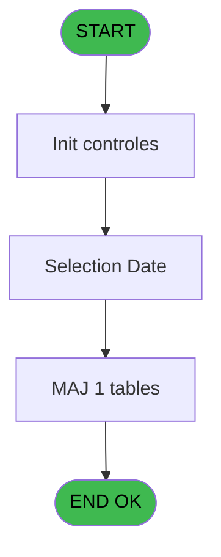
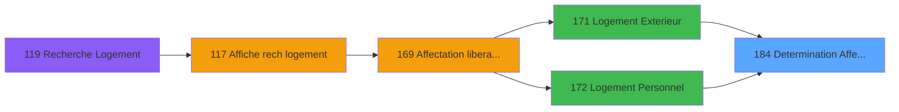

# PBG IDE 184 - Determination Affectation

> **Analyse**: Phases 1-4 2026-02-03 10:01 -> 10:01 (21s) | Assemblage 10:01
> **Pipeline**: V7.2 Enrichi
> **Structure**: 4 onglets (Resume | Ecrans | Donnees | Connexions)

<!-- TAB:Resume -->

## 1. FICHE D'IDENTITE

| Attribut | Valeur |
|----------|--------|
| Projet | PBG |
| IDE Position | 184 |
| Nom Programme | Determination Affectation |
| Fichier source | `Prg_184.xml` |
| Domaine metier | General |
| Taches | 7 (1 ecrans visibles) |
| Tables modifiees | 1 |
| Programmes appeles | 1 |

## 2. DESCRIPTION FONCTIONNELLE

**Determination Affectation** assure la gestion complete de ce processus, accessible depuis [Logement Client (IDE 0)](PBG-IDE-0.md), [Logement Exterieur (IDE 0)](PBG-IDE-0.md), [Logement Personnel (IDE 0)](PBG-IDE-0.md), [Logement Exterieur (IDE 171)](PBG-IDE-171.md), [Logement Personnel (IDE 172)](PBG-IDE-172.md), [Logement Client (IDE 173)](PBG-IDE-173.md), [Logement Client pms-626 (IDE 174)](PBG-IDE-174.md), [Logement Client (IDE 385)](PBG-IDE-385.md).

Le flux de traitement s'organise en **3 blocs fonctionnels** :

- **Traitement** (5 taches) : traitements metier divers
- **Creation** (1 tache) : insertion d'enregistrements en base (mouvements, prestations)
- **Consultation** (1 tache) : ecrans de recherche, selection et consultation

**Donnees modifiees** : 1 tables en ecriture (hebergement______heb).

Detail : phases du traitement

#### Phase 1 : Traitement (5 taches)

- **184** - Determination Affectation
- **184.2** - Eclatage Hebergement
- **184.2.1** - Lecture Hebergement
- **184.2.2** - Mise à Jour Charnière
- **184.3** - Modification Hebergement

#### Phase 2 : Consultation (1 tache)

- **184.1** - Selection Date **[[ECRAN]](#ecran-t2)**

#### Phase 3 : Creation (1 tache)

- **184.2.3** - Creation Charnière

#### Tables impactees

| Table | Operations | Role metier |
|-------|-----------|-------------|
| hebergement______heb | R/**W** (4 usages) | Hebergement (chambres) |

## 3. BLOCS FONCTIONNELS

### 3.1 Traitement (5 taches)

Traitements internes.

---

#### 184 - Determination Affectation

**Role** : Traitement : Determination Affectation.

4 sous-taches directes

| Tache | Nom | Bloc |
|-------|-----|------|
| [184.2](#t3) | Eclatage Hebergement | Traitement |
| [184.2.1](#t4) | Lecture Hebergement | Traitement |
| [184.2.2](#t5) | Mise à Jour Charnière | Traitement |
| [184.3](#t8) | Modification Hebergement | Traitement |

---

#### 184.2 - Eclatage Hebergement

**Role** : Traitement : Eclatage Hebergement.

---

#### 184.2.1 - Lecture Hebergement

**Role** : Traitement : Lecture Hebergement.

---

#### 184.2.2 - Mise à Jour Charnière

**Role** : Traitement : Mise à Jour Charnière.
**Variables liees** : R (W0-Date Charnière), S (W0-Heure Charnière)

---

#### 184.3 - Modification Hebergement

**Role** : Traitement : Modification Hebergement.

### 3.2 Consultation (1 tache)

Ecrans de recherche et consultation.

---

#### 184.1 - Selection Date [[ECRAN]](#ecran-t2)

**Role** : Selection par l'operateur : Selection Date.
**Ecran** : 450 x 84 DLU (MDI) | [Voir mockup](#ecran-t2)
**Variables liees** : F (P0-Date Debut), H (P0-Date Fin), J (P0-Selection Choix), R (W0-Date Charnière)

### 3.3 Creation (1 tache)

Insertion de nouveaux enregistrements en base.

---

#### 184.2.3 - Creation Charnière

**Role** : Creation d'enregistrement : Creation Charnière.
**Variables liees** : R (W0-Date Charnière), S (W0-Heure Charnière)

## 5. REGLES METIER

*(Aucune regle metier identifiee)*

## 6. CONTEXTE

- **Appele par**: [Logement Client (IDE 0)](PBG-IDE-0.md), [Logement Exterieur (IDE 0)](PBG-IDE-0.md), [Logement Personnel (IDE 0)](PBG-IDE-0.md), [Logement Exterieur (IDE 171)](PBG-IDE-171.md), [Logement Personnel (IDE 172)](PBG-IDE-172.md), [Logement Client (IDE 173)](PBG-IDE-173.md), [Logement Client pms-626 (IDE 174)](PBG-IDE-174.md), [Logement Client (IDE 385)](PBG-IDE-385.md)
- **Appelle**: 1 programmes | **Tables**: 4 (W:1 R:2 L:2) | **Taches**: 7 | **Expressions**: 8

<!-- TAB:Ecrans -->

## 8. ECRANS

### 8.1 Forms visibles (1 / 7)

| # | Position | Tache | Nom | Type | Largeur | Hauteur | Bloc |
|---|----------|-------|-----|------|---------|---------|------|
| 1 | 184.1 | 184.1 | Selection Date | MDI | 450 | 84 | Consultation |

### 8.2 Mockups Ecrans

---

#### 184.1 - Selection Date
**Tache** : [184.1](#t2) | **Type** : MDI | **Dimensions** : 450 x 84 DLU
**Bloc** : Consultation | **Titre IDE** : Selection Date

<!-- FORM-DATA:
{
    "width":  450,
    "vFactor":  8,
    "type":  "MDI",
    "hFactor":  8,
    "controls":  [
                     {
                         "x":  77,
                         "type":  "label",
                         "var":  "",
                         "y":  8,
                         "w":  293,
                         "fmt":  "",
                         "name":  "",
                         "h":  45,
                         "color":  "",
                         "text":  "",
                         "parent":  null
                     },
                     {
                         "x":  80,
                         "type":  "label",
                         "var":  "",
                         "y":  9,
                         "w":  288,
                         "fmt":  "",
                         "name":  "",
                         "h":  43,
                         "color":  "",
                         "text":  "",
                         "parent":  null
                     },
                     {
                         "x":  134,
                         "type":  "label",
                         "var":  "",
                         "y":  15,
                         "w":  173,
                         "fmt":  "",
                         "name":  "",
                         "h":  8,
                         "color":  "",
                         "text":  "Nouveau Logement !!",
                         "parent":  null
                     },
                     {
                         "x":  99,
                         "type":  "label",
                         "var":  "",
                         "y":  32,
                         "w":  102,
                         "fmt":  "",
                         "name":  "",
                         "h":  10,
                         "color":  "",
                         "text":  "A la Date du",
                         "parent":  null
                     },
                     {
                         "x":  0,
                         "type":  "label",
                         "var":  "",
                         "y":  60,
                         "w":  447,
                         "fmt":  "",
                         "name":  "",
                         "h":  22,
                         "color":  "",
                         "text":  "",
                         "parent":  null
                     },
                     {
                         "x":  215,
                         "type":  "edit",
                         "var":  "",
                         "y":  31,
                         "w":  126,
                         "fmt":  "DD/MM/YYYYZ",
                         "name":  "",
                         "h":  10,
                         "color":  "110",
                         "text":  "",
                         "parent":  null
                     },
                     {
                         "x":  286,
                         "type":  "button",
                         "var":  "",
                         "y":  62,
                         "w":  154,
                         "fmt":  "\u0026Abandonner",
                         "name":  "",
                         "h":  18,
                         "color":  "",
                         "text":  "",
                         "parent":  6
                     },
                     {
                         "x":  5,
                         "type":  "button",
                         "var":  "",
                         "y":  62,
                         "w":  154,
                         "fmt":  "\u0026Ok",
                         "name":  "",
                         "h":  18,
                         "color":  "",
                         "text":  "",
                         "parent":  6
                     }
                 ],
    "taskId":  "184.1",
    "height":  84
}
-->

<strong>Champs : 1 champs</strong>

| Pos (x,y) | Nom | Variable | Type |
|-----------|-----|----------|------|
| 215,31 | DD/MM/YYYYZ | - | edit |

<strong>Boutons : 2 boutons</strong>

| Bouton | Pos (x,y) | Action |
|--------|-----------|--------|
| Abandonner | 286,62 | Annule et retour au menu |
| Ok | 5,62 | Valide la saisie et enregistre |

## 9. NAVIGATION

Ecran unique: **Selection Date**

### 9.3 Structure hierarchique (7 taches)

| Position | Tache | Type | Dimensions | Bloc |
|----------|-------|------|------------|------|
| **184.1** | [**Determination Affectation** (184)](#t1) | MDI | - | Traitement |
| 184.1.1 | [Eclatage Hebergement (184.2)](#t3) | MDI | - | |
| 184.1.2 | [Lecture Hebergement (184.2.1)](#t4) | MDI | - | |
| 184.1.3 | [Mise à Jour Charnière (184.2.2)](#t5) | MDI | - | |
| 184.1.4 | [Modification Hebergement (184.3)](#t8) | MDI | - | |
| **184.2** | [**Selection Date** (184.1)](#t2) [mockup](#ecran-t2) | MDI | 450x84 | Consultation |
| **184.3** | [**Creation Charnière** (184.2.3)](#t6) | MDI | - | Creation |

### 9.4 Algorigramme

> **Legende**: Vert = START/END OK | Rouge = END KO | Bleu = Decisions
> *Algorigramme auto-genere. Utiliser `/algorigramme` pour une synthese metier detaillee.*

<!-- TAB:Donnees -->

## 10. TABLES

### Tables utilisees (4)

| ID | Nom | Description | Type | R | W | L | Usages |
|----|-----|-------------|------|---|---|---|--------|
| 30 | gm-recherche_____gmr | Index de recherche | DB | R |   |   | 1 |
| 34 | hebergement______heb | Hebergement (chambres) | DB | R | **W** |   | 4 |
| 103 | logement_client__loc |  | DB |   |   | L | 3 |
| 983 | Table_983 |  | MEM |   |   | L | 2 |

### Colonnes par table (2 / 2 tables avec colonnes identifiees)

Table 30 - gm-recherche_____gmr (R) - 1 usages

| Lettre | Variable | Acces | Type |
|--------|----------|-------|------|
| A | P0-Code Societe | R | Alpha |
| B | P0-Code Langue | R | Alpha |
| C | P0-Societe | R | Alpha |
| D | P0-Numero Compte | R | Numeric |
| E | P0-Filiation Compte | R | Numeric |
| F | P0-Date Debut | R | Date |
| G | P0-Heure Debut | R | Alpha |
| H | P0-Date Fin | R | Date |
| I | P0-Heure Fin | R | Alpha |
| J | P0-Selection Choix | R | Alpha |
| K | P0-Nom Recherche | R | Alpha |
| L | P0-Nom Logement destination | R | Alpha |
| M | P0-Occupation Std | R | Numeric |
| N | P0-Type Remplissage | R | Alpha |
| O | P0-Type Occupation | R | Alpha |
| P | P0-Logement anciennement OCCUP | R | Alpha |
| Q | W0-Accord Suite | R | Logical |
| R | W0-Date Charnière | R | Date |
| S | W0-Heure Charnière | R | Alpha |
| T | V.Num chambre avant | R | Alpha |
| U | v.Intervention Urgente? | R | Logical |

Table 34 - hebergement______heb (R/**W**) - 4 usages

*Table utilisee uniquement en Link ou aucune colonne Real identifiee dans le DataView.*

## 11. VARIABLES

### 11.1 Variables de session (2)

Variables persistantes pendant toute la session.

| Lettre | Nom | Type | Usage dans |
|--------|-----|------|-----------|
| T | V.Num chambre avant | Alpha | - |
| U | v.Intervention Urgente? | Logical | - |

### 11.2 Autres (19)

Variables diverses.

| Lettre | Nom | Type | Usage dans |
|--------|-----|------|-----------|
| A | P0-Code Societe | Alpha | - |
| B | P0-Code Langue | Alpha | - |
| C | P0-Societe | Alpha | 1x refs |
| D | P0-Numero Compte | Numeric | 1x refs |
| E | P0-Filiation Compte | Numeric | 1x refs |
| F | P0-Date Debut | Date | 2x refs |
| G | P0-Heure Debut | Alpha | - |
| H | P0-Date Fin | Date | - |
| I | P0-Heure Fin | Alpha | - |
| J | P0-Selection Choix | Alpha | - |
| K | P0-Nom Recherche | Alpha | - |
| L | P0-Nom Logement destination | Alpha | - |
| M | P0-Occupation Std | Numeric | - |
| N | P0-Type Remplissage | Alpha | - |
| O | P0-Type Occupation | Alpha | - |
| P | P0-Logement anciennement OCCUP | Alpha | - |
| Q | W0-Accord Suite | Logical | 3x refs |
| R | W0-Date Charnière | Date | [184.2.2](#t5), [184.2.3](#t6) |
| S | W0-Heure Charnière | Alpha | - |

Toutes les 21 variables (liste complete)

| Cat | Lettre | Nom Variable | Type |
|-----|--------|--------------|------|
| V. | **T** | V.Num chambre avant | Alpha |
| V. | **U** | v.Intervention Urgente? | Logical |
| Autre | **A** | P0-Code Societe | Alpha |
| Autre | **B** | P0-Code Langue | Alpha |
| Autre | **C** | P0-Societe | Alpha |
| Autre | **D** | P0-Numero Compte | Numeric |
| Autre | **E** | P0-Filiation Compte | Numeric |
| Autre | **F** | P0-Date Debut | Date |
| Autre | **G** | P0-Heure Debut | Alpha |
| Autre | **H** | P0-Date Fin | Date |
| Autre | **I** | P0-Heure Fin | Alpha |
| Autre | **J** | P0-Selection Choix | Alpha |
| Autre | **K** | P0-Nom Recherche | Alpha |
| Autre | **L** | P0-Nom Logement destination | Alpha |
| Autre | **M** | P0-Occupation Std | Numeric |
| Autre | **N** | P0-Type Remplissage | Alpha |
| Autre | **O** | P0-Type Occupation | Alpha |
| Autre | **P** | P0-Logement anciennement OCCUP | Alpha |
| Autre | **Q** | W0-Accord Suite | Logical |
| Autre | **R** | W0-Date Charnière | Date |
| Autre | **S** | W0-Heure Charnière | Alpha |

## 12. EXPRESSIONS

**8 / 8 expressions decodees (100%)**

### 12.1 Repartition par type

| Type | Expressions | Regles |
|------|-------------|--------|
| CONDITION | 3 | 0 |
| OTHER | 5 | 0 |

### 12.2 Expressions cles par type

#### CONDITION (3 expressions)

| Type | IDE | Expression | Regle |
|------|-----|------------|-------|
| CONDITION | 3 | `W0-Accord Suite [Q] AND W0-Date Charnière [R]=P0-Date Debut [F]` | - |
| CONDITION | 2 | `W0-Accord Suite [Q] AND W0-Date Charnière [R]<>P0-Date Debut [F]` | - |
| CONDITION | 8 | `[BA]='00/00/0000'DATE` | - |

#### OTHER (5 expressions)

| Type | IDE | Expression | Regle |
|------|-----|------------|-------|
| OTHER | 6 | `P0-Filiation Compte [E]` | - |
| OTHER | 7 | `P0-Nom Logement destin... [L]` | - |
| OTHER | 5 | `P0-Numero Compte [D]` | - |
| OTHER | 1 | `W0-Accord Suite [Q]` | - |
| OTHER | 4 | `P0-Societe [C]` | - |

<!-- TAB:Connexions -->

## 13. GRAPHE D'APPELS

### 13.1 Chaine depuis Main (Callers)

Main -> ... -> [Logement Client (IDE 0)](PBG-IDE-0.md) -> **Determination Affectation (IDE 184)**

Main -> ... -> [Logement Exterieur (IDE 0)](PBG-IDE-0.md) -> **Determination Affectation (IDE 184)**

Main -> ... -> [Logement Personnel (IDE 0)](PBG-IDE-0.md) -> **Determination Affectation (IDE 184)**

Main -> ... -> [Logement Exterieur (IDE 171)](PBG-IDE-171.md) -> **Determination Affectation (IDE 184)**

Main -> ... -> [Logement Personnel (IDE 172)](PBG-IDE-172.md) -> **Determination Affectation (IDE 184)**

Main -> ... -> [Logement Client (IDE 173)](PBG-IDE-173.md) -> **Determination Affectation (IDE 184)**

Main -> ... -> [Logement Client pms-626 (IDE 174)](PBG-IDE-174.md) -> **Determination Affectation (IDE 184)**

Main -> ... -> [Logement Client (IDE 385)](PBG-IDE-385.md) -> **Determination Affectation (IDE 184)**

### 13.2 Callers

| IDE | Nom Programme | Nb Appels |
|-----|---------------|-----------|
| [0](PBG-IDE-0.md) | Logement Client | 1 |
| [0](PBG-IDE-0.md) | Logement Exterieur | 1 |
| [0](PBG-IDE-0.md) | Logement Personnel | 1 |
| [171](PBG-IDE-171.md) | Logement Exterieur | 1 |
| [172](PBG-IDE-172.md) | Logement Personnel | 1 |
| [173](PBG-IDE-173.md) | Logement Client | 1 |
| [174](PBG-IDE-174.md) | Logement Client pms-626 | 1 |
| [385](PBG-IDE-385.md) | Logement Client | 1 |

### 13.3 Callees (programmes appeles)

### 13.4 Detail Callees avec contexte

| IDE | Nom Programme | Appels | Contexte |
|-----|---------------|--------|----------|
| [185](PBG-IDE-185.md) | Verification Adherents | 1 | Controle/validation |

## 14. RECOMMANDATIONS MIGRATION

### 14.1 Profil du programme

| Metrique | Valeur | Impact migration |
|----------|--------|-----------------|
| Lignes de logique | 283 | Taille moyenne |
| Expressions | 8 | Peu de logique |
| Tables WRITE | 1 | Impact faible |
| Sous-programmes | 1 | Peu de dependances |
| Ecrans visibles | 1 | Ecran unique ou traitement batch |
| Code desactive | 0% (0 / 283) | Code sain |
| Regles metier | 0 | Pas de regle identifiee |

### 14.2 Plan de migration par bloc

#### Traitement (5 taches: 0 ecran, 5 traitements)

- **Strategie** : 5 service(s) backend injectable(s) (Domain Services).
- 1 sous-programme(s) a migrer ou a reutiliser depuis les services existants.
- Decomposer les taches en services unitaires testables.

#### Consultation (1 tache: 1 ecran, 0 traitement)

- **Strategie** : Composants de recherche/selection en modales.
- 1 ecran : Selection Date

#### Creation (1 tache: 0 ecran, 1 traitement)

- **Strategie** : Repository pattern avec Entity Framework Core.
- Insertion via `IRepository<T>.CreateAsync()`

### 14.3 Dependances critiques

| Dependance | Type | Appels | Impact |
|------------|------|--------|--------|
| hebergement______heb | Table WRITE (Database) | 3x | Schema + repository |
| [Verification Adherents (IDE 185)](PBG-IDE-185.md) | Sous-programme | 1x | Normale - Controle/validation |

---
*Spec DETAILED generee par Pipeline V7.2 - 2026-02-03 10:02*
