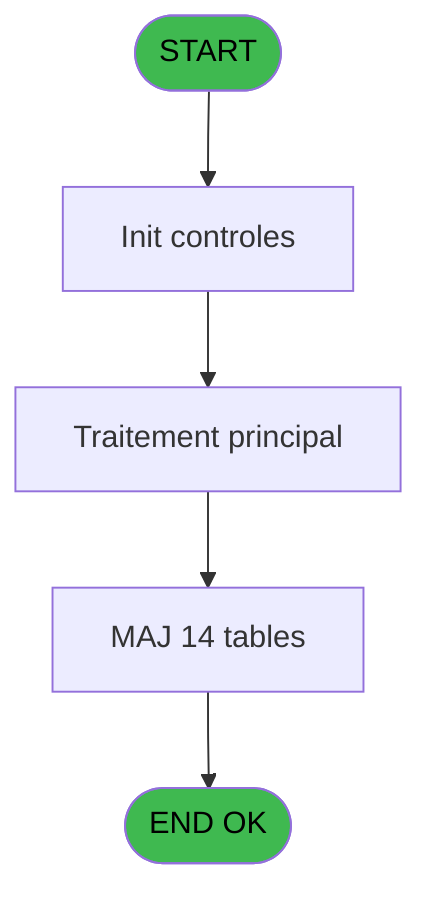

# PBG IDE 186 - Suppression Personnel

> **Analyse**: Phases 1-4 2026-02-03 10:02 -> 10:02 (21s) | Assemblage 10:03
> **Pipeline**: V7.2 Enrichi
> **Structure**: 4 onglets (Resume | Ecrans | Donnees | Connexions)

<!-- TAB:Resume -->

## 1. FICHE D'IDENTITE

| Attribut | Valeur |
|----------|--------|
| Projet | PBG |
| IDE Position | 186 |
| Nom Programme | Suppression Personnel |
| Fichier source | `Prg_186.xml` |
| Domaine metier | General |
| Taches | 15 (1 ecrans visibles) |
| Tables modifiees | 14 |
| Programmes appeles | 0 |

## 2. DESCRIPTION FONCTIONNELLE

**Suppression Personnel** assure la gestion complete de ce processus, accessible depuis [Sejours personnel SubForm (IDE 0)](PBG-IDE-0.md), [Sejours personnel CallTask (IDE 196)](PBG-IDE-196.md).

Le flux de traitement s'organise en **2 blocs fonctionnels** :

- **Traitement** (14 taches) : traitements metier divers
- **Creation** (1 tache) : insertion d'enregistrements en base (mouvements, prestations)

**Donnees modifiees** : 14 tables en ecriture (voyages__________voy, gm-recherche_____gmr, gm-complet_______gmc, prestations______pre, hebergement______heb, personnel_go______go, compte_gm________cgm, historik_station, fichier_messagerie, fichier_validation, crew, ez_card, tempo_totaux_qualites, pv_globalca_prepaid).

Detail : phases du traitement

#### Phase 1 : Traitement (14 taches)

- **186** - Veuillez patientez... **[[ECRAN]](#ecran-t1)**
- **186.1** - Suppression 10
- **186.2** - Suppression 10
- **186.3** - Suppression 10
- **186.4** - Suppression 10
- **186.5** - Suppression 10
- **186.6** - Suppression 10
- **186.7** - Suppression 10
- **186.8** - Suppression 10
- **186.9** - Suppression 10
- **186.11** - Suppression 10
- **186.12** - Suppression 10
- **186.13** - Suppression 10
- **186.14** - Suppression 10

#### Phase 2 : Creation (1 tache)

- **186.10** - Creation Historique

#### Tables impactees

| Table | Operations | Role metier |
|-------|-----------|-------------|
| tempo_totaux_qualites | **W** (1 usages) | Table temporaire ecran |
| historik_station | **W** (1 usages) | Historique / journal |
| ez_card | **W** (1 usages) |  |
| fichier_validation | **W** (1 usages) |  |
| compte_gm________cgm | **W** (1 usages) | Comptes GM (generaux) |
| gm-recherche_____gmr | **W** (1 usages) | Index de recherche |
| crew | **W** (1 usages) |  |
| gm-complet_______gmc | **W** (1 usages) |  |
| prestations______pre | **W** (1 usages) | Prestations/services vendus |
| personnel_go______go | **W** (1 usages) |  |
| hebergement______heb | **W** (1 usages) | Hebergement (chambres) |
| voyages__________voy | **W** (1 usages) |  |
| fichier_messagerie | **W** (1 usages) |  |
| pv_globalca_prepaid | **W** (1 usages) |  |

## 3. BLOCS FONCTIONNELS

### 3.1 Traitement (14 taches)

Traitements internes.

---

#### 186 - Veuillez patientez... [[ECRAN]](#ecran-t1)

**Role** : Tache d'orchestration : point d'entree du programme (14 sous-taches). Coordonne l'enchainement des traitements.
**Ecran** : 435 x 67 DLU (MDI) | [Voir mockup](#ecran-t1)

13 sous-taches directes

| Tache | Nom | Bloc |
|-------|-----|------|
| [186.1](#t2) | Suppression 10 | Traitement |
| [186.2](#t3) | Suppression 10 | Traitement |
| [186.3](#t4) | Suppression 10 | Traitement |
| [186.4](#t5) | Suppression 10 | Traitement |
| [186.5](#t6) | Suppression 10 | Traitement |
| [186.6](#t7) | Suppression 10 | Traitement |
| [186.7](#t8) | Suppression 10 | Traitement |
| [186.8](#t9) | Suppression 10 | Traitement |
| [186.9](#t10) | Suppression 10 | Traitement |
| [186.11](#t12) | Suppression 10 | Traitement |
| [186.12](#t13) | Suppression 10 | Traitement |
| [186.13](#t16) | Suppression 10 | Traitement |
| [186.14](#t20) | Suppression 10 | Traitement |

---

#### 186.1 - Suppression 10

**Role** : Traitement : Suppression 10.

---

#### 186.2 - Suppression 10

**Role** : Traitement : Suppression 10.

---

#### 186.3 - Suppression 10

**Role** : Traitement : Suppression 10.

---

#### 186.4 - Suppression 10

**Role** : Traitement : Suppression 10.

---

#### 186.5 - Suppression 10

**Role** : Traitement : Suppression 10.

---

#### 186.6 - Suppression 10

**Role** : Traitement : Suppression 10.

---

#### 186.7 - Suppression 10

**Role** : Traitement : Suppression 10.

---

#### 186.8 - Suppression 10

**Role** : Traitement : Suppression 10.

---

#### 186.9 - Suppression 10

**Role** : Traitement : Suppression 10.

---

#### 186.11 - Suppression 10

**Role** : Traitement : Suppression 10.

---

#### 186.12 - Suppression 10

**Role** : Traitement : Suppression 10.

---

#### 186.13 - Suppression 10

**Role** : Traitement : Suppression 10.

---

#### 186.14 - Suppression 10

**Role** : Traitement : Suppression 10.

### 3.2 Creation (1 tache)

Insertion de nouveaux enregistrements en base.

---

#### 186.10 - Creation Historique

**Role** : Consultation/chargement : Creation Historique.

## 5. REGLES METIER

*(Aucune regle metier identifiee)*

## 6. CONTEXTE

- **Appele par**: [Sejours personnel SubForm (IDE 0)](PBG-IDE-0.md), [Sejours personnel CallTask (IDE 196)](PBG-IDE-196.md)
- **Appelle**: 0 programmes | **Tables**: 14 (W:14 R:0 L:0) | **Taches**: 15 | **Expressions**: 6

<!-- TAB:Ecrans -->

## 8. ECRANS

### 8.1 Forms visibles (1 / 15)

| # | Position | Tache | Nom | Type | Largeur | Hauteur | Bloc |
|---|----------|-------|-----|------|---------|---------|------|
| 1 | 186 | 186 | Veuillez patientez... | MDI | 435 | 67 | Traitement |

### 8.2 Mockups Ecrans

---

#### 186 - Veuillez patientez...
**Tache** : [186](#t1) | **Type** : MDI | **Dimensions** : 435 x 67 DLU
**Bloc** : Traitement | **Titre IDE** : Veuillez patientez...

<!-- FORM-DATA:
{
    "width":  435,
    "vFactor":  8,
    "type":  "MDI",
    "hFactor":  8,
    "controls":  [
                     {
                         "x":  2,
                         "type":  "label",
                         "var":  "",
                         "y":  1,
                         "w":  426,
                         "fmt":  "",
                         "name":  "",
                         "h":  37,
                         "color":  "",
                         "text":  "",
                         "parent":  null
                     },
                     {
                         "x":  149,
                         "type":  "label",
                         "var":  "",
                         "y":  14,
                         "w":  211,
                         "fmt":  "",
                         "name":  "",
                         "h":  8,
                         "color":  "7",
                         "text":  "Traitement en cours...",
                         "parent":  1
                     },
                     {
                         "x":  2,
                         "type":  "label",
                         "var":  "",
                         "y":  38,
                         "w":  426,
                         "fmt":  "",
                         "name":  "",
                         "h":  27,
                         "color":  "",
                         "text":  "",
                         "parent":  null
                     },
                     {
                         "x":  122,
                         "type":  "label",
                         "var":  "",
                         "y":  46,
                         "w":  186,
                         "fmt":  "",
                         "name":  "",
                         "h":  8,
                         "color":  "",
                         "text":  "Suppression du GO",
                         "parent":  4
                     },
                     {
                         "x":  10,
                         "type":  "image",
                         "var":  "",
                         "y":  4,
                         "w":  77,
                         "fmt":  "",
                         "name":  "",
                         "h":  29,
                         "color":  "",
                         "text":  "",
                         "parent":  1
                     }
                 ],
    "taskId":  "186",
    "height":  67
}
-->

## 9. NAVIGATION

Ecran unique: **Veuillez patientez...**

### 9.3 Structure hierarchique (15 taches)

| Position | Tache | Type | Dimensions | Bloc |
|----------|-------|------|------------|------|
| **186.1** | [**Veuillez patientez...** (186)](#t1) [mockup](#ecran-t1) | MDI | 435x67 | Traitement |
| 186.1.1 | [Suppression 10 (186.1)](#t2) | MDI | - | |
| 186.1.2 | [Suppression 10 (186.2)](#t3) | MDI | - | |
| 186.1.3 | [Suppression 10 (186.3)](#t4) | MDI | - | |
| 186.1.4 | [Suppression 10 (186.4)](#t5) | MDI | - | |
| 186.1.5 | [Suppression 10 (186.5)](#t6) | MDI | - | |
| 186.1.6 | [Suppression 10 (186.6)](#t7) | MDI | - | |
| 186.1.7 | [Suppression 10 (186.7)](#t8) | MDI | - | |
| 186.1.8 | [Suppression 10 (186.8)](#t9) | MDI | - | |
| 186.1.9 | [Suppression 10 (186.9)](#t10) | MDI | - | |
| 186.1.10 | [Suppression 10 (186.11)](#t12) | MDI | - | |
| 186.1.11 | [Suppression 10 (186.12)](#t13) | MDI | - | |
| 186.1.12 | [Suppression 10 (186.13)](#t16) | MDI | - | |
| 186.1.13 | [Suppression 10 (186.14)](#t20) | MDI | - | |
| **186.2** | [**Creation Historique** (186.10)](#t11) | MDI | - | Creation |

### 9.4 Algorigramme

> **Legende**: Vert = START/END OK | Rouge = END KO | Bleu = Decisions
> *Algorigramme auto-genere. Utiliser `/algorigramme` pour une synthese metier detaillee.*

<!-- TAB:Donnees -->

## 10. TABLES

### Tables utilisees (14)

| ID | Nom | Description | Type | R | W | L | Usages |
|----|-----|-------------|------|---|---|---|--------|
| 29 | voyages__________voy |  | DB |   | **W** |   | 1 |
| 30 | gm-recherche_____gmr | Index de recherche | DB |   | **W** |   | 1 |
| 31 | gm-complet_______gmc |  | DB |   | **W** |   | 1 |
| 33 | prestations______pre | Prestations/services vendus | DB |   | **W** |   | 1 |
| 34 | hebergement______heb | Hebergement (chambres) | DB |   | **W** |   | 1 |
| 35 | personnel_go______go |  | DB |   | **W** |   | 1 |
| 47 | compte_gm________cgm | Comptes GM (generaux) | DB |   | **W** |   | 1 |
| 88 | historik_station | Historique / journal | DB |   | **W** |   | 1 |
| 123 | fichier_messagerie |  | DB |   | **W** |   | 1 |
| 131 | fichier_validation |  | DB |   | **W** |   | 1 |
| 281 | crew |  | DB |   | **W** |   | 1 |
| 312 | ez_card |  | DB |   | **W** |   | 1 |
| 458 | tempo_totaux_qualites | Table temporaire ecran | DB |   | **W** |   | 1 |
| 832 | pv_globalca_prepaid |  | DB |   | **W** |   | 1 |

### Colonnes par table (0 / 14 tables avec colonnes identifiees)

Table 29 - voyages__________voy (**W**) - 1 usages

*Table utilisee uniquement en Link ou aucune colonne Real identifiee dans le DataView.*

Table 30 - gm-recherche_____gmr (**W**) - 1 usages

*Table utilisee uniquement en Link ou aucune colonne Real identifiee dans le DataView.*

Table 31 - gm-complet_______gmc (**W**) - 1 usages

*Table utilisee uniquement en Link ou aucune colonne Real identifiee dans le DataView.*

Table 33 - prestations______pre (**W**) - 1 usages

*Table utilisee uniquement en Link ou aucune colonne Real identifiee dans le DataView.*

Table 34 - hebergement______heb (**W**) - 1 usages

*Table utilisee uniquement en Link ou aucune colonne Real identifiee dans le DataView.*

Table 35 - personnel_go______go (**W**) - 1 usages

*Table utilisee uniquement en Link ou aucune colonne Real identifiee dans le DataView.*

Table 47 - compte_gm________cgm (**W**) - 1 usages

*Table utilisee uniquement en Link ou aucune colonne Real identifiee dans le DataView.*

Table 88 - historik_station (**W**) - 1 usages

*Table utilisee uniquement en Link ou aucune colonne Real identifiee dans le DataView.*

Table 123 - fichier_messagerie (**W**) - 1 usages

*Table utilisee uniquement en Link ou aucune colonne Real identifiee dans le DataView.*

Table 131 - fichier_validation (**W**) - 1 usages

*Table utilisee uniquement en Link ou aucune colonne Real identifiee dans le DataView.*

Table 281 - crew (**W**) - 1 usages

*Table utilisee uniquement en Link ou aucune colonne Real identifiee dans le DataView.*

Table 312 - ez_card (**W**) - 1 usages

*Table utilisee uniquement en Link ou aucune colonne Real identifiee dans le DataView.*

Table 458 - tempo_totaux_qualites (**W**) - 1 usages

*Table utilisee uniquement en Link ou aucune colonne Real identifiee dans le DataView.*

Table 832 - pv_globalca_prepaid (**W**) - 1 usages

*Table utilisee uniquement en Link ou aucune colonne Real identifiee dans le DataView.*

## 11. VARIABLES

*(Programme sans variables locales mappees)*

## 12. EXPRESSIONS

**6 / 6 expressions decodees (100%)**

### 12.1 Repartition par type

| Type | Expressions | Regles |
|------|-------------|--------|
| CONSTANTE | 1 | 0 |
| OTHER | 5 | 0 |

### 12.2 Expressions cles par type

#### CONSTANTE (1 expressions)

| Type | IDE | Expression | Regle |
|------|-----|------------|-------|
| CONSTANTE | 3 | `'S'` | - |

#### OTHER (5 expressions)

| Type | IDE | Expression | Regle |
|------|-----|------------|-------|
| OTHER | 5 | `GetParam ('NRO_CPTE')` | - |
| OTHER | 6 | `GetParam ('FIL_CPTE')` | - |
| OTHER | 4 | `GetParam ('SOCIETE')` | - |
| OTHER | 1 | `SetCrsr (1)` | - |
| OTHER | 2 | `SetCrsr (2)` | - |

<!-- TAB:Connexions -->

## 13. GRAPHE D'APPELS

### 13.1 Chaine depuis Main (Callers)

Main -> ... -> [Sejours personnel SubForm (IDE 0)](PBG-IDE-0.md) -> **Suppression Personnel (IDE 186)**

Main -> ... -> [Sejours personnel CallTask (IDE 196)](PBG-IDE-196.md) -> **Suppression Personnel (IDE 186)**

### 13.2 Callers

| IDE | Nom Programme | Nb Appels |
|-----|---------------|-----------|
| [0](PBG-IDE-0.md) | Sejours personnel SubForm | 1 |
| [196](PBG-IDE-196.md) | Sejours personnel CallTask | 1 |

### 13.3 Callees (programmes appeles)

### 13.4 Detail Callees avec contexte

| IDE | Nom Programme | Appels | Contexte |
|-----|---------------|--------|----------|
| - | (aucun) | - | - |

## 14. RECOMMANDATIONS MIGRATION

### 14.1 Profil du programme

| Metrique | Valeur | Impact migration |
|----------|--------|-----------------|
| Lignes de logique | 76 | Programme compact |
| Expressions | 6 | Peu de logique |
| Tables WRITE | 14 | Fort impact donnees |
| Sous-programmes | 0 | Peu de dependances |
| Ecrans visibles | 1 | Ecran unique ou traitement batch |
| Code desactive | 0% (0 / 76) | Code sain |
| Regles metier | 0 | Pas de regle identifiee |

### 14.2 Plan de migration par bloc

#### Traitement (14 taches: 1 ecran, 13 traitements)

- **Strategie** : Orchestrateur avec 1 ecrans (Razor/React) et 13 traitements backend (services).
- Les ecrans deviennent des composants UI, les traitements invisibles deviennent des services injectables.
- Decomposer les taches en services unitaires testables.

#### Creation (1 tache: 0 ecran, 1 traitement)

- **Strategie** : Repository pattern avec Entity Framework Core.
- Insertion via `IRepository<T>.CreateAsync()`

### 14.3 Dependances critiques

| Dependance | Type | Appels | Impact |
|------------|------|--------|--------|
| voyages__________voy | Table WRITE (Database) | 1x | Schema + repository |
| gm-recherche_____gmr | Table WRITE (Database) | 1x | Schema + repository |
| gm-complet_______gmc | Table WRITE (Database) | 1x | Schema + repository |
| prestations______pre | Table WRITE (Database) | 1x | Schema + repository |
| hebergement______heb | Table WRITE (Database) | 1x | Schema + repository |
| personnel_go______go | Table WRITE (Database) | 1x | Schema + repository |
| compte_gm________cgm | Table WRITE (Database) | 1x | Schema + repository |
| historik_station | Table WRITE (Database) | 1x | Schema + repository |
| fichier_messagerie | Table WRITE (Database) | 1x | Schema + repository |
| fichier_validation | Table WRITE (Database) | 1x | Schema + repository |
| crew | Table WRITE (Database) | 1x | Schema + repository |
| ez_card | Table WRITE (Database) | 1x | Schema + repository |
| tempo_totaux_qualites | Table WRITE (Database) | 1x | Schema + repository |
| pv_globalca_prepaid | Table WRITE (Database) | 1x | Schema + repository |

---
*Spec DETAILED generee par Pipeline V7.2 - 2026-02-03 10:03*
