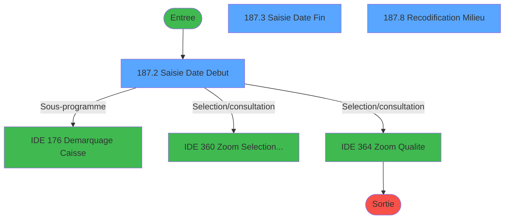
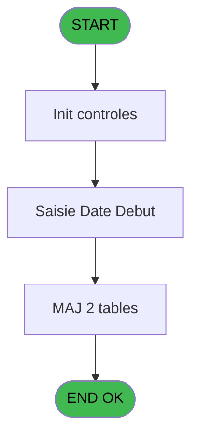
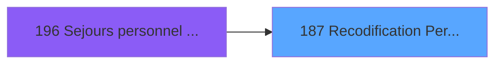
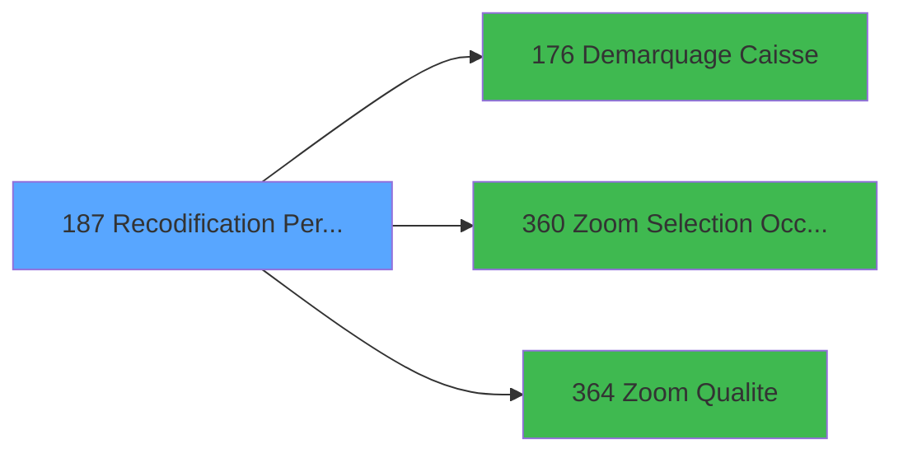

# PBG IDE 187 - Recodification Personnel

> **Analyse**: Phases 1-4 2026-02-03 10:03 -> 10:03 (21s) | Assemblage 10:03
> **Pipeline**: V7.2 Enrichi
> **Structure**: 4 onglets (Resume | Ecrans | Donnees | Connexions)

<!-- TAB:Resume -->

## 1. FICHE D'IDENTITE

| Attribut | Valeur |
|----------|--------|
| Projet | PBG |
| IDE Position | 187 |
| Nom Programme | Recodification Personnel |
| Fichier source | `Prg_187.xml` |
| Domaine metier | General |
| Taches | 21 (3 ecrans visibles) |
| Tables modifiees | 2 |
| Programmes appeles | 3 |

## 2. DESCRIPTION FONCTIONNELLE

**Recodification Personnel** assure la gestion complete de ce processus, accessible depuis [Sejours personnel SubForm (IDE 0)](PBG-IDE-0.md), [Sejours personnel CallTask (IDE 196)](PBG-IDE-196.md).

Le flux de traitement s'organise en **3 blocs fonctionnels** :

- **Traitement** (11 taches) : traitements metier divers
- **Creation** (8 taches) : insertion d'enregistrements en base (mouvements, prestations)
- **Saisie** (2 taches) : ecrans de saisie utilisateur (formulaires, champs, donnees)

**Donnees modifiees** : 2 tables en ecriture (hebergement______heb, historik_station).

**Logique metier** : 2 regles identifiees couvrant valeurs par defaut.

Detail : phases du traitement

#### Phase 1 : Traitement (11 taches)

- **187** - Recodification Personnel **[[ECRAN]](#ecran-t1)**
- **187.1** - Recuperation Periode
- **187.4** - Confirmation Recodification **[[ECRAN]](#ecran-t5)**
- **187.5** - Recodification Totale **[[ECRAN]](#ecran-t6)**
- **187.5.1** - Modification Hebergement
- **187.6** - Recodification Avant **[[ECRAN]](#ecran-t9)**
- **187.6.1** - Modification Hebergement
- **187.7** - Recodification Après **[[ECRAN]](#ecran-t13)**
- **187.7.1** - Modification Hebergement
- **187.8** - Recodification Milieu **[[ECRAN]](#ecran-t17)**
- **187.8.1** - Modification Hebergement

Delegue a : [Demarquage Caisse (IDE 176)](PBG-IDE-176.md)

#### Phase 2 : Saisie (2 taches)

- **187.2** - Saisie Date Debut **[[ECRAN]](#ecran-t3)**
- **187.3** - Saisie Date Fin **[[ECRAN]](#ecran-t4)**

#### Phase 3 : Creation (8 taches)

- **187.5.2** - Creation Historique
- **187.6.2** - Creation Hebergement
- **187.6.3** - Creation Historique
- **187.7.2** - Creation Hebergement
- **187.7.3** - Creation Historique
- **187.8.2** - Creation Hebergement
- **187.8.3** - Creation Hebergement
- **187.8.4** - Creation Historique

#### Tables impactees

| Table | Operations | Role metier |
|-------|-----------|-------------|
| hebergement______heb | R/**W** (9 usages) | Hebergement (chambres) |
| historik_station | **W** (4 usages) | Historique / journal |

## 3. BLOCS FONCTIONNELS

### 3.1 Traitement (11 taches)

Traitements internes.

---

#### 187 - Recodification Personnel [[ECRAN]](#ecran-t1)

**Role** : Tache d'orchestration : point d'entree du programme (11 sous-taches). Coordonne l'enchainement des traitements.
**Ecran** : 132 x 40 DLU (MDI) | [Voir mockup](#ecran-t1)

10 sous-taches directes

| Tache | Nom | Bloc |
|-------|-----|------|
| [187.1](#t2) | Recuperation Periode | Traitement |
| [187.4](#t5) | Confirmation Recodification **[[ECRAN]](#ecran-t5)** | Traitement |
| [187.5](#t6) | Recodification Totale **[[ECRAN]](#ecran-t6)** | Traitement |
| [187.5.1](#t7) | Modification Hebergement | Traitement |
| [187.6](#t9) | Recodification Avant **[[ECRAN]](#ecran-t9)** | Traitement |
| [187.6.1](#t10) | Modification Hebergement | Traitement |
| [187.7](#t13) | Recodification Après **[[ECRAN]](#ecran-t13)** | Traitement |
| [187.7.1](#t14) | Modification Hebergement | Traitement |
| [187.8](#t17) | Recodification Milieu **[[ECRAN]](#ecran-t17)** | Traitement |
| [187.8.1](#t18) | Modification Hebergement | Traitement |

---

#### 187.1 - Recuperation Periode

**Role** : Consultation/chargement : Recuperation Periode.

---

#### 187.4 - Confirmation Recodification [[ECRAN]](#ecran-t5)

**Role** : Traitement : Confirmation Recodification.
**Ecran** : 132 x 32 DLU (Modal) | [Voir mockup](#ecran-t5)

---

#### 187.5 - Recodification Totale [[ECRAN]](#ecran-t6)

**Role** : Traitement : Recodification Totale.
**Ecran** : 132 x 32 DLU (Modal) | [Voir mockup](#ecran-t6)

---

#### 187.5.1 - Modification Hebergement

**Role** : Traitement : Modification Hebergement.

---

#### 187.6 - Recodification Avant [[ECRAN]](#ecran-t9)

**Role** : Traitement : Recodification Avant.
**Ecran** : 132 x 32 DLU (Modal) | [Voir mockup](#ecran-t9)

---

#### 187.6.1 - Modification Hebergement

**Role** : Traitement : Modification Hebergement.

---

#### 187.7 - Recodification Après [[ECRAN]](#ecran-t13)

**Role** : Traitement : Recodification Après.
**Ecran** : 132 x 32 DLU (Modal) | [Voir mockup](#ecran-t13)

---

#### 187.7.1 - Modification Hebergement

**Role** : Traitement : Modification Hebergement.

---

#### 187.8 - Recodification Milieu [[ECRAN]](#ecran-t17)

**Role** : Traitement : Recodification Milieu.
**Ecran** : 132 x 32 DLU (Modal) | [Voir mockup](#ecran-t17)

---

#### 187.8.1 - Modification Hebergement

**Role** : Traitement : Modification Hebergement.

### 3.2 Saisie (2 taches)

L'operateur saisit les donnees de la transaction via 2 ecrans (Saisie Date Debut, Saisie Date Fin).

---

#### 187.2 - Saisie Date Debut [[ECRAN]](#ecran-t3)

**Role** : Saisie des donnees : Saisie Date Debut.
**Ecran** : 536 x 89 DLU (MDI) | [Voir mockup](#ecran-t3)
**Variables liees** : A (P0-Date Debut), B (P0-Heure Debut), G (W0-Date Debut), H (W0-Heure Debut), I (W0-Date Deb.Prevue)

---

#### 187.3 - Saisie Date Fin [[ECRAN]](#ecran-t4)

**Role** : Saisie des donnees : Saisie Date Fin.
**Ecran** : 414 x 86 DLU (MDI) | [Voir mockup](#ecran-t4)
**Variables liees** : A (P0-Date Debut), G (W0-Date Debut), I (W0-Date Deb.Prevue), K (W0-Date Fin), M (W0-Date Fin Prevue)

### 3.3 Creation (8 taches)

Insertion de nouveaux enregistrements en base.

---

#### 187.5.2 - Creation Historique

**Role** : Consultation/chargement : Creation Historique.

---

#### 187.6.2 - Creation Hebergement

**Role** : Creation d'enregistrement : Creation Hebergement.

---

#### 187.6.3 - Creation Historique

**Role** : Consultation/chargement : Creation Historique.

---

#### 187.7.2 - Creation Hebergement

**Role** : Creation d'enregistrement : Creation Hebergement.

---

#### 187.7.3 - Creation Historique

**Role** : Consultation/chargement : Creation Historique.

---

#### 187.8.2 - Creation Hebergement

**Role** : Creation d'enregistrement : Creation Hebergement.

---

#### 187.8.3 - Creation Hebergement

**Role** : Creation d'enregistrement : Creation Hebergement.

---

#### 187.8.4 - Creation Historique

**Role** : Consultation/chargement : Creation Historique.

## 5. REGLES METIER

2 regles identifiees:

### Saisie (2 regles)

#### [RM-001] Valeur par defaut si W0-Date Deb.Prevue [I] est vide

| Element | Detail |
|---------|--------|
| **Condition** | `W0-Date Deb.Prevue [I]=''` |
| **Si vrai** | 'U3' |
| **Si faux** | 'U2h') |
| **Variables** | I (W0-Date Deb.Prevue) |
| **Expression source** | Expression 6 : `IF (W0-Date Deb.Prevue [I]='','U3','U2h')` |
| **Exemple** | Si W0-Date Deb.Prevue [I]='' → 'U3'. Sinon → 'U2h') |
| **Impact** | Bloc Saisie |

#### [RM-002] Valeur par defaut si W0-Date Fin Prevue [M] est vide

| Element | Detail |
|---------|--------|
| **Condition** | `W0-Date Fin Prevue [M]=''` |
| **Si vrai** | 'U3' |
| **Si faux** | 'U2h') |
| **Variables** | K (W0-Date Fin), M (W0-Date Fin Prevue) |
| **Expression source** | Expression 7 : `IF (W0-Date Fin Prevue [M]='','U3','U2h')` |
| **Exemple** | Si W0-Date Fin Prevue [M]='' → 'U3'. Sinon → 'U2h') |
| **Impact** | Bloc Saisie |

## 6. CONTEXTE

- **Appele par**: [Sejours personnel SubForm (IDE 0)](PBG-IDE-0.md), [Sejours personnel CallTask (IDE 196)](PBG-IDE-196.md)
- **Appelle**: 3 programmes | **Tables**: 3 (W:2 R:2 L:0) | **Taches**: 21 | **Expressions**: 15

<!-- TAB:Ecrans -->

## 8. ECRANS

### 8.1 Forms visibles (3 / 21)

| # | Position | Tache | Nom | Type | Largeur | Hauteur | Bloc |
|---|----------|-------|-----|------|---------|---------|------|
| 1 | 187.2 | 187.2 | Saisie Date Debut | MDI | 536 | 89 | Saisie |
| 2 | 187.3 | 187.3 | Saisie Date Fin | MDI | 414 | 86 | Saisie |
| 3 | 187.8 | 187.8 | Recodification Milieu | Modal | 132 | 32 | Traitement |

### 8.2 Mockups Ecrans

---

#### 187.2 - Saisie Date Debut
**Tache** : [187.2](#t3) | **Type** : MDI | **Dimensions** : 536 x 89 DLU
**Bloc** : Saisie | **Titre IDE** : Saisie Date Debut

<!-- FORM-DATA:
{
    "width":  536,
    "vFactor":  8,
    "type":  "MDI",
    "hFactor":  8,
    "controls":  [
                     {
                         "x":  145,
                         "type":  "label",
                         "var":  "",
                         "y":  6,
                         "w":  384,
                         "fmt":  "",
                         "name":  "",
                         "h":  47,
                         "color":  "",
                         "text":  "",
                         "parent":  null
                     },
                     {
                         "x":  158,
                         "type":  "label",
                         "var":  "",
                         "y":  33,
                         "w":  113,
                         "fmt":  "",
                         "name":  "",
                         "h":  10,
                         "color":  "",
                         "text":  "Date debut",
                         "parent":  2
                     },
                     {
                         "x":  0,
                         "type":  "label",
                         "var":  "",
                         "y":  60,
                         "w":  526,
                         "fmt":  "",
                         "name":  "",
                         "h":  24,
                         "color":  "",
                         "text":  "",
                         "parent":  null
                     },
                     {
                         "x":  157,
                         "type":  "label",
                         "var":  "",
                         "y":  18,
                         "w":  113,
                         "fmt":  "",
                         "name":  "",
                         "h":  10,
                         "color":  "",
                         "text":  "Lieu de séjour",
                         "parent":  2
                     },
                     {
                         "x":  421,
                         "type":  "button",
                         "var":  "",
                         "y":  33,
                         "w":  27,
                         "fmt":  "...",
                         "name":  "W1-bouton date",
                         "h":  10,
                         "color":  "",
                         "text":  "",
                         "parent":  2
                     },
                     {
                         "x":  285,
                         "type":  "edit",
                         "var":  "",
                         "y":  33,
                         "w":  126,
                         "fmt":  "",
                         "name":  "W1-Date Debut",
                         "h":  10,
                         "color":  "110",
                         "text":  "",
                         "parent":  2
                     },
                     {
                         "x":  2,
                         "type":  "image",
                         "var":  "",
                         "y":  3,
                         "w":  144,
                         "fmt":  "",
                         "name":  "",
                         "h":  53,
                         "color":  "",
                         "text":  "",
                         "parent":  null
                     },
                     {
                         "x":  5,
                         "type":  "button",
                         "var":  "",
                         "y":  63,
                         "w":  154,
                         "fmt":  "\u0026Ok",
                         "name":  "",
                         "h":  18,
                         "color":  "",
                         "text":  "",
                         "parent":  5
                     },
                     {
                         "x":  268,
                         "type":  "button",
                         "var":  "",
                         "y":  63,
                         "w":  154,
                         "fmt":  "A\u0026bandonner",
                         "name":  "",
                         "h":  18,
                         "color":  "",
                         "text":  "",
                         "parent":  5
                     },
                     {
                         "x":  286,
                         "type":  "combobox",
                         "var":  "",
                         "y":  17,
                         "w":  235,
                         "fmt":  "",
                         "name":  "W1-Lieu de sejour",
                         "h":  12,
                         "color":  "",
                         "text":  "1,2",
                         "parent":  2
                     }
                 ],
    "taskId":  "187.2",
    "height":  89
}
-->

<strong>Champs : 2 champs</strong>

| Pos (x,y) | Nom | Variable | Type |
|-----------|-----|----------|------|
| 285,33 | W1-Date Debut | - | edit |
| 286,17 | W1-Lieu de sejour | - | combobox |

<strong>Boutons : 3 boutons</strong>

| Bouton | Pos (x,y) | Action |
|--------|-----------|--------|
| ... | 421,33 | Bouton fonctionnel |
| Ok | 5,63 | Valide la saisie et enregistre |
| Abandonner | 268,63 | Annule et retour au menu |

---

#### 187.3 - Saisie Date Fin
**Tache** : [187.3](#t4) | **Type** : MDI | **Dimensions** : 414 x 86 DLU
**Bloc** : Saisie | **Titre IDE** : Saisie Date Fin

<!-- FORM-DATA:
{
    "width":  414,
    "vFactor":  8,
    "type":  "MDI",
    "hFactor":  8,
    "controls":  [
                     {
                         "x":  147,
                         "type":  "label",
                         "var":  "",
                         "y":  14,
                         "w":  266,
                         "fmt":  "",
                         "name":  "",
                         "h":  29,
                         "color":  "",
                         "text":  "",
                         "parent":  null
                     },
                     {
                         "x":  152,
                         "type":  "label",
                         "var":  "",
                         "y":  23,
                         "w":  93,
                         "fmt":  "",
                         "name":  "",
                         "h":  10,
                         "color":  "",
                         "text":  "Date fin",
                         "parent":  2
                     },
                     {
                         "x":  0,
                         "type":  "label",
                         "var":  "",
                         "y":  60,
                         "w":  409,
                         "fmt":  "",
                         "name":  "",
                         "h":  24,
                         "color":  "",
                         "text":  "",
                         "parent":  null
                     },
                     {
                         "x":  378,
                         "type":  "button",
                         "var":  "",
                         "y":  23,
                         "w":  27,
                         "fmt":  "...",
                         "name":  "W1-bouton date",
                         "h":  10,
                         "color":  "",
                         "text":  "",
                         "parent":  null
                     },
                     {
                         "x":  250,
                         "type":  "edit",
                         "var":  "",
                         "y":  23,
                         "w":  126,
                         "fmt":  "",
                         "name":  "W1-Date Fin",
                         "h":  10,
                         "color":  "110",
                         "text":  "",
                         "parent":  2
                     },
                     {
                         "x":  2,
                         "type":  "image",
                         "var":  "",
                         "y":  3,
                         "w":  144,
                         "fmt":  "",
                         "name":  "",
                         "h":  53,
                         "color":  "",
                         "text":  "",
                         "parent":  null
                     },
                     {
                         "x":  5,
                         "type":  "button",
                         "var":  "",
                         "y":  63,
                         "w":  154,
                         "fmt":  "\u0026Ok",
                         "name":  "",
                         "h":  18,
                         "color":  "",
                         "text":  "",
                         "parent":  5
                     },
                     {
                         "x":  163,
                         "type":  "button",
                         "var":  "",
                         "y":  63,
                         "w":  154,
                         "fmt":  "A\u0026bandonner",
                         "name":  "",
                         "h":  18,
                         "color":  "",
                         "text":  "",
                         "parent":  null
                     }
                 ],
    "taskId":  "187.3",
    "height":  86
}
-->

<strong>Champs : 1 champs</strong>

| Pos (x,y) | Nom | Variable | Type |
|-----------|-----|----------|------|
| 250,23 | W1-Date Fin | - | edit |

<strong>Boutons : 3 boutons</strong>

| Bouton | Pos (x,y) | Action |
|--------|-----------|--------|
| ... | 378,23 | Bouton fonctionnel |
| Ok | 5,63 | Valide la saisie et enregistre |
| Abandonner | 163,63 | Annule et retour au menu |

---

#### 187.8 - Recodification Milieu
**Tache** : [187.8](#t17) | **Type** : Modal | **Dimensions** : 132 x 32 DLU
**Bloc** : Traitement | **Titre IDE** : Recodification Milieu

<!-- FORM-DATA:
{
    "width":  132,
    "vFactor":  8,
    "type":  "Modal",
    "hFactor":  4,
    "controls":  [
                     {
                         "x":  16,
                         "type":  "label",
                         "var":  "",
                         "y":  8,
                         "w":  104,
                         "fmt":  "",
                         "name":  "",
                         "h":  8,
                         "color":  "155",
                         "text":  "Recodification en cours...",
                         "parent":  null
                     }
                 ],
    "taskId":  "187.8",
    "height":  32
}
-->

## 9. NAVIGATION

### 9.1 Enchainement des ecrans

**Detail par enchainement :**

| Depuis | Action | Vers | Retour |
|--------|--------|------|--------|
| Saisie Date Debut | Sous-programme | [Demarquage Caisse (IDE 176)](PBG-IDE-176.md) | Retour ecran |
| Saisie Date Debut | Selection/consultation | [Zoom Selection Occupation (IDE 360)](PBG-IDE-360.md) | Retour ecran |
| Saisie Date Debut | Selection/consultation | [Zoom Qualite (IDE 364)](PBG-IDE-364.md) | Retour ecran |

### 9.3 Structure hierarchique (21 taches)

| Position | Tache | Type | Dimensions | Bloc |
|----------|-------|------|------------|------|
| **187.1** | [**Recodification Personnel** (187)](#t1) [mockup](#ecran-t1) | MDI | 132x40 | Traitement |
| 187.1.1 | [Recuperation Periode (187.1)](#t2) | MDI | - | |
| 187.1.2 | [Confirmation Recodification (187.4)](#t5) [mockup](#ecran-t5) | Modal | 132x32 | |
| 187.1.3 | [Recodification Totale (187.5)](#t6) [mockup](#ecran-t6) | Modal | 132x32 | |
| 187.1.4 | [Modification Hebergement (187.5.1)](#t7) | MDI | - | |
| 187.1.5 | [Recodification Avant (187.6)](#t9) [mockup](#ecran-t9) | Modal | 132x32 | |
| 187.1.6 | [Modification Hebergement (187.6.1)](#t10) | MDI | - | |
| 187.1.7 | [Recodification Après (187.7)](#t13) [mockup](#ecran-t13) | Modal | 132x32 | |
| 187.1.8 | [Modification Hebergement (187.7.1)](#t14) | MDI | - | |
| 187.1.9 | [Recodification Milieu (187.8)](#t17) [mockup](#ecran-t17) | Modal | 132x32 | |
| 187.1.10 | [Modification Hebergement (187.8.1)](#t18) | MDI | - | |
| **187.2** | [**Saisie Date Debut** (187.2)](#t3) [mockup](#ecran-t3) | MDI | 536x89 | Saisie |
| 187.2.1 | [Saisie Date Fin (187.3)](#t4) [mockup](#ecran-t4) | MDI | 414x86 | |
| **187.3** | [**Creation Historique** (187.5.2)](#t8) | MDI | - | Creation |
| 187.3.1 | [Creation Hebergement (187.6.2)](#t11) | MDI | - | |
| 187.3.2 | [Creation Historique (187.6.3)](#t12) | MDI | - | |
| 187.3.3 | [Creation Hebergement (187.7.2)](#t15) | MDI | - | |
| 187.3.4 | [Creation Historique (187.7.3)](#t16) | MDI | - | |
| 187.3.5 | [Creation Hebergement (187.8.2)](#t19) | MDI | - | |
| 187.3.6 | [Creation Hebergement (187.8.3)](#t20) | MDI | - | |
| 187.3.7 | [Creation Historique (187.8.4)](#t21) | MDI | - | |

### 9.4 Algorigramme

> **Legende**: Vert = START/END OK | Rouge = END KO | Bleu = Decisions
> *Algorigramme auto-genere. Utiliser `/algorigramme` pour une synthese metier detaillee.*

<!-- TAB:Donnees -->

## 10. TABLES

### Tables utilisees (3)

| ID | Nom | Description | Type | R | W | L | Usages |
|----|-----|-------------|------|---|---|---|--------|
| 34 | hebergement______heb | Hebergement (chambres) | DB | R | **W** |   | 9 |
| 35 | personnel_go______go |  | DB | R |   |   | 4 |
| 88 | historik_station | Historique / journal | DB |   | **W** |   | 4 |

### Colonnes par table (1 / 3 tables avec colonnes identifiees)

Table 34 - hebergement______heb (R/**W**) - 9 usages

*Table utilisee uniquement en Link ou aucune colonne Real identifiee dans le DataView.*

Table 35 - personnel_go______go (R) - 4 usages

| Lettre | Variable | Acces | Type |
|--------|----------|-------|------|
| A | W1-Statut Sejour | R | Alpha |
| B | W1-Libelle | R | Alpha |
| C | W1-Age | R | Alpha |
| D | W1-Nationalite | R | Alpha |
| E | W1-Code Sexe | R | Alpha |
| F | W1-Code Fumeur | R | Alpha |
| G | W1-Logement | R | Alpha |
| H | W1-Age num | R | Numeric |
| I | W1-Nb mois | R | Numeric |
| J | W1 Nb mois | R | Numeric |

Table 88 - historik_station (**W**) - 4 usages

*Table utilisee uniquement en Link ou aucune colonne Real identifiee dans le DataView.*

## 11. VARIABLES

### 11.1 Autres (21)

Variables diverses.

| Lettre | Nom | Type | Usage dans |
|--------|-----|------|-----------|
| A | P0-Date Debut | Date | - |
| B | P0-Heure Debut | Alpha | - |
| C | P0-P/U Occupation | Alpha | - |
| D | P0-Qualite | Alpha | - |
| E | P0-Complement | Alpha | - |
| F | P0-Modif lieu de sejour ? | Logical | [187.8](#t17) |
| G | W0-Date Debut | Date | - |
| H | W0-Heure Debut | Alpha | [187.2](#t3) |
| I | W0-Date Deb.Prevue | Date | 1x refs |
| J | W0-Heure Deb.Prevue | Alpha | 5x refs |
| K | W0-Date Fin | Date | 1x refs |
| L | W0-Heure Fin | Alpha | 4x refs |
| M | W0-Date Fin Prevue | Date | 1x refs |
| N | W0-Heure Fin Prevue | Alpha | - |
| O | W0-Qualite | Alpha | - |
| P | W0-Complement | Alpha | - |
| Q | W0-Occupation | Alpha | - |
| R | W0-Base Occupation | Alpha | 3x refs |
| S | W0-Accord Suite | Alpha | - |
| T | W0-Lieu de séjour | Alpha | - |
| U | V_Lieux Séjour pour CRT Héberge | Alpha | - |

Toutes les 21 variables (liste complete)

| Cat | Lettre | Nom Variable | Type |
|-----|--------|--------------|------|
| Autre | **A** | P0-Date Debut | Date |
| Autre | **B** | P0-Heure Debut | Alpha |
| Autre | **C** | P0-P/U Occupation | Alpha |
| Autre | **D** | P0-Qualite | Alpha |
| Autre | **E** | P0-Complement | Alpha |
| Autre | **F** | P0-Modif lieu de sejour ? | Logical |
| Autre | **G** | W0-Date Debut | Date |
| Autre | **H** | W0-Heure Debut | Alpha |
| Autre | **I** | W0-Date Deb.Prevue | Date |
| Autre | **J** | W0-Heure Deb.Prevue | Alpha |
| Autre | **K** | W0-Date Fin | Date |
| Autre | **L** | W0-Heure Fin | Alpha |
| Autre | **M** | W0-Date Fin Prevue | Date |
| Autre | **N** | W0-Heure Fin Prevue | Alpha |
| Autre | **O** | W0-Qualite | Alpha |
| Autre | **P** | W0-Complement | Alpha |
| Autre | **Q** | W0-Occupation | Alpha |
| Autre | **R** | W0-Base Occupation | Alpha |
| Autre | **S** | W0-Accord Suite | Alpha |
| Autre | **T** | W0-Lieu de séjour | Alpha |
| Autre | **U** | V_Lieux Séjour pour CRT Héberge | Alpha |

## 12. EXPRESSIONS

**15 / 15 expressions decodees (100%)**

### 12.1 Repartition par type

| Type | Expressions | Regles |
|------|-------------|--------|
| CONDITION | 9 | 2 |
| CONSTANTE | 3 | 0 |
| OTHER | 3 | 0 |

### 12.2 Expressions cles par type

#### CONDITION (9 expressions)

| Type | IDE | Expression | Regle |
|------|-----|------------|-------|
| CONDITION | 6 | `IF (W0-Date Deb.Prevue [I]='','U3','U2h')` | [RM-001](#rm-RM-001) |
| CONDITION | 7 | `IF (W0-Date Fin Prevue [M]='','U3','U2h')` | [RM-002](#rm-RM-002) |
| CONDITION | 12 | `P0-Modif lieu de sejour ? [F]=W0-Heure Debut [H] AND W0-Heure Deb.Prevue [J]>W0-Heure Fin [L]` | - |
| CONDITION | 13 | `P0-Modif lieu de sejour ? [F]<W0-Heure Debut [H] AND W0-Heure Deb.Prevue [J]=W0-Heure Fin [L]` | - |
| CONDITION | 14 | `P0-Modif lieu de sejour ? [F]<W0-Heure Debut [H] AND W0-Heure Deb.Prevue [J]>W0-Heure Fin [L]` | - |
| ... | | *+4 autres* | |

#### CONSTANTE (3 expressions)

| Type | IDE | Expression | Regle |
|------|-----|------------|-------|
| CONSTANTE | 15 | `''` | - |
| CONSTANTE | 5 | `'P'` | - |
| CONSTANTE | 4 | `'TBAOC'` | - |

#### OTHER (3 expressions)

| Type | IDE | Expression | Regle |
|------|-----|------------|-------|
| OTHER | 3 | `GetParam ('SOCIETE')` | - |
| OTHER | 2 | `GetParam ('LANGUE')` | - |
| OTHER | 1 | `GetParam ('NRO_CPTE')` | - |

<!-- TAB:Connexions -->

## 13. GRAPHE D'APPELS

### 13.1 Chaine depuis Main (Callers)

Main -> ... -> [Sejours personnel SubForm (IDE 0)](PBG-IDE-0.md) -> **Recodification Personnel (IDE 187)**

Main -> ... -> [Sejours personnel CallTask (IDE 196)](PBG-IDE-196.md) -> **Recodification Personnel (IDE 187)**

### 13.2 Callers

| IDE | Nom Programme | Nb Appels |
|-----|---------------|-----------|
| [0](PBG-IDE-0.md) | Sejours personnel SubForm | 1 |
| [196](PBG-IDE-196.md) | Sejours personnel CallTask | 1 |

### 13.3 Callees (programmes appeles)

### 13.4 Detail Callees avec contexte

| IDE | Nom Programme | Appels | Contexte |
|-----|---------------|--------|----------|
| [176](PBG-IDE-176.md) | Demarquage Caisse | 1 | Sous-programme |
| [360](PBG-IDE-360.md) | Zoom Selection Occupation | 1 | Selection/consultation |
| [364](PBG-IDE-364.md) | Zoom Qualite | 1 | Selection/consultation |

## 14. RECOMMANDATIONS MIGRATION

### 14.1 Profil du programme

| Metrique | Valeur | Impact migration |
|----------|--------|-----------------|
| Lignes de logique | 679 | Programme volumineux |
| Expressions | 15 | Peu de logique |
| Tables WRITE | 2 | Impact faible |
| Sous-programmes | 3 | Peu de dependances |
| Ecrans visibles | 3 | Quelques ecrans |
| Code desactive | 0% (0 / 679) | Code sain |
| Regles metier | 2 | Quelques regles a preserver |

### 14.2 Plan de migration par bloc

#### Traitement (11 taches: 6 ecrans, 5 traitements)

- **Strategie** : Orchestrateur avec 6 ecrans (Razor/React) et 5 traitements backend (services).
- Les ecrans deviennent des composants UI, les traitements invisibles deviennent des services injectables.
- 3 sous-programme(s) a migrer ou a reutiliser depuis les services existants.
- Decomposer les taches en services unitaires testables.

#### Saisie (2 taches: 2 ecrans, 0 traitement)

- **Strategie** : Formulaire React/Blazor avec validation Zod/FluentValidation.
- Reproduire 2 ecrans : Saisie Date Debut, Saisie Date Fin
- Validation temps reel cote client + serveur

#### Creation (8 taches: 0 ecran, 8 traitements)

- **Strategie** : Repository pattern avec Entity Framework Core.
- Insertion via `IRepository<T>.CreateAsync()`

### 14.3 Dependances critiques

| Dependance | Type | Appels | Impact |
|------------|------|--------|--------|
| hebergement______heb | Table WRITE (Database) | 8x | Schema + repository |
| historik_station | Table WRITE (Database) | 4x | Schema + repository |
| [Zoom Qualite (IDE 364)](PBG-IDE-364.md) | Sous-programme | 1x | Normale - Selection/consultation |
| [Zoom Selection Occupation (IDE 360)](PBG-IDE-360.md) | Sous-programme | 1x | Normale - Selection/consultation |
| [Demarquage Caisse (IDE 176)](PBG-IDE-176.md) | Sous-programme | 1x | Normale - Sous-programme |

---
*Spec DETAILED generee par Pipeline V7.2 - 2026-02-03 10:03*
