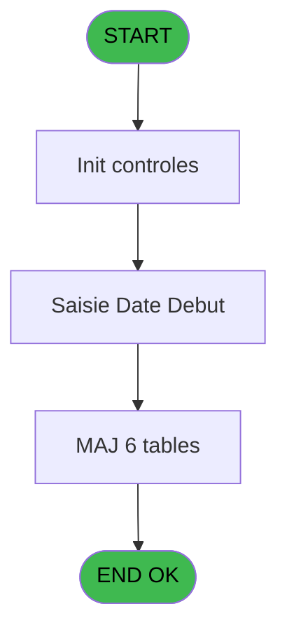

# PBG IDE 188 - Avancement Personnel

> **Analyse**: Phases 1-4 2026-02-03 10:03 -> 10:04 (19s) | Assemblage 10:04
> **Pipeline**: V7.2 Enrichi
> **Structure**: 4 onglets (Resume | Ecrans | Donnees | Connexions)

<!-- TAB:Resume -->

## 1. FICHE D'IDENTITE

| Attribut | Valeur |
|----------|--------|
| Projet | PBG |
| IDE Position | 188 |
| Nom Programme | Avancement Personnel |
| Fichier source | `Prg_188.xml` |
| Domaine metier | General |
| Taches | 15 (1 ecrans visibles) |
| Tables modifiees | 6 |
| Programmes appeles | 0 |
| :warning: Statut | **ORPHELIN_POTENTIEL** |

## 2. DESCRIPTION FONCTIONNELLE

**Avancement Personnel** assure la gestion complete de ce processus.

Le flux de traitement s'organise en **4 blocs fonctionnels** :

- **Traitement** (11 taches) : traitements metier divers
- **Creation** (2 taches) : insertion d'enregistrements en base (mouvements, prestations)
- **Validation** (1 tache) : controles et verifications de coherence
- **Saisie** (1 tache) : ecrans de saisie utilisateur (formulaires, champs, donnees)

**Donnees modifiees** : 6 tables en ecriture (gm-recherche_____gmr, gm-complet_______gmc, hebergement______heb, personnel_go______go, historik_station, fichier_validation).

**Logique metier** : 2 regles identifiees couvrant valeurs par defaut.

Detail : phases du traitement

#### Phase 1 : Traitement (11 taches)

- **188** - Avancement Personnel **[[ECRAN]](#ecran-t1)**
- **188.1** - Age Bebe
- **188.2** - Recuperation Debut
- **188.4** - Confirmation Avancement **[[ECRAN]](#ecran-t5)**
- **188.5** - Avancement Batch **[[ECRAN]](#ecran-t6)**
- **188.5.1** - Recuperation Hebergement
- **188.5.3** - Modification Package
- **188.5.4** - Modification Sejour
- **188.5.5** - Modification Sejour
- **188.5.6** - Modification Sejour
- **188.5.8** - Modification Package

#### Phase 2 : Saisie (1 tache)

- **188.3** - Saisie Date Début **[[ECRAN]](#ecran-t4)**

#### Phase 3 : Creation (2 taches)

- **188.5.2** - Creation Hebergement
- **188.5.9** - Creation Historique

#### Phase 4 : Validation (1 tache)

- **188.5.7** - Modification Validation

#### Tables impactees

| Table | Operations | Role metier |
|-------|-----------|-------------|
| hebergement______heb | R/**W** (5 usages) | Hebergement (chambres) |
| personnel_go______go | R/**W** (2 usages) |  |
| historik_station | **W** (1 usages) | Historique / journal |
| fichier_validation | **W** (1 usages) |  |
| gm-complet_______gmc | **W** (1 usages) |  |
| gm-recherche_____gmr | **W** (1 usages) | Index de recherche |

## 3. BLOCS FONCTIONNELS

### 3.1 Traitement (11 taches)

Traitements internes.

---

#### 188 - Avancement Personnel [[ECRAN]](#ecran-t1)

**Role** : Tache d'orchestration : point d'entree du programme (11 sous-taches). Coordonne l'enchainement des traitements.
**Ecran** : 132 x 56 DLU (MDI) | [Voir mockup](#ecran-t1)

10 sous-taches directes

| Tache | Nom | Bloc |
|-------|-----|------|
| [188.1](#t2) | Age Bebe | Traitement |
| [188.2](#t3) | Recuperation Debut | Traitement |
| [188.4](#t5) | Confirmation Avancement **[[ECRAN]](#ecran-t5)** | Traitement |
| [188.5](#t6) | Avancement Batch **[[ECRAN]](#ecran-t6)** | Traitement |
| [188.5.1](#t7) | Recuperation Hebergement | Traitement |
| [188.5.3](#t9) | Modification Package | Traitement |
| [188.5.4](#t10) | Modification Sejour | Traitement |
| [188.5.5](#t11) | Modification Sejour | Traitement |
| [188.5.6](#t12) | Modification Sejour | Traitement |
| [188.5.8](#t14) | Modification Package | Traitement |

---

#### 188.1 - Age Bebe

**Role** : Traitement : Age Bebe.
**Variables liees** : A (W0 Age Bebe)

---

#### 188.2 - Recuperation Debut

**Role** : Consultation/chargement : Recuperation Debut.
**Variables liees** : D (W0-Date Debut), E (W0-Heure Debut)

---

#### 188.4 - Confirmation Avancement [[ECRAN]](#ecran-t5)

**Role** : Traitement : Confirmation Avancement.
**Ecran** : 132 x 32 DLU (MDI) | [Voir mockup](#ecran-t5)

---

#### 188.5 - Avancement Batch [[ECRAN]](#ecran-t6)

**Role** : Traitement : Avancement Batch.
**Ecran** : 132 x 32 DLU (Modal) | [Voir mockup](#ecran-t6)

---

#### 188.5.1 - Recuperation Hebergement

**Role** : Consultation/chargement : Recuperation Hebergement.

---

#### 188.5.3 - Modification Package

**Role** : Traitement : Modification Package.

---

#### 188.5.4 - Modification Sejour

**Role** : Traitement : Modification Sejour.
**Variables liees** : J (W0-Lieu de sejour), O (W0-Saisir Lieu Sejour)

---

#### 188.5.5 - Modification Sejour

**Role** : Traitement : Modification Sejour.
**Variables liees** : J (W0-Lieu de sejour), O (W0-Saisir Lieu Sejour)

---

#### 188.5.6 - Modification Sejour

**Role** : Traitement : Modification Sejour.
**Variables liees** : J (W0-Lieu de sejour), O (W0-Saisir Lieu Sejour)

---

#### 188.5.8 - Modification Package

**Role** : Traitement : Modification Package.

### 3.2 Saisie (1 tache)

L'operateur saisit les donnees de la transaction via 1 ecran (Saisie Date Début).

---

#### 188.3 - Saisie Date Début [[ECRAN]](#ecran-t4)

**Role** : Saisie des donnees : Saisie Date Début.
**Ecran** : 539 x 87 DLU (MDI) | [Voir mockup](#ecran-t4)
**Variables liees** : D (W0-Date Debut), F (W0-Date Fin)

### 3.3 Creation (2 taches)

Insertion de nouveaux enregistrements en base.

---

#### 188.5.2 - Creation Hebergement

**Role** : Creation d'enregistrement : Creation Hebergement.

---

#### 188.5.9 - Creation Historique

**Role** : Consultation/chargement : Creation Historique.

### 3.4 Validation (1 tache)

Controles de coherence : 1 tache verifie les donnees et conditions.

---

#### 188.5.7 - Modification Validation

**Role** : Verification : Modification Validation.

## 5. REGLES METIER

2 regles identifiees:

### Saisie (2 regles)

#### [RM-001] Valeur par defaut si W0-Heure Debut [E] est vide

| Element | Detail |
|---------|--------|
| **Condition** | `W0-Heure Debut [E]=''` |
| **Si vrai** | 'U3' |
| **Si faux** | 'U2h') |
| **Variables** | E (W0-Heure Debut) |
| **Expression source** | Expression 6 : `IF (W0-Heure Debut [E]='','U3','U2h')` |
| **Exemple** | Si W0-Heure Debut [E]='' → 'U3'. Sinon → 'U2h') |
| **Impact** | Bloc Saisie |

#### [RM-002] Valeur par defaut si W0-Heure Fin [G] est vide

| Element | Detail |
|---------|--------|
| **Condition** | `W0-Heure Fin [G]=''` |
| **Si vrai** | 'U3' |
| **Si faux** | 'U2h') |
| **Variables** | G (W0-Heure Fin) |
| **Expression source** | Expression 7 : `IF (W0-Heure Fin [G]='','U3','U2h')` |
| **Exemple** | Si W0-Heure Fin [G]='' → 'U3'. Sinon → 'U2h') |
| **Impact** | Bloc Saisie |

## 6. CONTEXTE

- **Appele par**: (aucun)
- **Appelle**: 0 programmes | **Tables**: 8 (W:6 R:3 L:1) | **Taches**: 15 | **Expressions**: 12

<!-- TAB:Ecrans -->

## 8. ECRANS

### 8.1 Forms visibles (1 / 15)

| # | Position | Tache | Nom | Type | Largeur | Hauteur | Bloc |
|---|----------|-------|-----|------|---------|---------|------|
| 1 | 188.3 | 188.3 | Saisie Date Début | MDI | 539 | 87 | Saisie |

### 8.2 Mockups Ecrans

---

#### 188.3 - Saisie Date Début
**Tache** : [188.3](#t4) | **Type** : MDI | **Dimensions** : 539 x 87 DLU
**Bloc** : Saisie | **Titre IDE** : Saisie Date Début

<!-- FORM-DATA:
{
    "width":  539,
    "vFactor":  8,
    "type":  "MDI",
    "hFactor":  8,
    "controls":  [
                     {
                         "x":  147,
                         "type":  "label",
                         "var":  "",
                         "y":  7,
                         "w":  378,
                         "fmt":  "",
                         "name":  "",
                         "h":  48,
                         "color":  "",
                         "text":  "",
                         "parent":  null
                     },
                     {
                         "x":  157,
                         "type":  "label",
                         "var":  "",
                         "y":  42,
                         "w":  94,
                         "fmt":  "",
                         "name":  "",
                         "h":  10,
                         "color":  "",
                         "text":  "Date début",
                         "parent":  2
                     },
                     {
                         "x":  0,
                         "type":  "label",
                         "var":  "",
                         "y":  60,
                         "w":  526,
                         "fmt":  "",
                         "name":  "",
                         "h":  24,
                         "color":  "",
                         "text":  "",
                         "parent":  null
                     },
                     {
                         "x":  157,
                         "type":  "label",
                         "var":  "",
                         "y":  18,
                         "w":  110,
                         "fmt":  "",
                         "name":  "",
                         "h":  12,
                         "color":  "",
                         "text":  "Lieu de séjour",
                         "parent":  2
                     },
                     {
                         "x":  445,
                         "type":  "button",
                         "var":  "",
                         "y":  42,
                         "w":  27,
                         "fmt":  "...",
                         "name":  "W1-bouton date",
                         "h":  10,
                         "color":  "",
                         "text":  "",
                         "parent":  2
                     },
                     {
                         "x":  280,
                         "type":  "edit",
                         "var":  "",
                         "y":  42,
                         "w":  126,
                         "fmt":  "",
                         "name":  "W1-Date Debut",
                         "h":  10,
                         "color":  "6",
                         "text":  "",
                         "parent":  2
                     },
                     {
                         "x":  2,
                         "type":  "image",
                         "var":  "",
                         "y":  3,
                         "w":  144,
                         "fmt":  "",
                         "name":  "",
                         "h":  53,
                         "color":  "",
                         "text":  "",
                         "parent":  null
                     },
                     {
                         "x":  5,
                         "type":  "button",
                         "var":  "",
                         "y":  63,
                         "w":  154,
                         "fmt":  "\u0026Ok",
                         "name":  "",
                         "h":  18,
                         "color":  "",
                         "text":  "",
                         "parent":  5
                     },
                     {
                         "x":  164,
                         "type":  "button",
                         "var":  "",
                         "y":  63,
                         "w":  154,
                         "fmt":  "A\u0026bandonner",
                         "name":  "",
                         "h":  18,
                         "color":  "",
                         "text":  "",
                         "parent":  null
                     },
                     {
                         "x":  280,
                         "type":  "combobox",
                         "var":  "",
                         "y":  18,
                         "w":  235,
                         "fmt":  "",
                         "name":  "W1-Lieu de sejour",
                         "h":  12,
                         "color":  "",
                         "text":  "1,2",
                         "parent":  2
                     }
                 ],
    "taskId":  "188.3",
    "height":  87
}
-->

<strong>Champs : 2 champs</strong>

| Pos (x,y) | Nom | Variable | Type |
|-----------|-----|----------|------|
| 280,42 | W1-Date Debut | - | edit |
| 280,18 | W1-Lieu de sejour | - | combobox |

<strong>Boutons : 3 boutons</strong>

| Bouton | Pos (x,y) | Action |
|--------|-----------|--------|
| ... | 445,42 | Bouton fonctionnel |
| Ok | 5,63 | Valide la saisie et enregistre |
| Abandonner | 164,63 | Annule et retour au menu |

## 9. NAVIGATION

Ecran unique: **Saisie Date Début**

### 9.3 Structure hierarchique (15 taches)

| Position | Tache | Type | Dimensions | Bloc |
|----------|-------|------|------------|------|
| **188.1** | [**Avancement Personnel** (188)](#t1) [mockup](#ecran-t1) | MDI | 132x56 | Traitement |
| 188.1.1 | [Age Bebe (188.1)](#t2) | MDI | - | |
| 188.1.2 | [Recuperation Debut (188.2)](#t3) | MDI | - | |
| 188.1.3 | [Confirmation Avancement (188.4)](#t5) [mockup](#ecran-t5) | MDI | 132x32 | |
| 188.1.4 | [Avancement Batch (188.5)](#t6) [mockup](#ecran-t6) | Modal | 132x32 | |
| 188.1.5 | [Recuperation Hebergement (188.5.1)](#t7) | MDI | - | |
| 188.1.6 | [Modification Package (188.5.3)](#t9) | MDI | - | |
| 188.1.7 | [Modification Sejour (188.5.4)](#t10) | MDI | - | |
| 188.1.8 | [Modification Sejour (188.5.5)](#t11) | MDI | - | |
| 188.1.9 | [Modification Sejour (188.5.6)](#t12) | MDI | - | |
| 188.1.10 | [Modification Package (188.5.8)](#t14) | MDI | - | |
| **188.2** | [**Saisie Date Début** (188.3)](#t4) [mockup](#ecran-t4) | MDI | 539x87 | Saisie |
| **188.3** | [**Creation Hebergement** (188.5.2)](#t8) | MDI | - | Creation |
| 188.3.1 | [Creation Historique (188.5.9)](#t15) | MDI | - | |
| **188.4** | [**Modification Validation** (188.5.7)](#t13) | MDI | - | Validation |

### 9.4 Algorigramme

> **Legende**: Vert = START/END OK | Rouge = END KO | Bleu = Decisions
> *Algorigramme auto-genere. Utiliser `/algorigramme` pour une synthese metier detaillee.*

<!-- TAB:Donnees -->

## 10. TABLES

### Tables utilisees (8)

| ID | Nom | Description | Type | R | W | L | Usages |
|----|-----|-------------|------|---|---|---|--------|
| 30 | gm-recherche_____gmr | Index de recherche | DB |   | **W** |   | 1 |
| 31 | gm-complet_______gmc |  | DB |   | **W** |   | 1 |
| 34 | hebergement______heb | Hebergement (chambres) | DB | R | **W** |   | 5 |
| 35 | personnel_go______go |  | DB | R | **W** |   | 2 |
| 88 | historik_station | Historique / journal | DB |   | **W** |   | 1 |
| 113 | tables_village |  | DB | R |   |   | 1 |
| 131 | fichier_validation |  | DB |   | **W** |   | 1 |
| 134 | groupe_arr_dep___vol |  | DB |   |   | L | 1 |

### Colonnes par table (1 / 7 tables avec colonnes identifiees)

Table 30 - gm-recherche_____gmr (**W**) - 1 usages

*Table utilisee uniquement en Link ou aucune colonne Real identifiee dans le DataView.*

Table 31 - gm-complet_______gmc (**W**) - 1 usages

*Table utilisee uniquement en Link ou aucune colonne Real identifiee dans le DataView.*

Table 34 - hebergement______heb (R/**W**) - 5 usages

*Table utilisee uniquement en Link ou aucune colonne Real identifiee dans le DataView.*

Table 35 - personnel_go______go (R/**W**) - 2 usages

| Lettre | Variable | Acces | Type |
|--------|----------|-------|------|
| A | W1-Statut Sejour | W | Alpha |
| B | W1-Libelle | W | Alpha |
| C | W1-Nationalite | W | Alpha |
| D | W1-Code Sexe | W | Alpha |
| E | W1-Code Fumeur | W | Alpha |
| F | W1 Age | W | Numeric |
| G | W1 Age codifie | W | Alpha |
| H | W1 Nb mois | W | Numeric |
| I | W1 Lieu de sejour | W | Alpha |

Table 88 - historik_station (**W**) - 1 usages

*Table utilisee uniquement en Link ou aucune colonne Real identifiee dans le DataView.*

Table 113 - tables_village (R) - 1 usages

*Table utilisee uniquement en Link ou aucune colonne Real identifiee dans le DataView.*

Table 131 - fichier_validation (**W**) - 1 usages

*Table utilisee uniquement en Link ou aucune colonne Real identifiee dans le DataView.*

## 11. VARIABLES

### 11.1 Variables de travail (1)

Variables internes au programme.

| Lettre | Nom | Type | Usage dans |
|--------|-----|------|-----------|
| A | W0 Age Bebe | Numeric | - |

### 11.2 Autres (14)

Variables diverses.

| Lettre | Nom | Type | Usage dans |
|--------|-----|------|-----------|
| B | W0-Qualite | Alpha | - |
| C | W0-Complement | Alpha | - |
| D | W0-Date Debut | Date | - |
| E | W0-Heure Debut | Alpha | [188.2](#t3) |
| F | W0-Date Fin | Date | - |
| G | W0-Heure Fin | Alpha | 1x refs |
| H | W0-Occupation | Alpha | - |
| I | W0-Base Occupation | Alpha | - |
| J | W0-Lieu de sejour | Alpha | [188.5.4](#t10), [188.5.5](#t11), [188.5.6](#t12) |
| K | W0-Accord Suite | Alpha | - |
| L | W0-Existe Code VV | Logical | - |
| M | W0-Code VV | Alpha | - |
| N | W0-Heure VV | Alpha | - |
| O | W0-Saisir Lieu Sejour | Logical | - |

## 12. EXPRESSIONS

**12 / 12 expressions decodees (100%)**

### 12.1 Repartition par type

| Type | Expressions | Regles |
|------|-------------|--------|
| CONDITION | 4 | 2 |
| CONSTANTE | 4 | 0 |
| OTHER | 4 | 0 |

### 12.2 Expressions cles par type

#### CONDITION (4 expressions)

| Type | IDE | Expression | Regle |
|------|-----|------------|-------|
| CONDITION | 7 | `IF (W0-Heure Fin [G]='','U3','U2h')` | [RM-002](#rm-RM-002) |
| CONDITION | 6 | `IF (W0-Heure Debut [E]='','U3','U2h')` | [RM-001](#rm-RM-001) |
| CONDITION | 9 | `W0-Lieu de sejour [J]='E'` | - |
| CONDITION | 8 | `W0-Lieu de sejour [J]='O'` | - |

#### CONSTANTE (4 expressions)

| Type | IDE | Expression | Regle |
|------|-----|------------|-------|
| CONSTANTE | 10 | `''` | - |
| CONSTANTE | 11 | `'A'` | - |
| CONSTANTE | 4 | `'TBAOC'` | - |
| CONSTANTE | 5 | `'P'` | - |

#### OTHER (4 expressions)

| Type | IDE | Expression | Regle |
|------|-----|------------|-------|
| OTHER | 3 | `GetParam ('SOCIETE')` | - |
| OTHER | 12 | `NOT([Z])` | - |
| OTHER | 1 | `GetParam ('NRO_CPTE')` | - |
| OTHER | 2 | `GetParam ('LANGUE')` | - |

<!-- TAB:Connexions -->

## 13. GRAPHE D'APPELS

### 13.1 Chaine depuis Main (Callers)

**Chemin**: (pas de callers directs)

### 13.2 Callers

| IDE | Nom Programme | Nb Appels |
|-----|---------------|-----------|
| - | (aucun) | - |

### 13.3 Callees (programmes appeles)

### 13.4 Detail Callees avec contexte

| IDE | Nom Programme | Appels | Contexte |
|-----|---------------|--------|----------|
| - | (aucun) | - | - |

## 14. RECOMMANDATIONS MIGRATION

### 14.1 Profil du programme

| Metrique | Valeur | Impact migration |
|----------|--------|-----------------|
| Lignes de logique | 306 | Taille moyenne |
| Expressions | 12 | Peu de logique |
| Tables WRITE | 6 | Fort impact donnees |
| Sous-programmes | 0 | Peu de dependances |
| Ecrans visibles | 1 | Ecran unique ou traitement batch |
| Code desactive | 0% (0 / 306) | Code sain |
| Regles metier | 2 | Quelques regles a preserver |

### 14.2 Plan de migration par bloc

#### Traitement (11 taches: 3 ecrans, 8 traitements)

- **Strategie** : Orchestrateur avec 3 ecrans (Razor/React) et 8 traitements backend (services).
- Les ecrans deviennent des composants UI, les traitements invisibles deviennent des services injectables.
- Decomposer les taches en services unitaires testables.

#### Saisie (1 tache: 1 ecran, 0 traitement)

- **Strategie** : Formulaire React/Blazor avec validation Zod/FluentValidation.
- Reproduire 1 ecran : Saisie Date Début
- Validation temps reel cote client + serveur

#### Creation (2 taches: 0 ecran, 2 traitements)

- **Strategie** : Repository pattern avec Entity Framework Core.
- Insertion via `IRepository<T>.CreateAsync()`

#### Validation (1 tache: 0 ecran, 1 traitement)

- **Strategie** : FluentValidation avec validators specifiques.
- Chaque tache de validation -> un validator injectable

### 14.3 Dependances critiques

| Dependance | Type | Appels | Impact |
|------------|------|--------|--------|
| gm-recherche_____gmr | Table WRITE (Database) | 1x | Schema + repository |
| gm-complet_______gmc | Table WRITE (Database) | 1x | Schema + repository |
| hebergement______heb | Table WRITE (Database) | 3x | Schema + repository |
| personnel_go______go | Table WRITE (Database) | 1x | Schema + repository |
| historik_station | Table WRITE (Database) | 1x | Schema + repository |
| fichier_validation | Table WRITE (Database) | 1x | Schema + repository |

---
*Spec DETAILED generee par Pipeline V7.2 - 2026-02-03 10:04*
