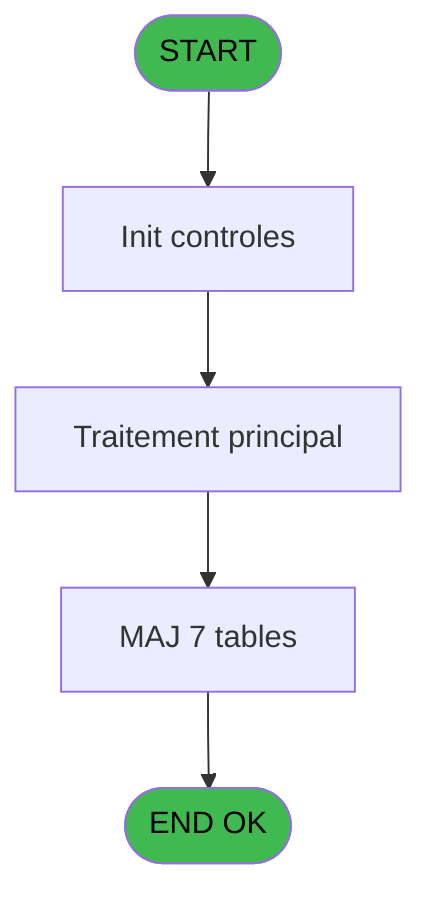

# PBG IDE 189 - Suppression Periode Personn

> **Analyse**: Phases 1-4 2026-02-03 10:04 -> 10:04 (19s) | Assemblage 10:04
> **Pipeline**: V7.2 Enrichi
> **Structure**: 4 onglets (Resume | Ecrans | Donnees | Connexions)

<!-- TAB:Resume -->

## 1. FICHE D'IDENTITE

| Attribut | Valeur |
|----------|--------|
| Projet | PBG |
| IDE Position | 189 |
| Nom Programme | Suppression Periode Personn |
| Fichier source | `Prg_189.xml` |
| Domaine metier | General |
| Taches | 16 (0 ecrans visibles) |
| Tables modifiees | 7 |
| Programmes appeles | 0 |
| :warning: Statut | **ORPHELIN_POTENTIEL** |

## 2. DESCRIPTION FONCTIONNELLE

**Suppression Periode Personn** assure la gestion complete de ce processus.

Le flux de traitement s'organise en **3 blocs fonctionnels** :

- **Traitement** (14 taches) : traitements metier divers
- **Creation** (1 tache) : insertion d'enregistrements en base (mouvements, prestations)
- **Calcul** (1 tache) : calculs de montants, stocks ou compteurs

**Donnees modifiees** : 7 tables en ecriture (gm-recherche_____gmr, gm-complet_______gmc, hebergement______heb, personnel_go______go, compte_gm________cgm, historik_station, fichier_validation).

Detail : phases du traitement

#### Phase 1 : Traitement (14 taches)

- **189** - Suppression Periode Personnel **[[ECRAN]](#ecran-t1)**
- **189.1** - Recuperation Periode
- **189.2** - Confirmation suppression
- **189.3** - Suppression periode batch
- **189.3.1** - Suppression
- **189.3.2** - Maj Package
- **189.3.3** - Maj Package
- **189.3.4** - Maj Package
- **189.3.5** - Maj GMR
- **189.3.6** - Maj GMR
- **189.3.7** - Maj GMR
- **189.3.8** - Maj GMR
- **189.3.9** - Maj GMR
- **189.3.10** - Maj GMR

#### Phase 2 : Calcul (1 tache)

- **189.3.10.1** - Maj Compte

#### Phase 3 : Creation (1 tache)

- **189.3.11** - Creation Historique

#### Tables impactees

| Table | Operations | Role metier |
|-------|-----------|-------------|
| hebergement______heb | R/**W** (6 usages) | Hebergement (chambres) |
| gm-recherche_____gmr | R/**W** (2 usages) | Index de recherche |
| historik_station | **W** (1 usages) | Historique / journal |
| fichier_validation | **W** (1 usages) |  |
| compte_gm________cgm | **W** (1 usages) | Comptes GM (generaux) |
| personnel_go______go | **W** (1 usages) |  |
| gm-complet_______gmc | **W** (1 usages) |  |

## 3. BLOCS FONCTIONNELS

### 3.1 Traitement (14 taches)

Traitements internes.

---

#### 189 - Suppression Periode Personnel [[ECRAN]](#ecran-t1)

**Role** : Tache d'orchestration : point d'entree du programme (14 sous-taches). Coordonne l'enchainement des traitements.
**Ecran** : 160 x 40 DLU (MDI) | [Voir mockup](#ecran-t1)

13 sous-taches directes

| Tache | Nom | Bloc |
|-------|-----|------|
| [189.1](#t2) | Recuperation Periode | Traitement |
| [189.2](#t4) | Confirmation suppression | Traitement |
| [189.3](#t17) | Suppression periode batch | Traitement |
| [189.3.1](#t20) | Suppression | Traitement |
| [189.3.2](#t23) | Maj Package | Traitement |
| [189.3.3](#t26) | Maj Package | Traitement |
| [189.3.4](#t29) | Maj Package | Traitement |
| [189.3.5](#t32) | Maj GMR | Traitement |
| [189.3.6](#t35) | Maj GMR | Traitement |
| [189.3.7](#t38) | Maj GMR | Traitement |
| [189.3.8](#t41) | Maj GMR | Traitement |
| [189.3.9](#t44) | Maj GMR | Traitement |
| [189.3.10](#t47) | Maj GMR | Traitement |

---

#### 189.1 - Recuperation Periode

**Role** : Consultation/chargement : Recuperation Periode.

---

#### 189.2 - Confirmation suppression

**Role** : Traitement : Confirmation suppression.

---

#### 189.3 - Suppression periode batch

**Role** : Traitement : Suppression periode batch.

---

#### 189.3.1 - Suppression

**Role** : Traitement : Suppression.

---

#### 189.3.2 - Maj Package

**Role** : Traitement : Maj Package.

---

#### 189.3.3 - Maj Package

**Role** : Traitement : Maj Package.

---

#### 189.3.4 - Maj Package

**Role** : Traitement : Maj Package.

---

#### 189.3.5 - Maj GMR

**Role** : Traitement : Maj GMR.

---

#### 189.3.6 - Maj GMR

**Role** : Traitement : Maj GMR.

---

#### 189.3.7 - Maj GMR

**Role** : Traitement : Maj GMR.

---

#### 189.3.8 - Maj GMR

**Role** : Traitement : Maj GMR.

---

#### 189.3.9 - Maj GMR

**Role** : Traitement : Maj GMR.

---

#### 189.3.10 - Maj GMR

**Role** : Traitement : Maj GMR.

### 3.2 Calcul (1 tache)

Calculs metier : montants, stocks, compteurs.

---

#### 189.3.10.1 - Maj Compte

**Role** : Traitement : Maj Compte.

### 3.3 Creation (1 tache)

Insertion de nouveaux enregistrements en base.

---

#### 189.3.11 - Creation Historique

**Role** : Consultation/chargement : Creation Historique.

## 5. REGLES METIER

*(Aucune regle metier identifiee)*

## 6. CONTEXTE

- **Appele par**: (aucun)
- **Appelle**: 0 programmes | **Tables**: 7 (W:7 R:2 L:0) | **Taches**: 16 | **Expressions**: 9

<!-- TAB:Ecrans -->

## 8. ECRANS

*(Programme sans ecran visible)*

## 9. NAVIGATION

### 9.3 Structure hierarchique (16 taches)

| Position | Tache | Type | Dimensions | Bloc |
|----------|-------|------|------------|------|
| **189.1** | [**Suppression Periode Personnel** (189)](#t1) [mockup](#ecran-t1) | MDI | 160x40 | Traitement |
| 189.1.1 | [Recuperation Periode (189.1)](#t2) | MDI | - | |
| 189.1.2 | [Confirmation suppression (189.2)](#t4) | MDI | - | |
| 189.1.3 | [Suppression periode batch (189.3)](#t17) | - | - | |
| 189.1.4 | [Suppression (189.3.1)](#t20) | MDI | - | |
| 189.1.5 | [Maj Package (189.3.2)](#t23) | MDI | - | |
| 189.1.6 | [Maj Package (189.3.3)](#t26) | MDI | - | |
| 189.1.7 | [Maj Package (189.3.4)](#t29) | MDI | - | |
| 189.1.8 | [Maj GMR (189.3.5)](#t32) | MDI | - | |
| 189.1.9 | [Maj GMR (189.3.6)](#t35) | MDI | - | |
| 189.1.10 | [Maj GMR (189.3.7)](#t38) | MDI | - | |
| 189.1.11 | [Maj GMR (189.3.8)](#t41) | MDI | - | |
| 189.1.12 | [Maj GMR (189.3.9)](#t44) | MDI | - | |
| 189.1.13 | [Maj GMR (189.3.10)](#t47) | MDI | - | |
| **189.2** | [**Maj Compte** (189.3.10.1)](#t48) | MDI | - | Calcul |
| **189.3** | [**Creation Historique** (189.3.11)](#t51) | MDI | - | Creation |

### 9.4 Algorigramme

> **Legende**: Vert = START/END OK | Rouge = END KO | Bleu = Decisions
> *Algorigramme auto-genere. Utiliser `/algorigramme` pour une synthese metier detaillee.*

<!-- TAB:Donnees -->

## 10. TABLES

### Tables utilisees (7)

| ID | Nom | Description | Type | R | W | L | Usages |
|----|-----|-------------|------|---|---|---|--------|
| 30 | gm-recherche_____gmr | Index de recherche | DB | R | **W** |   | 2 |
| 31 | gm-complet_______gmc |  | DB |   | **W** |   | 1 |
| 34 | hebergement______heb | Hebergement (chambres) | DB | R | **W** |   | 6 |
| 35 | personnel_go______go |  | DB |   | **W** |   | 1 |
| 47 | compte_gm________cgm | Comptes GM (generaux) | DB |   | **W** |   | 1 |
| 88 | historik_station | Historique / journal | DB |   | **W** |   | 1 |
| 131 | fichier_validation |  | DB |   | **W** |   | 1 |

### Colonnes par table (0 / 7 tables avec colonnes identifiees)

Table 30 - gm-recherche_____gmr (R/**W**) - 2 usages

*Table utilisee uniquement en Link ou aucune colonne Real identifiee dans le DataView.*

Table 31 - gm-complet_______gmc (**W**) - 1 usages

*Table utilisee uniquement en Link ou aucune colonne Real identifiee dans le DataView.*

Table 34 - hebergement______heb (R/**W**) - 6 usages

*Table utilisee uniquement en Link ou aucune colonne Real identifiee dans le DataView.*

Table 35 - personnel_go______go (**W**) - 1 usages

*Table utilisee uniquement en Link ou aucune colonne Real identifiee dans le DataView.*

Table 47 - compte_gm________cgm (**W**) - 1 usages

*Table utilisee uniquement en Link ou aucune colonne Real identifiee dans le DataView.*

Table 88 - historik_station (**W**) - 1 usages

*Table utilisee uniquement en Link ou aucune colonne Real identifiee dans le DataView.*

Table 131 - fichier_validation (**W**) - 1 usages

*Table utilisee uniquement en Link ou aucune colonne Real identifiee dans le DataView.*

## 11. VARIABLES

### 11.1 Parametres entrants (4)

Variables recues en parametre.

| Lettre | Nom | Type | Usage dans |
|--------|-----|------|-----------|
| E | P0 Date debut sejour | Date | 1x parametre entrant |
| F | P0 Date fin sejour | Date | - |
| G | P0 Date Naissance | Date | - |
| H | P0 Age Bebe | Numeric | - |

### 11.2 Variables de travail (14)

Variables internes au programme.

| Lettre | Nom | Type | Usage dans |
|--------|-----|------|-----------|
| I | W0 Heure Debut | Alpha | - |
| J | W0 Heure Fin | Alpha | - |
| K | W0 Nbre d'Heberg. | Numeric | - |
| L | W0 New Debut Sejour | Date | 1x calcul interne |
| M | W0 New Fin Sejour | Date | - |
| N | W0 B055 | Alpha | - |
| O | W0 Date Solde | Date | - |
| P | W0 Age | Numeric | - |
| Q | W0 Age Codifie | Alpha | - |
| R | W0 Nb mois | Numeric | 2x calcul interne |
| T | W0 Code Aller VV | Alpha | - |
| U | W0 Heure Aller VV | Alpha | - |
| W | W0 Code Retour VV | Alpha | - |
| X | W0 Heure Retour VV | Alpha | - |

### 11.3 Autres (7)

Variables diverses.

| Lettre | Nom | Type | Usage dans |
|--------|-----|------|-----------|
| A | P0-Date Debut | Date | - |
| B | P0-Heure Debut | Alpha | - |
| C | P0-Date Fin | Date | - |
| D | P0-Heure Fin | Alpha | - |
| S | W0-Existe Code Aller VV | Logical | - |
| V | W0-Existe Code Retour VV | Logical | - |
| Y | W0-Accord Suite | Alpha | - |

Toutes les 25 variables (liste complete)

| Cat | Lettre | Nom Variable | Type |
|-----|--------|--------------|------|
| P0 | **E** | P0 Date debut sejour | Date |
| P0 | **F** | P0 Date fin sejour | Date |
| P0 | **G** | P0 Date Naissance | Date |
| P0 | **H** | P0 Age Bebe | Numeric |
| W0 | **I** | W0 Heure Debut | Alpha |
| W0 | **J** | W0 Heure Fin | Alpha |
| W0 | **K** | W0 Nbre d'Heberg. | Numeric |
| W0 | **L** | W0 New Debut Sejour | Date |
| W0 | **M** | W0 New Fin Sejour | Date |
| W0 | **N** | W0 B055 | Alpha |
| W0 | **O** | W0 Date Solde | Date |
| W0 | **P** | W0 Age | Numeric |
| W0 | **Q** | W0 Age Codifie | Alpha |
| W0 | **R** | W0 Nb mois | Numeric |
| W0 | **T** | W0 Code Aller VV | Alpha |
| W0 | **U** | W0 Heure Aller VV | Alpha |
| W0 | **W** | W0 Code Retour VV | Alpha |
| W0 | **X** | W0 Heure Retour VV | Alpha |
| Autre | **A** | P0-Date Debut | Date |
| Autre | **B** | P0-Heure Debut | Alpha |
| Autre | **C** | P0-Date Fin | Date |
| Autre | **D** | P0-Heure Fin | Alpha |
| Autre | **S** | W0-Existe Code Aller VV | Logical |
| Autre | **V** | W0-Existe Code Retour VV | Logical |
| Autre | **Y** | W0-Accord Suite | Alpha |

## 12. EXPRESSIONS

**9 / 9 expressions decodees (100%)**

### 12.1 Repartition par type

| Type | Expressions | Regles |
|------|-------------|--------|
| CONSTANTE | 2 | 0 |
| OTHER | 4 | 0 |
| CONDITION | 3 | 0 |

### 12.2 Expressions cles par type

#### CONSTANTE (2 expressions)

| Type | IDE | Expression | Regle |
|------|-----|------------|-------|
| CONSTANTE | 6 | `'R'` | - |
| CONSTANTE | 5 | `'A'` | - |

#### OTHER (4 expressions)

| Type | IDE | Expression | Regle |
|------|-----|------------|-------|
| OTHER | 7 | `NOT([AP])` | - |
| OTHER | 8 | `NOT([AQ])` | - |
| OTHER | 1 | `GetParam ('NRO_CPTE')` | - |
| OTHER | 2 | `GetParam ('SOCIETE')` | - |

#### CONDITION (3 expressions)

| Type | IDE | Expression | Regle |
|------|-----|------------|-------|
| CONDITION | 9 | `W0 New Debut Sejour [L]<>P0 Date debut sejour [E]` | - |
| CONDITION | 4 | `W0 Nb mois [R]='O'` | - |
| CONDITION | 3 | `W0 Nb mois [R]='N'` | - |

<!-- TAB:Connexions -->

## 13. GRAPHE D'APPELS

### 13.1 Chaine depuis Main (Callers)

**Chemin**: (pas de callers directs)

### 13.2 Callers

| IDE | Nom Programme | Nb Appels |
|-----|---------------|-----------|
| - | (aucun) | - |

### 13.3 Callees (programmes appeles)

### 13.4 Detail Callees avec contexte

| IDE | Nom Programme | Appels | Contexte |
|-----|---------------|--------|----------|
| - | (aucun) | - | - |

## 14. RECOMMANDATIONS MIGRATION

### 14.1 Profil du programme

| Metrique | Valeur | Impact migration |
|----------|--------|-----------------|
| Lignes de logique | 248 | Taille moyenne |
| Expressions | 9 | Peu de logique |
| Tables WRITE | 7 | Fort impact donnees |
| Sous-programmes | 0 | Peu de dependances |
| Ecrans visibles | 0 | Ecran unique ou traitement batch |
| Code desactive | 0% (0 / 248) | Code sain |
| Regles metier | 0 | Pas de regle identifiee |

### 14.2 Plan de migration par bloc

#### Traitement (14 taches: 1 ecran, 13 traitements)

- **Strategie** : Orchestrateur avec 1 ecrans (Razor/React) et 13 traitements backend (services).
- Les ecrans deviennent des composants UI, les traitements invisibles deviennent des services injectables.
- Decomposer les taches en services unitaires testables.

#### Calcul (1 tache: 0 ecran, 1 traitement)

- **Strategie** : Services de calcul purs (Domain Services).
- Migrer la logique de calcul (stock, compteurs, montants)

#### Creation (1 tache: 0 ecran, 1 traitement)

- **Strategie** : Repository pattern avec Entity Framework Core.
- Insertion via `IRepository<T>.CreateAsync()`

### 14.3 Dependances critiques

| Dependance | Type | Appels | Impact |
|------------|------|--------|--------|
| gm-recherche_____gmr | Table WRITE (Database) | 1x | Schema + repository |
| gm-complet_______gmc | Table WRITE (Database) | 1x | Schema + repository |
| hebergement______heb | Table WRITE (Database) | 5x | Schema + repository |
| personnel_go______go | Table WRITE (Database) | 1x | Schema + repository |
| compte_gm________cgm | Table WRITE (Database) | 1x | Schema + repository |
| historik_station | Table WRITE (Database) | 1x | Schema + repository |
| fichier_validation | Table WRITE (Database) | 1x | Schema + repository |

---
*Spec DETAILED generee par Pipeline V7.2 - 2026-02-03 10:04*
