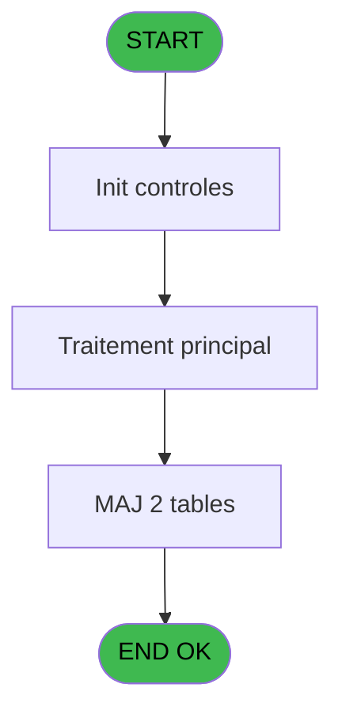
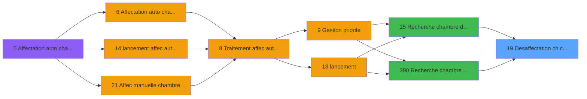

# PBG IDE 19 - Desaffectation ch compte

> **Analyse**: Phases 1-4 2026-02-03 01:06 -> 01:07 (38s) | Assemblage 01:07
> **Pipeline**: V7.2 Enrichi
> **Structure**: 4 onglets (Resume | Ecrans | Donnees | Connexions)

<!-- TAB:Resume -->

## 1. FICHE D'IDENTITE

| Attribut | Valeur |
|----------|--------|
| Projet | PBG |
| IDE Position | 19 |
| Nom Programme | Desaffectation ch compte |
| Fichier source | `Prg_19.xml` |
| Domaine metier | Comptabilite |
| Taches | 3 (0 ecrans visibles) |
| Tables modifiees | 2 |
| Programmes appeles | 0 |

## 2. DESCRIPTION FONCTIONNELLE

**Desaffectation ch compte** assure la gestion complete de ce processus, accessible depuis [Recherche chambre dispo new (IDE 15)](PBG-IDE-15.md), [Recherche chambre dispo sav (IDE 390)](PBG-IDE-390.md).

Le flux de traitement s'organise en **2 blocs fonctionnels** :

- **Traitement** (2 taches) : traitements metier divers
- **Calcul** (1 tache) : calculs de montants, stocks ou compteurs

**Donnees modifiees** : 2 tables en ecriture (hebergement______heb, tairejet).

Detail : phases du traitement

#### Phase 1 : Calcul (1 tache)

- **19** - Desaffectation ch compte

#### Phase 2 : Traitement (2 taches)

- **19.1** - Crzation chambre
- **19.2** - Affectation

#### Tables impactees

| Table | Operations | Role metier |
|-------|-----------|-------------|
| hebergement______heb | **W** (1 usages) | Hebergement (chambres) |
| tairejet | **W** (1 usages) |  |

## 3. BLOCS FONCTIONNELS

### 3.1 Calcul (1 tache)

Calculs metier : montants, stocks, compteurs.

---

#### 19 - Desaffectation ch compte

**Role** : Traitement : Desaffectation ch compte.

### 3.2 Traitement (2 taches)

Traitements internes.

---

#### 19.1 - Crzation chambre

**Role** : Traitement : Crzation chambre.

---

#### 19.2 - Affectation

**Role** : Traitement : Affectation.

## 5. REGLES METIER

*(Aucune regle metier identifiee)*

## 6. CONTEXTE

- **Appele par**: [Recherche chambre dispo new (IDE 15)](PBG-IDE-15.md), [Recherche chambre dispo sav (IDE 390)](PBG-IDE-390.md)
- **Appelle**: 0 programmes | **Tables**: 5 (W:2 R:1 L:2) | **Taches**: 3 | **Expressions**: 10

<!-- TAB:Ecrans -->

## 8. ECRANS

*(Programme sans ecran visible)*

## 9. NAVIGATION

### 9.3 Structure hierarchique (3 taches)

| Position | Tache | Type | Dimensions | Bloc |
|----------|-------|------|------------|------|
| **19.1** | [**Desaffectation ch compte** (19)](#t1) | - | - | Calcul |
| **19.2** | [**Crzation chambre** (19.1)](#t19) | - | - | Traitement |
| 19.2.1 | [Affectation (19.2)](#t23) | - | - | |

### 9.4 Algorigramme

> **Legende**: Vert = START/END OK | Rouge = END KO | Bleu = Decisions
> *Algorigramme auto-genere. Utiliser `/algorigramme` pour une synthese metier detaillee.*

<!-- TAB:Donnees -->

## 10. TABLES

### Tables utilisees (5)

| ID | Nom | Description | Type | R | W | L | Usages |
|----|-----|-------------|------|---|---|---|--------|
| 30 | gm-recherche_____gmr | Index de recherche | DB | R |   |   | 1 |
| 34 | hebergement______heb | Hebergement (chambres) | DB |   | **W** |   | 1 |
| 455 | tairejet |  | DB |   | **W** |   | 1 |
| 820 | Commentaire supprime |  | DB |   |   | L | 1 |
| 822 | pv_message |  | DB |   |   | L | 1 |

### Colonnes par table (1 / 3 tables avec colonnes identifiees)

Table 30 - gm-recherche_____gmr (R) - 1 usages

| Lettre | Variable | Acces | Type |
|--------|----------|-------|------|
| A | P.Societe | R | Alpha |
| B | P.Regroupement | R | Numeric |
| C | P.Date debut | R | Date |
| D | P.Date de reference | R | Date |

Table 34 - hebergement______heb (**W**) - 1 usages

*Table utilisee uniquement en Link ou aucune colonne Real identifiee dans le DataView.*

Table 455 - tairejet (**W**) - 1 usages

*Table utilisee uniquement en Link ou aucune colonne Real identifiee dans le DataView.*

## 11. VARIABLES

### 11.1 Parametres entrants (4)

Variables recues du programme appelant ([Recherche chambre dispo new (IDE 15)](PBG-IDE-15.md)).

| Lettre | Nom | Type | Usage dans |
|--------|-----|------|-----------|
| A | P.Societe | Alpha | 1x parametre entrant |
| B | P.Regroupement | Numeric | 1x parametre entrant |
| C | P.Date debut | Date | - |
| D | P.Date de reference | Date | 2x parametre entrant |

## 12. EXPRESSIONS

**10 / 10 expressions decodees (100%)**

### 12.1 Repartition par type

| Type | Expressions | Regles |
|------|-------------|--------|
| CONSTANTE | 2 | 0 |
| OTHER | 8 | 0 |

### 12.2 Expressions cles par type

#### CONSTANTE (2 expressions)

| Type | IDE | Expression | Regle |
|------|-----|------------|-------|
| CONSTANTE | 10 | `'Desaffectation compte'` | - |
| CONSTANTE | 7 | `''` | - |

#### OTHER (8 expressions)

| Type | IDE | Expression | Regle |
|------|-----|------------|-------|
| OTHER | 6 | `P.Date de reference [D]` | - |
| OTHER | 5 | `[R]` | - |
| OTHER | 9 | `P.Date de reference [D]` | - |
| OTHER | 8 | `[AA]` | - |
| OTHER | 2 | `[O]` | - |
| ... | | *+3 autres* | |

<!-- TAB:Connexions -->

## 13. GRAPHE D'APPELS

### 13.1 Chaine depuis Main (Callers)

Main -> ... -> [Recherche chambre dispo new (IDE 15)](PBG-IDE-15.md) -> **Desaffectation ch compte (IDE 19)**

Main -> ... -> [Recherche chambre dispo sav (IDE 390)](PBG-IDE-390.md) -> **Desaffectation ch compte (IDE 19)**

### 13.2 Callers

| IDE | Nom Programme | Nb Appels |
|-----|---------------|-----------|
| [15](PBG-IDE-15.md) | Recherche chambre dispo new | 1 |
| [390](PBG-IDE-390.md) | Recherche chambre dispo sav | 1 |

### 13.3 Callees (programmes appeles)

### 13.4 Detail Callees avec contexte

| IDE | Nom Programme | Appels | Contexte |
|-----|---------------|--------|----------|
| - | (aucun) | - | - |

## 14. RECOMMANDATIONS MIGRATION

### 14.1 Profil du programme

| Metrique | Valeur | Impact migration |
|----------|--------|-----------------|
| Lignes de logique | 46 | Programme compact |
| Expressions | 10 | Peu de logique |
| Tables WRITE | 2 | Impact faible |
| Sous-programmes | 0 | Peu de dependances |
| Ecrans visibles | 0 | Ecran unique ou traitement batch |
| Code desactive | 0% (0 / 46) | Code sain |
| Regles metier | 0 | Pas de regle identifiee |

### 14.2 Plan de migration par bloc

#### Calcul (1 tache: 0 ecran, 1 traitement)

- **Strategie** : Services de calcul purs (Domain Services).
- Migrer la logique de calcul (stock, compteurs, montants)

#### Traitement (2 taches: 0 ecran, 2 traitements)

- **Strategie** : 2 service(s) backend injectable(s) (Domain Services).
- Decomposer les taches en services unitaires testables.

### 14.3 Dependances critiques

| Dependance | Type | Appels | Impact |
|------------|------|--------|--------|
| hebergement______heb | Table WRITE (Database) | 1x | Schema + repository |
| tairejet | Table WRITE (Database) | 1x | Schema + repository |

---
*Spec DETAILED generee par Pipeline V7.2 - 2026-02-03 01:07*
