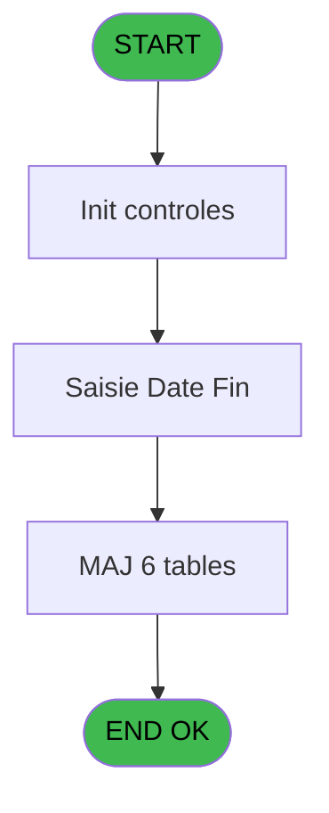

# PBG IDE 190 - Interruption Personnel

> **Analyse**: Phases 1-4 2026-02-03 10:04 -> 10:04 (20s) | Assemblage 10:04
> **Pipeline**: V7.2 Enrichi
> **Structure**: 4 onglets (Resume | Ecrans | Donnees | Connexions)

<!-- TAB:Resume -->

## 1. FICHE D'IDENTITE

| Attribut | Valeur |
|----------|--------|
| Projet | PBG |
| IDE Position | 190 |
| Nom Programme | Interruption Personnel |
| Fichier source | `Prg_190.xml` |
| Domaine metier | General |
| Taches | 13 (1 ecrans visibles) |
| Tables modifiees | 6 |
| Programmes appeles | 0 |
| :warning: Statut | **ORPHELIN_POTENTIEL** |

## 2. DESCRIPTION FONCTIONNELLE

**Interruption Personnel** assure la gestion complete de ce processus.

Le flux de traitement s'organise en **5 blocs fonctionnels** :

- **Traitement** (8 taches) : traitements metier divers
- **Validation** (2 taches) : controles et verifications de coherence
- **Creation** (1 tache) : insertion d'enregistrements en base (mouvements, prestations)
- **Calcul** (1 tache) : calculs de montants, stocks ou compteurs
- **Saisie** (1 tache) : ecrans de saisie utilisateur (formulaires, champs, donnees)

**Donnees modifiees** : 6 tables en ecriture (gm-recherche_____gmr, hebergement______heb, personnel_go______go, compte_gm________cgm, historik_station, fichier_validation).

**Logique metier** : 3 regles identifiees couvrant valeurs par defaut.

Detail : phases du traitement

#### Phase 1 : Traitement (8 taches)

- **190** - Interruption Personnel **[[ECRAN]](#ecran-t1)**
- **190.1** - Recuperation Periode
- **190.3** - Confirmation Interruption **[[ECRAN]](#ecran-t4)**
- **190.4** - Interruption Batch **[[ECRAN]](#ecran-t5)**
- **190.4.1** - Modification Hebergement
- **190.4.2** - Modification Package
- **190.4.3** - Modification Sejour
- **190.4.4** - Modification Sejour

#### Phase 2 : Saisie (1 tache)

- **190.2** - Saisie Date Fin **[[ECRAN]](#ecran-t3)**

#### Phase 3 : Validation (2 taches)

- **190.4.5** - Verification Compte
- **190.4.7** - Modification Validation

#### Phase 4 : Calcul (1 tache)

- **190.4.6** - Modification Compte

#### Phase 5 : Creation (1 tache)

- **190.4.8** - Creation Historique

#### Tables impactees

| Table | Operations | Role metier |
|-------|-----------|-------------|
| hebergement______heb | R/**W** (3 usages) | Hebergement (chambres) |
| gm-recherche_____gmr | R/**W** (2 usages) | Index de recherche |
| personnel_go______go | R/**W** (2 usages) |  |
| fichier_validation | **W** (1 usages) |  |
| historik_station | **W** (1 usages) | Historique / journal |
| compte_gm________cgm | **W** (1 usages) | Comptes GM (generaux) |

## 3. BLOCS FONCTIONNELS

### 3.1 Traitement (8 taches)

Traitements internes.

---

#### 190 - Interruption Personnel [[ECRAN]](#ecran-t1)

**Role** : Tache d'orchestration : point d'entree du programme (8 sous-taches). Coordonne l'enchainement des traitements.
**Ecran** : 132 x 48 DLU (MDI) | [Voir mockup](#ecran-t1)

7 sous-taches directes

| Tache | Nom | Bloc |
|-------|-----|------|
| [190.1](#t2) | Recuperation Periode | Traitement |
| [190.3](#t4) | Confirmation Interruption **[[ECRAN]](#ecran-t4)** | Traitement |
| [190.4](#t5) | Interruption Batch **[[ECRAN]](#ecran-t5)** | Traitement |
| [190.4.1](#t6) | Modification Hebergement | Traitement |
| [190.4.2](#t7) | Modification Package | Traitement |
| [190.4.3](#t8) | Modification Sejour | Traitement |
| [190.4.4](#t9) | Modification Sejour | Traitement |

---

#### 190.1 - Recuperation Periode

**Role** : Consultation/chargement : Recuperation Periode.

---

#### 190.3 - Confirmation Interruption [[ECRAN]](#ecran-t4)

**Role** : Traitement : Confirmation Interruption.
**Ecran** : 132 x 32 DLU (Modal) | [Voir mockup](#ecran-t4)

---

#### 190.4 - Interruption Batch [[ECRAN]](#ecran-t5)

**Role** : Traitement : Interruption Batch.
**Ecran** : 132 x 32 DLU (Modal) | [Voir mockup](#ecran-t5)

---

#### 190.4.1 - Modification Hebergement

**Role** : Traitement : Modification Hebergement.

---

#### 190.4.2 - Modification Package

**Role** : Traitement : Modification Package.

---

#### 190.4.3 - Modification Sejour

**Role** : Traitement : Modification Sejour.

---

#### 190.4.4 - Modification Sejour

**Role** : Traitement : Modification Sejour.

### 3.2 Saisie (1 tache)

L'operateur saisit les donnees de la transaction via 1 ecran (Saisie Date Fin).

---

#### 190.2 - Saisie Date Fin [[ECRAN]](#ecran-t3)

**Role** : Saisie des donnees : Saisie Date Fin.
**Ecran** : 413 x 87 DLU (MDI) | [Voir mockup](#ecran-t3)
**Variables liees** : A (W0-Date Debut), C (W0-Date Prevue), E (W0-Date Fin)

### 3.3 Validation (2 taches)

Controles de coherence : 2 taches verifient les donnees et conditions.

---

#### 190.4.5 - Verification Compte

**Role** : Verification : Verification Compte.

---

#### 190.4.7 - Modification Validation

**Role** : Verification : Modification Validation.

### 3.4 Calcul (1 tache)

Calculs metier : montants, stocks, compteurs.

---

#### 190.4.6 - Modification Compte

**Role** : Traitement : Modification Compte.

### 3.5 Creation (1 tache)

Insertion de nouveaux enregistrements en base.

---

#### 190.4.8 - Creation Historique

**Role** : Consultation/chargement : Creation Historique.

## 5. REGLES METIER

3 regles identifiees:

### Saisie (3 regles)

#### [RM-001] Valeur par defaut si W0-Heure Debut [B] est vide

| Element | Detail |
|---------|--------|
| **Condition** | `W0-Heure Debut [B]=''` |
| **Si vrai** | 'U3' |
| **Si faux** | 'U2h') |
| **Variables** | B (W0-Heure Debut) |
| **Expression source** | Expression 5 : `IF (W0-Heure Debut [B]='','U3','U2h')` |
| **Exemple** | Si W0-Heure Debut [B]='' → 'U3'. Sinon → 'U2h') |
| **Impact** | Bloc Saisie |

#### [RM-002] Valeur par defaut si W0-Heure Prevue [D] est vide

| Element | Detail |
|---------|--------|
| **Condition** | `W0-Heure Prevue [D]=''` |
| **Si vrai** | 'U3' |
| **Si faux** | 'U2h') |
| **Variables** | D (W0-Heure Prevue) |
| **Expression source** | Expression 6 : `IF (W0-Heure Prevue [D]='','U3','U2h')` |
| **Exemple** | Si W0-Heure Prevue [D]='' → 'U3'. Sinon → 'U2h') |
| **Impact** | Bloc Saisie |

#### [RM-003] Valeur par defaut si W0-Heure Fin [F] est vide

| Element | Detail |
|---------|--------|
| **Condition** | `W0-Heure Fin [F]=''` |
| **Si vrai** | 'U3' |
| **Si faux** | 'U2h') |
| **Variables** | F (W0-Heure Fin) |
| **Expression source** | Expression 7 : `IF (W0-Heure Fin [F]='','U3','U2h')` |
| **Exemple** | Si W0-Heure Fin [F]='' → 'U3'. Sinon → 'U2h') |
| **Impact** | Bloc Saisie |

## 6. CONTEXTE

- **Appele par**: (aucun)
- **Appelle**: 0 programmes | **Tables**: 7 (W:6 R:3 L:1) | **Taches**: 13 | **Expressions**: 10

<!-- TAB:Ecrans -->

## 8. ECRANS

### 8.1 Forms visibles (1 / 13)

| # | Position | Tache | Nom | Type | Largeur | Hauteur | Bloc |
|---|----------|-------|-----|------|---------|---------|------|
| 1 | 190.2 | 190.2 | Saisie Date Fin | MDI | 413 | 87 | Saisie |

### 8.2 Mockups Ecrans

---

#### 190.2 - Saisie Date Fin
**Tache** : [190.2](#t3) | **Type** : MDI | **Dimensions** : 413 x 87 DLU
**Bloc** : Saisie | **Titre IDE** : Saisie Date Fin

<!-- FORM-DATA:
{
    "width":  413,
    "vFactor":  8,
    "type":  "MDI",
    "hFactor":  8,
    "controls":  [
                     {
                         "x":  142,
                         "type":  "label",
                         "var":  "",
                         "y":  14,
                         "w":  266,
                         "fmt":  "",
                         "name":  "",
                         "h":  29,
                         "color":  "",
                         "text":  "",
                         "parent":  null
                     },
                     {
                         "x":  151,
                         "type":  "label",
                         "var":  "",
                         "y":  25,
                         "w":  94,
                         "fmt":  "",
                         "name":  "",
                         "h":  10,
                         "color":  "",
                         "text":  "Date fin",
                         "parent":  2
                     },
                     {
                         "x":  0,
                         "type":  "label",
                         "var":  "",
                         "y":  60,
                         "w":  409,
                         "fmt":  "",
                         "name":  "",
                         "h":  24,
                         "color":  "",
                         "text":  "",
                         "parent":  null
                     },
                     {
                         "x":  375,
                         "type":  "button",
                         "var":  "",
                         "y":  25,
                         "w":  27,
                         "fmt":  "...",
                         "name":  "W1-bouton date",
                         "h":  10,
                         "color":  "",
                         "text":  "",
                         "parent":  null
                     },
                     {
                         "x":  247,
                         "type":  "edit",
                         "var":  "",
                         "y":  25,
                         "w":  126,
                         "fmt":  "DD/MM/YYYYZ",
                         "name":  "W1-Date Fin",
                         "h":  10,
                         "color":  "110",
                         "text":  "",
                         "parent":  2
                     },
                     {
                         "x":  2,
                         "type":  "image",
                         "var":  "",
                         "y":  3,
                         "w":  144,
                         "fmt":  "",
                         "name":  "",
                         "h":  53,
                         "color":  "",
                         "text":  "",
                         "parent":  null
                     },
                     {
                         "x":  5,
                         "type":  "button",
                         "var":  "",
                         "y":  63,
                         "w":  154,
                         "fmt":  "\u0026Ok",
                         "name":  "",
                         "h":  18,
                         "color":  "",
                         "text":  "",
                         "parent":  5
                     },
                     {
                         "x":  164,
                         "type":  "button",
                         "var":  "",
                         "y":  63,
                         "w":  154,
                         "fmt":  "A\u0026bandonner",
                         "name":  "",
                         "h":  18,
                         "color":  "",
                         "text":  "",
                         "parent":  null
                     }
                 ],
    "taskId":  "190.2",
    "height":  87
}
-->

<strong>Champs : 1 champs</strong>

| Pos (x,y) | Nom | Variable | Type |
|-----------|-----|----------|------|
| 247,25 | W1-Date Fin | - | edit |

<strong>Boutons : 3 boutons</strong>

| Bouton | Pos (x,y) | Action |
|--------|-----------|--------|
| ... | 375,25 | Bouton fonctionnel |
| Ok | 5,63 | Valide la saisie et enregistre |
| Abandonner | 164,63 | Annule et retour au menu |

## 9. NAVIGATION

Ecran unique: **Saisie Date Fin**

### 9.3 Structure hierarchique (13 taches)

| Position | Tache | Type | Dimensions | Bloc |
|----------|-------|------|------------|------|
| **190.1** | [**Interruption Personnel** (190)](#t1) [mockup](#ecran-t1) | MDI | 132x48 | Traitement |
| 190.1.1 | [Recuperation Periode (190.1)](#t2) | MDI | - | |
| 190.1.2 | [Confirmation Interruption (190.3)](#t4) [mockup](#ecran-t4) | Modal | 132x32 | |
| 190.1.3 | [Interruption Batch (190.4)](#t5) [mockup](#ecran-t5) | Modal | 132x32 | |
| 190.1.4 | [Modification Hebergement (190.4.1)](#t6) | MDI | - | |
| 190.1.5 | [Modification Package (190.4.2)](#t7) | MDI | - | |
| 190.1.6 | [Modification Sejour (190.4.3)](#t8) | MDI | - | |
| 190.1.7 | [Modification Sejour (190.4.4)](#t9) | MDI | - | |
| **190.2** | [**Saisie Date Fin** (190.2)](#t3) [mockup](#ecran-t3) | MDI | 413x87 | Saisie |
| **190.3** | [**Verification Compte** (190.4.5)](#t10) | MDI | - | Validation |
| 190.3.1 | [Modification Validation (190.4.7)](#t12) | MDI | - | |
| **190.4** | [**Modification Compte** (190.4.6)](#t11) | MDI | - | Calcul |
| **190.5** | [**Creation Historique** (190.4.8)](#t13) | MDI | - | Creation |

### 9.4 Algorigramme

> **Legende**: Vert = START/END OK | Rouge = END KO | Bleu = Decisions
> *Algorigramme auto-genere. Utiliser `/algorigramme` pour une synthese metier detaillee.*

<!-- TAB:Donnees -->

## 10. TABLES

### Tables utilisees (7)

| ID | Nom | Description | Type | R | W | L | Usages |
|----|-----|-------------|------|---|---|---|--------|
| 30 | gm-recherche_____gmr | Index de recherche | DB | R | **W** |   | 2 |
| 34 | hebergement______heb | Hebergement (chambres) | DB | R | **W** |   | 3 |
| 35 | personnel_go______go |  | DB | R | **W** |   | 2 |
| 47 | compte_gm________cgm | Comptes GM (generaux) | DB |   | **W** |   | 1 |
| 88 | historik_station | Historique / journal | DB |   | **W** |   | 1 |
| 131 | fichier_validation |  | DB |   | **W** |   | 1 |
| 134 | groupe_arr_dep___vol |  | DB |   |   | L | 1 |

### Colonnes par table (2 / 6 tables avec colonnes identifiees)

Table 30 - gm-recherche_____gmr (R/**W**) - 2 usages

*Table utilisee uniquement en Link ou aucune colonne Real identifiee dans le DataView.*

Table 34 - hebergement______heb (R/**W**) - 3 usages

*Table utilisee uniquement en Link ou aucune colonne Real identifiee dans le DataView.*

Table 35 - personnel_go______go (R/**W**) - 2 usages

| Lettre | Variable | Acces | Type |
|--------|----------|-------|------|
| A | W1-Date Compte | W | Date |
| B | W1-Fin de Sejour | W | Date |
| C | V.Sejour valide | W | Alpha |

Table 47 - compte_gm________cgm (**W**) - 1 usages

| Lettre | Variable | Acces | Type |
|--------|----------|-------|------|
| A | W1-Date Compte | W | Date |

Table 88 - historik_station (**W**) - 1 usages

*Table utilisee uniquement en Link ou aucune colonne Real identifiee dans le DataView.*

Table 131 - fichier_validation (**W**) - 1 usages

*Table utilisee uniquement en Link ou aucune colonne Real identifiee dans le DataView.*

## 11. VARIABLES

### 11.1 Variables de travail (1)

Variables internes au programme.

| Lettre | Nom | Type | Usage dans |
|--------|-----|------|-----------|
| H | W0 Code VV | Alpha | - |

### 11.2 Autres (9)

Variables diverses.

| Lettre | Nom | Type | Usage dans |
|--------|-----|------|-----------|
| A | W0-Date Debut | Date | - |
| B | W0-Heure Debut | Alpha | 1x refs |
| C | W0-Date Prevue | Date | - |
| D | W0-Heure Prevue | Alpha | 1x refs |
| E | W0-Date Fin | Date | - |
| F | W0-Heure Fin | Alpha | 1x refs |
| G | W0-Existe VV | Logical | 2x refs |
| I | W0-Heure VV | Alpha | - |
| J | W0-Accord Suite | Alpha | - |

## 12. EXPRESSIONS

**10 / 10 expressions decodees (100%)**

### 12.1 Repartition par type

| Type | Expressions | Regles |
|------|-------------|--------|
| CONDITION | 5 | 3 |
| CONSTANTE | 2 | 0 |
| OTHER | 3 | 0 |

### 12.2 Expressions cles par type

#### CONDITION (5 expressions)

| Type | IDE | Expression | Regle |
|------|-----|------------|-------|
| CONDITION | 7 | `IF (W0-Heure Fin [F]='','U3','U2h')` | [RM-003](#rm-RM-003) |
| CONDITION | 6 | `IF (W0-Heure Prevue [D]='','U3','U2h')` | [RM-002](#rm-RM-002) |
| CONDITION | 5 | `IF (W0-Heure Debut [B]='','U3','U2h')` | [RM-001](#rm-RM-001) |
| CONDITION | 4 | `W0-Existe VV [G]='E'` | - |
| CONDITION | 3 | `W0-Existe VV [G]='O'` | - |

#### CONSTANTE (2 expressions)

| Type | IDE | Expression | Regle |
|------|-----|------------|-------|
| CONSTANTE | 9 | `'R'` | - |
| CONSTANTE | 8 | `''` | - |

#### OTHER (3 expressions)

| Type | IDE | Expression | Regle |
|------|-----|------------|-------|
| OTHER | 10 | `NOT([Q])` | - |
| OTHER | 2 | `GetParam ('SOCIETE')` | - |
| OTHER | 1 | `GetParam ('NRO_CPTE')` | - |

<!-- TAB:Connexions -->

## 13. GRAPHE D'APPELS

### 13.1 Chaine depuis Main (Callers)

**Chemin**: (pas de callers directs)

### 13.2 Callers

| IDE | Nom Programme | Nb Appels |
|-----|---------------|-----------|
| - | (aucun) | - |

### 13.3 Callees (programmes appeles)

### 13.4 Detail Callees avec contexte

| IDE | Nom Programme | Appels | Contexte |
|-----|---------------|--------|----------|
| - | (aucun) | - | - |

## 14. RECOMMANDATIONS MIGRATION

### 14.1 Profil du programme

| Metrique | Valeur | Impact migration |
|----------|--------|-----------------|
| Lignes de logique | 212 | Taille moyenne |
| Expressions | 10 | Peu de logique |
| Tables WRITE | 6 | Fort impact donnees |
| Sous-programmes | 0 | Peu de dependances |
| Ecrans visibles | 1 | Ecran unique ou traitement batch |
| Code desactive | 0% (0 / 212) | Code sain |
| Regles metier | 3 | Quelques regles a preserver |

### 14.2 Plan de migration par bloc

#### Traitement (8 taches: 3 ecrans, 5 traitements)

- **Strategie** : Orchestrateur avec 3 ecrans (Razor/React) et 5 traitements backend (services).
- Les ecrans deviennent des composants UI, les traitements invisibles deviennent des services injectables.
- Decomposer les taches en services unitaires testables.

#### Saisie (1 tache: 1 ecran, 0 traitement)

- **Strategie** : Formulaire React/Blazor avec validation Zod/FluentValidation.
- Reproduire 1 ecran : Saisie Date Fin
- Validation temps reel cote client + serveur

#### Validation (2 taches: 0 ecran, 2 traitements)

- **Strategie** : FluentValidation avec validators specifiques.
- Chaque tache de validation -> un validator injectable

#### Calcul (1 tache: 0 ecran, 1 traitement)

- **Strategie** : Services de calcul purs (Domain Services).
- Migrer la logique de calcul (stock, compteurs, montants)

#### Creation (1 tache: 0 ecran, 1 traitement)

- **Strategie** : Repository pattern avec Entity Framework Core.
- Insertion via `IRepository<T>.CreateAsync()`

### 14.3 Dependances critiques

| Dependance | Type | Appels | Impact |
|------------|------|--------|--------|
| gm-recherche_____gmr | Table WRITE (Database) | 1x | Schema + repository |
| hebergement______heb | Table WRITE (Database) | 2x | Schema + repository |
| personnel_go______go | Table WRITE (Database) | 1x | Schema + repository |
| compte_gm________cgm | Table WRITE (Database) | 1x | Schema + repository |
| historik_station | Table WRITE (Database) | 1x | Schema + repository |
| fichier_validation | Table WRITE (Database) | 1x | Schema + repository |

---
*Spec DETAILED generee par Pipeline V7.2 - 2026-02-03 10:04*
