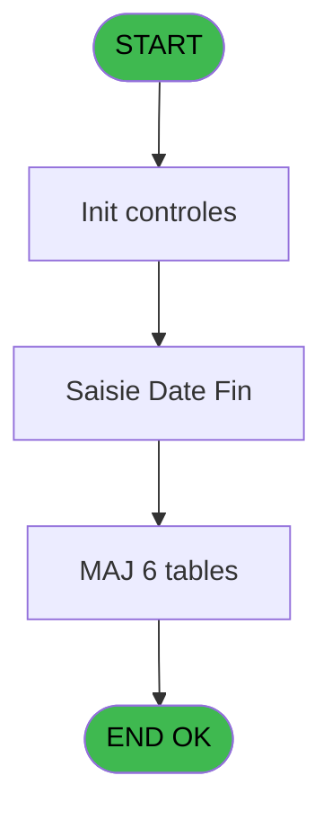
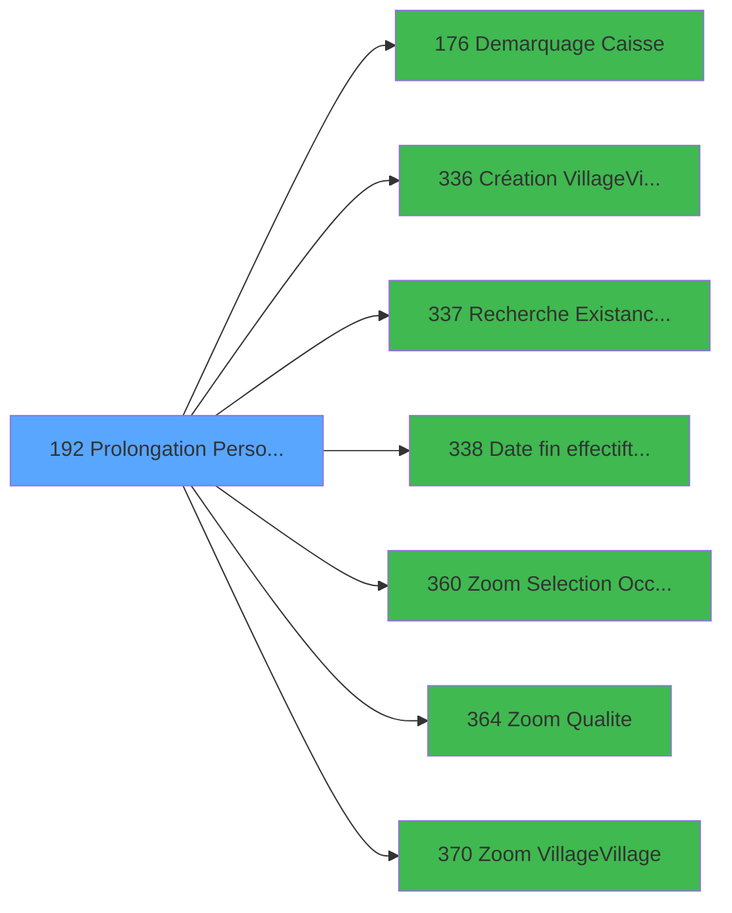

# PBG IDE 192 - Prolongation Personnel

> **Analyse**: Phases 1-4 2026-02-03 10:05 -> 10:05 (19s) | Assemblage 10:05
> **Pipeline**: V7.2 Enrichi
> **Structure**: 4 onglets (Resume | Ecrans | Donnees | Connexions)

<!-- TAB:Resume -->

## 1. FICHE D'IDENTITE

| Attribut | Valeur |
|----------|--------|
| Projet | PBG |
| IDE Position | 192 |
| Nom Programme | Prolongation Personnel |
| Fichier source | `Prg_192.xml` |
| Domaine metier | General |
| Taches | 14 (1 ecrans visibles) |
| Tables modifiees | 6 |
| Programmes appeles | 7 |

## 2. DESCRIPTION FONCTIONNELLE

**Prolongation Personnel** assure la gestion complete de ce processus, accessible depuis [Sejours personnel SubForm (IDE 0)](PBG-IDE-0.md), [Sejours personnel CallTask (IDE 196)](PBG-IDE-196.md).

Le flux de traitement s'organise en **5 blocs fonctionnels** :

- **Traitement** (9 taches) : traitements metier divers
- **Creation** (2 taches) : insertion d'enregistrements en base (mouvements, prestations)
- **Validation** (1 tache) : controles et verifications de coherence
- **Calcul** (1 tache) : calculs de montants, stocks ou compteurs
- **Saisie** (1 tache) : ecrans de saisie utilisateur (formulaires, champs, donnees)

**Donnees modifiees** : 6 tables en ecriture (gm-recherche_____gmr, hebergement______heb, personnel_go______go, compte_gm________cgm, historik_station, fichier_validation).

Detail : phases du traitement

#### Phase 1 : Traitement (9 taches)

- **192** - Prolongation Personnel **[[ECRAN]](#ecran-t1)**
- **192.1** - Recuperation Periode Debut
- **192.3** - Confirmation Prolongation **[[ECRAN]](#ecran-t4)**
- **192.4** - Prolongation Batch **[[ECRAN]](#ecran-t5)**
- **192.4.1** - Recuperation Hebergement
- **192.4.3** - Modification Package
- **192.4.4** - Modification Sejour
- **192.4.5** - Modification Sejour
- **192.4.9** - Credit Bar **[[ECRAN]](#ecran-t73)**

Delegue a : [Demarquage Caisse (IDE 176)](PBG-IDE-176.md), [Création Village/Village (IDE 336)](PBG-IDE-336.md)

#### Phase 2 : Saisie (1 tache)

- **192.2** - Saisie Date Fin **[[ECRAN]](#ecran-t3)**

#### Phase 3 : Creation (2 taches)

- **192.4.2** - Creation Hebergement
- **192.4.8** - Creation Historique

#### Phase 4 : Calcul (1 tache)

- **192.4.6** - Modification Compte

#### Phase 5 : Validation (1 tache)

- **192.4.7** - Modification Validation

#### Tables impactees

| Table | Operations | Role metier |
|-------|-----------|-------------|
| hebergement______heb | R/**W** (4 usages) | Hebergement (chambres) |
| personnel_go______go | R/**W** (2 usages) |  |
| historik_station | **W** (1 usages) | Historique / journal |
| fichier_validation | **W** (1 usages) |  |
| gm-recherche_____gmr | **W** (1 usages) | Index de recherche |
| compte_gm________cgm | **W** (1 usages) | Comptes GM (generaux) |

## 3. BLOCS FONCTIONNELS

### 3.1 Traitement (9 taches)

Traitements internes.

---

#### 192 - Prolongation Personnel [[ECRAN]](#ecran-t1)

**Role** : Tache d'orchestration : point d'entree du programme (9 sous-taches). Coordonne l'enchainement des traitements.
**Ecran** : 434 x 121 DLU (MDI) | [Voir mockup](#ecran-t1)

8 sous-taches directes

| Tache | Nom | Bloc |
|-------|-----|------|
| [192.1](#t2) | Recuperation Periode Debut | Traitement |
| [192.3](#t4) | Confirmation Prolongation **[[ECRAN]](#ecran-t4)** | Traitement |
| [192.4](#t5) | Prolongation Batch **[[ECRAN]](#ecran-t5)** | Traitement |
| [192.4.1](#t6) | Recuperation Hebergement | Traitement |
| [192.4.3](#t8) | Modification Package | Traitement |
| [192.4.4](#t9) | Modification Sejour | Traitement |
| [192.4.5](#t10) | Modification Sejour | Traitement |
| [192.4.9](#t73) | Credit Bar **[[ECRAN]](#ecran-t73)** | Traitement |

**Delegue a** : [Demarquage Caisse (IDE 176)](PBG-IDE-176.md), [Création Village/Village (IDE 336)](PBG-IDE-336.md)

---

#### 192.1 - Recuperation Periode Debut

**Role** : Consultation/chargement : Recuperation Periode Debut.
**Variables liees** : C (W0-Date Debut), D (W0-Heure Debut)
**Delegue a** : [Demarquage Caisse (IDE 176)](PBG-IDE-176.md), [Création Village/Village (IDE 336)](PBG-IDE-336.md)

---

#### 192.3 - Confirmation Prolongation [[ECRAN]](#ecran-t4)

**Role** : Traitement : Confirmation Prolongation.
**Ecran** : 132 x 32 DLU (Modal) | [Voir mockup](#ecran-t4)
**Delegue a** : [Demarquage Caisse (IDE 176)](PBG-IDE-176.md), [Création Village/Village (IDE 336)](PBG-IDE-336.md)

---

#### 192.4 - Prolongation Batch [[ECRAN]](#ecran-t5)

**Role** : Traitement : Prolongation Batch.
**Ecran** : 392 x 154 DLU (Modal) | [Voir mockup](#ecran-t5)
**Delegue a** : [Demarquage Caisse (IDE 176)](PBG-IDE-176.md), [Création Village/Village (IDE 336)](PBG-IDE-336.md)

---

#### 192.4.1 - Recuperation Hebergement

**Role** : Consultation/chargement : Recuperation Hebergement.
**Delegue a** : [Demarquage Caisse (IDE 176)](PBG-IDE-176.md), [Création Village/Village (IDE 336)](PBG-IDE-336.md)

---

#### 192.4.3 - Modification Package

**Role** : Traitement : Modification Package.
**Delegue a** : [Demarquage Caisse (IDE 176)](PBG-IDE-176.md), [Création Village/Village (IDE 336)](PBG-IDE-336.md)

---

#### 192.4.4 - Modification Sejour

**Role** : Traitement : Modification Sejour.
**Variables liees** : N (P Saisir Lieu Sejour ?), J (W0-Lieu de sejour)
**Delegue a** : [Demarquage Caisse (IDE 176)](PBG-IDE-176.md), [Création Village/Village (IDE 336)](PBG-IDE-336.md)

---

#### 192.4.5 - Modification Sejour

**Role** : Traitement : Modification Sejour.
**Variables liees** : N (P Saisir Lieu Sejour ?), J (W0-Lieu de sejour)
**Delegue a** : [Demarquage Caisse (IDE 176)](PBG-IDE-176.md), [Création Village/Village (IDE 336)](PBG-IDE-336.md)

---

#### 192.4.9 - Credit Bar [[ECRAN]](#ecran-t73)

**Role** : Calcul fidelite/avantage : Credit Bar.
**Ecran** : 500 x 80 DLU (Modal) | [Voir mockup](#ecran-t73)
**Delegue a** : [Demarquage Caisse (IDE 176)](PBG-IDE-176.md), [Création Village/Village (IDE 336)](PBG-IDE-336.md)

### 3.2 Saisie (1 tache)

L'operateur saisit les donnees de la transaction via 1 ecran (Saisie Date Fin).

---

#### 192.2 - Saisie Date Fin [[ECRAN]](#ecran-t3)

**Role** : Saisie des donnees : Saisie Date Fin.
**Ecran** : 622 x 89 DLU (MDI) | [Voir mockup](#ecran-t3)
**Variables liees** : C (W0-Date Debut), E (W0-Date Fin)

### 3.3 Creation (2 taches)

Insertion de nouveaux enregistrements en base.

---

#### 192.4.2 - Creation Hebergement

**Role** : Creation d'enregistrement : Creation Hebergement.

---

#### 192.4.8 - Creation Historique

**Role** : Consultation/chargement : Creation Historique.

### 3.4 Calcul (1 tache)

Calculs metier : montants, stocks, compteurs.

---

#### 192.4.6 - Modification Compte

**Role** : Traitement : Modification Compte.

### 3.5 Validation (1 tache)

Controles de coherence : 1 tache verifie les donnees et conditions.

---

#### 192.4.7 - Modification Validation

**Role** : Verification : Modification Validation.

## 5. REGLES METIER

*(Aucune regle metier identifiee)*

## 6. CONTEXTE

- **Appele par**: [Sejours personnel SubForm (IDE 0)](PBG-IDE-0.md), [Sejours personnel CallTask (IDE 196)](PBG-IDE-196.md)
- **Appelle**: 7 programmes | **Tables**: 8 (W:6 R:3 L:1) | **Taches**: 14 | **Expressions**: 10

<!-- TAB:Ecrans -->

## 8. ECRANS

### 8.1 Forms visibles (1 / 14)

| # | Position | Tache | Nom | Type | Largeur | Hauteur | Bloc |
|---|----------|-------|-----|------|---------|---------|------|
| 1 | 192.2 | 192.2 | Saisie Date Fin | MDI | 622 | 89 | Saisie |

### 8.2 Mockups Ecrans

---

#### 192.2 - Saisie Date Fin
**Tache** : [192.2](#t3) | **Type** : MDI | **Dimensions** : 622 x 89 DLU
**Bloc** : Saisie | **Titre IDE** : Saisie Date Fin

<!-- FORM-DATA:
{
    "width":  622,
    "vFactor":  8,
    "type":  "MDI",
    "hFactor":  8,
    "controls":  [
                     {
                         "x":  150,
                         "type":  "label",
                         "var":  "",
                         "y":  12,
                         "w":  464,
                         "fmt":  "",
                         "name":  "",
                         "h":  41,
                         "color":  "",
                         "text":  "",
                         "parent":  null
                     },
                     {
                         "x":  158,
                         "type":  "label",
                         "var":  "",
                         "y":  37,
                         "w":  93,
                         "fmt":  "",
                         "name":  "",
                         "h":  10,
                         "color":  "",
                         "text":  "Date fin",
                         "parent":  2
                     },
                     {
                         "x":  0,
                         "type":  "label",
                         "var":  "",
                         "y":  62,
                         "w":  613,
                         "fmt":  "",
                         "name":  "",
                         "h":  24,
                         "color":  "",
                         "text":  "",
                         "parent":  null
                     },
                     {
                         "x":  158,
                         "type":  "label",
                         "var":  "",
                         "y":  23,
                         "w":  119,
                         "fmt":  "",
                         "name":  "",
                         "h":  10,
                         "color":  "",
                         "text":  "Lieu de séjour",
                         "parent":  2
                     },
                     {
                         "x":  437,
                         "type":  "button",
                         "var":  "",
                         "y":  37,
                         "w":  27,
                         "fmt":  "...",
                         "name":  "W1-bouton date",
                         "h":  10,
                         "color":  "",
                         "text":  "",
                         "parent":  2
                     },
                     {
                         "x":  303,
                         "type":  "edit",
                         "var":  "",
                         "y":  37,
                         "w":  126,
                         "fmt":  "DD/MM/YYYYZ",
                         "name":  "W1-Date Fin",
                         "h":  10,
                         "color":  "110",
                         "text":  "",
                         "parent":  2
                     },
                     {
                         "x":  5,
                         "type":  "image",
                         "var":  "",
                         "y":  2,
                         "w":  160,
                         "fmt":  "",
                         "name":  "",
                         "h":  53,
                         "color":  "",
                         "text":  "",
                         "parent":  null
                     },
                     {
                         "x":  5,
                         "type":  "button",
                         "var":  "",
                         "y":  66,
                         "w":  154,
                         "fmt":  "\u0026Ok",
                         "name":  "",
                         "h":  18,
                         "color":  "",
                         "text":  "",
                         "parent":  5
                     },
                     {
                         "x":  164,
                         "type":  "button",
                         "var":  "",
                         "y":  66,
                         "w":  154,
                         "fmt":  "A\u0026bandonner",
                         "name":  "",
                         "h":  18,
                         "color":  "",
                         "text":  "",
                         "parent":  5
                     },
                     {
                         "x":  302,
                         "type":  "combobox",
                         "var":  "",
                         "y":  23,
                         "w":  306,
                         "fmt":  "",
                         "name":  "W1-Lieu de sejour",
                         "h":  12,
                         "color":  "",
                         "text":  "1,2",
                         "parent":  2
                     }
                 ],
    "taskId":  "192.2",
    "height":  89
}
-->

<strong>Champs : 2 champs</strong>

| Pos (x,y) | Nom | Variable | Type |
|-----------|-----|----------|------|
| 303,37 | W1-Date Fin | - | edit |
| 302,23 | W1-Lieu de sejour | - | combobox |

<strong>Boutons : 3 boutons</strong>

| Bouton | Pos (x,y) | Action |
|--------|-----------|--------|
| ... | 437,37 | Bouton fonctionnel |
| Ok | 5,66 | Valide la saisie et enregistre |
| Abandonner | 164,66 | Annule et retour au menu |

## 9. NAVIGATION

Ecran unique: **Saisie Date Fin**

### 9.3 Structure hierarchique (14 taches)

| Position | Tache | Type | Dimensions | Bloc |
|----------|-------|------|------------|------|
| **192.1** | [**Prolongation Personnel** (192)](#t1) [mockup](#ecran-t1) | MDI | 434x121 | Traitement |
| 192.1.1 | [Recuperation Periode Debut (192.1)](#t2) | MDI | - | |
| 192.1.2 | [Confirmation Prolongation (192.3)](#t4) [mockup](#ecran-t4) | Modal | 132x32 | |
| 192.1.3 | [Prolongation Batch (192.4)](#t5) [mockup](#ecran-t5) | Modal | 392x154 | |
| 192.1.4 | [Recuperation Hebergement (192.4.1)](#t6) | MDI | - | |
| 192.1.5 | [Modification Package (192.4.3)](#t8) | MDI | - | |
| 192.1.6 | [Modification Sejour (192.4.4)](#t9) | MDI | - | |
| 192.1.7 | [Modification Sejour (192.4.5)](#t10) | MDI | - | |
| 192.1.8 | [Credit Bar (192.4.9)](#t73) [mockup](#ecran-t73) | Modal | 500x80 | |
| **192.2** | [**Saisie Date Fin** (192.2)](#t3) [mockup](#ecran-t3) | MDI | 622x89 | Saisie |
| **192.3** | [**Creation Hebergement** (192.4.2)](#t7) | MDI | - | Creation |
| 192.3.1 | [Creation Historique (192.4.8)](#t13) | MDI | - | |
| **192.4** | [**Modification Compte** (192.4.6)](#t11) | MDI | - | Calcul |
| **192.5** | [**Modification Validation** (192.4.7)](#t12) | MDI | - | Validation |

### 9.4 Algorigramme

> **Legende**: Vert = START/END OK | Rouge = END KO | Bleu = Decisions
> *Algorigramme auto-genere. Utiliser `/algorigramme` pour une synthese metier detaillee.*

<!-- TAB:Donnees -->

## 10. TABLES

### Tables utilisees (8)

| ID | Nom | Description | Type | R | W | L | Usages |
|----|-----|-------------|------|---|---|---|--------|
| 30 | gm-recherche_____gmr | Index de recherche | DB |   | **W** |   | 1 |
| 34 | hebergement______heb | Hebergement (chambres) | DB | R | **W** |   | 4 |
| 35 | personnel_go______go |  | DB | R | **W** |   | 2 |
| 47 | compte_gm________cgm | Comptes GM (generaux) | DB |   | **W** |   | 1 |
| 88 | historik_station | Historique / journal | DB |   | **W** |   | 1 |
| 131 | fichier_validation |  | DB |   | **W** |   | 1 |
| 134 | groupe_arr_dep___vol |  | DB |   |   | L | 1 |
| 847 | stat_lieu_vente_date | Statistiques point de vente | TMP | R |   |   | 1 |

### Colonnes par table (2 / 7 tables avec colonnes identifiees)

Table 30 - gm-recherche_____gmr (**W**) - 1 usages

*Table utilisee uniquement en Link ou aucune colonne Real identifiee dans le DataView.*

Table 34 - hebergement______heb (R/**W**) - 4 usages

*Table utilisee uniquement en Link ou aucune colonne Real identifiee dans le DataView.*

Table 35 - personnel_go______go (R/**W**) - 2 usages

| Lettre | Variable | Acces | Type |
|--------|----------|-------|------|
| A | W1-Code Retour | W | Numeric |
| B | W1-Statut Sejour | W | Alpha |
| C | W1-Libelle | W | Alpha |
| D | W1-Age | W | Alpha |
| E | W1-Nationalite | W | Alpha |
| F | W1-Code Sexe | W | Alpha |
| G | W1-Code Fumeur | W | Alpha |
| H | W1-Age num | W | Numeric |
| I | W1-Nb mois | W | Numeric |
| J | W1-Complément Type | W | Unicode |
| K | W1-Lieu de sejour | W | Alpha |

Table 47 - compte_gm________cgm (**W**) - 1 usages

*Table utilisee uniquement en Link ou aucune colonne Real identifiee dans le DataView.*

Table 88 - historik_station (**W**) - 1 usages

*Table utilisee uniquement en Link ou aucune colonne Real identifiee dans le DataView.*

Table 131 - fichier_validation (**W**) - 1 usages

*Table utilisee uniquement en Link ou aucune colonne Real identifiee dans le DataView.*

Table 847 - stat_lieu_vente_date (R) - 1 usages

| Lettre | Variable | Acces | Type |
|--------|----------|-------|------|
| A | v Retout Crédit Bar / Q | R | Logical |
| B | v Date de début | R | Date |
| C | v Date de fin | R | Date |
| D | v Nbre de Jour | R | Numeric |
| E | v Time (N.U) | R | Time |
| F | v Montant Calculé | R | Numeric |

## 11. VARIABLES

### 11.1 Parametres entrants (1)

Variables recues du programme appelant ([Sejours personnel SubForm (IDE 0)](PBG-IDE-0.md)).

| Lettre | Nom | Type | Usage dans |
|--------|-----|------|-----------|
| N | P Saisir Lieu Sejour ? | Logical | - |

### 11.2 Autres (13)

Variables diverses.

| Lettre | Nom | Type | Usage dans |
|--------|-----|------|-----------|
| A | W0-Qualite | Alpha | - |
| B | W0-Complement | Alpha | - |
| C | W0-Date Debut | Date | - |
| D | W0-Heure Debut | Alpha | - |
| E | W0-Date Fin | Date | - |
| F | W0-Heure Fin | Alpha | - |
| G | W0-Occupation | Alpha | - |
| H | W0-Base Occupation | Alpha | - |
| I | W0-Accord Suite | Alpha | 2x refs |
| J | W0-Lieu de sejour | Alpha | - |
| K | W0-Existe Code VV | Logical | - |
| L | W0-Code VV | Alpha | - |
| M | W0-Heure VV | Alpha | - |

## 12. EXPRESSIONS

**10 / 10 expressions decodees (100%)**

### 12.1 Repartition par type

| Type | Expressions | Regles |
|------|-------------|--------|
| CONSTANTE | 4 | 0 |
| OTHER | 4 | 0 |
| CONDITION | 2 | 0 |

### 12.2 Expressions cles par type

#### CONSTANTE (4 expressions)

| Type | IDE | Expression | Regle |
|------|-----|------------|-------|
| CONSTANTE | 8 | `''` | - |
| CONSTANTE | 9 | `'R'` | - |
| CONSTANTE | 4 | `'TBAOC'` | - |
| CONSTANTE | 5 | `'P'` | - |

#### OTHER (4 expressions)

| Type | IDE | Expression | Regle |
|------|-----|------------|-------|
| OTHER | 3 | `GetParam ('SOCIETE')` | - |
| OTHER | 10 | `NOT([X])` | - |
| OTHER | 1 | `GetParam ('NRO_CPTE')` | - |
| OTHER | 2 | `GetParam ('LANGUE')` | - |

#### CONDITION (2 expressions)

| Type | IDE | Expression | Regle |
|------|-----|------------|-------|
| CONDITION | 7 | `W0-Accord Suite [I]='E'` | - |
| CONDITION | 6 | `W0-Accord Suite [I]='O'` | - |

<!-- TAB:Connexions -->

## 13. GRAPHE D'APPELS

### 13.1 Chaine depuis Main (Callers)

Main -> ... -> [Sejours personnel SubForm (IDE 0)](PBG-IDE-0.md) -> **Prolongation Personnel (IDE 192)**

Main -> ... -> [Sejours personnel CallTask (IDE 196)](PBG-IDE-196.md) -> **Prolongation Personnel (IDE 192)**

### 13.2 Callers

| IDE | Nom Programme | Nb Appels |
|-----|---------------|-----------|
| [0](PBG-IDE-0.md) | Sejours personnel SubForm | 1 |
| [196](PBG-IDE-196.md) | Sejours personnel CallTask | 1 |

### 13.3 Callees (programmes appeles)

### 13.4 Detail Callees avec contexte

| IDE | Nom Programme | Appels | Contexte |
|-----|---------------|--------|----------|
| [176](PBG-IDE-176.md) | Demarquage Caisse | 1 | Sous-programme |
| [336](PBG-IDE-336.md) | Création Village/Village | 1 | Sous-programme |
| [337](PBG-IDE-337.md) | Recherche Existance Groupe A/D | 1 | Sous-programme |
| [338](PBG-IDE-338.md) | Date fin effectif/t transfert | 1 | Transfert donnees |
| [360](PBG-IDE-360.md) | Zoom Selection Occupation | 1 | Selection/consultation |
| [364](PBG-IDE-364.md) | Zoom Qualite | 1 | Selection/consultation |
| [370](PBG-IDE-370.md) | Zoom Village/Village | 1 | Selection/consultation |

## 14. RECOMMANDATIONS MIGRATION

### 14.1 Profil du programme

| Metrique | Valeur | Impact migration |
|----------|--------|-----------------|
| Lignes de logique | 300 | Taille moyenne |
| Expressions | 10 | Peu de logique |
| Tables WRITE | 6 | Fort impact donnees |
| Sous-programmes | 7 | Dependances moderees |
| Ecrans visibles | 1 | Ecran unique ou traitement batch |
| Code desactive | 0% (0 / 300) | Code sain |
| Regles metier | 0 | Pas de regle identifiee |

### 14.2 Plan de migration par bloc

#### Traitement (9 taches: 4 ecrans, 5 traitements)

- **Strategie** : Orchestrateur avec 4 ecrans (Razor/React) et 5 traitements backend (services).
- Les ecrans deviennent des composants UI, les traitements invisibles deviennent des services injectables.
- 7 sous-programme(s) a migrer ou a reutiliser depuis les services existants.
- Decomposer les taches en services unitaires testables.

#### Saisie (1 tache: 1 ecran, 0 traitement)

- **Strategie** : Formulaire React/Blazor avec validation Zod/FluentValidation.
- Reproduire 1 ecran : Saisie Date Fin
- Validation temps reel cote client + serveur

#### Creation (2 taches: 0 ecran, 2 traitements)

- **Strategie** : Repository pattern avec Entity Framework Core.
- Insertion via `IRepository<T>.CreateAsync()`

#### Calcul (1 tache: 0 ecran, 1 traitement)

- **Strategie** : Services de calcul purs (Domain Services).
- Migrer la logique de calcul (stock, compteurs, montants)

#### Validation (1 tache: 0 ecran, 1 traitement)

- **Strategie** : FluentValidation avec validators specifiques.
- Chaque tache de validation -> un validator injectable

### 14.3 Dependances critiques

| Dependance | Type | Appels | Impact |
|------------|------|--------|--------|
| gm-recherche_____gmr | Table WRITE (Database) | 1x | Schema + repository |
| hebergement______heb | Table WRITE (Database) | 2x | Schema + repository |
| personnel_go______go | Table WRITE (Database) | 1x | Schema + repository |
| compte_gm________cgm | Table WRITE (Database) | 1x | Schema + repository |
| historik_station | Table WRITE (Database) | 1x | Schema + repository |
| fichier_validation | Table WRITE (Database) | 1x | Schema + repository |
| [Zoom Selection Occupation (IDE 360)](PBG-IDE-360.md) | Sous-programme | 1x | Normale - Selection/consultation |
| [Zoom Qualite (IDE 364)](PBG-IDE-364.md) | Sous-programme | 1x | Normale - Selection/consultation |
| [Zoom Village/Village (IDE 370)](PBG-IDE-370.md) | Sous-programme | 1x | Normale - Selection/consultation |
| [Date fin effectif/t transfert (IDE 338)](PBG-IDE-338.md) | Sous-programme | 1x | Normale - Transfert donnees |
| [Demarquage Caisse (IDE 176)](PBG-IDE-176.md) | Sous-programme | 1x | Normale - Sous-programme |
| [Création Village/Village (IDE 336)](PBG-IDE-336.md) | Sous-programme | 1x | Normale - Sous-programme |
| [Recherche Existance Groupe A/D (IDE 337)](PBG-IDE-337.md) | Sous-programme | 1x | Normale - Sous-programme |

---
*Spec DETAILED generee par Pipeline V7.2 - 2026-02-03 10:05*
