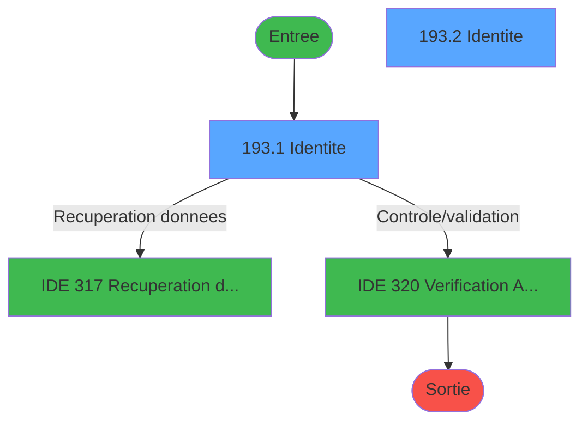
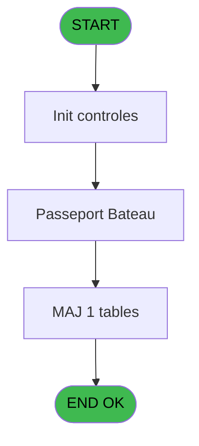
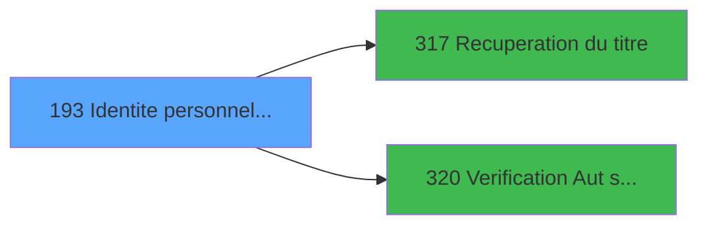

# PBG IDE 193 - Identite personnel passport

> **Analyse**: Phases 1-4 2026-02-03 10:06 -> 10:06 (19s) | Assemblage 10:06
> **Pipeline**: V7.2 Enrichi
> **Structure**: 4 onglets (Resume | Ecrans | Donnees | Connexions)

<!-- TAB:Resume -->

## 1. FICHE D'IDENTITE

| Attribut | Valeur |
|----------|--------|
| Projet | PBG |
| IDE Position | 193 |
| Nom Programme | Identite personnel passport |
| Fichier source | `Prg_193.xml` |
| Domaine metier | General |
| Taches | 4 (2 ecrans visibles) |
| Tables modifiees | 1 |
| Programmes appeles | 2 |

## 2. DESCRIPTION FONCTIONNELLE

**Identite personnel passport** assure la gestion complete de ce processus, accessible depuis [Sejours personnel SubForm (IDE 0)](PBG-IDE-0.md), [Sejours personnel CallTask (IDE 196)](PBG-IDE-196.md).

Le flux de traitement s'organise en **1 blocs fonctionnels** :

- **Traitement** (4 taches) : traitements metier divers

**Donnees modifiees** : 1 tables en ecriture (fi_complet_______gm_go).

**Logique metier** : 1 regles identifiees couvrant valeurs par defaut.

Detail : phases du traitement

#### Phase 1 : Traitement (4 taches)

- **193** - Module des Identites
- **193.1** - Identite **[[ECRAN]](#ecran-t2)**
- **193.2** - Identite **[[ECRAN]](#ecran-t3)**
- **193.2.1** - Mise a jour Greek

Delegue a : [Recuperation du titre (IDE 317)](PBG-IDE-317.md)

#### Tables impactees

| Table | Operations | Role metier |
|-------|-----------|-------------|
| fi_complet_______gm_go | **W** (1 usages) |  |

## 3. BLOCS FONCTIONNELS

### 3.1 Traitement (4 taches)

Traitements internes.

---

#### 193 - Module des Identites

**Role** : Traitement : Module des Identites.

3 sous-taches directes

| Tache | Nom | Bloc |
|-------|-----|------|
| [193.1](#t2) | Identite **[[ECRAN]](#ecran-t2)** | Traitement |
| [193.2](#t3) | Identite **[[ECRAN]](#ecran-t3)** | Traitement |
| [193.2.1](#t4) | Mise a jour Greek | Traitement |

**Delegue a** : [Recuperation du titre (IDE 317)](PBG-IDE-317.md)

---

#### 193.1 - Identite [[ECRAN]](#ecran-t2)

**Role** : Traitement : Identite.
**Ecran** : 731 x 296 DLU (MDI) | [Voir mockup](#ecran-t2)
**Delegue a** : [Recuperation du titre (IDE 317)](PBG-IDE-317.md)

---

#### 193.2 - Identite [[ECRAN]](#ecran-t3)

**Role** : Traitement : Identite.
**Ecran** : 726 x 222 DLU (MDI) | [Voir mockup](#ecran-t3)
**Delegue a** : [Recuperation du titre (IDE 317)](PBG-IDE-317.md)

---

#### 193.2.1 - Mise a jour Greek

**Role** : Traitement : Mise a jour Greek.
**Delegue a** : [Recuperation du titre (IDE 317)](PBG-IDE-317.md)

## 5. REGLES METIER

1 regles identifiees:

### Autres (1 regles)

#### [RM-001] Valeur par defaut si Trim (> Mode attaque ecran [C]) est vide

| Element | Detail |
|---------|--------|
| **Condition** | `Trim (> Mode attaque ecran [C])=''` |
| **Si vrai** | 'E'MODE |
| **Si faux** | > Mode attaque ecran [C]) |
| **Variables** | C (> Mode attaque ecran) |
| **Expression source** | Expression 3 : `IF (Trim (> Mode attaque ecran [C])='','E'MODE,> Mode attaqu` |
| **Exemple** | Si Trim (> Mode attaque ecran [C])='' → 'E'MODE. Sinon → > Mode attaque ecran [C]) |

## 6. CONTEXTE

- **Appele par**: [Sejours personnel SubForm (IDE 0)](PBG-IDE-0.md), [Sejours personnel CallTask (IDE 196)](PBG-IDE-196.md)
- **Appelle**: 2 programmes | **Tables**: 6 (W:1 R:1 L:4) | **Taches**: 4 | **Expressions**: 12

<!-- TAB:Ecrans -->

## 8. ECRANS

### 8.1 Forms visibles (2 / 4)

| # | Position | Tache | Nom | Type | Largeur | Hauteur | Bloc |
|---|----------|-------|-----|------|---------|---------|------|
| 1 | 193.1 | 193.1 | Identite | MDI | 731 | 296 | Traitement |
| 2 | 193.2 | 193.2 | Identite | MDI | 726 | 222 | Traitement |

### 8.2 Mockups Ecrans

---

#### 193.1 - Identite
**Tache** : [193.1](#t2) | **Type** : MDI | **Dimensions** : 731 x 296 DLU
**Bloc** : Traitement | **Titre IDE** : Identite

<!-- FORM-DATA:
{
    "width":  731,
    "vFactor":  8,
    "type":  "MDI",
    "hFactor":  8,
    "controls":  [
                     {
                         "x":  1,
                         "type":  "label",
                         "var":  "",
                         "y":  1,
                         "w":  724,
                         "fmt":  "",
                         "name":  "",
                         "h":  19,
                         "color":  "1",
                         "text":  "",
                         "parent":  null
                     },
                     {
                         "x":  14,
                         "type":  "label",
                         "var":  "",
                         "y":  25,
                         "w":  698,
                         "fmt":  "",
                         "name":  "",
                         "h":  241,
                         "color":  "",
                         "text":  "",
                         "parent":  null
                     },
                     {
                         "x":  28,
                         "type":  "label",
                         "var":  "",
                         "y":  30,
                         "w":  43,
                         "fmt":  "",
                         "name":  "",
                         "h":  10,
                         "color":  "",
                         "text":  "Nom",
                         "parent":  4
                     },
                     {
                         "x":  385,
                         "type":  "label",
                         "var":  "",
                         "y":  31,
                         "w":  86,
                         "fmt":  "",
                         "name":  "",
                         "h":  10,
                         "color":  "",
                         "text":  "Nationalite",
                         "parent":  4
                     },
                     {
                         "x":  28,
                         "type":  "label",
                         "var":  "",
                         "y":  44,
                         "w":  66,
                         "fmt":  "",
                         "name":  "",
                         "h":  10,
                         "color":  "",
                         "text":  "Prenom",
                         "parent":  4
                     },
                     {
                         "x":  385,
                         "type":  "label",
                         "var":  "",
                         "y":  44,
                         "w":  147,
                         "fmt":  "",
                         "name":  "",
                         "h":  10,
                         "color":  "",
                         "text":  "Date de naissance",
                         "parent":  4
                     },
                     {
                         "x":  28,
                         "type":  "label",
                         "var":  "",
                         "y":  58,
                         "w":  42,
                         "fmt":  "",
                         "name":  "",
                         "h":  12,
                         "color":  "",
                         "text":  "Titre",
                         "parent":  4
                     },
                     {
                         "x":  385,
                         "type":  "label",
                         "var":  "",
                         "y":  58,
                         "w":  147,
                         "fmt":  "",
                         "name":  "",
                         "h":  10,
                         "color":  "",
                         "text":  "Lieu de naissance",
                         "parent":  4
                     },
                     {
                         "x":  14,
                         "type":  "label",
                         "var":  "",
                         "y":  73,
                         "w":  698,
                         "fmt":  "",
                         "name":  "",
                         "h":  75,
                         "color":  "",
                         "text":  "",
                         "parent":  null
                     },
                     {
                         "x":  27,
                         "type":  "label",
                         "var":  "",
                         "y":  81,
                         "w":  66,
                         "fmt":  "",
                         "name":  "",
                         "h":  8,
                         "color":  "",
                         "text":  "Securite",
                         "parent":  17
                     },
                     {
                         "x":  376,
                         "type":  "label",
                         "var":  "",
                         "y":  81,
                         "w":  66,
                         "fmt":  "",
                         "name":  "",
                         "h":  8,
                         "color":  "",
                         "text":  "Muster",
                         "parent":  17
                     },
                     {
                         "x":  27,
                         "type":  "label",
                         "var":  "",
                         "y":  96,
                         "w":  107,
                         "fmt":  "",
                         "name":  "",
                         "h":  8,
                         "color":  "",
                         "text":  "N° Passeport",
                         "parent":  17
                     },
                     {
                         "x":  27,
                         "type":  "label",
                         "var":  "",
                         "y":  109,
                         "w":  62,
                         "fmt":  "",
                         "name":  "",
                         "h":  8,
                         "color":  "",
                         "text":  "Emis le",
                         "parent":  17
                     },
                     {
                         "x":  454,
                         "type":  "label",
                         "var":  "",
                         "y":  113,
                         "w":  258,
                         "fmt":  "",
                         "name":  "",
                         "h":  35,
                         "color":  "",
                         "text":  "",
                         "parent":  null
                     },
                     {
                         "x":  473,
                         "type":  "label",
                         "var":  "",
                         "y":  119,
                         "w":  67,
                         "fmt":  "",
                         "name":  "",
                         "h":  10,
                         "color":  "",
                         "text":  "Arrivee",
                         "parent":  26
                     },
                     {
                         "x":  27,
                         "type":  "label",
                         "var":  "",
                         "y":  122,
                         "w":  72,
                         "fmt":  "",
                         "name":  "",
                         "h":  8,
                         "color":  "",
                         "text":  "Emis par",
                         "parent":  17
                     },
                     {
                         "x":  473,
                         "type":  "label",
                         "var":  "",
                         "y":  133,
                         "w":  59,
                         "fmt":  "",
                         "name":  "",
                         "h":  10,
                         "color":  "",
                         "text":  "Depart",
                         "parent":  26
                     },
                     {
                         "x":  29,
                         "type":  "label",
                         "var":  "",
                         "y":  135,
                         "w":  104,
                         "fmt":  "",
                         "name":  "",
                         "h":  8,
                         "color":  "",
                         "text":  "Handicap",
                         "parent":  17
                     },
                     {
                         "x":  14,
                         "type":  "label",
                         "var":  "",
                         "y":  148,
                         "w":  698,
                         "fmt":  "",
                         "name":  "",
                         "h":  63,
                         "color":  "",
                         "text":  "",
                         "parent":  null
                     },
                     {
                         "x":  71,
                         "type":  "label",
                         "var":  "",
                         "y":  155,
                         "w":  154,
                         "fmt":  "",
                         "name":  "",
                         "h":  10,
                         "color":  "",
                         "text":  "TV",
                         "parent":  34
                     },
                     {
                         "x":  455,
                         "type":  "label",
                         "var":  "",
                         "y":  156,
                         "w":  61,
                         "fmt":  "",
                         "name":  "",
                         "h":  10,
                         "color":  "",
                         "text":  "Video",
                         "parent":  34
                     },
                     {
                         "x":  71,
                         "type":  "label",
                         "var":  "",
                         "y":  168,
                         "w":  93,
                         "fmt":  "",
                         "name":  "",
                         "h":  10,
                         "color":  "",
                         "text":  "Radio",
                         "parent":  34
                     },
                     {
                         "x":  456,
                         "type":  "label",
                         "var":  "",
                         "y":  169,
                         "w":  93,
                         "fmt":  "",
                         "name":  "",
                         "h":  10,
                         "color":  "",
                         "text":  "Cigarette",
                         "parent":  34
                     },
                     {
                         "x":  71,
                         "type":  "label",
                         "var":  "",
                         "y":  181,
                         "w":  104,
                         "fmt":  "",
                         "name":  "",
                         "h":  10,
                         "color":  "",
                         "text":  "Walkman",
                         "parent":  34
                     },
                     {
                         "x":  456,
                         "type":  "label",
                         "var":  "",
                         "y":  182,
                         "w":  64,
                         "fmt":  "",
                         "name":  "",
                         "h":  10,
                         "color":  "",
                         "text":  "Alcool",
                         "parent":  34
                     },
                     {
                         "x":  71,
                         "type":  "label",
                         "var":  "",
                         "y":  194,
                         "w":  112,
                         "fmt":  "",
                         "name":  "",
                         "h":  10,
                         "color":  "",
                         "text":  "Camera",
                         "parent":  34
                     },
                     {
                         "x":  456,
                         "type":  "label",
                         "var":  "",
                         "y":  195,
                         "w":  112,
                         "fmt":  "",
                         "name":  "",
                         "h":  10,
                         "color":  "",
                         "text":  "Autre",
                         "parent":  34
                     },
                     {
                         "x":  14,
                         "type":  "label",
                         "var":  "",
                         "y":  211,
                         "w":  698,
                         "fmt":  "",
                         "name":  "",
                         "h":  38,
                         "color":  "",
                         "text":  "",
                         "parent":  null
                     },
                     {
                         "x":  27,
                         "type":  "label",
                         "var":  "",
                         "y":  218,
                         "w":  93,
                         "fmt":  "",
                         "name":  "",
                         "h":  8,
                         "color":  "",
                         "text":  "Embarque",
                         "parent":  51
                     },
                     {
                         "x":  27,
                         "type":  "label",
                         "var":  "",
                         "y":  234,
                         "w":  83,
                         "fmt":  "",
                         "name":  "",
                         "h":  8,
                         "color":  "",
                         "text":  "Le",
                         "parent":  51
                     },
                     {
                         "x":  27,
                         "type":  "label",
                         "var":  "",
                         "y":  253,
                         "w":  99,
                         "fmt":  "",
                         "name":  "",
                         "h":  8,
                         "color":  "",
                         "text":  "End pass",
                         "parent":  4
                     },
                     {
                         "x":  376,
                         "type":  "label",
                         "var":  "",
                         "y":  253,
                         "w":  93,
                         "fmt":  "",
                         "name":  "",
                         "h":  8,
                         "color":  "",
                         "text":  "End VISA",
                         "parent":  4
                     },
                     {
                         "x":  2,
                         "type":  "label",
                         "var":  "",
                         "y":  268,
                         "w":  725,
                         "fmt":  "",
                         "name":  "",
                         "h":  24,
                         "color":  "1",
                         "text":  "",
                         "parent":  null
                     },
                     {
                         "x":  543,
                         "type":  "edit",
                         "var":  "",
                         "y":  58,
                         "w":  146,
                         "fmt":  "U12",
                         "name":  "",
                         "h":  11,
                         "color":  "110",
                         "text":  "",
                         "parent":  4
                     },
                     {
                         "x":  145,
                         "type":  "edit",
                         "var":  "",
                         "y":  79,
                         "w":  171,
                         "fmt":  "",
                         "name":  "",
                         "h":  10,
                         "color":  "110",
                         "text":  "",
                         "parent":  17
                     },
                     {
                         "x":  494,
                         "type":  "edit",
                         "var":  "",
                         "y":  80,
                         "w":  126,
                         "fmt":  "",
                         "name":  "",
                         "h":  10,
                         "color":  "",
                         "text":  "",
                         "parent":  17
                     },
                     {
                         "x":  119,
                         "type":  "edit",
                         "var":  "",
                         "y":  59,
                         "w":  37,
                         "fmt":  "",
                         "name":  "",
                         "h":  10,
                         "color":  "",
                         "text":  "",
                         "parent":  4
                     },
                     {
                         "x":  117,
                         "type":  "edit",
                         "var":  "",
                         "y":  30,
                         "w":  238,
                         "fmt":  "",
                         "name":  "",
                         "h":  10,
                         "color":  "",
                         "text":  "",
                         "parent":  4
                     },
                     {
                         "x":  117,
                         "type":  "edit",
                         "var":  "",
                         "y":  44,
                         "w":  238,
                         "fmt":  "",
                         "name":  "",
                         "h":  10,
                         "color":  "",
                         "text":  "",
                         "parent":  4
                     },
                     {
                         "x":  543,
                         "type":  "edit",
                         "var":  "",
                         "y":  44,
                         "w":  146,
                         "fmt":  "",
                         "name":  "",
                         "h":  9,
                         "color":  "",
                         "text":  "",
                         "parent":  4
                     },
                     {
                         "x":  543,
                         "type":  "edit",
                         "var":  "",
                         "y":  31,
                         "w":  34,
                         "fmt":  "",
                         "name":  "",
                         "h":  9,
                         "color":  "",
                         "text":  "",
                         "parent":  4
                     },
                     {
                         "x":  145,
                         "type":  "edit",
                         "var":  "",
                         "y":  94,
                         "w":  171,
                         "fmt":  "",
                         "name":  "",
                         "h":  10,
                         "color":  "110",
                         "text":  "",
                         "parent":  17
                     },
                     {
                         "x":  145,
                         "type":  "edit",
                         "var":  "",
                         "y":  107,
                         "w":  171,
                         "fmt":  "",
                         "name":  "",
                         "h":  10,
                         "color":  "110",
                         "text":  "",
                         "parent":  17
                     },
                     {
                         "x":  145,
                         "type":  "edit",
                         "var":  "",
                         "y":  120,
                         "w":  171,
                         "fmt":  "",
                         "name":  "",
                         "h":  10,
                         "color":  "110",
                         "text":  "",
                         "parent":  17
                     },
                     {
                         "x":  142,
                         "type":  "checkbox",
                         "var":  "",
                         "y":  133,
                         "w":  32,
                         "fmt":  "",
                         "name":  "",
                         "h":  12,
                         "color":  "110",
                         "text":  "",
                         "parent":  17
                     },
                     {
                         "x":  233,
                         "type":  "edit",
                         "var":  "",
                         "y":  155,
                         "w":  48,
                         "fmt":  "",
                         "name":  "",
                         "h":  10,
                         "color":  "110",
                         "text":  "",
                         "parent":  34
                     },
                     {
                         "x":  233,
                         "type":  "edit",
                         "var":  "",
                         "y":  168,
                         "w":  48,
                         "fmt":  "",
                         "name":  "",
                         "h":  10,
                         "color":  "110",
                         "text":  "",
                         "parent":  34
                     },
                     {
                         "x":  233,
                         "type":  "edit",
                         "var":  "",
                         "y":  181,
                         "w":  48,
                         "fmt":  "",
                         "name":  "",
                         "h":  10,
                         "color":  "110",
                         "text":  "",
                         "parent":  34
                     },
                     {
                         "x":  233,
                         "type":  "edit",
                         "var":  "",
                         "y":  194,
                         "w":  48,
                         "fmt":  "",
                         "name":  "",
                         "h":  10,
                         "color":  "110",
                         "text":  "",
                         "parent":  34
                     },
                     {
                         "x":  617,
                         "type":  "edit",
                         "var":  "",
                         "y":  156,
                         "w":  48,
                         "fmt":  "",
                         "name":  "",
                         "h":  10,
                         "color":  "110",
                         "text":  "",
                         "parent":  34
                     },
                     {
                         "x":  617,
                         "type":  "edit",
                         "var":  "",
                         "y":  169,
                         "w":  48,
                         "fmt":  "",
                         "name":  "",
                         "h":  10,
                         "color":  "110",
                         "text":  "",
                         "parent":  34
                     },
                     {
                         "x":  618,
                         "type":  "edit",
                         "var":  "",
                         "y":  182,
                         "w":  48,
                         "fmt":  "",
                         "name":  "",
                         "h":  10,
                         "color":  "110",
                         "text":  "",
                         "parent":  34
                     },
                     {
                         "x":  618,
                         "type":  "edit",
                         "var":  "",
                         "y":  195,
                         "w":  48,
                         "fmt":  "",
                         "name":  "",
                         "h":  10,
                         "color":  "110",
                         "text":  "",
                         "parent":  34
                     },
                     {
                         "x":  139,
                         "type":  "edit",
                         "var":  "",
                         "y":  217,
                         "w":  138,
                         "fmt":  "",
                         "name":  "",
                         "h":  10,
                         "color":  "110",
                         "text":  "",
                         "parent":  51
                     },
                     {
                         "x":  139,
                         "type":  "edit",
                         "var":  "",
                         "y":  233,
                         "w":  138,
                         "fmt":  "",
                         "name":  "",
                         "h":  10,
                         "color":  "110",
                         "text":  "",
                         "parent":  51
                     },
                     {
                         "x":  139,
                         "type":  "edit",
                         "var":  "",
                         "y":  252,
                         "w":  126,
                         "fmt":  "",
                         "name":  "",
                         "h":  10,
                         "color":  "110",
                         "text":  "",
                         "parent":  4
                     },
                     {
                         "x":  494,
                         "type":  "edit",
                         "var":  "",
                         "y":  252,
                         "w":  126,
                         "fmt":  "",
                         "name":  "",
                         "h":  10,
                         "color":  "110",
                         "text":  "",
                         "parent":  4
                     },
                     {
                         "x":  559,
                         "type":  "edit",
                         "var":  "",
                         "y":  118,
                         "w":  126,
                         "fmt":  "",
                         "name":  "",
                         "h":  10,
                         "color":  "",
                         "text":  "",
                         "parent":  26
                     },
                     {
                         "x":  559,
                         "type":  "edit",
                         "var":  "",
                         "y":  133,
                         "w":  126,
                         "fmt":  "",
                         "name":  "",
                         "h":  10,
                         "color":  "",
                         "text":  "",
                         "parent":  26
                     },
                     {
                         "x":  444,
                         "type":  "edit",
                         "var":  "",
                         "y":  6,
                         "w":  275,
                         "fmt":  "WWW DD MMM YYYYT",
                         "name":  "",
                         "h":  8,
                         "color":  "",
                         "text":  "",
                         "parent":  null
                     },
                     {
                         "x":  8,
                         "type":  "button",
                         "var":  "",
                         "y":  272,
                         "w":  154,
                         "fmt":  "\u0026Ok",
                         "name":  "",
                         "h":  18,
                         "color":  "",
                         "text":  "",
                         "parent":  null
                     },
                     {
                         "x":  171,
                         "type":  "button",
                         "var":  "",
                         "y":  272,
                         "w":  154,
                         "fmt":  "A\u0026bandonner",
                         "name":  "",
                         "h":  18,
                         "color":  "",
                         "text":  "",
                         "parent":  null
                     },
                     {
                         "x":  564,
                         "type":  "button",
                         "var":  "",
                         "y":  272,
                         "w":  154,
                         "fmt":  "\u0026Modification",
                         "name":  "",
                         "h":  18,
                         "color":  "",
                         "text":  "",
                         "parent":  null
                     },
                     {
                         "x":  9,
                         "type":  "edit",
                         "var":  "",
                         "y":  6,
                         "w":  478,
                         "fmt":  "30",
                         "name":  "",
                         "h":  8,
                         "color":  "",
                         "text":  "",
                         "parent":  null
                     }
                 ],
    "taskId":  "193.1",
    "height":  296
}
-->

<strong>Champs : 28 champs</strong>

| Pos (x,y) | Nom | Variable | Type |
|-----------|-----|----------|------|
| 543,58 | U12 | - | edit |
| 145,79 | (sans nom) | - | edit |
| 494,80 | (sans nom) | - | edit |
| 119,59 | (sans nom) | - | edit |
| 117,30 | (sans nom) | - | edit |
| 117,44 | (sans nom) | - | edit |
| 543,44 | (sans nom) | - | edit |
| 543,31 | (sans nom) | - | edit |
| 145,94 | (sans nom) | - | edit |
| 145,107 | (sans nom) | - | edit |
| 145,120 | (sans nom) | - | edit |
| 142,133 | (sans nom) | - | checkbox |
| 233,155 | (sans nom) | - | edit |
| 233,168 | (sans nom) | - | edit |
| 233,181 | (sans nom) | - | edit |
| 233,194 | (sans nom) | - | edit |
| 617,156 | (sans nom) | - | edit |
| 617,169 | (sans nom) | - | edit |
| 618,182 | (sans nom) | - | edit |
| 618,195 | (sans nom) | - | edit |
| 139,217 | (sans nom) | - | edit |
| 139,233 | (sans nom) | - | edit |
| 139,252 | (sans nom) | - | edit |
| 494,252 | (sans nom) | - | edit |
| 559,118 | (sans nom) | - | edit |
| 559,133 | (sans nom) | - | edit |
| 444,6 | WWW DD MMM YYYYT | - | edit |
| 9,6 | 30 | - | edit |

<strong>Boutons : 3 boutons</strong>

| Bouton | Pos (x,y) | Action |
|--------|-----------|--------|
| Ok | 8,272 | Valide la saisie et enregistre |
| Abandonner | 171,272 | Annule et retour au menu |
| Modification | 564,272 | Modifie l'element |

---

#### 193.2 - Identite
**Tache** : [193.2](#t3) | **Type** : MDI | **Dimensions** : 726 x 222 DLU
**Bloc** : Traitement | **Titre IDE** : Identite

<!-- FORM-DATA:
{
    "width":  726,
    "vFactor":  8,
    "type":  "MDI",
    "hFactor":  8,
    "controls":  [
                     {
                         "x":  1,
                         "type":  "label",
                         "var":  "",
                         "y":  1,
                         "w":  724,
                         "fmt":  "",
                         "name":  "",
                         "h":  19,
                         "color":  "1",
                         "text":  "",
                         "parent":  null
                     },
                     {
                         "x":  14,
                         "type":  "label",
                         "var":  "",
                         "y":  25,
                         "w":  698,
                         "fmt":  "",
                         "name":  "",
                         "h":  123,
                         "color":  "",
                         "text":  "",
                         "parent":  null
                     },
                     {
                         "x":  28,
                         "type":  "label",
                         "var":  "",
                         "y":  30,
                         "w":  86,
                         "fmt":  "",
                         "name":  "",
                         "h":  10,
                         "color":  "",
                         "text":  "Nom",
                         "parent":  4
                     },
                     {
                         "x":  385,
                         "type":  "label",
                         "var":  "",
                         "y":  31,
                         "w":  86,
                         "fmt":  "",
                         "name":  "",
                         "h":  10,
                         "color":  "",
                         "text":  "Nationalite",
                         "parent":  4
                     },
                     {
                         "x":  28,
                         "type":  "label",
                         "var":  "",
                         "y":  44,
                         "w":  87,
                         "fmt":  "",
                         "name":  "",
                         "h":  10,
                         "color":  "",
                         "text":  "Prenom",
                         "parent":  4
                     },
                     {
                         "x":  385,
                         "type":  "label",
                         "var":  "",
                         "y":  44,
                         "w":  147,
                         "fmt":  "",
                         "name":  "",
                         "h":  10,
                         "color":  "",
                         "text":  "Date de naissance",
                         "parent":  4
                     },
                     {
                         "x":  30,
                         "type":  "label",
                         "var":  "",
                         "y":  58,
                         "w":  42,
                         "fmt":  "",
                         "name":  "",
                         "h":  12,
                         "color":  "",
                         "text":  "Titre",
                         "parent":  4
                     },
                     {
                         "x":  14,
                         "type":  "label",
                         "var":  "",
                         "y":  73,
                         "w":  698,
                         "fmt":  "",
                         "name":  "",
                         "h":  105,
                         "color":  "",
                         "text":  "",
                         "parent":  null
                     },
                     {
                         "x":  454,
                         "type":  "label",
                         "var":  "",
                         "y":  74,
                         "w":  258,
                         "fmt":  "",
                         "name":  "",
                         "h":  35,
                         "color":  "",
                         "text":  "",
                         "parent":  null
                     },
                     {
                         "x":  26,
                         "type":  "label",
                         "var":  "",
                         "y":  79,
                         "w":  107,
                         "fmt":  "",
                         "name":  "",
                         "h":  8,
                         "color":  "",
                         "text":  "N° Passeport",
                         "parent":  15
                     },
                     {
                         "x":  473,
                         "type":  "label",
                         "var":  "",
                         "y":  80,
                         "w":  67,
                         "fmt":  "",
                         "name":  "",
                         "h":  10,
                         "color":  "",
                         "text":  "Arrivee",
                         "parent":  16
                     },
                     {
                         "x":  26,
                         "type":  "label",
                         "var":  "",
                         "y":  93,
                         "w":  110,
                         "fmt":  "",
                         "name":  "",
                         "h":  8,
                         "color":  "",
                         "text":  "Emis le",
                         "parent":  15
                     },
                     {
                         "x":  470,
                         "type":  "label",
                         "var":  "",
                         "y":  94,
                         "w":  80,
                         "fmt":  "",
                         "name":  "",
                         "h":  10,
                         "color":  "",
                         "text":  "Depart",
                         "parent":  16
                     },
                     {
                         "x":  26,
                         "type":  "label",
                         "var":  "",
                         "y":  105,
                         "w":  112,
                         "fmt":  "",
                         "name":  "",
                         "h":  8,
                         "color":  "",
                         "text":  "Emis par",
                         "parent":  15
                     },
                     {
                         "x":  26,
                         "type":  "label",
                         "var":  "",
                         "y":  119,
                         "w":  144,
                         "fmt":  "",
                         "name":  "",
                         "h":  8,
                         "color":  "",
                         "text":  "en provenance de",
                         "parent":  15
                     },
                     {
                         "x":  26,
                         "type":  "label",
                         "var":  "",
                         "y":  130,
                         "w":  145,
                         "fmt":  "",
                         "name":  "",
                         "h":  8,
                         "color":  "",
                         "text":  "à destination de",
                         "parent":  15
                     },
                     {
                         "x":  26,
                         "type":  "label",
                         "var":  "",
                         "y":  144,
                         "w":  120,
                         "fmt":  "",
                         "name":  "",
                         "h":  8,
                         "color":  "",
                         "text":  "TELEPHONE",
                         "parent":  15
                     },
                     {
                         "x":  174,
                         "type":  "label",
                         "var":  "",
                         "y":  144,
                         "w":  11,
                         "fmt":  "",
                         "name":  "",
                         "h":  8,
                         "color":  "",
                         "text":  "(",
                         "parent":  15
                     },
                     {
                         "x":  242,
                         "type":  "label",
                         "var":  "",
                         "y":  144,
                         "w":  14,
                         "fmt":  "",
                         "name":  "",
                         "h":  8,
                         "color":  "",
                         "text":  ")",
                         "parent":  15
                     },
                     {
                         "x":  29,
                         "type":  "label",
                         "var":  "",
                         "y":  157,
                         "w":  101,
                         "fmt":  "",
                         "name":  "",
                         "h":  8,
                         "color":  "",
                         "text":  "email",
                         "parent":  15
                     },
                     {
                         "x":  2,
                         "type":  "label",
                         "var":  "",
                         "y":  196,
                         "w":  725,
                         "fmt":  "",
                         "name":  "",
                         "h":  24,
                         "color":  "1",
                         "text":  "",
                         "parent":  null
                     },
                     {
                         "x":  119,
                         "type":  "edit",
                         "var":  "",
                         "y":  59,
                         "w":  37,
                         "fmt":  "",
                         "name":  "",
                         "h":  10,
                         "color":  "",
                         "text":  "",
                         "parent":  4
                     },
                     {
                         "x":  117,
                         "type":  "edit",
                         "var":  "",
                         "y":  30,
                         "w":  238,
                         "fmt":  "",
                         "name":  "",
                         "h":  10,
                         "color":  "",
                         "text":  "",
                         "parent":  4
                     },
                     {
                         "x":  117,
                         "type":  "edit",
                         "var":  "",
                         "y":  44,
                         "w":  238,
                         "fmt":  "",
                         "name":  "",
                         "h":  10,
                         "color":  "",
                         "text":  "",
                         "parent":  4
                     },
                     {
                         "x":  543,
                         "type":  "edit",
                         "var":  "",
                         "y":  44,
                         "w":  146,
                         "fmt":  "",
                         "name":  "",
                         "h":  9,
                         "color":  "",
                         "text":  "",
                         "parent":  4
                     },
                     {
                         "x":  543,
                         "type":  "edit",
                         "var":  "",
                         "y":  31,
                         "w":  34,
                         "fmt":  "",
                         "name":  "",
                         "h":  9,
                         "color":  "",
                         "text":  "",
                         "parent":  4
                     },
                     {
                         "x":  181,
                         "type":  "edit",
                         "var":  "",
                         "y":  78,
                         "w":  171,
                         "fmt":  "",
                         "name":  "",
                         "h":  10,
                         "color":  "110",
                         "text":  "",
                         "parent":  15
                     },
                     {
                         "x":  181,
                         "type":  "edit",
                         "var":  "",
                         "y":  91,
                         "w":  171,
                         "fmt":  "",
                         "name":  "",
                         "h":  10,
                         "color":  "110",
                         "text":  "",
                         "parent":  15
                     },
                     {
                         "x":  181,
                         "type":  "edit",
                         "var":  "",
                         "y":  104,
                         "w":  171,
                         "fmt":  "",
                         "name":  "",
                         "h":  10,
                         "color":  "110",
                         "text":  "",
                         "parent":  15
                     },
                     {
                         "x":  559,
                         "type":  "edit",
                         "var":  "",
                         "y":  79,
                         "w":  126,
                         "fmt":  "",
                         "name":  "",
                         "h":  10,
                         "color":  "",
                         "text":  "",
                         "parent":  16
                     },
                     {
                         "x":  559,
                         "type":  "edit",
                         "var":  "",
                         "y":  94,
                         "w":  126,
                         "fmt":  "",
                         "name":  "",
                         "h":  10,
                         "color":  "",
                         "text":  "",
                         "parent":  16
                     },
                     {
                         "x":  181,
                         "type":  "edit",
                         "var":  "",
                         "y":  117,
                         "w":  216,
                         "fmt":  "",
                         "name":  "",
                         "h":  10,
                         "color":  "110",
                         "text":  "",
                         "parent":  15
                     },
                     {
                         "x":  181,
                         "type":  "edit",
                         "var":  "",
                         "y":  129,
                         "w":  216,
                         "fmt":  "",
                         "name":  "",
                         "h":  10,
                         "color":  "110",
                         "text":  "",
                         "parent":  15
                     },
                     {
                         "x":  188,
                         "type":  "edit",
                         "var":  "",
                         "y":  143,
                         "w":  48,
                         "fmt":  "",
                         "name":  "",
                         "h":  10,
                         "color":  "110",
                         "text":  "",
                         "parent":  15
                     },
                     {
                         "x":  253,
                         "type":  "edit",
                         "var":  "",
                         "y":  143,
                         "w":  182,
                         "fmt":  "",
                         "name":  "",
                         "h":  10,
                         "color":  "110",
                         "text":  "",
                         "parent":  15
                     },
                     {
                         "x":  181,
                         "type":  "edit",
                         "var":  "",
                         "y":  156,
                         "w":  342,
                         "fmt":  "",
                         "name":  "",
                         "h":  10,
                         "color":  "110",
                         "text":  "",
                         "parent":  15
                     },
                     {
                         "x":  444,
                         "type":  "edit",
                         "var":  "",
                         "y":  6,
                         "w":  275,
                         "fmt":  "WWW DD MMM YYYYT",
                         "name":  "",
                         "h":  8,
                         "color":  "",
                         "text":  "",
                         "parent":  null
                     },
                     {
                         "x":  8,
                         "type":  "button",
                         "var":  "",
                         "y":  200,
                         "w":  154,
                         "fmt":  "\u0026Ok",
                         "name":  "",
                         "h":  18,
                         "color":  "",
                         "text":  "",
                         "parent":  null
                     },
                     {
                         "x":  171,
                         "type":  "button",
                         "var":  "",
                         "y":  200,
                         "w":  154,
                         "fmt":  "A\u0026bandonner",
                         "name":  "",
                         "h":  18,
                         "color":  "",
                         "text":  "",
                         "parent":  null
                     },
                     {
                         "x":  564,
                         "type":  "button",
                         "var":  "",
                         "y":  200,
                         "w":  154,
                         "fmt":  "\u0026Modification",
                         "name":  "",
                         "h":  18,
                         "color":  "",
                         "text":  "",
                         "parent":  null
                     },
                     {
                         "x":  9,
                         "type":  "edit",
                         "var":  "",
                         "y":  6,
                         "w":  478,
                         "fmt":  "30",
                         "name":  "",
                         "h":  8,
                         "color":  "",
                         "text":  "",
                         "parent":  null
                     }
                 ],
    "taskId":  "193.2",
    "height":  222
}
-->

<strong>Champs : 17 champs</strong>

| Pos (x,y) | Nom | Variable | Type |
|-----------|-----|----------|------|
| 119,59 | (sans nom) | - | edit |
| 117,30 | (sans nom) | - | edit |
| 117,44 | (sans nom) | - | edit |
| 543,44 | (sans nom) | - | edit |
| 543,31 | (sans nom) | - | edit |
| 181,78 | (sans nom) | - | edit |
| 181,91 | (sans nom) | - | edit |
| 181,104 | (sans nom) | - | edit |
| 559,79 | (sans nom) | - | edit |
| 559,94 | (sans nom) | - | edit |
| 181,117 | (sans nom) | - | edit |
| 181,129 | (sans nom) | - | edit |
| 188,143 | (sans nom) | - | edit |
| 253,143 | (sans nom) | - | edit |
| 181,156 | (sans nom) | - | edit |
| 444,6 | WWW DD MMM YYYYT | - | edit |
| 9,6 | 30 | - | edit |

<strong>Boutons : 3 boutons</strong>

| Bouton | Pos (x,y) | Action |
|--------|-----------|--------|
| Ok | 8,200 | Valide la saisie et enregistre |
| Abandonner | 171,200 | Annule et retour au menu |
| Modification | 564,200 | Modifie l'element |

## 9. NAVIGATION

### 9.1 Enchainement des ecrans

**Detail par enchainement :**

| Depuis | Action | Vers | Retour |
|--------|--------|------|--------|
| Identite | Recuperation donnees | [Recuperation du titre (IDE 317)](PBG-IDE-317.md) | Retour ecran |
| Identite | Controle/validation | [Verification Aut sans ecran (IDE 320)](PBG-IDE-320.md) | Retour ecran |

### 9.3 Structure hierarchique (4 taches)

| Position | Tache | Type | Dimensions | Bloc |
|----------|-------|------|------------|------|
| **193.1** | [**Module des Identites** (193)](#t1) | MDI | - | Traitement |
| 193.1.1 | [Identite (193.1)](#t2) [mockup](#ecran-t2) | MDI | 731x296 | |
| 193.1.2 | [Identite (193.2)](#t3) [mockup](#ecran-t3) | MDI | 726x222 | |
| 193.1.3 | [Mise a jour Greek (193.2.1)](#t4) | MDI | - | |

### 9.4 Algorigramme

> **Legende**: Vert = START/END OK | Rouge = END KO | Bleu = Decisions
> *Algorigramme auto-genere. Utiliser `/algorigramme` pour une synthese metier detaillee.*

<!-- TAB:Donnees -->

## 10. TABLES

### Tables utilisees (6)

| ID | Nom | Description | Type | R | W | L | Usages |
|----|-----|-------------|------|---|---|---|--------|
| 30 | gm-recherche_____gmr | Index de recherche | DB | R |   |   | 2 |
| 31 | gm-complet_______gmc |  | DB |   |   | L | 2 |
| 281 | crew |  | DB |   |   | L | 1 |
| 315 | fi_complet_______gm_go |  | DB |   | **W** |   | 1 |
| 458 | tempo_totaux_qualites | Table temporaire ecran | DB |   |   | L | 1 |
| 730 | arc_ez_card |  | DB |   |   | L | 1 |

### Colonnes par table (1 / 2 tables avec colonnes identifiees)

Table 30 - gm-recherche_____gmr (R) - 2 usages

| Lettre | Variable | Acces | Type |
|--------|----------|-------|------|
| A | W1-Fin de Tache | R | Logical |
| B | W1-Arrêt | R | Alpha |
| C | W1-Age codifie | R | Alpha |
| D | W1-Bebe | R | Alpha |
| E | W1-Acces planning | R | Alpha |
| F | W1- Numero compte memo | R | Numeric |
| G | W1 handicap | R | Logical |

Table 315 - fi_complet_______gm_go (**W**) - 1 usages

*Table utilisee uniquement en Link ou aucune colonne Real identifiee dans le DataView.*

## 11. VARIABLES

### 11.1 Parametres entrants (1)

Variables recues du programme appelant ([Sejours personnel SubForm (IDE 0)](PBG-IDE-0.md)).

| Lettre | Nom | Type | Usage dans |
|--------|-----|------|-----------|
| D | P0 Front/Back | Alpha | 2x parametre entrant |

### 11.2 Variables de session (1)

Variables persistantes pendant toute la session.

| Lettre | Nom | Type | Usage dans |
|--------|-----|------|-----------|
| G | v.ecran titre | Alpha | - |

### 11.3 Autres (17)

Variables diverses.

| Lettre | Nom | Type | Usage dans |
|--------|-----|------|-----------|
| A | > Numero de compte | Numeric | - |
| B | > numero filiation | Numeric | - |
| C | > Mode attaque ecran | Alpha | 1x refs |
| E | W0-Age Bebe | Numeric | - |
| F | W0-Base Vide | Alpha | - |
| H | W0-numero compte memo | Numeric | - |
| I | W0-autorisation creation | Alpha | - |
| J | W0-autorisation modif | Alpha | - |
| K | W0-autorisation | Alpha | - |
| L | W0-code base occup | Alpha | - |
| M | W0-heberg | Alpha | - |
| N | W0-Saisie langue ? | Alpha | - |
| O | W0-Bloquage effectue | Alpha | - |
| P | W0-Table service | Alpha | - |
| Q | W0-Code fonction | Alpha | - |
| R | W0-Compte | Numeric | - |
| S | W0-Adhesion | Numeric | - |

Toutes les 19 variables (liste complete)

| Cat | Lettre | Nom Variable | Type |
|-----|--------|--------------|------|
| P0 | **D** | P0 Front/Back | Alpha |
| V. | **G** | v.ecran titre | Alpha |
| Autre | **A** | > Numero de compte | Numeric |
| Autre | **B** | > numero filiation | Numeric |
| Autre | **C** | > Mode attaque ecran | Alpha |
| Autre | **E** | W0-Age Bebe | Numeric |
| Autre | **F** | W0-Base Vide | Alpha |
| Autre | **H** | W0-numero compte memo | Numeric |
| Autre | **I** | W0-autorisation creation | Alpha |
| Autre | **J** | W0-autorisation modif | Alpha |
| Autre | **K** | W0-autorisation | Alpha |
| Autre | **L** | W0-code base occup | Alpha |
| Autre | **M** | W0-heberg | Alpha |
| Autre | **N** | W0-Saisie langue ? | Alpha |
| Autre | **O** | W0-Bloquage effectue | Alpha |
| Autre | **P** | W0-Table service | Alpha |
| Autre | **Q** | W0-Code fonction | Alpha |
| Autre | **R** | W0-Compte | Numeric |
| Autre | **S** | W0-Adhesion | Numeric |

## 12. EXPRESSIONS

**12 / 12 expressions decodees (100%)**

### 12.1 Repartition par type

| Type | Expressions | Regles |
|------|-------------|--------|
| CONDITION | 5 | 5 |
| CONSTANTE | 5 | 0 |
| OTHER | 2 | 0 |

### 12.2 Expressions cles par type

#### CONDITION (5 expressions)

| Type | IDE | Expression | Regle |
|------|-----|------------|-------|
| CONDITION | 3 | `IF (Trim (> Mode attaque ecran [C])='','E'MODE,> Mode attaque ecran [C])` | [RM-001](#rm-RM-001) |
| CONDITION | 11 | `INIGet ('[MAGIC_LOGICAL_NAMES]club_traitement_bateau')='O'` | - |
| CONDITION | 12 | `INIGet ('[MAGIC_LOGICAL_NAMES]club_traitement_bateau')<>'O'` | - |
| CONDITION | 8 | `P0 Front/Back [D]='F'` | - |
| CONDITION | 9 | `P0 Front/Back [D]='B'` | - |

#### CONSTANTE (5 expressions)

| Type | IDE | Expression | Regle |
|------|-----|------------|-------|
| CONSTANTE | 7 | `'10'` | - |
| CONSTANTE | 10 | `'O'` | - |
| CONSTANTE | 4 | `3` | - |
| CONSTANTE | 1 | `'N'` | - |
| CONSTANTE | 2 | `''` | - |

#### OTHER (2 expressions)

| Type | IDE | Expression | Regle |
|------|-----|------------|-------|
| OTHER | 6 | `GetParam ('SOCIETE')` | - |
| OTHER | 5 | `GetParam ('FRONT')` | - |

<!-- TAB:Connexions -->

## 13. GRAPHE D'APPELS

### 13.1 Chaine depuis Main (Callers)

Main -> ... -> [Sejours personnel SubForm (IDE 0)](PBG-IDE-0.md) -> **Identite personnel passport (IDE 193)**

Main -> ... -> [Sejours personnel CallTask (IDE 196)](PBG-IDE-196.md) -> **Identite personnel passport (IDE 193)**

### 13.2 Callers

| IDE | Nom Programme | Nb Appels |
|-----|---------------|-----------|
| [0](PBG-IDE-0.md) | Sejours personnel SubForm | 1 |
| [196](PBG-IDE-196.md) | Sejours personnel CallTask | 1 |

### 13.3 Callees (programmes appeles)

### 13.4 Detail Callees avec contexte

| IDE | Nom Programme | Appels | Contexte |
|-----|---------------|--------|----------|
| [317](PBG-IDE-317.md) | Recuperation du titre | 1 | Recuperation donnees |
| [320](PBG-IDE-320.md) | Verification Aut sans ecran | 1 | Controle/validation |

## 14. RECOMMANDATIONS MIGRATION

### 14.1 Profil du programme

| Metrique | Valeur | Impact migration |
|----------|--------|-----------------|
| Lignes de logique | 158 | Programme compact |
| Expressions | 12 | Peu de logique |
| Tables WRITE | 1 | Impact faible |
| Sous-programmes | 2 | Peu de dependances |
| Ecrans visibles | 2 | Quelques ecrans |
| Code desactive | 0% (0 / 158) | Code sain |
| Regles metier | 1 | Quelques regles a preserver |

### 14.2 Plan de migration par bloc

#### Traitement (4 taches: 2 ecrans, 2 traitements)

- **Strategie** : Orchestrateur avec 2 ecrans (Razor/React) et 2 traitements backend (services).
- Les ecrans deviennent des composants UI, les traitements invisibles deviennent des services injectables.
- 2 sous-programme(s) a migrer ou a reutiliser depuis les services existants.
- Decomposer les taches en services unitaires testables.

### 14.3 Dependances critiques

| Dependance | Type | Appels | Impact |
|------------|------|--------|--------|
| fi_complet_______gm_go | Table WRITE (Database) | 1x | Schema + repository |
| [Verification Aut sans ecran (IDE 320)](PBG-IDE-320.md) | Sous-programme | 1x | Normale - Controle/validation |
| [Recuperation du titre (IDE 317)](PBG-IDE-317.md) | Sous-programme | 1x | Normale - Recuperation donnees |

---
*Spec DETAILED generee par Pipeline V7.2 - 2026-02-03 10:06*
