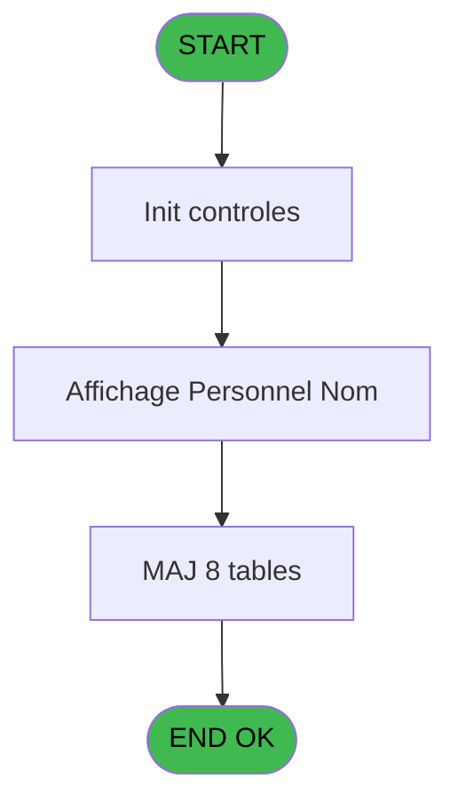
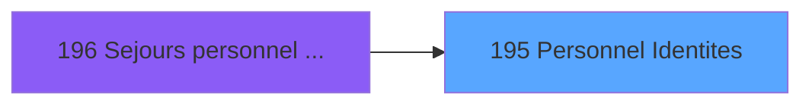
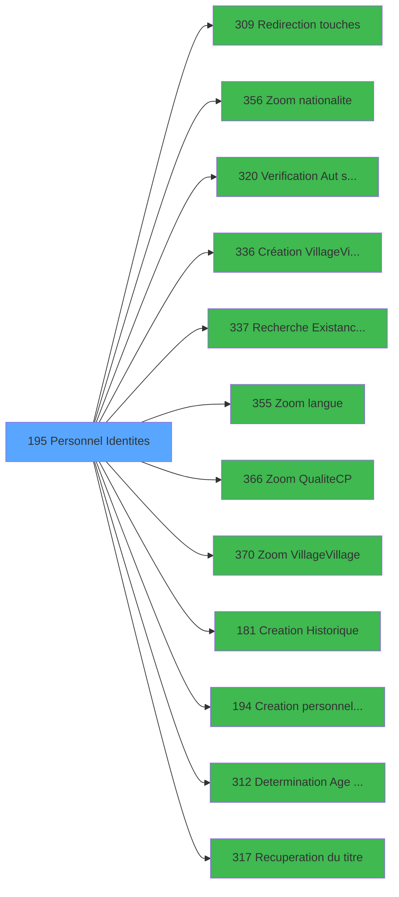

# PBG IDE 195 - Personnel Identites

> **Analyse**: Phases 1-4 2026-02-03 10:07 -> 10:07 (17s) | Assemblage 10:07
> **Pipeline**: V7.2 Enrichi
> **Structure**: 4 onglets (Resume | Ecrans | Donnees | Connexions)

<!-- TAB:Resume -->

## 1. FICHE D'IDENTITE

| Attribut | Valeur |
|----------|--------|
| Projet | PBG |
| IDE Position | 195 |
| Nom Programme | Personnel Identites |
| Fichier source | `Prg_195.xml` |
| Domaine metier | General |
| Taches | 26 (5 ecrans visibles) |
| Tables modifiees | 8 |
| Programmes appeles | 12 |

## 2. DESCRIPTION FONCTIONNELLE

**Personnel Identites** assure la gestion complete de ce processus, accessible depuis [Sejours personnel SubForm (IDE 0)](PBG-IDE-0.md), [Sejours personnel CallTask (IDE 196)](PBG-IDE-196.md).

Le flux de traitement s'organise en **5 blocs fonctionnels** :

- **Creation** (9 taches) : insertion d'enregistrements en base (mouvements, prestations)
- **Traitement** (9 taches) : traitements metier divers
- **Consultation** (5 taches) : ecrans de recherche, selection et consultation
- **Calcul** (2 taches) : calculs de montants, stocks ou compteurs
- **Validation** (1 tache) : controles et verifications de coherence

**Donnees modifiees** : 8 tables en ecriture (gm-recherche_____gmr, gm-complet_______gmc, hebergement______heb, compte_gm________cgm, compteurs________cpt, fichier_validation, fi_complet_______gm_go, Table_1092).

**Logique metier** : 1 regles identifiees couvrant valeurs par defaut.

Detail : phases du traitement

#### Phase 1 : Traitement (9 taches)

- **195** - Personnel Identites
- **195.1** - Determination Age Bebe
- **195.2.2** - Langue ?
- **195.2.4** - Lecture Qualite&Occupation
- **195.2.5** - Determination Fonction **[[ECRAN]](#ecran-t12)**
- **195.2.5.1** - Determination Service
- **195.2.6** - Veuillez patienter... **[[ECRAN]](#ecran-t15)**
- **195.2.9** - Maj base occup
- **195.2.10.1** - (sans nom) **[[ECRAN]](#ecran-t33)**

Delegue a : [Redirection touches (IDE 309)](PBG-IDE-309.md), [Création Village/Village (IDE 336)](PBG-IDE-336.md), [Determination Age Debut Sejour (IDE 312)](PBG-IDE-312.md), [Recuperation du titre (IDE 317)](PBG-IDE-317.md)

#### Phase 2 : Consultation (5 taches)

- **195.2** - Affichage Personnel **[[ECRAN]](#ecran-t4)**
- **195.2.1** - Recherche **[[ECRAN]](#ecran-t5)**
- **195.2.5.2** - Selection Fonction **[[ECRAN]](#ecran-t14)**
- **195.2.6.8** - Creation Recherche
- **195.2.10** - Selection Fonction **[[ECRAN]](#ecran-t32)**

Delegue a : [Zoom nationalite (IDE 356)](PBG-IDE-356.md), [Recherche Existance Groupe A/D (IDE 337)](PBG-IDE-337.md), [Zoom langue (IDE 355)](PBG-IDE-355.md), [Zoom Qualite(C/P) (IDE 366)](PBG-IDE-366.md), [Zoom Village/Village (IDE 370)](PBG-IDE-370.md), [Recuperation du titre (IDE 317)](PBG-IDE-317.md)

#### Phase 3 : Calcul (2 taches)

- **195.2.3** - Attribution Compte
- **195.2.6.7** - Creation Compte

#### Phase 4 : Creation (9 taches)

- **195.2.6.1** - Creation Complet
- **195.2.6.2** - Creation Hebergement
- **195.2.6.3** - Creation Hebergement
- **195.2.6.4** - Creation Hebergement
- **195.2.6.5** - Creation Package Aller
- **195.2.6.6** - Creation Package Retour
- **195.2.6.10** - Creation Complet
- **195.2.7** - Creation personnel
- **195.2.8** - Creation personnel

Delegue a : [Creation Historique (IDE 181)](PBG-IDE-181.md), [  Creation personnel identites (IDE 194)](PBG-IDE-194.md)

#### Phase 5 : Validation (1 tache)

- **195.2.6.9** - Creation Validation

Delegue a : [Verification Aut sans ecran (IDE 320)](PBG-IDE-320.md)

#### Tables impactees

| Table | Operations | Role metier |
|-------|-----------|-------------|
| hebergement______heb | R/**W**/L (8 usages) | Hebergement (chambres) |
| compte_gm________cgm | **W**/L (2 usages) | Comptes GM (generaux) |
| gm-recherche_____gmr | **W** (2 usages) | Index de recherche |
| Table_1092 | **W**/L (2 usages) |  |
| gm-complet_______gmc | **W**/L (2 usages) |  |
| fichier_validation | **W** (1 usages) |  |
| compteurs________cpt | **W** (1 usages) | Comptes GM (generaux) |
| fi_complet_______gm_go | **W** (1 usages) |  |

## 3. BLOCS FONCTIONNELS

### 3.1 Traitement (9 taches)

Traitements internes.

---

#### 195 - Personnel Identites

**Role** : Tache d'orchestration : point d'entree du programme (9 sous-taches). Coordonne l'enchainement des traitements.

8 sous-taches directes

| Tache | Nom | Bloc |
|-------|-----|------|
| [195.1](#t2) | Determination Age Bebe | Traitement |
| [195.2.2](#t8) | Langue ? | Traitement |
| [195.2.4](#t11) | Lecture Qualite&Occupation | Traitement |
| [195.2.5](#t12) | Determination Fonction **[[ECRAN]](#ecran-t12)** | Traitement |
| [195.2.5.1](#t13) | Determination Service | Traitement |
| [195.2.6](#t15) | Veuillez patienter... **[[ECRAN]](#ecran-t15)** | Traitement |
| [195.2.9](#t29) | Maj base occup | Traitement |
| [195.2.10.1](#t33) | (sans nom) **[[ECRAN]](#ecran-t33)** | Traitement |

**Delegue a** : [Redirection touches (IDE 309)](PBG-IDE-309.md), [Création Village/Village (IDE 336)](PBG-IDE-336.md), [  Creation personnel identites (IDE 194)](PBG-IDE-194.md)

---

#### 195.1 - Determination Age Bebe

**Role** : Traitement : Determination Age Bebe.
**Variables liees** : C (W0-Age Bebe)
**Delegue a** : [Redirection touches (IDE 309)](PBG-IDE-309.md), [Création Village/Village (IDE 336)](PBG-IDE-336.md), [Determination Age Debut Sejour (IDE 312)](PBG-IDE-312.md)

---

#### 195.2.2 - Langue ?

**Role** : Traitement : Langue ?.
**Variables liees** : M (W0-Saisie langue ?), U (W1-Select Langue), Y (bouton langue)
**Delegue a** : [Redirection touches (IDE 309)](PBG-IDE-309.md), [Création Village/Village (IDE 336)](PBG-IDE-336.md), [Determination Age Debut Sejour (IDE 312)](PBG-IDE-312.md)

---

#### 195.2.4 - Lecture Qualite&Occupation

**Role** : Traitement : Lecture Qualite&Occupation.
**Delegue a** : [Redirection touches (IDE 309)](PBG-IDE-309.md), [Création Village/Village (IDE 336)](PBG-IDE-336.md), [Determination Age Debut Sejour (IDE 312)](PBG-IDE-312.md)

---

#### 195.2.5 - Determination Fonction [[ECRAN]](#ecran-t12)

**Role** : Traitement : Determination Fonction.
**Ecran** : 108 x 8 DLU (MDI) | [Voir mockup](#ecran-t12)
**Variables liees** : P (W0-Code fonction)
**Delegue a** : [Redirection touches (IDE 309)](PBG-IDE-309.md), [Création Village/Village (IDE 336)](PBG-IDE-336.md), [Determination Age Debut Sejour (IDE 312)](PBG-IDE-312.md)

---

#### 195.2.5.1 - Determination Service

**Role** : Traitement : Determination Service.
**Variables liees** : O (W0-Table service)
**Delegue a** : [Redirection touches (IDE 309)](PBG-IDE-309.md), [Création Village/Village (IDE 336)](PBG-IDE-336.md), [Determination Age Debut Sejour (IDE 312)](PBG-IDE-312.md)

---

#### 195.2.6 - Veuillez patienter... [[ECRAN]](#ecran-t15)

**Role** : Traitement : Veuillez patienter....
**Ecran** : 422 x 56 DLU (MDI) | [Voir mockup](#ecran-t15)
**Delegue a** : [Redirection touches (IDE 309)](PBG-IDE-309.md), [Création Village/Village (IDE 336)](PBG-IDE-336.md), [Determination Age Debut Sejour (IDE 312)](PBG-IDE-312.md)

---

#### 195.2.9 - Maj base occup

**Role** : Traitement : Maj base occup.
**Variables liees** : D (W0-Base Vide), K (W0-code base occup), V (W1-Base occupation)
**Delegue a** : [Redirection touches (IDE 309)](PBG-IDE-309.md), [Création Village/Village (IDE 336)](PBG-IDE-336.md), [Determination Age Debut Sejour (IDE 312)](PBG-IDE-312.md)

---

#### 195.2.10.1 - (sans nom) [[ECRAN]](#ecran-t33)

**Role** : Traitement interne.
**Ecran** : 180 x 120 DLU | [Voir mockup](#ecran-t33)
**Delegue a** : [Redirection touches (IDE 309)](PBG-IDE-309.md), [Création Village/Village (IDE 336)](PBG-IDE-336.md), [Determination Age Debut Sejour (IDE 312)](PBG-IDE-312.md)

### 3.2 Consultation (5 taches)

Ecrans de recherche et consultation.

---

#### 195.2 - Affichage Personnel [[ECRAN]](#ecran-t4)

**Role** : Reinitialisation : Affichage Personnel.
**Ecran** : 1130 x 386 DLU (MDI) | [Voir mockup](#ecran-t4)
**Variables liees** : BC (v Libelle affichage ECI)
**Delegue a** : [Zoom nationalite (IDE 356)](PBG-IDE-356.md), [Recherche Existance Groupe A/D (IDE 337)](PBG-IDE-337.md), [Zoom langue (IDE 355)](PBG-IDE-355.md)

---

#### 195.2.1 - Recherche [[ECRAN]](#ecran-t5)

**Role** : Traitement : Recherche.
**Ecran** : 578 x 101 DLU (MDI) | [Voir mockup](#ecran-t5)
**Variables liees** : BJ (bouton recherche)
**Delegue a** : [Zoom nationalite (IDE 356)](PBG-IDE-356.md), [Recherche Existance Groupe A/D (IDE 337)](PBG-IDE-337.md), [Zoom langue (IDE 355)](PBG-IDE-355.md)

---

#### 195.2.5.2 - Selection Fonction [[ECRAN]](#ecran-t14)

**Role** : Selection par l'operateur : Selection Fonction.
**Ecran** : 390 x 167 DLU (MDI) | [Voir mockup](#ecran-t14)
**Variables liees** : P (W0-Code fonction)
**Delegue a** : [Zoom nationalite (IDE 356)](PBG-IDE-356.md), [Recherche Existance Groupe A/D (IDE 337)](PBG-IDE-337.md), [Zoom langue (IDE 355)](PBG-IDE-355.md)

---

#### 195.2.6.8 - Creation Recherche

**Role** : Creation d'enregistrement : Creation Recherche.
**Variables liees** : H (W0-autorisation creation), BJ (bouton recherche)
**Delegue a** : [Zoom nationalite (IDE 356)](PBG-IDE-356.md), [Recherche Existance Groupe A/D (IDE 337)](PBG-IDE-337.md), [Zoom langue (IDE 355)](PBG-IDE-355.md)

---

#### 195.2.10 - Selection Fonction [[ECRAN]](#ecran-t32)

**Role** : Selection par l'operateur : Selection Fonction.
**Ecran** : 758 x 183 DLU (MDI) | [Voir mockup](#ecran-t32)
**Variables liees** : P (W0-Code fonction)
**Delegue a** : [Zoom nationalite (IDE 356)](PBG-IDE-356.md), [Recherche Existance Groupe A/D (IDE 337)](PBG-IDE-337.md), [Zoom langue (IDE 355)](PBG-IDE-355.md)

### 3.3 Calcul (2 taches)

Calculs metier : montants, stocks, compteurs.

---

#### 195.2.3 - Attribution Compte

**Role** : Traitement : Attribution Compte.
**Variables liees** : G (W0-numero compte memo), Q (W0-Compte)

---

#### 195.2.6.7 - Creation Compte

**Role** : Creation d'enregistrement : Creation Compte.
**Variables liees** : G (W0-numero compte memo), H (W0-autorisation creation), Q (W0-Compte)
**Delegue a** : [Creation Historique (IDE 181)](PBG-IDE-181.md), [  Creation personnel identites (IDE 194)](PBG-IDE-194.md)

### 3.4 Creation (9 taches)

Insertion de nouveaux enregistrements en base.

---

#### 195.2.6.1 - Creation Complet

**Role** : Creation d'enregistrement : Creation Complet.
**Variables liees** : H (W0-autorisation creation)
**Delegue a** : [Creation Historique (IDE 181)](PBG-IDE-181.md), [  Creation personnel identites (IDE 194)](PBG-IDE-194.md)

---

#### 195.2.6.2 - Creation Hebergement

**Role** : Creation d'enregistrement : Creation Hebergement.
**Variables liees** : H (W0-autorisation creation)
**Delegue a** : [Creation Historique (IDE 181)](PBG-IDE-181.md), [  Creation personnel identites (IDE 194)](PBG-IDE-194.md)

---

#### 195.2.6.3 - Creation Hebergement

**Role** : Creation d'enregistrement : Creation Hebergement.
**Variables liees** : H (W0-autorisation creation)
**Delegue a** : [Creation Historique (IDE 181)](PBG-IDE-181.md), [  Creation personnel identites (IDE 194)](PBG-IDE-194.md)

---

#### 195.2.6.4 - Creation Hebergement

**Role** : Creation d'enregistrement : Creation Hebergement.
**Variables liees** : H (W0-autorisation creation)
**Delegue a** : [Creation Historique (IDE 181)](PBG-IDE-181.md), [  Creation personnel identites (IDE 194)](PBG-IDE-194.md)

---

#### 195.2.6.5 - Creation Package Aller

**Role** : Creation d'enregistrement : Creation Package Aller.
**Variables liees** : BD (v.V/V Aller), BM (v.Existe Code VV Aller), BN (v.Code VV Aller), BO (v.Heure VV Aller), H (W0-autorisation creation)
**Delegue a** : [Creation Historique (IDE 181)](PBG-IDE-181.md), [  Creation personnel identites (IDE 194)](PBG-IDE-194.md)

---

#### 195.2.6.6 - Creation Package Retour

**Role** : Creation d'enregistrement : Creation Package Retour.
**Variables liees** : BE (v.V/V Retour), BK (v.Retour Question Bsi), BP (v.Existe Code VV Retour), BQ (v.Code VV Retour), BR (v.Heure VV Retour)
**Delegue a** : [Creation Historique (IDE 181)](PBG-IDE-181.md), [  Creation personnel identites (IDE 194)](PBG-IDE-194.md)

---

#### 195.2.6.10 - Creation Complet

**Role** : Creation d'enregistrement : Creation Complet.
**Variables liees** : H (W0-autorisation creation)
**Delegue a** : [Creation Historique (IDE 181)](PBG-IDE-181.md), [  Creation personnel identites (IDE 194)](PBG-IDE-194.md)

---

#### 195.2.7 - Creation personnel

**Role** : Creation d'enregistrement : Creation personnel.
**Variables liees** : H (W0-autorisation creation)
**Delegue a** : [Creation Historique (IDE 181)](PBG-IDE-181.md), [  Creation personnel identites (IDE 194)](PBG-IDE-194.md)

---

#### 195.2.8 - Creation personnel

**Role** : Creation d'enregistrement : Creation personnel.
**Variables liees** : H (W0-autorisation creation)
**Delegue a** : [Creation Historique (IDE 181)](PBG-IDE-181.md), [  Creation personnel identites (IDE 194)](PBG-IDE-194.md)

### 3.5 Validation (1 tache)

Controles de coherence : 1 tache verifie les donnees et conditions.

---

#### 195.2.6.9 - Creation Validation

**Role** : Verification : Creation Validation.
**Variables liees** : H (W0-autorisation creation)
**Delegue a** : [Verification Aut sans ecran (IDE 320)](PBG-IDE-320.md), [Creation Historique (IDE 181)](PBG-IDE-181.md), [  Creation personnel identites (IDE 194)](PBG-IDE-194.md)

## 5. REGLES METIER

1 regles identifiees:

### Autres (1 regles)

#### [RM-001] Valeur par defaut si Trim (> Mode attaque ecran [A]) est vide

| Element | Detail |
|---------|--------|
| **Condition** | `Trim (> Mode attaque ecran [A])=''` |
| **Si vrai** | 'E'MODE |
| **Si faux** | > Mode attaque ecran [A]) |
| **Variables** | A (> Mode attaque ecran) |
| **Expression source** | Expression 3 : `IF (Trim (> Mode attaque ecran [A])='','E'MODE,> Mode attaqu` |
| **Exemple** | Si Trim (> Mode attaque ecran [A])='' → 'E'MODE. Sinon → > Mode attaque ecran [A]) |

## 6. CONTEXTE

- **Appele par**: [Sejours personnel SubForm (IDE 0)](PBG-IDE-0.md), [Sejours personnel CallTask (IDE 196)](PBG-IDE-196.md)
- **Appelle**: 12 programmes | **Tables**: 17 (W:8 R:4 L:11) | **Taches**: 26 | **Expressions**: 15

<!-- TAB:Ecrans -->

## 8. ECRANS

### 8.1 Forms visibles (5 / 26)

| # | Position | Tache | Nom | Type | Largeur | Hauteur | Bloc |
|---|----------|-------|-----|------|---------|---------|------|
| 1 | 195.2 | 195.2 | Affichage Personnel | MDI | 1130 | 386 | Consultation |
| 2 | 195.2.2 | 195.2.1 | Recherche | MDI | 578 | 101 | Consultation |
| 3 | 195.2.6.2 | 195.2.5.2 | Selection Fonction | MDI | 390 | 167 | Consultation |
| 4 | 195.2.1 | 195.2.10 | Selection Fonction | MDI | 758 | 183 | Consultation |
| 5 | 195.2.1.1 | 195.2.10.1 | (sans nom) | Type0 | 180 | 120 | Traitement |

### 8.2 Mockups Ecrans

---

#### 195.2 - Affichage Personnel
**Tache** : [195.2](#t4) | **Type** : MDI | **Dimensions** : 1130 x 386 DLU
**Bloc** : Consultation | **Titre IDE** : Affichage Personnel

<!-- FORM-DATA:
{
    "width":  1130,
    "vFactor":  8,
    "type":  "MDI",
    "hFactor":  8,
    "controls":  [
                     {
                         "x":  1,
                         "type":  "label",
                         "var":  "",
                         "y":  1,
                         "w":  1126,
                         "fmt":  "",
                         "name":  "",
                         "h":  19,
                         "color":  "1",
                         "text":  "",
                         "parent":  null
                     },
                     {
                         "x":  262,
                         "type":  "label",
                         "var":  "",
                         "y":  5,
                         "w":  120,
                         "fmt":  "",
                         "name":  "",
                         "h":  8,
                         "color":  "",
                         "text":  "GO N° Compte",
                         "parent":  null
                     },
                     {
                         "x":  414,
                         "type":  "label",
                         "var":  "",
                         "y":  24,
                         "w":  698,
                         "fmt":  "",
                         "name":  "",
                         "h":  332,
                         "color":  "",
                         "text":  "",
                         "parent":  null
                     },
                     {
                         "x":  425,
                         "type":  "label",
                         "var":  "",
                         "y":  31,
                         "w":  106,
                         "fmt":  "",
                         "name":  "",
                         "h":  12,
                         "color":  "",
                         "text":  "Titre",
                         "parent":  5
                     },
                     {
                         "x":  12,
                         "type":  "table",
                         "var":  "",
                         "name":  "",
                         "titleH":  14,
                         "color":  "110",
                         "w":  396,
                         "y":  26,
                         "fmt":  "",
                         "parent":  null,
                         "text":  "",
                         "rowH":  14,
                         "h":  330,
                         "cols":  [
                                      {
                                          "title":  "Titre",
                                          "layer":  1,
                                          "w":  48
                                      },
                                      {
                                          "title":  "Nom",
                                          "layer":  2,
                                          "w":  192
                                      },
                                      {
                                          "title":  "Prénom",
                                          "layer":  3,
                                          "w":  122
                                      }
                                  ],
                         "rows":  3
                     },
                     {
                         "x":  425,
                         "type":  "label",
                         "var":  "",
                         "y":  47,
                         "w":  106,
                         "fmt":  "",
                         "name":  "",
                         "h":  12,
                         "color":  "",
                         "text":  "Qualité",
                         "parent":  5
                     },
                     {
                         "x":  425,
                         "type":  "label",
                         "var":  "",
                         "y":  79,
                         "w":  106,
                         "fmt":  "",
                         "name":  "",
                         "h":  12,
                         "color":  "",
                         "text":  "Service",
                         "parent":  5
                     },
                     {
                         "x":  425,
                         "type":  "label",
                         "var":  "",
                         "y":  95,
                         "w":  106,
                         "fmt":  "",
                         "name":  "",
                         "h":  10,
                         "color":  "",
                         "text":  "Fonction",
                         "parent":  5
                     },
                     {
                         "x":  425,
                         "type":  "label",
                         "var":  "",
                         "y":  110,
                         "w":  106,
                         "fmt":  "",
                         "name":  "",
                         "h":  12,
                         "color":  "",
                         "text":  "Contrat",
                         "parent":  5
                     },
                     {
                         "x":  425,
                         "type":  "label",
                         "var":  "",
                         "y":  179,
                         "w":  106,
                         "fmt":  "",
                         "name":  "",
                         "h":  12,
                         "color":  "",
                         "text":  "Arrivée",
                         "parent":  5
                     },
                     {
                         "x":  425,
                         "type":  "label",
                         "var":  "",
                         "y":  195,
                         "w":  106,
                         "fmt":  "",
                         "name":  "",
                         "h":  12,
                         "color":  "",
                         "text":  "Départ",
                         "parent":  5
                     },
                     {
                         "x":  425,
                         "type":  "label",
                         "var":  "",
                         "y":  212,
                         "w":  149,
                         "fmt":  "",
                         "name":  "",
                         "h":  10,
                         "color":  "",
                         "text":  "Date de Naissance",
                         "parent":  5
                     },
                     {
                         "x":  759,
                         "type":  "label",
                         "var":  "",
                         "y":  212,
                         "w":  43,
                         "fmt":  "",
                         "name":  "",
                         "h":  10,
                         "color":  "",
                         "text":  "Age",
                         "parent":  5
                     },
                     {
                         "x":  425,
                         "type":  "label",
                         "var":  "",
                         "y":  227,
                         "w":  106,
                         "fmt":  "",
                         "name":  "",
                         "h":  10,
                         "color":  "",
                         "text":  "Nationalité",
                         "parent":  5
                     },
                     {
                         "x":  425,
                         "type":  "label",
                         "var":  "",
                         "y":  242,
                         "w":  106,
                         "fmt":  "",
                         "name":  "",
                         "h":  12,
                         "color":  "",
                         "text":  "Occupation",
                         "parent":  5
                     },
                     {
                         "x":  425,
                         "type":  "label",
                         "var":  "",
                         "y":  259,
                         "w":  106,
                         "fmt":  "",
                         "name":  "",
                         "h":  10,
                         "color":  "",
                         "text":  "Identité",
                         "parent":  5
                     },
                     {
                         "x":  425,
                         "type":  "label",
                         "var":  "",
                         "y":  275,
                         "w":  106,
                         "fmt":  "",
                         "name":  "",
                         "h":  12,
                         "color":  "",
                         "text":  "Délivré",
                         "parent":  5
                     },
                     {
                         "x":  759,
                         "type":  "label",
                         "var":  "",
                         "y":  275,
                         "w":  45,
                         "fmt":  "",
                         "name":  "",
                         "h":  12,
                         "color":  "",
                         "text":  "Date",
                         "parent":  5
                     },
                     {
                         "x":  432,
                         "type":  "label",
                         "var":  "",
                         "y":  288,
                         "w":  643,
                         "fmt":  "",
                         "name":  "",
                         "h":  49,
                         "color":  "195",
                         "text":  "Adresse",
                         "parent":  5
                     },
                     {
                         "x":  425,
                         "type":  "label",
                         "var":  "",
                         "y":  342,
                         "w":  106,
                         "fmt":  "",
                         "name":  "",
                         "h":  8,
                         "color":  "",
                         "text":  "Langue",
                         "parent":  5
                     },
                     {
                         "x":  2,
                         "type":  "label",
                         "var":  "",
                         "y":  360,
                         "w":  1125,
                         "fmt":  "",
                         "name":  "",
                         "h":  24,
                         "color":  "1",
                         "text":  "",
                         "parent":  null
                     },
                     {
                         "x":  425,
                         "type":  "label",
                         "var":  "",
                         "y":  129,
                         "w":  106,
                         "fmt":  "",
                         "name":  "",
                         "h":  12,
                         "color":  "",
                         "text":  "Cat. d\u0027emploi",
                         "parent":  5
                     },
                     {
                         "x":  425,
                         "type":  "label",
                         "var":  "",
                         "y":  146,
                         "w":  106,
                         "fmt":  "",
                         "name":  "",
                         "h":  12,
                         "color":  "",
                         "text":  "BSI Ok ?",
                         "parent":  5
                     },
                     {
                         "x":  425,
                         "type":  "label",
                         "var":  "",
                         "y":  161,
                         "w":  107,
                         "fmt":  "",
                         "name":  "",
                         "h":  12,
                         "color":  "",
                         "text":  "Lieu de séjour",
                         "parent":  5
                     },
                     {
                         "x":  750,
                         "type":  "label",
                         "var":  "",
                         "y":  179,
                         "w":  85,
                         "fmt":  "",
                         "name":  "",
                         "h":  12,
                         "color":  "",
                         "text":  "Vol aller",
                         "parent":  5
                     },
                     {
                         "x":  747,
                         "type":  "label",
                         "var":  "",
                         "y":  195,
                         "w":  85,
                         "fmt":  "",
                         "name":  "",
                         "h":  12,
                         "color":  "",
                         "text":  "Vol retour",
                         "parent":  5
                     },
                     {
                         "x":  425,
                         "type":  "label",
                         "var":  "",
                         "y":  62,
                         "w":  106,
                         "fmt":  "",
                         "name":  "",
                         "h":  12,
                         "color":  "",
                         "text":  "Matricule WD",
                         "parent":  5
                     },
                     {
                         "x":  69,
                         "type":  "edit",
                         "var":  "",
                         "y":  44,
                         "w":  176,
                         "fmt":  "U15",
                         "name":  "GO Nom",
                         "h":  8,
                         "color":  "6",
                         "text":  "",
                         "parent":  10
                     },
                     {
                         "x":  264,
                         "type":  "edit",
                         "var":  "",
                         "y":  44,
                         "w":  98,
                         "fmt":  "UX9",
                         "name":  "GO Prenom",
                         "h":  8,
                         "color":  "6",
                         "text":  "",
                         "parent":  10
                     },
                     {
                         "x":  538,
                         "type":  "combobox",
                         "var":  "",
                         "y":  30,
                         "w":  182,
                         "fmt":  "",
                         "name":  "W1-Select titre",
                         "h":  12,
                         "color":  "110",
                         "text":  "1,2",
                         "parent":  5
                     },
                     {
                         "x":  538,
                         "type":  "edit",
                         "var":  "",
                         "y":  46,
                         "w":  423,
                         "fmt":  "15",
                         "name":  "W1-Select qualite",
                         "h":  12,
                         "color":  "110",
                         "text":  "",
                         "parent":  5
                     },
                     {
                         "x":  965,
                         "type":  "button",
                         "var":  "",
                         "y":  47,
                         "w":  28,
                         "fmt":  "...",
                         "name":  "v. bouton qualite",
                         "h":  10,
                         "color":  "",
                         "text":  "",
                         "parent":  5
                     },
                     {
                         "x":  538,
                         "type":  "edit",
                         "var":  "",
                         "y":  61,
                         "w":  423,
                         "fmt":  "",
                         "name":  "go_matricule_wd",
                         "h":  12,
                         "color":  "110",
                         "text":  "",
                         "parent":  5
                     },
                     {
                         "x":  538,
                         "type":  "combobox",
                         "var":  "",
                         "y":  77,
                         "w":  423,
                         "fmt":  "",
                         "name":  "go_code_service",
                         "h":  12,
                         "color":  "110",
                         "text":  "",
                         "parent":  5
                     },
                     {
                         "x":  538,
                         "type":  "edit",
                         "var":  "",
                         "y":  78,
                         "w":  423,
                         "fmt":  "",
                         "name":  "go_fonction",
                         "h":  12,
                         "color":  "110",
                         "text":  "",
                         "parent":  5
                     },
                     {
                         "x":  965,
                         "type":  "button",
                         "var":  "",
                         "y":  95,
                         "w":  28,
                         "fmt":  "...",
                         "name":  "v.bouton fonction",
                         "h":  10,
                         "color":  "",
                         "text":  "",
                         "parent":  5
                     },
                     {
                         "x":  538,
                         "type":  "combobox",
                         "var":  "",
                         "y":  110,
                         "w":  423,
                         "fmt":  "",
                         "name":  "W1-Select Contrat",
                         "h":  12,
                         "color":  "110",
                         "text":  "1,2",
                         "parent":  5
                     },
                     {
                         "x":  538,
                         "type":  "combobox",
                         "var":  "",
                         "y":  129,
                         "w":  423,
                         "fmt":  "",
                         "name":  "Go_cat_emploi",
                         "h":  12,
                         "color":  "110",
                         "text":  "1,2,3",
                         "parent":  5
                     },
                     {
                         "x":  538,
                         "type":  "checkbox",
                         "var":  "",
                         "y":  146,
                         "w":  37,
                         "fmt":  "",
                         "name":  "go_bsi_ok",
                         "h":  12,
                         "color":  "",
                         "text":  "",
                         "parent":  5
                     },
                     {
                         "x":  538,
                         "type":  "combobox",
                         "var":  "",
                         "y":  160,
                         "w":  423,
                         "fmt":  "",
                         "name":  "W1-Combo Lieu Sejour",
                         "h":  12,
                         "color":  "110",
                         "text":  "1,2",
                         "parent":  5
                     },
                     {
                         "x":  538,
                         "type":  "edit",
                         "var":  "",
                         "y":  179,
                         "w":  166,
                         "fmt":  "DD/MM/YYYYZ",
                         "name":  "GO Date Debut",
                         "h":  12,
                         "color":  "110",
                         "text":  "",
                         "parent":  5
                     },
                     {
                         "x":  709,
                         "type":  "button",
                         "var":  "",
                         "y":  181,
                         "w":  28,
                         "fmt":  "...",
                         "name":  "bouton date debut",
                         "h":  10,
                         "color":  "",
                         "text":  "",
                         "parent":  5
                     },
                     {
                         "x":  832,
                         "type":  "edit",
                         "var":  "",
                         "y":  179,
                         "w":  74,
                         "fmt":  "",
                         "name":  "heb_nom_logement",
                         "h":  12,
                         "color":  "6",
                         "text":  "",
                         "parent":  5
                     },
                     {
                         "x":  912,
                         "type":  "edit",
                         "var":  "",
                         "y":  179,
                         "w":  34,
                         "fmt":  "",
                         "name":  "heb_heure_debut",
                         "h":  12,
                         "color":  "6",
                         "text":  "",
                         "parent":  5
                     },
                     {
                         "x":  956,
                         "type":  "button",
                         "var":  "",
                         "y":  180,
                         "w":  28,
                         "fmt":  "...",
                         "name":  "v.V/V Aller",
                         "h":  10,
                         "color":  "",
                         "text":  "",
                         "parent":  5
                     },
                     {
                         "x":  538,
                         "type":  "edit",
                         "var":  "",
                         "y":  195,
                         "w":  166,
                         "fmt":  "DD/MM/YYYYZ",
                         "name":  "GO Date Fin",
                         "h":  12,
                         "color":  "110",
                         "text":  "",
                         "parent":  5
                     },
                     {
                         "x":  709,
                         "type":  "button",
                         "var":  "",
                         "y":  197,
                         "w":  28,
                         "fmt":  "...",
                         "name":  "bouton date fin",
                         "h":  10,
                         "color":  "",
                         "text":  "",
                         "parent":  5
                     },
                     {
                         "x":  832,
                         "type":  "edit",
                         "var":  "",
                         "y":  195,
                         "w":  74,
                         "fmt":  "",
                         "name":  "heb_nom_logement_0001",
                         "h":  12,
                         "color":  "6",
                         "text":  "",
                         "parent":  5
                     },
                     {
                         "x":  912,
                         "type":  "edit",
                         "var":  "",
                         "y":  195,
                         "w":  34,
                         "fmt":  "",
                         "name":  "heb_heure_debut_0001",
                         "h":  12,
                         "color":  "6",
                         "text":  "",
                         "parent":  5
                     },
                     {
                         "x":  956,
                         "type":  "button",
                         "var":  "",
                         "y":  196,
                         "w":  28,
                         "fmt":  "...",
                         "name":  "v.V/V Retour",
                         "h":  10,
                         "color":  "",
                         "text":  "",
                         "parent":  5
                     },
                     {
                         "x":  578,
                         "type":  "edit",
                         "var":  "",
                         "y":  211,
                         "w":  126,
                         "fmt":  "DD/MM/YYYYT",
                         "name":  "GO Date Naissance",
                         "h":  12,
                         "color":  "110",
                         "text":  "",
                         "parent":  5
                     },
                     {
                         "x":  538,
                         "type":  "edit",
                         "var":  "",
                         "y":  227,
                         "w":  37,
                         "fmt":  "",
                         "name":  "GO Nationalite",
                         "h":  10,
                         "color":  "110",
                         "text":  "",
                         "parent":  5
                     },
                     {
                         "x":  585,
                         "type":  "button",
                         "var":  "",
                         "y":  227,
                         "w":  28,
                         "fmt":  "...",
                         "name":  "bouton nationalite",
                         "h":  10,
                         "color":  "",
                         "text":  "",
                         "parent":  5
                     },
                     {
                         "x":  587,
                         "type":  "combobox",
                         "var":  "",
                         "y":  242,
                         "w":  110,
                         "fmt":  "",
                         "name":  "W1-Base occupation",
                         "h":  12,
                         "color":  "110",
                         "text":  "1,2",
                         "parent":  5
                     },
                     {
                         "x":  538,
                         "type":  "edit",
                         "var":  "",
                         "y":  259,
                         "w":  216,
                         "fmt":  "U18",
                         "name":  "GMC N° Pièce",
                         "h":  12,
                         "color":  "110",
                         "text":  "",
                         "parent":  5
                     },
                     {
                         "x":  538,
                         "type":  "edit",
                         "var":  "",
                         "y":  275,
                         "w":  216,
                         "fmt":  "U18",
                         "name":  "GMC Ville Delivrance",
                         "h":  12,
                         "color":  "110",
                         "text":  "",
                         "parent":  5
                     },
                     {
                         "x":  832,
                         "type":  "edit",
                         "var":  "",
                         "y":  275,
                         "w":  126,
                         "fmt":  "DD/MM/YYYYT",
                         "name":  "GMC Date Delivrance",
                         "h":  12,
                         "color":  "110",
                         "text":  "",
                         "parent":  5
                     },
                     {
                         "x":  965,
                         "type":  "button",
                         "var":  "",
                         "y":  276,
                         "w":  26,
                         "fmt":  "...",
                         "name":  "bouton date delivrance",
                         "h":  10,
                         "color":  "",
                         "text":  "",
                         "parent":  5
                     },
                     {
                         "x":  538,
                         "type":  "edit",
                         "var":  "",
                         "y":  298,
                         "w":  126,
                         "fmt":  "",
                         "name":  "GMC N° dans la rue",
                         "h":  10,
                         "color":  "110",
                         "text":  "",
                         "parent":  45
                     },
                     {
                         "x":  667,
                         "type":  "edit",
                         "var":  "",
                         "y":  298,
                         "w":  358,
                         "fmt":  "",
                         "name":  "GMC Nom de la rue",
                         "h":  10,
                         "color":  "110",
                         "text":  "",
                         "parent":  45
                     },
                     {
                         "x":  538,
                         "type":  "edit",
                         "var":  "",
                         "y":  310,
                         "w":  486,
                         "fmt":  "",
                         "name":  "GMC Commune",
                         "h":  10,
                         "color":  "110",
                         "text":  "",
                         "parent":  45
                     },
                     {
                         "x":  538,
                         "type":  "edit",
                         "var":  "",
                         "y":  322,
                         "w":  126,
                         "fmt":  "",
                         "name":  "GMC Code Postal",
                         "h":  10,
                         "color":  "110",
                         "text":  "",
                         "parent":  45
                     },
                     {
                         "x":  667,
                         "type":  "edit",
                         "var":  "",
                         "y":  322,
                         "w":  358,
                         "fmt":  "",
                         "name":  "GMC Ville",
                         "h":  10,
                         "color":  "110",
                         "text":  "",
                         "parent":  45
                     },
                     {
                         "x":  528,
                         "type":  "edit",
                         "var":  "",
                         "y":  342,
                         "w":  37,
                         "fmt":  "",
                         "name":  "GMR Langue Parlee",
                         "h":  10,
                         "color":  "110",
                         "text":  "",
                         "parent":  5
                     },
                     {
                         "x":  571,
                         "type":  "button",
                         "var":  "",
                         "y":  342,
                         "w":  28,
                         "fmt":  "...",
                         "name":  "bouton langue",
                         "h":  10,
                         "color":  "",
                         "text":  "",
                         "parent":  5
                     },
                     {
                         "x":  615,
                         "type":  "edit",
                         "var":  "",
                         "y":  342,
                         "w":  232,
                         "fmt":  "",
                         "name":  "",
                         "h":  10,
                         "color":  "7",
                         "text":  "",
                         "parent":  5
                     },
                     {
                         "x":  832,
                         "type":  "edit",
                         "var":  "",
                         "y":  212,
                         "w":  30,
                         "fmt":  "",
                         "name":  "",
                         "h":  10,
                         "color":  "",
                         "text":  "",
                         "parent":  5
                     },
                     {
                         "x":  629,
                         "type":  "edit",
                         "var":  "",
                         "y":  227,
                         "w":  320,
                         "fmt":  "U20",
                         "name":  "",
                         "h":  10,
                         "color":  "7",
                         "text":  "",
                         "parent":  5
                     },
                     {
                         "x":  957,
                         "type":  "button",
                         "var":  "",
                         "y":  363,
                         "w":  154,
                         "fmt":  "\u0026Recherche",
                         "name":  "bouton recherche",
                         "h":  18,
                         "color":  "",
                         "text":  "",
                         "parent":  54
                     },
                     {
                         "x":  11,
                         "type":  "edit",
                         "var":  "",
                         "y":  6,
                         "w":  478,
                         "fmt":  "30",
                         "name":  "",
                         "h":  8,
                         "color":  "",
                         "text":  "",
                         "parent":  null
                     },
                     {
                         "x":  841,
                         "type":  "edit",
                         "var":  "",
                         "y":  6,
                         "w":  275,
                         "fmt":  "WWW DD MMM YYYYT",
                         "name":  "",
                         "h":  8,
                         "color":  "",
                         "text":  "",
                         "parent":  null
                     },
                     {
                         "x":  724,
                         "type":  "edit",
                         "var":  "",
                         "y":  31,
                         "w":  53,
                         "fmt":  "UX3",
                         "name":  "",
                         "h":  12,
                         "color":  "7",
                         "text":  "",
                         "parent":  5
                     },
                     {
                         "x":  22,
                         "type":  "edit",
                         "var":  "",
                         "y":  44,
                         "w":  30,
                         "fmt":  "UX",
                         "name":  "",
                         "h":  7,
                         "color":  "6",
                         "text":  "",
                         "parent":  10
                     },
                     {
                         "x":  538,
                         "type":  "edit",
                         "var":  "",
                         "y":  242,
                         "w":  19,
                         "fmt":  "1",
                         "name":  "",
                         "h":  12,
                         "color":  "7",
                         "text":  "",
                         "parent":  5
                     },
                     {
                         "x":  11,
                         "type":  "button",
                         "var":  "",
                         "y":  363,
                         "w":  154,
                         "fmt":  "\u0026Ok",
                         "name":  "",
                         "h":  18,
                         "color":  "",
                         "text":  "",
                         "parent":  54
                     },
                     {
                         "x":  187,
                         "type":  "button",
                         "var":  "",
                         "y":  363,
                         "w":  154,
                         "fmt":  "A\u0026bandonner",
                         "name":  "",
                         "h":  18,
                         "color":  "",
                         "text":  "",
                         "parent":  54
                     },
                     {
                         "x":  340,
                         "type":  "button",
                         "var":  "",
                         "y":  363,
                         "w":  154,
                         "fmt":  "\u0026Annuler",
                         "name":  "",
                         "h":  18,
                         "color":  "",
                         "text":  "",
                         "parent":  54
                     },
                     {
                         "x":  494,
                         "type":  "button",
                         "var":  "",
                         "y":  363,
                         "w":  154,
                         "fmt":  "\u0026Creation",
                         "name":  "",
                         "h":  18,
                         "color":  "",
                         "text":  "",
                         "parent":  54
                     },
                     {
                         "x":  648,
                         "type":  "button",
                         "var":  "",
                         "y":  363,
                         "w":  154,
                         "fmt":  "\u0026Modification",
                         "name":  "",
                         "h":  18,
                         "color":  "",
                         "text":  "",
                         "parent":  54
                     },
                     {
                         "x":  802,
                         "type":  "button",
                         "var":  "",
                         "y":  363,
                         "w":  154,
                         "fmt":  "\u0026Visualisation",
                         "name":  "",
                         "h":  18,
                         "color":  "",
                         "text":  "",
                         "parent":  54
                     },
                     {
                         "x":  786,
                         "type":  "edit",
                         "var":  "",
                         "y":  31,
                         "w":  77,
                         "fmt":  "6",
                         "name":  "",
                         "h":  12,
                         "color":  "204",
                         "text":  "",
                         "parent":  5
                     },
                     {
                         "x":  1072,
                         "type":  "button",
                         "var":  "",
                         "y":  87,
                         "w":  28,
                         "fmt":  "...",
                         "name":  "v. bouton fx",
                         "h":  10,
                         "color":  "",
                         "text":  "",
                         "parent":  5
                     },
                     {
                         "x":  538,
                         "type":  "edit",
                         "var":  "",
                         "y":  77,
                         "w":  519,
                         "fmt":  "100",
                         "name":  "",
                         "h":  12,
                         "color":  "110",
                         "text":  "",
                         "parent":  5
                     },
                     {
                         "x":  538,
                         "type":  "edit",
                         "var":  "",
                         "y":  94,
                         "w":  521,
                         "fmt":  "100",
                         "name":  "",
                         "h":  12,
                         "color":  "110",
                         "text":  "",
                         "parent":  5
                     }
                 ],
    "taskId":  "195.2",
    "height":  386
}
-->

<strong>Champs : 40 champs</strong>

| Pos (x,y) | Nom | Variable | Type |
|-----------|-----|----------|------|
| 69,44 | GO Nom | - | edit |
| 264,44 | GO Prenom | - | edit |
| 538,30 | W1-Select titre | - | combobox |
| 538,46 | W1-Select qualite | - | edit |
| 538,61 | go_matricule_wd | - | edit |
| 538,77 | go_code_service | - | combobox |
| 538,78 | go_fonction | - | edit |
| 538,110 | W1-Select Contrat | - | combobox |
| 538,129 | Go_cat_emploi | - | combobox |
| 538,146 | go_bsi_ok | - | checkbox |
| 538,160 | W1-Combo Lieu Sejour | - | combobox |
| 538,179 | GO Date Debut | - | edit |
| 832,179 | heb_nom_logement | - | edit |
| 912,179 | heb_heure_debut | - | edit |
| 538,195 | GO Date Fin | - | edit |
| 832,195 | heb_nom_logement_0001 | - | edit |
| 912,195 | heb_heure_debut_0001 | - | edit |
| 578,211 | GO Date Naissance | - | edit |
| 538,227 | GO Nationalite | - | edit |
| 587,242 | W1-Base occupation | - | combobox |
| 538,259 | GMC N° Pièce | - | edit |
| 538,275 | GMC Ville Delivrance | - | edit |
| 832,275 | GMC Date Delivrance | - | edit |
| 538,298 | GMC N° dans la rue | - | edit |
| 667,298 | GMC Nom de la rue | - | edit |
| 538,310 | GMC Commune | - | edit |
| 538,322 | GMC Code Postal | - | edit |
| 667,322 | GMC Ville | - | edit |
| 528,342 | GMR Langue Parlee | - | edit |
| 615,342 | (sans nom) | - | edit |
| 832,212 | (sans nom) | - | edit |
| 629,227 | U20 | - | edit |
| 11,6 | 30 | - | edit |
| 841,6 | WWW DD MMM YYYYT | - | edit |
| 724,31 | UX3 | - | edit |
| 22,44 | UX | - | edit |
| 538,242 | 1 | - | edit |
| 786,31 | 6 | - | edit |
| 538,77 | 100 | - | edit |
| 538,94 | 100 | - | edit |

<strong>Boutons : 17 boutons</strong>

| Bouton | Pos (x,y) | Action |
|--------|-----------|--------|
| ... | 965,47 | Bouton fonctionnel |
| ... | 965,95 | Bouton fonctionnel |
| ... | 709,181 | Bouton fonctionnel |
| ... | 956,180 | Bouton fonctionnel |
| ... | 709,197 | Bouton fonctionnel |
| ... | 956,196 | Bouton fonctionnel |
| ... | 585,227 | Bouton fonctionnel |
| ... | 965,276 | Bouton fonctionnel |
| ... | 571,342 | Bouton fonctionnel |
| Recherche | 957,363 | Appel [Recherche Existance Groupe A/D (IDE 337)](PBG-IDE-337.md) |
| Ok | 11,363 | Valide la saisie et enregistre |
| Abandonner | 187,363 | Annule et retour au menu |
| Annuler | 340,363 | Annule et retour au menu |
| Creation | 494,363 | Appel [Creation Historique (IDE 181)](PBG-IDE-181.md) |
| Modification | 648,363 | Modifie l'element |
| Visualisation | 802,363 | Bouton fonctionnel |
| ... | 1072,87 | Bouton fonctionnel |

---

#### 195.2.2 - Recherche
**Tache** : [195.2.1](#t5) | **Type** : MDI | **Dimensions** : 578 x 101 DLU
**Bloc** : Consultation | **Titre IDE** : Recherche

<!-- FORM-DATA:
{
    "width":  578,
    "vFactor":  8,
    "type":  "MDI",
    "hFactor":  8,
    "controls":  [
                     {
                         "x":  193,
                         "type":  "label",
                         "var":  "",
                         "y":  11,
                         "w":  375,
                         "fmt":  "",
                         "name":  "",
                         "h":  49,
                         "color":  "",
                         "text":  "",
                         "parent":  null
                     },
                     {
                         "x":  219,
                         "type":  "label",
                         "var":  "",
                         "y":  25,
                         "w":  208,
                         "fmt":  "",
                         "name":  "",
                         "h":  8,
                         "color":  "",
                         "text":  "Entrez les premières lettres",
                         "parent":  2
                     },
                     {
                         "x":  1,
                         "type":  "label",
                         "var":  "",
                         "y":  75,
                         "w":  574,
                         "fmt":  "",
                         "name":  "",
                         "h":  24,
                         "color":  "",
                         "text":  "",
                         "parent":  null
                     },
                     {
                         "x":  304,
                         "type":  "edit",
                         "var":  "",
                         "y":  35,
                         "w":  238,
                         "fmt":  "U20",
                         "name":  "",
                         "h":  10,
                         "color":  "110",
                         "text":  "",
                         "parent":  2
                     },
                     {
                         "x":  8,
                         "type":  "button",
                         "var":  "",
                         "y":  78,
                         "w":  154,
                         "fmt":  "\u0026Ok",
                         "name":  "",
                         "h":  18,
                         "color":  "",
                         "text":  "",
                         "parent":  5
                     },
                     {
                         "x":  411,
                         "type":  "button",
                         "var":  "",
                         "y":  79,
                         "w":  154,
                         "fmt":  "\u0026Abandon",
                         "name":  "",
                         "h":  18,
                         "color":  "",
                         "text":  "",
                         "parent":  5
                     },
                     {
                         "x":  29,
                         "type":  "image",
                         "var":  "",
                         "y":  1,
                         "w":  151,
                         "fmt":  "",
                         "name":  "",
                         "h":  67,
                         "color":  "",
                         "text":  "",
                         "parent":  null
                     }
                 ],
    "taskId":  "195.2.2",
    "height":  101
}
-->

<strong>Champs : 1 champs</strong>

| Pos (x,y) | Nom | Variable | Type |
|-----------|-----|----------|------|
| 304,35 | U20 | - | edit |

<strong>Boutons : 2 boutons</strong>

| Bouton | Pos (x,y) | Action |
|--------|-----------|--------|
| Ok | 8,78 | Valide la saisie et enregistre |
| Abandon | 411,79 | Annule et retour au menu |

---

#### 195.2.6.2 - Selection Fonction
**Tache** : [195.2.5.2](#t14) | **Type** : MDI | **Dimensions** : 390 x 167 DLU
**Bloc** : Consultation | **Titre IDE** : Selection Fonction

<!-- FORM-DATA:
{
    "width":  390,
    "vFactor":  8,
    "type":  "MDI",
    "hFactor":  8,
    "controls":  [
                     {
                         "x":  32,
                         "type":  "table",
                         "var":  "",
                         "name":  "",
                         "titleH":  12,
                         "color":  "196",
                         "w":  338,
                         "y":  5,
                         "fmt":  "",
                         "parent":  null,
                         "text":  "",
                         "rowH":  12,
                         "h":  106,
                         "cols":  [
                                      {
                                          "title":  "Fonction",
                                          "layer":  1,
                                          "w":  301
                                      }
                                  ],
                         "rows":  1
                     },
                     {
                         "x":  2,
                         "type":  "label",
                         "var":  "",
                         "y":  140,
                         "w":  385,
                         "fmt":  "",
                         "name":  "",
                         "h":  24,
                         "color":  "",
                         "text":  "",
                         "parent":  null
                     },
                     {
                         "x":  38,
                         "type":  "edit",
                         "var":  "",
                         "y":  20,
                         "w":  288,
                         "fmt":  "U25",
                         "name":  "",
                         "h":  8,
                         "color":  "196",
                         "text":  "",
                         "parent":  1
                     },
                     {
                         "x":  29,
                         "type":  "button",
                         "var":  "",
                         "y":  143,
                         "w":  154,
                         "fmt":  "\u0026Sélectionner",
                         "name":  "",
                         "h":  18,
                         "color":  "",
                         "text":  "",
                         "parent":  null
                     },
                     {
                         "x":  209,
                         "type":  "button",
                         "var":  "",
                         "y":  143,
                         "w":  154,
                         "fmt":  "\u0026Quitter",
                         "name":  "",
                         "h":  18,
                         "color":  "",
                         "text":  "",
                         "parent":  null
                     },
                     {
                         "x":  167,
                         "type":  "image",
                         "var":  "",
                         "y":  116,
                         "w":  58,
                         "fmt":  "",
                         "name":  "",
                         "h":  18,
                         "color":  "",
                         "text":  "",
                         "parent":  null
                     }
                 ],
    "taskId":  "195.2.6.2",
    "height":  167
}
-->

<strong>Champs : 1 champs</strong>

| Pos (x,y) | Nom | Variable | Type |
|-----------|-----|----------|------|
| 38,20 | U25 | - | edit |

<strong>Boutons : 2 boutons</strong>

| Bouton | Pos (x,y) | Action |
|--------|-----------|--------|
| Sélectionner | 29,143 | Bouton fonctionnel |
| Quitter | 209,143 | Quitte le programme |

---

#### 195.2.1 - Selection Fonction
**Tache** : [195.2.10](#t32) | **Type** : MDI | **Dimensions** : 758 x 183 DLU
**Bloc** : Consultation | **Titre IDE** : Selection Fonction

<!-- FORM-DATA:
{
    "width":  758,
    "vFactor":  8,
    "type":  "MDI",
    "hFactor":  8,
    "controls":  [
                     {
                         "x":  16,
                         "type":  "table",
                         "var":  "",
                         "name":  "",
                         "titleH":  12,
                         "color":  "196",
                         "w":  360,
                         "y":  5,
                         "fmt":  "",
                         "parent":  null,
                         "text":  "",
                         "rowH":  12,
                         "h":  112,
                         "cols":  [
                                      {
                                          "title":  "Service",
                                          "layer":  1,
                                          "w":  324
                                      }
                                  ],
                         "rows":  1
                     },
                     {
                         "x":  2,
                         "type":  "label",
                         "var":  "",
                         "y":  158,
                         "w":  753,
                         "fmt":  "",
                         "name":  "",
                         "h":  24,
                         "color":  "",
                         "text":  "",
                         "parent":  null
                     },
                     {
                         "x":  22,
                         "type":  "edit",
                         "var":  "",
                         "y":  20,
                         "w":  288,
                         "fmt":  "100",
                         "name":  "v. goj_job_family",
                         "h":  8,
                         "color":  "196",
                         "text":  "",
                         "parent":  1
                     },
                     {
                         "x":  14,
                         "type":  "button",
                         "var":  "",
                         "y":  161,
                         "w":  154,
                         "fmt":  "\u0026Sélectionner",
                         "name":  "",
                         "h":  18,
                         "color":  "",
                         "text":  "",
                         "parent":  null
                     },
                     {
                         "x":  591,
                         "type":  "button",
                         "var":  "",
                         "y":  161,
                         "w":  154,
                         "fmt":  "\u0026Quitter",
                         "name":  "",
                         "h":  18,
                         "color":  "",
                         "text":  "",
                         "parent":  null
                     },
                     {
                         "x":  350,
                         "type":  "image",
                         "var":  "",
                         "y":  131,
                         "w":  58,
                         "fmt":  "",
                         "name":  "",
                         "h":  18,
                         "color":  "",
                         "text":  "",
                         "parent":  null
                     },
                     {
                         "x":  384,
                         "type":  "subform",
                         "var":  "",
                         "y":  5,
                         "w":  360,
                         "fmt":  "",
                         "name":  "st1",
                         "h":  120,
                         "color":  "",
                         "text":  "",
                         "parent":  null
                     }
                 ],
    "taskId":  "195.2.1",
    "height":  183
}
-->

<strong>Champs : 1 champs</strong>

| Pos (x,y) | Nom | Variable | Type |
|-----------|-----|----------|------|
| 22,20 | v. goj_job_family | - | edit |

<strong>Boutons : 2 boutons</strong>

| Bouton | Pos (x,y) | Action |
|--------|-----------|--------|
| Sélectionner | 14,161 | Bouton fonctionnel |
| Quitter | 591,161 | Quitte le programme |

---

#### 195.2.1.1 - (sans nom)
**Tache** : [195.2.10.1](#t33) | **Type** : Type0 | **Dimensions** : 180 x 120 DLU
**Bloc** : Traitement | **Titre IDE** : (sans nom)

<!-- FORM-DATA:
{
    "width":  180,
    "vFactor":  8,
    "type":  "Type0",
    "hFactor":  4,
    "controls":  [
                     {
                         "x":  0,
                         "type":  "table",
                         "var":  "",
                         "name":  "",
                         "titleH":  12,
                         "color":  "196",
                         "w":  180,
                         "y":  0,
                         "fmt":  "",
                         "parent":  null,
                         "text":  "",
                         "rowH":  13,
                         "h":  112,
                         "cols":  [
                                      {
                                          "title":  "Fonction",
                                          "layer":  1,
                                          "w":  162
                                      }
                                  ],
                         "rows":  1
                     },
                     {
                         "x":  4,
                         "type":  "edit",
                         "var":  "",
                         "y":  15,
                         "w":  160,
                         "fmt":  "",
                         "name":  "goj_job_title",
                         "h":  10,
                         "color":  "196",
                         "text":  "",
                         "parent":  2
                     }
                 ],
    "taskId":  "195.2.1.1",
    "height":  120
}
-->

<strong>Champs : 1 champs</strong>

| Pos (x,y) | Nom | Variable | Type |
|-----------|-----|----------|------|
| 4,15 | goj_job_title | - | edit |

## 9. NAVIGATION

### 9.1 Enchainement des ecrans

```mermaid
flowchart TD
    START([Entree])
    style START fill:#3fb950
    VF4[195.2 Affichage Personnel]
    style VF4 fill:#58a6ff
    VF5[195.2.1 Recherche]
    style VF5 fill:#58a6ff
    VF14[195.2.5.2 Selection Fonction]
    style VF14 fill:#58a6ff
    VF32[195.2.10 Selection Fonction]
    style VF32 fill:#58a6ff
    VF33[195.2.10.1 sans nom]
    style VF33 fill:#58a6ff
    EXT309[IDE 309 Redirection to...]
    style EXT309 fill:#3fb950
    EXT356[IDE 356 Zoom nationalite]
    style EXT356 fill:#3fb950
    EXT320[IDE 320 Verification A...]
    style EXT320 fill:#3fb950
    EXT336[IDE 336 Création Villa...]
    style EXT336 fill:#3fb950
    EXT337[IDE 337 Recherche Exis...]
    style EXT337 fill:#3fb950
    EXT355[IDE 355 Zoom langue]
    style EXT355 fill:#3fb950
    EXT366[IDE 366 Zoom QualiteCP]
    style EXT366 fill:#3fb950
    EXT370[IDE 370 Zoom VillageVi...]
    style EXT370 fill:#3fb950
    EXT181[IDE 181 Creation Histo...]
    style EXT181 fill:#3fb950
    EXT194[IDE 194 Creation perso...]
    style EXT194 fill:#3fb950
    EXT312[IDE 312 Determination ...]
    style EXT312 fill:#3fb950
    EXT317[IDE 317 Recuperation d...]
    style EXT317 fill:#3fb950
    FIN([Sortie])
    style FIN fill:#f85149
    START --> VF4
    VF4 -->|Sous-programme| EXT309
    VF4 -->|Selection/consultation| EXT356
    VF4 -->|Controle/validation| EXT320
    VF4 -->|Sous-programme| EXT336
    VF4 -->|Sous-programme| EXT337
    VF4 -->|Selection/consultation| EXT355
    VF4 -->|Selection/consultation| EXT366
    VF4 -->|Selection/consultation| EXT370
    EXT317 --> FIN
```

**Detail par enchainement :**

| Depuis | Action | Vers | Retour |
|--------|--------|------|--------|
| Affichage Personnel | Sous-programme | [Redirection touches (IDE 309)](PBG-IDE-309.md) | Retour ecran |
| Affichage Personnel | Selection/consultation | [Zoom nationalite (IDE 356)](PBG-IDE-356.md) | Retour ecran |
| Affichage Personnel | Controle/validation | [Verification Aut sans ecran (IDE 320)](PBG-IDE-320.md) | Retour ecran |
| Affichage Personnel | Sous-programme | [Création Village/Village (IDE 336)](PBG-IDE-336.md) | Retour ecran |
| Affichage Personnel | Sous-programme | [Recherche Existance Groupe A/D (IDE 337)](PBG-IDE-337.md) | Retour ecran |
| Affichage Personnel | Selection/consultation | [Zoom langue (IDE 355)](PBG-IDE-355.md) | Retour ecran |
| Affichage Personnel | Selection/consultation | [Zoom Qualite(C/P) (IDE 366)](PBG-IDE-366.md) | Retour ecran |
| Affichage Personnel | Selection/consultation | [Zoom Village/Village (IDE 370)](PBG-IDE-370.md) | Retour ecran |
| Affichage Personnel | Historique/consultation | [Creation Historique (IDE 181)](PBG-IDE-181.md) | Retour ecran |
| Affichage Personnel | Sous-programme | [  Creation personnel identites (IDE 194)](PBG-IDE-194.md) | Retour ecran |
| Affichage Personnel | Sous-programme | [Determination Age Debut Sejour (IDE 312)](PBG-IDE-312.md) | Retour ecran |
| Affichage Personnel | Recuperation donnees | [Recuperation du titre (IDE 317)](PBG-IDE-317.md) | Retour ecran |

### 9.3 Structure hierarchique (26 taches)

| Position | Tache | Type | Dimensions | Bloc |
|----------|-------|------|------------|------|
| **195.1** | [**Personnel Identites** (195)](#t1) | MDI | - | Traitement |
| 195.1.1 | [Determination Age Bebe (195.1)](#t2) | MDI | - | |
| 195.1.2 | [Langue ? (195.2.2)](#t8) | MDI | - | |
| 195.1.3 | [Lecture Qualite&Occupation (195.2.4)](#t11) | MDI | - | |
| 195.1.4 | [Determination Fonction (195.2.5)](#t12) [mockup](#ecran-t12) | MDI | 108x8 | |
| 195.1.5 | [Determination Service (195.2.5.1)](#t13) | MDI | - | |
| 195.1.6 | [Veuillez patienter... (195.2.6)](#t15) [mockup](#ecran-t15) | MDI | 422x56 | |
| 195.1.7 | [Maj base occup (195.2.9)](#t29) | - | - | |
| 195.1.8 | [(sans nom) (195.2.10.1)](#t33) [mockup](#ecran-t33) | - | 180x120 | |
| **195.2** | [**Affichage Personnel** (195.2)](#t4) [mockup](#ecran-t4) | MDI | 1130x386 | Consultation |
| 195.2.1 | [Recherche (195.2.1)](#t5) [mockup](#ecran-t5) | MDI | 578x101 | |
| 195.2.2 | [Selection Fonction (195.2.5.2)](#t14) [mockup](#ecran-t14) | MDI | 390x167 | |
| 195.2.3 | [Creation Recherche (195.2.6.8)](#t23) | MDI | - | |
| 195.2.4 | [Selection Fonction (195.2.10)](#t32) [mockup](#ecran-t32) | MDI | 758x183 | |
| **195.3** | [**Attribution Compte** (195.2.3)](#t9) | MDI | - | Calcul |
| 195.3.1 | [Creation Compte (195.2.6.7)](#t22) | MDI | - | |
| **195.4** | [**Creation Complet** (195.2.6.1)](#t16) | MDI | - | Creation |
| 195.4.1 | [Creation Hebergement (195.2.6.2)](#t17) | MDI | - | |
| 195.4.2 | [Creation Hebergement (195.2.6.3)](#t18) | MDI | - | |
| 195.4.3 | [Creation Hebergement (195.2.6.4)](#t19) | MDI | - | |
| 195.4.4 | [Creation Package Aller (195.2.6.5)](#t20) | MDI | - | |
| 195.4.5 | [Creation Package Retour (195.2.6.6)](#t21) | MDI | - | |
| 195.4.6 | [Creation Complet (195.2.6.10)](#t25) | MDI | - | |
| 195.4.7 | [Creation personnel (195.2.7)](#t27) | MDI | - | |
| 195.4.8 | [Creation personnel (195.2.8)](#t28) | MDI | - | |
| **195.5** | [**Creation Validation** (195.2.6.9)](#t24) | MDI | - | Validation |

### 9.4 Algorigramme

> **Legende**: Vert = START/END OK | Rouge = END KO | Bleu = Decisions
> *Algorigramme auto-genere. Utiliser `/algorigramme` pour une synthese metier detaillee.*

<!-- TAB:Donnees -->

## 10. TABLES

### Tables utilisees (17)

| ID | Nom | Description | Type | R | W | L | Usages |
|----|-----|-------------|------|---|---|---|--------|
| 30 | gm-recherche_____gmr | Index de recherche | DB |   | **W** |   | 2 |
| 31 | gm-complet_______gmc |  | DB |   | **W** | L | 2 |
| 34 | hebergement______heb | Hebergement (chambres) | DB | R | **W** | L | 8 |
| 35 | personnel_go______go |  | DB |   |   | L | 1 |
| 47 | compte_gm________cgm | Comptes GM (generaux) | DB |   | **W** | L | 2 |
| 63 | parametres___par |  | DB | R |   |   | 1 |
| 68 | compteurs________cpt | Comptes GM (generaux) | DB |   | **W** |   | 1 |
| 78 | param__telephone_tel |  | DB |   |   | L | 1 |
| 113 | tables_village |  | DB | R |   |   | 2 |
| 117 | tables_services | Services / filieres | DB | R |   | L | 3 |
| 119 | tables_pays_tel_ |  | DB |   |   | L | 1 |
| 120 | tables_qualites__qua |  | DB |   |   | L | 1 |
| 130 | fichier_langue |  | DB |   |   | L | 1 |
| 131 | fichier_validation |  | DB |   | **W** |   | 1 |
| 315 | fi_complet_______gm_go |  | DB |   | **W** |   | 1 |
| 805 | vente_par_moyen_paiement | Donnees de ventes | DB |   |   | L | 1 |
| 1092 | Table_1092 |  | MEM |   | **W** | L | 2 |

### Colonnes par table (4 / 11 tables avec colonnes identifiees)

Table 30 - gm-recherche_____gmr (**W**) - 2 usages

| Lettre | Variable | Acces | Type |
|--------|----------|-------|------|
| A | W1-Fin de Tache | W | Logical |
| B | W1-Arrêt | W | Alpha |
| C | W1-Age codifie | W | Alpha |
| D | W1-Nb mois | W | Numeric |
| E | W1-Bebe | W | Alpha |
| F | W1-Acces planning | W | Alpha |
| G | W1- Numero compte memo | W | Numeric |
| H | W1- Lieu de Sejour | W | Unicode |
| I | W1-Select qualite | W | Alpha |
| J | v. bouton qualite | W | Alpha |
| K | v. bouton fx | W | Alpha |
| L | W1-Select titre | W | Alpha |
| M | v.bouton fonction | W | Alpha |
| N | W1-Select Contrat | W | Alpha |
| O | W1-Combo Lieu Sejour | W | Alpha |
| P | bouton date debut | W | Alpha |
| Q | W1-Select Vol Aller | W | Alpha |
| R | bouton date fin | W | Alpha |
| S | bouton nationalite | W | Alpha |
| T | W1-select nationalite | W | Alpha |
| U | W1-Select Langue | W | Alpha |
| V | W1-Base occupation | W | Alpha |
| W | v Lien Heber.qualite en cours | W | Logical |
| X | bouton date delivrance | W | Alpha |
| Y | bouton langue | W | Alpha |
| Z | V.Existe ECI (Q60 Location) | W | Logical |
| BA | V.Existe ECI (Q61 Cours) | W | Logical |
| BB | V.Existe ECI (Q62 Enfant) | W | Logical |
| BC | v Libelle affichage ECI | W | Alpha |
| BD | v.V/V Aller | W | Alpha |
| BE | v.V/V Retour | W | Alpha |
| BF | bouton annuler | W | Alpha |
| BG | bouton modifier | W | Alpha |
| BH | bouton creer | W | Alpha |
| BI | bouton visu | W | Alpha |
| BJ | bouton recherche | W | Alpha |
| BK | v.Retour Question Bsi | W | Numeric |
| BL | v.Modif Lieu Séjour ? | W | Logical |
| BM | v.Existe Code VV Aller | W | Logical |
| BN | v.Code VV Aller | W | Alpha |
| BO | v.Heure VV Aller | W | Alpha |
| BP | v.Existe Code VV Retour | W | Logical |
| BQ | v.Code VV Retour | W | Alpha |
| BR | v.Heure VV Retour | W | Alpha |
| BS | CHG_REASON_go_bsi_ok | W | Numeric |
| BT | CHG_PRV_go_bsi_ok | W | Logical |
| BU | Column Name | W | Unicode |

Table 31 - gm-complet_______gmc (**W**/L) - 2 usages

*Table utilisee uniquement en Link ou aucune colonne Real identifiee dans le DataView.*

Table 34 - hebergement______heb (R/**W**/L) - 8 usages

*Table utilisee uniquement en Link ou aucune colonne Real identifiee dans le DataView.*

Table 47 - compte_gm________cgm (**W**/L) - 2 usages

| Lettre | Variable | Acces | Type |
|--------|----------|-------|------|
| G | W0-numero compte memo | W | Numeric |
| Q | W0-Compte | W | Numeric |

Table 63 - parametres___par (R) - 1 usages

*Table utilisee uniquement en Link ou aucune colonne Real identifiee dans le DataView.*

Table 68 - compteurs________cpt (**W**) - 1 usages

*Table utilisee uniquement en Link ou aucune colonne Real identifiee dans le DataView.*

Table 113 - tables_village (R) - 2 usages

*Table utilisee uniquement en Link ou aucune colonne Real identifiee dans le DataView.*

Table 117 - tables_services (R/L) - 3 usages

*Table utilisee uniquement en Link ou aucune colonne Real identifiee dans le DataView.*

Table 131 - fichier_validation (**W**) - 1 usages

*Table utilisee uniquement en Link ou aucune colonne Real identifiee dans le DataView.*

Table 315 - fi_complet_______gm_go (**W**) - 1 usages

*Table utilisee uniquement en Link ou aucune colonne Real identifiee dans le DataView.*

Table 1092 - Table_1092 (**W**/L) - 2 usages

| Lettre | Variable | Acces | Type |
|--------|----------|-------|------|
| A | W1-Table Service | W | Alpha |
| O | W0-Table service | W | Alpha |

## 11. VARIABLES

### 11.1 Parametres entrants (1)

Variables recues du programme appelant ([Sejours personnel SubForm (IDE 0)](PBG-IDE-0.md)).

| Lettre | Nom | Type | Usage dans |
|--------|-----|------|-----------|
| B | P0 Front/Back | Alpha | 2x parametre entrant |

### 11.2 Variables de session (16)

Variables persistantes pendant toute la session.

| Lettre | Nom | Type | Usage dans |
|--------|-----|------|-----------|
| F | v.ecran titre | Alpha | - |
| W | v Lien Heber.qualite en cours | Logical | - |
| Z | V.Existe ECI (Q60 Location) | Logical | - |
| BA | V.Existe ECI (Q61 Cours) | Logical | - |
| BB | V.Existe ECI (Q62 Enfant) | Logical | - |
| BC | v Libelle affichage ECI | Alpha | - |
| BD | v.V/V Aller | Alpha | - |
| BE | v.V/V Retour | Alpha | - |
| BK | v.Retour Question Bsi | Numeric | - |
| BL | v.Modif Lieu Séjour ? | Logical | - |
| BM | v.Existe Code VV Aller | Logical | - |
| BN | v.Code VV Aller | Alpha | - |
| BO | v.Heure VV Aller | Alpha | - |
| BP | v.Existe Code VV Retour | Logical | - |
| BQ | v.Code VV Retour | Alpha | - |
| BR | v.Heure VV Retour | Alpha | - |

### 11.3 Autres (30)

Variables diverses.

| Lettre | Nom | Type | Usage dans |
|--------|-----|------|-----------|
| A | > Mode attaque ecran | Alpha | 1x refs |
| C | W0-Age Bebe | Numeric | - |
| D | W0-Base Vide | Alpha | - |
| E | WO-Valeur tri | Numeric | 1x refs |
| G | W0-numero compte memo | Numeric | - |
| H | W0-autorisation creation | Alpha | - |
| I | W0-autorisation modif | Alpha | - |
| J | W0-autorisation | Alpha | - |
| K | W0-code base occup | Alpha | - |
| L | W0-heberg | Alpha | - |
| M | W0-Saisie langue ? | Alpha | - |
| N | W0-Bloquage effectue | Alpha | - |
| O | W0-Table service | Alpha | - |
| P | W0-Code fonction | Alpha | - |
| Q | W0-Compte | Numeric | - |
| R | W0-Adhesion | Numeric | - |
| S | WO-Fin de tache | Logical | 1x refs |
| T | W1-select nationalite | Alpha | - |
| U | W1-Select Langue | Alpha | - |
| V | W1-Base occupation | Alpha | - |
| X | bouton date delivrance | Alpha | - |
| Y | bouton langue | Alpha | - |
| BF | bouton annuler | Alpha | - |
| BG | bouton modifier | Alpha | - |
| BH | bouton creer | Alpha | - |
| BI | bouton visu | Alpha | - |
| BJ | bouton recherche | Alpha | - |
| BS | CHG_REASON_go_bsi_ok | Numeric | - |
| BT | CHG_PRV_go_bsi_ok | Logical | - |
| BU | Column Name | Unicode | - |

Toutes les 47 variables (liste complete)

| Cat | Lettre | Nom Variable | Type |
|-----|--------|--------------|------|
| P0 | **B** | P0 Front/Back | Alpha |
| V. | **F** | v.ecran titre | Alpha |
| V. | **W** | v Lien Heber.qualite en cours | Logical |
| V. | **Z** | V.Existe ECI (Q60 Location) | Logical |
| V. | **BA** | V.Existe ECI (Q61 Cours) | Logical |
| V. | **BB** | V.Existe ECI (Q62 Enfant) | Logical |
| V. | **BC** | v Libelle affichage ECI | Alpha |
| V. | **BD** | v.V/V Aller | Alpha |
| V. | **BE** | v.V/V Retour | Alpha |
| V. | **BK** | v.Retour Question Bsi | Numeric |
| V. | **BL** | v.Modif Lieu Séjour ? | Logical |
| V. | **BM** | v.Existe Code VV Aller | Logical |
| V. | **BN** | v.Code VV Aller | Alpha |
| V. | **BO** | v.Heure VV Aller | Alpha |
| V. | **BP** | v.Existe Code VV Retour | Logical |
| V. | **BQ** | v.Code VV Retour | Alpha |
| V. | **BR** | v.Heure VV Retour | Alpha |
| Autre | **A** | > Mode attaque ecran | Alpha |
| Autre | **C** | W0-Age Bebe | Numeric |
| Autre | **D** | W0-Base Vide | Alpha |
| Autre | **E** | WO-Valeur tri | Numeric |
| Autre | **G** | W0-numero compte memo | Numeric |
| Autre | **H** | W0-autorisation creation | Alpha |
| Autre | **I** | W0-autorisation modif | Alpha |
| Autre | **J** | W0-autorisation | Alpha |
| Autre | **K** | W0-code base occup | Alpha |
| Autre | **L** | W0-heberg | Alpha |
| Autre | **M** | W0-Saisie langue ? | Alpha |
| Autre | **N** | W0-Bloquage effectue | Alpha |
| Autre | **O** | W0-Table service | Alpha |
| Autre | **P** | W0-Code fonction | Alpha |
| Autre | **Q** | W0-Compte | Numeric |
| Autre | **R** | W0-Adhesion | Numeric |
| Autre | **S** | WO-Fin de tache | Logical |
| Autre | **T** | W1-select nationalite | Alpha |
| Autre | **U** | W1-Select Langue | Alpha |
| Autre | **V** | W1-Base occupation | Alpha |
| Autre | **X** | bouton date delivrance | Alpha |
| Autre | **Y** | bouton langue | Alpha |
| Autre | **BF** | bouton annuler | Alpha |
| Autre | **BG** | bouton modifier | Alpha |
| Autre | **BH** | bouton creer | Alpha |
| Autre | **BI** | bouton visu | Alpha |
| Autre | **BJ** | bouton recherche | Alpha |
| Autre | **BS** | CHG_REASON_go_bsi_ok | Numeric |
| Autre | **BT** | CHG_PRV_go_bsi_ok | Logical |
| Autre | **BU** | Column Name | Unicode |

## 12. EXPRESSIONS

**15 / 15 expressions decodees (100%)**

### 12.1 Repartition par type

| Type | Expressions | Regles |
|------|-------------|--------|
| CONDITION | 5 | 5 |
| CONSTANTE | 7 | 0 |
| OTHER | 3 | 0 |

### 12.2 Expressions cles par type

#### CONDITION (5 expressions)

| Type | IDE | Expression | Regle |
|------|-----|------------|-------|
| CONDITION | 3 | `IF (Trim (> Mode attaque ecran [A])='','E'MODE,> Mode attaque ecran [A])` | [RM-001](#rm-RM-001) |
| CONDITION | 13 | `P0 Front/Back [B]='B'` | - |
| CONDITION | 15 | `Level (1)<>''` | - |
| CONDITION | 5 | `WO-Valeur tri [E]=0` | - |
| CONDITION | 12 | `P0 Front/Back [B]='F'` | - |

#### CONSTANTE (7 expressions)

| Type | IDE | Expression | Regle |
|------|-----|------------|-------|
| CONSTANTE | 10 | `'09'` | - |
| CONSTANTE | 11 | `'10'` | - |
| CONSTANTE | 14 | `'O'` | - |
| CONSTANTE | 6 | `2` | - |
| CONSTANTE | 1 | `'N'` | - |
| ... | | *+2 autres* | |

#### OTHER (3 expressions)

| Type | IDE | Expression | Regle |
|------|-----|------------|-------|
| OTHER | 9 | `GetParam ('SOCIETE')` | - |
| OTHER | 8 | `WO-Fin de tache [S]` | - |
| OTHER | 7 | `GetParam ('FRONT')` | - |

<!-- TAB:Connexions -->

## 13. GRAPHE D'APPELS

### 13.1 Chaine depuis Main (Callers)

Main -> ... -> [Sejours personnel SubForm (IDE 0)](PBG-IDE-0.md) -> **Personnel Identites (IDE 195)**

Main -> ... -> [Sejours personnel CallTask (IDE 196)](PBG-IDE-196.md) -> **Personnel Identites (IDE 195)**

### 13.2 Callers

| IDE | Nom Programme | Nb Appels |
|-----|---------------|-----------|
| [0](PBG-IDE-0.md) | Sejours personnel SubForm | 1 |
| [196](PBG-IDE-196.md) | Sejours personnel CallTask | 1 |

### 13.3 Callees (programmes appeles)

### 13.4 Detail Callees avec contexte

| IDE | Nom Programme | Appels | Contexte |
|-----|---------------|--------|----------|
| [309](PBG-IDE-309.md) | Redirection touches | 4 | Sous-programme |
| [356](PBG-IDE-356.md) | Zoom nationalite | 3 | Selection/consultation |
| [320](PBG-IDE-320.md) | Verification Aut sans ecran | 2 | Controle/validation |
| [336](PBG-IDE-336.md) | Création Village/Village | 2 | Sous-programme |
| [337](PBG-IDE-337.md) | Recherche Existance Groupe A/D | 2 | Sous-programme |
| [355](PBG-IDE-355.md) | Zoom langue | 2 | Selection/consultation |
| [366](PBG-IDE-366.md) | Zoom Qualite(C/P) | 2 | Selection/consultation |
| [370](PBG-IDE-370.md) | Zoom Village/Village | 2 | Selection/consultation |
| [181](PBG-IDE-181.md) | Creation Historique | 1 | Historique/consultation |
| [194](PBG-IDE-194.md) |   Creation personnel identites | 1 | Sous-programme |
| [312](PBG-IDE-312.md) | Determination Age Debut Sejour | 1 | Sous-programme |
| [317](PBG-IDE-317.md) | Recuperation du titre | 1 | Recuperation donnees |

## 14. RECOMMANDATIONS MIGRATION

### 14.1 Profil du programme

| Metrique | Valeur | Impact migration |
|----------|--------|-----------------|
| Lignes de logique | 878 | Programme volumineux |
| Expressions | 15 | Peu de logique |
| Tables WRITE | 8 | Fort impact donnees |
| Sous-programmes | 12 | Forte dependance |
| Ecrans visibles | 5 | Quelques ecrans |
| Code desactive | 0.8% (7 / 878) | Code sain |
| Regles metier | 1 | Quelques regles a preserver |

### 14.2 Plan de migration par bloc

#### Traitement (9 taches: 3 ecrans, 6 traitements)

- **Strategie** : Orchestrateur avec 3 ecrans (Razor/React) et 6 traitements backend (services).
- Les ecrans deviennent des composants UI, les traitements invisibles deviennent des services injectables.
- 12 sous-programme(s) a migrer ou a reutiliser depuis les services existants.
- Decomposer les taches en services unitaires testables.

#### Consultation (5 taches: 4 ecrans, 1 traitement)

- **Strategie** : Composants de recherche/selection en modales.
- 4 ecrans : Affichage Personnel, Recherche, Selection Fonction, Selection Fonction

#### Calcul (2 taches: 0 ecran, 2 traitements)

- **Strategie** : Services de calcul purs (Domain Services).
- Migrer la logique de calcul (stock, compteurs, montants)

#### Creation (9 taches: 0 ecran, 9 traitements)

- **Strategie** : Repository pattern avec Entity Framework Core.
- Insertion via `IRepository<T>.CreateAsync()`

#### Validation (1 tache: 0 ecran, 1 traitement)

- **Strategie** : FluentValidation avec validators specifiques.
- Chaque tache de validation -> un validator injectable

### 14.3 Dependances critiques

| Dependance | Type | Appels | Impact |
|------------|------|--------|--------|
| gm-recherche_____gmr | Table WRITE (Database) | 2x | Schema + repository |
| gm-complet_______gmc | Table WRITE (Database) | 1x | Schema + repository |
| hebergement______heb | Table WRITE (Database) | 6x | Schema + repository |
| compte_gm________cgm | Table WRITE (Database) | 1x | Schema + repository |
| compteurs________cpt | Table WRITE (Database) | 1x | Schema + repository |
| fichier_validation | Table WRITE (Database) | 1x | Schema + repository |
| fi_complet_______gm_go | Table WRITE (Database) | 1x | Schema + repository |
| Table_1092 | Table WRITE (Memory) | 1x | Schema + repository |
| [Redirection touches (IDE 309)](PBG-IDE-309.md) | Sous-programme | 4x | **CRITIQUE** - Sous-programme |
| [Zoom nationalite (IDE 356)](PBG-IDE-356.md) | Sous-programme | 3x | **CRITIQUE** - Selection/consultation |
| [Zoom langue (IDE 355)](PBG-IDE-355.md) | Sous-programme | 2x | Haute - Selection/consultation |
| [Zoom Qualite(C/P) (IDE 366)](PBG-IDE-366.md) | Sous-programme | 2x | Haute - Selection/consultation |
| [Zoom Village/Village (IDE 370)](PBG-IDE-370.md) | Sous-programme | 2x | Haute - Selection/consultation |
| [Verification Aut sans ecran (IDE 320)](PBG-IDE-320.md) | Sous-programme | 2x | Haute - Controle/validation |
| [Création Village/Village (IDE 336)](PBG-IDE-336.md) | Sous-programme | 2x | Haute - Sous-programme |
| [Recherche Existance Groupe A/D (IDE 337)](PBG-IDE-337.md) | Sous-programme | 2x | Haute - Sous-programme |
| [Determination Age Debut Sejour (IDE 312)](PBG-IDE-312.md) | Sous-programme | 1x | Normale - Sous-programme |
| [Recuperation du titre (IDE 317)](PBG-IDE-317.md) | Sous-programme | 1x | Normale - Recuperation donnees |

---
*Spec DETAILED generee par Pipeline V7.2 - 2026-02-03 10:07*
