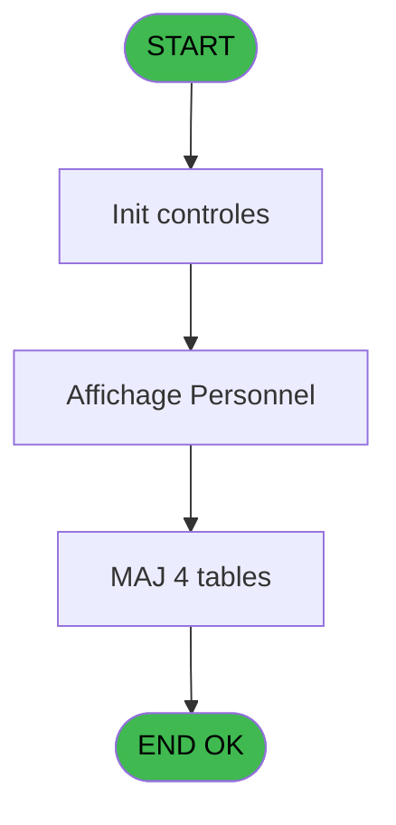
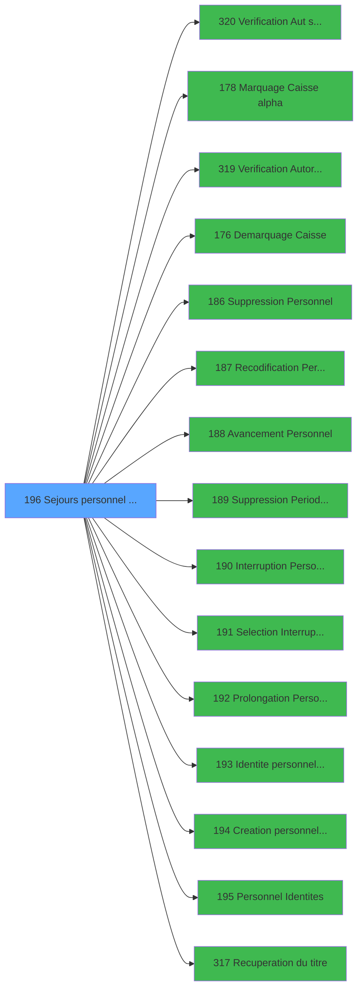

# PBG IDE 196 - Sejours personnel CallTask

> **Analyse**: Phases 1-4 2026-02-03 10:07 -> 10:07 (17s) | Assemblage 10:07
> **Pipeline**: V7.2 Enrichi
> **Structure**: 4 onglets (Resume | Ecrans | Donnees | Connexions)

<!-- TAB:Resume -->

## 1. FICHE D'IDENTITE

| Attribut | Valeur |
|----------|--------|
| Projet | PBG |
| IDE Position | 196 |
| Nom Programme | Sejours personnel CallTask |
| Fichier source | `Prg_196.xml` |
| Domaine metier | General |
| Taches | 15 (5 ecrans visibles) |
| Tables modifiees | 4 |
| Programmes appeles | 15 |
| :warning: Statut | **ORPHELIN_POTENTIEL** |

## 2. DESCRIPTION FONCTIONNELLE

**Sejours personnel CallTask** assure la gestion complete de ce processus.

Le flux de traitement s'organise en **4 blocs fonctionnels** :

- **Traitement** (8 taches) : traitements metier divers
- **Consultation** (5 taches) : ecrans de recherche, selection et consultation
- **Calcul** (1 tache) : calculs de montants, stocks ou compteurs
- **Validation** (1 tache) : controles et verifications de coherence

**Donnees modifiees** : 4 tables en ecriture (compteurs________cpt, mouchard_________mou, fi_complet_______gm_go, pms_print_param).

Detail : phases du traitement

#### Phase 1 : Traitement (8 taches)

- **196** - Module des Sejours
- **196.1** - Determination Age Bebe
- **196.2** - Test Base
- **196.3.3** - ²
- **196.3.5** - Confirmation suppression **[[ECRAN]](#ecran-t11)**
- **196.3.6** - Tracage Suppression
- **196.3.6.2** - Tracage
- **196.3.9** - ²

Delegue a : [Marquage Caisse alpha (IDE 178)](PBG-IDE-178.md), [Demarquage Caisse (IDE 176)](PBG-IDE-176.md), [  Suppression Personnel (IDE 186)](PBG-IDE-186.md), [  Recodification Personnel (IDE 187)](PBG-IDE-187.md), [  Avancement Personnel (IDE 188)](PBG-IDE-188.md), [  Suppression Periode Personn (IDE 189)](PBG-IDE-189.md), [  Interruption Personnel (IDE 190)](PBG-IDE-190.md), [  Prolongation Personnel (IDE 192)](PBG-IDE-192.md), [  Identite personnel passport (IDE 193)](PBG-IDE-193.md), [Personnel Identites (IDE 195)](PBG-IDE-195.md), [Recuperation du titre (IDE 317)](PBG-IDE-317.md)

#### Phase 2 : Consultation (5 taches)

- **196.3** - Affichage Clients **[[ECRAN]](#ecran-t4)**
- **196.3.1** - Recherche Nom **[[ECRAN]](#ecran-t5)**
- **196.3.2** - Affichage Periodes **[[ECRAN]](#ecran-t7)**
- **196.3.7** - recherche
- **196.3.8** - Affichage Absences **[[ECRAN]](#ecran-t18)**

Delegue a : [  Selection Interruption (IDE 191)](PBG-IDE-191.md), [Recuperation du titre (IDE 317)](PBG-IDE-317.md)

#### Phase 3 : Validation (1 tache)

- **196.3.4** - Verification Suppression **[[ECRAN]](#ecran-t10)**

Delegue a : [Verification Aut sans ecran (IDE 320)](PBG-IDE-320.md), [Verification Autorisation (IDE 319)](PBG-IDE-319.md)

#### Phase 4 : Calcul (1 tache)

- **196.3.6.1** - Compteur

#### Tables impactees

| Table | Operations | Role metier |
|-------|-----------|-------------|
| pms_print_param | **W**/L (2 usages) |  |
| mouchard_________mou | **W** (1 usages) |  |
| compteurs________cpt | **W** (1 usages) | Comptes GM (generaux) |
| fi_complet_______gm_go | **W** (1 usages) |  |

## 3. BLOCS FONCTIONNELS

### 3.1 Traitement (8 taches)

Traitements internes.

---

#### 196 - Module des Sejours

**Role** : Tache d'orchestration : point d'entree du programme (8 sous-taches). Coordonne l'enchainement des traitements.

7 sous-taches directes

| Tache | Nom | Bloc |
|-------|-----|------|
| [196.1](#t2) | Determination Age Bebe | Traitement |
| [196.2](#t3) | Test Base | Traitement |
| [196.3.3](#t8) | ² | Traitement |
| [196.3.5](#t11) | Confirmation suppression **[[ECRAN]](#ecran-t11)** | Traitement |
| [196.3.6](#t12) | Tracage Suppression | Traitement |
| [196.3.6.2](#t14) | Tracage | Traitement |
| [196.3.9](#t21) | ² | Traitement |

**Delegue a** : [Marquage Caisse alpha (IDE 178)](PBG-IDE-178.md), [Demarquage Caisse (IDE 176)](PBG-IDE-176.md), [  Suppression Personnel (IDE 186)](PBG-IDE-186.md)

---

#### 196.1 - Determination Age Bebe

**Role** : Traitement : Determination Age Bebe.
**Variables liees** : D (W0-Age Bebe)
**Delegue a** : [Marquage Caisse alpha (IDE 178)](PBG-IDE-178.md), [Demarquage Caisse (IDE 176)](PBG-IDE-176.md), [  Suppression Personnel (IDE 186)](PBG-IDE-186.md)

---

#### 196.2 - Test Base

**Role** : Verification : Test Base.
**Variables liees** : E (W0-Base Vide)
**Delegue a** : [Marquage Caisse alpha (IDE 178)](PBG-IDE-178.md), [Demarquage Caisse (IDE 176)](PBG-IDE-176.md), [  Suppression Personnel (IDE 186)](PBG-IDE-186.md)

---

#### 196.3.3 - ²

**Role** : Traitement interne.

---

#### 196.3.5 - Confirmation suppression [[ECRAN]](#ecran-t11)

**Role** : Traitement : Confirmation suppression.
**Ecran** : 466 x 73 DLU (MDI) | [Voir mockup](#ecran-t11)
**Variables liees** : H (W1-Autorisation Suppression), R (W1 suppression ok), S (bouton suppression)
**Delegue a** : [Marquage Caisse alpha (IDE 178)](PBG-IDE-178.md), [Demarquage Caisse (IDE 176)](PBG-IDE-176.md), [  Suppression Personnel (IDE 186)](PBG-IDE-186.md)

---

#### 196.3.6 - Tracage Suppression

**Role** : Traitement : Tracage Suppression.
**Variables liees** : H (W1-Autorisation Suppression), R (W1 suppression ok), S (bouton suppression)
**Delegue a** : [Marquage Caisse alpha (IDE 178)](PBG-IDE-178.md), [Demarquage Caisse (IDE 176)](PBG-IDE-176.md), [  Suppression Personnel (IDE 186)](PBG-IDE-186.md)

---

#### 196.3.6.2 - Tracage

**Role** : Traitement : Tracage.
**Delegue a** : [Marquage Caisse alpha (IDE 178)](PBG-IDE-178.md), [Demarquage Caisse (IDE 176)](PBG-IDE-176.md), [  Suppression Personnel (IDE 186)](PBG-IDE-186.md)

---

#### 196.3.9 - ²

**Role** : Traitement interne.

### 3.2 Consultation (5 taches)

Ecrans de recherche et consultation.

---

#### 196.3 - Affichage Clients [[ECRAN]](#ecran-t4)

**Role** : Reinitialisation : Affichage Clients.
**Ecran** : 1179 x 298 DLU (MDI) | [Voir mockup](#ecran-t4)
**Delegue a** : [  Selection Interruption (IDE 191)](PBG-IDE-191.md)

---

#### 196.3.1 - Recherche Nom [[ECRAN]](#ecran-t5)

**Role** : Traitement : Recherche Nom.
**Ecran** : 576 x 89 DLU (MDI) | [Voir mockup](#ecran-t5)
**Variables liees** : P (bouton rechercher)
**Delegue a** : [  Selection Interruption (IDE 191)](PBG-IDE-191.md)

---

#### 196.3.2 - Affichage Periodes [[ECRAN]](#ecran-t7)

**Role** : Reinitialisation : Affichage Periodes.
**Ecran** : 730 x 129 DLU (Modal) | [Voir mockup](#ecran-t7)
**Delegue a** : [  Selection Interruption (IDE 191)](PBG-IDE-191.md)

---

#### 196.3.7 - recherche

**Role** : Traitement : recherche.
**Variables liees** : P (bouton rechercher)
**Delegue a** : [  Selection Interruption (IDE 191)](PBG-IDE-191.md)

---

#### 196.3.8 - Affichage Absences [[ECRAN]](#ecran-t18)

**Role** : Reinitialisation : Affichage Absences.
**Ecran** : 1071 x 158 DLU (MDI) | [Voir mockup](#ecran-t18)
**Delegue a** : [  Selection Interruption (IDE 191)](PBG-IDE-191.md)

### 3.3 Validation (1 tache)

Controles de coherence : 1 tache verifie les donnees et conditions.

---

#### 196.3.4 - Verification Suppression [[ECRAN]](#ecran-t10)

**Role** : Verification : Verification Suppression.
**Ecran** : 120 x 32 DLU (Modal) | [Voir mockup](#ecran-t10)
**Variables liees** : H (W1-Autorisation Suppression), R (W1 suppression ok), S (bouton suppression)
**Delegue a** : [Verification Aut sans ecran (IDE 320)](PBG-IDE-320.md), [Verification Autorisation (IDE 319)](PBG-IDE-319.md)

### 3.4 Calcul (1 tache)

Calculs metier : montants, stocks, compteurs.

---

#### 196.3.6.1 - Compteur

**Role** : Calcul : Compteur.

## 5. REGLES METIER

*(Aucune regle metier identifiee)*

## 6. CONTEXTE

- **Appele par**: (aucun)
- **Appelle**: 15 programmes | **Tables**: 25 (W:4 R:6 L:17) | **Taches**: 15 | **Expressions**: 6

<!-- TAB:Ecrans -->

## 8. ECRANS

### 8.1 Forms visibles (5 / 15)

| # | Position | Tache | Nom | Type | Largeur | Hauteur | Bloc |
|---|----------|-------|-----|------|---------|---------|------|
| 1 | 196.3 | 196.3 | Affichage Clients | MDI | 1179 | 298 | Consultation |
| 2 | 196.3.2 | 196.3.1 | Recherche Nom | MDI | 576 | 89 | Consultation |
| 3 | 196.3.3 | 196.3.2 | Affichage Periodes | Modal | 730 | 129 | Consultation |
| 4 | 196.3.6 | 196.3.5 | Confirmation suppression | MDI | 466 | 73 | Traitement |
| 5 | 196.3.9 | 196.3.8 | Affichage Absences | MDI | 1071 | 158 | Consultation |

### 8.2 Mockups Ecrans

---

#### 196.3 - Affichage Clients
**Tache** : [196.3](#t4) | **Type** : MDI | **Dimensions** : 1179 x 298 DLU
**Bloc** : Consultation | **Titre IDE** : Affichage Clients

<!-- FORM-DATA:
{
    "width":  1179,
    "vFactor":  8,
    "type":  "MDI",
    "hFactor":  8,
    "controls":  [
                     {
                         "x":  2,
                         "type":  "label",
                         "var":  "",
                         "y":  1,
                         "w":  1169,
                         "fmt":  "",
                         "name":  "",
                         "h":  21,
                         "color":  "",
                         "text":  "",
                         "parent":  null
                     },
                     {
                         "x":  432,
                         "type":  "label",
                         "var":  "",
                         "y":  22,
                         "w":  727,
                         "fmt":  "",
                         "name":  "",
                         "h":  67,
                         "color":  "",
                         "text":  "",
                         "parent":  null
                     },
                     {
                         "x":  8,
                         "type":  "table",
                         "var":  "",
                         "name":  "",
                         "titleH":  12,
                         "color":  "110",
                         "w":  392,
                         "y":  29,
                         "fmt":  "",
                         "parent":  null,
                         "text":  "",
                         "rowH":  15,
                         "h":  239,
                         "cols":  [
                                      {
                                          "title":  "Nom",
                                          "layer":  1,
                                          "w":  227
                                      },
                                      {
                                          "title":  "Prénom",
                                          "layer":  2,
                                          "w":  131
                                      }
                                  ],
                         "rows":  2
                     },
                     {
                         "x":  696,
                         "type":  "label",
                         "var":  "",
                         "y":  47,
                         "w":  61,
                         "fmt":  "",
                         "name":  "",
                         "h":  9,
                         "color":  "",
                         "text":  "Qualité",
                         "parent":  4
                     },
                     {
                         "x":  696,
                         "type":  "label",
                         "var":  "",
                         "y":  60,
                         "w":  66,
                         "fmt":  "",
                         "name":  "",
                         "h":  9,
                         "color":  "",
                         "text":  "Service",
                         "parent":  4
                     },
                     {
                         "x":  696,
                         "type":  "label",
                         "var":  "",
                         "y":  72,
                         "w":  74,
                         "fmt":  "",
                         "name":  "",
                         "h":  9,
                         "color":  "",
                         "text":  "Fonction",
                         "parent":  4
                     },
                     {
                         "x":  435,
                         "type":  "label",
                         "var":  "",
                         "y":  90,
                         "w":  727,
                         "fmt":  "",
                         "name":  "",
                         "h":  43,
                         "color":  "195",
                         "text":  "Séjour",
                         "parent":  null
                     },
                     {
                         "x":  504,
                         "type":  "label",
                         "var":  "",
                         "y":  104,
                         "w":  72,
                         "fmt":  "",
                         "name":  "",
                         "h":  9,
                         "color":  "",
                         "text":  "Arrivée",
                         "parent":  19
                     },
                     {
                         "x":  806,
                         "type":  "label",
                         "var":  "",
                         "y":  102,
                         "w":  77,
                         "fmt":  "",
                         "name":  "",
                         "h":  9,
                         "color":  "",
                         "text":  "Départ",
                         "parent":  19
                     },
                     {
                         "x":  504,
                         "type":  "label",
                         "var":  "",
                         "y":  116,
                         "w":  72,
                         "fmt":  "",
                         "name":  "",
                         "h":  9,
                         "color":  "",
                         "text":  "Groupe",
                         "parent":  19
                     },
                     {
                         "x":  806,
                         "type":  "label",
                         "var":  "",
                         "y":  116,
                         "w":  82,
                         "fmt":  "",
                         "name":  "",
                         "h":  9,
                         "color":  "",
                         "text":  "Groupe",
                         "parent":  19
                     },
                     {
                         "x":  1,
                         "type":  "label",
                         "var":  "",
                         "y":  271,
                         "w":  1170,
                         "fmt":  "",
                         "name":  "",
                         "h":  24,
                         "color":  "",
                         "text":  "",
                         "parent":  null
                     },
                     {
                         "x":  1029,
                         "type":  "label",
                         "var":  "",
                         "y":  35,
                         "w":  56,
                         "fmt":  "",
                         "name":  "",
                         "h":  9,
                         "color":  "7",
                         "text":  "Bébé",
                         "parent":  4
                     },
                     {
                         "x":  915,
                         "type":  "label",
                         "var":  "",
                         "y":  47,
                         "w":  56,
                         "fmt":  "",
                         "name":  "",
                         "h":  9,
                         "color":  "7",
                         "text":  "Abs",
                         "parent":  4
                     },
                     {
                         "x":  16,
                         "type":  "edit",
                         "var":  "",
                         "y":  45,
                         "w":  216,
                         "fmt":  "",
                         "name":  "GO Nom",
                         "h":  8,
                         "color":  "110",
                         "text":  "",
                         "parent":  5
                     },
                     {
                         "x":  248,
                         "type":  "edit",
                         "var":  "",
                         "y":  45,
                         "w":  114,
                         "fmt":  "",
                         "name":  "go_prenom",
                         "h":  8,
                         "color":  "110",
                         "text":  "",
                         "parent":  5
                     },
                     {
                         "x":  798,
                         "type":  "edit",
                         "var":  "",
                         "y":  60,
                         "w":  291,
                         "fmt":  "100",
                         "name":  "",
                         "h":  9,
                         "color":  "",
                         "text":  "",
                         "parent":  4
                     },
                     {
                         "x":  798,
                         "type":  "edit",
                         "var":  "",
                         "y":  72,
                         "w":  291,
                         "fmt":  "100",
                         "name":  "",
                         "h":  9,
                         "color":  "",
                         "text":  "",
                         "parent":  4
                     },
                     {
                         "x":  594,
                         "type":  "edit",
                         "var":  "",
                         "y":  102,
                         "w":  123,
                         "fmt":  "",
                         "name":  "",
                         "h":  9,
                         "color":  "",
                         "text":  "",
                         "parent":  19
                     },
                     {
                         "x":  730,
                         "type":  "edit",
                         "var":  "",
                         "y":  102,
                         "w":  45,
                         "fmt":  "UUh",
                         "name":  "",
                         "h":  9,
                         "color":  "",
                         "text":  "",
                         "parent":  19
                     },
                     {
                         "x":  890,
                         "type":  "edit",
                         "var":  "",
                         "y":  102,
                         "w":  123,
                         "fmt":  "",
                         "name":  "",
                         "h":  9,
                         "color":  "",
                         "text":  "",
                         "parent":  19
                     },
                     {
                         "x":  1024,
                         "type":  "edit",
                         "var":  "",
                         "y":  102,
                         "w":  45,
                         "fmt":  "UUh",
                         "name":  "",
                         "h":  9,
                         "color":  "",
                         "text":  "",
                         "parent":  19
                     },
                     {
                         "x":  599,
                         "type":  "button",
                         "var":  "",
                         "y":  274,
                         "w":  136,
                         "fmt":  "\u0026Rechercher",
                         "name":  "bouton rechercher",
                         "h":  18,
                         "color":  "",
                         "text":  "",
                         "parent":  30
                     },
                     {
                         "x":  741,
                         "type":  "button",
                         "var":  "",
                         "y":  274,
                         "w":  136,
                         "fmt":  "\u0026Suppression",
                         "name":  "bouton suppression",
                         "h":  18,
                         "color":  "",
                         "text":  "",
                         "parent":  30
                     },
                     {
                         "x":  883,
                         "type":  "button",
                         "var":  "",
                         "y":  274,
                         "w":  136,
                         "fmt":  "\u0026Modification",
                         "name":  "bouton modification",
                         "h":  18,
                         "color":  "",
                         "text":  "",
                         "parent":  30
                     },
                     {
                         "x":  1027,
                         "type":  "button",
                         "var":  "",
                         "y":  274,
                         "w":  136,
                         "fmt":  "\u0026Création",
                         "name":  "bouton creation",
                         "h":  18,
                         "color":  "",
                         "text":  "",
                         "parent":  30
                     },
                     {
                         "x":  10,
                         "type":  "edit",
                         "var":  "",
                         "y":  6,
                         "w":  267,
                         "fmt":  "20",
                         "name":  "",
                         "h":  8,
                         "color":  "",
                         "text":  "",
                         "parent":  1
                     },
                     {
                         "x":  960,
                         "type":  "edit",
                         "var":  "",
                         "y":  7,
                         "w":  203,
                         "fmt":  "WWW DD MMM YYYYT",
                         "name":  "",
                         "h":  8,
                         "color":  "",
                         "text":  "",
                         "parent":  1
                     },
                     {
                         "x":  470,
                         "type":  "image",
                         "var":  "",
                         "y":  28,
                         "w":  152,
                         "fmt":  "",
                         "name":  "",
                         "h":  56,
                         "color":  "",
                         "text":  "",
                         "parent":  4
                     },
                     {
                         "x":  798,
                         "type":  "edit",
                         "var":  "",
                         "y":  47,
                         "w":  101,
                         "fmt":  "8",
                         "name":  "",
                         "h":  9,
                         "color":  "",
                         "text":  "",
                         "parent":  4
                     },
                     {
                         "x":  1029,
                         "type":  "edit",
                         "var":  "",
                         "y":  47,
                         "w":  56,
                         "fmt":  "UX3",
                         "name":  "",
                         "h":  9,
                         "color":  "7",
                         "text":  "",
                         "parent":  4
                     },
                     {
                         "x":  594,
                         "type":  "edit",
                         "var":  "",
                         "y":  116,
                         "w":  179,
                         "fmt":  "15",
                         "name":  "",
                         "h":  9,
                         "color":  "",
                         "text":  "",
                         "parent":  19
                     },
                     {
                         "x":  890,
                         "type":  "edit",
                         "var":  "",
                         "y":  116,
                         "w":  179,
                         "fmt":  "15",
                         "name":  "",
                         "h":  9,
                         "color":  "",
                         "text":  "",
                         "parent":  19
                     },
                     {
                         "x":  12,
                         "type":  "button",
                         "var":  "",
                         "y":  274,
                         "w":  128,
                         "fmt":  "\u0026Quitter",
                         "name":  "",
                         "h":  18,
                         "color":  "",
                         "text":  "",
                         "parent":  30
                     },
                     {
                         "x":  315,
                         "type":  "button",
                         "var":  "",
                         "y":  274,
                         "w":  136,
                         "fmt":  "Abse\u0026nces",
                         "name":  "Bt. Absences",
                         "h":  18,
                         "color":  "",
                         "text":  "",
                         "parent":  30
                     },
                     {
                         "x":  457,
                         "type":  "button",
                         "var":  "",
                         "y":  274,
                         "w":  136,
                         "fmt":  "Passep\u0026ort",
                         "name":  "Bt. Passport",
                         "h":  18,
                         "color":  "",
                         "text":  "",
                         "parent":  30
                     }
                 ],
    "taskId":  "196.3",
    "height":  298
}
-->

<strong>Champs : 14 champs</strong>

| Pos (x,y) | Nom | Variable | Type |
|-----------|-----|----------|------|
| 16,45 | GO Nom | - | edit |
| 248,45 | go_prenom | - | edit |
| 798,60 | 100 | - | edit |
| 798,72 | 100 | - | edit |
| 594,102 | (sans nom) | - | edit |
| 730,102 | UUh | - | edit |
| 890,102 | (sans nom) | - | edit |
| 1024,102 | UUh | - | edit |
| 10,6 | 20 | - | edit |
| 960,7 | WWW DD MMM YYYYT | - | edit |
| 798,47 | 8 | - | edit |
| 1029,47 | UX3 | - | edit |
| 594,116 | 15 | - | edit |
| 890,116 | 15 | - | edit |

<strong>Boutons : 7 boutons</strong>

| Bouton | Pos (x,y) | Action |
|--------|-----------|--------|
| Rechercher | 599,274 | Ouvre la selection |
| Suppression | 741,274 | Appel [  Suppression Personnel (IDE 186)](PBG-IDE-186.md) |
| Modification | 883,274 | Modifie l'element |
| Création | 1027,274 | Bouton fonctionnel |
| Quitter | 12,274 | Quitte le programme |
| Absences | 315,274 | Bouton fonctionnel |
| Passeport | 457,274 | Bouton fonctionnel |

---

#### 196.3.2 - Recherche Nom
**Tache** : [196.3.1](#t5) | **Type** : MDI | **Dimensions** : 576 x 89 DLU
**Bloc** : Consultation | **Titre IDE** : Recherche Nom

<!-- FORM-DATA:
{
    "width":  576,
    "vFactor":  8,
    "type":  "MDI",
    "hFactor":  8,
    "controls":  [
                     {
                         "x":  143,
                         "type":  "label",
                         "var":  "",
                         "y":  6,
                         "w":  420,
                         "fmt":  "",
                         "name":  "",
                         "h":  52,
                         "color":  "",
                         "text":  "",
                         "parent":  null
                     },
                     {
                         "x":  152,
                         "type":  "label",
                         "var":  "",
                         "y":  18,
                         "w":  153,
                         "fmt":  "",
                         "name":  "",
                         "h":  10,
                         "color":  "",
                         "text":  "Entrez le nom",
                         "parent":  2
                     },
                     {
                         "x":  152,
                         "type":  "label",
                         "var":  "",
                         "y":  37,
                         "w":  129,
                         "fmt":  "",
                         "name":  "",
                         "h":  8,
                         "color":  "",
                         "text":  "Entrez le prénom",
                         "parent":  2
                     },
                     {
                         "x":  0,
                         "type":  "label",
                         "var":  "",
                         "y":  63,
                         "w":  571,
                         "fmt":  "",
                         "name":  "",
                         "h":  24,
                         "color":  "",
                         "text":  "",
                         "parent":  null
                     },
                     {
                         "x":  295,
                         "type":  "edit",
                         "var":  "",
                         "y":  18,
                         "w":  238,
                         "fmt":  "U15",
                         "name":  "W2-Recherche nom",
                         "h":  10,
                         "color":  "110",
                         "text":  "",
                         "parent":  2
                     },
                     {
                         "x":  7,
                         "type":  "button",
                         "var":  "",
                         "y":  66,
                         "w":  154,
                         "fmt":  "\u0026Ok",
                         "name":  "",
                         "h":  18,
                         "color":  "",
                         "text":  "",
                         "parent":  6
                     },
                     {
                         "x":  173,
                         "type":  "button",
                         "var":  "",
                         "y":  66,
                         "w":  154,
                         "fmt":  "A\u0026bandonner",
                         "name":  "",
                         "h":  18,
                         "color":  "",
                         "text":  "",
                         "parent":  6
                     },
                     {
                         "x":  2,
                         "type":  "image",
                         "var":  "",
                         "y":  5,
                         "w":  127,
                         "fmt":  "",
                         "name":  "",
                         "h":  54,
                         "color":  "",
                         "text":  "",
                         "parent":  null
                     },
                     {
                         "x":  295,
                         "type":  "edit",
                         "var":  "",
                         "y":  36,
                         "w":  118,
                         "fmt":  "UX9",
                         "name":  "W2-Recherche prenom",
                         "h":  10,
                         "color":  "110",
                         "text":  "",
                         "parent":  2
                     }
                 ],
    "taskId":  "196.3.2",
    "height":  89
}
-->

<strong>Champs : 2 champs</strong>

| Pos (x,y) | Nom | Variable | Type |
|-----------|-----|----------|------|
| 295,18 | W2-Recherche nom | - | edit |
| 295,36 | W2-Recherche prenom | - | edit |

<strong>Boutons : 2 boutons</strong>

| Bouton | Pos (x,y) | Action |
|--------|-----------|--------|
| Ok | 7,66 | Valide la saisie et enregistre |
| Abandonner | 173,66 | Annule et retour au menu |

---

#### 196.3.3 - Affichage Periodes
**Tache** : [196.3.2](#t7) | **Type** : Modal | **Dimensions** : 730 x 129 DLU
**Bloc** : Consultation | **Titre IDE** : Affichage Periodes

<!-- FORM-DATA:
{
    "width":  730,
    "vFactor":  8,
    "type":  "Modal",
    "hFactor":  8,
    "controls":  [
                     {
                         "x":  0,
                         "type":  "label",
                         "var":  "",
                         "y":  0,
                         "w":  729,
                         "fmt":  "",
                         "name":  "",
                         "h":  125,
                         "color":  "195",
                         "text":  "Periodes",
                         "parent":  null
                     },
                     {
                         "x":  26,
                         "type":  "label",
                         "var":  "",
                         "y":  11,
                         "w":  61,
                         "fmt":  "",
                         "name":  "",
                         "h":  8,
                         "color":  "",
                         "text":  "Qualité",
                         "parent":  1
                     },
                     {
                         "x":  301,
                         "type":  "label",
                         "var":  "",
                         "y":  11,
                         "w":  54,
                         "fmt":  "",
                         "name":  "",
                         "h":  9,
                         "color":  "",
                         "text":  "Single",
                         "parent":  1
                     },
                     {
                         "x":  21,
                         "type":  "table",
                         "var":  "",
                         "name":  "",
                         "titleH":  12,
                         "color":  "7",
                         "w":  698,
                         "y":  24,
                         "fmt":  "",
                         "parent":  null,
                         "text":  "",
                         "rowH":  14,
                         "h":  71,
                         "cols":  [
                                      {
                                          "title":  "",
                                          "layer":  1,
                                          "w":  266
                                      },
                                      {
                                          "title":  "",
                                          "layer":  2,
                                          "w":  146
                                      },
                                      {
                                          "title":  "",
                                          "layer":  3,
                                          "w":  167
                                      },
                                      {
                                          "title":  "",
                                          "layer":  4,
                                          "w":  80
                                      }
                                  ],
                         "rows":  4
                     },
                     {
                         "x":  23,
                         "type":  "label",
                         "var":  "",
                         "y":  98,
                         "w":  689,
                         "fmt":  "",
                         "name":  "",
                         "h":  24,
                         "color":  "",
                         "text":  "",
                         "parent":  1
                     },
                     {
                         "x":  292,
                         "type":  "edit",
                         "var":  "",
                         "y":  27,
                         "w":  98,
                         "fmt":  "DD/MM/YY",
                         "name":  "",
                         "h":  8,
                         "color":  "110",
                         "text":  "",
                         "parent":  6
                     },
                     {
                         "x":  394,
                         "type":  "edit",
                         "var":  "",
                         "y":  27,
                         "w":  40,
                         "fmt":  "UUh",
                         "name":  "",
                         "h":  8,
                         "color":  "110",
                         "text":  "",
                         "parent":  6
                     },
                     {
                         "x":  438,
                         "type":  "edit",
                         "var":  "",
                         "y":  27,
                         "w":  98,
                         "fmt":  "DD/MM/YY",
                         "name":  "",
                         "h":  8,
                         "color":  "110",
                         "text":  "",
                         "parent":  6
                     },
                     {
                         "x":  538,
                         "type":  "edit",
                         "var":  "",
                         "y":  27,
                         "w":  60,
                         "fmt":  "HHhMM",
                         "name":  "heb_liberation_chambre",
                         "h":  8,
                         "color":  "110",
                         "text":  "",
                         "parent":  6
                     },
                     {
                         "x":  68,
                         "type":  "edit",
                         "var":  "",
                         "y":  27,
                         "w":  216,
                         "fmt":  "",
                         "name":  "HEB Libelle",
                         "h":  8,
                         "color":  "110",
                         "text":  "",
                         "parent":  6
                     },
                     {
                         "x":  606,
                         "type":  "edit",
                         "var":  "",
                         "y":  27,
                         "w":  75,
                         "fmt":  "",
                         "name":  "",
                         "h":  8,
                         "color":  "110",
                         "text":  "",
                         "parent":  6
                     },
                     {
                         "x":  31,
                         "type":  "edit",
                         "var":  "",
                         "y":  27,
                         "w":  35,
                         "fmt":  "",
                         "name":  "",
                         "h":  8,
                         "color":  "110",
                         "text":  "",
                         "parent":  6
                     },
                     {
                         "x":  37,
                         "type":  "button",
                         "var":  "",
                         "y":  101,
                         "w":  120,
                         "fmt":  "\u0026Prolonger",
                         "name":  "v.bouton prolonger",
                         "h":  18,
                         "color":  "",
                         "text":  "",
                         "parent":  14
                     },
                     {
                         "x":  173,
                         "type":  "button",
                         "var":  "",
                         "y":  101,
                         "w":  120,
                         "fmt":  "\u0026Interrompre",
                         "name":  "v.bouton interruption",
                         "h":  18,
                         "color":  "",
                         "text":  "",
                         "parent":  14
                     },
                     {
                         "x":  309,
                         "type":  "button",
                         "var":  "",
                         "y":  101,
                         "w":  120,
                         "fmt":  "",
                         "name":  "v.bouton avancer",
                         "h":  18,
                         "color":  "",
                         "text":  "",
                         "parent":  14
                     },
                     {
                         "x":  445,
                         "type":  "button",
                         "var":  "",
                         "y":  101,
                         "w":  120,
                         "fmt":  "\u0026Recodifier",
                         "name":  "bouton recodifier",
                         "h":  18,
                         "color":  "",
                         "text":  "",
                         "parent":  14
                     },
                     {
                         "x":  578,
                         "type":  "button",
                         "var":  "",
                         "y":  101,
                         "w":  120,
                         "fmt":  "\u0026Supprimer",
                         "name":  "v.bouton supprimer",
                         "h":  18,
                         "color":  "",
                         "text":  "",
                         "parent":  14
                     },
                     {
                         "x":  99,
                         "type":  "edit",
                         "var":  "",
                         "y":  11,
                         "w":  101,
                         "fmt":  "8",
                         "name":  "",
                         "h":  9,
                         "color":  "",
                         "text":  "",
                         "parent":  1
                     },
                     {
                         "x":  367,
                         "type":  "edit",
                         "var":  "",
                         "y":  11,
                         "w":  45,
                         "fmt":  "UX2",
                         "name":  "",
                         "h":  9,
                         "color":  "",
                         "text":  "",
                         "parent":  1
                     }
                 ],
    "taskId":  "196.3.3",
    "height":  129
}
-->

<strong>Champs : 9 champs</strong>

| Pos (x,y) | Nom | Variable | Type |
|-----------|-----|----------|------|
| 292,27 | DD/MM/YY | - | edit |
| 394,27 | UUh | - | edit |
| 438,27 | DD/MM/YY | - | edit |
| 538,27 | heb_liberation_chambre | - | edit |
| 68,27 | HEB Libelle | - | edit |
| 606,27 | (sans nom) | - | edit |
| 31,27 | (sans nom) | - | edit |
| 99,11 | 8 | - | edit |
| 367,11 | UX2 | - | edit |

<strong>Boutons : 5 boutons</strong>

| Bouton | Pos (x,y) | Action |
|--------|-----------|--------|
| Prolonger | 37,101 | Appel [  Prolongation Personnel (IDE 192)](PBG-IDE-192.md) |
| Interrompre | 173,101 | Appel [  Interruption Personnel (IDE 190)](PBG-IDE-190.md) |
| v.bouton avancer | 309,101 | Bouton fonctionnel |
| Recodifier | 445,101 | Appel [  Recodification Personnel (IDE 187)](PBG-IDE-187.md) |
| Supprimer | 578,101 | Appel [  Suppression Personnel (IDE 186)](PBG-IDE-186.md) |

---

#### 196.3.6 - Confirmation suppression
**Tache** : [196.3.5](#t11) | **Type** : MDI | **Dimensions** : 466 x 73 DLU
**Bloc** : Traitement | **Titre IDE** : Confirmation suppression

<!-- FORM-DATA:
{
    "width":  466,
    "vFactor":  8,
    "type":  "MDI",
    "hFactor":  8,
    "controls":  [
                     {
                         "x":  3,
                         "type":  "label",
                         "var":  "",
                         "y":  1,
                         "w":  458,
                         "fmt":  "",
                         "name":  "",
                         "h":  69,
                         "color":  "",
                         "text":  "",
                         "parent":  null
                     },
                     {
                         "x":  100,
                         "type":  "label",
                         "var":  "",
                         "y":  9,
                         "w":  181,
                         "fmt":  "",
                         "name":  "",
                         "h":  8,
                         "color":  "",
                         "text":  "Motif de la suppression",
                         "parent":  null
                     },
                     {
                         "x":  6,
                         "type":  "label",
                         "var":  "",
                         "y":  44,
                         "w":  450,
                         "fmt":  "",
                         "name":  "",
                         "h":  24,
                         "color":  "",
                         "text":  "",
                         "parent":  1
                     },
                     {
                         "x":  100,
                         "type":  "edit",
                         "var":  "",
                         "y":  19,
                         "w":  347,
                         "fmt":  "",
                         "name":  "W2 motif",
                         "h":  9,
                         "color":  "110",
                         "text":  "",
                         "parent":  null
                     },
                     {
                         "x":  14,
                         "type":  "button",
                         "var":  "",
                         "y":  47,
                         "w":  154,
                         "fmt":  "\u0026Ok",
                         "name":  "bouton oui",
                         "h":  18,
                         "color":  "",
                         "text":  "",
                         "parent":  null
                     },
                     {
                         "x":  9,
                         "type":  "image",
                         "var":  "",
                         "y":  4,
                         "w":  76,
                         "fmt":  "",
                         "name":  "",
                         "h":  30,
                         "color":  "",
                         "text":  "",
                         "parent":  1
                     },
                     {
                         "x":  178,
                         "type":  "button",
                         "var":  "",
                         "y":  47,
                         "w":  154,
                         "fmt":  "A\u0026bandonner",
                         "name":  "",
                         "h":  18,
                         "color":  "",
                         "text":  "",
                         "parent":  null
                     }
                 ],
    "taskId":  "196.3.6",
    "height":  73
}
-->

<strong>Champs : 1 champs</strong>

| Pos (x,y) | Nom | Variable | Type |
|-----------|-----|----------|------|
| 100,19 | W2 motif | - | edit |

<strong>Boutons : 2 boutons</strong>

| Bouton | Pos (x,y) | Action |
|--------|-----------|--------|
| Ok | 14,47 | Valide la saisie et enregistre |
| Abandonner | 178,47 | Annule et retour au menu |

---

#### 196.3.9 - Affichage Absences
**Tache** : [196.3.8](#t18) | **Type** : MDI | **Dimensions** : 1071 x 158 DLU
**Bloc** : Consultation | **Titre IDE** : Affichage Absences

<!-- FORM-DATA:
{
    "width":  1071,
    "vFactor":  8,
    "type":  "MDI",
    "hFactor":  8,
    "controls":  [
                     {
                         "x":  3,
                         "type":  "label",
                         "var":  "",
                         "y":  0,
                         "w":  1067,
                         "fmt":  "",
                         "name":  "",
                         "h":  129,
                         "color":  "195",
                         "text":  "Absences",
                         "parent":  null
                     },
                     {
                         "x":  6,
                         "type":  "table",
                         "var":  "",
                         "name":  "",
                         "titleH":  12,
                         "color":  "110",
                         "w":  1063,
                         "y":  11,
                         "fmt":  "",
                         "parent":  null,
                         "text":  "",
                         "rowH":  16,
                         "h":  115,
                         "cols":  [
                                      {
                                          "title":  "",
                                          "layer":  1,
                                          "w":  420
                                      },
                                      {
                                          "title":  "Du",
                                          "layer":  2,
                                          "w":  309
                                      },
                                      {
                                          "title":  "Au",
                                          "layer":  3,
                                          "w":  302
                                      }
                                  ],
                         "rows":  3
                     },
                     {
                         "x":  3,
                         "type":  "label",
                         "var":  "",
                         "y":  132,
                         "w":  1066,
                         "fmt":  "",
                         "name":  "",
                         "h":  24,
                         "color":  "",
                         "text":  "",
                         "parent":  null
                     },
                     {
                         "x":  13,
                         "type":  "combobox",
                         "var":  "",
                         "y":  25,
                         "w":  411,
                         "fmt":  "",
                         "name":  "raison",
                         "h":  12,
                         "color":  "110",
                         "text":  "Raison Absence",
                         "parent":  2
                     },
                     {
                         "x":  437,
                         "type":  "edit",
                         "var":  "",
                         "y":  28,
                         "w":  111,
                         "fmt":  "",
                         "name":  "date_debut",
                         "h":  8,
                         "color":  "110",
                         "text":  "",
                         "parent":  2
                     },
                     {
                         "x":  742,
                         "type":  "edit",
                         "var":  "",
                         "y":  28,
                         "w":  108,
                         "fmt":  "",
                         "name":  "date_fin",
                         "h":  8,
                         "color":  "110",
                         "text":  "",
                         "parent":  2
                     },
                     {
                         "x":  155,
                         "type":  "button",
                         "var":  "",
                         "y":  135,
                         "w":  136,
                         "fmt":  "\u0026Modification",
                         "name":  "",
                         "h":  18,
                         "color":  "",
                         "text":  "",
                         "parent":  5
                     },
                     {
                         "x":  298,
                         "type":  "button",
                         "var":  "",
                         "y":  135,
                         "w":  136,
                         "fmt":  "\u0026Création",
                         "name":  "",
                         "h":  18,
                         "color":  "",
                         "text":  "",
                         "parent":  5
                     },
                     {
                         "x":  940,
                         "type":  "button",
                         "var":  "",
                         "y":  135,
                         "w":  128,
                         "fmt":  "\u0026Ok",
                         "name":  "",
                         "h":  18,
                         "color":  "",
                         "text":  "",
                         "parent":  5
                     },
                     {
                         "x":  13,
                         "type":  "button",
                         "var":  "",
                         "y":  135,
                         "w":  136,
                         "fmt":  "\u0026Suppression",
                         "name":  "",
                         "h":  18,
                         "color":  "",
                         "text":  "",
                         "parent":  5
                     },
                     {
                         "x":  549,
                         "type":  "combobox",
                         "var":  "",
                         "y":  26,
                         "w":  175,
                         "fmt":  "",
                         "name":  "abs_repas_depart",
                         "h":  12,
                         "color":  "",
                         "text":  "",
                         "parent":  2
                     },
                     {
                         "x":  854,
                         "type":  "combobox",
                         "var":  "",
                         "y":  26,
                         "w":  181,
                         "fmt":  "",
                         "name":  "abs_repas_retour",
                         "h":  12,
                         "color":  "",
                         "text":  "",
                         "parent":  2
                     },
                     {
                         "x":  440,
                         "type":  "button",
                         "var":  "",
                         "y":  136,
                         "w":  136,
                         "fmt":  "\u0026Annuler",
                         "name":  "",
                         "h":  18,
                         "color":  "",
                         "text":  "",
                         "parent":  null
                     }
                 ],
    "taskId":  "196.3.9",
    "height":  158
}
-->

<strong>Champs : 5 champs</strong>

| Pos (x,y) | Nom | Variable | Type |
|-----------|-----|----------|------|
| 13,25 | raison | - | combobox |
| 437,28 | date_debut | - | edit |
| 742,28 | date_fin | - | edit |
| 549,26 | abs_repas_depart | - | combobox |
| 854,26 | abs_repas_retour | - | combobox |

<strong>Boutons : 5 boutons</strong>

| Bouton | Pos (x,y) | Action |
|--------|-----------|--------|
| Modification | 155,135 | Modifie l'element |
| Création | 298,135 | Bouton fonctionnel |
| Ok | 940,135 | Valide la saisie et enregistre |
| Suppression | 13,135 | Appel [  Suppression Personnel (IDE 186)](PBG-IDE-186.md) |
| Annuler | 440,136 | Annule et retour au menu |

## 9. NAVIGATION

### 9.1 Enchainement des ecrans

```mermaid
flowchart TD
    START([Entree])
    style START fill:#3fb950
    VF4[196.3 Affichage Clients]
    style VF4 fill:#58a6ff
    VF5[196.3.1 Recherche Nom]
    style VF5 fill:#58a6ff
    VF7[196.3.2 Affichage Periodes]
    style VF7 fill:#58a6ff
    VF11[196.3.5 Confirmation suppr...]
    style VF11 fill:#58a6ff
    VF18[196.3.8 Affichage Absences]
    style VF18 fill:#58a6ff
    EXT320[IDE 320 Verification A...]
    style EXT320 fill:#3fb950
    EXT178[IDE 178 Marquage Caiss...]
    style EXT178 fill:#3fb950
    EXT319[IDE 319 Verification A...]
    style EXT319 fill:#3fb950
    EXT176[IDE 176 Demarquage Caisse]
    style EXT176 fill:#3fb950
    EXT186[IDE 186 Suppression Pe...]
    style EXT186 fill:#3fb950
    EXT187[IDE 187 Recodification...]
    style EXT187 fill:#3fb950
    EXT188[IDE 188 Avancement Per...]
    style EXT188 fill:#3fb950
    EXT189[IDE 189 Suppression Pe...]
    style EXT189 fill:#3fb950
    EXT190[IDE 190 Interruption P...]
    style EXT190 fill:#3fb950
    EXT191[IDE 191 Selection Inte...]
    style EXT191 fill:#3fb950
    EXT192[IDE 192 Prolongation P...]
    style EXT192 fill:#3fb950
    EXT193[IDE 193 Identite perso...]
    style EXT193 fill:#3fb950
    EXT194[IDE 194 Creation perso...]
    style EXT194 fill:#3fb950
    EXT195[IDE 195 Personnel Iden...]
    style EXT195 fill:#3fb950
    EXT317[IDE 317 Recuperation d...]
    style EXT317 fill:#3fb950
    FIN([Sortie])
    style FIN fill:#f85149
    START --> VF4
    VF4 -->|Controle/validation| EXT320
    VF4 -->|Sous-programme| EXT178
    VF4 -->|Controle/validation| EXT319
    VF4 -->|Sous-programme| EXT176
    VF4 -->|Sous-programme| EXT186
    VF4 -->|Sous-programme| EXT187
    VF4 -->|Sous-programme| EXT188
    VF4 -->|Sous-programme| EXT189
    EXT317 --> FIN
```

**Detail par enchainement :**

| Depuis | Action | Vers | Retour |
|--------|--------|------|--------|
| Affichage Clients | Controle/validation | [Verification Aut sans ecran (IDE 320)](PBG-IDE-320.md) | Retour ecran |
| Affichage Clients | Sous-programme | [Marquage Caisse alpha (IDE 178)](PBG-IDE-178.md) | Retour ecran |
| Affichage Clients | Controle/validation | [Verification Autorisation (IDE 319)](PBG-IDE-319.md) | Retour ecran |
| Affichage Clients | Sous-programme | [Demarquage Caisse (IDE 176)](PBG-IDE-176.md) | Retour ecran |
| Affichage Clients | Sous-programme | [  Suppression Personnel (IDE 186)](PBG-IDE-186.md) | Retour ecran |
| Affichage Clients | Sous-programme | [  Recodification Personnel (IDE 187)](PBG-IDE-187.md) | Retour ecran |
| Affichage Clients | Sous-programme | [  Avancement Personnel (IDE 188)](PBG-IDE-188.md) | Retour ecran |
| Affichage Clients | Sous-programme | [  Suppression Periode Personn (IDE 189)](PBG-IDE-189.md) | Retour ecran |
| Affichage Clients | Sous-programme | [  Interruption Personnel (IDE 190)](PBG-IDE-190.md) | Retour ecran |
| Affichage Clients | Selection/consultation | [  Selection Interruption (IDE 191)](PBG-IDE-191.md) | Retour ecran |
| Affichage Clients | Sous-programme | [  Prolongation Personnel (IDE 192)](PBG-IDE-192.md) | Retour ecran |
| Affichage Clients | Sous-programme | [  Identite personnel passport (IDE 193)](PBG-IDE-193.md) | Retour ecran |
| Affichage Clients | Sous-programme | [  Creation personnel identites (IDE 194)](PBG-IDE-194.md) | Retour ecran |
| Affichage Clients | Sous-programme | [Personnel Identites (IDE 195)](PBG-IDE-195.md) | Retour ecran |
| Affichage Clients | Recuperation donnees | [Recuperation du titre (IDE 317)](PBG-IDE-317.md) | Retour ecran |

### 9.3 Structure hierarchique (15 taches)

| Position | Tache | Type | Dimensions | Bloc |
|----------|-------|------|------------|------|
| **196.1** | [**Module des Sejours** (196)](#t1) | MDI | - | Traitement |
| 196.1.1 | [Determination Age Bebe (196.1)](#t2) | MDI | - | |
| 196.1.2 | [Test Base (196.2)](#t3) | MDI | - | |
| 196.1.3 | [² (196.3.3)](#t8) | MDI | - | |
| 196.1.4 | [Confirmation suppression (196.3.5)](#t11) [mockup](#ecran-t11) | MDI | 466x73 | |
| 196.1.5 | [Tracage Suppression (196.3.6)](#t12) | MDI | - | |
| 196.1.6 | [Tracage (196.3.6.2)](#t14) | MDI | - | |
| 196.1.7 | [² (196.3.9)](#t21) | MDI | - | |
| **196.2** | [**Affichage Clients** (196.3)](#t4) [mockup](#ecran-t4) | MDI | 1179x298 | Consultation |
| 196.2.1 | [Recherche Nom (196.3.1)](#t5) [mockup](#ecran-t5) | MDI | 576x89 | |
| 196.2.2 | [Affichage Periodes (196.3.2)](#t7) [mockup](#ecran-t7) | Modal | 730x129 | |
| 196.2.3 | [recherche (196.3.7)](#t17) | MDI | - | |
| 196.2.4 | [Affichage Absences (196.3.8)](#t18) [mockup](#ecran-t18) | MDI | 1071x158 | |
| **196.3** | [**Verification Suppression** (196.3.4)](#t10) [mockup](#ecran-t10) | Modal | 120x32 | Validation |
| **196.4** | [**Compteur** (196.3.6.1)](#t13) | MDI | - | Calcul |

### 9.4 Algorigramme

> **Legende**: Vert = START/END OK | Rouge = END KO | Bleu = Decisions
> *Algorigramme auto-genere. Utiliser `/algorigramme` pour une synthese metier detaillee.*

<!-- TAB:Donnees -->

## 10. TABLES

### Tables utilisees (25)

| ID | Nom | Description | Type | R | W | L | Usages |
|----|-----|-------------|------|---|---|---|--------|
| 30 | gm-recherche_____gmr | Index de recherche | DB | R |   |   | 1 |
| 32 | prestations | Prestations/services vendus | DB | R |   |   | 1 |
| 34 | hebergement______heb | Hebergement (chambres) | DB | R |   |   | 2 |
| 35 | personnel_go______go |  | DB | R |   | L | 2 |
| 38 | comptable_gratuite |  | DB |   |   | L | 1 |
| 39 | depot_garantie___dga | Depots et garanties | DB |   |   | L | 1 |
| 40 | comptable________cte |  | DB |   |   | L | 1 |
| 41 | depot_objets_____doa | Depots et garanties | DB |   |   | L | 1 |
| 42 | depot_devises____dda | Depots et garanties | DB |   |   | L | 1 |
| 43 | solde_devises____sda | Devises / taux de change | DB |   |   | L | 1 |
| 44 | change___________chg |  | DB |   |   | L | 1 |
| 46 | mvt_prestation___mpr | Prestations/services vendus | DB |   |   | L | 1 |
| 68 | compteurs________cpt | Comptes GM (generaux) | DB |   | **W** |   | 1 |
| 79 | gratuites________gra |  | DB |   |   | L | 1 |
| 80 | codes_autocom____aut |  | DB |   |   | L | 1 |
| 84 | mouchard_________mou |  | DB |   | **W** |   | 1 |
| 93 | vendeurs_________ven |  | DB |   |   | L | 1 |
| 113 | tables_village |  | DB | R |   |   | 1 |
| 123 | fichier_messagerie |  | DB |   |   | L | 1 |
| 131 | fichier_validation |  | DB | R |   |   | 1 |
| 147 | change_vente_____chg | Donnees de ventes | DB |   |   | L | 1 |
| 315 | fi_complet_______gm_go |  | DB |   | **W** |   | 1 |
| 366 | pms_print_param |  | DB |   | **W** | L | 2 |
| 732 | arc_pv_comptable |  | DB |   |   | L | 1 |
| 1092 | Table_1092 |  | MEM |   |   | L | 1 |

### Colonnes par table (4 / 10 tables avec colonnes identifiees)

Table 30 - gm-recherche_____gmr (R) - 1 usages

*Table utilisee uniquement en Link ou aucune colonne Real identifiee dans le DataView.*

Table 32 - prestations (R) - 1 usages

| Lettre | Variable | Acces | Type |
|--------|----------|-------|------|
| A | W2 ret lien 10 | R | Numeric |
| B | W2 ret lien 15 | R | Numeric |
| C | W2 ret lien 16 | R | Numeric |
| D | W2 ret lien 17 | R | Numeric |
| E | W2 ret lien 18 | R | Numeric |
| F | W2 ret lien 19 | R | Numeric |
| G | W2 ret lien 20 | R | Numeric |
| H | W2 ret lien 21 | R | Numeric |
| I | W2 ret lien 22 | R | Numeric |
| J | W2 ret lien 24 | R | Numeric |
| K | W2 ret lien 57 | R | Numeric |
| L | W2 ret lien 58 | R | Numeric |
| M | W2 ret lien 71 | R | Numeric |
| N | W2 ret lien 101 | R | Numeric |
| O | W2 ret lien 125 | R | Numeric |

Table 34 - hebergement______heb (R) - 2 usages

| Lettre | Variable | Acces | Type |
|--------|----------|-------|------|
| A | W1-Fin de Tache | R | Logical |
| B | W1-Date/Heure | R | Numeric |
| C | W1-Accord suite | R | Alpha |
| D | W1-Autorisation | R | Alpha |
| E | W3-Complement | R | Alpha |
| F | W3-Periode | R | Alpha |
| G | W1-Autorisation Modification | R | Alpha |
| H | W1-Autorisation Suppression | R | Alpha |
| I | v.bouton prolonger | R | Alpha |
| J | Autorisation Interruption | R | Alpha |
| K | Autorisation Avancement | R | Alpha |
| L | bouton recodifier | R | Alpha |
| M | v.bouton supprimer | R | Alpha |
| N | V lien Hebergement Pendant Séjo | R | Logical |
| O | W1-Retour Absence | R | Logical |
| P | bouton rechercher | R | Alpha |
| Q | bouton periode | R | Alpha |
| R | W1 suppression ok | R | Alpha |
| S | bouton suppression | R | Alpha |
| T | bouton modification | R | Alpha |
| U | bouton creation | R | Alpha |
| V | v.titre | R | Alpha |
| W | Column Name | R | Unicode |

Table 35 - personnel_go______go (R/L) - 2 usages

| Lettre | Variable | Acces | Type |
|--------|----------|-------|------|
| A | W1-Fin de Tache | R | Alpha |
| B | W1-Code Retour | R | Numeric |

Table 68 - compteurs________cpt (**W**) - 1 usages

*Table utilisee uniquement en Link ou aucune colonne Real identifiee dans le DataView.*

Table 84 - mouchard_________mou (**W**) - 1 usages

*Table utilisee uniquement en Link ou aucune colonne Real identifiee dans le DataView.*

Table 113 - tables_village (R) - 1 usages

*Table utilisee uniquement en Link ou aucune colonne Real identifiee dans le DataView.*

Table 131 - fichier_validation (R) - 1 usages

*Table utilisee uniquement en Link ou aucune colonne Real identifiee dans le DataView.*

Table 315 - fi_complet_______gm_go (**W**) - 1 usages

*Table utilisee uniquement en Link ou aucune colonne Real identifiee dans le DataView.*

Table 366 - pms_print_param (**W**/L) - 2 usages

| Lettre | Variable | Acces | Type |
|--------|----------|-------|------|
| A | W3-Selection Choix | W | Alpha |
| B | W3-Logement | W | Alpha |
| C | W3-Autorisation | W | Alpha |
| D | W3-Qualite | W | Alpha |
| E | W3-Complement | W | Alpha |
| F | W3-Periode | W | Alpha |
| G | V.OLD date DEBUT | W | Date |
| H | V.OLD date FIN | W | Date |

## 11. VARIABLES

### 11.1 Parametres entrants (1)

Variables recues en parametre.

| Lettre | Nom | Type | Usage dans |
|--------|-----|------|-----------|
| A | P0 Front/Back | Alpha | - |

### 11.2 Variables de session (2)

Variables persistantes pendant toute la session.

| Lettre | Nom | Type | Usage dans |
|--------|-----|------|-----------|
| N | V lien Hebergement Pendant Séjo | Logical | - |
| V | v.titre | Alpha | - |

### 11.3 Autres (20)

Variables diverses.

| Lettre | Nom | Type | Usage dans |
|--------|-----|------|-----------|
| B | W0-valeur tri | Numeric | - |
| C | W0-Fin de Tache | Logical | 1x refs |
| D | W0-Age Bebe | Numeric | - |
| E | W0-Base Vide | Alpha | 1x refs |
| F | W1-Autorisation Creation | Alpha | - |
| G | W1-Autorisation Modification | Alpha | - |
| H | W1-Autorisation Suppression | Alpha | - |
| I | Autorisation Prolongement | Alpha | - |
| J | Autorisation Interruption | Alpha | - |
| K | Autorisation Avancement | Alpha | - |
| L | Autorisation Recodifier | Alpha | - |
| M | Autorisation supp per | Alpha | - |
| O | W1-Retour Absence | Logical | - |
| P | bouton rechercher | Alpha | - |
| Q | bouton periode | Alpha | - |
| R | W1 suppression ok | Alpha | - |
| S | bouton suppression | Alpha | - |
| T | bouton modification | Alpha | - |
| U | bouton creation | Alpha | - |
| W | Column Name | Unicode | - |

Toutes les 23 variables (liste complete)

| Cat | Lettre | Nom Variable | Type |
|-----|--------|--------------|------|
| P0 | **A** | P0 Front/Back | Alpha |
| V. | **N** | V lien Hebergement Pendant Séjo | Logical |
| V. | **V** | v.titre | Alpha |
| Autre | **B** | W0-valeur tri | Numeric |
| Autre | **C** | W0-Fin de Tache | Logical |
| Autre | **D** | W0-Age Bebe | Numeric |
| Autre | **E** | W0-Base Vide | Alpha |
| Autre | **F** | W1-Autorisation Creation | Alpha |
| Autre | **G** | W1-Autorisation Modification | Alpha |
| Autre | **H** | W1-Autorisation Suppression | Alpha |
| Autre | **I** | Autorisation Prolongement | Alpha |
| Autre | **J** | Autorisation Interruption | Alpha |
| Autre | **K** | Autorisation Avancement | Alpha |
| Autre | **L** | Autorisation Recodifier | Alpha |
| Autre | **M** | Autorisation supp per | Alpha |
| Autre | **O** | W1-Retour Absence | Logical |
| Autre | **P** | bouton rechercher | Alpha |
| Autre | **Q** | bouton periode | Alpha |
| Autre | **R** | W1 suppression ok | Alpha |
| Autre | **S** | bouton suppression | Alpha |
| Autre | **T** | bouton modification | Alpha |
| Autre | **U** | bouton creation | Alpha |
| Autre | **W** | Column Name | Unicode |

## 12. EXPRESSIONS

**6 / 6 expressions decodees (100%)**

### 12.1 Repartition par type

| Type | Expressions | Regles |
|------|-------------|--------|
| CONSTANTE | 2 | 0 |
| CONDITION | 1 | 0 |
| OTHER | 3 | 0 |

### 12.2 Expressions cles par type

#### CONSTANTE (2 expressions)

| Type | IDE | Expression | Regle |
|------|-----|------------|-------|
| CONSTANTE | 6 | `'VBEBE'` | - |
| CONSTANTE | 2 | `2` | - |

#### CONDITION (1 expressions)

| Type | IDE | Expression | Regle |
|------|-----|------------|-------|
| CONDITION | 1 | `W0-Base Vide [E]='O'` | - |

#### OTHER (3 expressions)

| Type | IDE | Expression | Regle |
|------|-----|------------|-------|
| OTHER | 5 | `GetParam ('SOCIETE')` | - |
| OTHER | 4 | `GetParam ('FRONT')` | - |
| OTHER | 3 | `W0-Fin de Tache [C]` | - |

<!-- TAB:Connexions -->

## 13. GRAPHE D'APPELS

### 13.1 Chaine depuis Main (Callers)

**Chemin**: (pas de callers directs)

### 13.2 Callers

| IDE | Nom Programme | Nb Appels |
|-----|---------------|-----------|
| - | (aucun) | - |

### 13.3 Callees (programmes appeles)

### 13.4 Detail Callees avec contexte

| IDE | Nom Programme | Appels | Contexte |
|-----|---------------|--------|----------|
| [320](PBG-IDE-320.md) | Verification Aut sans ecran | 11 | Controle/validation |
| [178](PBG-IDE-178.md) | Marquage Caisse alpha | 6 | Sous-programme |
| [319](PBG-IDE-319.md) | Verification Autorisation | 5 | Controle/validation |
| [176](PBG-IDE-176.md) | Demarquage Caisse | 3 | Sous-programme |
| [186](PBG-IDE-186.md) |   Suppression Personnel | 1 | Sous-programme |
| [187](PBG-IDE-187.md) |   Recodification Personnel | 1 | Sous-programme |
| [188](PBG-IDE-188.md) |   Avancement Personnel | 1 | Sous-programme |
| [189](PBG-IDE-189.md) |   Suppression Periode Personn | 1 | Sous-programme |
| [190](PBG-IDE-190.md) |   Interruption Personnel | 1 | Sous-programme |
| [191](PBG-IDE-191.md) |   Selection Interruption | 1 | Selection/consultation |
| [192](PBG-IDE-192.md) |   Prolongation Personnel | 1 | Sous-programme |
| [193](PBG-IDE-193.md) |   Identite personnel passport | 1 | Sous-programme |
| [194](PBG-IDE-194.md) |   Creation personnel identites | 1 | Sous-programme |
| [195](PBG-IDE-195.md) | Personnel Identites | 1 | Sous-programme |
| [317](PBG-IDE-317.md) | Recuperation du titre | 1 | Recuperation donnees |

## 14. RECOMMANDATIONS MIGRATION

### 14.1 Profil du programme

| Metrique | Valeur | Impact migration |
|----------|--------|-----------------|
| Lignes de logique | 582 | Programme volumineux |
| Expressions | 6 | Peu de logique |
| Tables WRITE | 4 | Impact modere |
| Sous-programmes | 15 | Forte dependance |
| Ecrans visibles | 5 | Quelques ecrans |
| Code desactive | 0.9% (5 / 582) | Code sain |
| Regles metier | 0 | Pas de regle identifiee |

### 14.2 Plan de migration par bloc

#### Traitement (8 taches: 1 ecran, 7 traitements)

- **Strategie** : Orchestrateur avec 1 ecrans (Razor/React) et 7 traitements backend (services).
- Les ecrans deviennent des composants UI, les traitements invisibles deviennent des services injectables.
- 15 sous-programme(s) a migrer ou a reutiliser depuis les services existants.
- Decomposer les taches en services unitaires testables.

#### Consultation (5 taches: 4 ecrans, 1 traitement)

- **Strategie** : Composants de recherche/selection en modales.
- 4 ecrans : Affichage Clients, Recherche Nom, Affichage Periodes, Affichage Absences

#### Validation (1 tache: 1 ecran, 0 traitement)

- **Strategie** : FluentValidation avec validators specifiques.
- Chaque tache de validation -> un validator injectable

#### Calcul (1 tache: 0 ecran, 1 traitement)

- **Strategie** : Services de calcul purs (Domain Services).
- Migrer la logique de calcul (stock, compteurs, montants)

### 14.3 Dependances critiques

| Dependance | Type | Appels | Impact |
|------------|------|--------|--------|
| compteurs________cpt | Table WRITE (Database) | 1x | Schema + repository |
| mouchard_________mou | Table WRITE (Database) | 1x | Schema + repository |
| fi_complet_______gm_go | Table WRITE (Database) | 1x | Schema + repository |
| pms_print_param | Table WRITE (Database) | 1x | Schema + repository |
| [Verification Aut sans ecran (IDE 320)](PBG-IDE-320.md) | Sous-programme | 11x | **CRITIQUE** - Controle/validation |
| [Marquage Caisse alpha (IDE 178)](PBG-IDE-178.md) | Sous-programme | 6x | **CRITIQUE** - Sous-programme |
| [Verification Autorisation (IDE 319)](PBG-IDE-319.md) | Sous-programme | 5x | **CRITIQUE** - Controle/validation |
| [Demarquage Caisse (IDE 176)](PBG-IDE-176.md) | Sous-programme | 3x | **CRITIQUE** - Sous-programme |
| [  Identite personnel passport (IDE 193)](PBG-IDE-193.md) | Sous-programme | 1x | Normale - Sous-programme |
| [  Prolongation Personnel (IDE 192)](PBG-IDE-192.md) | Sous-programme | 1x | Normale - Sous-programme |
| [  Creation personnel identites (IDE 194)](PBG-IDE-194.md) | Sous-programme | 1x | Normale - Sous-programme |
| [Recuperation du titre (IDE 317)](PBG-IDE-317.md) | Sous-programme | 1x | Normale - Recuperation donnees |
| [Personnel Identites (IDE 195)](PBG-IDE-195.md) | Sous-programme | 1x | Normale - Sous-programme |
| [  Selection Interruption (IDE 191)](PBG-IDE-191.md) | Sous-programme | 1x | Normale - Selection/consultation |

---
*Spec DETAILED generee par Pipeline V7.2 - 2026-02-03 10:07*
