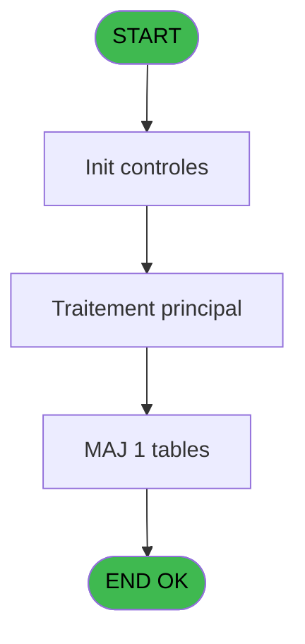

# PBG IDE 199 - RaZ 155 TempoUserList

> **Analyse**: Phases 1-4 2026-02-03 10:08 -> 10:09 (17s) | Assemblage 10:09
> **Pipeline**: V7.2 Enrichi
> **Structure**: 4 onglets (Resume | Ecrans | Donnees | Connexions)

<!-- TAB:Resume -->

## 1. FICHE D'IDENTITE

| Attribut | Valeur |
|----------|--------|
| Projet | PBG |
| IDE Position | 199 |
| Nom Programme | RaZ 155 TempoUserList |
| Fichier source | `Prg_199.xml` |
| Domaine metier | General |
| Taches | 1 (1 ecrans visibles) |
| Tables modifiees | 1 |
| Programmes appeles | 0 |

## 2. DESCRIPTION FONCTIONNELLE

**RaZ 155 TempoUserList** assure la gestion complete de ce processus, accessible depuis [Recherche Logement (IDE 119)](PBG-IDE-119.md).

Le flux de traitement s'organise en **1 blocs fonctionnels** :

- **Initialisation** (1 tache) : reinitialisation d'etats et de variables de travail

**Donnees modifiees** : 1 tables en ecriture (tempo_date_heure).

**Logique metier** : 2 regles identifiees couvrant valeurs par defaut.

## 3. BLOCS FONCTIONNELS

### 3.1 Initialisation (1 tache)

Reinitialisation d'etats et variables de travail.

---

#### 199 - RaZ TempoUserList [[ECRAN]](#ecran-t1)

**Role** : Reinitialisation : RaZ TempoUserList.
**Ecran** : 429 x 59 DLU (MDI) | [Voir mockup](#ecran-t1)

## 5. REGLES METIER

2 regles identifiees:

### Autres (2 regles)

#### [RM-001] Valeur par defaut si >Categorie [A] est vide

| Element | Detail |
|---------|--------|
| **Condition** | `>Categorie [A]=''` |
| **Si vrai** | 'Z' |
| **Si faux** | >Categorie [A]) |
| **Variables** | A (>Categorie) |
| **Expression source** | Expression 3 : `IF (>Categorie [A]='','Z',>Categorie [A])` |
| **Exemple** | Si >Categorie [A]='' → 'Z'. Sinon → >Categorie [A]) |

#### [RM-002] Valeur par defaut si >NomTable [B] est vide

| Element | Detail |
|---------|--------|
| **Condition** | `>NomTable [B]=''` |
| **Si vrai** | 'ZZZZZ' |
| **Si faux** | >NomTable [B]) |
| **Variables** | B (>NomTable) |
| **Expression source** | Expression 5 : `IF (>NomTable [B]='','ZZZZZ',>NomTable [B])` |
| **Exemple** | Si >NomTable [B]='' → 'ZZZZZ'. Sinon → >NomTable [B]) |

## 6. CONTEXTE

- **Appele par**: [Recherche Logement (IDE 119)](PBG-IDE-119.md)
- **Appelle**: 0 programmes | **Tables**: 1 (W:1 R:0 L:0) | **Taches**: 1 | **Expressions**: 5

<!-- TAB:Ecrans -->

## 8. ECRANS

### 8.1 Forms visibles (1 / 1)

| # | Position | Tache | Nom | Type | Largeur | Hauteur | Bloc |
|---|----------|-------|-----|------|---------|---------|------|
| 1 | 199 | 199 | RaZ TempoUserList | MDI | 429 | 59 | Initialisation |

### 8.2 Mockups Ecrans

---

#### 199 - RaZ TempoUserList
**Tache** : [199](#t1) | **Type** : MDI | **Dimensions** : 429 x 59 DLU
**Bloc** : Initialisation | **Titre IDE** : RaZ TempoUserList

<!-- FORM-DATA:
{
    "width":  429,
    "vFactor":  8,
    "type":  "MDI",
    "hFactor":  8,
    "controls":  [
                     {
                         "x":  0,
                         "type":  "label",
                         "var":  "",
                         "y":  0,
                         "w":  423,
                         "fmt":  "",
                         "name":  "",
                         "h":  29,
                         "color":  "",
                         "text":  "",
                         "parent":  null
                     },
                     {
                         "x":  120,
                         "type":  "label",
                         "var":  "",
                         "y":  10,
                         "w":  221,
                         "fmt":  "",
                         "name":  "",
                         "h":  8,
                         "color":  "7",
                         "text":  "Traitement en cours ...",
                         "parent":  null
                     },
                     {
                         "x":  0,
                         "type":  "label",
                         "var":  "",
                         "y":  29,
                         "w":  423,
                         "fmt":  "",
                         "name":  "",
                         "h":  27,
                         "color":  "",
                         "text":  "",
                         "parent":  null
                     },
                     {
                         "x":  72,
                         "type":  "label",
                         "var":  "",
                         "y":  38,
                         "w":  267,
                         "fmt":  "",
                         "name":  "",
                         "h":  8,
                         "color":  "",
                         "text":  "Preparation table temporaire",
                         "parent":  null
                     },
                     {
                         "x":  4,
                         "type":  "image",
                         "var":  "",
                         "y":  2,
                         "w":  72,
                         "fmt":  "",
                         "name":  "",
                         "h":  25,
                         "color":  "",
                         "text":  "",
                         "parent":  null
                     }
                 ],
    "taskId":  "199",
    "height":  59
}
-->

## 9. NAVIGATION

Ecran unique: **RaZ TempoUserList**

### 9.3 Structure hierarchique (1 tache)

| Position | Tache | Type | Dimensions | Bloc |
|----------|-------|------|------------|------|
| **199.1** | [**RaZ TempoUserList** (199)](#t1) [mockup](#ecran-t1) | MDI | 429x59 | Initialisation |

### 9.4 Algorigramme

> **Legende**: Vert = START/END OK | Rouge = END KO | Bleu = Decisions
> *Algorigramme auto-genere. Utiliser `/algorigramme` pour une synthese metier detaillee.*

<!-- TAB:Donnees -->

## 10. TABLES

### Tables utilisees (1)

| ID | Nom | Description | Type | R | W | L | Usages |
|----|-----|-------------|------|---|---|---|--------|
| 654 | tempo_date_heure | Table temporaire ecran | DB |   | **W** |   | 1 |

### Colonnes par table (1 / 1 tables avec colonnes identifiees)

Table 654 - tempo_date_heure (**W**) - 1 usages

| Lettre | Variable | Acces | Type |
|--------|----------|-------|------|
| A | >Categorie | W | Alpha |
| B | >NomTable | W | Alpha |

## 11. VARIABLES

### 11.1 Autres (2)

Variables diverses.

| Lettre | Nom | Type | Usage dans |
|--------|-----|------|-----------|
| A | >Categorie | Alpha | 2x refs |
| B | >NomTable | Alpha | 2x refs |

## 12. EXPRESSIONS

**5 / 5 expressions decodees (100%)**

### 12.1 Repartition par type

| Type | Expressions | Regles |
|------|-------------|--------|
| CONDITION | 4 | 2 |
| REFERENCE_VG | 1 | 0 |

### 12.2 Expressions cles par type

#### CONDITION (4 expressions)

| Type | IDE | Expression | Regle |
|------|-----|------------|-------|
| CONDITION | 5 | `IF (>NomTable [B]='','ZZZZZ',>NomTable [B])` | [RM-002](#rm-RM-002) |
| CONDITION | 3 | `IF (>Categorie [A]='','Z',>Categorie [A])` | [RM-001](#rm-RM-001) |
| CONDITION | 4 | `>NomTable [B]` | - |
| CONDITION | 2 | `>Categorie [A]` | - |

#### REFERENCE_VG (1 expressions)

| Type | IDE | Expression | Regle |
|------|-----|------------|-------|
| REFERENCE_VG | 1 | `VG20` | - |

<!-- TAB:Connexions -->

## 13. GRAPHE D'APPELS

### 13.1 Chaine depuis Main (Callers)

Main -> ... -> [Recherche Logement (IDE 119)](PBG-IDE-119.md) -> **RaZ 155 TempoUserList (IDE 199)**

### 13.2 Callers

| IDE | Nom Programme | Nb Appels |
|-----|---------------|-----------|
| [119](PBG-IDE-119.md) | Recherche Logement | 16 |

### 13.3 Callees (programmes appeles)

### 13.4 Detail Callees avec contexte

| IDE | Nom Programme | Appels | Contexte |
|-----|---------------|--------|----------|
| - | (aucun) | - | - |

## 14. RECOMMANDATIONS MIGRATION

### 14.1 Profil du programme

| Metrique | Valeur | Impact migration |
|----------|--------|-----------------|
| Lignes de logique | 7 | Programme compact |
| Expressions | 5 | Peu de logique |
| Tables WRITE | 1 | Impact faible |
| Sous-programmes | 0 | Peu de dependances |
| Ecrans visibles | 1 | Ecran unique ou traitement batch |
| Code desactive | 0% (0 / 7) | Code sain |
| Regles metier | 2 | Quelques regles a preserver |

### 14.2 Plan de migration par bloc

#### Initialisation (1 tache: 1 ecran, 0 traitement)

- **Strategie** : Constructeur/methode `InitAsync()` dans l'orchestrateur.

### 14.3 Dependances critiques

| Dependance | Type | Appels | Impact |
|------------|------|--------|--------|
| tempo_date_heure | Table WRITE (Database) | 1x | Schema + repository |

---
*Spec DETAILED generee par Pipeline V7.2 - 2026-02-03 10:09*
