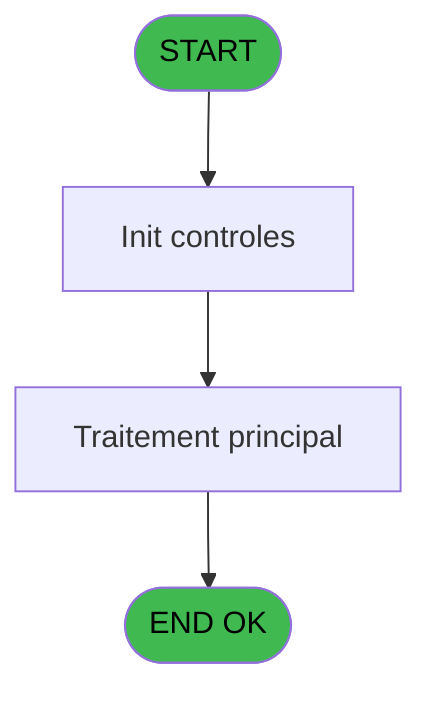

# PBG IDE 205 - LZM -> Tempouserlist

> **Analyse**: Phases 1-4 2026-02-03 10:11 -> 10:11 (18s) | Assemblage 10:11
> **Pipeline**: V7.2 Enrichi
> **Structure**: 4 onglets (Resume | Ecrans | Donnees | Connexions)

<!-- TAB:Resume -->

## 1. FICHE D'IDENTITE

| Attribut | Valeur |
|----------|--------|
| Projet | PBG |
| IDE Position | 205 |
| Nom Programme | LZM -> Tempouserlist |
| Fichier source | `Prg_205.xml` |
| Domaine metier | General |
| Taches | 1 (0 ecrans visibles) |
| Tables modifiees | 0 |
| Programmes appeles | 0 |

## 2. DESCRIPTION FONCTIONNELLE

**LZM -> Tempouserlist** assure la gestion complete de ce processus, accessible depuis [Recherche Logement (IDE 119)](PBG-IDE-119.md).

Le flux de traitement s'organise en **1 blocs fonctionnels** :

- **Traitement** (1 tache) : traitements metier divers

**Logique metier** : 1 regles identifiees couvrant conditions metier.

## 3. BLOCS FONCTIONNELS

### 3.1 Traitement (1 tache)

Traitements internes.

---

#### 205 - Veuillez patienter ... [[ECRAN]](#ecran-t1)

**Role** : Traitement : Veuillez patienter ....
**Ecran** : 427 x 59 DLU (MDI) | [Voir mockup](#ecran-t1)

## 5. REGLES METIER

1 regles identifiees:

### Autres (1 regles)

#### [RM-001] Si [L]>=>ValMinNbLog [E] alors VG20 sinon '')

| Element | Detail |
|---------|--------|
| **Condition** | `[L]>=>ValMinNbLog [E]` |
| **Si vrai** | VG20 |
| **Si faux** | '') |
| **Variables** | E (>ValMinNbLog) |
| **Expression source** | Expression 5 : `IF ([L]>=>ValMinNbLog [E],VG20,'')` |
| **Exemple** | Si [L]>=>ValMinNbLog [E] → VG20. Sinon → '') |

## 6. CONTEXTE

- **Appele par**: [Recherche Logement (IDE 119)](PBG-IDE-119.md)
- **Appelle**: 0 programmes | **Tables**: 2 (W:0 R:1 L:1) | **Taches**: 1 | **Expressions**: 11

<!-- TAB:Ecrans -->

## 8. ECRANS

*(Programme sans ecran visible)*

## 9. NAVIGATION

### 9.3 Structure hierarchique (1 tache)

| Position | Tache | Type | Dimensions | Bloc |
|----------|-------|------|------------|------|
| **205.1** | [**Veuillez patienter ...** (205)](#t1) [mockup](#ecran-t1) | MDI | 427x59 | Traitement |

### 9.4 Algorigramme

> **Legende**: Vert = START/END OK | Rouge = END KO | Bleu = Decisions
> *Algorigramme auto-genere. Utiliser `/algorigramme` pour une synthese metier detaillee.*

<!-- TAB:Donnees -->

## 10. TABLES

### Tables utilisees (2)

| ID | Nom | Description | Type | R | W | L | Usages |
|----|-----|-------------|------|---|---|---|--------|
| 107 | logement_zone_menage |  | DB | R |   |   | 1 |
| 654 | tempo_date_heure | Table temporaire ecran | DB |   |   | L | 1 |

### Colonnes par table (1 / 1 tables avec colonnes identifiees)

Table 107 - logement_zone_menage (R) - 1 usages

| Lettre | Variable | Acces | Type |
|--------|----------|-------|------|
| A | >Categorie | R | Alpha |
| B | >NomTable | R | Alpha |
| C | >CodeMenage | R | Alpha |
| D | >CodeTri | R | Alpha |
| E | >ValMinNbLog | R | Numeric |
| F | >InitMarqueur | R | Logical |

## 11. VARIABLES

### 11.1 Autres (6)

Variables diverses.

| Lettre | Nom | Type | Usage dans |
|--------|-----|------|-----------|
| A | >Categorie | Alpha | 1x refs |
| B | >NomTable | Alpha | 1x refs |
| C | >CodeMenage | Alpha | 1x refs |
| D | >CodeTri | Alpha | 1x refs |
| E | >ValMinNbLog | Numeric | 5x refs |
| F | >InitMarqueur | Logical | 1x refs |

## 12. EXPRESSIONS

**11 / 11 expressions decodees (100%)**

### 12.1 Repartition par type

| Type | Expressions | Regles |
|------|-------------|--------|
| CONDITION | 8 | 5 |
| OTHER | 3 | 0 |

### 12.2 Expressions cles par type

#### CONDITION (8 expressions)

| Type | IDE | Expression | Regle |
|------|-----|------------|-------|
| CONDITION | 5 | `IF ([L]>=>ValMinNbLog [E],VG20,'')` | [RM-001](#rm-RM-001) |
| CONDITION | 3 | `>CodeMenage [C]` | - |
| CONDITION | 4 | `>CodeTri [D]` | - |
| CONDITION | 10 | `>InitMarqueur [F]` | - |
| CONDITION | 9 | `IF ([L]>=>ValMinNbLog [E],[I],'')` | - |
| ... | | *+3 autres* | |

#### OTHER (3 expressions)

| Type | IDE | Expression | Regle |
|------|-----|------------|-------|
| OTHER | 11 | `[K]` | - |
| OTHER | 2 | `GetParam ('LANGUE')` | - |
| OTHER | 1 | `GetParam ('SOCIETE')` | - |

<!-- TAB:Connexions -->

## 13. GRAPHE D'APPELS

### 13.1 Chaine depuis Main (Callers)

Main -> ... -> [Recherche Logement (IDE 119)](PBG-IDE-119.md) -> **LZM -> Tempouserlist (IDE 205)**

### 13.2 Callers

| IDE | Nom Programme | Nb Appels |
|-----|---------------|-----------|
| [119](PBG-IDE-119.md) | Recherche Logement | 2 |

### 13.3 Callees (programmes appeles)

### 13.4 Detail Callees avec contexte

| IDE | Nom Programme | Appels | Contexte |
|-----|---------------|--------|----------|
| - | (aucun) | - | - |

## 14. RECOMMANDATIONS MIGRATION

### 14.1 Profil du programme

| Metrique | Valeur | Impact migration |
|----------|--------|-----------------|
| Lignes de logique | 26 | Programme compact |
| Expressions | 11 | Peu de logique |
| Tables WRITE | 0 | Impact faible |
| Sous-programmes | 0 | Peu de dependances |
| Ecrans visibles | 0 | Ecran unique ou traitement batch |
| Code desactive | 0% (0 / 26) | Code sain |
| Regles metier | 1 | Quelques regles a preserver |

### 14.2 Plan de migration par bloc

#### Traitement (1 tache: 1 ecran, 0 traitement)

- **Strategie** : 1 composant(s) UI (Razor/React) avec formulaires et validation.
- Decomposer les taches en services unitaires testables.

### 14.3 Dependances critiques

| Dependance | Type | Appels | Impact |
|------------|------|--------|--------|

---
*Spec DETAILED generee par Pipeline V7.2 - 2026-02-03 10:11*
