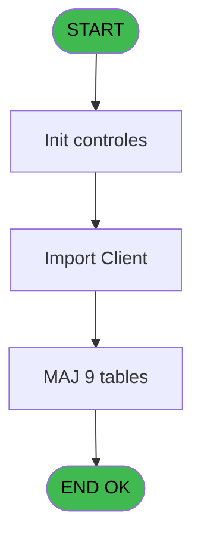
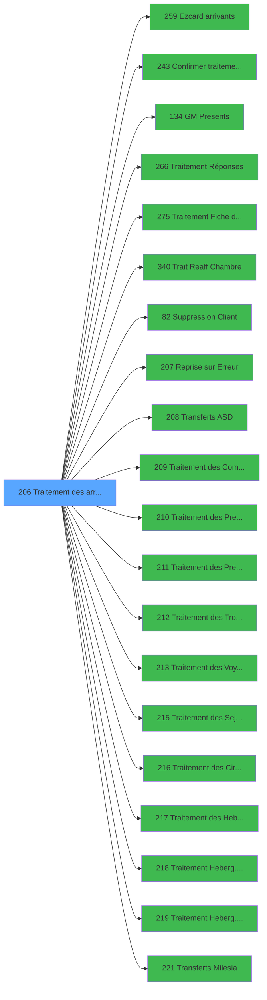

# PBG IDE 206 - Traitement des arrivants

> **Analyse**: Phases 1-4 2026-02-03 10:11 -> 10:11 (17s) | Assemblage 10:11
> **Pipeline**: V7.2 Enrichi
> **Structure**: 4 onglets (Resume | Ecrans | Donnees | Connexions)

<!-- TAB:Resume -->

## 1. FICHE D'IDENTITE

| Attribut | Valeur |
|----------|--------|
| Projet | PBG |
| IDE Position | 206 |
| Nom Programme | Traitement des arrivants |
| Fichier source | `Prg_206.xml` |
| Domaine metier | General |
| Taches | 68 (25 ecrans visibles) |
| Tables modifiees | 9 |
| Programmes appeles | 20 |
| :warning: Statut | **ORPHELIN_POTENTIEL** |

## 2. DESCRIPTION FONCTIONNELLE

**Traitement des arrivants** assure la gestion complete de ce processus.

Le flux de traitement s'organise en **8 blocs fonctionnels** :

- **Traitement** (44 taches) : traitements metier divers
- **Calcul** (9 taches) : calculs de montants, stocks ou compteurs
- **Transfert** (5 taches) : transferts de donnees entre modules ou deversements
- **Creation** (3 taches) : insertion d'enregistrements en base (mouvements, prestations)
- **Consultation** (3 taches) : ecrans de recherche, selection et consultation
- **Validation** (2 taches) : controles et verifications de coherence
- **Initialisation** (1 tache) : reinitialisation d'etats et de variables de travail
- **Saisie** (1 tache) : ecrans de saisie utilisateur (formulaires, champs, donnees)

**Donnees modifiees** : 9 tables en ecriture (compte_sans_fil_zero, historik_station, fichier_statistiques, import_commentai_imo, import_avertiss__mod, pointage_articles_caution, tempo_ecran_police, tempo_ecr_previsions, Table_1078).

Detail : phases du traitement

#### Phase 1 : Traitement (44 taches)

- **206** - Import Client **[[ECRAN]](#ecran-t1)**
- **206.1** - Import Client **[[ECRAN]](#ecran-t2)**
- **206.1.1** - Nom de la Societe
- **206.1.2** - Attribution Lieu de Sejour **[[ECRAN]](#ecran-t4)**
- **206.1.3** - Test Reprise Erreur
- **206.1.5** - Execution Automatique **[[ECRAN]](#ecran-t10)**
- **206.1.7** - Traitement Annulation(2) **[[ECRAN]](#ecran-t12)**
- **206.1.11** - Traitement Annulation(2) **[[ECRAN]](#ecran-t16)**
- **206.1.13** - Traitement Adherents(5) **[[ECRAN]](#ecran-t18)**
- **206.1.14** - Traitement Hebergements(6) **[[ECRAN]](#ecran-t19)**
- **206.1.15** - Traitement Circuits(7) **[[ECRAN]](#ecran-t20)**
- **206.1.16** - Traitement Sejours(8) **[[ECRAN]](#ecran-t21)**
- **206.1.17** - Traitement Voyages(9) **[[ECRAN]](#ecran-t22)**
- **206.1.18** - Traitement Troncons(10) **[[ECRAN]](#ecran-t23)**
- **206.1.19** - Traitement Prestation(11) **[[ECRAN]](#ecran-t24)**
- **206.1.20** - Traitement Commentaire(12) **[[ECRAN]](#ecran-t25)**
- **206.1.23** - Fin de Traitement(15) **[[ECRAN]](#ecran-t28)**
- **206.1.23.1** - Ligne de Commande
- **206.1.25** - Message de Fin
- **206.1.25.2** - Message Automatique
- **206.1.26** - Connexion
- **206.1.27** - Deconnexion
- **206.1.28** - Commande arrive modem
- **206.1.29** - Veuillez patienter ... **[[ECRAN]](#ecran-t37)**
- **206.1.30** - Veuillez patienter ... **[[ECRAN]](#ecran-t38)**
- **206.1.32** - MAJ cartes
- **206.1.33** - Presents deb
- **206.1.34** - Presents fin
- **206.1.35** - Genère CR
- **206.1.36** - For test 2
- **206.2** - Paramètres PAR
- **206.1.37** - Mise a jour date sejour
- **206.1.39.1** - Traitement import **[[ECRAN]](#ecran-t59)**
- **206.1.39.1.1** - Heure Diff
- **206.1.39.1.2** - Recuperation Honey Moon
- **206.1.39.1.4** - Purge ASD
- **206.1.39.1.5** - Age Bebe/Enfant
- **206.1.39** - Traitement des ressources(5) **[[ECRAN]](#ecran-t89)**
- **206.3** - Suppression gmc orphelin
- **206.4** - Suppression heb orphelin
- **206.1.40** - Sauvegarde Prestations
- **206.1.41.1** - Generation liste
- **206.1.41.2** - Traitement liste
- **206.1.42** - Traitement Annulation(2) **[[ECRAN]](#ecran-t115)**

Delegue a : [Ezcard arrivants (IDE 259)](PBG-IDE-259.md), [Confirmer traitement arrivants (IDE 243)](PBG-IDE-243.md), [GM Presents (IDE 134)](PBG-IDE-134.md), [Traitement Réponses (IDE 266)](PBG-IDE-266.md), [Traitement Fiche de police (IDE 275)](PBG-IDE-275.md), [Trait Reaff Chambre (IDE 340)](PBG-IDE-340.md), [   Suppression Client (IDE 82)](PBG-IDE-82.md), [Reprise sur Erreur (IDE 207)](PBG-IDE-207.md), [Traitement des Commentaires (IDE 209)](PBG-IDE-209.md), [Traitement des Prestations TAI (IDE 210)](PBG-IDE-210.md), [Traitement des Prestations (IDE 211)](PBG-IDE-211.md), [Traitement des Troncons (IDE 212)](PBG-IDE-212.md), [Traitement des Voyages (IDE 213)](PBG-IDE-213.md), [Traitement des Sejours (IDE 215)](PBG-IDE-215.md), [Traitement des Circuits (IDE 216)](PBG-IDE-216.md), [Traitement des Hebergements (IDE 217)](PBG-IDE-217.md), [Traitement Heberg. /pms-682 (IDE 218)](PBG-IDE-218.md), [Traitement Heberg. /pms-912 (IDE 219)](PBG-IDE-219.md)

#### Phase 2 : Consultation (3 taches)

- **206.1.2.1** - Recherche Lieu de Sejour
- **206.1.2.2** - Selection Lieu Sejour **[[ECRAN]](#ecran-t6)**
- **206.1.2.3** - Recherche Nom Repertoire Siège **[[ECRAN]](#ecran-t7)**

#### Phase 3 : Validation (2 taches)

- **206.1.4** - Verification et Analyse(1) **[[ECRAN]](#ecran-t9)**
- **206.1.39.1.3** - Verification Transfert

#### Phase 4 : Creation (3 taches)

- **206.1.6** - Creation Historique
- **206.1.12** - Creation Statistiques
- **206.1.24** - Creation Historique

#### Phase 5 : Transfert (5 taches)

- **206.1.8** - Transfert Identite(3) **[[ECRAN]](#ecran-t13)**
- **206.1.9** - Transfert Ressources(4) **[[ECRAN]](#ecran-t14)**
- **206.1.10** - Transfert Identite(3) **[[ECRAN]](#ecran-t15)**
- **206.1.21** - Transferts Caisse(13) **[[ECRAN]](#ecran-t26)**
- **206.1.22** - Transferts Planning(14) **[[ECRAN]](#ecran-t27)**

Delegue a : [Transferts ASD (IDE 208)](PBG-IDE-208.md), [Transferts Milesia (IDE 221)](PBG-IDE-221.md)

#### Phase 6 : Saisie (1 tache)

- **206.1.25.1** - Saisie Message **[[ECRAN]](#ecran-t32)**

#### Phase 7 : Calcul (9 taches)

- **206.1.31** - Stockage carte
- **206.1.35.1** - CompteSupFalse
- **206.1.35.2** - CompteSupTrue
- **206.1.35.3** - CompteCarteANN
- **206.1.35.4** - CompteCarteMAJ
- **206.1.38** - compte millesia **[[ECRAN]](#ecran-t88)**
- **206.1.35.6** - CompteCarteMAJ
- **206.1.41** - Compte sans Fil Zero **[[ECRAN]](#ecran-t109)**
- **206.1.13.1** - Comptage comptes à attribuer

#### Phase 8 : Initialisation (1 tache)

- **206.1.35.5** - Init

#### Tables impactees

| Table | Operations | Role metier |
|-------|-----------|-------------|
| pointage_articles_caution | R/**W**/L (3 usages) | Articles et stock |
| fichier_statistiques | R/**W** (3 usages) |  |
| compte_sans_fil_zero | **W** (2 usages) | Comptes GM (generaux) |
| import_avertiss__mod | **W** (2 usages) |  |
| historik_station | **W** (2 usages) | Historique / journal |
| tempo_ecran_police | **W** (2 usages) | Table temporaire ecran |
| Table_1078 | **W** (1 usages) |  |
| import_commentai_imo | **W** (1 usages) |  |
| tempo_ecr_previsions | **W** (1 usages) | Table temporaire ecran |

## 3. BLOCS FONCTIONNELS

### 3.1 Traitement (44 taches)

Traitements internes.

---

#### 206 - Import Client [[ECRAN]](#ecran-t1)

**Role** : Tache d'orchestration : point d'entree du programme (44 sous-taches). Coordonne l'enchainement des traitements.
**Ecran** : 242 x 34 DLU (MDI) | [Voir mockup](#ecran-t1)

43 sous-taches directes

| Tache | Nom | Bloc |
|-------|-----|------|
| [206.1](#t2) | Import Client **[[ECRAN]](#ecran-t2)** | Traitement |
| [206.1.1](#t3) | Nom de la Societe | Traitement |
| [206.1.2](#t4) | Attribution Lieu de Sejour **[[ECRAN]](#ecran-t4)** | Traitement |
| [206.1.3](#t8) | Test Reprise Erreur | Traitement |
| [206.1.5](#t10) | Execution Automatique **[[ECRAN]](#ecran-t10)** | Traitement |
| [206.1.7](#t12) | Traitement Annulation(2) **[[ECRAN]](#ecran-t12)** | Traitement |
| [206.1.11](#t16) | Traitement Annulation(2) **[[ECRAN]](#ecran-t16)** | Traitement |
| [206.1.13](#t18) | Traitement Adherents(5) **[[ECRAN]](#ecran-t18)** | Traitement |
| [206.1.14](#t19) | Traitement Hebergements(6) **[[ECRAN]](#ecran-t19)** | Traitement |
| [206.1.15](#t20) | Traitement Circuits(7) **[[ECRAN]](#ecran-t20)** | Traitement |
| [206.1.16](#t21) | Traitement Sejours(8) **[[ECRAN]](#ecran-t21)** | Traitement |
| [206.1.17](#t22) | Traitement Voyages(9) **[[ECRAN]](#ecran-t22)** | Traitement |
| [206.1.18](#t23) | Traitement Troncons(10) **[[ECRAN]](#ecran-t23)** | Traitement |
| [206.1.19](#t24) | Traitement Prestation(11) **[[ECRAN]](#ecran-t24)** | Traitement |
| [206.1.20](#t25) | Traitement Commentaire(12) **[[ECRAN]](#ecran-t25)** | Traitement |
| [206.1.23](#t28) | Fin de Traitement(15) **[[ECRAN]](#ecran-t28)** | Traitement |
| [206.1.23.1](#t29) | Ligne de Commande | Traitement |
| [206.1.25](#t31) | Message de Fin | Traitement |
| [206.1.25.2](#t33) | Message Automatique | Traitement |
| [206.1.26](#t34) | Connexion | Traitement |
| [206.1.27](#t35) | Deconnexion | Traitement |
| [206.1.28](#t36) | Commande arrive modem | Traitement |
| [206.1.29](#t37) | Veuillez patienter ... **[[ECRAN]](#ecran-t37)** | Traitement |
| [206.1.30](#t38) | Veuillez patienter ... **[[ECRAN]](#ecran-t38)** | Traitement |
| [206.1.32](#t40) | MAJ cartes | Traitement |
| [206.1.33](#t41) | Presents deb | Traitement |
| [206.1.34](#t42) | Presents fin | Traitement |
| [206.1.35](#t44) | Genère CR | Traitement |
| [206.1.36](#t53) | For test 2 | Traitement |
| [206.2](#t57) | Paramètres PAR | Traitement |
| [206.1.37](#t58) | Mise a jour date sejour | Traitement |
| [206.1.39.1](#t59) | Traitement import **[[ECRAN]](#ecran-t59)** | Traitement |
| [206.1.39.1.1](#t64) | Heure Diff | Traitement |
| [206.1.39.1.2](#t67) | Recuperation Honey Moon | Traitement |
| [206.1.39.1.4](#t79) | Purge ASD | Traitement |
| [206.1.39.1.5](#t82) | Age Bebe/Enfant | Traitement |
| [206.1.39](#t89) | Traitement des ressources(5) **[[ECRAN]](#ecran-t89)** | Traitement |
| [206.3](#t90) | Suppression gmc orphelin | Traitement |
| [206.4](#t91) | Suppression heb orphelin | Traitement |
| [206.1.40](#t97) | Sauvegarde Prestations | Traitement |
| [206.1.41.1](#t110) | Generation liste | Traitement |
| [206.1.41.2](#t111) | Traitement liste | Traitement |
| [206.1.42](#t115) | Traitement Annulation(2) **[[ECRAN]](#ecran-t115)** | Traitement |

**Variables liees** : CN (V.comptage import identité), G (W0-Date Import), CE (W0-Old Import), CG (W0-Qualite Import)

---

#### 206.1 - Import Client [[ECRAN]](#ecran-t2)

**Role** : Traitement : Import Client.
**Ecran** : 1008 x 202 DLU (MDI) | [Voir mockup](#ecran-t2)
**Variables liees** : CN (V.comptage import identité), G (W0-Date Import), CE (W0-Old Import), CG (W0-Qualite Import)

---

#### 206.1.1 - Nom de la Societe

**Role** : Traitement : Nom de la Societe.

---

#### 206.1.2 - Attribution Lieu de Sejour [[ECRAN]](#ecran-t4)

**Role** : Traitement : Attribution Lieu de Sejour.
**Ecran** : 83 x 26 DLU (MDI) | [Voir mockup](#ecran-t4)
**Variables liees** : CD (W0-Old Sejour), CI (W0-Code Village-Lieu Sejour)

---

#### 206.1.3 - Test Reprise Erreur

**Role** : Verification : Test Reprise Erreur.
**Variables liees** : CM (Continue_For_Test)

---

#### 206.1.5 - Execution Automatique [[ECRAN]](#ecran-t10)

**Role** : Traitement : Execution Automatique.
**Ecran** : 538 x 84 DLU (MDI) | [Voir mockup](#ecran-t10)

---

#### 206.1.7 - Traitement Annulation(2) [[ECRAN]](#ecran-t12)

**Role** : Traitement : Traitement Annulation(2).
**Ecran** : 354 x 12 DLU (Modal) | [Voir mockup](#ecran-t12)

---

#### 206.1.11 - Traitement Annulation(2) [[ECRAN]](#ecran-t16)

**Role** : Traitement : Traitement Annulation(2).
**Ecran** : 354 x 12 DLU (Modal) | [Voir mockup](#ecran-t16)

---

#### 206.1.13 - Traitement Adherents(5) [[ECRAN]](#ecran-t18)

**Role** : Traitement : Traitement Adherents(5).
**Ecran** : 353 x 11 DLU (Modal) | [Voir mockup](#ecran-t18)

---

#### 206.1.14 - Traitement Hebergements(6) [[ECRAN]](#ecran-t19)

**Role** : Traitement : Traitement Hebergements(6).
**Ecran** : 347 x 10 DLU (Modal) | [Voir mockup](#ecran-t19)

---

#### 206.1.15 - Traitement Circuits(7) [[ECRAN]](#ecran-t20)

**Role** : Traitement : Traitement Circuits(7).
**Ecran** : 350 x 10 DLU (Modal) | [Voir mockup](#ecran-t20)

---

#### 206.1.16 - Traitement Sejours(8) [[ECRAN]](#ecran-t21)

**Role** : Traitement : Traitement Sejours(8).
**Ecran** : 350 x 11 DLU (Modal) | [Voir mockup](#ecran-t21)

---

#### 206.1.17 - Traitement Voyages(9) [[ECRAN]](#ecran-t22)

**Role** : Traitement : Traitement Voyages(9).
**Ecran** : 351 x 11 DLU (Modal) | [Voir mockup](#ecran-t22)

---

#### 206.1.18 - Traitement Troncons(10) [[ECRAN]](#ecran-t23)

**Role** : Traitement : Traitement Troncons(10).
**Ecran** : 350 x 11 DLU (Modal) | [Voir mockup](#ecran-t23)

---

#### 206.1.19 - Traitement Prestation(11) [[ECRAN]](#ecran-t24)

**Role** : Traitement : Traitement Prestation(11).
**Ecran** : 350 x 11 DLU (Modal) | [Voir mockup](#ecran-t24)

---

#### 206.1.20 - Traitement Commentaire(12) [[ECRAN]](#ecran-t25)

**Role** : Traitement : Traitement Commentaire(12).
**Ecran** : 353 x 10 DLU (Modal) | [Voir mockup](#ecran-t25)

---

#### 206.1.23 - Fin de Traitement(15) [[ECRAN]](#ecran-t28)

**Role** : Traitement : Fin de Traitement(15).
**Ecran** : 350 x 11 DLU (Modal) | [Voir mockup](#ecran-t28)

---

#### 206.1.23.1 - Ligne de Commande

**Role** : Traitement : Ligne de Commande.

---

#### 206.1.25 - Message de Fin

**Role** : Traitement : Message de Fin.
**Variables liees** : B (Message confirmation 1), C (Message confirmation 2), D (Message confirmation 3)

---

#### 206.1.25.2 - Message Automatique

**Role** : Traitement : Message Automatique.
**Variables liees** : B (Message confirmation 1), C (Message confirmation 2), D (Message confirmation 3)

---

#### 206.1.26 - Connexion

**Role** : Traitement : Connexion.

---

#### 206.1.27 - Deconnexion

**Role** : Traitement : Deconnexion.

---

#### 206.1.28 - Commande arrive modem

**Role** : Traitement : Commande arrive modem.

---

#### 206.1.29 - Veuillez patienter ... [[ECRAN]](#ecran-t37)

**Role** : Traitement : Veuillez patienter ....
**Ecran** : 422 x 56 DLU (MDI) | [Voir mockup](#ecran-t37)

---

#### 206.1.30 - Veuillez patienter ... [[ECRAN]](#ecran-t38)

**Role** : Traitement : Veuillez patienter ....
**Ecran** : 422 x 56 DLU (MDI) | [Voir mockup](#ecran-t38)

---

#### 206.1.32 - MAJ cartes

**Role** : Traitement : MAJ cartes.

---

#### 206.1.33 - Presents deb

**Role** : Traitement : Presents deb.

---

#### 206.1.34 - Presents fin

**Role** : Traitement : Presents fin.

---

#### 206.1.35 - Genère CR

**Role** : Traitement : Genère CR.

---

#### 206.1.36 - For test 2

**Role** : Verification : For test 2.
**Variables liees** : CM (Continue_For_Test)

---

#### 206.2 - Paramètres PAR

**Role** : Traitement : Paramètres PAR.

---

#### 206.1.37 - Mise a jour date sejour

**Role** : Traitement : Mise a jour date sejour.
**Variables liees** : G (W0-Date Import), V (W0-Date IDE), W (W0-Date FRA), CD (W0-Old Sejour), CI (W0-Code Village-Lieu Sejour)

---

#### 206.1.39.1 - Traitement import [[ECRAN]](#ecran-t59)

**Role** : Traitement : Traitement import.
**Ecran** : 232 x 76 DLU | [Voir mockup](#ecran-t59)
**Variables liees** : CN (V.comptage import identité), G (W0-Date Import), CE (W0-Old Import), CG (W0-Qualite Import)

---

#### 206.1.39.1.1 - Heure Diff

**Role** : Traitement : Heure Diff.
**Variables liees** : CH (W0- Heure Debut)

---

#### 206.1.39.1.2 - Recuperation Honey Moon

**Role** : Consultation/chargement : Recuperation Honey Moon.

---

#### 206.1.39.1.4 - Purge ASD

**Role** : Traitement : Purge ASD.

---

#### 206.1.39.1.5 - Age Bebe/Enfant

**Role** : Traitement : Age Bebe/Enfant.

---

#### 206.1.39 - Traitement des ressources(5) [[ECRAN]](#ecran-t89)

**Role** : Traitement : Traitement des ressources(5).
**Ecran** : 175 x 11 DLU (Modal) | [Voir mockup](#ecran-t89)

---

#### 206.3 - Suppression gmc orphelin

**Role** : Traitement : Suppression gmc orphelin.

---

#### 206.4 - Suppression heb orphelin

**Role** : Traitement : Suppression heb orphelin.

---

#### 206.1.40 - Sauvegarde Prestations

**Role** : Traitement : Sauvegarde Prestations.
**Variables liees** : M (W0-Nb Prestations)

---

#### 206.1.41.1 - Generation liste

**Role** : Traitement : Generation liste.

---

#### 206.1.41.2 - Traitement liste

**Role** : Traitement : Traitement liste.

---

#### 206.1.42 - Traitement Annulation(2) [[ECRAN]](#ecran-t115)

**Role** : Traitement : Traitement Annulation(2).
**Ecran** : 354 x 12 DLU (Modal) | [Voir mockup](#ecran-t115)

### 3.2 Consultation (3 taches)

Ecrans de recherche et consultation.

---

#### 206.1.2.1 - Recherche Lieu de Sejour

**Role** : Traitement : Recherche Lieu de Sejour.
**Variables liees** : CD (W0-Old Sejour), CI (W0-Code Village-Lieu Sejour)

---

#### 206.1.2.2 - Selection Lieu Sejour [[ECRAN]](#ecran-t6)

**Role** : Selection par l'operateur : Selection Lieu Sejour.
**Ecran** : 413 x 164 DLU (MDI) | [Voir mockup](#ecran-t6)
**Variables liees** : CD (W0-Old Sejour), CI (W0-Code Village-Lieu Sejour)

---

#### 206.1.2.3 - Recherche Nom Repertoire Siège [[ECRAN]](#ecran-t7)

**Role** : Traitement : Recherche Nom Repertoire Siège.
**Ecran** : 375 x 0 DLU (MDI) | [Voir mockup](#ecran-t7)
**Variables liees** : CJ (W0-Nom Repertoire Siège)

### 3.3 Validation (2 taches)

Controles de coherence : 2 taches verifient les donnees et conditions.

---

#### 206.1.4 - Verification et Analyse(1) [[ECRAN]](#ecran-t9)

**Role** : Verification : Verification et Analyse(1).
**Ecran** : 351 x 10 DLU (Modal) | [Voir mockup](#ecran-t9)

---

#### 206.1.39.1.3 - Verification Transfert

**Role** : Verification : Verification Transfert.

### 3.4 Creation (3 taches)

Insertion de nouveaux enregistrements en base.

---

#### 206.1.6 - Creation Historique

**Role** : Consultation/chargement : Creation Historique.

---

#### 206.1.12 - Creation Statistiques

**Role** : Creation d'enregistrement : Creation Statistiques.

---

#### 206.1.24 - Creation Historique

**Role** : Consultation/chargement : Creation Historique.

### 3.5 Transfert (5 taches)

Transfert de donnees entre modules.

---

#### 206.1.8 - Transfert Identite(3) [[ECRAN]](#ecran-t13)

**Role** : Transfert de donnees : Transfert Identite(3).
**Ecran** : 354 x 10 DLU (Modal) | [Voir mockup](#ecran-t13)
**Delegue a** : [Transferts ASD (IDE 208)](PBG-IDE-208.md), [Transferts Milesia (IDE 221)](PBG-IDE-221.md)

---

#### 206.1.9 - Transfert Ressources(4) [[ECRAN]](#ecran-t14)

**Role** : Transfert de donnees : Transfert Ressources(4).
**Ecran** : 357 x 11 DLU (Modal) | [Voir mockup](#ecran-t14)
**Delegue a** : [Transferts ASD (IDE 208)](PBG-IDE-208.md), [Transferts Milesia (IDE 221)](PBG-IDE-221.md)

---

#### 206.1.10 - Transfert Identite(3) [[ECRAN]](#ecran-t15)

**Role** : Transfert de donnees : Transfert Identite(3).
**Ecran** : 354 x 10 DLU (Modal) | [Voir mockup](#ecran-t15)
**Delegue a** : [Transferts ASD (IDE 208)](PBG-IDE-208.md), [Transferts Milesia (IDE 221)](PBG-IDE-221.md)

---

#### 206.1.21 - Transferts Caisse(13) [[ECRAN]](#ecran-t26)

**Role** : Transfert de donnees : Transferts Caisse(13).
**Ecran** : 350 x 10 DLU (Modal) | [Voir mockup](#ecran-t26)
**Delegue a** : [Transferts ASD (IDE 208)](PBG-IDE-208.md), [Transferts Milesia (IDE 221)](PBG-IDE-221.md)

---

#### 206.1.22 - Transferts Planning(14) [[ECRAN]](#ecran-t27)

**Role** : Transfert de donnees : Transferts Planning(14).
**Ecran** : 352 x 10 DLU (Modal) | [Voir mockup](#ecran-t27)
**Delegue a** : [Transferts ASD (IDE 208)](PBG-IDE-208.md), [Transferts Milesia (IDE 221)](PBG-IDE-221.md)

### 3.6 Saisie (1 tache)

L'operateur saisit les donnees de la transaction via 1 ecran (Saisie Message).

---

#### 206.1.25.1 - Saisie Message [[ECRAN]](#ecran-t32)

**Role** : Saisie des donnees : Saisie Message.
**Ecran** : 426 x 85 DLU (MDI) | [Voir mockup](#ecran-t32)
**Variables liees** : B (Message confirmation 1), C (Message confirmation 2), D (Message confirmation 3)

### 3.7 Calcul (9 taches)

Calculs metier : montants, stocks, compteurs.

---

#### 206.1.31 - Stockage carte

**Role** : Calcul : Stockage carte.

---

#### 206.1.35.1 - CompteSupFalse

**Role** : Traitement : CompteSupFalse.

---

#### 206.1.35.2 - CompteSupTrue

**Role** : Traitement : CompteSupTrue.

---

#### 206.1.35.3 - CompteCarteANN

**Role** : Traitement : CompteCarteANN.

---

#### 206.1.35.4 - CompteCarteMAJ

**Role** : Traitement : CompteCarteMAJ.

---

#### 206.1.38 - compte millesia [[ECRAN]](#ecran-t88)

**Role** : Traitement : compte millesia.
**Ecran** : 103 x 195 DLU | [Voir mockup](#ecran-t88)

---

#### 206.1.35.6 - CompteCarteMAJ

**Role** : Traitement : CompteCarteMAJ.

---

#### 206.1.41 - Compte sans Fil Zero [[ECRAN]](#ecran-t109)

**Role** : Traitement : Compte sans Fil Zero.
**Ecran** : 430 x 70 DLU (MDI) | [Voir mockup](#ecran-t109)

---

#### 206.1.13.1 - Comptage comptes à attribuer

**Role** : Traitement : Comptage comptes à attribuer.
**Variables liees** : CN (V.comptage import identité)

### 3.8 Initialisation (1 tache)

Reinitialisation d'etats et variables de travail.

---

#### 206.1.35.5 - Init

**Role** : Reinitialisation : Init.

## 5. REGLES METIER

*(Aucune regle metier identifiee)*

## 6. CONTEXTE

- **Appele par**: (aucun)
- **Appelle**: 20 programmes | **Tables**: 18 (W:9 R:8 L:5) | **Taches**: 68 | **Expressions**: 16

<!-- TAB:Ecrans -->

## 8. ECRANS

### 8.1 Forms visibles (25 / 68)

| # | Position | Tache | Nom | Type | Largeur | Hauteur | Bloc |
|---|----------|-------|-----|------|---------|---------|------|
| 1 | 206.1 | 206.1 | Import Client | MDI | 1008 | 202 | Traitement |
| 2 | 206.1.3.2 | 206.1.2.2 | Selection Lieu Sejour | MDI | 413 | 164 | Consultation |
| 3 | 206.1.5 | 206.1.4 | Verification et Analyse(1) | Modal | 351 | 10 | Validation |
| 4 | 206.1.6 | 206.1.5 | Execution Automatique | MDI | 538 | 84 | Traitement |
| 5 | 206.1.9 | 206.1.7 | Traitement Annulation(2) | Modal | 354 | 12 | Traitement |
| 6 | 206.1.10 | 206.1.8 | Transfert Identite(3) | Modal | 354 | 10 | Transfert |
| 7 | 206.1.11 | 206.1.9 | Transfert Ressources(4) | Modal | 357 | 11 | Transfert |
| 8 | 206.1.12 | 206.1.10 | Transfert Identite(3) | Modal | 354 | 10 | Transfert |
| 9 | 206.1.13 | 206.1.11 | Traitement Annulation(2) | Modal | 354 | 12 | Traitement |
| 10 | 206.1.16 | 206.1.13 | Traitement Adherents(5) | Modal | 353 | 11 | Traitement |
| 11 | 206.1.17 | 206.1.14 | Traitement Hebergements(6) | Modal | 347 | 10 | Traitement |
| 12 | 206.1.18 | 206.1.15 | Traitement Circuits(7) | Modal | 350 | 10 | Traitement |
| 13 | 206.1.19 | 206.1.16 | Traitement Sejours(8) | Modal | 350 | 11 | Traitement |
| 14 | 206.1.20 | 206.1.17 | Traitement Voyages(9) | Modal | 351 | 11 | Traitement |
| 15 | 206.1.21 | 206.1.18 | Traitement Troncons(10) | Modal | 350 | 11 | Traitement |
| 16 | 206.1.22 | 206.1.19 | Traitement Prestation(11) | Modal | 350 | 11 | Traitement |
| 17 | 206.1.23 | 206.1.20 | Traitement Commentaire(12) | Modal | 353 | 10 | Traitement |
| 18 | 206.1.24 | 206.1.21 | Transferts Caisse(13) | Modal | 350 | 10 | Transfert |
| 19 | 206.1.25 | 206.1.22 | Transferts Planning(14) | Modal | 352 | 10 | Transfert |
| 20 | 206.1.26 | 206.1.23 | Fin de Traitement(15) | Modal | 350 | 11 | Traitement |
| 21 | 206.1.28.1 | 206.1.25.1 | Saisie Message | MDI | 426 | 85 | Saisie |
| 22 | 206.1.42.1 | 206.1.39.1 | Traitement import | Type0 | 232 | 76 | Traitement |
| 23 | 206.1.42 | 206.1.39 | Traitement des ressources(5) | Modal | 175 | 11 | Traitement |
| 24 | 206.1.40 | 206.1.41 | Compte sans Fil Zero | MDI | 430 | 70 | Calcul |
| 25 | 206.1.14 | 206.1.42 | Traitement Annulation(2) | Modal | 354 | 12 | Traitement |

### 8.2 Mockups Ecrans

---

#### 206.1 - Import Client
**Tache** : [206.1](#t2) | **Type** : MDI | **Dimensions** : 1008 x 202 DLU
**Bloc** : Traitement | **Titre IDE** : Import Client

<!-- FORM-DATA:
{
    "width":  1008,
    "vFactor":  8,
    "type":  "MDI",
    "hFactor":  8,
    "controls":  [
                     {
                         "x":  0,
                         "type":  "label",
                         "var":  "",
                         "y":  1,
                         "w":  1007,
                         "fmt":  "",
                         "name":  "",
                         "h":  19,
                         "color":  "7",
                         "text":  "",
                         "parent":  null
                     },
                     {
                         "x":  8,
                         "type":  "label",
                         "var":  "",
                         "y":  25,
                         "w":  378,
                         "fmt":  "",
                         "name":  "",
                         "h":  174,
                         "color":  "",
                         "text":  "",
                         "parent":  null
                     },
                     {
                         "x":  412,
                         "type":  "label",
                         "var":  "",
                         "y":  56,
                         "w":  565,
                         "fmt":  "",
                         "name":  "",
                         "h":  102,
                         "color":  "151",
                         "text":  "Renseignement",
                         "parent":  null
                     },
                     {
                         "x":  437,
                         "type":  "label",
                         "var":  "",
                         "y":  67,
                         "w":  75,
                         "fmt":  "",
                         "name":  "",
                         "h":  9,
                         "color":  "",
                         "text":  "Societe",
                         "parent":  8
                     },
                     {
                         "x":  437,
                         "type":  "label",
                         "var":  "",
                         "y":  79,
                         "w":  45,
                         "fmt":  "",
                         "name":  "",
                         "h":  9,
                         "color":  "",
                         "text":  "Date",
                         "parent":  8
                     },
                     {
                         "x":  437,
                         "type":  "label",
                         "var":  "",
                         "y":  91,
                         "w":  54,
                         "fmt":  "",
                         "name":  "",
                         "h":  9,
                         "color":  "",
                         "text":  "Import",
                         "parent":  8
                     },
                     {
                         "x":  437,
                         "type":  "label",
                         "var":  "",
                         "y":  103,
                         "w":  74,
                         "fmt":  "",
                         "name":  "",
                         "h":  9,
                         "color":  "",
                         "text":  "N°Import",
                         "parent":  8
                     },
                     {
                         "x":  437,
                         "type":  "label",
                         "var":  "",
                         "y":  115,
                         "w":  74,
                         "fmt":  "",
                         "name":  "",
                         "h":  9,
                         "color":  "",
                         "text":  "Arrivants",
                         "parent":  8
                     },
                     {
                         "x":  437,
                         "type":  "label",
                         "var":  "",
                         "y":  127,
                         "w":  98,
                         "fmt":  "",
                         "name":  "",
                         "h":  9,
                         "color":  "",
                         "text":  "Ressources",
                         "parent":  8
                     },
                     {
                         "x":  437,
                         "type":  "label",
                         "var":  "",
                         "y":  139,
                         "w":  96,
                         "fmt":  "",
                         "name":  "",
                         "h":  9,
                         "color":  "",
                         "text":  "Annulations",
                         "parent":  8
                     },
                     {
                         "x":  11,
                         "type":  "edit",
                         "var":  "",
                         "y":  7,
                         "w":  395,
                         "fmt":  "30",
                         "name":  "",
                         "h":  8,
                         "color":  "",
                         "text":  "",
                         "parent":  1
                     },
                     {
                         "x":  779,
                         "type":  "edit",
                         "var":  "",
                         "y":  7,
                         "w":  203,
                         "fmt":  "WWW DD MMM YYYYT",
                         "name":  "",
                         "h":  8,
                         "color":  "",
                         "text":  "",
                         "parent":  1
                     },
                     {
                         "x":  23,
                         "type":  "edit",
                         "var":  "",
                         "y":  30,
                         "w":  347,
                         "fmt":  "",
                         "name":  "",
                         "h":  9,
                         "color":  "7",
                         "text":  "",
                         "parent":  4
                     },
                     {
                         "x":  23,
                         "type":  "edit",
                         "var":  "",
                         "y":  41,
                         "w":  347,
                         "fmt":  "",
                         "name":  "",
                         "h":  9,
                         "color":  "7",
                         "text":  "",
                         "parent":  4
                     },
                     {
                         "x":  23,
                         "type":  "edit",
                         "var":  "",
                         "y":  52,
                         "w":  347,
                         "fmt":  "",
                         "name":  "",
                         "h":  9,
                         "color":  "7",
                         "text":  "",
                         "parent":  4
                     },
                     {
                         "x":  23,
                         "type":  "edit",
                         "var":  "",
                         "y":  63,
                         "w":  347,
                         "fmt":  "",
                         "name":  "",
                         "h":  9,
                         "color":  "7",
                         "text":  "",
                         "parent":  4
                     },
                     {
                         "x":  557,
                         "type":  "edit",
                         "var":  "",
                         "y":  67,
                         "w":  202,
                         "fmt":  "U17",
                         "name":  "",
                         "h":  9,
                         "color":  "",
                         "text":  "",
                         "parent":  8
                     },
                     {
                         "x":  23,
                         "type":  "edit",
                         "var":  "",
                         "y":  74,
                         "w":  347,
                         "fmt":  "",
                         "name":  "",
                         "h":  9,
                         "color":  "7",
                         "text":  "",
                         "parent":  4
                     },
                     {
                         "x":  804,
                         "type":  "image",
                         "var":  "",
                         "y":  78,
                         "w":  152,
                         "fmt":  "",
                         "name":  "",
                         "h":  56,
                         "color":  "",
                         "text":  "",
                         "parent":  8
                     },
                     {
                         "x":  557,
                         "type":  "edit",
                         "var":  "",
                         "y":  79,
                         "w":  101,
                         "fmt":  "",
                         "name":  "",
                         "h":  9,
                         "color":  "",
                         "text":  "",
                         "parent":  8
                     },
                     {
                         "x":  23,
                         "type":  "edit",
                         "var":  "",
                         "y":  85,
                         "w":  347,
                         "fmt":  "",
                         "name":  "",
                         "h":  9,
                         "color":  "7",
                         "text":  "",
                         "parent":  4
                     },
                     {
                         "x":  557,
                         "type":  "edit",
                         "var":  "",
                         "y":  91,
                         "w":  22,
                         "fmt":  "",
                         "name":  "",
                         "h":  9,
                         "color":  "",
                         "text":  "",
                         "parent":  8
                     },
                     {
                         "x":  23,
                         "type":  "edit",
                         "var":  "",
                         "y":  96,
                         "w":  347,
                         "fmt":  "",
                         "name":  "",
                         "h":  9,
                         "color":  "7",
                         "text":  "",
                         "parent":  4
                     },
                     {
                         "x":  557,
                         "type":  "edit",
                         "var":  "",
                         "y":  103,
                         "w":  67,
                         "fmt":  "#5LZ",
                         "name":  "",
                         "h":  9,
                         "color":  "",
                         "text":  "",
                         "parent":  8
                     },
                     {
                         "x":  23,
                         "type":  "edit",
                         "var":  "",
                         "y":  107,
                         "w":  347,
                         "fmt":  "",
                         "name":  "",
                         "h":  9,
                         "color":  "7",
                         "text":  "",
                         "parent":  4
                     },
                     {
                         "x":  557,
                         "type":  "edit",
                         "var":  "",
                         "y":  115,
                         "w":  67,
                         "fmt":  "#5LZ",
                         "name":  "",
                         "h":  9,
                         "color":  "",
                         "text":  "",
                         "parent":  8
                     },
                     {
                         "x":  23,
                         "type":  "edit",
                         "var":  "",
                         "y":  118,
                         "w":  347,
                         "fmt":  "",
                         "name":  "",
                         "h":  9,
                         "color":  "7",
                         "text":  "",
                         "parent":  4
                     },
                     {
                         "x":  557,
                         "type":  "edit",
                         "var":  "",
                         "y":  127,
                         "w":  67,
                         "fmt":  "#5LZ",
                         "name":  "",
                         "h":  9,
                         "color":  "",
                         "text":  "",
                         "parent":  8
                     },
                     {
                         "x":  23,
                         "type":  "edit",
                         "var":  "",
                         "y":  129,
                         "w":  347,
                         "fmt":  "",
                         "name":  "",
                         "h":  9,
                         "color":  "7",
                         "text":  "",
                         "parent":  4
                     },
                     {
                         "x":  557,
                         "type":  "edit",
                         "var":  "",
                         "y":  139,
                         "w":  67,
                         "fmt":  "#5LZ",
                         "name":  "",
                         "h":  9,
                         "color":  "",
                         "text":  "",
                         "parent":  8
                     },
                     {
                         "x":  23,
                         "type":  "edit",
                         "var":  "",
                         "y":  140,
                         "w":  347,
                         "fmt":  "",
                         "name":  "",
                         "h":  9,
                         "color":  "7",
                         "text":  "",
                         "parent":  4
                     },
                     {
                         "x":  23,
                         "type":  "edit",
                         "var":  "",
                         "y":  151,
                         "w":  347,
                         "fmt":  "",
                         "name":  "",
                         "h":  9,
                         "color":  "7",
                         "text":  "",
                         "parent":  4
                     },
                     {
                         "x":  23,
                         "type":  "edit",
                         "var":  "",
                         "y":  162,
                         "w":  347,
                         "fmt":  "",
                         "name":  "",
                         "h":  9,
                         "color":  "7",
                         "text":  "",
                         "parent":  4
                     },
                     {
                         "x":  23,
                         "type":  "edit",
                         "var":  "",
                         "y":  173,
                         "w":  347,
                         "fmt":  "",
                         "name":  "",
                         "h":  9,
                         "color":  "7",
                         "text":  "",
                         "parent":  4
                     },
                     {
                         "x":  23,
                         "type":  "edit",
                         "var":  "",
                         "y":  184,
                         "w":  347,
                         "fmt":  "",
                         "name":  "",
                         "h":  9,
                         "color":  "7",
                         "text":  "",
                         "parent":  4
                     }
                 ],
    "taskId":  "206.1",
    "height":  202
}
-->

<strong>Champs : 24 champs</strong>

| Pos (x,y) | Nom | Variable | Type |
|-----------|-----|----------|------|
| 11,7 | 30 | - | edit |
| 779,7 | WWW DD MMM YYYYT | - | edit |
| 23,30 | (sans nom) | - | edit |
| 23,41 | (sans nom) | - | edit |
| 23,52 | (sans nom) | - | edit |
| 23,63 | (sans nom) | - | edit |
| 557,67 | U17 | - | edit |
| 23,74 | (sans nom) | - | edit |
| 557,79 | (sans nom) | - | edit |
| 23,85 | (sans nom) | - | edit |
| 557,91 | (sans nom) | - | edit |
| 23,96 | (sans nom) | - | edit |
| 557,103 | #5LZ | - | edit |
| 23,107 | (sans nom) | - | edit |
| 557,115 | #5LZ | - | edit |
| 23,118 | (sans nom) | - | edit |
| 557,127 | #5LZ | - | edit |
| 23,129 | (sans nom) | - | edit |
| 557,139 | #5LZ | - | edit |
| 23,140 | (sans nom) | - | edit |
| 23,151 | (sans nom) | - | edit |
| 23,162 | (sans nom) | - | edit |
| 23,173 | (sans nom) | - | edit |
| 23,184 | (sans nom) | - | edit |

---

#### 206.1.3.2 - Selection Lieu Sejour
**Tache** : [206.1.2.2](#t6) | **Type** : MDI | **Dimensions** : 413 x 164 DLU
**Bloc** : Consultation | **Titre IDE** : Selection Lieu Sejour

<!-- FORM-DATA:
{
    "width":  413,
    "vFactor":  8,
    "type":  "MDI",
    "hFactor":  8,
    "controls":  [
                     {
                         "x":  69,
                         "type":  "table",
                         "var":  "",
                         "name":  "",
                         "titleH":  12,
                         "color":  "196",
                         "w":  278,
                         "y":  5,
                         "fmt":  "",
                         "parent":  null,
                         "text":  "",
                         "rowH":  11,
                         "h":  102,
                         "cols":  [
                                      {
                                          "title":  "Lieu de Séjour",
                                          "layer":  1,
                                          "w":  246
                                      }
                                  ],
                         "rows":  1
                     },
                     {
                         "x":  0,
                         "type":  "label",
                         "var":  "",
                         "y":  138,
                         "w":  410,
                         "fmt":  "",
                         "name":  "",
                         "h":  24,
                         "color":  "",
                         "text":  "",
                         "parent":  null
                     },
                     {
                         "x":  75,
                         "type":  "edit",
                         "var":  "",
                         "y":  18,
                         "w":  232,
                         "fmt":  "",
                         "name":  "",
                         "h":  8,
                         "color":  "177",
                         "text":  "",
                         "parent":  1
                     },
                     {
                         "x":  17,
                         "type":  "button",
                         "var":  "",
                         "y":  142,
                         "w":  154,
                         "fmt":  "\u0026Selectionner",
                         "name":  "",
                         "h":  18,
                         "color":  "",
                         "text":  "",
                         "parent":  null
                     },
                     {
                         "x":  240,
                         "type":  "button",
                         "var":  "",
                         "y":  142,
                         "w":  154,
                         "fmt":  "\u0026Quitter",
                         "name":  "",
                         "h":  18,
                         "color":  "",
                         "text":  "",
                         "parent":  null
                     },
                     {
                         "x":  175,
                         "type":  "image",
                         "var":  "",
                         "y":  113,
                         "w":  58,
                         "fmt":  "",
                         "name":  "",
                         "h":  18,
                         "color":  "",
                         "text":  "",
                         "parent":  null
                     }
                 ],
    "taskId":  "206.1.3.2",
    "height":  164
}
-->

<strong>Champs : 1 champs</strong>

| Pos (x,y) | Nom | Variable | Type |
|-----------|-----|----------|------|
| 75,18 | (sans nom) | - | edit |

<strong>Boutons : 2 boutons</strong>

| Bouton | Pos (x,y) | Action |
|--------|-----------|--------|
| Selectionner | 17,142 | Ouvre la selection |
| Quitter | 240,142 | Quitte le programme |

---

#### 206.1.5 - Verification et Analyse(1)
**Tache** : [206.1.4](#t9) | **Type** : Modal | **Dimensions** : 351 x 10 DLU
**Bloc** : Validation | **Titre IDE** : Verification et Analyse(1)

<!-- FORM-DATA:
{
    "width":  351,
    "vFactor":  8,
    "type":  "Modal",
    "hFactor":  8,
    "controls":  [
                     {
                         "x":  0,
                         "type":  "edit",
                         "var":  "",
                         "y":  1,
                         "w":  347,
                         "fmt":  "",
                         "name":  "",
                         "h":  9,
                         "color":  "146",
                         "text":  "",
                         "parent":  null
                     }
                 ],
    "taskId":  "206.1.5",
    "height":  10
}
-->

<strong>Champs : 1 champs</strong>

| Pos (x,y) | Nom | Variable | Type |
|-----------|-----|----------|------|
| 0,1 | (sans nom) | - | edit |

---

#### 206.1.6 - Execution Automatique
**Tache** : [206.1.5](#t10) | **Type** : MDI | **Dimensions** : 538 x 84 DLU
**Bloc** : Traitement | **Titre IDE** : Execution Automatique

<!-- FORM-DATA:
{
    "width":  538,
    "vFactor":  8,
    "type":  "MDI",
    "hFactor":  8,
    "controls":  [
                     {
                         "x":  13,
                         "type":  "label",
                         "var":  "",
                         "y":  5,
                         "w":  514,
                         "fmt":  "",
                         "name":  "",
                         "h":  51,
                         "color":  "",
                         "text":  "",
                         "parent":  null
                     },
                     {
                         "x":  213,
                         "type":  "label",
                         "var":  "",
                         "y":  11,
                         "w":  245,
                         "fmt":  "",
                         "name":  "",
                         "h":  8,
                         "color":  "7",
                         "text":  "Execution Automatique !!!",
                         "parent":  1
                     },
                     {
                         "x":  268,
                         "type":  "label",
                         "var":  "",
                         "y":  25,
                         "w":  139,
                         "fmt":  "",
                         "name":  "",
                         "h":  8,
                         "color":  "7",
                         "text":  "Temps restant",
                         "parent":  1
                     },
                     {
                         "x":  1,
                         "type":  "label",
                         "var":  "",
                         "y":  59,
                         "w":  533,
                         "fmt":  "",
                         "name":  "",
                         "h":  24,
                         "color":  "",
                         "text":  "",
                         "parent":  null
                     },
                     {
                         "x":  19,
                         "type":  "image",
                         "var":  "",
                         "y":  8,
                         "w":  123,
                         "fmt":  "",
                         "name":  "",
                         "h":  46,
                         "color":  "",
                         "text":  "",
                         "parent":  1
                     },
                     {
                         "x":  315,
                         "type":  "edit",
                         "var":  "",
                         "y":  40,
                         "w":  34,
                         "fmt":  "##",
                         "name":  "",
                         "h":  9,
                         "color":  "173",
                         "text":  "",
                         "parent":  null
                     },
                     {
                         "x":  262,
                         "type":  "button",
                         "var":  "",
                         "y":  62,
                         "w":  154,
                         "fmt":  "\u0026Abandonner",
                         "name":  "",
                         "h":  18,
                         "color":  "",
                         "text":  "",
                         "parent":  null
                     }
                 ],
    "taskId":  "206.1.6",
    "height":  84
}
-->

<strong>Champs : 1 champs</strong>

| Pos (x,y) | Nom | Variable | Type |
|-----------|-----|----------|------|
| 315,40 | ## | - | edit |

<strong>Boutons : 1 boutons</strong>

| Bouton | Pos (x,y) | Action |
|--------|-----------|--------|
| Abandonner | 262,62 | Annule et retour au menu |

---

#### 206.1.9 - Traitement Annulation(2)
**Tache** : [206.1.7](#t12) | **Type** : Modal | **Dimensions** : 354 x 12 DLU
**Bloc** : Traitement | **Titre IDE** : Traitement Annulation(2)

<!-- FORM-DATA:
{
    "width":  354,
    "vFactor":  8,
    "type":  "Modal",
    "hFactor":  8,
    "controls":  [
                     {
                         "x":  0,
                         "type":  "edit",
                         "var":  "",
                         "y":  1,
                         "w":  347,
                         "fmt":  "",
                         "name":  "",
                         "h":  9,
                         "color":  "146",
                         "text":  "",
                         "parent":  null
                     }
                 ],
    "taskId":  "206.1.9",
    "height":  12
}
-->

<strong>Champs : 1 champs</strong>

| Pos (x,y) | Nom | Variable | Type |
|-----------|-----|----------|------|
| 0,1 | (sans nom) | - | edit |

---

#### 206.1.10 - Transfert Identite(3)
**Tache** : [206.1.8](#t13) | **Type** : Modal | **Dimensions** : 354 x 10 DLU
**Bloc** : Transfert | **Titre IDE** : Transfert Identite(3)

<!-- FORM-DATA:
{
    "width":  354,
    "vFactor":  8,
    "type":  "Modal",
    "hFactor":  8,
    "controls":  [
                     {
                         "x":  0,
                         "type":  "edit",
                         "var":  "",
                         "y":  1,
                         "w":  348,
                         "fmt":  "",
                         "name":  "",
                         "h":  9,
                         "color":  "146",
                         "text":  "",
                         "parent":  null
                     }
                 ],
    "taskId":  "206.1.10",
    "height":  10
}
-->

<strong>Champs : 1 champs</strong>

| Pos (x,y) | Nom | Variable | Type |
|-----------|-----|----------|------|
| 0,1 | (sans nom) | - | edit |

---

#### 206.1.11 - Transfert Ressources(4)
**Tache** : [206.1.9](#t14) | **Type** : Modal | **Dimensions** : 357 x 11 DLU
**Bloc** : Transfert | **Titre IDE** : Transfert Ressources(4)

<!-- FORM-DATA:
{
    "width":  357,
    "vFactor":  8,
    "type":  "Modal",
    "hFactor":  8,
    "controls":  [
                     {
                         "x":  0,
                         "type":  "edit",
                         "var":  "",
                         "y":  1,
                         "w":  348,
                         "fmt":  "",
                         "name":  "",
                         "h":  9,
                         "color":  "146",
                         "text":  "",
                         "parent":  null
                     }
                 ],
    "taskId":  "206.1.11",
    "height":  11
}
-->

<strong>Champs : 1 champs</strong>

| Pos (x,y) | Nom | Variable | Type |
|-----------|-----|----------|------|
| 0,1 | (sans nom) | - | edit |

---

#### 206.1.12 - Transfert Identite(3)
**Tache** : [206.1.10](#t15) | **Type** : Modal | **Dimensions** : 354 x 10 DLU
**Bloc** : Transfert | **Titre IDE** : Transfert Identite(3)

<!-- FORM-DATA:
{
    "width":  354,
    "vFactor":  8,
    "type":  "Modal",
    "hFactor":  8,
    "controls":  [
                     {
                         "x":  0,
                         "type":  "edit",
                         "var":  "",
                         "y":  1,
                         "w":  348,
                         "fmt":  "",
                         "name":  "",
                         "h":  9,
                         "color":  "146",
                         "text":  "",
                         "parent":  null
                     }
                 ],
    "taskId":  "206.1.12",
    "height":  10
}
-->

<strong>Champs : 1 champs</strong>

| Pos (x,y) | Nom | Variable | Type |
|-----------|-----|----------|------|
| 0,1 | (sans nom) | - | edit |

---

#### 206.1.13 - Traitement Annulation(2)
**Tache** : [206.1.11](#t16) | **Type** : Modal | **Dimensions** : 354 x 12 DLU
**Bloc** : Traitement | **Titre IDE** : Traitement Annulation(2)

<!-- FORM-DATA:
{
    "width":  354,
    "vFactor":  8,
    "type":  "Modal",
    "hFactor":  8,
    "controls":  [
                     {
                         "x":  0,
                         "type":  "edit",
                         "var":  "",
                         "y":  1,
                         "w":  347,
                         "fmt":  "",
                         "name":  "",
                         "h":  9,
                         "color":  "146",
                         "text":  "",
                         "parent":  null
                     }
                 ],
    "taskId":  "206.1.13",
    "height":  12
}
-->

<strong>Champs : 1 champs</strong>

| Pos (x,y) | Nom | Variable | Type |
|-----------|-----|----------|------|
| 0,1 | (sans nom) | - | edit |

---

#### 206.1.16 - Traitement Adherents(5)
**Tache** : [206.1.13](#t18) | **Type** : Modal | **Dimensions** : 353 x 11 DLU
**Bloc** : Traitement | **Titre IDE** : Traitement Adherents(5)

<!-- FORM-DATA:
{
    "width":  353,
    "vFactor":  8,
    "type":  "Modal",
    "hFactor":  8,
    "controls":  [
                     {
                         "x":  0,
                         "type":  "edit",
                         "var":  "",
                         "y":  1,
                         "w":  347,
                         "fmt":  "",
                         "name":  "",
                         "h":  9,
                         "color":  "146",
                         "text":  "",
                         "parent":  null
                     }
                 ],
    "taskId":  "206.1.16",
    "height":  11
}
-->

<strong>Champs : 1 champs</strong>

| Pos (x,y) | Nom | Variable | Type |
|-----------|-----|----------|------|
| 0,1 | (sans nom) | - | edit |

---

#### 206.1.17 - Traitement Hebergements(6)
**Tache** : [206.1.14](#t19) | **Type** : Modal | **Dimensions** : 347 x 10 DLU
**Bloc** : Traitement | **Titre IDE** : Traitement Hebergements(6)

<!-- FORM-DATA:
{
    "width":  347,
    "vFactor":  8,
    "type":  "Modal",
    "hFactor":  8,
    "controls":  [
                     {
                         "x":  0,
                         "type":  "edit",
                         "var":  "",
                         "y":  1,
                         "w":  344,
                         "fmt":  "",
                         "name":  "",
                         "h":  8,
                         "color":  "146",
                         "text":  "",
                         "parent":  null
                     }
                 ],
    "taskId":  "206.1.17",
    "height":  10
}
-->

<strong>Champs : 1 champs</strong>

| Pos (x,y) | Nom | Variable | Type |
|-----------|-----|----------|------|
| 0,1 | (sans nom) | - | edit |

---

#### 206.1.18 - Traitement Circuits(7)
**Tache** : [206.1.15](#t20) | **Type** : Modal | **Dimensions** : 350 x 10 DLU
**Bloc** : Traitement | **Titre IDE** : Traitement Circuits(7)

<!-- FORM-DATA:
{
    "width":  350,
    "vFactor":  8,
    "type":  "Modal",
    "hFactor":  8,
    "controls":  [
                     {
                         "x":  0,
                         "type":  "edit",
                         "var":  "",
                         "y":  1,
                         "w":  344,
                         "fmt":  "",
                         "name":  "",
                         "h":  8,
                         "color":  "146",
                         "text":  "",
                         "parent":  null
                     }
                 ],
    "taskId":  "206.1.18",
    "height":  10
}
-->

<strong>Champs : 1 champs</strong>

| Pos (x,y) | Nom | Variable | Type |
|-----------|-----|----------|------|
| 0,1 | (sans nom) | - | edit |

---

#### 206.1.19 - Traitement Sejours(8)
**Tache** : [206.1.16](#t21) | **Type** : Modal | **Dimensions** : 350 x 11 DLU
**Bloc** : Traitement | **Titre IDE** : Traitement Sejours(8)

<!-- FORM-DATA:
{
    "width":  350,
    "vFactor":  8,
    "type":  "Modal",
    "hFactor":  8,
    "controls":  [
                     {
                         "x":  0,
                         "type":  "edit",
                         "var":  "",
                         "y":  1,
                         "w":  344,
                         "fmt":  "",
                         "name":  "",
                         "h":  8,
                         "color":  "146",
                         "text":  "",
                         "parent":  null
                     }
                 ],
    "taskId":  "206.1.19",
    "height":  11
}
-->

<strong>Champs : 1 champs</strong>

| Pos (x,y) | Nom | Variable | Type |
|-----------|-----|----------|------|
| 0,1 | (sans nom) | - | edit |

---

#### 206.1.20 - Traitement Voyages(9)
**Tache** : [206.1.17](#t22) | **Type** : Modal | **Dimensions** : 351 x 11 DLU
**Bloc** : Traitement | **Titre IDE** : Traitement Voyages(9)

<!-- FORM-DATA:
{
    "width":  351,
    "vFactor":  8,
    "type":  "Modal",
    "hFactor":  8,
    "controls":  [
                     {
                         "x":  2,
                         "type":  "edit",
                         "var":  "",
                         "y":  1,
                         "w":  344,
                         "fmt":  "",
                         "name":  "",
                         "h":  8,
                         "color":  "146",
                         "text":  "",
                         "parent":  null
                     }
                 ],
    "taskId":  "206.1.20",
    "height":  11
}
-->

<strong>Champs : 1 champs</strong>

| Pos (x,y) | Nom | Variable | Type |
|-----------|-----|----------|------|
| 2,1 | (sans nom) | - | edit |

---

#### 206.1.21 - Traitement Troncons(10)
**Tache** : [206.1.18](#t23) | **Type** : Modal | **Dimensions** : 350 x 11 DLU
**Bloc** : Traitement | **Titre IDE** : Traitement Troncons(10)

<!-- FORM-DATA:
{
    "width":  350,
    "vFactor":  8,
    "type":  "Modal",
    "hFactor":  8,
    "controls":  [
                     {
                         "x":  0,
                         "type":  "edit",
                         "var":  "",
                         "y":  1,
                         "w":  344,
                         "fmt":  "",
                         "name":  "",
                         "h":  8,
                         "color":  "146",
                         "text":  "",
                         "parent":  null
                     }
                 ],
    "taskId":  "206.1.21",
    "height":  11
}
-->

<strong>Champs : 1 champs</strong>

| Pos (x,y) | Nom | Variable | Type |
|-----------|-----|----------|------|
| 0,1 | (sans nom) | - | edit |

---

#### 206.1.22 - Traitement Prestation(11)
**Tache** : [206.1.19](#t24) | **Type** : Modal | **Dimensions** : 350 x 11 DLU
**Bloc** : Traitement | **Titre IDE** : Traitement Prestation(11)

<!-- FORM-DATA:
{
    "width":  350,
    "vFactor":  8,
    "type":  "Modal",
    "hFactor":  8,
    "controls":  [
                     {
                         "x":  0,
                         "type":  "edit",
                         "var":  "",
                         "y":  1,
                         "w":  344,
                         "fmt":  "",
                         "name":  "",
                         "h":  8,
                         "color":  "146",
                         "text":  "",
                         "parent":  null
                     }
                 ],
    "taskId":  "206.1.22",
    "height":  11
}
-->

<strong>Champs : 1 champs</strong>

| Pos (x,y) | Nom | Variable | Type |
|-----------|-----|----------|------|
| 0,1 | (sans nom) | - | edit |

---

#### 206.1.23 - Traitement Commentaire(12)
**Tache** : [206.1.20](#t25) | **Type** : Modal | **Dimensions** : 353 x 10 DLU
**Bloc** : Traitement | **Titre IDE** : Traitement Commentaire(12)

<!-- FORM-DATA:
{
    "width":  353,
    "vFactor":  8,
    "type":  "Modal",
    "hFactor":  8,
    "controls":  [
                     {
                         "x":  1,
                         "type":  "edit",
                         "var":  "",
                         "y":  1,
                         "w":  344,
                         "fmt":  "",
                         "name":  "",
                         "h":  8,
                         "color":  "146",
                         "text":  "",
                         "parent":  null
                     }
                 ],
    "taskId":  "206.1.23",
    "height":  10
}
-->

<strong>Champs : 1 champs</strong>

| Pos (x,y) | Nom | Variable | Type |
|-----------|-----|----------|------|
| 1,1 | (sans nom) | - | edit |

---

#### 206.1.24 - Transferts Caisse(13)
**Tache** : [206.1.21](#t26) | **Type** : Modal | **Dimensions** : 350 x 10 DLU
**Bloc** : Transfert | **Titre IDE** : Transferts Caisse(13)

<!-- FORM-DATA:
{
    "width":  350,
    "vFactor":  8,
    "type":  "Modal",
    "hFactor":  8,
    "controls":  [
                     {
                         "x":  0,
                         "type":  "edit",
                         "var":  "",
                         "y":  1,
                         "w":  344,
                         "fmt":  "",
                         "name":  "",
                         "h":  8,
                         "color":  "146",
                         "text":  "",
                         "parent":  null
                     }
                 ],
    "taskId":  "206.1.24",
    "height":  10
}
-->

<strong>Champs : 1 champs</strong>

| Pos (x,y) | Nom | Variable | Type |
|-----------|-----|----------|------|
| 0,1 | (sans nom) | - | edit |

---

#### 206.1.25 - Transferts Planning(14)
**Tache** : [206.1.22](#t27) | **Type** : Modal | **Dimensions** : 352 x 10 DLU
**Bloc** : Transfert | **Titre IDE** : Transferts Planning(14)

<!-- FORM-DATA:
{
    "width":  352,
    "vFactor":  8,
    "type":  "Modal",
    "hFactor":  8,
    "controls":  [
                     {
                         "x":  2,
                         "type":  "edit",
                         "var":  "",
                         "y":  1,
                         "w":  344,
                         "fmt":  "",
                         "name":  "",
                         "h":  8,
                         "color":  "146",
                         "text":  "",
                         "parent":  null
                     }
                 ],
    "taskId":  "206.1.25",
    "height":  10
}
-->

<strong>Champs : 1 champs</strong>

| Pos (x,y) | Nom | Variable | Type |
|-----------|-----|----------|------|
| 2,1 | (sans nom) | - | edit |

---

#### 206.1.26 - Fin de Traitement(15)
**Tache** : [206.1.23](#t28) | **Type** : Modal | **Dimensions** : 350 x 11 DLU
**Bloc** : Traitement | **Titre IDE** : Fin de Traitement(15)

<!-- FORM-DATA:
{
    "width":  350,
    "vFactor":  8,
    "type":  "Modal",
    "hFactor":  8,
    "controls":  [
                     {
                         "x":  0,
                         "type":  "edit",
                         "var":  "",
                         "y":  0,
                         "w":  349,
                         "fmt":  "",
                         "name":  "",
                         "h":  8,
                         "color":  "146",
                         "text":  "",
                         "parent":  null
                     }
                 ],
    "taskId":  "206.1.26",
    "height":  11
}
-->

<strong>Champs : 1 champs</strong>

| Pos (x,y) | Nom | Variable | Type |
|-----------|-----|----------|------|
| 0,0 | (sans nom) | - | edit |

---

#### 206.1.28.1 - Saisie Message
**Tache** : [206.1.25.1](#t32) | **Type** : MDI | **Dimensions** : 426 x 85 DLU
**Bloc** : Saisie | **Titre IDE** : Saisie Message

<!-- FORM-DATA:
{
    "width":  426,
    "vFactor":  8,
    "type":  "MDI",
    "hFactor":  8,
    "controls":  [
                     {
                         "x":  3,
                         "type":  "label",
                         "var":  "",
                         "y":  4,
                         "w":  417,
                         "fmt":  "",
                         "name":  "",
                         "h":  47,
                         "color":  "",
                         "text":  "",
                         "parent":  null
                     },
                     {
                         "x":  14,
                         "type":  "label",
                         "var":  "",
                         "y":  12,
                         "w":  93,
                         "fmt":  "",
                         "name":  "",
                         "h":  8,
                         "color":  "",
                         "text":  "Import",
                         "parent":  1
                     },
                     {
                         "x":  14,
                         "type":  "label",
                         "var":  "",
                         "y":  30,
                         "w":  93,
                         "fmt":  "",
                         "name":  "",
                         "h":  10,
                         "color":  "",
                         "text":  "Libelle",
                         "parent":  1
                     },
                     {
                         "x":  0,
                         "type":  "label",
                         "var":  "",
                         "y":  56,
                         "w":  421,
                         "fmt":  "",
                         "name":  "",
                         "h":  24,
                         "color":  "",
                         "text":  "",
                         "parent":  null
                     },
                     {
                         "x":  116,
                         "type":  "edit",
                         "var":  "",
                         "y":  30,
                         "w":  182,
                         "fmt":  "UX14",
                         "name":  "W2-Message",
                         "h":  10,
                         "color":  "6",
                         "text":  "",
                         "parent":  1
                     },
                     {
                         "x":  301,
                         "type":  "image",
                         "var":  "",
                         "y":  8,
                         "w":  110,
                         "fmt":  "",
                         "name":  "",
                         "h":  38,
                         "color":  "",
                         "text":  "",
                         "parent":  1
                     },
                     {
                         "x":  116,
                         "type":  "edit",
                         "var":  "",
                         "y":  12,
                         "w":  88,
                         "fmt":  "#6",
                         "name":  "",
                         "h":  8,
                         "color":  "",
                         "text":  "",
                         "parent":  1
                     },
                     {
                         "x":  7,
                         "type":  "button",
                         "var":  "",
                         "y":  59,
                         "w":  144,
                         "fmt":  "\u0026Ok",
                         "name":  "",
                         "h":  18,
                         "color":  "",
                         "text":  "",
                         "parent":  null
                     },
                     {
                         "x":  157,
                         "type":  "button",
                         "var":  "",
                         "y":  59,
                         "w":  144,
                         "fmt":  "A\u0026bandonner",
                         "name":  "",
                         "h":  18,
                         "color":  "",
                         "text":  "",
                         "parent":  null
                     }
                 ],
    "taskId":  "206.1.28.1",
    "height":  85
}
-->

<strong>Champs : 2 champs</strong>

| Pos (x,y) | Nom | Variable | Type |
|-----------|-----|----------|------|
| 116,30 | W2-Message | - | edit |
| 116,12 | #6 | - | edit |

<strong>Boutons : 2 boutons</strong>

| Bouton | Pos (x,y) | Action |
|--------|-----------|--------|
| Ok | 7,59 | Valide la saisie et enregistre |
| Abandonner | 157,59 | Annule et retour au menu |

---

#### 206.1.42.1 - Traitement import
**Tache** : [206.1.39.1](#t59) | **Type** : Type0 | **Dimensions** : 232 x 76 DLU
**Bloc** : Traitement | **Titre IDE** : Traitement import

<!-- FORM-DATA:
{
    "width":  232,
    "vFactor":  8,
    "type":  "Type0",
    "hFactor":  4,
    "controls":  [
                     {
                         "x":  7,
                         "type":  "label",
                         "var":  "",
                         "y":  7,
                         "w":  221,
                         "fmt":  "",
                         "name":  "",
                         "h":  29,
                         "color":  "",
                         "text":  "",
                         "parent":  null
                     },
                     {
                         "x":  50,
                         "type":  "label",
                         "var":  "",
                         "y":  17,
                         "w":  167,
                         "fmt":  "",
                         "name":  "",
                         "h":  8,
                         "color":  "7",
                         "text":  "Traitement des Ressources",
                         "parent":  null
                     },
                     {
                         "x":  7,
                         "type":  "label",
                         "var":  "",
                         "y":  36,
                         "w":  221,
                         "fmt":  "",
                         "name":  "",
                         "h":  37,
                         "color":  "",
                         "text":  "",
                         "parent":  null
                     },
                     {
                         "x":  15,
                         "type":  "label",
                         "var":  "",
                         "y":  48,
                         "w":  202,
                         "fmt":  "",
                         "name":  "",
                         "h":  19,
                         "color":  "",
                         "text":  "",
                         "parent":  null
                     },
                     {
                         "x":  8,
                         "type":  "image",
                         "var":  "",
                         "y":  9,
                         "w":  36,
                         "fmt":  "",
                         "name":  "",
                         "h":  25,
                         "color":  "",
                         "text":  "",
                         "parent":  null
                     },
                     {
                         "x":  16,
                         "type":  "edit",
                         "var":  "",
                         "y":  49,
                         "w":  200,
                         "fmt":  "30",
                         "name":  "",
                         "h":  17,
                         "color":  "159",
                         "text":  "",
                         "parent":  8
                     },
                     {
                         "x":  93,
                         "type":  "edit",
                         "var":  "",
                         "y":  52,
                         "w":  34,
                         "fmt":  "3 %",
                         "name":  "",
                         "h":  8,
                         "color":  "143",
                         "text":  "",
                         "parent":  5
                     }
                 ],
    "taskId":  "206.1.42.1",
    "height":  76
}
-->

<strong>Champs : 2 champs</strong>

| Pos (x,y) | Nom | Variable | Type |
|-----------|-----|----------|------|
| 16,49 | 30 | - | edit |
| 93,52 | 3 % | - | edit |

---

#### 206.1.42 - Traitement des ressources(5)
**Tache** : [206.1.39](#t89) | **Type** : Modal | **Dimensions** : 175 x 11 DLU
**Bloc** : Traitement | **Titre IDE** : Traitement des ressources(5)

<!-- FORM-DATA:
{
    "width":  175,
    "vFactor":  8,
    "type":  "Modal",
    "hFactor":  4,
    "controls":  [
                     {
                         "x":  0,
                         "type":  "edit",
                         "var":  "",
                         "y":  0,
                         "w":  174,
                         "fmt":  "",
                         "name":  "W0-Menu5",
                         "h":  10,
                         "color":  "146",
                         "text":  "",
                         "parent":  null
                     }
                 ],
    "taskId":  "206.1.42",
    "height":  11
}
-->

<strong>Champs : 1 champs</strong>

| Pos (x,y) | Nom | Variable | Type |
|-----------|-----|----------|------|
| 0,0 | W0-Menu5 | - | edit |

---

#### 206.1.40 - Compte sans Fil Zero
**Tache** : [206.1.41](#t109) | **Type** : MDI | **Dimensions** : 430 x 70 DLU
**Bloc** : Calcul | **Titre IDE** : Compte sans Fil Zero

<!-- FORM-DATA:
{
    "width":  430,
    "vFactor":  8,
    "type":  "MDI",
    "hFactor":  8,
    "controls":  [
                     {
                         "x":  2,
                         "type":  "label",
                         "var":  "",
                         "y":  2,
                         "w":  423,
                         "fmt":  "",
                         "name":  "",
                         "h":  29,
                         "color":  "",
                         "text":  "",
                         "parent":  null
                     },
                     {
                         "x":  100,
                         "type":  "label",
                         "var":  "",
                         "y":  12,
                         "w":  275,
                         "fmt":  "",
                         "name":  "",
                         "h":  8,
                         "color":  "7",
                         "text":  "Contrôle GM presents",
                         "parent":  null
                     },
                     {
                         "x":  2,
                         "type":  "label",
                         "var":  "",
                         "y":  31,
                         "w":  423,
                         "fmt":  "",
                         "name":  "",
                         "h":  37,
                         "color":  "",
                         "text":  "",
                         "parent":  null
                     },
                     {
                         "x":  100,
                         "type":  "label",
                         "var":  "",
                         "y":  44,
                         "w":  275,
                         "fmt":  "",
                         "name":  "",
                         "h":  14,
                         "color":  "7",
                         "text":  "en cours ...",
                         "parent":  4
                     },
                     {
                         "x":  3,
                         "type":  "image",
                         "var":  "",
                         "y":  4,
                         "w":  72,
                         "fmt":  "",
                         "name":  "",
                         "h":  25,
                         "color":  "",
                         "text":  "",
                         "parent":  null
                     }
                 ],
    "taskId":  "206.1.40",
    "height":  70
}
-->

---

#### 206.1.14 - Traitement Annulation(2)
**Tache** : [206.1.42](#t115) | **Type** : Modal | **Dimensions** : 354 x 12 DLU
**Bloc** : Traitement | **Titre IDE** : Traitement Annulation(2)

<!-- FORM-DATA:
{
    "width":  354,
    "vFactor":  8,
    "type":  "Modal",
    "hFactor":  8,
    "controls":  [
                     {
                         "x":  0,
                         "type":  "edit",
                         "var":  "",
                         "y":  1,
                         "w":  347,
                         "fmt":  "",
                         "name":  "",
                         "h":  9,
                         "color":  "146",
                         "text":  "",
                         "parent":  null
                     }
                 ],
    "taskId":  "206.1.14",
    "height":  12
}
-->

<strong>Champs : 1 champs</strong>

| Pos (x,y) | Nom | Variable | Type |
|-----------|-----|----------|------|
| 0,1 | (sans nom) | - | edit |

## 9. NAVIGATION

### 9.1 Enchainement des ecrans

```mermaid
flowchart TD
    START([Entree])
    style START fill:#3fb950
    VF2[206.1 Import Client]
    style VF2 fill:#58a6ff
    VF6[206.1.2.2 Selection Lieu Sejour]
    style VF6 fill:#58a6ff
    VF9[206.1.4 Verification et Ana...]
    style VF9 fill:#58a6ff
    VF10[206.1.5 Execution Automatique]
    style VF10 fill:#58a6ff
    VF12[206.1.7 Traitement Annulat...]
    style VF12 fill:#58a6ff
    VF13[206.1.8 Transfert Identite3]
    style VF13 fill:#58a6ff
    VF14[206.1.9 Transfert Ressources4]
    style VF14 fill:#58a6ff
    VF15[206.1.10 Transfert Identite3]
    style VF15 fill:#58a6ff
    VF16[206.1.11 Traitement Annulat...]
    style VF16 fill:#58a6ff
    VF18[206.1.13 Traitement Adherents5]
    style VF18 fill:#58a6ff
    VF19[206.1.14 Traitement Heberge...]
    style VF19 fill:#58a6ff
    VF20[206.1.15 Traitement Circuits7]
    style VF20 fill:#58a6ff
    VF21[206.1.16 Traitement Sejours8]
    style VF21 fill:#58a6ff
    VF22[206.1.17 Traitement Voyages9]
    style VF22 fill:#58a6ff
    VF23[206.1.18 Traitement Troncons10]
    style VF23 fill:#58a6ff
    VF24[206.1.19 Traitement Prestat...]
    style VF24 fill:#58a6ff
    VF25[206.1.20 Traitement Comment...]
    style VF25 fill:#58a6ff
    VF26[206.1.21 Transferts Caisse13]
    style VF26 fill:#58a6ff
    VF27[206.1.22 Transferts Planning14]
    style VF27 fill:#58a6ff
    VF28[206.1.23 Fin de Traitement15]
    style VF28 fill:#58a6ff
    VF32[206.1.25.1 Saisie Message]
    style VF32 fill:#58a6ff
    VF59[206.1.39.1 Traitement import]
    style VF59 fill:#58a6ff
    VF89[206.1.39 Traitement des res...]
    style VF89 fill:#58a6ff
    VF109[206.1.41 Compte sans Fil Zero]
    style VF109 fill:#58a6ff
    VF115[206.1.42 Traitement Annula...]
    style VF115 fill:#58a6ff
    EXT259[IDE 259 Ezcard arrivants]
    style EXT259 fill:#3fb950
    EXT243[IDE 243 Confirmer trai...]
    style EXT243 fill:#3fb950
    EXT134[IDE 134 GM Presents]
    style EXT134 fill:#3fb950
    EXT266[IDE 266 Traitement Rép...]
    style EXT266 fill:#3fb950
    EXT275[IDE 275 Traitement Fic...]
    style EXT275 fill:#3fb950
    EXT340[IDE 340 Trait Reaff Ch...]
    style EXT340 fill:#3fb950
    EXT82[IDE 82 Suppression Client]
    style EXT82 fill:#3fb950
    EXT207[IDE 207 Reprise sur Er...]
    style EXT207 fill:#3fb950
    EXT208[IDE 208 Transferts ASD]
    style EXT208 fill:#3fb950
    EXT209[IDE 209 Traitement des...]
    style EXT209 fill:#3fb950
    EXT210[IDE 210 Traitement des...]
    style EXT210 fill:#3fb950
    EXT211[IDE 211 Traitement des...]
    style EXT211 fill:#3fb950
    EXT212[IDE 212 Traitement des...]
    style EXT212 fill:#3fb950
    EXT213[IDE 213 Traitement des...]
    style EXT213 fill:#3fb950
    EXT215[IDE 215 Traitement des...]
    style EXT215 fill:#3fb950
    EXT216[IDE 216 Traitement des...]
    style EXT216 fill:#3fb950
    EXT217[IDE 217 Traitement des...]
    style EXT217 fill:#3fb950
    EXT218[IDE 218 Traitement Heb...]
    style EXT218 fill:#3fb950
    EXT219[IDE 219 Traitement Heb...]
    style EXT219 fill:#3fb950
    EXT221[IDE 221 Transferts Mil...]
    style EXT221 fill:#3fb950
    FIN([Sortie])
    style FIN fill:#f85149
    START --> VF2
    VF2 -->|Sous-programme| EXT259
    VF2 -->|Sous-programme| EXT243
    VF2 -->|Sous-programme| EXT134
    VF2 -->|Sous-programme| EXT266
    VF2 -->|Sous-programme| EXT275
    VF2 -->|Sous-programme| EXT340
    VF2 -->|Sous-programme| EXT82
    VF2 -->|Sous-programme| EXT207
    EXT221 --> FIN
```

**Detail par enchainement :**

| Depuis | Action | Vers | Retour |
|--------|--------|------|--------|
| Import Client | Sous-programme | [Ezcard arrivants (IDE 259)](PBG-IDE-259.md) | Retour ecran |
| Import Client | Sous-programme | [Confirmer traitement arrivants (IDE 243)](PBG-IDE-243.md) | Retour ecran |
| Import Client | Sous-programme | [GM Presents (IDE 134)](PBG-IDE-134.md) | Retour ecran |
| Import Client | Sous-programme | [Traitement Réponses (IDE 266)](PBG-IDE-266.md) | Retour ecran |
| Import Client | Sous-programme | [Traitement Fiche de police (IDE 275)](PBG-IDE-275.md) | Retour ecran |
| Import Client | Sous-programme | [Trait Reaff Chambre (IDE 340)](PBG-IDE-340.md) | Retour ecran |
| Import Client | Sous-programme | [   Suppression Client (IDE 82)](PBG-IDE-82.md) | Retour ecran |
| Import Client | Sous-programme | [Reprise sur Erreur (IDE 207)](PBG-IDE-207.md) | Retour ecran |
| Import Client | Transfert donnees | [Transferts ASD (IDE 208)](PBG-IDE-208.md) | Retour ecran |
| Import Client | Sous-programme | [Traitement des Commentaires (IDE 209)](PBG-IDE-209.md) | Retour ecran |
| Import Client | Sous-programme | [Traitement des Prestations TAI (IDE 210)](PBG-IDE-210.md) | Retour ecran |
| Import Client | Sous-programme | [Traitement des Prestations (IDE 211)](PBG-IDE-211.md) | Retour ecran |
| Import Client | Sous-programme | [Traitement des Troncons (IDE 212)](PBG-IDE-212.md) | Retour ecran |
| Import Client | Sous-programme | [Traitement des Voyages (IDE 213)](PBG-IDE-213.md) | Retour ecran |
| Import Client | Sous-programme | [Traitement des Sejours (IDE 215)](PBG-IDE-215.md) | Retour ecran |
| Import Client | Sous-programme | [Traitement des Circuits (IDE 216)](PBG-IDE-216.md) | Retour ecran |
| Import Client | Sous-programme | [Traitement des Hebergements (IDE 217)](PBG-IDE-217.md) | Retour ecran |
| Import Client | Sous-programme | [Traitement Heberg. /pms-682 (IDE 218)](PBG-IDE-218.md) | Retour ecran |
| Import Client | Sous-programme | [Traitement Heberg. /pms-912 (IDE 219)](PBG-IDE-219.md) | Retour ecran |
| Import Client | Transfert donnees | [Transferts Milesia (IDE 221)](PBG-IDE-221.md) | Retour ecran |

### 9.3 Structure hierarchique (68 taches)

| Position | Tache | Type | Dimensions | Bloc |
|----------|-------|------|------------|------|
| **206.1** | [**Import Client** (206)](#t1) [mockup](#ecran-t1) | MDI | 242x34 | Traitement |
| 206.1.1 | [Import Client (206.1)](#t2) [mockup](#ecran-t2) | MDI | 1008x202 | |
| 206.1.2 | [Nom de la Societe (206.1.1)](#t3) | MDI | - | |
| 206.1.3 | [Attribution Lieu de Sejour (206.1.2)](#t4) [mockup](#ecran-t4) | MDI | 83x26 | |
| 206.1.4 | [Test Reprise Erreur (206.1.3)](#t8) | MDI | - | |
| 206.1.5 | [Execution Automatique (206.1.5)](#t10) [mockup](#ecran-t10) | MDI | 538x84 | |
| 206.1.6 | [Traitement Annulation(2) (206.1.7)](#t12) [mockup](#ecran-t12) | Modal | 354x12 | |
| 206.1.7 | [Traitement Annulation(2) (206.1.11)](#t16) [mockup](#ecran-t16) | Modal | 354x12 | |
| 206.1.8 | [Traitement Adherents(5) (206.1.13)](#t18) [mockup](#ecran-t18) | Modal | 353x11 | |
| 206.1.9 | [Traitement Hebergements(6) (206.1.14)](#t19) [mockup](#ecran-t19) | Modal | 347x10 | |
| 206.1.10 | [Traitement Circuits(7) (206.1.15)](#t20) [mockup](#ecran-t20) | Modal | 350x10 | |
| 206.1.11 | [Traitement Sejours(8) (206.1.16)](#t21) [mockup](#ecran-t21) | Modal | 350x11 | |
| 206.1.12 | [Traitement Voyages(9) (206.1.17)](#t22) [mockup](#ecran-t22) | Modal | 351x11 | |
| 206.1.13 | [Traitement Troncons(10) (206.1.18)](#t23) [mockup](#ecran-t23) | Modal | 350x11 | |
| 206.1.14 | [Traitement Prestation(11) (206.1.19)](#t24) [mockup](#ecran-t24) | Modal | 350x11 | |
| 206.1.15 | [Traitement Commentaire(12) (206.1.20)](#t25) [mockup](#ecran-t25) | Modal | 353x10 | |
| 206.1.16 | [Fin de Traitement(15) (206.1.23)](#t28) [mockup](#ecran-t28) | Modal | 350x11 | |
| 206.1.17 | [Ligne de Commande (206.1.23.1)](#t29) | MDI | - | |
| 206.1.18 | [Message de Fin (206.1.25)](#t31) | MDI | - | |
| 206.1.19 | [Message Automatique (206.1.25.2)](#t33) | MDI | - | |
| 206.1.20 | [Connexion (206.1.26)](#t34) | MDI | - | |
| 206.1.21 | [Deconnexion (206.1.27)](#t35) | MDI | - | |
| 206.1.22 | [Commande arrive modem (206.1.28)](#t36) | MDI | - | |
| 206.1.23 | [Veuillez patienter ... (206.1.29)](#t37) [mockup](#ecran-t37) | MDI | 422x56 | |
| 206.1.24 | [Veuillez patienter ... (206.1.30)](#t38) [mockup](#ecran-t38) | MDI | 422x56 | |
| 206.1.25 | [MAJ cartes (206.1.32)](#t40) | MDI | - | |
| 206.1.26 | [Presents deb (206.1.33)](#t41) | MDI | - | |
| 206.1.27 | [Presents fin (206.1.34)](#t42) | MDI | - | |
| 206.1.28 | [Genère CR (206.1.35)](#t44) | MDI | - | |
| 206.1.29 | [For test 2 (206.1.36)](#t53) | MDI | - | |
| 206.1.30 | [Paramètres PAR (206.2)](#t57) | MDI | - | |
| 206.1.31 | [Mise a jour date sejour (206.1.37)](#t58) | - | - | |
| 206.1.32 | [Traitement import (206.1.39.1)](#t59) [mockup](#ecran-t59) | - | 232x76 | |
| 206.1.33 | [Heure Diff (206.1.39.1.1)](#t64) | MDI | - | |
| 206.1.34 | [Recuperation Honey Moon (206.1.39.1.2)](#t67) | MDI | - | |
| 206.1.35 | [Purge ASD (206.1.39.1.4)](#t79) | MDI | - | |
| 206.1.36 | [Age Bebe/Enfant (206.1.39.1.5)](#t82) | MDI | - | |
| 206.1.37 | [Traitement des ressources(5) (206.1.39)](#t89) [mockup](#ecran-t89) | Modal | 175x11 | |
| 206.1.38 | [Suppression gmc orphelin (206.3)](#t90) | - | - | |
| 206.1.39 | [Suppression heb orphelin (206.4)](#t91) | - | - | |
| 206.1.40 | [Sauvegarde Prestations (206.1.40)](#t97) | - | - | |
| 206.1.41 | [Generation liste (206.1.41.1)](#t110) | MDI | - | |
| 206.1.42 | [Traitement liste (206.1.41.2)](#t111) | MDI | - | |
| 206.1.43 | [Traitement Annulation(2) (206.1.42)](#t115) [mockup](#ecran-t115) | Modal | 354x12 | |
| **206.2** | [**Recherche Lieu de Sejour** (206.1.2.1)](#t5) | MDI | - | Consultation |
| 206.2.1 | [Selection Lieu Sejour (206.1.2.2)](#t6) [mockup](#ecran-t6) | MDI | 413x164 | |
| 206.2.2 | [Recherche Nom Repertoire Siège (206.1.2.3)](#t7) [mockup](#ecran-t7) | MDI | 375x0 | |
| **206.3** | [**Verification et Analyse(1)** (206.1.4)](#t9) [mockup](#ecran-t9) | Modal | 351x10 | Validation |
| 206.3.1 | [Verification Transfert (206.1.39.1.3)](#t73) | MDI | - | |
| **206.4** | [**Creation Historique** (206.1.6)](#t11) | MDI | - | Creation |
| 206.4.1 | [Creation Statistiques (206.1.12)](#t17) | MDI | - | |
| 206.4.2 | [Creation Historique (206.1.24)](#t30) | MDI | - | |
| **206.5** | [**Transfert Identite(3)** (206.1.8)](#t13) [mockup](#ecran-t13) | Modal | 354x10 | Transfert |
| 206.5.1 | [Transfert Ressources(4) (206.1.9)](#t14) [mockup](#ecran-t14) | Modal | 357x11 | |
| 206.5.2 | [Transfert Identite(3) (206.1.10)](#t15) [mockup](#ecran-t15) | Modal | 354x10 | |
| 206.5.3 | [Transferts Caisse(13) (206.1.21)](#t26) [mockup](#ecran-t26) | Modal | 350x10 | |
| 206.5.4 | [Transferts Planning(14) (206.1.22)](#t27) [mockup](#ecran-t27) | Modal | 352x10 | |
| **206.6** | [**Saisie Message** (206.1.25.1)](#t32) [mockup](#ecran-t32) | MDI | 426x85 | Saisie |
| **206.7** | [**Stockage carte** (206.1.31)](#t39) | MDI | - | Calcul |
| 206.7.1 | [CompteSupFalse (206.1.35.1)](#t45) | MDI | - | |
| 206.7.2 | [CompteSupTrue (206.1.35.2)](#t46) | MDI | - | |
| 206.7.3 | [CompteCarteANN (206.1.35.3)](#t47) | MDI | - | |
| 206.7.4 | [CompteCarteMAJ (206.1.35.4)](#t48) | MDI | - | |
| 206.7.5 | [compte millesia (206.1.38)](#t88) [mockup](#ecran-t88) | - | 103x195 | |
| 206.7.6 | [CompteCarteMAJ (206.1.35.6)](#t94) | MDI | - | |
| 206.7.7 | [Compte sans Fil Zero (206.1.41)](#t109) [mockup](#ecran-t109) | MDI | 430x70 | |
| 206.7.8 | [Comptage comptes à attribuer (206.1.13.1)](#t112) | - | - | |
| **206.8** | [**Init** (206.1.35.5)](#t49) | MDI | - | Initialisation |

### 9.4 Algorigramme

> **Legende**: Vert = START/END OK | Rouge = END KO | Bleu = Decisions
> *Algorigramme auto-genere. Utiliser `/algorigramme` pour une synthese metier detaillee.*

<!-- TAB:Donnees -->

## 10. TABLES

### Tables utilisees (18)

| ID | Nom | Description | Type | R | W | L | Usages |
|----|-----|-------------|------|---|---|---|--------|
| 8 | compte_sans_fil_zero | Comptes GM (generaux) | TMP |   | **W** |   | 2 |
| 31 | gm-complet_______gmc |  | DB | R |   | L | 2 |
| 33 | prestations______pre | Prestations/services vendus | DB |   |   | L | 1 |
| 34 | hebergement______heb | Hebergement (chambres) | DB |   |   | L | 1 |
| 63 | parametres___par |  | DB | R |   |   | 2 |
| 81 | societe__________soc |  | DB | R |   |   | 2 |
| 88 | historik_station | Historique / journal | DB |   | **W** |   | 2 |
| 113 | tables_village |  | DB | R |   |   | 3 |
| 118 | tables_imports |  | DB | R |   |   | 4 |
| 129 | fichier_statistiques |  | DB | R | **W** |   | 3 |
| 559 | import_commentai_imo |  | TMP |   | **W** |   | 1 |
| 560 | import_avertiss__mod |  | DB |   | **W** |   | 2 |
| 569 | pointage_articles_caution | Articles et stock | TMP | R | **W** | L | 3 |
| 571 | inter_prestation_inp | Prestations/services vendus | TMP |   |   | L | 1 |
| 645 | tempo_ecran_police | Table temporaire ecran | DB |   | **W** |   | 2 |
| 646 | tempo_ecr_previsions | Table temporaire ecran | DB |   | **W** |   | 1 |
| 715 | tpe_par_terminal old |  | DB | R |   |   | 1 |
| 1078 | Table_1078 |  | MEM |   | **W** |   | 1 |

### Colonnes par table (14 / 15 tables avec colonnes identifiees)

Table 8 - compte_sans_fil_zero (**W**) - 2 usages

| Lettre | Variable | Acces | Type |
|--------|----------|-------|------|
| A | W1-Compteur | W | Numeric |
| B | gmc_compte | W | Numeric |
| D | SocieteCompte | W | Alpha |
| K | V.Compteur | W | Numeric |

Table 31 - gm-complet_______gmc (R/L) - 2 usages

*Table utilisee uniquement en Link ou aucune colonne Real identifiee dans le DataView.*

Table 63 - parametres___par (R) - 2 usages

*Table utilisee uniquement en Link ou aucune colonne Real identifiee dans le DataView.*

Table 81 - societe__________soc (R) - 2 usages

| Lettre | Variable | Acces | Type |
|--------|----------|-------|------|
| A | gmc_societe | R | Unicode |
| D | SocieteCompte | R | Alpha |
| E | W0-Nom Societe | R | Alpha |

Table 88 - historik_station (**W**) - 2 usages

| Lettre | Variable | Acces | Type |
|--------|----------|-------|------|
| M | W0-Nb Prestations | W | Numeric |

Table 113 - tables_village (R) - 3 usages

| Lettre | Variable | Acces | Type |
|--------|----------|-------|------|
| C | V.Village TAI | R | Alpha |
| CI | W0-Code Village-Lieu Sejour | R | Alpha |
| E | V Village EZCARD | R | Alpha |
| F | V Village TAI | R | Alpha |

Table 118 - tables_imports (R) - 4 usages

| Lettre | Variable | Acces | Type |
|--------|----------|-------|------|
| A | v.Bouton Selectionner | R | Alpha |
| B | V.Lieu de sejour defaut | R | Alpha |

Table 129 - fichier_statistiques (R/**W**) - 3 usages

| Lettre | Variable | Acces | Type |
|--------|----------|-------|------|
| A | W1-Confirmation | W | Numeric |
| B | W1-Message | W | Alpha |

Table 559 - import_commentai_imo (**W**) - 1 usages

| Lettre | Variable | Acces | Type |
|--------|----------|-------|------|
| A | NbreSupFalse | W | Numeric |
| B | NbreSupTrue | W | Numeric |
| C | NbreCartesANN | W | Numeric |
| D | NbreCartesMAJ | W | Numeric |

Table 560 - import_avertiss__mod (**W**) - 2 usages

| Lettre | Variable | Acces | Type |
|--------|----------|-------|------|
| B | W1-Nom import defaut | W | Alpha |
| CE | W0-Old Import | W | Numeric |
| CG | W0-Qualite Import | W | Alpha |
| CN | V.comptage import identité | W | Numeric |
| F | W0-Numero Import | W | Numeric |
| G | W0-Date Import | W | Date |

Table 569 - pointage_articles_caution (R/**W**/L) - 3 usages

| Lettre | Variable | Acces | Type |
|--------|----------|-------|------|
| A | W0 Heure diff aller -1 | W | Numeric |
| B | W0 Heure diff retour | W | Numeric |
| C | V.Village TAI | W | Alpha |
| D | W0-Honey Moon 1 | W | Alpha |
| E | W0-Honey Moon 2 | W | Alpha |
| F | W0-Honey Moon 3 | W | Alpha |
| G | W0-Honey Moon 4 | W | Alpha |
| H | W0-Planning actif | W | Alpha |
| I | W0-Age bebe | W | Numeric |
| J | W0-Age enfant | W | Numeric |
| K | V.Compteur | W | Numeric |

Table 645 - tempo_ecran_police (**W**) - 2 usages

| Lettre | Variable | Acces | Type |
|--------|----------|-------|------|
| S | W0-Nb Fiche Police | W | Numeric |

Table 646 - tempo_ecr_previsions (**W**) - 1 usages

| Lettre | Variable | Acces | Type |
|--------|----------|-------|------|
| A | v.ReponseConfirmation | W | Logical |
| B | Message confirmation 1 | W | Alpha |
| C | Message confirmation 2 | W | Alpha |
| D | Message confirmation 3 | W | Alpha |
| E | V Village EZCARD | W | Alpha |
| F | V Village TAI | W | Alpha |

Table 715 - tpe_par_terminal old (R) - 1 usages

*Table utilisee uniquement en Link ou aucune colonne Real identifiee dans le DataView.*

Table 1078 - Table_1078 (**W**) - 1 usages

*Table utilisee uniquement en Link ou aucune colonne Real identifiee dans le DataView.*

## 11. VARIABLES

### 11.1 Variables de session (4)

Variables persistantes pendant toute la session.

| Lettre | Nom | Type | Usage dans |
|--------|-----|------|-----------|
| A | v.ReponseConfirmation | Logical | - |
| E | V Village EZCARD | Alpha | - |
| F | V Village TAI | Alpha | 4x session |
| CN | V.comptage import identité | Numeric | - |

### 11.2 Variables de travail (2)

Variables internes au programme.

| Lettre | Nom | Type | Usage dans |
|--------|-----|------|-----------|
| BH | W0 Menu9 | Alpha | - |
| BW | W0 Accord Marquage9 | Alpha | - |

### 11.3 Autres (60)

Variables diverses.

| Lettre | Nom | Type | Usage dans |
|--------|-----|------|-----------|
| B | Message confirmation 1 | Alpha | [206.1.25](#t31), [206.1.25.1](#t32), [206.1.25.2](#t33) |
| C | Message confirmation 2 | Alpha | - |
| D | Message confirmation 3 | Alpha | - |
| G | W0-Date Import | Date | [206](#t1), [206.1](#t2), [206.1.39.1](#t59) |
| H | W0-Nb Arrivants | Numeric | - |
| I | W0-Nb Ressources | Numeric | - |
| J | W0-Nb Annulation | Numeric | - |
| K | W0-Nb Hebergements | Numeric | - |
| L | W0-Nb Voyages | Numeric | - |
| M | W0-Nb Prestations | Numeric | - |
| N | W0-Nb Circuits | Numeric | - |
| O | W0-Nb Tronçons | Numeric | - |
| P | W0-Nb Commentaire | Numeric | - |
| Q | W0-Nb Reponses | Numeric | - |
| R | W0-Nb Resort Credit | Numeric | - |
| S | W0-Nb Fiche Police | Numeric | - |
| T | W0-Octets IDE | Numeric | - |
| U | W0-Octets FRA | Numeric | - |
| V | W0-Date IDE | Date | - |
| W | W0-Date FRA | Date | - |
| X | W0-Marqueur | Alpha | - |
| Y | W0-Accord Suite | Alpha | - |
| Z | W0-Menu1 | Alpha | - |
| BA | W0-Menu2 | Alpha | - |
| BB | W0-Menu3 | Alpha | - |
| BC | W0-Menu4 | Alpha | - |
| BD | W0-Menu5 | Alpha | - |
| BE | W0-Menu6 | Alpha | - |
| BF | W0-Menu7 | Alpha | - |
| BG | W0-Menu8 | Alpha | - |
| BI | W0-Menu10 | Alpha | - |
| BJ | W0-Menu11 | Alpha | - |
| BK | W0-Menu12 | Alpha | - |
| BL | W0-Menu13 | Alpha | - |
| BM | W0-Menu14 | Alpha | - |
| BN | W0-Menu15 | Alpha | - |
| BO | W0-Accord Marquage1 | Alpha | - |
| BP | W0-Accord Marquage2 | Alpha | - |
| BQ | W0-Accord Marquage3 | Alpha | - |
| BR | W0-Accord Marquage4 | Alpha | - |
| BS | W0-Accord Marquage5 | Alpha | - |
| BT | W0-Accord Marquage6 | Alpha | - |
| BU | W0-Accord Marquage7 | Alpha | - |
| BV | W0-Accord Marquage8 | Alpha | - |
| BX | W0-Accord Marquage10 | Alpha | - |
| BY | W0-Accord Marquage11 | Alpha | - |
| BZ | W0-Accord Marquage12 | Alpha | - |
| CA | W0-Accord Marquage13 | Alpha | - |
| CB | W0-Accord Marquage14 | Alpha | - |
| CC | W0-Accord Marquage15 | Alpha | - |
| CD | W0-Old Sejour | Alpha | - |
| CE | W0-Old Import | Numeric | - |
| CF | W0-Verrouillage | Alpha | - |
| CG | W0-Qualite Import | Alpha | - |
| CH | W0- Heure Debut | Time | - |
| CI | W0-Code Village-Lieu Sejour | Alpha | - |
| CJ | W0-Nom Repertoire Siège | Alpha | - |
| CK | W0-start-time | Time | - |
| CL | W0-end-time | Time | - |
| CM | Continue_For_Test | Logical | - |

Toutes les 66 variables (liste complete)

| Cat | Lettre | Nom Variable | Type |
|-----|--------|--------------|------|
| W0 | **BH** | W0 Menu9 | Alpha |
| W0 | **BW** | W0 Accord Marquage9 | Alpha |
| V. | **A** | v.ReponseConfirmation | Logical |
| V. | **E** | V Village EZCARD | Alpha |
| V. | **F** | V Village TAI | Alpha |
| V. | **CN** | V.comptage import identité | Numeric |
| Autre | **B** | Message confirmation 1 | Alpha |
| Autre | **C** | Message confirmation 2 | Alpha |
| Autre | **D** | Message confirmation 3 | Alpha |
| Autre | **G** | W0-Date Import | Date |
| Autre | **H** | W0-Nb Arrivants | Numeric |
| Autre | **I** | W0-Nb Ressources | Numeric |
| Autre | **J** | W0-Nb Annulation | Numeric |
| Autre | **K** | W0-Nb Hebergements | Numeric |
| Autre | **L** | W0-Nb Voyages | Numeric |
| Autre | **M** | W0-Nb Prestations | Numeric |
| Autre | **N** | W0-Nb Circuits | Numeric |
| Autre | **O** | W0-Nb Tronçons | Numeric |
| Autre | **P** | W0-Nb Commentaire | Numeric |
| Autre | **Q** | W0-Nb Reponses | Numeric |
| Autre | **R** | W0-Nb Resort Credit | Numeric |
| Autre | **S** | W0-Nb Fiche Police | Numeric |
| Autre | **T** | W0-Octets IDE | Numeric |
| Autre | **U** | W0-Octets FRA | Numeric |
| Autre | **V** | W0-Date IDE | Date |
| Autre | **W** | W0-Date FRA | Date |
| Autre | **X** | W0-Marqueur | Alpha |
| Autre | **Y** | W0-Accord Suite | Alpha |
| Autre | **Z** | W0-Menu1 | Alpha |
| Autre | **BA** | W0-Menu2 | Alpha |
| Autre | **BB** | W0-Menu3 | Alpha |
| Autre | **BC** | W0-Menu4 | Alpha |
| Autre | **BD** | W0-Menu5 | Alpha |
| Autre | **BE** | W0-Menu6 | Alpha |
| Autre | **BF** | W0-Menu7 | Alpha |
| Autre | **BG** | W0-Menu8 | Alpha |
| Autre | **BI** | W0-Menu10 | Alpha |
| Autre | **BJ** | W0-Menu11 | Alpha |
| Autre | **BK** | W0-Menu12 | Alpha |
| Autre | **BL** | W0-Menu13 | Alpha |
| Autre | **BM** | W0-Menu14 | Alpha |
| Autre | **BN** | W0-Menu15 | Alpha |
| Autre | **BO** | W0-Accord Marquage1 | Alpha |
| Autre | **BP** | W0-Accord Marquage2 | Alpha |
| Autre | **BQ** | W0-Accord Marquage3 | Alpha |
| Autre | **BR** | W0-Accord Marquage4 | Alpha |
| Autre | **BS** | W0-Accord Marquage5 | Alpha |
| Autre | **BT** | W0-Accord Marquage6 | Alpha |
| Autre | **BU** | W0-Accord Marquage7 | Alpha |
| Autre | **BV** | W0-Accord Marquage8 | Alpha |
| Autre | **BX** | W0-Accord Marquage10 | Alpha |
| Autre | **BY** | W0-Accord Marquage11 | Alpha |
| Autre | **BZ** | W0-Accord Marquage12 | Alpha |
| Autre | **CA** | W0-Accord Marquage13 | Alpha |
| Autre | **CB** | W0-Accord Marquage14 | Alpha |
| Autre | **CC** | W0-Accord Marquage15 | Alpha |
| Autre | **CD** | W0-Old Sejour | Alpha |
| Autre | **CE** | W0-Old Import | Numeric |
| Autre | **CF** | W0-Verrouillage | Alpha |
| Autre | **CG** | W0-Qualite Import | Alpha |
| Autre | **CH** | W0- Heure Debut | Time |
| Autre | **CI** | W0-Code Village-Lieu Sejour | Alpha |
| Autre | **CJ** | W0-Nom Repertoire Siège | Alpha |
| Autre | **CK** | W0-start-time | Time |
| Autre | **CL** | W0-end-time | Time |
| Autre | **CM** | Continue_For_Test | Logical |

## 12. EXPRESSIONS

**16 / 16 expressions decodees (100%)**

### 12.1 Repartition par type

| Type | Expressions | Regles |
|------|-------------|--------|
| CALCULATION | 1 | 0 |
| CONSTANTE | 4 | 0 |
| OTHER | 6 | 0 |
| CONCATENATION | 1 | 0 |
| CONDITION | 4 | 0 |

### 12.2 Expressions cles par type

#### CALCULATION (1 expressions)

| Type | IDE | Expression | Regle |
|------|-----|------------|-------|
| CALCULATION | 1 | `MlsTrans ('Confirmez-vous le traitement des Arrivants ?')` | - |

#### CONSTANTE (4 expressions)

| Type | IDE | Expression | Regle |
|------|-----|------------|-------|
| CONSTANTE | 15 | `2` | - |
| CONSTANTE | 16 | `3` | - |
| CONSTANTE | 10 | `''` | - |
| CONSTANTE | 14 | `1` | - |

#### OTHER (6 expressions)

| Type | IDE | Expression | Regle |
|------|-----|------------|-------|
| OTHER | 6 | `SetParam ('TRTARRIVANT',' ')` | - |
| OTHER | 7 | `SetParam ('REAEZCARD','O')` | - |
| OTHER | 8 | `SetParam ('REAEZCARD',' ')` | - |
| OTHER | 2 | `MlsTrans ('Le report des cartes est automatique')` | - |
| OTHER | 4 | `Message confirmation 1 [B]` | - |
| ... | | *+1 autres* | |

#### CONCATENATION (1 expressions)

| Type | IDE | Expression | Regle |
|------|-----|------------|-------|
| CONCATENATION | 3 | `MlsTrans ('ATTENTION Village TAI')&ASCIIChr (10)&MlsTrans ('La table des forfaits TAI doit être saisie dans Planning Setup')` | - |

#### CONDITION (4 expressions)

| Type | IDE | Expression | Regle |
|------|-----|------------|-------|
| CONDITION | 12 | `V Village TAI [F]='O' AND W0-Date Import [G]<>'O'` | - |
| CONDITION | 13 | `V Village TAI [F]='O' AND W0-Date Import [G]='O'` | - |
| CONDITION | 9 | `V Village TAI [F]='O'` | - |
| CONDITION | 11 | `V Village TAI [F]<>'O'` | - |

<!-- TAB:Connexions -->

## 13. GRAPHE D'APPELS

### 13.1 Chaine depuis Main (Callers)

**Chemin**: (pas de callers directs)

### 13.2 Callers

| IDE | Nom Programme | Nb Appels |
|-----|---------------|-----------|
| - | (aucun) | - |

### 13.3 Callees (programmes appeles)

### 13.4 Detail Callees avec contexte

| IDE | Nom Programme | Appels | Contexte |
|-----|---------------|--------|----------|
| [259](PBG-IDE-259.md) | Ezcard arrivants | 4 | Sous-programme |
| [243](PBG-IDE-243.md) | Confirmer traitement arrivants | 3 | Sous-programme |
| [134](PBG-IDE-134.md) | GM Presents | 2 | Sous-programme |
| [266](PBG-IDE-266.md) | Traitement Réponses | 2 | Sous-programme |
| [275](PBG-IDE-275.md) | Traitement Fiche de police | 2 | Sous-programme |
| [340](PBG-IDE-340.md) | Trait Reaff Chambre | 2 | Sous-programme |
| [82](PBG-IDE-82.md) |    Suppression Client | 1 | Sous-programme |
| [207](PBG-IDE-207.md) | Reprise sur Erreur | 1 | Sous-programme |
| [208](PBG-IDE-208.md) | Transferts ASD | 1 | Transfert donnees |
| [209](PBG-IDE-209.md) | Traitement des Commentaires | 1 | Sous-programme |
| [210](PBG-IDE-210.md) | Traitement des Prestations TAI | 1 | Sous-programme |
| [211](PBG-IDE-211.md) | Traitement des Prestations | 1 | Sous-programme |
| [212](PBG-IDE-212.md) | Traitement des Troncons | 1 | Sous-programme |
| [213](PBG-IDE-213.md) | Traitement des Voyages | 1 | Sous-programme |
| [215](PBG-IDE-215.md) | Traitement des Sejours | 1 | Sous-programme |
| [216](PBG-IDE-216.md) | Traitement des Circuits | 1 | Sous-programme |
| [217](PBG-IDE-217.md) | Traitement des Hebergements | 1 | Sous-programme |
| [218](PBG-IDE-218.md) | Traitement Heberg. /pms-682 | 1 | Sous-programme |
| [219](PBG-IDE-219.md) | Traitement Heberg. /pms-912 | 1 | Sous-programme |
| [221](PBG-IDE-221.md) | Transferts Milesia | 1 | Transfert donnees |

## 14. RECOMMANDATIONS MIGRATION

### 14.1 Profil du programme

| Metrique | Valeur | Impact migration |
|----------|--------|-----------------|
| Lignes de logique | 975 | Programme volumineux |
| Expressions | 16 | Peu de logique |
| Tables WRITE | 9 | Fort impact donnees |
| Sous-programmes | 20 | Forte dependance |
| Ecrans visibles | 25 | Interface complexe multi-ecrans |
| Code desactive | 0.4% (4 / 975) | Code sain |
| Regles metier | 0 | Pas de regle identifiee |

### 14.2 Plan de migration par bloc

#### Traitement (44 taches: 20 ecrans, 24 traitements)

- **Strategie** : Orchestrateur avec 20 ecrans (Razor/React) et 24 traitements backend (services).
- Les ecrans deviennent des composants UI, les traitements invisibles deviennent des services injectables.
- 20 sous-programme(s) a migrer ou a reutiliser depuis les services existants.
- Decomposer les taches en services unitaires testables.

#### Consultation (3 taches: 2 ecrans, 1 traitement)

- **Strategie** : Composants de recherche/selection en modales.
- 2 ecrans : Selection Lieu Sejour, Recherche Nom Repertoire Siège

#### Validation (2 taches: 1 ecran, 1 traitement)

- **Strategie** : FluentValidation avec validators specifiques.
- Chaque tache de validation -> un validator injectable

#### Creation (3 taches: 0 ecran, 3 traitements)

- **Strategie** : Repository pattern avec Entity Framework Core.
- Insertion via `IRepository<T>.CreateAsync()`

#### Transfert (5 taches: 5 ecrans, 0 traitement)

- **Strategie** : Service `ITransfertService` avec logique de deversement.

#### Saisie (1 tache: 1 ecran, 0 traitement)

- **Strategie** : Formulaire React/Blazor avec validation Zod/FluentValidation.
- Reproduire 1 ecran : Saisie Message
- Validation temps reel cote client + serveur

#### Calcul (9 taches: 2 ecrans, 7 traitements)

- **Strategie** : Services de calcul purs (Domain Services).
- Migrer la logique de calcul (stock, compteurs, montants)

#### Initialisation (1 tache: 0 ecran, 1 traitement)

- **Strategie** : Constructeur/methode `InitAsync()` dans l'orchestrateur.

### 14.3 Dependances critiques

| Dependance | Type | Appels | Impact |
|------------|------|--------|--------|
| compte_sans_fil_zero | Table WRITE (Temp) | 2x | Schema + repository |
| historik_station | Table WRITE (Database) | 2x | Schema + repository |
| fichier_statistiques | Table WRITE (Database) | 2x | Schema + repository |
| import_commentai_imo | Table WRITE (Temp) | 1x | Schema + repository |
| import_avertiss__mod | Table WRITE (Database) | 2x | Schema + repository |
| pointage_articles_caution | Table WRITE (Temp) | 1x | Schema + repository |
| tempo_ecran_police | Table WRITE (Database) | 2x | Schema + repository |
| tempo_ecr_previsions | Table WRITE (Database) | 1x | Schema + repository |
| Table_1078 | Table WRITE (Memory) | 1x | Schema + repository |
| [Ezcard arrivants (IDE 259)](PBG-IDE-259.md) | Sous-programme | 4x | **CRITIQUE** - Sous-programme |
| [Confirmer traitement arrivants (IDE 243)](PBG-IDE-243.md) | Sous-programme | 3x | **CRITIQUE** - Sous-programme |
| [Traitement Fiche de police (IDE 275)](PBG-IDE-275.md) | Sous-programme | 2x | Haute - Sous-programme |
| [Trait Reaff Chambre (IDE 340)](PBG-IDE-340.md) | Sous-programme | 2x | Haute - Sous-programme |
| [GM Presents (IDE 134)](PBG-IDE-134.md) | Sous-programme | 2x | Haute - Sous-programme |
| [Traitement Réponses (IDE 266)](PBG-IDE-266.md) | Sous-programme | 2x | Haute - Sous-programme |
| [Traitement des Circuits (IDE 216)](PBG-IDE-216.md) | Sous-programme | 1x | Normale - Sous-programme |
| [Traitement des Sejours (IDE 215)](PBG-IDE-215.md) | Sous-programme | 1x | Normale - Sous-programme |
| [Traitement des Voyages (IDE 213)](PBG-IDE-213.md) | Sous-programme | 1x | Normale - Sous-programme |
| [Traitement des Hebergements (IDE 217)](PBG-IDE-217.md) | Sous-programme | 1x | Normale - Sous-programme |

---
*Spec DETAILED generee par Pipeline V7.2 - 2026-02-03 10:12*
