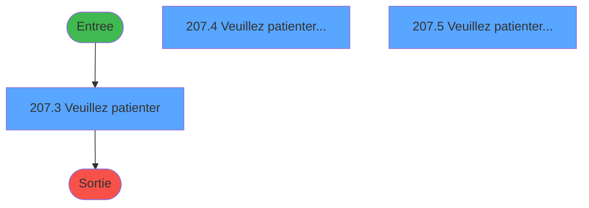
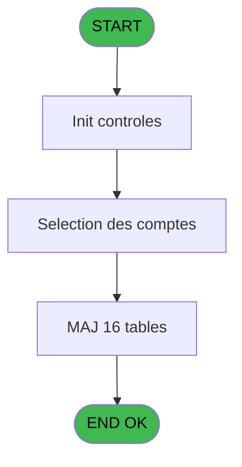
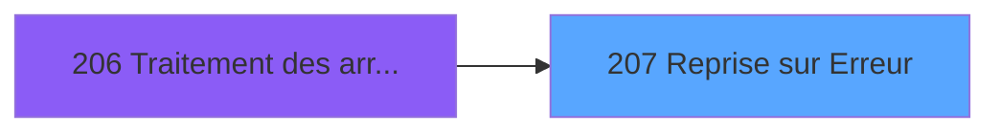

# PBG IDE 207 - Reprise sur Erreur

> **Analyse**: Phases 1-4 2026-02-03 10:12 -> 10:12 (17s) | Assemblage 10:12
> **Pipeline**: V7.2 Enrichi
> **Structure**: 4 onglets (Resume | Ecrans | Donnees | Connexions)

<!-- TAB:Resume -->

## 1. FICHE D'IDENTITE

| Attribut | Valeur |
|----------|--------|
| Projet | PBG |
| IDE Position | 207 |
| Nom Programme | Reprise sur Erreur |
| Fichier source | `Prg_207.xml` |
| Domaine metier | General |
| Taches | 23 (3 ecrans visibles) |
| Tables modifiees | 16 |
| Programmes appeles | 0 |

## 2. DESCRIPTION FONCTIONNELLE

**Reprise sur Erreur** assure la gestion complete de ce processus, accessible depuis [Traitement des arrivants (IDE 206)](PBG-IDE-206.md).

Le flux de traitement s'organise en **5 blocs fonctionnels** :

- **Traitement** (17 taches) : traitements metier divers
- **Calcul** (2 taches) : calculs de montants, stocks ou compteurs
- **Creation** (2 taches) : insertion d'enregistrements en base (mouvements, prestations)
- **Consultation** (1 tache) : ecrans de recherche, selection et consultation
- **Validation** (1 tache) : controles et verifications de coherence

**Donnees modifiees** : 16 tables en ecriture (voyages__________voy, gm-recherche_____gmr, gm-complet_______gmc, prestations______pre, hebergement______heb, personnel_go______go, client_gm, compte_gm________cgm, historik_station, fichier_statistiques, fichier_validation, troncon__________tro, heb_circuit______hci, commentaire______com, recap_par_mop, Table_948).

Detail : phases du traitement

#### Phase 1 : Traitement (17 taches)

- **207** - Reprise sur Erreur **[[ECRAN]](#ecran-t1)**
- **207.2** - Effaçage Temporaire
- **207.3** - Veuillez patienter **[[ECRAN]](#ecran-t4)**
- **207.4** - Veuillez patienter... **[[ECRAN]](#ecran-t6)**
- **207.4.2** - Effaçage GMR
- **207.4.3** - Effaçage GMR
- **207.4.4** - Effaçage GMR
- **207.4.5** - Effaçage GMR
- **207.4.6** - Effaçage Complet
- **207.4.8** - Effaçage Commentaire
- **207.4.9** - Effaçage Commentaire
- **207.5** - Veuillez patienter... **[[ECRAN]](#ecran-t16)**
- **207.5.2** - Date de Sejour
- **207.6** - Marquage Statistiques
- **207.4.10** - Effaçage GMR
- **207.4.11** - Effaçage GMR
- **207.4.12** - Effaçage GMR

#### Phase 2 : Creation (2 taches)

- **207.1** - Creation Historique
- **207.3.1** - Creation Temporaire

#### Phase 3 : Consultation (1 tache)

- **207.4.1** - Effaçage Recherche

#### Phase 4 : Validation (1 tache)

- **207.4.7** - Effaçage Validation

#### Phase 5 : Calcul (2 taches)

- **207.5.1** - Effaçage Comptes
- **207.5.2.1** - Maj Compte

#### Tables impactees

| Table | Operations | Role metier |
|-------|-----------|-------------|
| recap_par_mop | **W**/L (5 usages) |  |
| gm-recherche_____gmr | **W**/L (3 usages) | Index de recherche |
| compte_gm________cgm | **W** (2 usages) | Comptes GM (generaux) |
| gm-complet_______gmc | R/**W** (2 usages) |  |
| Table_948 | **W** (1 usages) |  |
| fichier_validation | **W** (1 usages) |  |
| commentaire______com | **W** (1 usages) |  |
| fichier_statistiques | **W** (1 usages) |  |
| troncon__________tro | **W** (1 usages) |  |
| hebergement______heb | **W** (1 usages) | Hebergement (chambres) |
| prestations______pre | **W** (1 usages) | Prestations/services vendus |
| personnel_go______go | **W** (1 usages) |  |
| client_gm | **W** (1 usages) |  |
| historik_station | **W** (1 usages) | Historique / journal |
| heb_circuit______hci | **W** (1 usages) | Hebergement (chambres) |
| voyages__________voy | **W** (1 usages) |  |

## 3. BLOCS FONCTIONNELS

### 3.1 Traitement (17 taches)

Traitements internes.

---

#### 207 - Reprise sur Erreur [[ECRAN]](#ecran-t1)

**Role** : Tache d'orchestration : point d'entree du programme (17 sous-taches). Coordonne l'enchainement des traitements.
**Ecran** : 92 x 3 DLU (MDI) | [Voir mockup](#ecran-t1)

16 sous-taches directes

| Tache | Nom | Bloc |
|-------|-----|------|
| [207.2](#t3) | Effaçage Temporaire | Traitement |
| [207.3](#t4) | Veuillez patienter **[[ECRAN]](#ecran-t4)** | Traitement |
| [207.4](#t6) | Veuillez patienter... **[[ECRAN]](#ecran-t6)** | Traitement |
| [207.4.2](#t8) | Effaçage GMR | Traitement |
| [207.4.3](#t9) | Effaçage GMR | Traitement |
| [207.4.4](#t10) | Effaçage GMR | Traitement |
| [207.4.5](#t11) | Effaçage GMR | Traitement |
| [207.4.6](#t12) | Effaçage Complet | Traitement |
| [207.4.8](#t14) | Effaçage Commentaire | Traitement |
| [207.4.9](#t15) | Effaçage Commentaire | Traitement |
| [207.5](#t16) | Veuillez patienter... **[[ECRAN]](#ecran-t16)** | Traitement |
| [207.5.2](#t18) | Date de Sejour | Traitement |
| [207.6](#t20) | Marquage Statistiques | Traitement |
| [207.4.10](#t23) | Effaçage GMR | Traitement |
| [207.4.11](#t26) | Effaçage GMR | Traitement |
| [207.4.12](#t29) | Effaçage GMR | Traitement |

---

#### 207.2 - Effaçage Temporaire

**Role** : Traitement : Effaçage Temporaire.

---

#### 207.3 - Veuillez patienter [[ECRAN]](#ecran-t4)

**Role** : Traitement : Veuillez patienter.
**Ecran** : 426 x 56 DLU (MDI) | [Voir mockup](#ecran-t4)

---

#### 207.4 - Veuillez patienter... [[ECRAN]](#ecran-t6)

**Role** : Traitement : Veuillez patienter....
**Ecran** : 424 x 56 DLU (MDI) | [Voir mockup](#ecran-t6)

---

#### 207.4.2 - Effaçage GMR

**Role** : Traitement : Effaçage GMR.

---

#### 207.4.3 - Effaçage GMR

**Role** : Traitement : Effaçage GMR.

---

#### 207.4.4 - Effaçage GMR

**Role** : Traitement : Effaçage GMR.

---

#### 207.4.5 - Effaçage GMR

**Role** : Traitement : Effaçage GMR.

---

#### 207.4.6 - Effaçage Complet

**Role** : Traitement : Effaçage Complet.

---

#### 207.4.8 - Effaçage Commentaire

**Role** : Traitement : Effaçage Commentaire.

---

#### 207.4.9 - Effaçage Commentaire

**Role** : Traitement : Effaçage Commentaire.

---

#### 207.5 - Veuillez patienter... [[ECRAN]](#ecran-t16)

**Role** : Traitement : Veuillez patienter....
**Ecran** : 426 x 56 DLU (MDI) | [Voir mockup](#ecran-t16)

---

#### 207.5.2 - Date de Sejour

**Role** : Traitement : Date de Sejour.
**Variables liees** : A (P0-Old Sejour), C (P0-Lieu de Sejour)

---

#### 207.6 - Marquage Statistiques

**Role** : Traitement : Marquage Statistiques.

---

#### 207.4.10 - Effaçage GMR

**Role** : Traitement : Effaçage GMR.

---

#### 207.4.11 - Effaçage GMR

**Role** : Traitement : Effaçage GMR.

---

#### 207.4.12 - Effaçage GMR

**Role** : Traitement : Effaçage GMR.

### 3.2 Creation (2 taches)

Insertion de nouveaux enregistrements en base.

---

#### 207.1 - Creation Historique

**Role** : Consultation/chargement : Creation Historique.

---

#### 207.3.1 - Creation Temporaire

**Role** : Creation d'enregistrement : Creation Temporaire.

### 3.3 Consultation (1 tache)

Ecrans de recherche et consultation.

---

#### 207.4.1 - Effaçage Recherche

**Role** : Traitement : Effaçage Recherche.

### 3.4 Validation (1 tache)

Controles de coherence : 1 tache verifie les donnees et conditions.

---

#### 207.4.7 - Effaçage Validation

**Role** : Verification : Effaçage Validation.

### 3.5 Calcul (2 taches)

Calculs metier : montants, stocks, compteurs.

---

#### 207.5.1 - Effaçage Comptes

**Role** : Traitement : Effaçage Comptes.

---

#### 207.5.2.1 - Maj Compte

**Role** : Traitement : Maj Compte.

## 5. REGLES METIER

*(Aucune regle metier identifiee)*

## 6. CONTEXTE

- **Appele par**: [Traitement des arrivants (IDE 206)](PBG-IDE-206.md)
- **Appelle**: 0 programmes | **Tables**: 16 (W:16 R:1 L:2) | **Taches**: 23 | **Expressions**: 5

<!-- TAB:Ecrans -->

## 8. ECRANS

### 8.1 Forms visibles (3 / 23)

| # | Position | Tache | Nom | Type | Largeur | Hauteur | Bloc |
|---|----------|-------|-----|------|---------|---------|------|
| 1 | 207.3 | 207.3 | Veuillez patienter | MDI | 426 | 56 | Traitement |
| 2 | 207.4 | 207.4 | Veuillez patienter... | MDI | 424 | 56 | Traitement |
| 3 | 207.5 | 207.5 | Veuillez patienter... | MDI | 426 | 56 | Traitement |

### 8.2 Mockups Ecrans

---

#### 207.3 - Veuillez patienter
**Tache** : [207.3](#t4) | **Type** : MDI | **Dimensions** : 426 x 56 DLU
**Bloc** : Traitement | **Titre IDE** : Veuillez patienter

<!-- FORM-DATA:
{
    "width":  426,
    "vFactor":  8,
    "type":  "MDI",
    "hFactor":  8,
    "controls":  [
                     {
                         "x":  1,
                         "type":  "label",
                         "var":  "",
                         "y":  0,
                         "w":  423,
                         "fmt":  "",
                         "name":  "",
                         "h":  29,
                         "color":  "",
                         "text":  "",
                         "parent":  null
                     },
                     {
                         "x":  99,
                         "type":  "label",
                         "var":  "",
                         "y":  10,
                         "w":  275,
                         "fmt":  "",
                         "name":  "",
                         "h":  8,
                         "color":  "7",
                         "text":  "Remise à Jour automatique !",
                         "parent":  null
                     },
                     {
                         "x":  1,
                         "type":  "label",
                         "var":  "",
                         "y":  29,
                         "w":  423,
                         "fmt":  "",
                         "name":  "",
                         "h":  27,
                         "color":  "",
                         "text":  "",
                         "parent":  null
                     },
                     {
                         "x":  55,
                         "type":  "label",
                         "var":  "",
                         "y":  39,
                         "w":  316,
                         "fmt":  "",
                         "name":  "",
                         "h":  8,
                         "color":  "",
                         "text":  "Selection des comptes",
                         "parent":  null
                     },
                     {
                         "x":  2,
                         "type":  "image",
                         "var":  "",
                         "y":  2,
                         "w":  72,
                         "fmt":  "",
                         "name":  "",
                         "h":  25,
                         "color":  "",
                         "text":  "",
                         "parent":  null
                     }
                 ],
    "taskId":  "207.3",
    "height":  56
}
-->

---

#### 207.4 - Veuillez patienter...
**Tache** : [207.4](#t6) | **Type** : MDI | **Dimensions** : 424 x 56 DLU
**Bloc** : Traitement | **Titre IDE** : Veuillez patienter...

<!-- FORM-DATA:
{
    "width":  424,
    "vFactor":  8,
    "type":  "MDI",
    "hFactor":  8,
    "controls":  [
                     {
                         "x":  1,
                         "type":  "label",
                         "var":  "",
                         "y":  0,
                         "w":  423,
                         "fmt":  "",
                         "name":  "",
                         "h":  29,
                         "color":  "",
                         "text":  "",
                         "parent":  null
                     },
                     {
                         "x":  99,
                         "type":  "label",
                         "var":  "",
                         "y":  10,
                         "w":  275,
                         "fmt":  "",
                         "name":  "",
                         "h":  8,
                         "color":  "7",
                         "text":  "Remise à Jour automatique !",
                         "parent":  null
                     },
                     {
                         "x":  1,
                         "type":  "label",
                         "var":  "",
                         "y":  29,
                         "w":  423,
                         "fmt":  "",
                         "name":  "",
                         "h":  27,
                         "color":  "",
                         "text":  "",
                         "parent":  null
                     },
                     {
                         "x":  55,
                         "type":  "label",
                         "var":  "",
                         "y":  39,
                         "w":  316,
                         "fmt":  "",
                         "name":  "",
                         "h":  8,
                         "color":  "",
                         "text":  "Suppression des GSM en cours",
                         "parent":  null
                     },
                     {
                         "x":  2,
                         "type":  "image",
                         "var":  "",
                         "y":  2,
                         "w":  72,
                         "fmt":  "",
                         "name":  "",
                         "h":  25,
                         "color":  "",
                         "text":  "",
                         "parent":  null
                     }
                 ],
    "taskId":  "207.4",
    "height":  56
}
-->

---

#### 207.5 - Veuillez patienter...
**Tache** : [207.5](#t16) | **Type** : MDI | **Dimensions** : 426 x 56 DLU
**Bloc** : Traitement | **Titre IDE** : Veuillez patienter...

<!-- FORM-DATA:
{
    "width":  426,
    "vFactor":  8,
    "type":  "MDI",
    "hFactor":  8,
    "controls":  [
                     {
                         "x":  1,
                         "type":  "label",
                         "var":  "",
                         "y":  0,
                         "w":  423,
                         "fmt":  "",
                         "name":  "",
                         "h":  29,
                         "color":  "",
                         "text":  "",
                         "parent":  null
                     },
                     {
                         "x":  99,
                         "type":  "label",
                         "var":  "",
                         "y":  10,
                         "w":  275,
                         "fmt":  "",
                         "name":  "",
                         "h":  8,
                         "color":  "7",
                         "text":  "Remise à Jour automatique !",
                         "parent":  null
                     },
                     {
                         "x":  1,
                         "type":  "label",
                         "var":  "",
                         "y":  29,
                         "w":  423,
                         "fmt":  "",
                         "name":  "",
                         "h":  27,
                         "color":  "",
                         "text":  "",
                         "parent":  null
                     },
                     {
                         "x":  55,
                         "type":  "label",
                         "var":  "",
                         "y":  39,
                         "w":  316,
                         "fmt":  "",
                         "name":  "",
                         "h":  8,
                         "color":  "",
                         "text":  "Correction des comptes",
                         "parent":  null
                     },
                     {
                         "x":  2,
                         "type":  "image",
                         "var":  "",
                         "y":  2,
                         "w":  72,
                         "fmt":  "",
                         "name":  "",
                         "h":  25,
                         "color":  "",
                         "text":  "",
                         "parent":  null
                     }
                 ],
    "taskId":  "207.5",
    "height":  56
}
-->

## 9. NAVIGATION

### 9.1 Enchainement des ecrans

**Detail par enchainement :**

| Depuis | Action | Vers | Retour |
|--------|--------|------|--------|

### 9.3 Structure hierarchique (23 taches)

| Position | Tache | Type | Dimensions | Bloc |
|----------|-------|------|------------|------|
| **207.1** | [**Reprise sur Erreur** (207)](#t1) [mockup](#ecran-t1) | MDI | 92x3 | Traitement |
| 207.1.1 | [Effaçage Temporaire (207.2)](#t3) | MDI | - | |
| 207.1.2 | [Veuillez patienter (207.3)](#t4) [mockup](#ecran-t4) | MDI | 426x56 | |
| 207.1.3 | [Veuillez patienter... (207.4)](#t6) [mockup](#ecran-t6) | MDI | 424x56 | |
| 207.1.4 | [Effaçage GMR (207.4.2)](#t8) | MDI | - | |
| 207.1.5 | [Effaçage GMR (207.4.3)](#t9) | MDI | - | |
| 207.1.6 | [Effaçage GMR (207.4.4)](#t10) | MDI | - | |
| 207.1.7 | [Effaçage GMR (207.4.5)](#t11) | MDI | - | |
| 207.1.8 | [Effaçage Complet (207.4.6)](#t12) | MDI | - | |
| 207.1.9 | [Effaçage Commentaire (207.4.8)](#t14) | MDI | - | |
| 207.1.10 | [Effaçage Commentaire (207.4.9)](#t15) | MDI | - | |
| 207.1.11 | [Veuillez patienter... (207.5)](#t16) [mockup](#ecran-t16) | MDI | 426x56 | |
| 207.1.12 | [Date de Sejour (207.5.2)](#t18) | MDI | - | |
| 207.1.13 | [Marquage Statistiques (207.6)](#t20) | MDI | - | |
| 207.1.14 | [Effaçage GMR (207.4.10)](#t23) | MDI | - | |
| 207.1.15 | [Effaçage GMR (207.4.11)](#t26) | MDI | - | |
| 207.1.16 | [Effaçage GMR (207.4.12)](#t29) | MDI | - | |
| **207.2** | [**Creation Historique** (207.1)](#t2) | MDI | - | Creation |
| 207.2.1 | [Creation Temporaire (207.3.1)](#t5) | MDI | - | |
| **207.3** | [**Effaçage Recherche** (207.4.1)](#t7) | MDI | - | Consultation |
| **207.4** | [**Effaçage Validation** (207.4.7)](#t13) | MDI | - | Validation |
| **207.5** | [**Effaçage Comptes** (207.5.1)](#t17) | MDI | - | Calcul |
| 207.5.1 | [Maj Compte (207.5.2.1)](#t19) | MDI | - | |

### 9.4 Algorigramme

> **Legende**: Vert = START/END OK | Rouge = END KO | Bleu = Decisions
> *Algorigramme auto-genere. Utiliser `/algorigramme` pour une synthese metier detaillee.*

<!-- TAB:Donnees -->

## 10. TABLES

### Tables utilisees (16)

| ID | Nom | Description | Type | R | W | L | Usages |
|----|-----|-------------|------|---|---|---|--------|
| 29 | voyages__________voy |  | DB |   | **W** |   | 1 |
| 30 | gm-recherche_____gmr | Index de recherche | DB |   | **W** | L | 3 |
| 31 | gm-complet_______gmc |  | DB | R | **W** |   | 2 |
| 33 | prestations______pre | Prestations/services vendus | DB |   | **W** |   | 1 |
| 34 | hebergement______heb | Hebergement (chambres) | DB |   | **W** |   | 1 |
| 35 | personnel_go______go |  | DB |   | **W** |   | 1 |
| 36 | client_gm |  | DB |   | **W** |   | 1 |
| 47 | compte_gm________cgm | Comptes GM (generaux) | DB |   | **W** |   | 2 |
| 88 | historik_station | Historique / journal | DB |   | **W** |   | 1 |
| 129 | fichier_statistiques |  | DB |   | **W** |   | 1 |
| 131 | fichier_validation |  | DB |   | **W** |   | 1 |
| 167 | troncon__________tro |  | DB |   | **W** |   | 1 |
| 168 | heb_circuit______hci | Hebergement (chambres) | DB |   | **W** |   | 1 |
| 171 | commentaire______com |  | DB |   | **W** |   | 1 |
| 575 | recap_par_mop |  | TMP |   | **W** | L | 5 |
| 948 | Table_948 |  | MEM |   | **W** |   | 1 |

### Colonnes par table (1 / 16 tables avec colonnes identifiees)

Table 29 - voyages__________voy (**W**) - 1 usages

*Table utilisee uniquement en Link ou aucune colonne Real identifiee dans le DataView.*

Table 30 - gm-recherche_____gmr (**W**/L) - 3 usages

*Table utilisee uniquement en Link ou aucune colonne Real identifiee dans le DataView.*

Table 31 - gm-complet_______gmc (R/**W**) - 2 usages

*Table utilisee uniquement en Link ou aucune colonne Real identifiee dans le DataView.*

Table 33 - prestations______pre (**W**) - 1 usages

*Table utilisee uniquement en Link ou aucune colonne Real identifiee dans le DataView.*

Table 34 - hebergement______heb (**W**) - 1 usages

*Table utilisee uniquement en Link ou aucune colonne Real identifiee dans le DataView.*

Table 35 - personnel_go______go (**W**) - 1 usages

*Table utilisee uniquement en Link ou aucune colonne Real identifiee dans le DataView.*

Table 36 - client_gm (**W**) - 1 usages

*Table utilisee uniquement en Link ou aucune colonne Real identifiee dans le DataView.*

Table 47 - compte_gm________cgm (**W**) - 2 usages

*Table utilisee uniquement en Link ou aucune colonne Real identifiee dans le DataView.*

Table 88 - historik_station (**W**) - 1 usages

*Table utilisee uniquement en Link ou aucune colonne Real identifiee dans le DataView.*

Table 129 - fichier_statistiques (**W**) - 1 usages

*Table utilisee uniquement en Link ou aucune colonne Real identifiee dans le DataView.*

Table 131 - fichier_validation (**W**) - 1 usages

*Table utilisee uniquement en Link ou aucune colonne Real identifiee dans le DataView.*

Table 167 - troncon__________tro (**W**) - 1 usages

*Table utilisee uniquement en Link ou aucune colonne Real identifiee dans le DataView.*

Table 168 - heb_circuit______hci (**W**) - 1 usages

*Table utilisee uniquement en Link ou aucune colonne Real identifiee dans le DataView.*

Table 171 - commentaire______com (**W**) - 1 usages

*Table utilisee uniquement en Link ou aucune colonne Real identifiee dans le DataView.*

Table 575 - recap_par_mop (**W**/L) - 5 usages

| Lettre | Variable | Acces | Type |
|--------|----------|-------|------|
| A | W1-Fin de Tache | W | Alpha |
| B | W1 Date sejour | W | Date |

Table 948 - Table_948 (**W**) - 1 usages

*Table utilisee uniquement en Link ou aucune colonne Real identifiee dans le DataView.*

## 11. VARIABLES

### 11.1 Variables de travail (1)

Variables internes au programme.

| Lettre | Nom | Type | Usage dans |
|--------|-----|------|-----------|
| E | W0 Fin tache | Alpha | 1x calcul interne |

### 11.2 Autres (4)

Variables diverses.

| Lettre | Nom | Type | Usage dans |
|--------|-----|------|-----------|
| A | P0-Old Sejour | Alpha | [207.5.2](#t18) |
| B | P0-Old Import | Numeric | - |
| C | P0-Lieu de Sejour | Alpha | - |
| D | P0-Societe | Alpha | - |

## 12. EXPRESSIONS

**5 / 5 expressions decodees (100%)**

### 12.1 Repartition par type

| Type | Expressions | Regles |
|------|-------------|--------|
| CONSTANTE | 1 | 0 |
| OTHER | 3 | 0 |
| CONDITION | 1 | 0 |

### 12.2 Expressions cles par type

#### CONSTANTE (1 expressions)

| Type | IDE | Expression | Regle |
|------|-----|------------|-------|
| CONSTANTE | 3 | `'F'` | - |

#### OTHER (3 expressions)

| Type | IDE | Expression | Regle |
|------|-----|------------|-------|
| OTHER | 5 | `P0-Old Sejour [A]` | - |
| OTHER | 2 | `SetCrsr (1)` | - |
| OTHER | 1 | `SetCrsr (2)` | - |

#### CONDITION (1 expressions)

| Type | IDE | Expression | Regle |
|------|-----|------------|-------|
| CONDITION | 4 | `W0 Fin tache [E]='F'` | - |

<!-- TAB:Connexions -->

## 13. GRAPHE D'APPELS

### 13.1 Chaine depuis Main (Callers)

Main -> ... -> [Traitement des arrivants (IDE 206)](PBG-IDE-206.md) -> **Reprise sur Erreur (IDE 207)**

### 13.2 Callers

| IDE | Nom Programme | Nb Appels |
|-----|---------------|-----------|
| [206](PBG-IDE-206.md) | Traitement des arrivants | 1 |

### 13.3 Callees (programmes appeles)

### 13.4 Detail Callees avec contexte

| IDE | Nom Programme | Appels | Contexte |
|-----|---------------|--------|----------|
| - | (aucun) | - | - |

## 14. RECOMMANDATIONS MIGRATION

### 14.1 Profil du programme

| Metrique | Valeur | Impact migration |
|----------|--------|-----------------|
| Lignes de logique | 215 | Taille moyenne |
| Expressions | 5 | Peu de logique |
| Tables WRITE | 16 | Fort impact donnees |
| Sous-programmes | 0 | Peu de dependances |
| Ecrans visibles | 3 | Quelques ecrans |
| Code desactive | 0% (0 / 215) | Code sain |
| Regles metier | 0 | Pas de regle identifiee |

### 14.2 Plan de migration par bloc

#### Traitement (17 taches: 4 ecrans, 13 traitements)

- **Strategie** : Orchestrateur avec 4 ecrans (Razor/React) et 13 traitements backend (services).
- Les ecrans deviennent des composants UI, les traitements invisibles deviennent des services injectables.
- Decomposer les taches en services unitaires testables.

#### Creation (2 taches: 0 ecran, 2 traitements)

- **Strategie** : Repository pattern avec Entity Framework Core.
- Insertion via `IRepository<T>.CreateAsync()`

#### Consultation (1 tache: 0 ecran, 1 traitement)

- **Strategie** : Composants de recherche/selection en modales.

#### Validation (1 tache: 0 ecran, 1 traitement)

- **Strategie** : FluentValidation avec validators specifiques.
- Chaque tache de validation -> un validator injectable

#### Calcul (2 taches: 0 ecran, 2 traitements)

- **Strategie** : Services de calcul purs (Domain Services).
- Migrer la logique de calcul (stock, compteurs, montants)

### 14.3 Dependances critiques

| Dependance | Type | Appels | Impact |
|------------|------|--------|--------|
| voyages__________voy | Table WRITE (Database) | 1x | Schema + repository |
| gm-recherche_____gmr | Table WRITE (Database) | 1x | Schema + repository |
| gm-complet_______gmc | Table WRITE (Database) | 1x | Schema + repository |
| prestations______pre | Table WRITE (Database) | 1x | Schema + repository |
| hebergement______heb | Table WRITE (Database) | 1x | Schema + repository |
| personnel_go______go | Table WRITE (Database) | 1x | Schema + repository |
| client_gm | Table WRITE (Database) | 1x | Schema + repository |
| compte_gm________cgm | Table WRITE (Database) | 2x | Schema + repository |
| historik_station | Table WRITE (Database) | 1x | Schema + repository |
| fichier_statistiques | Table WRITE (Database) | 1x | Schema + repository |
| fichier_validation | Table WRITE (Database) | 1x | Schema + repository |
| troncon__________tro | Table WRITE (Database) | 1x | Schema + repository |
| heb_circuit______hci | Table WRITE (Database) | 1x | Schema + repository |
| commentaire______com | Table WRITE (Database) | 1x | Schema + repository |
| recap_par_mop | Table WRITE (Temp) | 4x | Schema + repository |
| Table_948 | Table WRITE (Memory) | 1x | Schema + repository |

---
*Spec DETAILED generee par Pipeline V7.2 - 2026-02-03 10:12*
