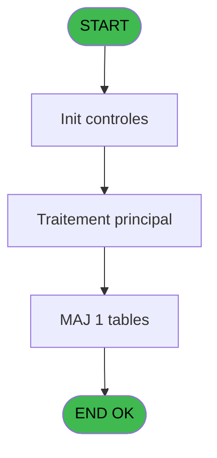
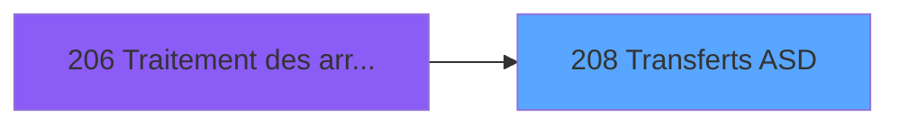
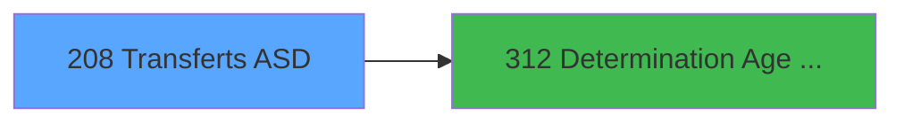

# PBG IDE 208 - Transferts ASD

> **Analyse**: Phases 1-4 2026-02-03 10:12 -> 10:12 (17s) | Assemblage 10:12
> **Pipeline**: V7.2 Enrichi
> **Structure**: 4 onglets (Resume | Ecrans | Donnees | Connexions)

<!-- TAB:Resume -->

## 1. FICHE D'IDENTITE

| Attribut | Valeur |
|----------|--------|
| Projet | PBG |
| IDE Position | 208 |
| Nom Programme | Transferts ASD |
| Fichier source | `Prg_208.xml` |
| Domaine metier | General |
| Taches | 4 (1 ecrans visibles) |
| Tables modifiees | 1 |
| Programmes appeles | 1 |

## 2. DESCRIPTION FONCTIONNELLE

**Transferts ASD** assure la gestion complete de ce processus, accessible depuis [Traitement des arrivants (IDE 206)](PBG-IDE-206.md).

Le flux de traitement s'organise en **1 blocs fonctionnels** :

- **Traitement** (4 taches) : traitements metier divers

**Donnees modifiees** : 1 tables en ecriture (new_asd).

Detail : phases du traitement

#### Phase 1 : Traitement (4 taches)

- **208** - Veuillez patienter... **[[ECRAN]](#ecran-t1)**
- **208.1** - Purge ASD
- **208.2** - Age Bebe/Enfant
- **208.3** - Ecriture ASD

Delegue a : [Determination Age Debut Sejour (IDE 312)](PBG-IDE-312.md)

#### Tables impactees

| Table | Operations | Role metier |
|-------|-----------|-------------|
| new_asd | **W** (1 usages) |  |

## 3. BLOCS FONCTIONNELS

### 3.1 Traitement (4 taches)

Traitements internes.

---

#### 208 - Veuillez patienter... [[ECRAN]](#ecran-t1)

**Role** : Traitement : Veuillez patienter....
**Ecran** : 424 x 66 DLU (MDI) | [Voir mockup](#ecran-t1)

3 sous-taches directes

| Tache | Nom | Bloc |
|-------|-----|------|
| [208.1](#t2) | Purge ASD | Traitement |
| [208.2](#t3) | Age Bebe/Enfant | Traitement |
| [208.3](#t4) | Ecriture ASD | Traitement |

**Delegue a** : [Determination Age Debut Sejour (IDE 312)](PBG-IDE-312.md)

---

#### 208.1 - Purge ASD

**Role** : Traitement : Purge ASD.
**Delegue a** : [Determination Age Debut Sejour (IDE 312)](PBG-IDE-312.md)

---

#### 208.2 - Age Bebe/Enfant

**Role** : Traitement : Age Bebe/Enfant.
**Delegue a** : [Determination Age Debut Sejour (IDE 312)](PBG-IDE-312.md)

---

#### 208.3 - Ecriture ASD

**Role** : Traitement : Ecriture ASD.
**Delegue a** : [Determination Age Debut Sejour (IDE 312)](PBG-IDE-312.md)

## 5. REGLES METIER

*(Aucune regle metier identifiee)*

## 6. CONTEXTE

- **Appele par**: [Traitement des arrivants (IDE 206)](PBG-IDE-206.md)
- **Appelle**: 1 programmes | **Tables**: 5 (W:1 R:2 L:2) | **Taches**: 4 | **Expressions**: 23

<!-- TAB:Ecrans -->

## 8. ECRANS

### 8.1 Forms visibles (1 / 4)

| # | Position | Tache | Nom | Type | Largeur | Hauteur | Bloc |
|---|----------|-------|-----|------|---------|---------|------|
| 1 | 208 | 208 | Veuillez patienter... | MDI | 424 | 66 | Traitement |

### 8.2 Mockups Ecrans

---

#### 208 - Veuillez patienter...
**Tache** : [208](#t1) | **Type** : MDI | **Dimensions** : 424 x 66 DLU
**Bloc** : Traitement | **Titre IDE** : Veuillez patienter...

<!-- FORM-DATA:
{
    "width":  424,
    "vFactor":  8,
    "type":  "MDI",
    "hFactor":  8,
    "controls":  [
                     {
                         "x":  1,
                         "type":  "label",
                         "var":  "",
                         "y":  0,
                         "w":  423,
                         "fmt":  "",
                         "name":  "",
                         "h":  29,
                         "color":  "",
                         "text":  "",
                         "parent":  null
                     },
                     {
                         "x":  99,
                         "type":  "label",
                         "var":  "",
                         "y":  10,
                         "w":  275,
                         "fmt":  "",
                         "name":  "",
                         "h":  8,
                         "color":  "7",
                         "text":  "Transferts ASD",
                         "parent":  null
                     },
                     {
                         "x":  1,
                         "type":  "label",
                         "var":  "",
                         "y":  29,
                         "w":  423,
                         "fmt":  "",
                         "name":  "",
                         "h":  37,
                         "color":  "",
                         "text":  "",
                         "parent":  null
                     },
                     {
                         "x":  9,
                         "type":  "label",
                         "var":  "",
                         "y":  41,
                         "w":  405,
                         "fmt":  "",
                         "name":  "",
                         "h":  19,
                         "color":  "",
                         "text":  "",
                         "parent":  null
                     },
                     {
                         "x":  2,
                         "type":  "image",
                         "var":  "",
                         "y":  2,
                         "w":  72,
                         "fmt":  "",
                         "name":  "",
                         "h":  25,
                         "color":  "",
                         "text":  "",
                         "parent":  null
                     },
                     {
                         "x":  12,
                         "type":  "edit",
                         "var":  "",
                         "y":  42,
                         "w":  400,
                         "fmt":  "30",
                         "name":  "",
                         "h":  17,
                         "color":  "159",
                         "text":  "",
                         "parent":  4
                     },
                     {
                         "x":  177,
                         "type":  "edit",
                         "var":  "",
                         "y":  46,
                         "w":  64,
                         "fmt":  "3 %",
                         "name":  "",
                         "h":  8,
                         "color":  "143",
                         "text":  "",
                         "parent":  1
                     }
                 ],
    "taskId":  "208",
    "height":  66
}
-->

<strong>Champs : 2 champs</strong>

| Pos (x,y) | Nom | Variable | Type |
|-----------|-----|----------|------|
| 12,42 | 30 | - | edit |
| 177,46 | 3 % | - | edit |

## 9. NAVIGATION

Ecran unique: **Veuillez patienter...**

### 9.3 Structure hierarchique (4 taches)

| Position | Tache | Type | Dimensions | Bloc |
|----------|-------|------|------------|------|
| **208.1** | [**Veuillez patienter...** (208)](#t1) [mockup](#ecran-t1) | MDI | 424x66 | Traitement |
| 208.1.1 | [Purge ASD (208.1)](#t2) | MDI | - | |
| 208.1.2 | [Age Bebe/Enfant (208.2)](#t3) | MDI | - | |
| 208.1.3 | [Ecriture ASD (208.3)](#t4) | MDI | - | |

### 9.4 Algorigramme

> **Legende**: Vert = START/END OK | Rouge = END KO | Bleu = Decisions
> *Algorigramme auto-genere. Utiliser `/algorigramme` pour une synthese metier detaillee.*

<!-- TAB:Donnees -->

## 10. TABLES

### Tables utilisees (5)

| ID | Nom | Description | Type | R | W | L | Usages |
|----|-----|-------------|------|---|---|---|--------|
| 31 | gm-complet_______gmc |  | DB |   |   | L | 1 |
| 34 | hebergement______heb | Hebergement (chambres) | DB | R |   |   | 1 |
| 113 | tables_village |  | DB | R |   |   | 1 |
| 133 | new_asd |  | DB |   | **W** |   | 1 |
| 569 | pointage_articles_caution | Articles et stock | TMP |   |   | L | 1 |

### Colonnes par table (1 / 3 tables avec colonnes identifiees)

Table 34 - hebergement______heb (R) - 1 usages

| Lettre | Variable | Acces | Type |
|--------|----------|-------|------|
| A | P0-Code Societe | R | Alpha |
| B | P0-Nb Arrivants | R | Numeric |
| C | W0-Operande | R | Numeric |
| D | W0-Operateur | R | Numeric |
| E | W0-Pourcentage | R | Numeric |
| F | W0-Calcul Pourcent | R | Numeric |
| G | W0 Age Bebe | R | Numeric |
| H | W0 Age Enfant | R | Numeric |
| I | W0 (B)ebe (E)nfant | R | Alpha |
| J | W-age | R | Numeric |
| K | W-Nb mois | R | Numeric |
| L | V.Compteur | R | Numeric |

Table 113 - tables_village (R) - 1 usages

*Table utilisee uniquement en Link ou aucune colonne Real identifiee dans le DataView.*

Table 133 - new_asd (**W**) - 1 usages

*Table utilisee uniquement en Link ou aucune colonne Real identifiee dans le DataView.*

## 11. VARIABLES

### 11.1 Variables de session (1)

Variables persistantes pendant toute la session.

| Lettre | Nom | Type | Usage dans |
|--------|-----|------|-----------|
| L | V.Compteur | Numeric | - |

### 11.2 Variables de travail (3)

Variables internes au programme.

| Lettre | Nom | Type | Usage dans |
|--------|-----|------|-----------|
| G | W0 Age Bebe | Numeric | [208.2](#t3) |
| H | W0 Age Enfant | Numeric | [208.2](#t3) |
| I | W0 (B)ebe (E)nfant | Alpha | - |

### 11.3 Autres (8)

Variables diverses.

| Lettre | Nom | Type | Usage dans |
|--------|-----|------|-----------|
| A | P0-Code Societe | Alpha | - |
| B | P0-Nb Arrivants | Numeric | - |
| C | W0-Operande | Numeric | - |
| D | W0-Operateur | Numeric | - |
| E | W0-Pourcentage | Numeric | - |
| F | W0-Calcul Pourcent | Numeric | - |
| J | W-age | Numeric | - |
| K | W-Nb mois | Numeric | 2x refs |

## 12. EXPRESSIONS

**23 / 23 expressions decodees (100%)**

### 12.1 Repartition par type

| Type | Expressions | Regles |
|------|-------------|--------|
| CALCULATION | 3 | 0 |
| CONDITION | 4 | 0 |
| CONSTANTE | 10 | 0 |
| REFERENCE_VG | 1 | 0 |
| OTHER | 5 | 0 |

### 12.2 Expressions cles par type

#### CALCULATION (3 expressions)

| Type | IDE | Expression | Regle |
|------|-----|------------|-------|
| CALCULATION | 22 | `[CJ]+1` | - |
| CALCULATION | 3 | `([CJ]/VG1)*50` | - |
| CALCULATION | 2 | `([CJ]/VG1)*100` | - |

#### CONDITION (4 expressions)

| Type | IDE | Expression | Regle |
|------|-----|------------|-------|
| CONDITION | 18 | `W-Nb mois [K]<=0` | - |
| CONDITION | 21 | `[Q]<>0` | - |
| CONDITION | 16 | `[CH]<=W0 Age Bebe [G] AND W-Nb mois [K]<>'00/00/0000'DATE` | - |
| CONDITION | 17 | `[CH]<=W0 Age Enfant [H] AND [CH]>W0 Age Bebe [G]` | - |

#### CONSTANTE (10 expressions)

| Type | IDE | Expression | Regle |
|------|-----|------------|-------|
| CONSTANTE | 15 | `'B'` | - |
| CONSTANTE | 14 | `'H'` | - |
| CONSTANTE | 19 | `''` | - |
| CONSTANTE | 23 | `1` | - |
| CONSTANTE | 20 | `'E'` | - |
| ... | | *+5 autres* | |

#### REFERENCE_VG (1 expressions)

| Type | IDE | Expression | Regle |
|------|-----|------------|-------|
| REFERENCE_VG | 4 | `VG20` | - |

#### OTHER (5 expressions)

| Type | IDE | Expression | Regle |
|------|-----|------------|-------|
| OTHER | 10 | `[Q]` | - |
| OTHER | 11 | `[R]` | - |
| OTHER | 9 | `[P]` | - |
| OTHER | 7 | `[N]` | - |
| OTHER | 8 | `[O]` | - |

### 12.3 Toutes les expressions (23)

Voir les 23 expressions

#### CALCULATION (3)

| IDE | Expression Decodee |
|-----|-------------------|
| 2 | `([CJ]/VG1)*100` |
| 3 | `([CJ]/VG1)*50` |
| 22 | `[CJ]+1` |

#### CONDITION (4)

| IDE | Expression Decodee |
|-----|-------------------|
| 16 | `[CH]<=W0 Age Bebe [G] AND W-Nb mois [K]<>'00/00/0000'DATE` |
| 17 | `[CH]<=W0 Age Enfant [H] AND [CH]>W0 Age Bebe [G]` |
| 18 | `W-Nb mois [K]<=0` |
| 21 | `[Q]<>0` |

#### CONSTANTE (10)

| IDE | Expression Decodee |
|-----|-------------------|
| 1 | `''` |
| 5 | `'F'` |
| 6 | `'I'` |
| 12 | `'A'` |
| 13 | `'Z'` |
| 14 | `'H'` |
| 15 | `'B'` |
| 19 | `''` |
| 20 | `'E'` |
| 23 | `1` |

#### REFERENCE_VG (1)

| IDE | Expression Decodee |
|-----|-------------------|
| 4 | `VG20` |

#### OTHER (5)

| IDE | Expression Decodee |
|-----|-------------------|
| 7 | `[N]` |
| 8 | `[O]` |
| 9 | `[P]` |
| 10 | `[Q]` |
| 11 | `[R]` |

<!-- TAB:Connexions -->

## 13. GRAPHE D'APPELS

### 13.1 Chaine depuis Main (Callers)

Main -> ... -> [Traitement des arrivants (IDE 206)](PBG-IDE-206.md) -> **Transferts ASD (IDE 208)**

### 13.2 Callers

| IDE | Nom Programme | Nb Appels |
|-----|---------------|-----------|
| [206](PBG-IDE-206.md) | Traitement des arrivants | 1 |

### 13.3 Callees (programmes appeles)

### 13.4 Detail Callees avec contexte

| IDE | Nom Programme | Appels | Contexte |
|-----|---------------|--------|----------|
| [312](PBG-IDE-312.md) | Determination Age Debut Sejour | 1 | Sous-programme |

## 14. RECOMMANDATIONS MIGRATION

### 14.1 Profil du programme

| Metrique | Valeur | Impact migration |
|----------|--------|-----------------|
| Lignes de logique | 129 | Programme compact |
| Expressions | 23 | Peu de logique |
| Tables WRITE | 1 | Impact faible |
| Sous-programmes | 1 | Peu de dependances |
| Ecrans visibles | 1 | Ecran unique ou traitement batch |
| Code desactive | 0% (0 / 129) | Code sain |
| Regles metier | 0 | Pas de regle identifiee |

### 14.2 Plan de migration par bloc

#### Traitement (4 taches: 1 ecran, 3 traitements)

- **Strategie** : Orchestrateur avec 1 ecrans (Razor/React) et 3 traitements backend (services).
- Les ecrans deviennent des composants UI, les traitements invisibles deviennent des services injectables.
- 1 sous-programme(s) a migrer ou a reutiliser depuis les services existants.
- Decomposer les taches en services unitaires testables.

### 14.3 Dependances critiques

| Dependance | Type | Appels | Impact |
|------------|------|--------|--------|
| new_asd | Table WRITE (Database) | 1x | Schema + repository |
| [Determination Age Debut Sejour (IDE 312)](PBG-IDE-312.md) | Sous-programme | 1x | Normale - Sous-programme |

---
*Spec DETAILED generee par Pipeline V7.2 - 2026-02-03 10:12*
