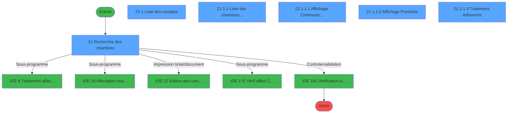
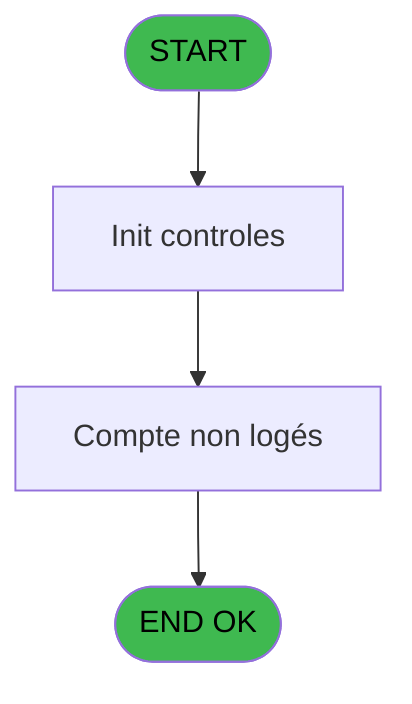
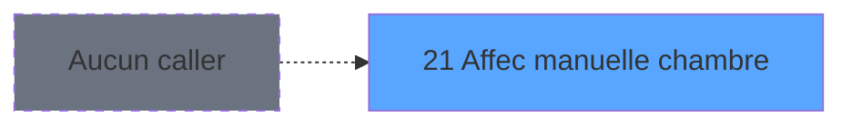
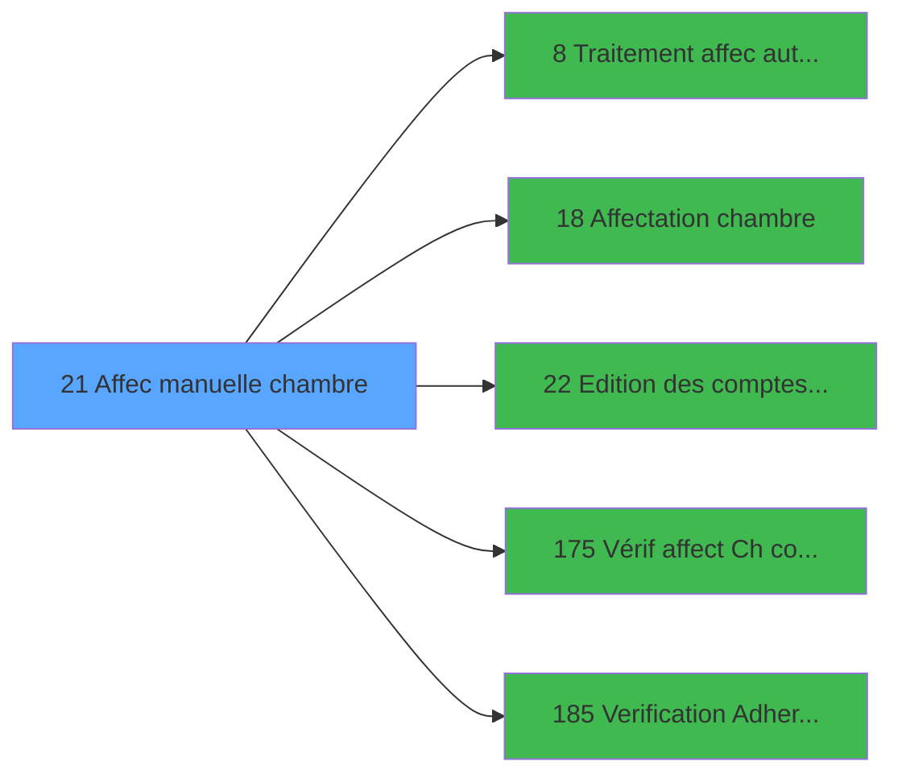

# PBG IDE 21 - Affec manuelle chambre

> **Analyse**: Phases 1-4 2026-02-03 01:08 -> 01:09 (41s) | Assemblage 01:09
> **Pipeline**: V7.2 Enrichi
> **Structure**: 4 onglets (Resume | Ecrans | Donnees | Connexions)

<!-- TAB:Resume -->

## 1. FICHE D'IDENTITE

| Attribut | Valeur |
|----------|--------|
| Projet | PBG |
| IDE Position | 21 |
| Nom Programme | Affec manuelle chambre |
| Fichier source | `Prg_21.xml` |
| Domaine metier | General |
| Taches | 6 (6 ecrans visibles) |
| Tables modifiees | 0 |
| Programmes appeles | 5 |
| :warning: Statut | **ORPHELIN_POTENTIEL** |

## 2. DESCRIPTION FONCTIONNELLE

**Affec manuelle chambre** assure la gestion complete de ce processus.

Le flux de traitement s'organise en **3 blocs fonctionnels** :

- **Consultation** (3 taches) : ecrans de recherche, selection et consultation
- **Traitement** (2 taches) : traitements metier divers
- **Calcul** (1 tache) : calculs de montants, stocks ou compteurs

**Logique metier** : 2 regles identifiees couvrant conditions metier.

Detail : phases du traitement

#### Phase 1 : Consultation (3 taches)

- **21** - Recherche des chambres **[[ECRAN]](#ecran-t6)**
- **21.1.1.1** - Affichage Communicante **[[ECRAN]](#ecran-t13)**
- **21.1.1.2** - Affichage Proximite **[[ECRAN]](#ecran-t19)**

#### Phase 2 : Calcul (1 tache)

- **21.1** - Liste des comptes **[[ECRAN]](#ecran-t7)**

#### Phase 3 : Traitement (2 taches)

- **21.1.1** - Liste des chambres disponibles **[[ECRAN]](#ecran-t10)**
- **21.1.1.3** - Traitement Adherents **[[ECRAN]](#ecran-t22)**

Delegue a : [Traitement affec auto chambres (IDE 8)](PBG-IDE-8.md), [Affectation chambre (IDE 18)](PBG-IDE-18.md), [Vérif affect Ch comm libre (IDE 175)](PBG-IDE-175.md)

## 3. BLOCS FONCTIONNELS

### 3.1 Consultation (3 taches)

Ecrans de recherche et consultation.

---

#### 21 - Recherche des chambres [[ECRAN]](#ecran-t6)

**Role** : Traitement : Recherche des chambres.
**Ecran** : 1459 x 349 DLU (MDI) | [Voir mockup](#ecran-t6)
**Variables liees** : J (b_Recherche)

---

#### 21.1.1.1 - Affichage Communicante [[ECRAN]](#ecran-t13)

**Role** : Reinitialisation : Affichage Communicante.
**Ecran** : 142 x 78 DLU (Modal) | [Voir mockup](#ecran-t13)

---

#### 21.1.1.2 - Affichage Proximite [[ECRAN]](#ecran-t19)

**Role** : Reinitialisation : Affichage Proximite.
**Ecran** : 144 x 80 DLU (Modal) | [Voir mockup](#ecran-t19)

### 3.2 Calcul (1 tache)

Calculs metier : montants, stocks, compteurs.

---

#### 21.1 - Liste des comptes [[ECRAN]](#ecran-t7)

**Role** : Traitement : Liste des comptes.
**Ecran** : 725 x 257 DLU (Modal) | [Voir mockup](#ecran-t7)

### 3.3 Traitement (2 taches)

Traitements internes.

---

#### 21.1.1 - Liste des chambres disponibles [[ECRAN]](#ecran-t10)

**Role** : Traitement : Liste des chambres disponibles.
**Ecran** : 1350 x 273 DLU (MDI) | [Voir mockup](#ecran-t10)
**Delegue a** : [Traitement affec auto chambres (IDE 8)](PBG-IDE-8.md), [Affectation chambre (IDE 18)](PBG-IDE-18.md), [Vérif affect Ch comm libre (IDE 175)](PBG-IDE-175.md)

---

#### 21.1.1.3 - Traitement Adherents [[ECRAN]](#ecran-t22)

**Role** : Traitement : Traitement Adherents.
**Ecran** : 850 x 92 DLU (Modal) | [Voir mockup](#ecran-t22)
**Delegue a** : [Traitement affec auto chambres (IDE 8)](PBG-IDE-8.md), [Affectation chambre (IDE 18)](PBG-IDE-18.md), [Vérif affect Ch comm libre (IDE 175)](PBG-IDE-175.md)

## 5. REGLES METIER

2 regles identifiees:

### Autres (2 regles)

#### [RM-001] Traitement si [DX] est non nul

| Element | Detail |
|---------|--------|
| **Condition** | `[DX]<>0` |
| **Si vrai** | [DX] |
| **Si faux** | Date()+3) |
| **Expression source** | Expression 11 : `IF([DX]<>0,[DX],Date()+3)` |
| **Exemple** | Si [DX]<>0 → [DX]. Sinon → Date()+3) |

#### [RM-002] Traitement si [DY] est non nul

| Element | Detail |
|---------|--------|
| **Condition** | `[DY]<>0` |
| **Si vrai** | [DY] |
| **Si faux** | Date()+5) |
| **Expression source** | Expression 12 : `IF([DY]<>0,[DY],Date()+5)` |
| **Exemple** | Si [DY]<>0 → [DY]. Sinon → Date()+5) |

## 6. CONTEXTE

- **Appele par**: (aucun)
- **Appelle**: 5 programmes | **Tables**: 9 (W:0 R:4 L:7) | **Taches**: 6 | **Expressions**: 20

<!-- TAB:Ecrans -->

## 8. ECRANS

### 8.1 Forms visibles (6 / 6)

| # | Position | Tache | Nom | Type | Largeur | Hauteur | Bloc |
|---|----------|-------|-----|------|---------|---------|------|
| 1 | 21.1 | 21 | Recherche des chambres | MDI | 1459 | 349 | Consultation |
| 2 | 21.1.1 | 21.1 | Liste des comptes | Modal | 725 | 257 | Calcul |
| 3 | 21.1.1.1 | 21.1.1 | Liste des chambres disponibles | MDI | 1350 | 273 | Traitement |
| 4 | 21.1.1.1.3 | 21.1.1.1 | Affichage Communicante | Modal | 142 | 78 | Consultation |
| 5 | 21.1.1.1.2 | 21.1.1.2 | Affichage Proximite | Modal | 144 | 80 | Consultation |
| 6 | 21.1.1.1.1 | 21.1.1.3 | Traitement Adherents | Modal | 850 | 92 | Traitement |

### 8.2 Mockups Ecrans

---

#### 21.1 - Recherche des chambres
**Tache** : [21](#t6) | **Type** : MDI | **Dimensions** : 1459 x 349 DLU
**Bloc** : Consultation | **Titre IDE** : Recherche des chambres

<!-- FORM-DATA:
{
    "width":  1459,
    "vFactor":  8,
    "type":  "MDI",
    "hFactor":  8,
    "controls":  [
                     {
                         "x":  0,
                         "type":  "label",
                         "var":  "",
                         "y":  1,
                         "w":  1442,
                         "fmt":  "",
                         "name":  "",
                         "h":  19,
                         "color":  "1",
                         "text":  "",
                         "parent":  null
                     },
                     {
                         "x":  7,
                         "type":  "label",
                         "var":  "",
                         "y":  25,
                         "w":  1433,
                         "fmt":  "",
                         "name":  "",
                         "h":  58,
                         "color":  "",
                         "text":  "",
                         "parent":  null
                     },
                     {
                         "x":  13,
                         "type":  "label",
                         "var":  "",
                         "y":  38,
                         "w":  135,
                         "fmt":  "",
                         "name":  "",
                         "h":  12,
                         "color":  "",
                         "text":  "Date de début",
                         "parent":  45
                     },
                     {
                         "x":  13,
                         "type":  "label",
                         "var":  "",
                         "y":  55,
                         "w":  91,
                         "fmt":  "",
                         "name":  "",
                         "h":  12,
                         "color":  "",
                         "text":  "Date fin",
                         "parent":  45
                     },
                     {
                         "x":  352,
                         "type":  "label",
                         "var":  "",
                         "y":  38,
                         "w":  409,
                         "fmt":  "",
                         "name":  "",
                         "h":  12,
                         "color":  "",
                         "text":  "Recherche sur le code logement unitaire",
                         "parent":  45
                     },
                     {
                         "x":  352,
                         "type":  "label",
                         "var":  "",
                         "y":  55,
                         "w":  401,
                         "fmt":  "",
                         "name":  "",
                         "h":  12,
                         "color":  "",
                         "text":  "Recherche sur chambres communiquantes cassées",
                         "parent":  45
                     },
                     {
                         "x":  812,
                         "type":  "label",
                         "var":  "",
                         "y":  38,
                         "w":  587,
                         "fmt":  "",
                         "name":  "",
                         "h":  12,
                         "color":  "",
                         "text":  "Affectation automatique des chambres pour les dossiers avec commentaires ?",
                         "parent":  45
                     },
                     {
                         "x":  152,
                         "type":  "edit",
                         "var":  "",
                         "y":  38,
                         "w":  126,
                         "fmt":  "DD/MM/YYYY",
                         "name":  "w0_DateMin",
                         "h":  12,
                         "color":  "110",
                         "text":  "",
                         "parent":  45
                     },
                     {
                         "x":  280,
                         "type":  "button",
                         "var":  "",
                         "y":  38,
                         "w":  28,
                         "fmt":  "...",
                         "name":  "b_ZoomDateMin",
                         "h":  10,
                         "color":  "",
                         "text":  "",
                         "parent":  45
                     },
                     {
                         "x":  152,
                         "type":  "edit",
                         "var":  "",
                         "y":  56,
                         "w":  126,
                         "fmt":  "DD/MM/YYYY",
                         "name":  "w0_DateMax",
                         "h":  10,
                         "color":  "110",
                         "text":  "",
                         "parent":  45
                     },
                     {
                         "x":  280,
                         "type":  "button",
                         "var":  "",
                         "y":  56,
                         "w":  28,
                         "fmt":  "...",
                         "name":  "b_ZoomDateMax",
                         "h":  10,
                         "color":  "",
                         "text":  "",
                         "parent":  45
                     },
                     {
                         "x":  1119,
                         "type":  "button",
                         "var":  "",
                         "y":  59,
                         "w":  149,
                         "fmt":  "\u0026Recherche",
                         "name":  "b_Recherche",
                         "h":  18,
                         "color":  "",
                         "text":  "",
                         "parent":  45
                     },
                     {
                         "x":  1277,
                         "type":  "button",
                         "var":  "",
                         "y":  59,
                         "w":  149,
                         "fmt":  "",
                         "name":  "quitterrech",
                         "h":  18,
                         "color":  "",
                         "text":  "",
                         "parent":  45
                     },
                     {
                         "x":  3,
                         "type":  "edit",
                         "var":  "",
                         "y":  3,
                         "w":  267,
                         "fmt":  "20",
                         "name":  "",
                         "h":  8,
                         "color":  "",
                         "text":  "",
                         "parent":  1
                     },
                     {
                         "x":  1179,
                         "type":  "edit",
                         "var":  "",
                         "y":  7,
                         "w":  248,
                         "fmt":  "WWW DD MMM YYYYT",
                         "name":  "",
                         "h":  8,
                         "color":  "",
                         "text":  "",
                         "parent":  1
                     },
                     {
                         "x":  3,
                         "type":  "edit",
                         "var":  "",
                         "y":  11,
                         "w":  331,
                         "fmt":  "25",
                         "name":  "",
                         "h":  8,
                         "color":  "",
                         "text":  "",
                         "parent":  null
                     },
                     {
                         "x":  0,
                         "type":  "subform",
                         "var":  "",
                         "y":  85,
                         "w":  1454,
                         "fmt":  "",
                         "name":  "COMPTES",
                         "h":  261,
                         "color":  "",
                         "text":  "",
                         "parent":  null
                     },
                     {
                         "x":  760,
                         "type":  "checkbox",
                         "var":  "",
                         "y":  38,
                         "w":  29,
                         "fmt":  "",
                         "name":  "Flag chambre avec CdLog unit",
                         "h":  12,
                         "color":  "",
                         "text":  "",
                         "parent":  45
                     },
                     {
                         "x":  760,
                         "type":  "checkbox",
                         "var":  "",
                         "y":  55,
                         "w":  29,
                         "fmt":  "",
                         "name":  "Flag chambre cassée_0001",
                         "h":  12,
                         "color":  "",
                         "text":  "",
                         "parent":  45
                     },
                     {
                         "x":  1405,
                         "type":  "checkbox",
                         "var":  "",
                         "y":  38,
                         "w":  27,
                         "fmt":  "",
                         "name":  "v.Loger les dossier si comment.",
                         "h":  12,
                         "color":  "",
                         "text":  "",
                         "parent":  null
                     }
                 ],
    "taskId":  "21.1",
    "height":  349
}
-->

<strong>Champs : 8 champs</strong>

| Pos (x,y) | Nom | Variable | Type |
|-----------|-----|----------|------|
| 152,38 | w0_DateMin | - | edit |
| 152,56 | w0_DateMax | - | edit |
| 3,3 | 20 | - | edit |
| 1179,7 | WWW DD MMM YYYYT | - | edit |
| 3,11 | 25 | - | edit |
| 760,38 | Flag chambre avec CdLog unit | - | checkbox |
| 760,55 | Flag chambre cassée_0001 | - | checkbox |
| 1405,38 | v.Loger les dossier si comment. | - | checkbox |

<strong>Boutons : 4 boutons</strong>

| Bouton | Pos (x,y) | Action |
|--------|-----------|--------|
| ... | 280,38 | Bouton fonctionnel |
| ... | 280,56 | Bouton fonctionnel |
| Recherche | 1119,59 | Ouvre la selection |
| quitterrech | 1277,59 | Quitte le programme |

---

#### 21.1.1 - Liste des comptes
**Tache** : [21.1](#t7) | **Type** : Modal | **Dimensions** : 725 x 257 DLU
**Bloc** : Calcul | **Titre IDE** : Liste des comptes

<!-- FORM-DATA:
{
    "width":  725,
    "vFactor":  8,
    "type":  "Modal",
    "hFactor":  4,
    "controls":  [
                     {
                         "x":  8,
                         "type":  "table",
                         "var":  "",
                         "name":  "",
                         "titleH":  12,
                         "color":  "110",
                         "w":  717,
                         "y":  8,
                         "fmt":  "",
                         "parent":  null,
                         "text":  "",
                         "rowH":  13,
                         "h":  223,
                         "cols":  [
                                      {
                                          "title":  "Date déb. séj.",
                                          "layer":  1,
                                          "w":  61
                                      },
                                      {
                                          "title":  "Nom",
                                          "layer":  2,
                                          "w":  108
                                      },
                                      {
                                          "title":  "Prénom",
                                          "layer":  3,
                                          "w":  66
                                      },
                                      {
                                          "title":  "H D. Sej",
                                          "layer":  4,
                                          "w":  36
                                      },
                                      {
                                          "title":  "Date fin sej.",
                                          "layer":  5,
                                          "w":  54
                                      },
                                      {
                                          "title":  "H F. Sej",
                                          "layer":  6,
                                          "w":  36
                                      },
                                      {
                                          "title":  "Code log.",
                                          "layer":  7,
                                          "w":  41
                                      },
                                      {
                                          "title":  "Occ",
                                          "layer":  8,
                                          "w":  33
                                      },
                                      {
                                          "title":  "Chambre",
                                          "layer":  9,
                                          "w":  42
                                      },
                                      {
                                          "title":  "Fidélisation",
                                          "layer":  10,
                                          "w":  81
                                      },
                                      {
                                          "title":  "Sexe",
                                          "layer":  11,
                                          "w":  23
                                      },
                                      {
                                          "title":  "Qualité",
                                          "layer":  12,
                                          "w":  31
                                      },
                                      {
                                          "title":  "Dossier/Cpt",
                                          "layer":  13,
                                          "w":  48
                                      },
                                      {
                                          "title":  "Fil.",
                                          "layer":  14,
                                          "w":  37
                                      }
                                  ],
                         "rows":  14
                     },
                     {
                         "x":  12,
                         "type":  "edit",
                         "var":  "",
                         "y":  23,
                         "w":  55,
                         "fmt":  "30",
                         "name":  "Date debut sejour",
                         "h":  10,
                         "color":  "110",
                         "text":  "",
                         "parent":  1
                     },
                     {
                         "x":  74,
                         "type":  "edit",
                         "var":  "",
                         "y":  23,
                         "w":  101,
                         "fmt":  "U30",
                         "name":  "nom",
                         "h":  10,
                         "color":  "110",
                         "text":  "",
                         "parent":  1
                     },
                     {
                         "x":  181,
                         "type":  "edit",
                         "var":  "",
                         "y":  23,
                         "w":  59,
                         "fmt":  "30",
                         "name":  "prenom",
                         "h":  10,
                         "color":  "110",
                         "text":  "",
                         "parent":  1
                     },
                     {
                         "x":  247,
                         "type":  "edit",
                         "var":  "",
                         "y":  23,
                         "w":  14,
                         "fmt":  "U2",
                         "name":  "heure debut sejour",
                         "h":  10,
                         "color":  "110",
                         "text":  "",
                         "parent":  1
                     },
                     {
                         "x":  283,
                         "type":  "edit",
                         "var":  "",
                         "y":  23,
                         "w":  47,
                         "fmt":  "30",
                         "name":  "Date fin sejour",
                         "h":  10,
                         "color":  "110",
                         "text":  "",
                         "parent":  1
                     },
                     {
                         "x":  337,
                         "type":  "edit",
                         "var":  "",
                         "y":  23,
                         "w":  14,
                         "fmt":  "U2",
                         "name":  "heure fin sejour",
                         "h":  10,
                         "color":  "110",
                         "text":  "",
                         "parent":  1
                     },
                     {
                         "x":  373,
                         "type":  "edit",
                         "var":  "",
                         "y":  23,
                         "w":  37,
                         "fmt":  "U6",
                         "name":  "code_logement",
                         "h":  10,
                         "color":  "110",
                         "text":  "",
                         "parent":  1
                     },
                     {
                         "x":  414,
                         "type":  "edit",
                         "var":  "",
                         "y":  23,
                         "w":  26,
                         "fmt":  "2",
                         "name":  "",
                         "h":  10,
                         "color":  "110",
                         "text":  "",
                         "parent":  1
                     },
                     {
                         "x":  447,
                         "type":  "edit",
                         "var":  "",
                         "y":  23,
                         "w":  37,
                         "fmt":  "U6",
                         "name":  "nom_logement",
                         "h":  10,
                         "color":  "110",
                         "text":  "",
                         "parent":  1
                     },
                     {
                         "x":  489,
                         "type":  "edit",
                         "var":  "",
                         "y":  23,
                         "w":  74,
                         "fmt":  "25",
                         "name":  "libelle",
                         "h":  10,
                         "color":  "110",
                         "text":  "",
                         "parent":  1
                     },
                     {
                         "x":  571,
                         "type":  "edit",
                         "var":  "",
                         "y":  23,
                         "w":  9,
                         "fmt":  "1",
                         "name":  "sexe",
                         "h":  10,
                         "color":  "110",
                         "text":  "",
                         "parent":  1
                     },
                     {
                         "x":  591,
                         "type":  "edit",
                         "var":  "",
                         "y":  23,
                         "w":  26,
                         "fmt":  "U4",
                         "name":  "qualite",
                         "h":  10,
                         "color":  "110",
                         "text":  "",
                         "parent":  1
                     },
                     {
                         "x":  624,
                         "type":  "edit",
                         "var":  "",
                         "y":  23,
                         "w":  44,
                         "fmt":  "9",
                         "name":  "numero_regroup",
                         "h":  10,
                         "color":  "110",
                         "text":  "",
                         "parent":  1
                     },
                     {
                         "x":  672,
                         "type":  "edit",
                         "var":  "",
                         "y":  23,
                         "w":  18,
                         "fmt":  "30",
                         "name":  "ordre_regroup",
                         "h":  10,
                         "color":  "110",
                         "text":  "",
                         "parent":  1
                     },
                     {
                         "x":  567,
                         "type":  "button",
                         "var":  "",
                         "y":  237,
                         "w":  75,
                         "fmt":  "\u0026\\Affecter",
                         "name":  "Bt.Affecter",
                         "h":  18,
                         "color":  "",
                         "text":  "",
                         "parent":  null
                     },
                     {
                         "x":  644,
                         "type":  "button",
                         "var":  "",
                         "y":  237,
                         "w":  75,
                         "fmt":  "\u0026Editer",
                         "name":  "b_Editer",
                         "h":  18,
                         "color":  "",
                         "text":  "",
                         "parent":  null
                     }
                 ],
    "taskId":  "21.1.1",
    "height":  257
}
-->

<strong>Champs : 14 champs</strong>

| Pos (x,y) | Nom | Variable | Type |
|-----------|-----|----------|------|
| 12,23 | Date debut sejour | - | edit |
| 74,23 | nom | - | edit |
| 181,23 | prenom | - | edit |
| 247,23 | heure debut sejour | - | edit |
| 283,23 | Date fin sejour | - | edit |
| 337,23 | heure fin sejour | - | edit |
| 373,23 | code_logement | - | edit |
| 414,23 | 2 | - | edit |
| 447,23 | nom_logement | - | edit |
| 489,23 | libelle | - | edit |
| 571,23 | sexe | - | edit |
| 591,23 | qualite | - | edit |
| 624,23 | numero_regroup | - | edit |
| 672,23 | ordre_regroup | - | edit |

<strong>Boutons : 2 boutons</strong>

| Bouton | Pos (x,y) | Action |
|--------|-----------|--------|
| \Affecter | 567,237 | Bouton fonctionnel |
| Editer | 644,237 | Modifie l'element |

---

#### 21.1.1.1 - Liste des chambres disponibles
**Tache** : [21.1.1](#t10) | **Type** : MDI | **Dimensions** : 1350 x 273 DLU
**Bloc** : Traitement | **Titre IDE** : Liste des chambres disponibles

<!-- FORM-DATA:
{
    "width":  1350,
    "vFactor":  8,
    "type":  "MDI",
    "hFactor":  8,
    "controls":  [
                     {
                         "x":  16,
                         "type":  "table",
                         "var":  "",
                         "name":  "",
                         "titleH":  12,
                         "color":  "110",
                         "w":  180,
                         "y":  8,
                         "fmt":  "",
                         "parent":  null,
                         "text":  "",
                         "rowH":  13,
                         "h":  260,
                         "cols":  [
                                      {
                                          "title":  "Nom standard",
                                          "layer":  1,
                                          "w":  146
                                      }
                                  ],
                         "rows":  1
                     },
                     {
                         "x":  216,
                         "type":  "label",
                         "var":  "",
                         "y":  42,
                         "w":  761,
                         "fmt":  "",
                         "name":  "",
                         "h":  98,
                         "color":  "195",
                         "text":  "Renseignements",
                         "parent":  null
                     },
                     {
                         "x":  662,
                         "type":  "label",
                         "var":  "",
                         "y":  52,
                         "w":  144,
                         "fmt":  "",
                         "name":  "",
                         "h":  8,
                         "color":  "",
                         "text":  "Lit Pliant",
                         "parent":  29
                     },
                     {
                         "x":  296,
                         "type":  "label",
                         "var":  "",
                         "y":  53,
                         "w":  182,
                         "fmt":  "",
                         "name":  "",
                         "h":  8,
                         "color":  "",
                         "text":  "Ensemble",
                         "parent":  29
                     },
                     {
                         "x":  662,
                         "type":  "label",
                         "var":  "",
                         "y":  67,
                         "w":  146,
                         "fmt":  "",
                         "name":  "",
                         "h":  8,
                         "color":  "",
                         "text":  "Lit Bébé",
                         "parent":  29
                     },
                     {
                         "x":  296,
                         "type":  "label",
                         "var":  "",
                         "y":  68,
                         "w":  218,
                         "fmt":  "",
                         "name":  "",
                         "h":  8,
                         "color":  "",
                         "text":  "Logement :",
                         "parent":  29
                     },
                     {
                         "x":  662,
                         "type":  "label",
                         "var":  "",
                         "y":  82,
                         "w":  172,
                         "fmt":  "",
                         "name":  "",
                         "h":  8,
                         "color":  "",
                         "text":  "Banquette",
                         "parent":  29
                     },
                     {
                         "x":  296,
                         "type":  "label",
                         "var":  "",
                         "y":  83,
                         "w":  160,
                         "fmt":  "",
                         "name":  "",
                         "h":  8,
                         "color":  "",
                         "text":  "Batiment",
                         "parent":  29
                     },
                     {
                         "x":  662,
                         "type":  "label",
                         "var":  "",
                         "y":  96,
                         "w":  96,
                         "fmt":  "",
                         "name":  "",
                         "h":  8,
                         "color":  "",
                         "text":  "Zone",
                         "parent":  29
                     },
                     {
                         "x":  296,
                         "type":  "label",
                         "var":  "",
                         "y":  97,
                         "w":  106,
                         "fmt":  "",
                         "name":  "",
                         "h":  8,
                         "color":  "",
                         "text":  "Etage",
                         "parent":  29
                     },
                     {
                         "x":  662,
                         "type":  "label",
                         "var":  "",
                         "y":  111,
                         "w":  134,
                         "fmt":  "",
                         "name":  "",
                         "h":  8,
                         "color":  "",
                         "text":  "Secteur",
                         "parent":  29
                     },
                     {
                         "x":  296,
                         "type":  "label",
                         "var":  "",
                         "y":  112,
                         "w":  76,
                         "fmt":  "",
                         "name":  "",
                         "h":  8,
                         "color":  "",
                         "text":  "Vue",
                         "parent":  29
                     },
                     {
                         "x":  662,
                         "type":  "label",
                         "var":  "",
                         "y":  126,
                         "w":  182,
                         "fmt":  "",
                         "name":  "",
                         "h":  8,
                         "color":  "",
                         "text":  "Handicapé",
                         "parent":  29
                     },
                     {
                         "x":  296,
                         "type":  "label",
                         "var":  "",
                         "y":  127,
                         "w":  192,
                         "fmt":  "",
                         "name":  "",
                         "h":  8,
                         "color":  "",
                         "text":  "Occupation",
                         "parent":  29
                     },
                     {
                         "x":  216,
                         "type":  "label",
                         "var":  "",
                         "y":  3,
                         "w":  1124,
                         "fmt":  "",
                         "name":  "",
                         "h":  32,
                         "color":  "",
                         "text":  "",
                         "parent":  null
                     },
                     {
                         "x":  491,
                         "type":  "label",
                         "var":  "",
                         "y":  11,
                         "w":  53,
                         "fmt":  "",
                         "name":  "",
                         "h":  8,
                         "color":  "",
                         "text":  "Statut",
                         "parent":  54
                     },
                     {
                         "x":  563,
                         "type":  "label",
                         "var":  "",
                         "y":  11,
                         "w":  119,
                         "fmt":  "",
                         "name":  "",
                         "h":  8,
                         "color":  "",
                         "text":  "Tel. Intérieur",
                         "parent":  54
                     },
                     {
                         "x":  661,
                         "type":  "label",
                         "var":  "",
                         "y":  11,
                         "w":  193,
                         "fmt":  "",
                         "name":  "",
                         "h":  8,
                         "color":  "",
                         "text":  "Lieu sej/Code log.",
                         "parent":  54
                     },
                     {
                         "x":  952,
                         "type":  "label",
                         "var":  "",
                         "y":  11,
                         "w":  74,
                         "fmt":  "",
                         "name":  "",
                         "h":  8,
                         "color":  "",
                         "text":  "Standing",
                         "parent":  54
                     },
                     {
                         "x":  1040,
                         "type":  "label",
                         "var":  "",
                         "y":  11,
                         "w":  87,
                         "fmt":  "",
                         "name":  "",
                         "h":  8,
                         "color":  "",
                         "text":  "Attribution",
                         "parent":  54
                     },
                     {
                         "x":  846,
                         "type":  "label",
                         "var":  "",
                         "y":  11,
                         "w":  111,
                         "fmt":  "",
                         "name":  "",
                         "h":  8,
                         "color":  "",
                         "text":  "Unitaire",
                         "parent":  54
                     },
                     {
                         "x":  24,
                         "type":  "edit",
                         "var":  "",
                         "y":  23,
                         "w":  74,
                         "fmt":  "",
                         "name":  "loc_nom_standard",
                         "h":  10,
                         "color":  "110",
                         "text":  "",
                         "parent":  1
                     },
                     {
                         "x":  237,
                         "type":  "edit",
                         "var":  "",
                         "y":  16,
                         "w":  203,
                         "fmt":  "15",
                         "name":  "loc_nom_complet",
                         "h":  8,
                         "color":  "142",
                         "text":  "",
                         "parent":  54
                     },
                     {
                         "x":  462,
                         "type":  "edit",
                         "var":  "",
                         "y":  22,
                         "w":  109,
                         "fmt":  "9",
                         "name":  "",
                         "h":  8,
                         "color":  "",
                         "text":  "",
                         "parent":  54
                     },
                     {
                         "x":  584,
                         "type":  "edit",
                         "var":  "",
                         "y":  22,
                         "w":  75,
                         "fmt":  "",
                         "name":  "loc_tel_interieur",
                         "h":  8,
                         "color":  "",
                         "text":  "",
                         "parent":  54
                     },
                     {
                         "x":  736,
                         "type":  "edit",
                         "var":  "",
                         "y":  22,
                         "w":  75,
                         "fmt":  "6",
                         "name":  "",
                         "h":  8,
                         "color":  "",
                         "text":  "",
                         "parent":  54
                     },
                     {
                         "x":  846,
                         "type":  "edit",
                         "var":  "",
                         "y":  22,
                         "w":  111,
                         "fmt":  "6",
                         "name":  "loc_code_logement_unit",
                         "h":  8,
                         "color":  "",
                         "text":  "",
                         "parent":  54
                     },
                     {
                         "x":  973,
                         "type":  "edit",
                         "var":  "",
                         "y":  22,
                         "w":  30,
                         "fmt":  "",
                         "name":  "loc_standing",
                         "h":  8,
                         "color":  "",
                         "text":  "",
                         "parent":  54
                     },
                     {
                         "x":  1069,
                         "type":  "edit",
                         "var":  "",
                         "y":  22,
                         "w":  30,
                         "fmt":  "2",
                         "name":  "",
                         "h":  8,
                         "color":  "",
                         "text":  "",
                         "parent":  54
                     },
                     {
                         "x":  1013,
                         "type":  "subform",
                         "var":  "",
                         "y":  42,
                         "w":  158,
                         "fmt":  "",
                         "name":  "Affichage Communicante",
                         "h":  100,
                         "color":  "",
                         "text":  "",
                         "parent":  null
                     },
                     {
                         "x":  1181,
                         "type":  "subform",
                         "var":  "",
                         "y":  42,
                         "w":  158,
                         "fmt":  "",
                         "name":  "Affichage Communicante",
                         "h":  100,
                         "color":  "",
                         "text":  "",
                         "parent":  null
                     },
                     {
                         "x":  533,
                         "type":  "edit",
                         "var":  "",
                         "y":  52,
                         "w":  90,
                         "fmt":  "",
                         "name":  "LOC Ensemble",
                         "h":  9,
                         "color":  "",
                         "text":  "",
                         "parent":  29
                     },
                     {
                         "x":  854,
                         "type":  "edit",
                         "var":  "",
                         "y":  52,
                         "w":  106,
                         "fmt":  "4",
                         "name":  "",
                         "h":  9,
                         "color":  "",
                         "text":  "",
                         "parent":  29
                     },
                     {
                         "x":  854,
                         "type":  "edit",
                         "var":  "",
                         "y":  67,
                         "w":  106,
                         "fmt":  "4",
                         "name":  "",
                         "h":  9,
                         "color":  "",
                         "text":  "",
                         "parent":  29
                     },
                     {
                         "x":  533,
                         "type":  "edit",
                         "var":  "",
                         "y":  68,
                         "w":  90,
                         "fmt":  "",
                         "name":  "loc_type_logement",
                         "h":  9,
                         "color":  "",
                         "text":  "",
                         "parent":  29
                     },
                     {
                         "x":  854,
                         "type":  "edit",
                         "var":  "",
                         "y":  82,
                         "w":  106,
                         "fmt":  "4",
                         "name":  "",
                         "h":  9,
                         "color":  "",
                         "text":  "",
                         "parent":  29
                     },
                     {
                         "x":  533,
                         "type":  "edit",
                         "var":  "",
                         "y":  83,
                         "w":  90,
                         "fmt":  "",
                         "name":  "loc_batiment",
                         "h":  9,
                         "color":  "",
                         "text":  "",
                         "parent":  29
                     },
                     {
                         "x":  854,
                         "type":  "edit",
                         "var":  "",
                         "y":  96,
                         "w":  106,
                         "fmt":  "",
                         "name":  "loc_zone_menage",
                         "h":  9,
                         "color":  "",
                         "text":  "",
                         "parent":  29
                     },
                     {
                         "x":  533,
                         "type":  "edit",
                         "var":  "",
                         "y":  97,
                         "w":  90,
                         "fmt":  "",
                         "name":  "loc_etage",
                         "h":  9,
                         "color":  "",
                         "text":  "",
                         "parent":  29
                     },
                     {
                         "x":  854,
                         "type":  "edit",
                         "var":  "",
                         "y":  111,
                         "w":  106,
                         "fmt":  "",
                         "name":  "loc_secteur_menage",
                         "h":  9,
                         "color":  "",
                         "text":  "",
                         "parent":  29
                     },
                     {
                         "x":  533,
                         "type":  "edit",
                         "var":  "",
                         "y":  112,
                         "w":  90,
                         "fmt":  "",
                         "name":  "loc_vue",
                         "h":  9,
                         "color":  "",
                         "text":  "",
                         "parent":  29
                     },
                     {
                         "x":  854,
                         "type":  "edit",
                         "var":  "",
                         "y":  126,
                         "w":  106,
                         "fmt":  "4",
                         "name":  "",
                         "h":  9,
                         "color":  "",
                         "text":  "",
                         "parent":  29
                     },
                     {
                         "x":  533,
                         "type":  "edit",
                         "var":  "",
                         "y":  127,
                         "w":  90,
                         "fmt":  "",
                         "name":  "loc_occupation_std",
                         "h":  9,
                         "color":  "",
                         "text":  "",
                         "parent":  29
                     },
                     {
                         "x":  217,
                         "type":  "subform",
                         "var":  "",
                         "y":  146,
                         "w":  1122,
                         "fmt":  "",
                         "name":  "Traitement Adherents",
                         "h":  102,
                         "color":  "",
                         "text":  "",
                         "parent":  null
                     },
                     {
                         "x":  1020,
                         "type":  "button",
                         "var":  "",
                         "y":  253,
                         "w":  150,
                         "fmt":  "\u0026\\Affecter",
                         "name":  "Bt.Affecter",
                         "h":  18,
                         "color":  "",
                         "text":  "",
                         "parent":  null
                     },
                     {
                         "x":  1184,
                         "type":  "button",
                         "var":  "",
                         "y":  253,
                         "w":  150,
                         "fmt":  "\u0026Quitter",
                         "name":  "Bt.Quitter",
                         "h":  18,
                         "color":  "",
                         "text":  "",
                         "parent":  null
                     }
                 ],
    "taskId":  "21.1.1.1",
    "height":  273
}
-->

<strong>Champs : 20 champs</strong>

| Pos (x,y) | Nom | Variable | Type |
|-----------|-----|----------|------|
| 24,23 | loc_nom_standard | - | edit |
| 237,16 | loc_nom_complet | - | edit |
| 462,22 | 9 | - | edit |
| 584,22 | loc_tel_interieur | - | edit |
| 736,22 | 6 | - | edit |
| 846,22 | loc_code_logement_unit | - | edit |
| 973,22 | loc_standing | - | edit |
| 1069,22 | 2 | - | edit |
| 533,52 | LOC Ensemble | - | edit |
| 854,52 | 4 | - | edit |
| 854,67 | 4 | - | edit |
| 533,68 | loc_type_logement | - | edit |
| 854,82 | 4 | - | edit |
| 533,83 | loc_batiment | - | edit |
| 854,96 | loc_zone_menage | - | edit |
| 533,97 | loc_etage | - | edit |
| 854,111 | loc_secteur_menage | - | edit |
| 533,112 | loc_vue | - | edit |
| 854,126 | 4 | - | edit |
| 533,127 | loc_occupation_std | - | edit |

<strong>Boutons : 2 boutons</strong>

| Bouton | Pos (x,y) | Action |
|--------|-----------|--------|
| \Affecter | 1020,253 | Bouton fonctionnel |
| Quitter | 1184,253 | Quitte le programme |

---

#### 21.1.1.1.3 - Affichage Communicante
**Tache** : [21.1.1.1](#t13) | **Type** : Modal | **Dimensions** : 142 x 78 DLU
**Bloc** : Consultation | **Titre IDE** : Affichage Communicante

<!-- FORM-DATA:
{
    "width":  142,
    "vFactor":  8,
    "type":  "Modal",
    "hFactor":  8,
    "controls":  [
                     {
                         "x":  3,
                         "type":  "table",
                         "var":  "",
                         "name":  "",
                         "titleH":  12,
                         "color":  "110",
                         "w":  139,
                         "y":  0,
                         "fmt":  "",
                         "parent":  null,
                         "text":  "",
                         "rowH":  12,
                         "h":  75,
                         "cols":  [
                                      {
                                          "title":  "Communicante",
                                          "layer":  1,
                                          "w":  133
                                      }
                                  ],
                         "rows":  1
                     },
                     {
                         "x":  21,
                         "type":  "edit",
                         "var":  "",
                         "y":  15,
                         "w":  88,
                         "fmt":  "",
                         "name":  "loc_nom_standard",
                         "h":  8,
                         "color":  "110",
                         "text":  "",
                         "parent":  1
                     }
                 ],
    "taskId":  "21.1.1.1.3",
    "height":  78
}
-->

<strong>Champs : 1 champs</strong>

| Pos (x,y) | Nom | Variable | Type |
|-----------|-----|----------|------|
| 21,15 | loc_nom_standard | - | edit |

---

#### 21.1.1.1.2 - Affichage Proximite
**Tache** : [21.1.1.2](#t19) | **Type** : Modal | **Dimensions** : 144 x 80 DLU
**Bloc** : Consultation | **Titre IDE** : Affichage Proximite

<!-- FORM-DATA:
{
    "width":  144,
    "vFactor":  8,
    "type":  "Modal",
    "hFactor":  8,
    "controls":  [
                     {
                         "x":  3,
                         "type":  "table",
                         "var":  "",
                         "name":  "",
                         "titleH":  12,
                         "color":  "110",
                         "w":  141,
                         "y":  0,
                         "fmt":  "",
                         "parent":  null,
                         "text":  "",
                         "rowH":  12,
                         "h":  74,
                         "cols":  [
                                      {
                                          "title":  "Proximité",
                                          "layer":  1,
                                          "w":  135
                                      }
                                  ],
                         "rows":  1
                     },
                     {
                         "x":  26,
                         "type":  "edit",
                         "var":  "",
                         "y":  15,
                         "w":  75,
                         "fmt":  "",
                         "name":  "libelle_complement",
                         "h":  8,
                         "color":  "110",
                         "text":  "",
                         "parent":  1
                     }
                 ],
    "taskId":  "21.1.1.1.2",
    "height":  80
}
-->

<strong>Champs : 1 champs</strong>

| Pos (x,y) | Nom | Variable | Type |
|-----------|-----|----------|------|
| 26,15 | libelle_complement | - | edit |

---

#### 21.1.1.1.1 - Traitement Adherents
**Tache** : [21.1.1.3](#t22) | **Type** : Modal | **Dimensions** : 850 x 92 DLU
**Bloc** : Traitement | **Titre IDE** : Traitement Adherents

<!-- FORM-DATA:
{
    "width":  850,
    "vFactor":  8,
    "type":  "Modal",
    "hFactor":  8,
    "controls":  [
                     {
                         "x":  1,
                         "type":  "table",
                         "var":  "",
                         "name":  "",
                         "titleH":  11,
                         "color":  "7",
                         "w":  840,
                         "y":  2,
                         "fmt":  "",
                         "parent":  null,
                         "text":  "",
                         "rowH":  11,
                         "h":  89,
                         "cols":  [
                                      {
                                          "title":  "Nom",
                                          "layer":  1,
                                          "w":  278
                                      },
                                      {
                                          "title":  "Fid.",
                                          "layer":  2,
                                          "w":  44
                                      },
                                      {
                                          "title":  "Date Deb/Heure",
                                          "layer":  3,
                                          "w":  147
                                      },
                                      {
                                          "title":  "Date Fin/Heure",
                                          "layer":  4,
                                          "w":  148
                                      },
                                      {
                                          "title":  "Nat.",
                                          "layer":  5,
                                          "w":  58
                                      },
                                      {
                                          "title":  "Age",
                                          "layer":  6,
                                          "w":  64
                                      },
                                      {
                                          "title":  "Fumeur",
                                          "layer":  7,
                                          "w":  63
                                      }
                                  ],
                         "rows":  7
                     },
                     {
                         "x":  90,
                         "type":  "edit",
                         "var":  "",
                         "y":  16,
                         "w":  181,
                         "fmt":  "",
                         "name":  "HEB Libelle",
                         "h":  8,
                         "color":  "110",
                         "text":  "",
                         "parent":  1
                     },
                     {
                         "x":  326,
                         "type":  "edit",
                         "var":  "",
                         "y":  16,
                         "w":  64,
                         "fmt":  "##/##",
                         "name":  "",
                         "h":  8,
                         "color":  "110",
                         "text":  "",
                         "parent":  1
                     },
                     {
                         "x":  395,
                         "type":  "edit",
                         "var":  "",
                         "y":  16,
                         "w":  42,
                         "fmt":  "UUH",
                         "name":  "",
                         "h":  8,
                         "color":  "110",
                         "text":  "",
                         "parent":  1
                     },
                     {
                         "x":  477,
                         "type":  "edit",
                         "var":  "",
                         "y":  16,
                         "w":  64,
                         "fmt":  "##/##",
                         "name":  "",
                         "h":  8,
                         "color":  "110",
                         "text":  "",
                         "parent":  1
                     },
                     {
                         "x":  558,
                         "type":  "edit",
                         "var":  "",
                         "y":  16,
                         "w":  42,
                         "fmt":  "UUH",
                         "name":  "",
                         "h":  8,
                         "color":  "110",
                         "text":  "",
                         "parent":  1
                     },
                     {
                         "x":  635,
                         "type":  "edit",
                         "var":  "",
                         "y":  16,
                         "w":  30,
                         "fmt":  "",
                         "name":  "",
                         "h":  8,
                         "color":  "110",
                         "text":  "",
                         "parent":  1
                     },
                     {
                         "x":  13,
                         "type":  "edit",
                         "var":  "",
                         "y":  16,
                         "w":  41,
                         "fmt":  "3",
                         "name":  "",
                         "h":  8,
                         "color":  "110",
                         "text":  "",
                         "parent":  1
                     },
                     {
                         "x":  58,
                         "type":  "edit",
                         "var":  "",
                         "y":  16,
                         "w":  30,
                         "fmt":  "UX",
                         "name":  "",
                         "h":  8,
                         "color":  "110",
                         "text":  "",
                         "parent":  1
                     },
                     {
                         "x":  286,
                         "type":  "edit",
                         "var":  "",
                         "y":  16,
                         "w":  32,
                         "fmt":  "UUU",
                         "name":  "",
                         "h":  8,
                         "color":  "110",
                         "text":  "",
                         "parent":  1
                     },
                     {
                         "x":  690,
                         "type":  "edit",
                         "var":  "",
                         "y":  16,
                         "w":  49,
                         "fmt":  "#2Z",
                         "name":  "heb_age",
                         "h":  8,
                         "color":  "110",
                         "text":  "",
                         "parent":  1
                     },
                     {
                         "x":  754,
                         "type":  "edit",
                         "var":  "",
                         "y":  16,
                         "w":  42,
                         "fmt":  "UX2",
                         "name":  "",
                         "h":  8,
                         "color":  "110",
                         "text":  "",
                         "parent":  1
                     }
                 ],
    "taskId":  "21.1.1.1.1",
    "height":  92
}
-->

<strong>Champs : 11 champs</strong>

| Pos (x,y) | Nom | Variable | Type |
|-----------|-----|----------|------|
| 90,16 | HEB Libelle | - | edit |
| 326,16 | ##/## | - | edit |
| 395,16 | UUH | - | edit |
| 477,16 | ##/## | - | edit |
| 558,16 | UUH | - | edit |
| 635,16 | (sans nom) | - | edit |
| 13,16 | 3 | - | edit |
| 58,16 | UX | - | edit |
| 286,16 | UUU | - | edit |
| 690,16 | heb_age | - | edit |
| 754,16 | UX2 | - | edit |

## 9. NAVIGATION

### 9.1 Enchainement des ecrans

**Detail par enchainement :**

| Depuis | Action | Vers | Retour |
|--------|--------|------|--------|
| Recherche des chambres | Sous-programme | [Traitement affec auto chambres (IDE 8)](PBG-IDE-8.md) | Retour ecran |
| Recherche des chambres | Sous-programme | [Affectation chambre (IDE 18)](PBG-IDE-18.md) | Retour ecran |
| Recherche des chambres | Impression ticket/document | [Edition des comptes non logés (IDE 22)](PBG-IDE-22.md) | Retour ecran |
| Recherche des chambres | Sous-programme | [Vérif affect Ch comm libre (IDE 175)](PBG-IDE-175.md) | Retour ecran |
| Recherche des chambres | Controle/validation | [Verification Adherents (IDE 185)](PBG-IDE-185.md) | Retour ecran |

### 9.3 Structure hierarchique (6 taches)

| Position | Tache | Type | Dimensions | Bloc |
|----------|-------|------|------------|------|
| **21.1** | [**Recherche des chambres** (21)](#t6) [mockup](#ecran-t6) | MDI | 1459x349 | Consultation |
| 21.1.1 | [Affichage Communicante (21.1.1.1)](#t13) [mockup](#ecran-t13) | Modal | 142x78 | |
| 21.1.2 | [Affichage Proximite (21.1.1.2)](#t19) [mockup](#ecran-t19) | Modal | 144x80 | |
| **21.2** | [**Liste des comptes** (21.1)](#t7) [mockup](#ecran-t7) | Modal | 725x257 | Calcul |
| **21.3** | [**Liste des chambres disponibles** (21.1.1)](#t10) [mockup](#ecran-t10) | MDI | 1350x273 | Traitement |
| 21.3.1 | [Traitement Adherents (21.1.1.3)](#t22) [mockup](#ecran-t22) | Modal | 850x92 | |

### 9.4 Algorigramme

> **Legende**: Vert = START/END OK | Rouge = END KO | Bleu = Decisions
> *Algorigramme auto-genere. Utiliser `/algorigramme` pour une synthese metier detaillee.*

<!-- TAB:Donnees -->

## 10. TABLES

### Tables utilisees (9)

| ID | Nom | Description | Type | R | W | L | Usages |
|----|-----|-------------|------|---|---|---|--------|
| 31 | gm-complet_______gmc |  | DB | R |   |   | 1 |
| 34 | hebergement______heb | Hebergement (chambres) | DB | R |   | L | 2 |
| 103 | logement_client__loc |  | DB |   |   | L | 1 |
| 105 | logement_complement |  | DB | R |   | L | 3 |
| 358 | import_mod |  | DB |   |   | L | 1 |
| 591 | tempo_ecran_police | Table temporaire ecran | TMP | R |   |   | 1 |
| 738 | pv_selling_unit |  | DB |   |   | L | 1 |
| 820 | Commentaire supprime |  | DB |   |   | L | 1 |
| 846 | stat_lieu_vente | Statistiques point de vente | TMP |   |   | L | 1 |

### Colonnes par table (6 / 4 tables avec colonnes identifiees)

Table 31 - gm-complet_______gmc (R) - 1 usages

| Lettre | Variable | Acces | Type |
|--------|----------|-------|------|
| A | P.Nom logement | R | Alpha |
| B | W3-Date/Heure | R | Numeric |
| C | W3 Autorisation | R | Alpha |
| D | W3 Fin de tâche | R | Logical |
| E | V.Code fidelisation | R | Alpha |
| F | B-Liberer | R | Alpha |

Table 34 - hebergement______heb (R/L) - 2 usages

| Lettre | Variable | Acces | Type |
|--------|----------|-------|------|
| A | v.link log. communiq | R | Logical |
| B | v.where clause | R | Alpha |
| C | v.verif  log. communiq. | R | Numeric |
| D | V.Dispo ? | R | Logical |
| E | V.verif reservation ? | R | Logical |
| F | Bt.Affecter | R | Alpha |
| G | Bt.Editer | R | Alpha |
| H | V.ok affectation | R | Logical |
| I | v.Code logement substitution | R | Alpha |
| J | v.Retour choix Y/N | R | Numeric |

Table 105 - logement_complement (R/L) - 3 usages

| Lettre | Variable | Acces | Type |
|--------|----------|-------|------|
| A | P.Nom logement | R | Alpha |
| I | v.Code logement substitution | R | Alpha |

Table 591 - tempo_ecran_police (R) - 1 usages

| Lettre | Variable | Acces | Type |
|--------|----------|-------|------|
| A | Bt.Affecter | R | Alpha |
| B | Bt.Editer | R | Alpha |
| C | V.Existe Chambre dispo ? | R | Logical |

## 11. VARIABLES

### 11.1 Parametres entrants (2)

Variables recues en parametre.

| Lettre | Nom | Type | Usage dans |
|--------|-----|------|-----------|
| A | P.Date debut | Date | - |
| B | P.Date fin | Date | - |

### 11.2 Variables de session (2)

Variables persistantes pendant toute la session.

| Lettre | Nom | Type | Usage dans |
|--------|-----|------|-----------|
| H | v.Flag affectat° si comment | Logical | - |
| L | V.Afficher | Logical | 1x session |

### 11.3 Autres (8)

Variables diverses.

| Lettre | Nom | Type | Usage dans |
|--------|-----|------|-----------|
| C | w0_DateMin | Date | - |
| D | b_ZoomDateMin | Alpha | - |
| E | w0_DateMax | Date | - |
| F | Flag chambre avec CdLog unit | Logical | - |
| G | Flag chambre cassée | Logical | - |
| I | b_ZoomDateMax | Alpha | - |
| J | b_Recherche | Alpha | - |
| K | b_quitter | Alpha | - |

## 12. EXPRESSIONS

**20 / 20 expressions decodees (100%)**

### 12.1 Repartition par type

| Type | Expressions | Regles |
|------|-------------|--------|
| CONDITION | 3 | 2 |
| CONSTANTE | 4 | 0 |
| DATE | 1 | 0 |
| REFERENCE_VG | 1 | 0 |
| OTHER | 9 | 0 |
| CAST_LOGIQUE | 1 | 0 |
| NEGATION | 1 | 0 |

### 12.2 Expressions cles par type

#### CONDITION (3 expressions)

| Type | IDE | Expression | Regle |
|------|-----|------------|-------|
| CONDITION | 12 | `IF([DY]<>0,[DY],Date()+5)` | [RM-002](#rm-RM-002) |
| CONDITION | 11 | `IF([DX]<>0,[DX],Date()+3)` | [RM-001](#rm-RM-001) |
| CONDITION | 9 | `[O]<V.Afficher [L]` | - |

#### CONSTANTE (4 expressions)

| Type | IDE | Expression | Regle |
|------|-----|------------|-------|
| CONSTANTE | 13 | `'COMPTES'` | - |
| CONSTANTE | 17 | `'&Quitter'` | - |
| CONSTANTE | 2 | `'...'` | - |
| CONSTANTE | 5 | `'&Recherche'` | - |

#### DATE (1 expressions)

| Type | IDE | Expression | Regle |
|------|-----|------------|-------|
| DATE | 1 | `Date ()` | - |

#### REFERENCE_VG (1 expressions)

| Type | IDE | Expression | Regle |
|------|-----|------------|-------|
| REFERENCE_VG | 3 | `VG21` | - |

#### OTHER (9 expressions)

| Type | IDE | Expression | Regle |
|------|-----|------------|-------|
| OTHER | 18 | `DbDel('{820,2}'DSOURCE,'')` | - |
| OTHER | 16 | `GetParam('SOCIETE')` | - |
| OTHER | 20 | `GetParam('CODELANGUE')` | - |
| OTHER | 19 | `DbDel('{591,2}'DSOURCE,'')` | - |
| OTHER | 14 | `[DW]` | - |
| ... | | *+4 autres* | |

#### CAST_LOGIQUE (1 expressions)

| Type | IDE | Expression | Regle |
|------|-----|------------|-------|
| CAST_LOGIQUE | 10 | `'TRUE'LOG` | - |

#### NEGATION (1 expressions)

| Type | IDE | Expression | Regle |
|------|-----|------------|-------|
| NEGATION | 15 | `NOT [DW]` | - |

<!-- TAB:Connexions -->

## 13. GRAPHE D'APPELS

### 13.1 Chaine depuis Main (Callers)

**Chemin**: (pas de callers directs)

### 13.2 Callers

| IDE | Nom Programme | Nb Appels |
|-----|---------------|-----------|
| - | (aucun) | - |

### 13.3 Callees (programmes appeles)

### 13.4 Detail Callees avec contexte

| IDE | Nom Programme | Appels | Contexte |
|-----|---------------|--------|----------|
| [8](PBG-IDE-8.md) | Traitement affec auto chambres | 1 | Sous-programme |
| [18](PBG-IDE-18.md) | Affectation chambre | 1 | Sous-programme |
| [22](PBG-IDE-22.md) | Edition des comptes non logés | 1 | Impression ticket/document |
| [175](PBG-IDE-175.md) | Vérif affect Ch comm libre | 1 | Sous-programme |
| [185](PBG-IDE-185.md) | Verification Adherents | 1 | Controle/validation |

## 14. RECOMMANDATIONS MIGRATION

### 14.1 Profil du programme

| Metrique | Valeur | Impact migration |
|----------|--------|-----------------|
| Lignes de logique | 277 | Taille moyenne |
| Expressions | 20 | Peu de logique |
| Tables WRITE | 0 | Impact faible |
| Sous-programmes | 5 | Peu de dependances |
| Ecrans visibles | 6 | Interface complexe multi-ecrans |
| Code desactive | 0% (0 / 277) | Code sain |
| Regles metier | 2 | Quelques regles a preserver |

### 14.2 Plan de migration par bloc

#### Consultation (3 taches: 3 ecrans, 0 traitement)

- **Strategie** : Composants de recherche/selection en modales.
- 3 ecrans : Recherche des chambres, Affichage Communicante, Affichage Proximite

#### Calcul (1 tache: 1 ecran, 0 traitement)

- **Strategie** : Services de calcul purs (Domain Services).
- Migrer la logique de calcul (stock, compteurs, montants)

#### Traitement (2 taches: 2 ecrans, 0 traitement)

- **Strategie** : 2 composant(s) UI (Razor/React) avec formulaires et validation.
- 5 sous-programme(s) a migrer ou a reutiliser depuis les services existants.
- Decomposer les taches en services unitaires testables.

### 14.3 Dependances critiques

| Dependance | Type | Appels | Impact |
|------------|------|--------|--------|
| [Vérif affect Ch comm libre (IDE 175)](PBG-IDE-175.md) | Sous-programme | 1x | Normale - Sous-programme |
| [Verification Adherents (IDE 185)](PBG-IDE-185.md) | Sous-programme | 1x | Normale - Controle/validation |
| [Edition des comptes non logés (IDE 22)](PBG-IDE-22.md) | Sous-programme | 1x | Normale - Impression ticket/document |
| [Traitement affec auto chambres (IDE 8)](PBG-IDE-8.md) | Sous-programme | 1x | Normale - Sous-programme |
| [Affectation chambre (IDE 18)](PBG-IDE-18.md) | Sous-programme | 1x | Normale - Sous-programme |

---
*Spec DETAILED generee par Pipeline V7.2 - 2026-02-03 01:09*
