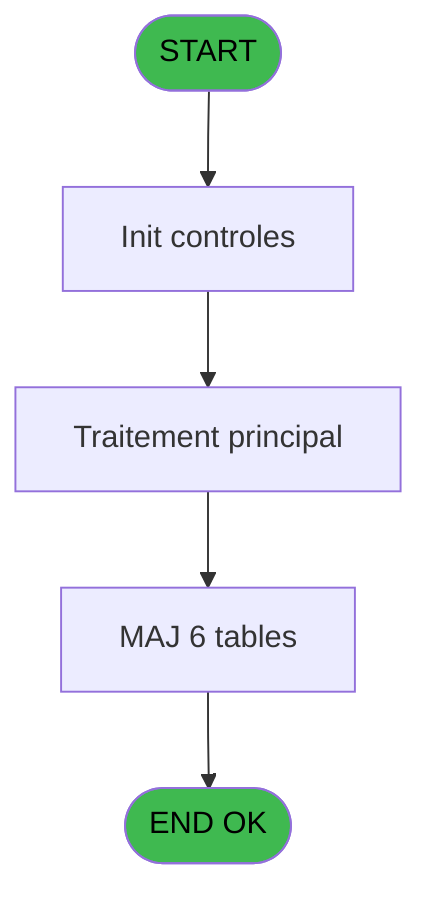
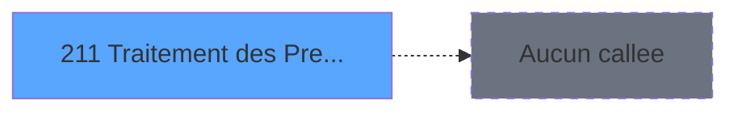

# PBG IDE 211 - Traitement des Prestations

> **Analyse**: Phases 1-4 2026-02-03 10:13 -> 10:14 (21s) | Assemblage 10:14
> **Pipeline**: V7.2 Enrichi
> **Structure**: 4 onglets (Resume | Ecrans | Donnees | Connexions)

<!-- TAB:Resume -->

## 1. FICHE D'IDENTITE

| Attribut | Valeur |
|----------|--------|
| Projet | PBG |
| IDE Position | 211 |
| Nom Programme | Traitement des Prestations |
| Fichier source | `Prg_211.xml` |
| Domaine metier | General |
| Taches | 9 (1 ecrans visibles) |
| Tables modifiees | 6 |
| Programmes appeles | 0 |

## 2. DESCRIPTION FONCTIONNELLE

**Traitement des Prestations** assure la gestion complete de ce processus, accessible depuis [Traitement des arrivants (IDE 206)](PBG-IDE-206.md).

Le flux de traitement s'organise en **2 blocs fonctionnels** :

- **Creation** (5 taches) : insertion d'enregistrements en base (mouvements, prestations)
- **Traitement** (4 taches) : traitements metier divers

**Donnees modifiees** : 6 tables en ecriture (gm-complet_______gmc, initialisation___ini, libelle_prestation, comptage_caisse, tempo_date_heure, Table_1104).

Detail : phases du traitement

#### Phase 1 : Traitement (4 taches)

- **211** - Veuillez patienter... **[[ECRAN]](#ecran-t1)**
- **211.1** - Recuperation Honey Moon
- **211.4.1** - Nouvelle
- **211.5** - get number of decimal

#### Phase 2 : Creation (5 taches)

- **211.2** - Creation Honey Moon
- **211.3** - Creation Circuit
- **211.4** - Creation Table Prestation
- **211.6** - Creation Circuit
- **211.7** - Creation Table Prestation

#### Tables impactees

| Table | Operations | Role metier |
|-------|-----------|-------------|
| Table_1104 | **W**/L (3 usages) |  |
| gm-complet_______gmc | R/**W** (2 usages) |  |
| libelle_prestation | **W** (1 usages) | Prestations/services vendus |
| tempo_date_heure | **W** (1 usages) | Table temporaire ecran |
| initialisation___ini | **W** (1 usages) |  |
| comptage_caisse | **W** (1 usages) | Sessions de caisse |

## 3. BLOCS FONCTIONNELS

### 3.1 Traitement (4 taches)

Traitements internes.

---

#### 211 - Veuillez patienter... [[ECRAN]](#ecran-t1)

**Role** : Traitement : Veuillez patienter....
**Ecran** : 429 x 68 DLU (MDI) | [Voir mockup](#ecran-t1)

3 sous-taches directes

| Tache | Nom | Bloc |
|-------|-----|------|
| [211.1](#t2) | Recuperation Honey Moon | Traitement |
| [211.4.1](#t7) | Nouvelle | Traitement |
| [211.5](#t8) | get number of decimal | Traitement |

---

#### 211.1 - Recuperation Honey Moon

**Role** : Consultation/chargement : Recuperation Honey Moon.
**Variables liees** : J (W0-Honey Moon 1), K (W0-Honey Moon 2), L (W0-Honey Moon 3), M (W0-Honey Moon 4)

---

#### 211.4.1 - Nouvelle

**Role** : Creation d'enregistrement : Nouvelle.

---

#### 211.5 - get number of decimal

**Role** : Consultation/chargement : get number of decimal.
**Variables liees** : P (V.Nombre decimal village)

### 3.2 Creation (5 taches)

Insertion de nouveaux enregistrements en base.

---

#### 211.2 - Creation Honey Moon

**Role** : Creation d'enregistrement : Creation Honey Moon.
**Variables liees** : J (W0-Honey Moon 1), K (W0-Honey Moon 2), L (W0-Honey Moon 3), M (W0-Honey Moon 4)

---

#### 211.3 - Creation Circuit

**Role** : Creation d'enregistrement : Creation Circuit.
**Variables liees** : I (W0-Ret Lien Circuit)

---

#### 211.4 - Creation Table Prestation

**Role** : Creation d'enregistrement : Creation Table Prestation.
**Variables liees** : C (P0-Nb Prestations), D (P0-New Prestation), N (e.Categorie prestation?)

---

#### 211.6 - Creation Circuit

**Role** : Creation d'enregistrement : Creation Circuit.
**Variables liees** : I (W0-Ret Lien Circuit)

---

#### 211.7 - Creation Table Prestation

**Role** : Creation d'enregistrement : Creation Table Prestation.
**Variables liees** : C (P0-Nb Prestations), D (P0-New Prestation), N (e.Categorie prestation?)

## 5. REGLES METIER

*(Aucune regle metier identifiee)*

## 6. CONTEXTE

- **Appele par**: [Traitement des arrivants (IDE 206)](PBG-IDE-206.md)
- **Appelle**: 0 programmes | **Tables**: 11 (W:6 R:3 L:4) | **Taches**: 9 | **Expressions**: 17

<!-- TAB:Ecrans -->

## 8. ECRANS

### 8.1 Forms visibles (1 / 9)

| # | Position | Tache | Nom | Type | Largeur | Hauteur | Bloc |
|---|----------|-------|-----|------|---------|---------|------|
| 1 | 211 | 211 | Veuillez patienter... | MDI | 429 | 68 | Traitement |

### 8.2 Mockups Ecrans

---

#### 211 - Veuillez patienter...
**Tache** : [211](#t1) | **Type** : MDI | **Dimensions** : 429 x 68 DLU
**Bloc** : Traitement | **Titre IDE** : Veuillez patienter...

<!-- FORM-DATA:
{
    "width":  429,
    "vFactor":  8,
    "type":  "MDI",
    "hFactor":  8,
    "controls":  [
                     {
                         "x":  1,
                         "type":  "label",
                         "var":  "",
                         "y":  0,
                         "w":  423,
                         "fmt":  "",
                         "name":  "",
                         "h":  29,
                         "color":  "",
                         "text":  "",
                         "parent":  null
                     },
                     {
                         "x":  99,
                         "type":  "label",
                         "var":  "",
                         "y":  10,
                         "w":  275,
                         "fmt":  "",
                         "name":  "",
                         "h":  8,
                         "color":  "7",
                         "text":  "Traitement des Prestations",
                         "parent":  null
                     },
                     {
                         "x":  1,
                         "type":  "label",
                         "var":  "",
                         "y":  29,
                         "w":  423,
                         "fmt":  "",
                         "name":  "",
                         "h":  37,
                         "color":  "",
                         "text":  "",
                         "parent":  null
                     },
                     {
                         "x":  9,
                         "type":  "label",
                         "var":  "",
                         "y":  41,
                         "w":  405,
                         "fmt":  "",
                         "name":  "",
                         "h":  19,
                         "color":  "",
                         "text":  "",
                         "parent":  null
                     },
                     {
                         "x":  2,
                         "type":  "image",
                         "var":  "",
                         "y":  2,
                         "w":  72,
                         "fmt":  "",
                         "name":  "",
                         "h":  25,
                         "color":  "",
                         "text":  "",
                         "parent":  null
                     },
                     {
                         "x":  12,
                         "type":  "edit",
                         "var":  "",
                         "y":  42,
                         "w":  400,
                         "fmt":  "30",
                         "name":  "",
                         "h":  17,
                         "color":  "159",
                         "text":  "",
                         "parent":  4
                     },
                     {
                         "x":  177,
                         "type":  "edit",
                         "var":  "",
                         "y":  46,
                         "w":  64,
                         "fmt":  "3 %",
                         "name":  "",
                         "h":  8,
                         "color":  "143",
                         "text":  "",
                         "parent":  1
                     }
                 ],
    "taskId":  "211",
    "height":  68
}
-->

<strong>Champs : 2 champs</strong>

| Pos (x,y) | Nom | Variable | Type |
|-----------|-----|----------|------|
| 12,42 | 30 | - | edit |
| 177,46 | 3 % | - | edit |

## 9. NAVIGATION

Ecran unique: **Veuillez patienter...**

### 9.3 Structure hierarchique (9 taches)

| Position | Tache | Type | Dimensions | Bloc |
|----------|-------|------|------------|------|
| **211.1** | [**Veuillez patienter...** (211)](#t1) [mockup](#ecran-t1) | MDI | 429x68 | Traitement |
| 211.1.1 | [Recuperation Honey Moon (211.1)](#t2) | MDI | - | |
| 211.1.2 | [Nouvelle (211.4.1)](#t7) | MDI | - | |
| 211.1.3 | [get number of decimal (211.5)](#t8) | - | - | |
| **211.2** | [**Creation Honey Moon** (211.2)](#t3) | MDI | - | Creation |
| 211.2.1 | [Creation Circuit (211.3)](#t5) | MDI | - | |
| 211.2.2 | [Creation Table Prestation (211.4)](#t6) | MDI | - | |
| 211.2.3 | [Creation Circuit (211.6)](#t11) | MDI | - | |
| 211.2.4 | [Creation Table Prestation (211.7)](#t19) | MDI | - | |

### 9.4 Algorigramme

> **Legende**: Vert = START/END OK | Rouge = END KO | Bleu = Decisions
> *Algorigramme auto-genere. Utiliser `/algorigramme` pour une synthese metier detaillee.*

<!-- TAB:Donnees -->

## 10. TABLES

### Tables utilisees (11)

| ID | Nom | Description | Type | R | W | L | Usages |
|----|-----|-------------|------|---|---|---|--------|
| 31 | gm-complet_______gmc |  | DB | R | **W** |   | 2 |
| 33 | prestations______pre | Prestations/services vendus | DB |   |   | L | 1 |
| 69 | initialisation___ini |  | DB |   | **W** |   | 1 |
| 81 | societe__________soc |  | DB | R |   |   | 1 |
| 135 | libelle_prestation | Prestations/services vendus | DB |   | **W** |   | 1 |
| 473 | comptage_caisse | Sessions de caisse | TMP |   | **W** |   | 1 |
| 569 | pointage_articles_caution | Articles et stock | TMP | R |   |   | 1 |
| 573 | tempo_ecran_mecano | Table temporaire ecran | TMP |   |   | L | 1 |
| 590 | tempo_date_heure | Table temporaire ecran | TMP |   | **W** |   | 1 |
| 1078 | Table_1078 |  | MEM |   |   | L | 1 |
| 1104 | Table_1104 |  | MEM |   | **W** | L | 3 |

### Colonnes par table (5 / 8 tables avec colonnes identifiees)

Table 31 - gm-complet_______gmc (R/**W**) - 2 usages

| Lettre | Variable | Acces | Type |
|--------|----------|-------|------|
| A | e.prestation_save? | W | Logical |
| B | e.Catégorie prestation? | W | Logical |

Table 69 - initialisation___ini (**W**) - 1 usages

*Table utilisee uniquement en Link ou aucune colonne Real identifiee dans le DataView.*

Table 81 - societe__________soc (R) - 1 usages

| Lettre | Variable | Acces | Type |
|--------|----------|-------|------|
| A | P0-Code Societe | R | Alpha |

Table 135 - libelle_prestation (**W**) - 1 usages

| Lettre | Variable | Acces | Type |
|--------|----------|-------|------|
| A | V Existe prestation | W | Logical |
| B | e.Catégorie prestation? | W | Logical |
| C | P0-Nb Prestations | W | Numeric |
| D | P0-New Prestation | W | Logical |
| N | e.Categorie prestation? | W | Logical |

Table 473 - comptage_caisse (**W**) - 1 usages

*Table utilisee uniquement en Link ou aucune colonne Real identifiee dans le DataView.*

Table 569 - pointage_articles_caution (R) - 1 usages

| Lettre | Variable | Acces | Type |
|--------|----------|-------|------|
| A | P0-Code Societe | R | Alpha |
| B | P0-Lieu de Sejour | R | Alpha |
| C | P0-Nb Prestations | R | Numeric |
| D | P0-New Prestation | R | Logical |
| E | W0-Operande | R | Numeric |
| F | W0-Operateur | R | Numeric |
| G | W0-Pourcentage | R | Numeric |
| H | W0-Calcul Pourcent | R | Numeric |
| I | W0-Ret Lien Circuit | R | Numeric |
| J | W0-Honey Moon 1 | R | Alpha |
| K | W0-Honey Moon 2 | R | Alpha |
| L | W0-Honey Moon 3 | R | Alpha |
| M | W0-Honey Moon 4 | R | Alpha |
| N | e.Categorie prestation? | R | Logical |
| O | V.Compteur | R | Numeric |
| P | V.Nombre decimal village | R | Numeric |

Table 590 - tempo_date_heure (**W**) - 1 usages

*Table utilisee uniquement en Link ou aucune colonne Real identifiee dans le DataView.*

Table 1104 - Table_1104 (**W**/L) - 3 usages

*Table utilisee uniquement en Link ou aucune colonne Real identifiee dans le DataView.*

## 11. VARIABLES

### 11.1 Variables de session (2)

Variables persistantes pendant toute la session.

| Lettre | Nom | Type | Usage dans |
|--------|-----|------|-----------|
| O | V.Compteur | Numeric | 1x session |
| P | V.Nombre decimal village | Numeric | - |

### 11.2 Autres (14)

Variables diverses.

| Lettre | Nom | Type | Usage dans |
|--------|-----|------|-----------|
| A | P0-Code Societe | Alpha | - |
| B | P0-Lieu de Sejour | Alpha | - |
| C | P0-Nb Prestations | Numeric | 2x refs |
| D | P0-New Prestation | Logical | - |
| E | W0-Operande | Numeric | - |
| F | W0-Operateur | Numeric | 2x refs |
| G | W0-Pourcentage | Numeric | - |
| H | W0-Calcul Pourcent | Numeric | 1x refs |
| I | W0-Ret Lien Circuit | Numeric | - |
| J | W0-Honey Moon 1 | Alpha | [211.1](#t2), [211.2](#t3) |
| K | W0-Honey Moon 2 | Alpha | [211.1](#t2), [211.2](#t3) |
| L | W0-Honey Moon 3 | Alpha | [211.1](#t2), [211.2](#t3) |
| M | W0-Honey Moon 4 | Alpha | [211.1](#t2), [211.2](#t3) |
| N | e.Categorie prestation? | Logical | - |

Toutes les 16 variables (liste complete)

| Cat | Lettre | Nom Variable | Type |
|-----|--------|--------------|------|
| V. | **O** | V.Compteur | Numeric |
| V. | **P** | V.Nombre decimal village | Numeric |
| Autre | **A** | P0-Code Societe | Alpha |
| Autre | **B** | P0-Lieu de Sejour | Alpha |
| Autre | **C** | P0-Nb Prestations | Numeric |
| Autre | **D** | P0-New Prestation | Logical |
| Autre | **E** | W0-Operande | Numeric |
| Autre | **F** | W0-Operateur | Numeric |
| Autre | **G** | W0-Pourcentage | Numeric |
| Autre | **H** | W0-Calcul Pourcent | Numeric |
| Autre | **I** | W0-Ret Lien Circuit | Numeric |
| Autre | **J** | W0-Honey Moon 1 | Alpha |
| Autre | **K** | W0-Honey Moon 2 | Alpha |
| Autre | **L** | W0-Honey Moon 3 | Alpha |
| Autre | **M** | W0-Honey Moon 4 | Alpha |
| Autre | **N** | e.Categorie prestation? | Logical |

## 12. EXPRESSIONS

**17 / 17 expressions decodees (100%)**

### 12.1 Repartition par type

| Type | Expressions | Regles |
|------|-------------|--------|
| CALCULATION | 8 | 0 |
| CONSTANTE | 1 | 0 |
| CAST_LOGIQUE | 1 | 0 |
| REFERENCE_VG | 1 | 0 |
| OTHER | 3 | 0 |
| CONDITION | 3 | 0 |

### 12.2 Expressions cles par type

#### CALCULATION (8 expressions)

| Type | IDE | Expression | Regle |
|------|-----|------------|-------|
| CALCULATION | 10 | `W0-Operateur [F]+1` | - |
| CALCULATION | 8 | `W0-Operateur [F]/W0-Calcul Pourcent [H]` | - |
| CALCULATION | 15 | `[BQ]+1` | - |
| CALCULATION | 14 | `CallProg('{492,-1}'PROG,DbName('{590,2}'DSOURCE))` | - |
| CALCULATION | 4 | `([BQ]/VG15)*50` | - |
| ... | | *+3 autres* | |

#### CONSTANTE (1 expressions)

| Type | IDE | Expression | Regle |
|------|-----|------------|-------|
| CONSTANTE | 2 | `''` | - |

#### CAST_LOGIQUE (1 expressions)

| Type | IDE | Expression | Regle |
|------|-----|------------|-------|
| CAST_LOGIQUE | 1 | `'FALSE'LOG` | - |

#### REFERENCE_VG (1 expressions)

| Type | IDE | Expression | Regle |
|------|-----|------------|-------|
| REFERENCE_VG | 5 | `VG20` | - |

#### OTHER (3 expressions)

| Type | IDE | Expression | Regle |
|------|-----|------------|-------|
| OTHER | 17 | `NOT([BZ])` | - |
| OTHER | 16 | `[BY]` | - |
| OTHER | 9 | `V.Compteur [O]` | - |

#### CONDITION (3 expressions)

| Type | IDE | Expression | Regle |
|------|-----|------------|-------|
| CONDITION | 12 | `Trim ([S])<>''` | - |
| CONDITION | 13 | `[AH]>'E' AND [AF]>0` | - |
| CONDITION | 11 | `[R]=W0-Honey Moon 1 [J] OR [R]=W0-Honey Moon 2 [K] OR [R]=W0-Honey Moon 3 [L] OR [R]=W0-Honey Moon 4 [M]` | - |

<!-- TAB:Connexions -->

## 13. GRAPHE D'APPELS

### 13.1 Chaine depuis Main (Callers)

Main -> ... -> [Traitement des arrivants (IDE 206)](PBG-IDE-206.md) -> **Traitement des Prestations (IDE 211)**

### 13.2 Callers

| IDE | Nom Programme | Nb Appels |
|-----|---------------|-----------|
| [206](PBG-IDE-206.md) | Traitement des arrivants | 1 |

### 13.3 Callees (programmes appeles)

### 13.4 Detail Callees avec contexte

| IDE | Nom Programme | Appels | Contexte |
|-----|---------------|--------|----------|
| - | (aucun) | - | - |

## 14. RECOMMANDATIONS MIGRATION

### 14.1 Profil du programme

| Metrique | Valeur | Impact migration |
|----------|--------|-----------------|
| Lignes de logique | 215 | Taille moyenne |
| Expressions | 17 | Peu de logique |
| Tables WRITE | 6 | Fort impact donnees |
| Sous-programmes | 0 | Peu de dependances |
| Ecrans visibles | 1 | Ecran unique ou traitement batch |
| Code desactive | 0% (0 / 215) | Code sain |
| Regles metier | 0 | Pas de regle identifiee |

### 14.2 Plan de migration par bloc

#### Traitement (4 taches: 1 ecran, 3 traitements)

- **Strategie** : Orchestrateur avec 1 ecrans (Razor/React) et 3 traitements backend (services).
- Les ecrans deviennent des composants UI, les traitements invisibles deviennent des services injectables.
- Decomposer les taches en services unitaires testables.

#### Creation (5 taches: 0 ecran, 5 traitements)

- **Strategie** : Repository pattern avec Entity Framework Core.
- Insertion via `IRepository<T>.CreateAsync()`

### 14.3 Dependances critiques

| Dependance | Type | Appels | Impact |
|------------|------|--------|--------|
| gm-complet_______gmc | Table WRITE (Database) | 1x | Schema + repository |
| initialisation___ini | Table WRITE (Database) | 1x | Schema + repository |
| libelle_prestation | Table WRITE (Database) | 1x | Schema + repository |
| comptage_caisse | Table WRITE (Temp) | 1x | Schema + repository |
| tempo_date_heure | Table WRITE (Temp) | 1x | Schema + repository |
| Table_1104 | Table WRITE (Memory) | 1x | Schema + repository |

---
*Spec DETAILED generee par Pipeline V7.2 - 2026-02-03 10:14*
