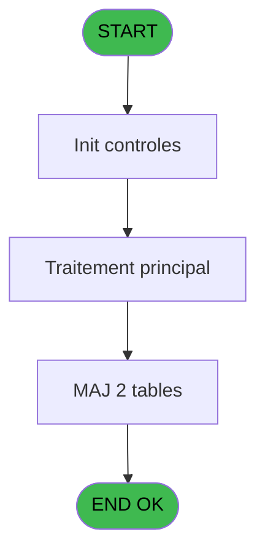
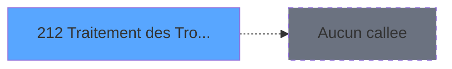

# PBG IDE 212 - Traitement des Troncons

> **Analyse**: Phases 1-4 2026-02-03 10:14 -> 10:14 (19s) | Assemblage 10:14
> **Pipeline**: V7.2 Enrichi
> **Structure**: 4 onglets (Resume | Ecrans | Donnees | Connexions)

<!-- TAB:Resume -->

## 1. FICHE D'IDENTITE

| Attribut | Valeur |
|----------|--------|
| Projet | PBG |
| IDE Position | 212 |
| Nom Programme | Traitement des Troncons |
| Fichier source | `Prg_212.xml` |
| Domaine metier | General |
| Taches | 3 (1 ecrans visibles) |
| Tables modifiees | 2 |
| Programmes appeles | 0 |

## 2. DESCRIPTION FONCTIONNELLE

**Traitement des Troncons** assure la gestion complete de ce processus, accessible depuis [Traitement des arrivants (IDE 206)](PBG-IDE-206.md).

Le flux de traitement s'organise en **2 blocs fonctionnels** :

- **Traitement** (2 taches) : traitements metier divers
- **Creation** (1 tache) : insertion d'enregistrements en base (mouvements, prestations)

**Donnees modifiees** : 2 tables en ecriture (tables_village, troncon__________tro).

Detail : phases du traitement

#### Phase 1 : Traitement (2 taches)

- **212** - Veuillez patienter **[[ECRAN]](#ecran-t1)**
- **212.2** - Création aéroports **[[ECRAN]](#ecran-t3)**

#### Phase 2 : Creation (1 tache)

- **212.1** - Creation Circuit

#### Tables impactees

| Table | Operations | Role metier |
|-------|-----------|-------------|
| troncon__________tro | **W** (1 usages) |  |
| tables_village | **W** (1 usages) |  |

## 3. BLOCS FONCTIONNELS

### 3.1 Traitement (2 taches)

Traitements internes.

---

#### 212 - Veuillez patienter [[ECRAN]](#ecran-t1)

**Role** : Traitement : Veuillez patienter.
**Ecran** : 427 x 68 DLU (MDI) | [Voir mockup](#ecran-t1)

---

#### 212.2 - Création aéroports [[ECRAN]](#ecran-t3)

**Role** : Traitement : Création aéroports.
**Ecran** : 123 x 195 DLU | [Voir mockup](#ecran-t3)

### 3.2 Creation (1 tache)

Insertion de nouveaux enregistrements en base.

---

#### 212.1 - Creation Circuit

**Role** : Creation d'enregistrement : Creation Circuit.

## 5. REGLES METIER

*(Aucune regle metier identifiee)*

## 6. CONTEXTE

- **Appele par**: [Traitement des arrivants (IDE 206)](PBG-IDE-206.md)
- **Appelle**: 0 programmes | **Tables**: 4 (W:2 R:1 L:1) | **Taches**: 3 | **Expressions**: 12

<!-- TAB:Ecrans -->

## 8. ECRANS

### 8.1 Forms visibles (1 / 3)

| # | Position | Tache | Nom | Type | Largeur | Hauteur | Bloc |
|---|----------|-------|-----|------|---------|---------|------|
| 1 | 212 | 212 | Veuillez patienter | MDI | 427 | 68 | Traitement |

### 8.2 Mockups Ecrans

---

#### 212 - Veuillez patienter
**Tache** : [212](#t1) | **Type** : MDI | **Dimensions** : 427 x 68 DLU
**Bloc** : Traitement | **Titre IDE** : Veuillez patienter

<!-- FORM-DATA:
{
    "width":  427,
    "vFactor":  8,
    "type":  "MDI",
    "hFactor":  8,
    "controls":  [
                     {
                         "x":  1,
                         "type":  "label",
                         "var":  "",
                         "y":  0,
                         "w":  423,
                         "fmt":  "",
                         "name":  "",
                         "h":  29,
                         "color":  "",
                         "text":  "",
                         "parent":  null
                     },
                     {
                         "x":  99,
                         "type":  "label",
                         "var":  "",
                         "y":  10,
                         "w":  275,
                         "fmt":  "",
                         "name":  "",
                         "h":  8,
                         "color":  "7",
                         "text":  "Traitement des Tronçons",
                         "parent":  null
                     },
                     {
                         "x":  1,
                         "type":  "label",
                         "var":  "",
                         "y":  29,
                         "w":  423,
                         "fmt":  "",
                         "name":  "",
                         "h":  37,
                         "color":  "",
                         "text":  "",
                         "parent":  null
                     },
                     {
                         "x":  9,
                         "type":  "label",
                         "var":  "",
                         "y":  41,
                         "w":  405,
                         "fmt":  "",
                         "name":  "",
                         "h":  19,
                         "color":  "",
                         "text":  "",
                         "parent":  null
                     },
                     {
                         "x":  2,
                         "type":  "image",
                         "var":  "",
                         "y":  2,
                         "w":  72,
                         "fmt":  "",
                         "name":  "",
                         "h":  25,
                         "color":  "",
                         "text":  "",
                         "parent":  null
                     },
                     {
                         "x":  12,
                         "type":  "edit",
                         "var":  "",
                         "y":  42,
                         "w":  400,
                         "fmt":  "30",
                         "name":  "",
                         "h":  17,
                         "color":  "159",
                         "text":  "",
                         "parent":  4
                     },
                     {
                         "x":  177,
                         "type":  "edit",
                         "var":  "",
                         "y":  46,
                         "w":  64,
                         "fmt":  "3 %",
                         "name":  "",
                         "h":  8,
                         "color":  "143",
                         "text":  "",
                         "parent":  1
                     }
                 ],
    "taskId":  "212",
    "height":  68
}
-->

<strong>Champs : 2 champs</strong>

| Pos (x,y) | Nom | Variable | Type |
|-----------|-----|----------|------|
| 12,42 | 30 | - | edit |
| 177,46 | 3 % | - | edit |

## 9. NAVIGATION

Ecran unique: **Veuillez patienter**

### 9.3 Structure hierarchique (3 taches)

| Position | Tache | Type | Dimensions | Bloc |
|----------|-------|------|------------|------|
| **212.1** | [**Veuillez patienter** (212)](#t1) [mockup](#ecran-t1) | MDI | 427x68 | Traitement |
| 212.1.1 | [Création aéroports (212.2)](#t3) [mockup](#ecran-t3) | - | 123x195 | |
| **212.2** | [**Creation Circuit** (212.1)](#t2) | MDI | - | Creation |

### 9.4 Algorigramme

> **Legende**: Vert = START/END OK | Rouge = END KO | Bleu = Decisions
> *Algorigramme auto-genere. Utiliser `/algorigramme` pour une synthese metier detaillee.*

<!-- TAB:Donnees -->

## 10. TABLES

### Tables utilisees (4)

| ID | Nom | Description | Type | R | W | L | Usages |
|----|-----|-------------|------|---|---|---|--------|
| 113 | tables_village |  | DB |   | **W** |   | 1 |
| 167 | troncon__________tro |  | DB |   | **W** |   | 1 |
| 569 | pointage_articles_caution | Articles et stock | TMP | R |   |   | 1 |
| 576 | temp_recap_sessions | Sessions de caisse | TMP |   |   | L | 1 |

### Colonnes par table (1 / 3 tables avec colonnes identifiees)

Table 113 - tables_village (**W**) - 1 usages

*Table utilisee uniquement en Link ou aucune colonne Real identifiee dans le DataView.*

Table 167 - troncon__________tro (**W**) - 1 usages

*Table utilisee uniquement en Link ou aucune colonne Real identifiee dans le DataView.*

Table 569 - pointage_articles_caution (R) - 1 usages

| Lettre | Variable | Acces | Type |
|--------|----------|-------|------|
| A | P0-Code Societe | R | Alpha |
| B | P0-Lieu de Sejour | R | Alpha |
| C | P0-Nb Tronçons | R | Numeric |
| D | W0-Operande | R | Numeric |
| E | W0-Operateur | R | Numeric |
| F | W0-Pourcentage | R | Numeric |
| G | W0-Calcul Pourcent | R | Numeric |
| H | V.Compteur | R | Numeric |

## 11. VARIABLES

### 11.1 Variables de session (1)

Variables persistantes pendant toute la session.

| Lettre | Nom | Type | Usage dans |
|--------|-----|------|-----------|
| H | V.Compteur | Numeric | - |

### 11.2 Autres (7)

Variables diverses.

| Lettre | Nom | Type | Usage dans |
|--------|-----|------|-----------|
| A | P0-Code Societe | Alpha | - |
| B | P0-Lieu de Sejour | Alpha | - |
| C | P0-Nb Tronçons | Numeric | 2x refs |
| D | W0-Operande | Numeric | - |
| E | W0-Operateur | Numeric | 2x refs |
| F | W0-Pourcentage | Numeric | - |
| G | W0-Calcul Pourcent | Numeric | 1x refs |

## 12. EXPRESSIONS

**12 / 12 expressions decodees (100%)**

### 12.1 Repartition par type

| Type | Expressions | Regles |
|------|-------------|--------|
| CALCULATION | 7 | 0 |
| CONSTANTE | 1 | 0 |
| REFERENCE_VG | 2 | 0 |
| OTHER | 1 | 0 |
| CONDITION | 1 | 0 |

### 12.2 Expressions cles par type

#### CALCULATION (7 expressions)

| Type | IDE | Expression | Regle |
|------|-----|------------|-------|
| CALCULATION | 7 | `W0-Operateur [E]/W0-Calcul Pourcent [G]` | - |
| CALCULATION | 9 | `W0-Operateur [E]+1` | - |
| CALCULATION | 11 | `[BI]+1` | - |
| CALCULATION | 6 | `P0-Nb Tronçons [C]/98` | - |
| CALCULATION | 2 | `([BI]/VG16)*100` | - |
| ... | | *+2 autres* | |

#### CONSTANTE (1 expressions)

| Type | IDE | Expression | Regle |
|------|-----|------------|-------|
| CONSTANTE | 1 | `''` | - |

#### REFERENCE_VG (2 expressions)

| Type | IDE | Expression | Regle |
|------|-----|------------|-------|
| REFERENCE_VG | 12 | `VG76` | - |
| REFERENCE_VG | 4 | `VG20` | - |

#### OTHER (1 expressions)

| Type | IDE | Expression | Regle |
|------|-----|------------|-------|
| OTHER | 8 | `[I]` | - |

#### CONDITION (1 expressions)

| Type | IDE | Expression | Regle |
|------|-----|------------|-------|
| CONDITION | 10 | `[AD]>'E' AND [AB]>0` | - |

<!-- TAB:Connexions -->

## 13. GRAPHE D'APPELS

### 13.1 Chaine depuis Main (Callers)

Main -> ... -> [Traitement des arrivants (IDE 206)](PBG-IDE-206.md) -> **Traitement des Troncons (IDE 212)**

### 13.2 Callers

| IDE | Nom Programme | Nb Appels |
|-----|---------------|-----------|
| [206](PBG-IDE-206.md) | Traitement des arrivants | 1 |

### 13.3 Callees (programmes appeles)

### 13.4 Detail Callees avec contexte

| IDE | Nom Programme | Appels | Contexte |
|-----|---------------|--------|----------|
| - | (aucun) | - | - |

## 14. RECOMMANDATIONS MIGRATION

### 14.1 Profil du programme

| Metrique | Valeur | Impact migration |
|----------|--------|-----------------|
| Lignes de logique | 100 | Programme compact |
| Expressions | 12 | Peu de logique |
| Tables WRITE | 2 | Impact faible |
| Sous-programmes | 0 | Peu de dependances |
| Ecrans visibles | 1 | Ecran unique ou traitement batch |
| Code desactive | 0% (0 / 100) | Code sain |
| Regles metier | 0 | Pas de regle identifiee |

### 14.2 Plan de migration par bloc

#### Traitement (2 taches: 2 ecrans, 0 traitement)

- **Strategie** : 2 composant(s) UI (Razor/React) avec formulaires et validation.
- Decomposer les taches en services unitaires testables.

#### Creation (1 tache: 0 ecran, 1 traitement)

- **Strategie** : Repository pattern avec Entity Framework Core.
- Insertion via `IRepository<T>.CreateAsync()`

### 14.3 Dependances critiques

| Dependance | Type | Appels | Impact |
|------------|------|--------|--------|
| tables_village | Table WRITE (Database) | 1x | Schema + repository |
| troncon__________tro | Table WRITE (Database) | 1x | Schema + repository |

---
*Spec DETAILED generee par Pipeline V7.2 - 2026-02-03 10:14*
