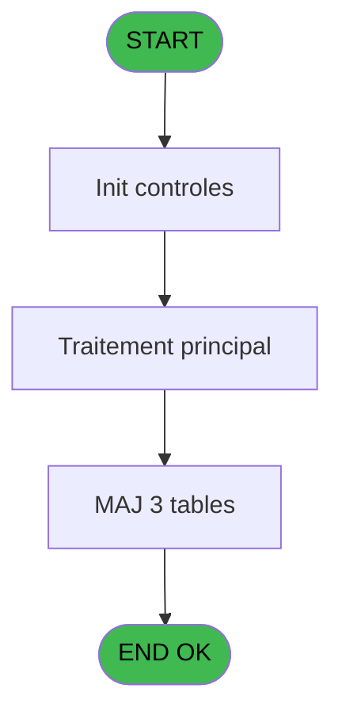

# PBG IDE 215 - Traitement des Sejours

> **Analyse**: Phases 1-4 2026-02-03 10:15 -> 10:16 (23s) | Assemblage 10:16
> **Pipeline**: V7.2 Enrichi
> **Structure**: 4 onglets (Resume | Ecrans | Donnees | Connexions)

<!-- TAB:Resume -->

## 1. FICHE D'IDENTITE

| Attribut | Valeur |
|----------|--------|
| Projet | PBG |
| IDE Position | 215 |
| Nom Programme | Traitement des Sejours |
| Fichier source | `Prg_215.xml` |
| Domaine metier | General |
| Taches | 9 (1 ecrans visibles) |
| Tables modifiees | 3 |
| Programmes appeles | 1 |

## 2. DESCRIPTION FONCTIONNELLE

**Traitement des Sejours** assure la gestion complete de ce processus, accessible depuis [Traitement des arrivants (IDE 206)](PBG-IDE-206.md).

Le flux de traitement s'organise en **2 blocs fonctionnels** :

- **Traitement** (5 taches) : traitements metier divers
- **Creation** (4 taches) : insertion d'enregistrements en base (mouvements, prestations)

**Donnees modifiees** : 3 tables en ecriture (voyages__________voy, compte_gm________cgm, pointage_articles_caution).

Detail : phases du traitement

#### Phase 1 : Traitement (5 taches)

- **215** - Veuillez patienter... **[[ECRAN]](#ecran-t1)**
- **215.1** - Heure Diff
- **215.2** - Determination Periodes
- **215.3** - Traitement Sejour **[[ECRAN]](#ecran-t8)**
- **215.4** - Determination Periodes

Delegue a : [Suppression vol doublons (IDE 339)](PBG-IDE-339.md)

#### Phase 2 : Creation (4 taches)

- **215.2.1** - Creation Voyage Aller
- **215.2.2** - Creation Voyage Aller
- **215.2.3** - Creation Voyage Aller
- **215.2.4** - Creation Voyage Aller

#### Tables impactees

| Table | Operations | Role metier |
|-------|-----------|-------------|
| voyages__________voy | **W** (4 usages) |  |
| pointage_articles_caution | **W** (1 usages) | Articles et stock |
| compte_gm________cgm | **W** (1 usages) | Comptes GM (generaux) |

## 3. BLOCS FONCTIONNELS

### 3.1 Traitement (5 taches)

Traitements internes.

---

#### 215 - Veuillez patienter... [[ECRAN]](#ecran-t1)

**Role** : Traitement : Veuillez patienter....
**Ecran** : 429 x 68 DLU (MDI) | [Voir mockup](#ecran-t1)

4 sous-taches directes

| Tache | Nom | Bloc |
|-------|-----|------|
| [215.1](#t2) | Heure Diff | Traitement |
| [215.2](#t3) | Determination Periodes | Traitement |
| [215.3](#t8) | Traitement Sejour **[[ECRAN]](#ecran-t8)** | Traitement |
| [215.4](#t9) | Determination Periodes | Traitement |

**Delegue a** : [Suppression vol doublons (IDE 339)](PBG-IDE-339.md)

---

#### 215.1 - Heure Diff

**Role** : Traitement : Heure Diff.
**Variables liees** : H (W0 Heure diff aller -1), I (W0 Heure diff retour)
**Delegue a** : [Suppression vol doublons (IDE 339)](PBG-IDE-339.md)

---

#### 215.2 - Determination Periodes

**Role** : Traitement : Determination Periodes.
**Delegue a** : [Suppression vol doublons (IDE 339)](PBG-IDE-339.md)

---

#### 215.3 - Traitement Sejour [[ECRAN]](#ecran-t8)

**Role** : Traitement : Traitement Sejour.
**Ecran** : 40 x 8 DLU (Modal) | [Voir mockup](#ecran-t8)
**Variables liees** : B (P0-Lieu de Sejour)
**Delegue a** : [Suppression vol doublons (IDE 339)](PBG-IDE-339.md)

---

#### 215.4 - Determination Periodes

**Role** : Traitement : Determination Periodes.
**Delegue a** : [Suppression vol doublons (IDE 339)](PBG-IDE-339.md)

### 3.2 Creation (4 taches)

Insertion de nouveaux enregistrements en base.

---

#### 215.2.1 - Creation Voyage Aller

**Role** : Creation d'enregistrement : Creation Voyage Aller.
**Variables liees** : H (W0 Heure diff aller -1)

---

#### 215.2.2 - Creation Voyage Aller

**Role** : Creation d'enregistrement : Creation Voyage Aller.
**Variables liees** : H (W0 Heure diff aller -1)

---

#### 215.2.3 - Creation Voyage Aller

**Role** : Creation d'enregistrement : Creation Voyage Aller.
**Variables liees** : H (W0 Heure diff aller -1)

---

#### 215.2.4 - Creation Voyage Aller

**Role** : Creation d'enregistrement : Creation Voyage Aller.
**Variables liees** : H (W0 Heure diff aller -1)

## 5. REGLES METIER

*(Aucune regle metier identifiee)*

## 6. CONTEXTE

- **Appele par**: [Traitement des arrivants (IDE 206)](PBG-IDE-206.md)
- **Appelle**: 1 programmes | **Tables**: 8 (W:3 R:2 L:3) | **Taches**: 9 | **Expressions**: 10

<!-- TAB:Ecrans -->

## 8. ECRANS

### 8.1 Forms visibles (1 / 9)

| # | Position | Tache | Nom | Type | Largeur | Hauteur | Bloc |
|---|----------|-------|-----|------|---------|---------|------|
| 1 | 215 | 215 | Veuillez patienter... | MDI | 429 | 68 | Traitement |

### 8.2 Mockups Ecrans

---

#### 215 - Veuillez patienter...
**Tache** : [215](#t1) | **Type** : MDI | **Dimensions** : 429 x 68 DLU
**Bloc** : Traitement | **Titre IDE** : Veuillez patienter...

<!-- FORM-DATA:
{
    "width":  429,
    "vFactor":  8,
    "type":  "MDI",
    "hFactor":  8,
    "controls":  [
                     {
                         "x":  1,
                         "type":  "label",
                         "var":  "",
                         "y":  0,
                         "w":  423,
                         "fmt":  "",
                         "name":  "",
                         "h":  29,
                         "color":  "",
                         "text":  "",
                         "parent":  null
                     },
                     {
                         "x":  99,
                         "type":  "label",
                         "var":  "",
                         "y":  10,
                         "w":  275,
                         "fmt":  "",
                         "name":  "",
                         "h":  8,
                         "color":  "7",
                         "text":  "Traitement des Sejours",
                         "parent":  null
                     },
                     {
                         "x":  1,
                         "type":  "label",
                         "var":  "",
                         "y":  29,
                         "w":  423,
                         "fmt":  "",
                         "name":  "",
                         "h":  37,
                         "color":  "",
                         "text":  "",
                         "parent":  null
                     },
                     {
                         "x":  9,
                         "type":  "label",
                         "var":  "",
                         "y":  41,
                         "w":  405,
                         "fmt":  "",
                         "name":  "",
                         "h":  19,
                         "color":  "",
                         "text":  "",
                         "parent":  null
                     },
                     {
                         "x":  2,
                         "type":  "image",
                         "var":  "",
                         "y":  2,
                         "w":  72,
                         "fmt":  "",
                         "name":  "",
                         "h":  25,
                         "color":  "",
                         "text":  "",
                         "parent":  null
                     },
                     {
                         "x":  12,
                         "type":  "edit",
                         "var":  "",
                         "y":  42,
                         "w":  400,
                         "fmt":  "30",
                         "name":  "",
                         "h":  17,
                         "color":  "159",
                         "text":  "",
                         "parent":  4
                     },
                     {
                         "x":  177,
                         "type":  "edit",
                         "var":  "",
                         "y":  46,
                         "w":  64,
                         "fmt":  "3 %",
                         "name":  "",
                         "h":  8,
                         "color":  "143",
                         "text":  "",
                         "parent":  1
                     }
                 ],
    "taskId":  "215",
    "height":  68
}
-->

<strong>Champs : 2 champs</strong>

| Pos (x,y) | Nom | Variable | Type |
|-----------|-----|----------|------|
| 12,42 | 30 | - | edit |
| 177,46 | 3 % | - | edit |

## 9. NAVIGATION

Ecran unique: **Veuillez patienter...**

### 9.3 Structure hierarchique (9 taches)

| Position | Tache | Type | Dimensions | Bloc |
|----------|-------|------|------------|------|
| **215.1** | [**Veuillez patienter...** (215)](#t1) [mockup](#ecran-t1) | MDI | 429x68 | Traitement |
| 215.1.1 | [Heure Diff (215.1)](#t2) | MDI | - | |
| 215.1.2 | [Determination Periodes (215.2)](#t3) | MDI | - | |
| 215.1.3 | [Traitement Sejour (215.3)](#t8) [mockup](#ecran-t8) | Modal | 40x8 | |
| 215.1.4 | [Determination Periodes (215.4)](#t9) | MDI | - | |
| **215.2** | [**Creation Voyage Aller** (215.2.1)](#t4) | MDI | - | Creation |
| 215.2.1 | [Creation Voyage Aller (215.2.2)](#t5) | MDI | - | |
| 215.2.2 | [Creation Voyage Aller (215.2.3)](#t6) | MDI | - | |
| 215.2.3 | [Creation Voyage Aller (215.2.4)](#t7) | MDI | - | |

### 9.4 Algorigramme

> **Legende**: Vert = START/END OK | Rouge = END KO | Bleu = Decisions
> *Algorigramme auto-genere. Utiliser `/algorigramme` pour une synthese metier detaillee.*

<!-- TAB:Donnees -->

## 10. TABLES

### Tables utilisees (8)

| ID | Nom | Description | Type | R | W | L | Usages |
|----|-----|-------------|------|---|---|---|--------|
| 29 | voyages__________voy |  | DB |   | **W** |   | 4 |
| 34 | hebergement______heb | Hebergement (chambres) | DB | R |   |   | 2 |
| 47 | compte_gm________cgm | Comptes GM (generaux) | DB |   | **W** |   | 1 |
| 113 | tables_village |  | DB | R |   |   | 1 |
| 132 | code_vol_________vot |  | DB |   |   | L | 4 |
| 569 | pointage_articles_caution | Articles et stock | TMP |   | **W** |   | 1 |
| 571 | inter_prestation_inp | Prestations/services vendus | TMP |   |   | L | 1 |
| 576 | temp_recap_sessions | Sessions de caisse | TMP |   |   | L | 2 |

### Colonnes par table (4 / 5 tables avec colonnes identifiees)

Table 29 - voyages__________voy (**W**) - 4 usages

*Table utilisee uniquement en Link ou aucune colonne Real identifiee dans le DataView.*

Table 34 - hebergement______heb (R) - 2 usages

| Lettre | Variable | Acces | Type |
|--------|----------|-------|------|
| A | v.compagnie Aller | R | Unicode |
| B | v.compagnie Aller Differe -1 | R | Unicode |
| C | v.compagnie Aller Differe +1 | R | Unicode |
| D | W1 Vol Retour ? | R | Numeric |
| E | v.compagnie Retour | R | Unicode |
| F | v.compagnie | R | Unicode |
| G | W1 Vol Aller ? | R | Numeric |
| H | W1 Vol Aller Dif -1? | R | Numeric |
| I | W1 Vol Aller Dif +1? | R | Numeric |
| J | W1 Vol Retour Dif ? | R | Numeric |

Table 47 - compte_gm________cgm (**W**) - 1 usages

| Lettre | Variable | Acces | Type |
|--------|----------|-------|------|
| M | V.Compteur | W | Numeric |

Table 113 - tables_village (R) - 1 usages

*Table utilisee uniquement en Link ou aucune colonne Real identifiee dans le DataView.*

Table 569 - pointage_articles_caution (**W**) - 1 usages

| Lettre | Variable | Acces | Type |
|--------|----------|-------|------|
| A | P0-Code Societe | W | Alpha |
| B | P0-Lieu de Sejour | W | Alpha |
| C | P0-Nb Arrivants | W | Numeric |
| D | W0-Operande | W | Numeric |
| E | W0-Operateur | W | Numeric |
| F | W0-Pourcentage | W | Numeric |
| G | W0-Calcul Pourcent | W | Numeric |
| H | W0 Heure diff aller -1 | W | Numeric |
| I | W0 Heure diff retour | W | Numeric |
| J | W0-Date Debut | W | Date |
| K | W0-Date Fin | W | Date |
| L | W0-Alerte | W | Alpha |
| M | V.Compteur | W | Numeric |

## 11. VARIABLES

### 11.1 Variables de session (1)

Variables persistantes pendant toute la session.

| Lettre | Nom | Type | Usage dans |
|--------|-----|------|-----------|
| M | V.Compteur | Numeric | - |

### 11.2 Variables de travail (2)

Variables internes au programme.

| Lettre | Nom | Type | Usage dans |
|--------|-----|------|-----------|
| H | W0 Heure diff aller -1 | Numeric | - |
| I | W0 Heure diff retour | Numeric | - |

### 11.3 Autres (10)

Variables diverses.

| Lettre | Nom | Type | Usage dans |
|--------|-----|------|-----------|
| A | P0-Code Societe | Alpha | - |
| B | P0-Lieu de Sejour | Alpha | - |
| C | P0-Nb Arrivants | Numeric | - |
| D | W0-Operande | Numeric | - |
| E | W0-Operateur | Numeric | - |
| F | W0-Pourcentage | Numeric | - |
| G | W0-Calcul Pourcent | Numeric | - |
| J | W0-Date Debut | Date | - |
| K | W0-Date Fin | Date | - |
| L | W0-Alerte | Alpha | - |

## 12. EXPRESSIONS

**10 / 10 expressions decodees (100%)**

### 12.1 Repartition par type

| Type | Expressions | Regles |
|------|-------------|--------|
| CALCULATION | 3 | 0 |
| CONSTANTE | 4 | 0 |
| REFERENCE_VG | 1 | 0 |
| OTHER | 1 | 0 |
| CAST_LOGIQUE | 1 | 0 |

### 12.2 Expressions cles par type

#### CALCULATION (3 expressions)

| Type | IDE | Expression | Regle |
|------|-----|------------|-------|
| CALCULATION | 8 | `[X]+1` | - |
| CALCULATION | 3 | `([X]/VG1)*50` | - |
| CALCULATION | 2 | `([X]/VG1)*100` | - |

#### CONSTANTE (4 expressions)

| Type | IDE | Expression | Regle |
|------|-----|------------|-------|
| CONSTANTE | 6 | `'I'` | - |
| CONSTANTE | 9 | `1` | - |
| CONSTANTE | 1 | `''` | - |
| CONSTANTE | 5 | `'F'` | - |

#### REFERENCE_VG (1 expressions)

| Type | IDE | Expression | Regle |
|------|-----|------------|-------|
| REFERENCE_VG | 4 | `VG20` | - |

#### OTHER (1 expressions)

| Type | IDE | Expression | Regle |
|------|-----|------------|-------|
| OTHER | 7 | `[O]` | - |

#### CAST_LOGIQUE (1 expressions)

| Type | IDE | Expression | Regle |
|------|-----|------------|-------|
| CAST_LOGIQUE | 10 | `'TRUE'LOG` | - |

<!-- TAB:Connexions -->

## 13. GRAPHE D'APPELS

### 13.1 Chaine depuis Main (Callers)

Main -> ... -> [Traitement des arrivants (IDE 206)](PBG-IDE-206.md) -> **Traitement des Sejours (IDE 215)**

### 13.2 Callers

| IDE | Nom Programme | Nb Appels |
|-----|---------------|-----------|
| [206](PBG-IDE-206.md) | Traitement des arrivants | 1 |

### 13.3 Callees (programmes appeles)

### 13.4 Detail Callees avec contexte

| IDE | Nom Programme | Appels | Contexte |
|-----|---------------|--------|----------|
| [339](PBG-IDE-339.md) | Suppression vol doublons | 1 | Sous-programme |

## 14. RECOMMANDATIONS MIGRATION

### 14.1 Profil du programme

| Metrique | Valeur | Impact migration |
|----------|--------|-----------------|
| Lignes de logique | 298 | Taille moyenne |
| Expressions | 10 | Peu de logique |
| Tables WRITE | 3 | Impact modere |
| Sous-programmes | 1 | Peu de dependances |
| Ecrans visibles | 1 | Ecran unique ou traitement batch |
| Code desactive | 1% (3 / 298) | Code sain |
| Regles metier | 0 | Pas de regle identifiee |

### 14.2 Plan de migration par bloc

#### Traitement (5 taches: 2 ecrans, 3 traitements)

- **Strategie** : Orchestrateur avec 2 ecrans (Razor/React) et 3 traitements backend (services).
- Les ecrans deviennent des composants UI, les traitements invisibles deviennent des services injectables.
- 1 sous-programme(s) a migrer ou a reutiliser depuis les services existants.
- Decomposer les taches en services unitaires testables.

#### Creation (4 taches: 0 ecran, 4 traitements)

- **Strategie** : Repository pattern avec Entity Framework Core.
- Insertion via `IRepository<T>.CreateAsync()`

### 14.3 Dependances critiques

| Dependance | Type | Appels | Impact |
|------------|------|--------|--------|
| voyages__________voy | Table WRITE (Database) | 4x | Schema + repository |
| compte_gm________cgm | Table WRITE (Database) | 1x | Schema + repository |
| pointage_articles_caution | Table WRITE (Temp) | 1x | Schema + repository |
| [Suppression vol doublons (IDE 339)](PBG-IDE-339.md) | Sous-programme | 1x | Normale - Sous-programme |

---
*Spec DETAILED generee par Pipeline V7.2 - 2026-02-03 10:16*
