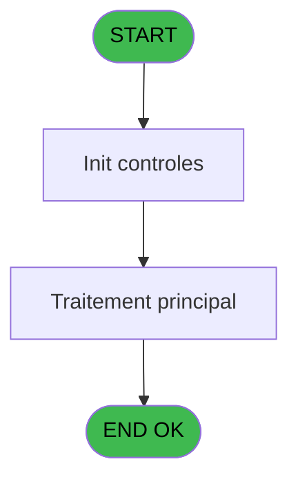

# PBG IDE 22 - Edition des comptes non logés

> **Analyse**: Phases 1-4 2026-02-03 01:09 -> 01:10 (39s) | Assemblage 01:10
> **Pipeline**: V7.2 Enrichi
> **Structure**: 4 onglets (Resume | Ecrans | Donnees | Connexions)

<!-- TAB:Resume -->

## 1. FICHE D'IDENTITE

| Attribut | Valeur |
|----------|--------|
| Projet | PBG |
| IDE Position | 22 |
| Nom Programme | Edition des comptes non logés |
| Fichier source | `Prg_22.xml` |
| Domaine metier | Comptabilite |
| Taches | 1 (0 ecrans visibles) |
| Tables modifiees | 0 |
| Programmes appeles | 0 |

## 2. DESCRIPTION FONCTIONNELLE

**Edition des comptes non logés** assure la gestion complete de ce processus, accessible depuis [Affec manuelle chambre (IDE 21)](PBG-IDE-21.md).

Le flux de traitement s'organise en **1 blocs fonctionnels** :

- **Impression** (1 tache) : generation de tickets et documents

**Logique metier** : 1 regles identifiees couvrant conditions metier.

## 3. BLOCS FONCTIONNELS

### 3.1 Impression (1 tache)

Generation des documents et tickets.

---

#### 22 - Edition des comptes non logés

**Role** : Generation du document : Edition des comptes non logés.

## 5. REGLES METIER

1 regles identifiees:

### Autres (1 regles)

#### [RM-001] Si [CU]='0' alors Fill('_' sinon 10),DStr([D],'DD/MM/YYYY'))

| Element | Detail |
|---------|--------|
| **Condition** | `[CU]='0'` |
| **Si vrai** | Fill('_' |
| **Si faux** | 10),DStr([D],'DD/MM/YYYY')) |
| **Expression source** | Expression 11 : `IF([CU]='0',Fill('_',10),DStr([D],'DD/MM/YYYY'))` |
| **Exemple** | Si [CU]='0' → Fill('_'. Sinon → 10),DStr([D],'DD/MM/YYYY')) |

## 6. CONTEXTE

- **Appele par**: [Affec manuelle chambre (IDE 21)](PBG-IDE-21.md)
- **Appelle**: 0 programmes | **Tables**: 4 (W:0 R:1 L:3) | **Taches**: 1 | **Expressions**: 22

<!-- TAB:Ecrans -->

## 8. ECRANS

*(Programme sans ecran visible)*

## 9. NAVIGATION

### 9.3 Structure hierarchique (1 tache)

| Position | Tache | Type | Dimensions | Bloc |
|----------|-------|------|------------|------|
| **22.1** | [**Edition des comptes non logés** (22)](#t1) | MDI | - | Impression |

### 9.4 Algorigramme

> **Legende**: Vert = START/END OK | Rouge = END KO | Bleu = Decisions
> *Algorigramme auto-genere. Utiliser `/algorigramme` pour une synthese metier detaillee.*

<!-- TAB:Donnees -->

## 10. TABLES

### Tables utilisees (4)

| ID | Nom | Description | Type | R | W | L | Usages |
|----|-----|-------------|------|---|---|---|--------|
| 591 | tempo_ecran_police | Table temporaire ecran | TMP | R |   |   | 1 |
| 738 | pv_selling_unit |  | DB |   |   | L | 1 |
| 820 | Commentaire supprime |  | DB |   |   | L | 1 |
| 846 | stat_lieu_vente | Statistiques point de vente | TMP |   |   | L | 1 |

### Colonnes par table (1 / 1 tables avec colonnes identifiees)

Table 591 - tempo_ecran_police (R) - 1 usages

| Lettre | Variable | Acces | Type |
|--------|----------|-------|------|
| A | P.Date debut | R | Date |
| B | P.Date fin | R | Date |

## 11. VARIABLES

### 11.1 Parametres entrants (2)

Variables recues du programme appelant ([Affec manuelle chambre (IDE 21)](PBG-IDE-21.md)).

| Lettre | Nom | Type | Usage dans |
|--------|-----|------|-----------|
| A | P.Date debut | Date | - |
| B | P.Date fin | Date | - |

## 12. EXPRESSIONS

**22 / 22 expressions decodees (100%)**

### 12.1 Repartition par type

| Type | Expressions | Regles |
|------|-------------|--------|
| CONDITION | 13 | 5 |
| DATE | 1 | 0 |
| OTHER | 6 | 0 |
| STRING | 2 | 0 |

### 12.2 Expressions cles par type

#### CONDITION (13 expressions)

| Type | IDE | Expression | Regle |
|------|-----|------------|-------|
| CONDITION | 11 | `IF([CU]='0',Fill('_',10),DStr([D],'DD/MM/YYYY'))` | [RM-001](#rm-RM-001) |
| CONDITION | 20 | `IF([CU]='0',Fill('_',4),[CD])` | - |
| CONDITION | 19 | `IF([CU]='0','_',[CC])` | - |
| CONDITION | 18 | `IF([CU]='0',Fill('_',25),IF(VG41,[DB],[N]))` | - |
| CONDITION | 1 | `INIGet ('[MAGIC_LOGICAL_NAMES]preview')='O'` | - |
| ... | | *+8 autres* | |

#### DATE (1 expressions)

| Type | IDE | Expression | Regle |
|------|-----|------------|-------|
| DATE | 4 | `Date ()` | - |

#### OTHER (6 expressions)

| Type | IDE | Expression | Regle |
|------|-----|------------|-------|
| OTHER | 6 | `[CB]` | - |
| OTHER | 7 | `[CR]` | - |
| OTHER | 8 | `[CX]` | - |
| OTHER | 2 | `SetCrsr (2)` | - |
| OTHER | 3 | `SetCrsr (1)` | - |
| ... | | *+1 autres* | |

#### STRING (2 expressions)

| Type | IDE | Expression | Regle |
|------|-----|------------|-------|
| STRING | 10 | `Val([CV],'3')` | - |
| STRING | 9 | `Val([CU],'9')` | - |

### 12.3 Toutes les expressions (22)

Voir les 22 expressions

#### CONDITION (13)

| IDE | Expression Decodee |
|-----|-------------------|
| 11 | `IF([CU]='0',Fill('_',10),DStr([D],'DD/MM/YYYY'))` |
| 12 | `IF([CU]='0',Fill('_',30),[F])` |
| 13 | `IF([CU]='0',Fill('_',10),[G])` |
| 14 | `IF([CU]='0',Fill('_',2),[H])` |
| 15 | `IF([CU]='0',Fill('_',10),DStr([I],'DD/MM/YYYY'))` |
| 16 | `IF([CU]='0',Fill('_',2),[J])` |
| 17 | `IF([CU]='0',Fill('_',6),[CA])` |
| 18 | `IF([CU]='0',Fill('_',25),IF(VG41,[DB],[N]))` |
| 19 | `IF([CU]='0','_',[CC])` |
| 20 | `IF([CU]='0',Fill('_',4),[CD])` |
| 21 | `IF([CU]='0',Fill('_',9),Str([BY],'9P0'))` |
| 22 | `IF([CU]='0',Fill('_',3),Str([BZ],'3P0'))` |
| 1 | `INIGet ('[MAGIC_LOGICAL_NAMES]preview')='O'` |

#### DATE (1)

| IDE | Expression Decodee |
|-----|-------------------|
| 4 | `Date ()` |

#### OTHER (6)

| IDE | Expression Decodee |
|-----|-------------------|
| 2 | `SetCrsr (2)` |
| 3 | `SetCrsr (1)` |
| 5 | `GetParam('CODELANGUE')` |
| 6 | `[CB]` |
| 7 | `[CR]` |
| 8 | `[CX]` |

#### STRING (2)

| IDE | Expression Decodee |
|-----|-------------------|
| 9 | `Val([CU],'9')` |
| 10 | `Val([CV],'3')` |

<!-- TAB:Connexions -->

## 13. GRAPHE D'APPELS

### 13.1 Chaine depuis Main (Callers)

Main -> ... -> [Affec manuelle chambre (IDE 21)](PBG-IDE-21.md) -> **Edition des comptes non logés (IDE 22)**

### 13.2 Callers

| IDE | Nom Programme | Nb Appels |
|-----|---------------|-----------|
| [21](PBG-IDE-21.md) | Affec manuelle chambre | 1 |

### 13.3 Callees (programmes appeles)

### 13.4 Detail Callees avec contexte

| IDE | Nom Programme | Appels | Contexte |
|-----|---------------|--------|----------|
| - | (aucun) | - | - |

## 14. RECOMMANDATIONS MIGRATION

### 14.1 Profil du programme

| Metrique | Valeur | Impact migration |
|----------|--------|-----------------|
| Lignes de logique | 46 | Programme compact |
| Expressions | 22 | Peu de logique |
| Tables WRITE | 0 | Impact faible |
| Sous-programmes | 0 | Peu de dependances |
| Ecrans visibles | 0 | Ecran unique ou traitement batch |
| Code desactive | 0% (0 / 46) | Code sain |
| Regles metier | 1 | Quelques regles a preserver |

### 14.2 Plan de migration par bloc

#### Impression (1 tache: 0 ecran, 1 traitement)

- **Strategie** : Templates HTML -> PDF via wkhtmltopdf ou Puppeteer.
- `PrintService` injectable avec choix imprimante

### 14.3 Dependances critiques

| Dependance | Type | Appels | Impact |
|------------|------|--------|--------|

---
*Spec DETAILED generee par Pipeline V7.2 - 2026-02-03 01:10*
