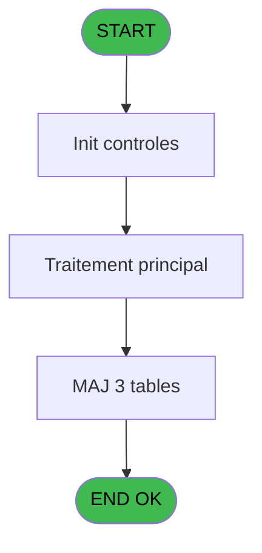
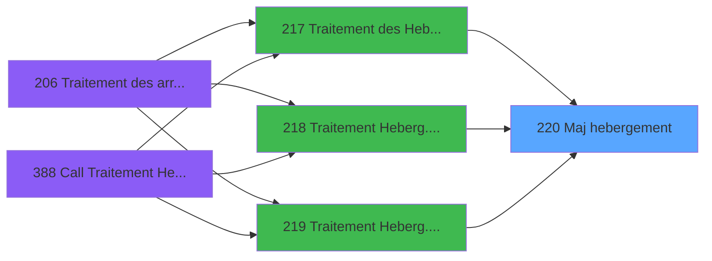

# PBG IDE 220 - Maj hebergement

> **Analyse**: Phases 1-4 2026-02-03 10:18 -> 10:18 (19s) | Assemblage 10:18
> **Pipeline**: V7.2 Enrichi
> **Structure**: 4 onglets (Resume | Ecrans | Donnees | Connexions)

<!-- TAB:Resume -->

## 1. FICHE D'IDENTITE

| Attribut | Valeur |
|----------|--------|
| Projet | PBG |
| IDE Position | 220 |
| Nom Programme | Maj hebergement |
| Fichier source | `Prg_220.xml` |
| Domaine metier | General |
| Taches | 5 (0 ecrans visibles) |
| Tables modifiees | 3 |
| Programmes appeles | 0 |

## 2. DESCRIPTION FONCTIONNELLE

**Maj hebergement** assure la gestion complete de ce processus, accessible depuis [Traitement des Hebergements (IDE 217)](PBG-IDE-217.md), [Traitement Heberg. /pms-682 (IDE 218)](PBG-IDE-218.md), [Traitement Heberg. /pms-912 (IDE 219)](PBG-IDE-219.md).

Le flux de traitement s'organise en **3 blocs fonctionnels** :

- **Traitement** (3 taches) : traitements metier divers
- **Creation** (1 tache) : insertion d'enregistrements en base (mouvements, prestations)
- **Validation** (1 tache) : controles et verifications de coherence

**Donnees modifiees** : 3 tables en ecriture (hebergement______heb, pointage_articles_caution, tempo_trafic).

Detail : phases du traitement

#### Phase 1 : Traitement (3 taches)

- **220.1** - Maj date hebergement
- **220.1.1** - hebergement
- **220** - (sans nom)

#### Phase 2 : Validation (1 tache)

- **220.2** - verif data a 0

#### Phase 3 : Creation (1 tache)

- **220.1.1.1** - Create Log PYR

#### Tables impactees

| Table | Operations | Role metier |
|-------|-----------|-------------|
| pointage_articles_caution | R/**W** (2 usages) | Articles et stock |
| tempo_trafic | **W** (1 usages) | Table temporaire ecran |
| hebergement______heb | **W** (1 usages) | Hebergement (chambres) |

## 3. BLOCS FONCTIONNELS

### 3.1 Traitement (3 taches)

Traitements internes.

---

#### 220.1 - Maj date hebergement

**Role** : Traitement : Maj date hebergement.

---

#### 220.1.1 - hebergement

**Role** : Traitement : hebergement.

---

#### 220 - (sans nom)

**Role** : Traitement interne.

### 3.2 Validation (1 tache)

Controles de coherence : 1 tache verifie les donnees et conditions.

---

#### 220.2 - verif data a 0

**Role** : Verification : verif data a 0.

### 3.3 Creation (1 tache)

Insertion de nouveaux enregistrements en base.

---

#### 220.1.1.1 - Create Log PYR

**Role** : Traitement : Create Log PYR.

## 5. REGLES METIER

*(Aucune regle metier identifiee)*

## 6. CONTEXTE

- **Appele par**: [Traitement des Hebergements (IDE 217)](PBG-IDE-217.md), [Traitement Heberg. /pms-682 (IDE 218)](PBG-IDE-218.md), [Traitement Heberg. /pms-912 (IDE 219)](PBG-IDE-219.md)
- **Appelle**: 0 programmes | **Tables**: 4 (W:3 R:1 L:1) | **Taches**: 5 | **Expressions**: 2

<!-- TAB:Ecrans -->

## 8. ECRANS

*(Programme sans ecran visible)*

## 9. NAVIGATION

### 9.3 Structure hierarchique (5 taches)

| Position | Tache | Type | Dimensions | Bloc |
|----------|-------|------|------------|------|
| **220.1** | [**Maj date hebergement** (220.1)](#t2) | - | - | Traitement |
| 220.1.1 | [hebergement (220.1.1)](#t14) | - | - | |
| 220.1.2 | [(sans nom) (220)](#t16) | - | - | |
| **220.2** | [**verif data a 0** (220.2)](#t18) | - | - | Validation |
| **220.3** | [**Create Log PYR** (220.1.1.1)](#t21) | - | - | Creation |

### 9.4 Algorigramme

> **Legende**: Vert = START/END OK | Rouge = END KO | Bleu = Decisions
> *Algorigramme auto-genere. Utiliser `/algorigramme` pour une synthese metier detaillee.*

<!-- TAB:Donnees -->

## 10. TABLES

### Tables utilisees (4)

| ID | Nom | Description | Type | R | W | L | Usages |
|----|-----|-------------|------|---|---|---|--------|
| 34 | hebergement______heb | Hebergement (chambres) | DB |   | **W** |   | 1 |
| 569 | pointage_articles_caution | Articles et stock | TMP | R | **W** |   | 2 |
| 571 | inter_prestation_inp | Prestations/services vendus | TMP |   |   | L | 1 |
| 617 | tempo_trafic | Table temporaire ecran | TMP |   | **W** |   | 1 |

### Colonnes par table (0 / 3 tables avec colonnes identifiees)

Table 34 - hebergement______heb (**W**) - 1 usages

*Table utilisee uniquement en Link ou aucune colonne Real identifiee dans le DataView.*

Table 569 - pointage_articles_caution (R/**W**) - 2 usages

*Table utilisee uniquement en Link ou aucune colonne Real identifiee dans le DataView.*

Table 617 - tempo_trafic (**W**) - 1 usages

*Table utilisee uniquement en Link ou aucune colonne Real identifiee dans le DataView.*

## 11. VARIABLES

*(Programme sans variables locales mappees)*

## 12. EXPRESSIONS

**2 / 2 expressions decodees (100%)**

### 12.1 Repartition par type

| Type | Expressions | Regles |
|------|-------------|--------|
| OTHER | 1 | 0 |
| REFERENCE_VG | 1 | 0 |

### 12.2 Expressions cles par type

#### OTHER (1 expressions)

| Type | IDE | Expression | Regle |
|------|-----|------------|-------|
| OTHER | 1 | `Time debut [A]` | - |

#### REFERENCE_VG (1 expressions)

| Type | IDE | Expression | Regle |
|------|-----|------------|-------|
| REFERENCE_VG | 2 | `VG20` | - |

<!-- TAB:Connexions -->

## 13. GRAPHE D'APPELS

### 13.1 Chaine depuis Main (Callers)

Main -> ... -> [Traitement des Hebergements (IDE 217)](PBG-IDE-217.md) -> **Maj hebergement (IDE 220)**

Main -> ... -> [Traitement Heberg. /pms-682 (IDE 218)](PBG-IDE-218.md) -> **Maj hebergement (IDE 220)**

Main -> ... -> [Traitement Heberg. /pms-912 (IDE 219)](PBG-IDE-219.md) -> **Maj hebergement (IDE 220)**

### 13.2 Callers

| IDE | Nom Programme | Nb Appels |
|-----|---------------|-----------|
| [217](PBG-IDE-217.md) | Traitement des Hebergements | 1 |
| [218](PBG-IDE-218.md) | Traitement Heberg. /pms-682 | 1 |
| [219](PBG-IDE-219.md) | Traitement Heberg. /pms-912 | 1 |

### 13.3 Callees (programmes appeles)

### 13.4 Detail Callees avec contexte

| IDE | Nom Programme | Appels | Contexte |
|-----|---------------|--------|----------|
| - | (aucun) | - | - |

## 14. RECOMMANDATIONS MIGRATION

### 14.1 Profil du programme

| Metrique | Valeur | Impact migration |
|----------|--------|-----------------|
| Lignes de logique | 68 | Programme compact |
| Expressions | 2 | Peu de logique |
| Tables WRITE | 3 | Impact modere |
| Sous-programmes | 0 | Peu de dependances |
| Ecrans visibles | 0 | Ecran unique ou traitement batch |
| Code desactive | 16.2% (11 / 68) | Nettoyer avant migration |
| Regles metier | 0 | Pas de regle identifiee |

### 14.2 Plan de migration par bloc

#### Traitement (3 taches: 0 ecran, 3 traitements)

- **Strategie** : 3 service(s) backend injectable(s) (Domain Services).
- Decomposer les taches en services unitaires testables.

#### Validation (1 tache: 0 ecran, 1 traitement)

- **Strategie** : FluentValidation avec validators specifiques.
- Chaque tache de validation -> un validator injectable

#### Creation (1 tache: 0 ecran, 1 traitement)

- **Strategie** : Repository pattern avec Entity Framework Core.
- Insertion via `IRepository<T>.CreateAsync()`

### 14.3 Dependances critiques

| Dependance | Type | Appels | Impact |
|------------|------|--------|--------|
| hebergement______heb | Table WRITE (Database) | 1x | Schema + repository |
| pointage_articles_caution | Table WRITE (Temp) | 1x | Schema + repository |
| tempo_trafic | Table WRITE (Temp) | 1x | Schema + repository |

---
*Spec DETAILED generee par Pipeline V7.2 - 2026-02-03 10:18*
