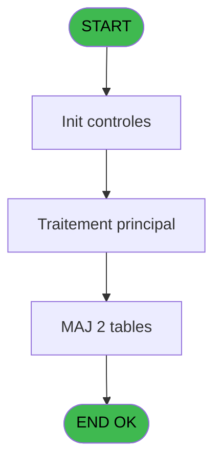
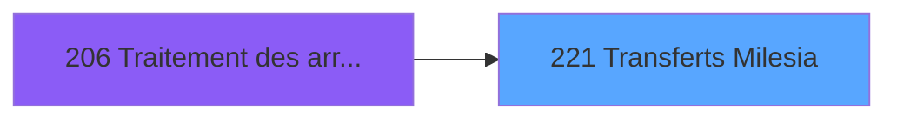

# PBG IDE 221 - Transferts Milesia

> **Analyse**: Phases 1-4 2026-02-03 10:18 -> 10:19 (18s) | Assemblage 10:19
> **Pipeline**: V7.2 Enrichi
> **Structure**: 4 onglets (Resume | Ecrans | Donnees | Connexions)

<!-- TAB:Resume -->

## 1. FICHE D'IDENTITE

| Attribut | Valeur |
|----------|--------|
| Projet | PBG |
| IDE Position | 221 |
| Nom Programme | Transferts Milesia |
| Fichier source | `Prg_221.xml` |
| Domaine metier | General |
| Taches | 6 (1 ecrans visibles) |
| Tables modifiees | 2 |
| Programmes appeles | 0 |

## 2. DESCRIPTION FONCTIONNELLE

**Transferts Milesia** assure la gestion complete de ce processus, accessible depuis [Traitement des arrivants (IDE 206)](PBG-IDE-206.md).

Le flux de traitement s'organise en **3 blocs fonctionnels** :

- **Traitement** (3 taches) : traitements metier divers
- **Calcul** (2 taches) : calculs de montants, stocks ou compteurs
- **Consultation** (1 tache) : ecrans de recherche, selection et consultation

**Donnees modifiees** : 2 tables en ecriture (gm-complet_______gmc, depot_garantie___dga).

Detail : phases du traitement

#### Phase 1 : Traitement (3 taches)

- **221** - Veuillez patienter... **[[ECRAN]](#ecran-t1)**
- **221.3** - Recuperation taux
- **221.5** - Update File and Neol Id

#### Phase 2 : Consultation (1 tache)

- **221.1** - Creation Recherche

#### Phase 3 : Calcul (2 taches)

- **221.2** - compte millesia **[[ECRAN]](#ecran-t3)**
- **221.4** - Creation Compte

#### Tables impactees

| Table | Operations | Role metier |
|-------|-----------|-------------|
| gm-complet_______gmc | **W** (2 usages) |  |
| depot_garantie___dga | **W** (1 usages) | Depots et garanties |

## 3. BLOCS FONCTIONNELS

### 3.1 Traitement (3 taches)

Traitements internes.

---

#### 221 - Veuillez patienter... [[ECRAN]](#ecran-t1)

**Role** : Traitement : Veuillez patienter....
**Ecran** : 427 x 68 DLU (MDI) | [Voir mockup](#ecran-t1)

---

#### 221.3 - Recuperation taux

**Role** : Calcul : Recuperation taux.
**Variables liees** : I (V.Taux Change)

---

#### 221.5 - Update File and Neol Id

**Role** : Traitement : Update File and Neol Id.

### 3.2 Consultation (1 tache)

Ecrans de recherche et consultation.

---

#### 221.1 - Creation Recherche

**Role** : Creation d'enregistrement : Creation Recherche.

### 3.3 Calcul (2 taches)

Calculs metier : montants, stocks, compteurs.

---

#### 221.2 - compte millesia [[ECRAN]](#ecran-t3)

**Role** : Traitement : compte millesia.
**Ecran** : 103 x 195 DLU | [Voir mockup](#ecran-t3)
**Variables liees** : G (V.Compteur), H (V.total millesia)

---

#### 221.4 - Creation Compte

**Role** : Creation d'enregistrement : Creation Compte.
**Variables liees** : G (V.Compteur)

## 5. REGLES METIER

*(Aucune regle metier identifiee)*

## 6. CONTEXTE

- **Appele par**: [Traitement des arrivants (IDE 206)](PBG-IDE-206.md)
- **Appelle**: 0 programmes | **Tables**: 7 (W:2 R:2 L:4) | **Taches**: 6 | **Expressions**: 12

<!-- TAB:Ecrans -->

## 8. ECRANS

### 8.1 Forms visibles (1 / 6)

| # | Position | Tache | Nom | Type | Largeur | Hauteur | Bloc |
|---|----------|-------|-----|------|---------|---------|------|
| 1 | 221 | 221 | Veuillez patienter... | MDI | 427 | 68 | Traitement |

### 8.2 Mockups Ecrans

---

#### 221 - Veuillez patienter...
**Tache** : [221](#t1) | **Type** : MDI | **Dimensions** : 427 x 68 DLU
**Bloc** : Traitement | **Titre IDE** : Veuillez patienter...

<!-- FORM-DATA:
{
    "width":  427,
    "vFactor":  8,
    "type":  "MDI",
    "hFactor":  8,
    "controls":  [
                     {
                         "x":  1,
                         "type":  "label",
                         "var":  "",
                         "y":  0,
                         "w":  423,
                         "fmt":  "",
                         "name":  "",
                         "h":  29,
                         "color":  "",
                         "text":  "",
                         "parent":  null
                     },
                     {
                         "x":  99,
                         "type":  "label",
                         "var":  "",
                         "y":  10,
                         "w":  275,
                         "fmt":  "",
                         "name":  "",
                         "h":  8,
                         "color":  "7",
                         "text":  "Transferts Milesia",
                         "parent":  null
                     },
                     {
                         "x":  1,
                         "type":  "label",
                         "var":  "",
                         "y":  29,
                         "w":  423,
                         "fmt":  "",
                         "name":  "",
                         "h":  37,
                         "color":  "",
                         "text":  "",
                         "parent":  null
                     },
                     {
                         "x":  9,
                         "type":  "label",
                         "var":  "",
                         "y":  41,
                         "w":  405,
                         "fmt":  "",
                         "name":  "",
                         "h":  19,
                         "color":  "",
                         "text":  "",
                         "parent":  null
                     },
                     {
                         "x":  2,
                         "type":  "image",
                         "var":  "",
                         "y":  2,
                         "w":  72,
                         "fmt":  "",
                         "name":  "",
                         "h":  25,
                         "color":  "",
                         "text":  "",
                         "parent":  null
                     },
                     {
                         "x":  12,
                         "type":  "edit",
                         "var":  "",
                         "y":  42,
                         "w":  400,
                         "fmt":  "30",
                         "name":  "",
                         "h":  17,
                         "color":  "159",
                         "text":  "",
                         "parent":  4
                     },
                     {
                         "x":  177,
                         "type":  "edit",
                         "var":  "",
                         "y":  46,
                         "w":  64,
                         "fmt":  "3 %",
                         "name":  "",
                         "h":  8,
                         "color":  "143",
                         "text":  "",
                         "parent":  1
                     }
                 ],
    "taskId":  "221",
    "height":  68
}
-->

<strong>Champs : 2 champs</strong>

| Pos (x,y) | Nom | Variable | Type |
|-----------|-----|----------|------|
| 12,42 | 30 | - | edit |
| 177,46 | 3 % | - | edit |

## 9. NAVIGATION

Ecran unique: **Veuillez patienter...**

### 9.3 Structure hierarchique (6 taches)

| Position | Tache | Type | Dimensions | Bloc |
|----------|-------|------|------------|------|
| **221.1** | [**Veuillez patienter...** (221)](#t1) [mockup](#ecran-t1) | MDI | 427x68 | Traitement |
| 221.1.1 | [Recuperation taux (221.3)](#t4) | - | - | |
| 221.1.2 | [Update File and Neol Id (221.5)](#t9) | - | - | |
| **221.2** | [**Creation Recherche** (221.1)](#t2) | MDI | - | Consultation |
| **221.3** | [**compte millesia** (221.2)](#t3) [mockup](#ecran-t3) | - | 103x195 | Calcul |
| 221.3.1 | [Creation Compte (221.4)](#t8) | MDI | - | |

### 9.4 Algorigramme

> **Legende**: Vert = START/END OK | Rouge = END KO | Bleu = Decisions
> *Algorigramme auto-genere. Utiliser `/algorigramme` pour une synthese metier detaillee.*

<!-- TAB:Donnees -->

## 10. TABLES

### Tables utilisees (7)

| ID | Nom | Description | Type | R | W | L | Usages |
|----|-----|-------------|------|---|---|---|--------|
| 31 | gm-complet_______gmc |  | DB |   | **W** |   | 2 |
| 39 | depot_garantie___dga | Depots et garanties | DB |   | **W** |   | 1 |
| 47 | compte_gm________cgm | Comptes GM (generaux) | DB |   |   | L | 1 |
| 50 | moyens_reglement_mor | Reglements / paiements | DB | R |   |   | 1 |
| 358 | import_mod |  | DB |   |   | L | 1 |
| 569 | pointage_articles_caution | Articles et stock | TMP | R |   | L | 2 |
| 846 | stat_lieu_vente | Statistiques point de vente | TMP |   |   | L | 1 |

### Colonnes par table (3 / 4 tables avec colonnes identifiees)

Table 31 - gm-complet_______gmc (**W**) - 2 usages

*Table utilisee uniquement en Link ou aucune colonne Real identifiee dans le DataView.*

Table 39 - depot_garantie___dga (**W**) - 1 usages

*Table utilisee uniquement en Link ou aucune colonne Real identifiee dans le DataView.*

Table 50 - moyens_reglement_mor (R) - 1 usages

*Table utilisee uniquement en Link ou aucune colonne Real identifiee dans le DataView.*

Table 569 - pointage_articles_caution (R/L) - 2 usages

| Lettre | Variable | Acces | Type |
|--------|----------|-------|------|
| A | P0-Code Societe | R | Alpha |
| B | P0-Nb Arrivants | R | Numeric |
| C | W0-Operande | R | Numeric |
| D | W0-Operateur | R | Numeric |
| E | W0-Pourcentage | R | Numeric |
| F | W0-Calcul Pourcent | R | Numeric |
| G | V.Compteur | R | Numeric |
| H | V.total millesia | R | Numeric |
| I | V.Taux Change | R | Numeric |

## 11. VARIABLES

### 11.1 Variables de session (3)

Variables persistantes pendant toute la session.

| Lettre | Nom | Type | Usage dans |
|--------|-----|------|-----------|
| G | V.Compteur | Numeric | - |
| H | V.total millesia | Numeric | - |
| I | V.Taux Change | Numeric | - |

### 11.2 Autres (6)

Variables diverses.

| Lettre | Nom | Type | Usage dans |
|--------|-----|------|-----------|
| A | P0-Code Societe | Alpha | - |
| B | P0-Nb Arrivants | Numeric | - |
| C | W0-Operande | Numeric | - |
| D | W0-Operateur | Numeric | - |
| E | W0-Pourcentage | Numeric | - |
| F | W0-Calcul Pourcent | Numeric | - |

## 12. EXPRESSIONS

**12 / 12 expressions decodees (100%)**

### 12.1 Repartition par type

| Type | Expressions | Regles |
|------|-------------|--------|
| CALCULATION | 3 | 0 |
| CONSTANTE | 3 | 0 |
| REFERENCE_VG | 1 | 0 |
| CONDITION | 4 | 0 |
| OTHER | 1 | 0 |

### 12.2 Expressions cles par type

#### CALCULATION (3 expressions)

| Type | IDE | Expression | Regle |
|------|-----|------------|-------|
| CALCULATION | 6 | `[Y]+1` | - |
| CALCULATION | 3 | `([Y]/[Z])*50` | - |
| CALCULATION | 2 | `([Y]/[Z])*100` | - |

#### CONSTANTE (3 expressions)

| Type | IDE | Expression | Regle |
|------|-----|------------|-------|
| CONSTANTE | 11 | `1` | - |
| CONSTANTE | 8 | `1` | - |
| CONSTANTE | 1 | `''` | - |

#### REFERENCE_VG (1 expressions)

| Type | IDE | Expression | Regle |
|------|-----|------------|-------|
| REFERENCE_VG | 4 | `VG20` | - |

#### CONDITION (4 expressions)

| Type | IDE | Expression | Regle |
|------|-----|------------|-------|
| CONDITION | 9 | `VG57='EUR'` | - |
| CONDITION | 10 | `Trim([AN])<>'' OR [AV]` | - |
| CONDITION | 5 | `[J]<>0 AND ([AB]<>'' OR [AA]<>'N' OR [AC]<>'N' OR [AD]<>'N' OR [AW]='R')` | - |
| CONDITION | 7 | `VG57<>'EUR'` | - |

#### OTHER (1 expressions)

| Type | IDE | Expression | Regle |
|------|-----|------------|-------|
| OTHER | 12 | `{1,9}` | - |

<!-- TAB:Connexions -->

## 13. GRAPHE D'APPELS

### 13.1 Chaine depuis Main (Callers)

Main -> ... -> [Traitement des arrivants (IDE 206)](PBG-IDE-206.md) -> **Transferts Milesia (IDE 221)**

### 13.2 Callers

| IDE | Nom Programme | Nb Appels |
|-----|---------------|-----------|
| [206](PBG-IDE-206.md) | Traitement des arrivants | 1 |

### 13.3 Callees (programmes appeles)

### 13.4 Detail Callees avec contexte

| IDE | Nom Programme | Appels | Contexte |
|-----|---------------|--------|----------|
| - | (aucun) | - | - |

## 14. RECOMMANDATIONS MIGRATION

### 14.1 Profil du programme

| Metrique | Valeur | Impact migration |
|----------|--------|-----------------|
| Lignes de logique | 230 | Taille moyenne |
| Expressions | 12 | Peu de logique |
| Tables WRITE | 2 | Impact faible |
| Sous-programmes | 0 | Peu de dependances |
| Ecrans visibles | 1 | Ecran unique ou traitement batch |
| Code desactive | 0% (0 / 230) | Code sain |
| Regles metier | 0 | Pas de regle identifiee |

### 14.2 Plan de migration par bloc

#### Traitement (3 taches: 1 ecran, 2 traitements)

- **Strategie** : Orchestrateur avec 1 ecrans (Razor/React) et 2 traitements backend (services).
- Les ecrans deviennent des composants UI, les traitements invisibles deviennent des services injectables.
- Decomposer les taches en services unitaires testables.

#### Consultation (1 tache: 0 ecran, 1 traitement)

- **Strategie** : Composants de recherche/selection en modales.

#### Calcul (2 taches: 1 ecran, 1 traitement)

- **Strategie** : Services de calcul purs (Domain Services).
- Migrer la logique de calcul (stock, compteurs, montants)

### 14.3 Dependances critiques

| Dependance | Type | Appels | Impact |
|------------|------|--------|--------|
| gm-complet_______gmc | Table WRITE (Database) | 2x | Schema + repository |
| depot_garantie___dga | Table WRITE (Database) | 1x | Schema + repository |

---
*Spec DETAILED generee par Pipeline V7.2 - 2026-02-03 10:19*
