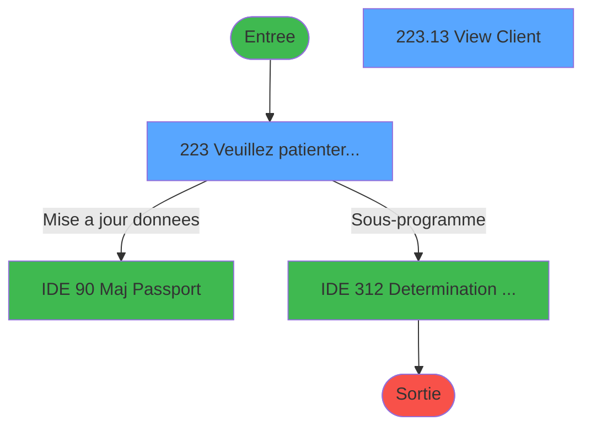
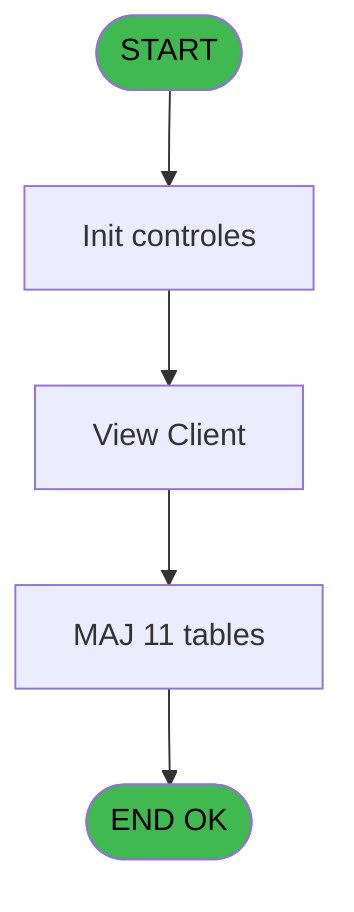
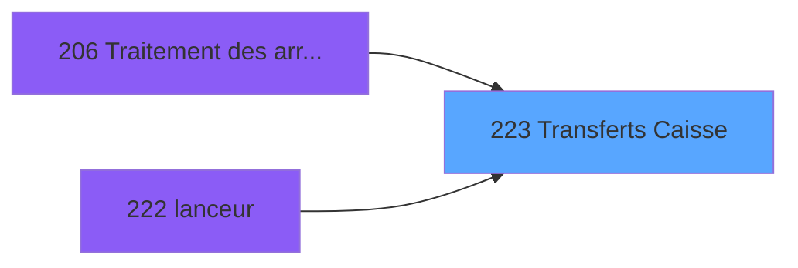
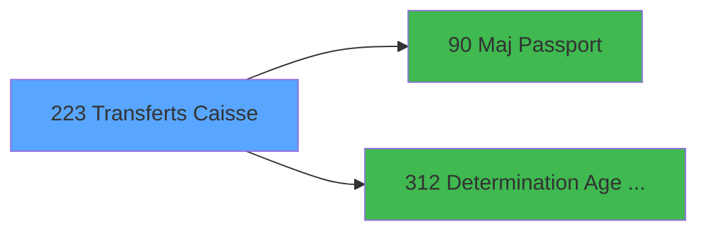

# PBG IDE 223 - Transferts Caisse

> **Analyse**: Phases 1-4 2026-02-03 10:19 -> 10:20 (19s) | Assemblage 10:20
> **Pipeline**: V7.2 Enrichi
> **Structure**: 4 onglets (Resume | Ecrans | Donnees | Connexions)

<!-- TAB:Resume -->

## 1. FICHE D'IDENTITE

| Attribut | Valeur |
|----------|--------|
| Projet | PBG |
| IDE Position | 223 |
| Nom Programme | Transferts Caisse |
| Fichier source | `Prg_223.xml` |
| Domaine metier | Caisse |
| Taches | 15 (2 ecrans visibles) |
| Tables modifiees | 11 |
| Programmes appeles | 2 |

## 2. DESCRIPTION FONCTIONNELLE

**Transferts Caisse** assure la gestion complete de ce processus, accessible depuis [Traitement des arrivants (IDE 206)](PBG-IDE-206.md), [lanceur (IDE 222)](PBG-IDE-222.md).

Le flux de traitement s'organise en **4 blocs fonctionnels** :

- **Traitement** (7 taches) : traitements metier divers
- **Consultation** (4 taches) : ecrans de recherche, selection et consultation
- **Creation** (2 taches) : insertion d'enregistrements en base (mouvements, prestations)
- **Validation** (2 taches) : controles et verifications de coherence

**Donnees modifiees** : 11 tables en ecriture (gm-recherche_____gmr, hebergement______heb, personnel_go______go, client_gm, commentaire_gm_________acc, fichier_validation, heb_circuit______hci, email, fid_cumul, pv_discount_reasons, pointage_articles_caution).

**Logique metier** : 2 regles identifiees couvrant conditions metier.

Detail : phases du traitement

#### Phase 1 : Traitement (7 taches)

- **223** - Veuillez patienter... **[[ECRAN]](#ecran-t1)**
- **223.6** - Heb Age
- **223.7** - Heb Age
- **223.11** - Update pv customer
- **223.12** - View Client
- **223.13** - View Client **[[ECRAN]](#ecran-t23)**
- **223.14** - Update pv customer

Delegue a : [  Maj Passport (IDE 90)](PBG-IDE-90.md), [Determination Age Debut Sejour (IDE 312)](PBG-IDE-312.md)

#### Phase 2 : Validation (2 taches)

- **223.1** - Verification Transfert
- **223.2** - Verification Transfert

#### Phase 3 : Consultation (4 taches)

- **223.3** - Creation Recherche
- **223.4** - Creation Recherche
- **223.5** - Creation Recherche
- **223.10** - Creation Recherche

#### Phase 4 : Creation (2 taches)

- **223.8** - Creation email
- **223.9** - Creation Cumul Fid

#### Tables impactees

| Table | Operations | Role metier |
|-------|-----------|-------------|
| client_gm | **W** (3 usages) |  |
| fid_cumul | **W** (1 usages) |  |
| gm-recherche_____gmr | **W** (1 usages) | Index de recherche |
| commentaire_gm_________acc | **W** (1 usages) |  |
| pv_discount_reasons | **W** (1 usages) |  |
| fichier_validation | **W** (1 usages) |  |
| hebergement______heb | **W** (1 usages) | Hebergement (chambres) |
| personnel_go______go | **W** (1 usages) |  |
| email | **W** (1 usages) |  |
| pointage_articles_caution | **W** (1 usages) | Articles et stock |
| heb_circuit______hci | **W** (1 usages) | Hebergement (chambres) |

## 3. BLOCS FONCTIONNELS

### 3.1 Traitement (7 taches)

Traitements internes.

---

#### 223 - Veuillez patienter... [[ECRAN]](#ecran-t1)

**Role** : Tache d'orchestration : point d'entree du programme (7 sous-taches). Coordonne l'enchainement des traitements.
**Ecran** : 427 x 68 DLU (MDI) | [Voir mockup](#ecran-t1)

6 sous-taches directes

| Tache | Nom | Bloc |
|-------|-----|------|
| [223.6](#t7) | Heb Age | Traitement |
| [223.7](#t8) | Heb Age | Traitement |
| [223.11](#t14) | Update pv customer | Traitement |
| [223.12](#t15) | View Client | Traitement |
| [223.13](#t23) | View Client **[[ECRAN]](#ecran-t23)** | Traitement |
| [223.14](#t26) | Update pv customer | Traitement |

**Delegue a** : [  Maj Passport (IDE 90)](PBG-IDE-90.md), [Determination Age Debut Sejour (IDE 312)](PBG-IDE-312.md)

---

#### 223.6 - Heb Age

**Role** : Traitement : Heb Age.
**Delegue a** : [  Maj Passport (IDE 90)](PBG-IDE-90.md), [Determination Age Debut Sejour (IDE 312)](PBG-IDE-312.md)

---

#### 223.7 - Heb Age

**Role** : Traitement : Heb Age.
**Delegue a** : [  Maj Passport (IDE 90)](PBG-IDE-90.md), [Determination Age Debut Sejour (IDE 312)](PBG-IDE-312.md)

---

#### 223.11 - Update pv customer

**Role** : Traitement : Update pv customer.
**Delegue a** : [  Maj Passport (IDE 90)](PBG-IDE-90.md), [Determination Age Debut Sejour (IDE 312)](PBG-IDE-312.md)

---

#### 223.12 - View Client

**Role** : Traitement : View Client.
**Delegue a** : [  Maj Passport (IDE 90)](PBG-IDE-90.md), [Determination Age Debut Sejour (IDE 312)](PBG-IDE-312.md)

---

#### 223.13 - View Client [[ECRAN]](#ecran-t23)

**Role** : Traitement : View Client.
**Ecran** : 727 x 463 DLU | [Voir mockup](#ecran-t23)
**Delegue a** : [  Maj Passport (IDE 90)](PBG-IDE-90.md), [Determination Age Debut Sejour (IDE 312)](PBG-IDE-312.md)

---

#### 223.14 - Update pv customer

**Role** : Traitement : Update pv customer.
**Delegue a** : [  Maj Passport (IDE 90)](PBG-IDE-90.md), [Determination Age Debut Sejour (IDE 312)](PBG-IDE-312.md)

### 3.2 Validation (2 taches)

Controles de coherence : 2 taches verifient les donnees et conditions.

---

#### 223.1 - Verification Transfert

**Role** : Verification : Verification Transfert.

---

#### 223.2 - Verification Transfert

**Role** : Verification : Verification Transfert.

### 3.3 Consultation (4 taches)

Ecrans de recherche et consultation.

---

#### 223.3 - Creation Recherche

**Role** : Creation d'enregistrement : Creation Recherche.

---

#### 223.4 - Creation Recherche

**Role** : Creation d'enregistrement : Creation Recherche.

---

#### 223.5 - Creation Recherche

**Role** : Creation d'enregistrement : Creation Recherche.

---

#### 223.10 - Creation Recherche

**Role** : Creation d'enregistrement : Creation Recherche.

### 3.4 Creation (2 taches)

Insertion de nouveaux enregistrements en base.

---

#### 223.8 - Creation email

**Role** : Creation d'enregistrement : Creation email.

---

#### 223.9 - Creation Cumul Fid

**Role** : Creation d'enregistrement : Creation Cumul Fid.

## 5. REGLES METIER

2 regles identifiees:

### Autres (2 regles)

#### [RM-001] Si v.retour modification [O]>0 AND [AV]<=W0 Age Bebe [H] alors 'O' sinon 'N')

| Element | Detail |
|---------|--------|
| **Condition** | `v.retour modification [O]>0 AND [AV]<=W0 Age Bebe [H]` |
| **Si vrai** | 'O' |
| **Si faux** | 'N') |
| **Variables** | H (W0 Age Bebe), K (W0 Age), O (v.retour modification) |
| **Expression source** | Expression 11 : `IF (v.retour modification [O]>0 AND [AV]<=W0 Age Bebe [H],'O` |
| **Exemple** | Si v.retour modification [O]>0 AND [AV]<=W0 Age Bebe [H] → 'O'. Sinon → 'N') |

#### [RM-002] Si [DG] alors [CY] sinon 'S')

| Element | Detail |
|---------|--------|
| **Condition** | `[DG]` |
| **Si vrai** | [CY] |
| **Si faux** | 'S') |
| **Expression source** | Expression 21 : `IF([DG],[CY],'S')` |
| **Exemple** | Si [DG] → [CY]. Sinon → 'S') |

## 6. CONTEXTE

- **Appele par**: [Traitement des arrivants (IDE 206)](PBG-IDE-206.md), [lanceur (IDE 222)](PBG-IDE-222.md)
- **Appelle**: 2 programmes | **Tables**: 17 (W:11 R:2 L:4) | **Taches**: 15 | **Expressions**: 36

<!-- TAB:Ecrans -->

## 8. ECRANS

### 8.1 Forms visibles (2 / 15)

| # | Position | Tache | Nom | Type | Largeur | Hauteur | Bloc |
|---|----------|-------|-----|------|---------|---------|------|
| 1 | 223 | 223 | Veuillez patienter... | MDI | 427 | 68 | Traitement |
| 2 | 223.14 | 223.13 | View Client | Type0 | 727 | 463 | Traitement |

### 8.2 Mockups Ecrans

---

#### 223 - Veuillez patienter...
**Tache** : [223](#t1) | **Type** : MDI | **Dimensions** : 427 x 68 DLU
**Bloc** : Traitement | **Titre IDE** : Veuillez patienter...

<!-- FORM-DATA:
{
    "width":  427,
    "vFactor":  8,
    "type":  "MDI",
    "hFactor":  8,
    "controls":  [
                     {
                         "x":  1,
                         "type":  "label",
                         "var":  "",
                         "y":  0,
                         "w":  423,
                         "fmt":  "",
                         "name":  "",
                         "h":  29,
                         "color":  "",
                         "text":  "",
                         "parent":  null
                     },
                     {
                         "x":  99,
                         "type":  "label",
                         "var":  "",
                         "y":  10,
                         "w":  275,
                         "fmt":  "",
                         "name":  "",
                         "h":  8,
                         "color":  "7",
                         "text":  "Transferts Caisse",
                         "parent":  null
                     },
                     {
                         "x":  1,
                         "type":  "label",
                         "var":  "",
                         "y":  29,
                         "w":  423,
                         "fmt":  "",
                         "name":  "",
                         "h":  37,
                         "color":  "",
                         "text":  "",
                         "parent":  null
                     },
                     {
                         "x":  9,
                         "type":  "label",
                         "var":  "",
                         "y":  41,
                         "w":  405,
                         "fmt":  "",
                         "name":  "",
                         "h":  19,
                         "color":  "",
                         "text":  "",
                         "parent":  null
                     },
                     {
                         "x":  2,
                         "type":  "image",
                         "var":  "",
                         "y":  2,
                         "w":  72,
                         "fmt":  "",
                         "name":  "",
                         "h":  25,
                         "color":  "",
                         "text":  "",
                         "parent":  null
                     },
                     {
                         "x":  12,
                         "type":  "edit",
                         "var":  "",
                         "y":  42,
                         "w":  400,
                         "fmt":  "30",
                         "name":  "",
                         "h":  17,
                         "color":  "159",
                         "text":  "",
                         "parent":  4
                     },
                     {
                         "x":  177,
                         "type":  "edit",
                         "var":  "",
                         "y":  46,
                         "w":  64,
                         "fmt":  "3 %",
                         "name":  "",
                         "h":  8,
                         "color":  "143",
                         "text":  "",
                         "parent":  1
                     }
                 ],
    "taskId":  "223",
    "height":  68
}
-->

<strong>Champs : 2 champs</strong>

| Pos (x,y) | Nom | Variable | Type |
|-----------|-----|----------|------|
| 12,42 | 30 | - | edit |
| 177,46 | 3 % | - | edit |

---

#### 223.14 - View Client
**Tache** : [223.13](#t23) | **Type** : Type0 | **Dimensions** : 727 x 463 DLU
**Bloc** : Traitement | **Titre IDE** : View Client

<!-- FORM-DATA:
{
    "width":  727,
    "vFactor":  8,
    "type":  "Type0",
    "hFactor":  4,
    "controls":  [
                     {
                         "x":  24,
                         "type":  "label",
                         "var":  "",
                         "y":  8,
                         "w":  53,
                         "fmt":  "",
                         "name":  "",
                         "h":  9,
                         "color":  "",
                         "text":  "imi_username",
                         "parent":  null
                     },
                     {
                         "x":  28,
                         "type":  "label",
                         "var":  "",
                         "y":  32,
                         "w":  59,
                         "fmt":  "",
                         "name":  "",
                         "h":  9,
                         "color":  "",
                         "text":  "e.gm_complet?",
                         "parent":  null
                     },
                     {
                         "x":  24,
                         "type":  "label",
                         "var":  "",
                         "y":  48,
                         "w":  50,
                         "fmt":  "",
                         "name":  "",
                         "h":  9,
                         "color":  "",
                         "text":  "gmc_societe",
                         "parent":  null
                     },
                     {
                         "x":  28,
                         "type":  "label",
                         "var":  "",
                         "y":  72,
                         "w":  81,
                         "fmt":  "",
                         "name":  "",
                         "h":  9,
                         "color":  "",
                         "text":  "gmc_filiation_compte",
                         "parent":  null
                     },
                     {
                         "x":  28,
                         "type":  "label",
                         "var":  "",
                         "y":  56,
                         "w":  50,
                         "fmt":  "",
                         "name":  "",
                         "h":  9,
                         "color":  "",
                         "text":  "gmc_compte",
                         "parent":  null
                     },
                     {
                         "x":  81,
                         "type":  "edit",
                         "var":  "",
                         "y":  8,
                         "w":  48,
                         "fmt":  "",
                         "name":  "imi_username",
                         "h":  10,
                         "color":  "",
                         "text":  "",
                         "parent":  null
                     },
                     {
                         "x":  91,
                         "type":  "edit",
                         "var":  "",
                         "y":  32,
                         "w":  31,
                         "fmt":  "",
                         "name":  "e.gm_complet?",
                         "h":  10,
                         "color":  "",
                         "text":  "",
                         "parent":  null
                     },
                     {
                         "x":  78,
                         "type":  "edit",
                         "var":  "",
                         "y":  48,
                         "w":  9,
                         "fmt":  "",
                         "name":  "gmc_societe",
                         "h":  10,
                         "color":  "",
                         "text":  "",
                         "parent":  null
                     },
                     {
                         "x":  82,
                         "type":  "edit",
                         "var":  "",
                         "y":  56,
                         "w":  42,
                         "fmt":  "",
                         "name":  "gmc_compte",
                         "h":  10,
                         "color":  "",
                         "text":  "",
                         "parent":  null
                     },
                     {
                         "x":  113,
                         "type":  "edit",
                         "var":  "",
                         "y":  72,
                         "w":  18,
                         "fmt":  "",
                         "name":  "gmc_filiation_compte",
                         "h":  10,
                         "color":  "",
                         "text":  "",
                         "parent":  null
                     }
                 ],
    "taskId":  "223.14",
    "height":  463
}
-->

<strong>Champs : 5 champs</strong>

| Pos (x,y) | Nom | Variable | Type |
|-----------|-----|----------|------|
| 81,8 | imi_username | - | edit |
| 91,32 | e.gm_complet? | - | edit |
| 78,48 | gmc_societe | - | edit |
| 82,56 | gmc_compte | - | edit |
| 113,72 | gmc_filiation_compte | - | edit |

## 9. NAVIGATION

### 9.1 Enchainement des ecrans

**Detail par enchainement :**

| Depuis | Action | Vers | Retour |
|--------|--------|------|--------|
| Veuillez patienter... | Mise a jour donnees | [  Maj Passport (IDE 90)](PBG-IDE-90.md) | Retour ecran |
| Veuillez patienter... | Sous-programme | [Determination Age Debut Sejour (IDE 312)](PBG-IDE-312.md) | Retour ecran |

### 9.3 Structure hierarchique (15 taches)

| Position | Tache | Type | Dimensions | Bloc |
|----------|-------|------|------------|------|
| **223.1** | [**Veuillez patienter...** (223)](#t1) [mockup](#ecran-t1) | MDI | 427x68 | Traitement |
| 223.1.1 | [Heb Age (223.6)](#t7) | MDI | - | |
| 223.1.2 | [Heb Age (223.7)](#t8) | MDI | - | |
| 223.1.3 | [Update pv customer (223.11)](#t14) | - | - | |
| 223.1.4 | [View Client (223.12)](#t15) | - | - | |
| 223.1.5 | [View Client (223.13)](#t23) [mockup](#ecran-t23) | - | 727x463 | |
| 223.1.6 | [Update pv customer (223.14)](#t26) | - | - | |
| **223.2** | [**Verification Transfert** (223.1)](#t2) | MDI | - | Validation |
| 223.2.1 | [Verification Transfert (223.2)](#t3) | MDI | - | |
| **223.3** | [**Creation Recherche** (223.3)](#t4) | MDI | - | Consultation |
| 223.3.1 | [Creation Recherche (223.4)](#t5) | MDI | - | |
| 223.3.2 | [Creation Recherche (223.5)](#t6) | MDI | - | |
| 223.3.3 | [Creation Recherche (223.10)](#t13) | MDI | - | |
| **223.4** | [**Creation email** (223.8)](#t9) | MDI | - | Creation |
| 223.4.1 | [Creation Cumul Fid (223.9)](#t10) | MDI | - | |

### 9.4 Algorigramme

> **Legende**: Vert = START/END OK | Rouge = END KO | Bleu = Decisions
> *Algorigramme auto-genere. Utiliser `/algorigramme` pour une synthese metier detaillee.*

<!-- TAB:Donnees -->

## 10. TABLES

### Tables utilisees (17)

| ID | Nom | Description | Type | R | W | L | Usages |
|----|-----|-------------|------|---|---|---|--------|
| 30 | gm-recherche_____gmr | Index de recherche | DB |   | **W** |   | 1 |
| 31 | gm-complet_______gmc |  | DB |   |   | L | 1 |
| 34 | hebergement______heb | Hebergement (chambres) | DB |   | **W** |   | 1 |
| 35 | personnel_go______go |  | DB |   | **W** |   | 1 |
| 36 | client_gm |  | DB |   | **W** |   | 3 |
| 37 | commentaire_gm_________acc |  | DB |   | **W** |   | 1 |
| 63 | parametres___par |  | DB | R |   |   | 1 |
| 113 | tables_village |  | DB | R |   |   | 1 |
| 131 | fichier_validation |  | DB |   | **W** |   | 1 |
| 168 | heb_circuit______hci | Hebergement (chambres) | DB |   | **W** |   | 1 |
| 285 | email |  | DB |   | **W** |   | 1 |
| 314 | fid_cumul |  | DB |   | **W** |   | 1 |
| 382 | pv_discount_reasons |  | DB |   | **W** |   | 1 |
| 569 | pointage_articles_caution | Articles et stock | TMP |   | **W** |   | 1 |
| 578 | saisie_od_taiforfait |  | TMP |   |   | L | 1 |
| 720 | arc_transac_entete_bar |  | DB |   |   | L | 1 |
| 850 | correspittivi_settings |  | DB |   |   | L | 1 |

### Colonnes par table (1 / 13 tables avec colonnes identifiees)

Table 30 - gm-recherche_____gmr (**W**) - 1 usages

*Table utilisee uniquement en Link ou aucune colonne Real identifiee dans le DataView.*

Table 34 - hebergement______heb (**W**) - 1 usages

*Table utilisee uniquement en Link ou aucune colonne Real identifiee dans le DataView.*

Table 35 - personnel_go______go (**W**) - 1 usages

*Table utilisee uniquement en Link ou aucune colonne Real identifiee dans le DataView.*

Table 36 - client_gm (**W**) - 3 usages

*Table utilisee uniquement en Link ou aucune colonne Real identifiee dans le DataView.*

Table 37 - commentaire_gm_________acc (**W**) - 1 usages

*Table utilisee uniquement en Link ou aucune colonne Real identifiee dans le DataView.*

Table 63 - parametres___par (R) - 1 usages

*Table utilisee uniquement en Link ou aucune colonne Real identifiee dans le DataView.*

Table 113 - tables_village (R) - 1 usages

*Table utilisee uniquement en Link ou aucune colonne Real identifiee dans le DataView.*

Table 131 - fichier_validation (**W**) - 1 usages

*Table utilisee uniquement en Link ou aucune colonne Real identifiee dans le DataView.*

Table 168 - heb_circuit______hci (**W**) - 1 usages

*Table utilisee uniquement en Link ou aucune colonne Real identifiee dans le DataView.*

Table 285 - email (**W**) - 1 usages

*Table utilisee uniquement en Link ou aucune colonne Real identifiee dans le DataView.*

Table 314 - fid_cumul (**W**) - 1 usages

*Table utilisee uniquement en Link ou aucune colonne Real identifiee dans le DataView.*

Table 382 - pv_discount_reasons (**W**) - 1 usages

*Table utilisee uniquement en Link ou aucune colonne Real identifiee dans le DataView.*

Table 569 - pointage_articles_caution (**W**) - 1 usages

| Lettre | Variable | Acces | Type |
|--------|----------|-------|------|
| A | P0-Code Societe | W | Alpha |
| B | P0-Nb Arrivants | W | Numeric |
| C | P0-Qualite Import | W | Alpha |
| D | W0-Operande | W | Numeric |
| E | W0-Operateur | W | Numeric |
| F | W0-Pourcentage | W | Numeric |
| G | W0-Calcul Pourcent | W | Numeric |
| H | W0 Age Bebe | W | Numeric |
| I | W0-Planning Actif | W | Alpha |
| J | e.gm_complet? | W | Logical |
| K | W0 Age | W | Numeric |
| L | W0 Nb mois | W | Numeric |
| M | V.Compteur | W | Numeric |
| N | W0.Retour Agent | W | Logical |
| O | v.retour modification | W | Logical |

## 11. VARIABLES

### 11.1 Variables de session (2)

Variables persistantes pendant toute la session.

| Lettre | Nom | Type | Usage dans |
|--------|-----|------|-----------|
| M | V.Compteur | Numeric | 1x session |
| O | v.retour modification | Logical | 1x session |

### 11.2 Variables de travail (4)

Variables internes au programme.

| Lettre | Nom | Type | Usage dans |
|--------|-----|------|-----------|
| H | W0 Age Bebe | Numeric | 1x calcul interne |
| K | W0 Age | Numeric | 1x calcul interne |
| L | W0 Nb mois | Numeric | 2x calcul interne |
| N | W0.Retour Agent | Logical | - |

### 11.3 Autres (9)

Variables diverses.

| Lettre | Nom | Type | Usage dans |
|--------|-----|------|-----------|
| A | P0-Code Societe | Alpha | 1x refs |
| B | P0-Nb Arrivants | Numeric | - |
| C | P0-Qualite Import | Alpha | - |
| D | W0-Operande | Numeric | - |
| E | W0-Operateur | Numeric | - |
| F | W0-Pourcentage | Numeric | - |
| G | W0-Calcul Pourcent | Numeric | - |
| I | W0-Planning Actif | Alpha | - |
| J | e.gm_complet? | Logical | - |

## 12. EXPRESSIONS

**36 / 36 expressions decodees (100%)**

### 12.1 Repartition par type

| Type | Expressions | Regles |
|------|-------------|--------|
| CALCULATION | 3 | 0 |
| CONDITION | 9 | 2 |
| CONSTANTE | 6 | 0 |
| REFERENCE_VG | 2 | 0 |
| OTHER | 14 | 0 |
| CAST_LOGIQUE | 1 | 0 |
| NEGATION | 1 | 0 |

### 12.2 Expressions cles par type

#### CALCULATION (3 expressions)

| Type | IDE | Expression | Regle |
|------|-----|------------|-------|
| CALCULATION | 15 | `[CV]+1` | - |
| CALCULATION | 3 | `([CV]/VG1)*50` | - |
| CALCULATION | 2 | `([CV]/VG1)*100` | - |

#### CONDITION (9 expressions)

| Type | IDE | Expression | Regle |
|------|-----|------------|-------|
| CONDITION | 21 | `IF([DG],[CY],'S')` | [RM-002](#rm-RM-002) |
| CONDITION | 11 | `IF (v.retour modification [O]>0 AND [AV]<=W0 Age Bebe [H],'O','N')` | [RM-001](#rm-RM-001) |
| CONDITION | 28 | `[DO] AND [DQ]<>W0 Nb mois [L]` | - |
| CONDITION | 33 | `[AO]=0` | - |
| CONDITION | 32 | `Trim([AL])='' AND Trim(VG20)='DSIOP'` | - |
| ... | | *+4 autres* | |

#### CONSTANTE (6 expressions)

| Type | IDE | Expression | Regle |
|------|-----|------------|-------|
| CONSTANTE | 7 | `'I'` | - |
| CONSTANTE | 22 | `'IND'` | - |
| CONSTANTE | 29 | `'c:\temp\log_caisse.txt'` | - |
| CONSTANTE | 1 | `''` | - |
| CONSTANTE | 5 | `'F'` | - |
| ... | | *+1 autres* | |

#### REFERENCE_VG (2 expressions)

| Type | IDE | Expression | Regle |
|------|-----|------------|-------|
| REFERENCE_VG | 19 | `VG41` | - |
| REFERENCE_VG | 4 | `VG20` | - |

#### OTHER (14 expressions)

| Type | IDE | Expression | Regle |
|------|-----|------------|-------|
| OTHER | 30 | `[DZ]` | - |
| OTHER | 27 | `[DV]` | - |
| OTHER | 26 | `[DU]` | - |
| OTHER | 31 | `[EA]` | - |
| OTHER | 36 | `Left({1,39},10)` | - |
| ... | | *+9 autres* | |

#### CAST_LOGIQUE (1 expressions)

| Type | IDE | Expression | Regle |
|------|-----|------------|-------|
| CAST_LOGIQUE | 12 | `'TRUE'LOG` | - |

#### NEGATION (1 expressions)

| Type | IDE | Expression | Regle |
|------|-----|------------|-------|
| NEGATION | 17 | `NOT VG31 OR VG31 AND [CZ]<>'GO'` | - |

### 12.3 Toutes les expressions (36)

Voir les 36 expressions

#### CALCULATION (3)

| IDE | Expression Decodee |
|-----|-------------------|
| 2 | `([CV]/VG1)*100` |
| 3 | `([CV]/VG1)*50` |
| 15 | `[CV]+1` |

#### CONDITION (9)

| IDE | Expression Decodee |
|-----|-------------------|
| 11 | `IF (v.retour modification [O]>0 AND [AV]<=W0 Age Bebe [H],'O','N')` |
| 21 | `IF([DG],[CY],'S')` |
| 13 | `[AC]<>''` |
| 14 | `[U]='H' OR [U]='O'` |
| 16 | `VG31 AND [CZ]='GO'` |
| 20 | `[DE]='G'` |
| 28 | `[DO] AND [DQ]<>W0 Nb mois [L]` |
| 33 | `[AO]=0` |
| 32 | `Trim([AL])='' AND Trim(VG20)='DSIOP'` |

#### CONSTANTE (6)

| IDE | Expression Decodee |
|-----|-------------------|
| 1 | `''` |
| 5 | `'F'` |
| 6 | `1` |
| 7 | `'I'` |
| 22 | `'IND'` |
| 29 | `'c:\temp\log_caisse.txt'` |

#### REFERENCE_VG (2)

| IDE | Expression Decodee |
|-----|-------------------|
| 4 | `VG20` |
| 19 | `VG41` |

#### OTHER (14)

| IDE | Expression Decodee |
|-----|-------------------|
| 8 | `P0-Code Societe [A]` |
| 9 | `W0 Nb mois [L]` |
| 10 | `V.Compteur [M]` |
| 18 | `[DA]` |
| 23 | `[DF]` |
| 24 | `[DL]` |
| 25 | `[DW]` |
| 26 | `[DU]` |
| 27 | `[DV]` |
| 30 | `[DZ]` |
| 31 | `[EA]` |
| 34 | `NOT([EB])` |
| 35 | `Left({1,38},15)` |
| 36 | `Left({1,39},10)` |

#### CAST_LOGIQUE (1)

| IDE | Expression Decodee |
|-----|-------------------|
| 12 | `'TRUE'LOG` |

#### NEGATION (1)

| IDE | Expression Decodee |
|-----|-------------------|
| 17 | `NOT VG31 OR VG31 AND [CZ]<>'GO'` |

<!-- TAB:Connexions -->

## 13. GRAPHE D'APPELS

### 13.1 Chaine depuis Main (Callers)

Main -> ... -> [Traitement des arrivants (IDE 206)](PBG-IDE-206.md) -> **Transferts Caisse (IDE 223)**

Main -> ... -> [lanceur (IDE 222)](PBG-IDE-222.md) -> **Transferts Caisse (IDE 223)**

### 13.2 Callers

| IDE | Nom Programme | Nb Appels |
|-----|---------------|-----------|
| [206](PBG-IDE-206.md) | Traitement des arrivants | 1 |
| [222](PBG-IDE-222.md) | lanceur | 1 |

### 13.3 Callees (programmes appeles)

### 13.4 Detail Callees avec contexte

| IDE | Nom Programme | Appels | Contexte |
|-----|---------------|--------|----------|
| [90](PBG-IDE-90.md) |   Maj Passport | 1 | Mise a jour donnees |
| [312](PBG-IDE-312.md) | Determination Age Debut Sejour | 1 | Sous-programme |

## 14. RECOMMANDATIONS MIGRATION

### 14.1 Profil du programme

| Metrique | Valeur | Impact migration |
|----------|--------|-----------------|
| Lignes de logique | 437 | Taille moyenne |
| Expressions | 36 | Peu de logique |
| Tables WRITE | 11 | Fort impact donnees |
| Sous-programmes | 2 | Peu de dependances |
| Ecrans visibles | 2 | Quelques ecrans |
| Code desactive | 0.9% (4 / 437) | Code sain |
| Regles metier | 2 | Quelques regles a preserver |

### 14.2 Plan de migration par bloc

#### Traitement (7 taches: 2 ecrans, 5 traitements)

- **Strategie** : Orchestrateur avec 2 ecrans (Razor/React) et 5 traitements backend (services).
- Les ecrans deviennent des composants UI, les traitements invisibles deviennent des services injectables.
- 2 sous-programme(s) a migrer ou a reutiliser depuis les services existants.
- Decomposer les taches en services unitaires testables.

#### Validation (2 taches: 0 ecran, 2 traitements)

- **Strategie** : FluentValidation avec validators specifiques.
- Chaque tache de validation -> un validator injectable

#### Consultation (4 taches: 0 ecran, 4 traitements)

- **Strategie** : Composants de recherche/selection en modales.

#### Creation (2 taches: 0 ecran, 2 traitements)

- **Strategie** : Repository pattern avec Entity Framework Core.
- Insertion via `IRepository<T>.CreateAsync()`

### 14.3 Dependances critiques

| Dependance | Type | Appels | Impact |
|------------|------|--------|--------|
| gm-recherche_____gmr | Table WRITE (Database) | 1x | Schema + repository |
| hebergement______heb | Table WRITE (Database) | 1x | Schema + repository |
| personnel_go______go | Table WRITE (Database) | 1x | Schema + repository |
| client_gm | Table WRITE (Database) | 3x | Schema + repository |
| commentaire_gm_________acc | Table WRITE (Database) | 1x | Schema + repository |
| fichier_validation | Table WRITE (Database) | 1x | Schema + repository |
| heb_circuit______hci | Table WRITE (Database) | 1x | Schema + repository |
| email | Table WRITE (Database) | 1x | Schema + repository |
| fid_cumul | Table WRITE (Database) | 1x | Schema + repository |
| pv_discount_reasons | Table WRITE (Database) | 1x | Schema + repository |
| pointage_articles_caution | Table WRITE (Temp) | 1x | Schema + repository |
| [Determination Age Debut Sejour (IDE 312)](PBG-IDE-312.md) | Sous-programme | 1x | Normale - Sous-programme |
| [  Maj Passport (IDE 90)](PBG-IDE-90.md) | Sous-programme | 1x | Normale - Mise a jour donnees |

---
*Spec DETAILED generee par Pipeline V7.2 - 2026-02-03 10:20*
