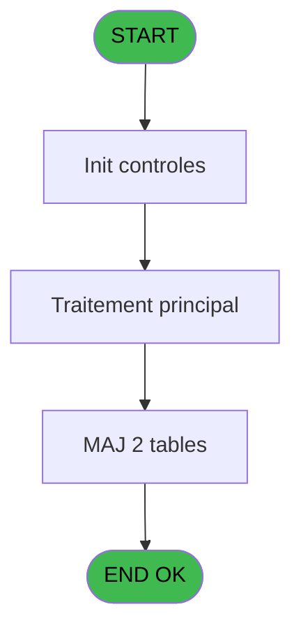
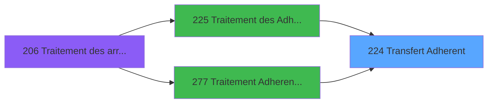

# PBG IDE 224 - Transfert Adherent

> **Analyse**: Phases 1-4 2026-02-03 10:20 -> 10:20 (18s) | Assemblage 10:20
> **Pipeline**: V7.2 Enrichi
> **Structure**: 4 onglets (Resume | Ecrans | Donnees | Connexions)

<!-- TAB:Resume -->

## 1. FICHE D'IDENTITE

| Attribut | Valeur |
|----------|--------|
| Projet | PBG |
| IDE Position | 224 |
| Nom Programme | Transfert Adherent |
| Fichier source | `Prg_224.xml` |
| Domaine metier | General |
| Taches | 5 (0 ecrans visibles) |
| Tables modifiees | 2 |
| Programmes appeles | 0 |

## 2. DESCRIPTION FONCTIONNELLE

**Transfert Adherent** assure la gestion complete de ce processus, accessible depuis [Traitement des Adherents (IDE 225)](PBG-IDE-225.md), [Traitement Adherents new (IDE 277)](PBG-IDE-277.md).

Le flux de traitement s'organise en **3 blocs fonctionnels** :

- **Creation** (2 taches) : insertion d'enregistrements en base (mouvements, prestations)
- **Traitement** (2 taches) : traitements metier divers
- **Transfert** (1 tache) : transferts de donnees entre modules ou deversements

**Donnees modifiees** : 2 tables en ecriture (gm-complet_______gmc, gm_handicap).

**Logique metier** : 1 regles identifiees couvrant conditions metier.

Detail : phases du traitement

#### Phase 1 : Transfert (1 tache)

- **224** - Transfert Adherent

#### Phase 2 : Traitement (2 taches)

- **224.1** - Formatage Prenom
- **224.2.1** - MAJ Numer Dossier ECI

#### Phase 3 : Creation (2 taches)

- **224.2** - Creation Complet
- **224.3** - Creation Handicap

#### Tables impactees

| Table | Operations | Role metier |
|-------|-----------|-------------|
| gm-complet_______gmc | **W** (2 usages) |  |
| gm_handicap | **W** (1 usages) |  |

## 3. BLOCS FONCTIONNELS

### 3.1 Transfert (1 tache)

Transfert de donnees entre modules.

---

#### 224 - Transfert Adherent

**Role** : Transfert de donnees : Transfert Adherent.

### 3.2 Traitement (2 taches)

Traitements internes.

---

#### 224.1 - Formatage Prenom

**Role** : Traitement : Formatage Prenom.
**Variables liees** : G (P.o.Prenom), I (W0-Prenom), J (W0-Prenom2), K (W0-Prenom3), L (W0-Prenom4)

---

#### 224.2.1 - MAJ Numer Dossier ECI

**Role** : Traitement : MAJ Numer Dossier ECI.
**Variables liees** : C (P.i.Numero Compte), F (P.i.Numero Import)

### 3.3 Creation (2 taches)

Insertion de nouveaux enregistrements en base.

---

#### 224.2 - Creation Complet

**Role** : Creation d'enregistrement : Creation Complet.

---

#### 224.3 - Creation Handicap

**Role** : Creation d'enregistrement : Creation Handicap.

## 5. REGLES METIER

1 regles identifiees:

### Autres (1 regles)

#### [RM-001] Si [AY]='F' alors 'Me' sinon 'Mr')

| Element | Detail |
|---------|--------|
| **Condition** | `[AY]='F'` |
| **Si vrai** | 'Me' |
| **Si faux** | 'Mr') |
| **Expression source** | Expression 3 : `IF ([AY]='F','Me','Mr')` |
| **Exemple** | Si [AY]='F' → 'Me'. Sinon → 'Mr') |

## 6. CONTEXTE

- **Appele par**: [Traitement des Adherents (IDE 225)](PBG-IDE-225.md), [Traitement Adherents new (IDE 277)](PBG-IDE-277.md)
- **Appelle**: 0 programmes | **Tables**: 6 (W:2 R:1 L:3) | **Taches**: 5 | **Expressions**: 15

<!-- TAB:Ecrans -->

## 8. ECRANS

*(Programme sans ecran visible)*

## 9. NAVIGATION

### 9.3 Structure hierarchique (5 taches)

| Position | Tache | Type | Dimensions | Bloc |
|----------|-------|------|------------|------|
| **224.1** | [**Transfert Adherent** (224)](#t1) | MDI | - | Transfert |
| **224.2** | [**Formatage Prenom** (224.1)](#t2) | MDI | - | Traitement |
| 224.2.1 | [MAJ Numer Dossier ECI (224.2.1)](#t5) | - | - | |
| **224.3** | [**Creation Complet** (224.2)](#t3) | MDI | - | Creation |
| 224.3.1 | [Creation Handicap (224.3)](#t4) | MDI | - | |

### 9.4 Algorigramme

> **Legende**: Vert = START/END OK | Rouge = END KO | Bleu = Decisions
> *Algorigramme auto-genere. Utiliser `/algorigramme` pour une synthese metier detaillee.*

<!-- TAB:Donnees -->

## 10. TABLES

### Tables utilisees (6)

| ID | Nom | Description | Type | R | W | L | Usages |
|----|-----|-------------|------|---|---|---|--------|
| 31 | gm-complet_______gmc |  | DB |   | **W** |   | 2 |
| 325 | gm_handicap |  | DB |   | **W** |   | 1 |
| 567 | pms_printer_dispo |  | TMP | R |   |   | 1 |
| 569 | pointage_articles_caution | Articles et stock | TMP |   |   | L | 1 |
| 738 | pv_selling_unit |  | DB |   |   | L | 1 |
| 850 | correspittivi_settings |  | DB |   |   | L | 1 |

### Colonnes par table (1 / 3 tables avec colonnes identifiees)

Table 31 - gm-complet_______gmc (**W**) - 2 usages

*Table utilisee uniquement en Link ou aucune colonne Real identifiee dans le DataView.*

Table 325 - gm_handicap (**W**) - 1 usages

*Table utilisee uniquement en Link ou aucune colonne Real identifiee dans le DataView.*

Table 567 - pms_printer_dispo (R) - 1 usages

| Lettre | Variable | Acces | Type |
|--------|----------|-------|------|
| A | P.i.Identifiant | R | Numeric |
| B | P.i.Code Societe | R | Alpha |
| C | P.i.Numero Compte | R | Numeric |
| D | P.i.Filiation Compte | R | Numeric |
| E | P.i.Lieu de Sejour | R | Alpha |
| F | P.i.Numero Import | R | Numeric |
| G | P.o.Prenom | R | Alpha |
| H | W0-Titre | R | Alpha |
| I | W0-Prenom | R | Alpha |
| J | W0-Prenom2 | R | Alpha |
| K | W0-Prenom3 | R | Alpha |
| L | W0-Prenom4 | R | Alpha |
| M | v. cdrt millesia | R | Logical |
| N | v.retour agent | R | Logical |

## 11. VARIABLES

### 11.1 Parametres entrants (7)

Variables recues du programme appelant ([Traitement des Adherents (IDE 225)](PBG-IDE-225.md)).

| Lettre | Nom | Type | Usage dans |
|--------|-----|------|-----------|
| A | P.i.Identifiant | Numeric | 1x parametre entrant |
| B | P.i.Code Societe | Alpha | 1x parametre entrant |
| C | P.i.Numero Compte | Numeric | 1x parametre entrant |
| D | P.i.Filiation Compte | Numeric | 1x parametre entrant |
| E | P.i.Lieu de Sejour | Alpha | - |
| F | P.i.Numero Import | Numeric | - |
| G | P.o.Prenom | Alpha | - |

### 11.2 Variables de session (2)

Variables persistantes pendant toute la session.

| Lettre | Nom | Type | Usage dans |
|--------|-----|------|-----------|
| M | v. cdrt millesia | Logical | - |
| N | v.retour agent | Logical | - |

### 11.3 Autres (5)

Variables diverses.

| Lettre | Nom | Type | Usage dans |
|--------|-----|------|-----------|
| H | W0-Titre | Alpha | 1x refs |
| I | W0-Prenom | Alpha | 1x refs |
| J | W0-Prenom2 | Alpha | - |
| K | W0-Prenom3 | Alpha | - |
| L | W0-Prenom4 | Alpha | 1x refs |

## 12. EXPRESSIONS

**15 / 15 expressions decodees (100%)**

### 12.1 Repartition par type

| Type | Expressions | Regles |
|------|-------------|--------|
| CONDITION | 2 | 5 |
| CONSTANTE | 1 | 0 |
| REFERENCE_VG | 1 | 0 |
| OTHER | 11 | 0 |

### 12.2 Expressions cles par type

#### CONDITION (2 expressions)

| Type | IDE | Expression | Regle |
|------|-----|------------|-------|
| CONDITION | 3 | `IF ([AY]='F','Me','Mr')` | [RM-001](#rm-RM-001) |
| CONDITION | 6 | `Trim ([AZ])<>''` | - |

#### CONSTANTE (1 expressions)

| Type | IDE | Expression | Regle |
|------|-----|------------|-------|
| CONSTANTE | 7 | `'IND'` | - |

#### REFERENCE_VG (1 expressions)

| Type | IDE | Expression | Regle |
|------|-----|------------|-------|
| REFERENCE_VG | 1 | `VG20` | - |

#### OTHER (11 expressions)

| Type | IDE | Expression | Regle |
|------|-----|------------|-------|
| OTHER | 12 | `W0-Prenom4 [L]` | - |
| OTHER | 11 | `P.i.Filiation Compte [D]` | - |
| OTHER | 13 | `[FD]` | - |
| OTHER | 15 | `[FH]` | - |
| OTHER | 14 | `[FG]` | - |
| ... | | *+6 autres* | |

<!-- TAB:Connexions -->

## 13. GRAPHE D'APPELS

### 13.1 Chaine depuis Main (Callers)

Main -> ... -> [Traitement des Adherents (IDE 225)](PBG-IDE-225.md) -> **Transfert Adherent (IDE 224)**

Main -> ... -> [Traitement Adherents new (IDE 277)](PBG-IDE-277.md) -> **Transfert Adherent (IDE 224)**

### 13.2 Callers

| IDE | Nom Programme | Nb Appels |
|-----|---------------|-----------|
| [225](PBG-IDE-225.md) | Traitement des Adherents | 2 |
| [277](PBG-IDE-277.md) | Traitement Adherents new | 2 |

### 13.3 Callees (programmes appeles)

### 13.4 Detail Callees avec contexte

| IDE | Nom Programme | Appels | Contexte |
|-----|---------------|--------|----------|
| - | (aucun) | - | - |

## 14. RECOMMANDATIONS MIGRATION

### 14.1 Profil du programme

| Metrique | Valeur | Impact migration |
|----------|--------|-----------------|
| Lignes de logique | 292 | Taille moyenne |
| Expressions | 15 | Peu de logique |
| Tables WRITE | 2 | Impact faible |
| Sous-programmes | 0 | Peu de dependances |
| Ecrans visibles | 0 | Ecran unique ou traitement batch |
| Code desactive | 0% (0 / 292) | Code sain |
| Regles metier | 1 | Quelques regles a preserver |

### 14.2 Plan de migration par bloc

#### Transfert (1 tache: 0 ecran, 1 traitement)

- **Strategie** : Service `ITransfertService` avec logique de deversement.

#### Traitement (2 taches: 0 ecran, 2 traitements)

- **Strategie** : 2 service(s) backend injectable(s) (Domain Services).
- Decomposer les taches en services unitaires testables.

#### Creation (2 taches: 0 ecran, 2 traitements)

- **Strategie** : Repository pattern avec Entity Framework Core.
- Insertion via `IRepository<T>.CreateAsync()`

### 14.3 Dependances critiques

| Dependance | Type | Appels | Impact |
|------------|------|--------|--------|
| gm-complet_______gmc | Table WRITE (Database) | 2x | Schema + repository |
| gm_handicap | Table WRITE (Database) | 1x | Schema + repository |

---
*Spec DETAILED generee par Pipeline V7.2 - 2026-02-03 10:20*
