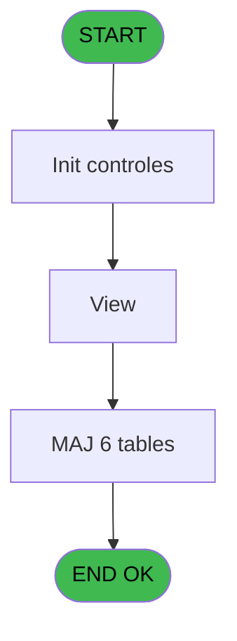
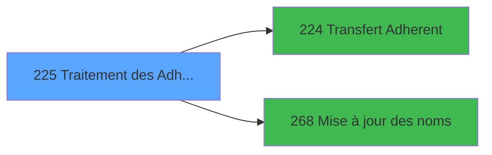

# PBG IDE 225 - Traitement des Adherents

> **Analyse**: Phases 1-4 2026-02-03 10:20 -> 10:21 (19s) | Assemblage 10:21
> **Pipeline**: V7.2 Enrichi
> **Structure**: 4 onglets (Resume | Ecrans | Donnees | Connexions)

<!-- TAB:Resume -->

## 1. FICHE D'IDENTITE

| Attribut | Valeur |
|----------|--------|
| Projet | PBG |
| IDE Position | 225 |
| Nom Programme | Traitement des Adherents |
| Fichier source | `Prg_225.xml` |
| Domaine metier | General |
| Taches | 16 (1 ecrans visibles) |
| Tables modifiees | 6 |
| Programmes appeles | 2 |

## 2. DESCRIPTION FONCTIONNELLE

**Traitement des Adherents** assure la gestion complete de ce processus, accessible depuis [Traitement des arrivants (IDE 206)](PBG-IDE-206.md).

Le flux de traitement s'organise en **4 blocs fonctionnels** :

- **Traitement** (10 taches) : traitements metier divers
- **Consultation** (3 taches) : ecrans de recherche, selection et consultation
- **Calcul** (2 taches) : calculs de montants, stocks ou compteurs
- **Validation** (1 tache) : controles et verifications de coherence

**Donnees modifiees** : 6 tables en ecriture (gm-recherche_____gmr, hebergement______heb, compte_gm________cgm, compteurs________cpt, inter_prestation_inp, Table_1094).

Detail : phases du traitement

#### Phase 1 : Traitement (10 taches)

- **225** - Veuillez patienter... **[[ECRAN]](#ecran-t1)**
- **225.2** - Determination Filiation
- **225.6** - Write Log Purge Unitaire
- **225.7** - Update Log Purge Unitaire
- **225.8** - Formatage Prenom
- **225.9** - Update Nom et Prenom
- **225.9.1** - Update Hebergement
- **225.10** - View
- **225.13** - vue cas test
- **225.14** - Suppr ligne a ne pas importer

Delegue a : [Mise à jour des noms (IDE 268)](PBG-IDE-268.md)

#### Phase 2 : Validation (1 tache)

- **225.1** - Verification Famille

#### Phase 3 : Calcul (2 taches)

- **225.3** - Selection Compteur
- **225.4** - Creation Compte

#### Phase 4 : Consultation (3 taches)

- **225.5** - Recherche Type sejour existant
- **225.11** - Recherche Type sejour existant
- **225.12** - Recherche Type sejour existant

#### Tables impactees

| Table | Operations | Role metier |
|-------|-----------|-------------|
| hebergement______heb | R/**W**/L (5 usages) | Hebergement (chambres) |
| gm-recherche_____gmr | R/**W** (3 usages) | Index de recherche |
| Table_1094 | **W** (2 usages) |  |
| inter_prestation_inp | **W** (1 usages) | Prestations/services vendus |
| compte_gm________cgm | **W** (1 usages) | Comptes GM (generaux) |
| compteurs________cpt | **W** (1 usages) | Comptes GM (generaux) |

## 3. BLOCS FONCTIONNELS

### 3.1 Traitement (10 taches)

Traitements internes.

---

#### 225 - Veuillez patienter... [[ECRAN]](#ecran-t1)

**Role** : Tache d'orchestration : point d'entree du programme (10 sous-taches). Coordonne l'enchainement des traitements.
**Ecran** : 429 x 66 DLU (MDI) | [Voir mockup](#ecran-t1)

9 sous-taches directes

| Tache | Nom | Bloc |
|-------|-----|------|
| [225.2](#t3) | Determination Filiation | Traitement |
| [225.6](#t7) | Write Log Purge Unitaire | Traitement |
| [225.7](#t8) | Update Log Purge Unitaire | Traitement |
| [225.8](#t11) | Formatage Prenom | Traitement |
| [225.9](#t12) | Update Nom et Prenom | Traitement |
| [225.9.1](#t13) | Update Hebergement | Traitement |
| [225.10](#t14) | View | Traitement |
| [225.13](#t37) | vue cas test | Traitement |
| [225.14](#t40) | Suppr ligne a ne pas importer | Traitement |

**Delegue a** : [Mise à jour des noms (IDE 268)](PBG-IDE-268.md)

---

#### 225.2 - Determination Filiation

**Role** : Traitement : Determination Filiation.
**Variables liees** : L (W0-Filiation Compte), N (W0-Filiation Adherent)
**Delegue a** : [Mise à jour des noms (IDE 268)](PBG-IDE-268.md)

---

#### 225.6 - Write Log Purge Unitaire

**Role** : Traitement : Write Log Purge Unitaire.
**Variables liees** : BA (V.Retour Purge), BC (v.Purge unitaire demandée), BD (v.Message Purge), BE (v.On fait la purge ici? 1 oui,)
**Delegue a** : [Mise à jour des noms (IDE 268)](PBG-IDE-268.md)

---

#### 225.7 - Update Log Purge Unitaire

**Role** : Traitement : Update Log Purge Unitaire.
**Variables liees** : BA (V.Retour Purge), BC (v.Purge unitaire demandée), BD (v.Message Purge), BE (v.On fait la purge ici? 1 oui,)
**Delegue a** : [Mise à jour des noms (IDE 268)](PBG-IDE-268.md)

---

#### 225.8 - Formatage Prenom

**Role** : Traitement : Formatage Prenom.
**Variables liees** : BB (v.Prenom)
**Delegue a** : [Mise à jour des noms (IDE 268)](PBG-IDE-268.md)

---

#### 225.9 - Update Nom et Prenom

**Role** : Traitement : Update Nom et Prenom.
**Variables liees** : BB (v.Prenom)
**Delegue a** : [Mise à jour des noms (IDE 268)](PBG-IDE-268.md)

---

#### 225.9.1 - Update Hebergement

**Role** : Traitement : Update Hebergement.
**Delegue a** : [Mise à jour des noms (IDE 268)](PBG-IDE-268.md)

---

#### 225.10 - View

**Role** : Traitement : View.
**Delegue a** : [Mise à jour des noms (IDE 268)](PBG-IDE-268.md)

---

#### 225.13 - vue cas test

**Role** : Verification : vue cas test.
**Delegue a** : [Mise à jour des noms (IDE 268)](PBG-IDE-268.md)

---

#### 225.14 - Suppr ligne a ne pas importer

**Role** : Traitement : Suppr ligne a ne pas importer.
**Delegue a** : [Mise à jour des noms (IDE 268)](PBG-IDE-268.md)

### 3.2 Validation (1 tache)

Controles de coherence : 1 tache verifie les donnees et conditions.

---

#### 225.1 - Verification Famille

**Role** : Verification : Verification Famille.
**Variables liees** : J (W0-Code Famille)

### 3.3 Calcul (2 taches)

Calculs metier : montants, stocks, compteurs.

---

#### 225.3 - Selection Compteur

**Role** : Calcul : Selection Compteur.
**Variables liees** : Z (V.Compteur)

---

#### 225.4 - Creation Compte

**Role** : Creation d'enregistrement : Creation Compte.
**Variables liees** : Z (V.Compteur), K (W0-Numero Compte), L (W0-Filiation Compte), O (W0-Prise en compte Heberg?)

### 3.4 Consultation (3 taches)

Ecrans de recherche et consultation.

---

#### 225.5 - Recherche Type sejour existant

**Role** : Traitement : Recherche Type sejour existant.
**Variables liees** : S (v.retour recherche?), B (P0-Lieu de Sejour), X (v_debut_sejour), Y (v_fin_sejour)

---

#### 225.11 - Recherche Type sejour existant

**Role** : Traitement : Recherche Type sejour existant.
**Variables liees** : S (v.retour recherche?), B (P0-Lieu de Sejour), X (v_debut_sejour), Y (v_fin_sejour)

---

#### 225.12 - Recherche Type sejour existant

**Role** : Traitement : Recherche Type sejour existant.
**Variables liees** : S (v.retour recherche?), B (P0-Lieu de Sejour), X (v_debut_sejour), Y (v_fin_sejour)

## 5. REGLES METIER

*(Aucune regle metier identifiee)*

## 6. CONTEXTE

- **Appele par**: [Traitement des arrivants (IDE 206)](PBG-IDE-206.md)
- **Appelle**: 2 programmes | **Tables**: 10 (W:6 R:3 L:5) | **Taches**: 16 | **Expressions**: 49

<!-- TAB:Ecrans -->

## 8. ECRANS

### 8.1 Forms visibles (1 / 16)

| # | Position | Tache | Nom | Type | Largeur | Hauteur | Bloc |
|---|----------|-------|-----|------|---------|---------|------|
| 1 | 225 | 225 | Veuillez patienter... | MDI | 429 | 66 | Traitement |

### 8.2 Mockups Ecrans

---

#### 225 - Veuillez patienter...
**Tache** : [225](#t1) | **Type** : MDI | **Dimensions** : 429 x 66 DLU
**Bloc** : Traitement | **Titre IDE** : Veuillez patienter...

<!-- FORM-DATA:
{
    "width":  429,
    "vFactor":  8,
    "type":  "MDI",
    "hFactor":  8,
    "controls":  [
                     {
                         "x":  1,
                         "type":  "label",
                         "var":  "",
                         "y":  0,
                         "w":  423,
                         "fmt":  "",
                         "name":  "",
                         "h":  29,
                         "color":  "",
                         "text":  "",
                         "parent":  null
                     },
                     {
                         "x":  99,
                         "type":  "label",
                         "var":  "",
                         "y":  10,
                         "w":  275,
                         "fmt":  "",
                         "name":  "",
                         "h":  8,
                         "color":  "7",
                         "text":  "Traitement des Adherents",
                         "parent":  null
                     },
                     {
                         "x":  1,
                         "type":  "label",
                         "var":  "",
                         "y":  29,
                         "w":  423,
                         "fmt":  "",
                         "name":  "",
                         "h":  37,
                         "color":  "",
                         "text":  "",
                         "parent":  null
                     },
                     {
                         "x":  9,
                         "type":  "label",
                         "var":  "",
                         "y":  41,
                         "w":  405,
                         "fmt":  "",
                         "name":  "",
                         "h":  19,
                         "color":  "",
                         "text":  "",
                         "parent":  null
                     },
                     {
                         "x":  42,
                         "type":  "label",
                         "var":  "",
                         "y":  30,
                         "w":  147,
                         "fmt":  "",
                         "name":  "",
                         "h":  9,
                         "color":  "",
                         "text":  "imi_num_ressource",
                         "parent":  null
                     },
                     {
                         "x":  2,
                         "type":  "image",
                         "var":  "",
                         "y":  2,
                         "w":  72,
                         "fmt":  "",
                         "name":  "",
                         "h":  25,
                         "color":  "",
                         "text":  "",
                         "parent":  null
                     },
                     {
                         "x":  190,
                         "type":  "edit",
                         "var":  "",
                         "y":  30,
                         "w":  45,
                         "fmt":  "",
                         "name":  "imi_num_ressource",
                         "h":  10,
                         "color":  "",
                         "text":  "",
                         "parent":  null
                     },
                     {
                         "x":  12,
                         "type":  "edit",
                         "var":  "",
                         "y":  42,
                         "w":  400,
                         "fmt":  "30",
                         "name":  "",
                         "h":  17,
                         "color":  "159",
                         "text":  "",
                         "parent":  4
                     },
                     {
                         "x":  177,
                         "type":  "edit",
                         "var":  "",
                         "y":  46,
                         "w":  64,
                         "fmt":  "3 %",
                         "name":  "",
                         "h":  8,
                         "color":  "143",
                         "text":  "",
                         "parent":  1
                     }
                 ],
    "taskId":  "225",
    "height":  66
}
-->

<strong>Champs : 3 champs</strong>

| Pos (x,y) | Nom | Variable | Type |
|-----------|-----|----------|------|
| 190,30 | imi_num_ressource | - | edit |
| 12,42 | 30 | - | edit |
| 177,46 | 3 % | - | edit |

## 9. NAVIGATION

Ecran unique: **Veuillez patienter...**

### 9.3 Structure hierarchique (16 taches)

| Position | Tache | Type | Dimensions | Bloc |
|----------|-------|------|------------|------|
| **225.1** | [**Veuillez patienter...** (225)](#t1) [mockup](#ecran-t1) | MDI | 429x66 | Traitement |
| 225.1.1 | [Determination Filiation (225.2)](#t3) | MDI | - | |
| 225.1.2 | [Write Log Purge Unitaire (225.6)](#t7) | - | - | |
| 225.1.3 | [Update Log Purge Unitaire (225.7)](#t8) | - | - | |
| 225.1.4 | [Formatage Prenom (225.8)](#t11) | MDI | - | |
| 225.1.5 | [Update Nom et Prenom (225.9)](#t12) | - | - | |
| 225.1.6 | [Update Hebergement (225.9.1)](#t13) | - | - | |
| 225.1.7 | [View (225.10)](#t14) | - | - | |
| 225.1.8 | [vue cas test (225.13)](#t37) | - | - | |
| 225.1.9 | [Suppr ligne a ne pas importer (225.14)](#t40) | - | - | |
| **225.2** | [**Verification Famille** (225.1)](#t2) | MDI | - | Validation |
| **225.3** | [**Selection Compteur** (225.3)](#t4) | MDI | - | Calcul |
| 225.3.1 | [Creation Compte (225.4)](#t5) | MDI | - | |
| **225.4** | [**Recherche Type sejour existant** (225.5)](#t6) | MDI | - | Consultation |
| 225.4.1 | [Recherche Type sejour existant (225.11)](#t28) | MDI | - | |
| 225.4.2 | [Recherche Type sejour existant (225.12)](#t31) | MDI | - | |

### 9.4 Algorigramme

> **Legende**: Vert = START/END OK | Rouge = END KO | Bleu = Decisions
> *Algorigramme auto-genere. Utiliser `/algorigramme` pour une synthese metier detaillee.*

<!-- TAB:Donnees -->

## 10. TABLES

### Tables utilisees (10)

| ID | Nom | Description | Type | R | W | L | Usages |
|----|-----|-------------|------|---|---|---|--------|
| 30 | gm-recherche_____gmr | Index de recherche | DB | R | **W** |   | 3 |
| 31 | gm-complet_______gmc |  | DB | R |   | L | 4 |
| 34 | hebergement______heb | Hebergement (chambres) | DB | R | **W** | L | 5 |
| 36 | client_gm |  | DB |   |   | L | 1 |
| 47 | compte_gm________cgm | Comptes GM (generaux) | DB |   | **W** |   | 1 |
| 68 | compteurs________cpt | Comptes GM (generaux) | DB |   | **W** |   | 1 |
| 131 | fichier_validation |  | DB |   |   | L | 1 |
| 569 | pointage_articles_caution | Articles et stock | TMP |   |   | L | 2 |
| 571 | inter_prestation_inp | Prestations/services vendus | TMP |   | **W** |   | 1 |
| 1094 | Table_1094 |  | MEM |   | **W** |   | 2 |

### Colonnes par table (3 / 7 tables avec colonnes identifiees)

Table 30 - gm-recherche_____gmr (R/**W**) - 3 usages

| Lettre | Variable | Acces | Type |
|--------|----------|-------|------|
| A | P0-Code Societe | W | Alpha |
| B | P0-Lieu de Sejour | W | Alpha |
| C | P0-Nb Arrivants | W | Numeric |
| D | P0-Numero Import | W | Numeric |
| E | P0-Qualite Import | W | Alpha |
| F | W0-Operande | W | Numeric |
| G | W0-Operateur | W | Numeric |
| H | W0-Pourcentage | W | Numeric |
| I | W0-Calcul Pourcent | W | Numeric |
| J | W0-Code Famille | W | Alpha |
| K | W0-Numero Compte | W | Numeric |
| L | W0-Filiation Compte | W | Numeric |
| M | W0-Numero Adherent | W | Numeric |
| N | W0-Filiation Adherent | W | Numeric |
| O | W0-Prise en compte Heberg? | W | Logical |
| P | W0-Prolongation Séjour ? | W | Logical |
| Q | W0-Avancement Séjour ? | W | Logical |
| R | W0-Ret Lien GMC | W | Numeric |
| S | v.retour recherche? | W | Logical |
| T | e.Record vide? | W | Logical |
| U | v.date deb dern troncon | W | Date |
| V | v.date fin dern troncon | W | Date |
| W | v_num_ressource | W | Unicode |
| X | v_debut_sejour | W | Date |
| Y | v_fin_sejour | W | Date |
| Z | V.Compteur | W | Numeric |
| BA | V.Retour Purge | W | Logical |
| BB | v.Prenom | W | Unicode |
| BC | v.Purge unitaire demandée | W | Logical |
| BD | v.Message Purge | W | Unicode |
| BE | v.On fait la purge ici? 1 oui, | W | Numeric |

Table 31 - gm-complet_______gmc (R/L) - 4 usages

*Table utilisee uniquement en Link ou aucune colonne Real identifiee dans le DataView.*

Table 34 - hebergement______heb (R/**W**/L) - 5 usages

*Table utilisee uniquement en Link ou aucune colonne Real identifiee dans le DataView.*

Table 47 - compte_gm________cgm (**W**) - 1 usages

| Lettre | Variable | Acces | Type |
|--------|----------|-------|------|
| A | e.Compte déjà existant? | W | Logical |
| C | V.Compte déjà attribué | W | Logical |
| K | W0-Numero Compte | W | Numeric |
| L | W0-Filiation Compte | W | Numeric |
| O | W0-Prise en compte Heberg? | W | Logical |
| Z | V.Compteur | W | Numeric |

Table 68 - compteurs________cpt (**W**) - 1 usages

*Table utilisee uniquement en Link ou aucune colonne Real identifiee dans le DataView.*

Table 571 - inter_prestation_inp (**W**) - 1 usages

*Table utilisee uniquement en Link ou aucune colonne Real identifiee dans le DataView.*

Table 1094 - Table_1094 (**W**) - 2 usages

| Lettre | Variable | Acces | Type |
|--------|----------|-------|------|
| B | V.Retour sur table import? | W | Logical |

## 11. VARIABLES

### 11.1 Variables de session (9)

Variables persistantes pendant toute la session.

| Lettre | Nom | Type | Usage dans |
|--------|-----|------|-----------|
| S | v.retour recherche? | Logical | - |
| U | v.date deb dern troncon | Date | 3x session |
| V | v.date fin dern troncon | Date | 3x session |
| Z | V.Compteur | Numeric | - |
| BA | V.Retour Purge | Logical | - |
| BB | v.Prenom | Unicode | - |
| BC | v.Purge unitaire demandée | Logical | - |
| BD | v.Message Purge | Unicode | - |
| BE | v.On fait la purge ici? 1 oui, | Numeric | - |

### 11.2 Autres (22)

Variables diverses.

| Lettre | Nom | Type | Usage dans |
|--------|-----|------|-----------|
| A | P0-Code Societe | Alpha | 1x refs |
| B | P0-Lieu de Sejour | Alpha | - |
| C | P0-Nb Arrivants | Numeric | - |
| D | P0-Numero Import | Numeric | - |
| E | P0-Qualite Import | Alpha | - |
| F | W0-Operande | Numeric | - |
| G | W0-Operateur | Numeric | - |
| H | W0-Pourcentage | Numeric | - |
| I | W0-Calcul Pourcent | Numeric | - |
| J | W0-Code Famille | Alpha | [225.1](#t2) |
| K | W0-Numero Compte | Numeric | [225.3](#t4), [225.4](#t5) |
| L | W0-Filiation Compte | Numeric | - |
| M | W0-Numero Adherent | Numeric | 1x refs |
| N | W0-Filiation Adherent | Numeric | 1x refs |
| O | W0-Prise en compte Heberg? | Logical | - |
| P | W0-Prolongation Séjour ? | Logical | 1x refs |
| Q | W0-Avancement Séjour ? | Logical | 2x refs |
| R | W0-Ret Lien GMC | Numeric | - |
| T | e.Record vide? | Logical | 1x refs |
| W | v_num_ressource | Unicode | 2x refs |
| X | v_debut_sejour | Date | - |
| Y | v_fin_sejour | Date | - |

Toutes les 31 variables (liste complete)

| Cat | Lettre | Nom Variable | Type |
|-----|--------|--------------|------|
| V. | **S** | v.retour recherche? | Logical |
| V. | **U** | v.date deb dern troncon | Date |
| V. | **V** | v.date fin dern troncon | Date |
| V. | **Z** | V.Compteur | Numeric |
| V. | **BA** | V.Retour Purge | Logical |
| V. | **BB** | v.Prenom | Unicode |
| V. | **BC** | v.Purge unitaire demandée | Logical |
| V. | **BD** | v.Message Purge | Unicode |
| V. | **BE** | v.On fait la purge ici? 1 oui, | Numeric |
| Autre | **A** | P0-Code Societe | Alpha |
| Autre | **B** | P0-Lieu de Sejour | Alpha |
| Autre | **C** | P0-Nb Arrivants | Numeric |
| Autre | **D** | P0-Numero Import | Numeric |
| Autre | **E** | P0-Qualite Import | Alpha |
| Autre | **F** | W0-Operande | Numeric |
| Autre | **G** | W0-Operateur | Numeric |
| Autre | **H** | W0-Pourcentage | Numeric |
| Autre | **I** | W0-Calcul Pourcent | Numeric |
| Autre | **J** | W0-Code Famille | Alpha |
| Autre | **K** | W0-Numero Compte | Numeric |
| Autre | **L** | W0-Filiation Compte | Numeric |
| Autre | **M** | W0-Numero Adherent | Numeric |
| Autre | **N** | W0-Filiation Adherent | Numeric |
| Autre | **O** | W0-Prise en compte Heberg? | Logical |
| Autre | **P** | W0-Prolongation Séjour ? | Logical |
| Autre | **Q** | W0-Avancement Séjour ? | Logical |
| Autre | **R** | W0-Ret Lien GMC | Numeric |
| Autre | **T** | e.Record vide? | Logical |
| Autre | **W** | v_num_ressource | Unicode |
| Autre | **X** | v_debut_sejour | Date |
| Autre | **Y** | v_fin_sejour | Date |

## 12. EXPRESSIONS

**49 / 49 expressions decodees (100%)**

### 12.1 Repartition par type

| Type | Expressions | Regles |
|------|-------------|--------|
| CALCULATION | 5 | 0 |
| CONSTANTE | 7 | 0 |
| CONDITION | 14 | 0 |
| DATE | 1 | 0 |
| FORMAT | 1 | 0 |
| REFERENCE_VG | 1 | 0 |
| OTHER | 18 | 0 |
| CAST_LOGIQUE | 2 | 0 |

### 12.2 Expressions cles par type

#### CALCULATION (5 expressions)

| Type | IDE | Expression | Regle |
|------|-----|------------|-------|
| CALCULATION | 30 | `VG69+1` | - |
| CALCULATION | 32 | `VG70+1` | - |
| CALCULATION | 25 | `[CI]+1` | - |
| CALCULATION | 2 | `([CI]/VG1)*100` | - |
| CALCULATION | 3 | `([CI]/VG1)*50` | - |

#### CONSTANTE (7 expressions)

| Type | IDE | Expression | Regle |
|------|-----|------------|-------|
| CONSTANTE | 19 | `'A'` | - |
| CONSTANTE | 20 | `'Z'` | - |
| CONSTANTE | 21 | `'I'` | - |
| CONSTANTE | 18 | `'H'` | - |
| CONSTANTE | 1 | `''` | - |
| ... | | *+2 autres* | |

#### CONDITION (14 expressions)

| Type | IDE | Expression | Regle |
|------|-----|------------|-------|
| CONDITION | 26 | `Trim(v_num_ressource [W])<>'UNKNOWN' AND Trim([CL])='UNKNOWN'` | - |
| CONDITION | 49 | `[CP]=23116571` | - |
| CONDITION | 46 | `v.date deb dern troncon [U]<>W0-Prise en compte Heb... [O] OR v.date fin dern troncon [V]<>W0-Prolongation Séjour ? [P] OR IsFirstRecordCycle(0)` | - |
| CONDITION | 33 | `Trim([AD])='' AND NOT(VG68) OR NOT([DG]) OR ([DG] AND NOT([CV]))` | - |
| CONDITION | 47 | `Trim(VG20)='' OR Trim(VG20)='DSIOP'` | - |
| ... | | *+9 autres* | |

#### DATE (1 expressions)

| Type | IDE | Expression | Regle |
|------|-----|------------|-------|
| DATE | 29 | `Date()` | - |

#### FORMAT (1 expressions)

| Type | IDE | Expression | Regle |
|------|-----|------------|-------|
| FORMAT | 42 | `MlsTrans('Le nouveau séjour ne sera importé qu''à partir du ')&DStr(AddDate(IF(W0-Numero Compte [K]=0,[DL],[EA]),0,0,1),'DD/MM/YYYY')` | - |

#### REFERENCE_VG (1 expressions)

| Type | IDE | Expression | Regle |
|------|-----|------------|-------|
| REFERENCE_VG | 4 | `VG20` | - |

#### OTHER (18 expressions)

| Type | IDE | Expression | Regle |
|------|-----|------------|-------|
| OTHER | 31 | `[CV]` | - |
| OTHER | 37 | `W0-Numero Adherent [M]` | - |
| OTHER | 23 | `v.date fin dern troncon [V]` | - |
| OTHER | 27 | `VG68 AND [DH]` | - |
| OTHER | 38 | `W0-Filiation Adherent [N]` | - |
| ... | | *+13 autres* | |

#### CAST_LOGIQUE (2 expressions)

| Type | IDE | Expression | Regle |
|------|-----|------------|-------|
| CAST_LOGIQUE | 36 | `'TRUE'LOG` | - |
| CAST_LOGIQUE | 24 | `'FALSE'LOG` | - |

### 12.3 Toutes les expressions (49)

Voir les 49 expressions

#### CALCULATION (5)

| IDE | Expression Decodee |
|-----|-------------------|
| 2 | `([CI]/VG1)*100` |
| 3 | `([CI]/VG1)*50` |
| 25 | `[CI]+1` |
| 30 | `VG69+1` |
| 32 | `VG70+1` |

#### CONSTANTE (7)

| IDE | Expression Decodee |
|-----|-------------------|
| 1 | `''` |
| 5 | `0` |
| 17 | `'E'` |
| 18 | `'H'` |
| 19 | `'A'` |
| 20 | `'Z'` |
| 21 | `'I'` |

#### CONDITION (14)

| IDE | Expression Decodee |
|-----|-------------------|
| 28 | `Date()>[DL] AND ([CW]<>[DK] OR [CX]<>[DL])` |
| 40 | `Date()<=[DX] AND [CW]>[DX]` |
| 41 | `W0-Numero Compte [K]<>0 AND Date() <=[EA] AND [CW]>[EA]` |
| 6 | `W0-Code Famille [J]='O'` |
| 7 | `W0-Code Famille [J]='N'` |
| 12 | `W0-Numero Compte [K]=0` |
| 34 | `W0-Numero Compte [K]<>0 OR ([DG] AND [CV])` |
| 46 | `v.date deb dern troncon [U]<>W0-Prise en compte Heb... [O] OR v.date fin dern troncon [V]<>W0-Prolongation Séjour ? [P] OR IsFirstRecordCycle(0)` |
| 49 | `[CP]=23116571` |
| 26 | `Trim(v_num_ressource [W])<>'UNKNOWN' AND Trim([CL])='UNKNOWN'` |
| 33 | `Trim([AD])='' AND NOT(VG68) OR NOT([DG]) OR ([DG] AND NOT([CV]))` |
| 35 | `Trim(v_num_ressource [W])<>Trim([CL])` |
| 43 | `[CV] OR (NOT([CV]) AND Trim([DM])<>'')` |
| 47 | `Trim(VG20)='' OR Trim(VG20)='DSIOP'` |

#### DATE (1)

| IDE | Expression Decodee |
|-----|-------------------|
| 29 | `Date()` |

#### FORMAT (1)

| IDE | Expression Decodee |
|-----|-------------------|
| 42 | `MlsTrans('Le nouveau séjour ne sera importé qu''à partir du ')&DStr(AddDate(IF(W0-Numero Compte [K]=0,[DL],[EA]),0,0,1),'DD/MM/YYYY')` |

#### REFERENCE_VG (1)

| IDE | Expression Decodee |
|-----|-------------------|
| 4 | `VG20` |

#### OTHER (18)

| IDE | Expression Decodee |
|-----|-------------------|
| 8 | `P0-Code Societe [A]` |
| 9 | `e.Record vide? [T]` |
| 10 | `v.date deb dern troncon [U]` |
| 11 | `v.date fin dern troncon [V]` |
| 13 | `W0-Avancement Séjour ? [Q]` |
| 14 | `[AG]` |
| 15 | `[AK]` |
| 16 | `[AL]` |
| 22 | `v.date deb dern troncon [U]` |
| 23 | `v.date fin dern troncon [V]` |
| 27 | `VG68 AND [DH]` |
| 31 | `[CV]` |
| 37 | `W0-Numero Adherent [M]` |
| 38 | `W0-Filiation Adherent [N]` |
| 39 | `[DI] OR [DJ]` |
| 44 | `[CW]` |
| 45 | `[CX]` |
| 48 | `NOT(W0-Avancement Séjour ? [Q])` |

#### CAST_LOGIQUE (2)

| IDE | Expression Decodee |
|-----|-------------------|
| 24 | `'FALSE'LOG` |
| 36 | `'TRUE'LOG` |

<!-- TAB:Connexions -->

## 13. GRAPHE D'APPELS

### 13.1 Chaine depuis Main (Callers)

Main -> ... -> [Traitement des arrivants (IDE 206)](PBG-IDE-206.md) -> **Traitement des Adherents (IDE 225)**

### 13.2 Callers

| IDE | Nom Programme | Nb Appels |
|-----|---------------|-----------|
| [206](PBG-IDE-206.md) | Traitement des arrivants | 1 |

### 13.3 Callees (programmes appeles)

### 13.4 Detail Callees avec contexte

| IDE | Nom Programme | Appels | Contexte |
|-----|---------------|--------|----------|
| [224](PBG-IDE-224.md) | Transfert Adherent | 2 | Transfert donnees |
| [268](PBG-IDE-268.md) | Mise à jour des noms | 1 | Mise a jour donnees |

## 14. RECOMMANDATIONS MIGRATION

### 14.1 Profil du programme

| Metrique | Valeur | Impact migration |
|----------|--------|-----------------|
| Lignes de logique | 476 | Taille moyenne |
| Expressions | 49 | Peu de logique |
| Tables WRITE | 6 | Fort impact donnees |
| Sous-programmes | 2 | Peu de dependances |
| Ecrans visibles | 1 | Ecran unique ou traitement batch |
| Code desactive | 0.6% (3 / 476) | Code sain |
| Regles metier | 0 | Pas de regle identifiee |

### 14.2 Plan de migration par bloc

#### Traitement (10 taches: 1 ecran, 9 traitements)

- **Strategie** : Orchestrateur avec 1 ecrans (Razor/React) et 9 traitements backend (services).
- Les ecrans deviennent des composants UI, les traitements invisibles deviennent des services injectables.
- 2 sous-programme(s) a migrer ou a reutiliser depuis les services existants.
- Decomposer les taches en services unitaires testables.

#### Validation (1 tache: 0 ecran, 1 traitement)

- **Strategie** : FluentValidation avec validators specifiques.
- Chaque tache de validation -> un validator injectable

#### Calcul (2 taches: 0 ecran, 2 traitements)

- **Strategie** : Services de calcul purs (Domain Services).
- Migrer la logique de calcul (stock, compteurs, montants)

#### Consultation (3 taches: 0 ecran, 3 traitements)

- **Strategie** : Composants de recherche/selection en modales.

### 14.3 Dependances critiques

| Dependance | Type | Appels | Impact |
|------------|------|--------|--------|
| gm-recherche_____gmr | Table WRITE (Database) | 1x | Schema + repository |
| hebergement______heb | Table WRITE (Database) | 1x | Schema + repository |
| compte_gm________cgm | Table WRITE (Database) | 1x | Schema + repository |
| compteurs________cpt | Table WRITE (Database) | 1x | Schema + repository |
| inter_prestation_inp | Table WRITE (Temp) | 1x | Schema + repository |
| Table_1094 | Table WRITE (Memory) | 2x | Schema + repository |
| [Transfert Adherent (IDE 224)](PBG-IDE-224.md) | Sous-programme | 2x | Haute - Transfert donnees |
| [Mise à jour des noms (IDE 268)](PBG-IDE-268.md) | Sous-programme | 1x | Normale - Mise a jour donnees |

---
*Spec DETAILED generee par Pipeline V7.2 - 2026-02-03 10:21*
