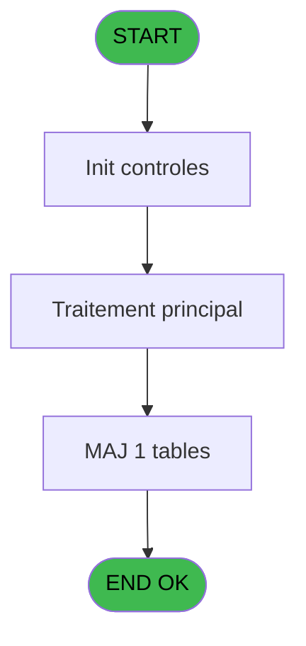
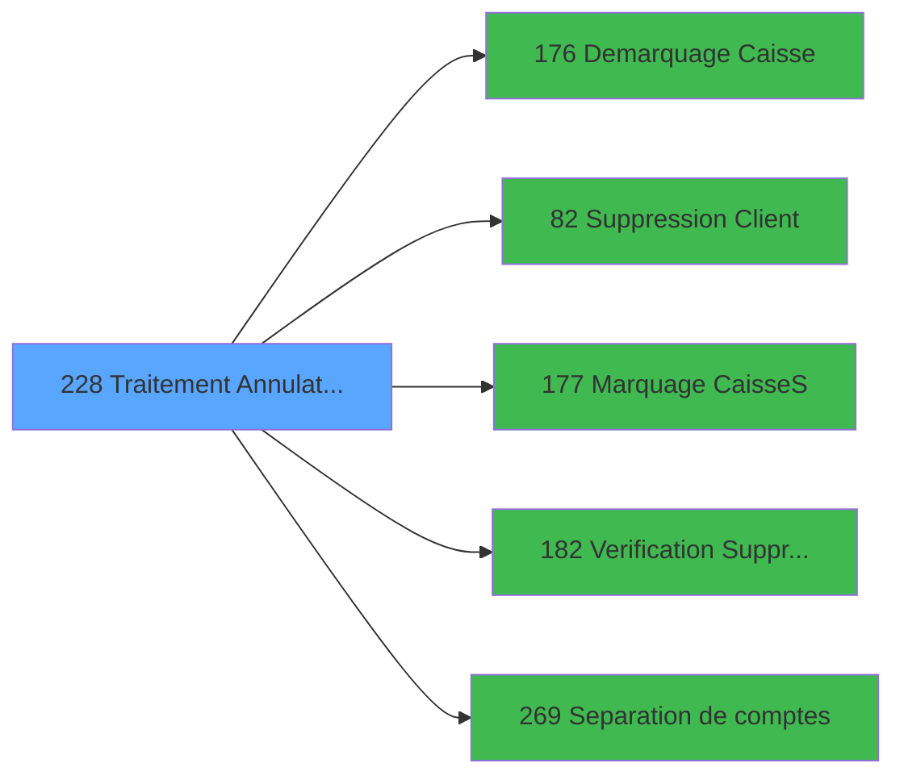

# PBG IDE 228 - Traitement Annulation Existant

> **Analyse**: Phases 1-4 2026-02-03 10:22 -> 10:22 (17s) | Assemblage 10:22
> **Pipeline**: V7.2 Enrichi
> **Structure**: 4 onglets (Resume | Ecrans | Donnees | Connexions)

<!-- TAB:Resume -->

## 1. FICHE D'IDENTITE

| Attribut | Valeur |
|----------|--------|
| Projet | PBG |
| IDE Position | 228 |
| Nom Programme | Traitement Annulation Existant |
| Fichier source | `Prg_228.xml` |
| Domaine metier | General |
| Taches | 10 (1 ecrans visibles) |
| Tables modifiees | 1 |
| Programmes appeles | 5 |

## 2. DESCRIPTION FONCTIONNELLE

**Traitement Annulation Existant** assure la gestion complete de ce processus, accessible depuis [Traitement des arrivants (IDE 206)](PBG-IDE-206.md).

Le flux de traitement s'organise en **3 blocs fonctionnels** :

- **Traitement** (8 taches) : traitements metier divers
- **Initialisation** (1 tache) : reinitialisation d'etats et de variables de travail
- **Validation** (1 tache) : controles et verifications de coherence

**Donnees modifiees** : 1 tables en ecriture (pv_pms_prestations_tmp).

Detail : phases du traitement

#### Phase 1 : Traitement (8 taches)

- **228** - Veuillez patienter ... **[[ECRAN]](#ecran-t1)**
- **228.1** - Age Enfant/Bebe
- **228.2** - Import IDE.DAT
- **228.2.1** - Annulation GM
- **228.2.1.2** - Cloture Caisse en cours ?
- **228.2.1.4** - Maj ASD
- **228.2.1.5** - Avertissement Import
- **228.3** - Suppression enregistrement = 0

Delegue a : [Demarquage Caisse (IDE 176)](PBG-IDE-176.md), [   Suppression Client (IDE 82)](PBG-IDE-82.md), [Marquage Caisse(S) (IDE 177)](PBG-IDE-177.md)

#### Phase 2 : Validation (1 tache)

- **228.2.1.1** - Verif. existence ?

Delegue a : [Verification Suppression (IDE 182)](PBG-IDE-182.md)

#### Phase 3 : Initialisation (1 tache)

- **228.2.1.3** - Definition N° cas

#### Tables impactees

| Table | Operations | Role metier |
|-------|-----------|-------------|
| pv_pms_prestations_tmp | **W** (1 usages) | Prestations/services vendus |

## 3. BLOCS FONCTIONNELS

### 3.1 Traitement (8 taches)

Traitements internes.

---

#### 228 - Veuillez patienter ... [[ECRAN]](#ecran-t1)

**Role** : Tache d'orchestration : point d'entree du programme (8 sous-taches). Coordonne l'enchainement des traitements.
**Ecran** : 429 x 68 DLU (MDI) | [Voir mockup](#ecran-t1)

7 sous-taches directes

| Tache | Nom | Bloc |
|-------|-----|------|
| [228.1](#t2) | Age Enfant/Bebe | Traitement |
| [228.2](#t3) | Import IDE.DAT | Traitement |
| [228.2.1](#t4) | Annulation GM | Traitement |
| [228.2.1.2](#t6) | Cloture Caisse en cours ? | Traitement |
| [228.2.1.4](#t8) | Maj ASD | Traitement |
| [228.2.1.5](#t9) | Avertissement Import | Traitement |
| [228.3](#t10) | Suppression enregistrement = 0 | Traitement |

**Delegue a** : [Demarquage Caisse (IDE 176)](PBG-IDE-176.md), [   Suppression Client (IDE 82)](PBG-IDE-82.md), [Marquage Caisse(S) (IDE 177)](PBG-IDE-177.md)

---

#### 228.1 - Age Enfant/Bebe

**Role** : Traitement : Age Enfant/Bebe.
**Delegue a** : [Demarquage Caisse (IDE 176)](PBG-IDE-176.md), [   Suppression Client (IDE 82)](PBG-IDE-82.md), [Marquage Caisse(S) (IDE 177)](PBG-IDE-177.md)

---

#### 228.2 - Import IDE.DAT

**Role** : Traitement : Import IDE.DAT.
**Variables liees** : D (P0 N° Import)
**Delegue a** : [Demarquage Caisse (IDE 176)](PBG-IDE-176.md), [   Suppression Client (IDE 82)](PBG-IDE-82.md), [Marquage Caisse(S) (IDE 177)](PBG-IDE-177.md)

---

#### 228.2.1 - Annulation GM

**Role** : Traitement : Annulation GM.
**Variables liees** : C (P0-Nb Annulation)
**Delegue a** : [Demarquage Caisse (IDE 176)](PBG-IDE-176.md), [   Suppression Client (IDE 82)](PBG-IDE-82.md), [Marquage Caisse(S) (IDE 177)](PBG-IDE-177.md)

---

#### 228.2.1.2 - Cloture Caisse en cours ?

**Role** : Traitement : Cloture Caisse en cours ?.
**Delegue a** : [Demarquage Caisse (IDE 176)](PBG-IDE-176.md), [   Suppression Client (IDE 82)](PBG-IDE-82.md), [Marquage Caisse(S) (IDE 177)](PBG-IDE-177.md)

---

#### 228.2.1.4 - Maj ASD

**Role** : Traitement : Maj ASD.
**Delegue a** : [Demarquage Caisse (IDE 176)](PBG-IDE-176.md), [   Suppression Client (IDE 82)](PBG-IDE-82.md), [Marquage Caisse(S) (IDE 177)](PBG-IDE-177.md)

---

#### 228.2.1.5 - Avertissement Import

**Role** : Traitement : Avertissement Import.
**Variables liees** : D (P0 N° Import)
**Delegue a** : [Demarquage Caisse (IDE 176)](PBG-IDE-176.md), [   Suppression Client (IDE 82)](PBG-IDE-82.md), [Marquage Caisse(S) (IDE 177)](PBG-IDE-177.md)

---

#### 228.3 - Suppression enregistrement = 0

**Role** : Traitement : Suppression enregistrement = 0.
**Delegue a** : [Demarquage Caisse (IDE 176)](PBG-IDE-176.md), [   Suppression Client (IDE 82)](PBG-IDE-82.md), [Marquage Caisse(S) (IDE 177)](PBG-IDE-177.md)

### 3.2 Validation (1 tache)

Controles de coherence : 1 tache verifie les donnees et conditions.

---

#### 228.2.1.1 - Verif. existence ?

**Role** : Verification : Verif. existence ?.
**Delegue a** : [Verification Suppression (IDE 182)](PBG-IDE-182.md)

### 3.3 Initialisation (1 tache)

Reinitialisation d'etats et variables de travail.

---

#### 228.2.1.3 - Definition N° cas

**Role** : Reinitialisation : Definition N° cas.

## 5. REGLES METIER

*(Aucune regle metier identifiee)*

## 6. CONTEXTE

- **Appele par**: [Traitement des arrivants (IDE 206)](PBG-IDE-206.md)
- **Appelle**: 5 programmes | **Tables**: 8 (W:1 R:5 L:3) | **Taches**: 10 | **Expressions**: 4

<!-- TAB:Ecrans -->

## 8. ECRANS

### 8.1 Forms visibles (1 / 10)

| # | Position | Tache | Nom | Type | Largeur | Hauteur | Bloc |
|---|----------|-------|-----|------|---------|---------|------|
| 1 | 228 | 228 | Veuillez patienter ... | MDI | 429 | 68 | Traitement |

### 8.2 Mockups Ecrans

---

#### 228 - Veuillez patienter ...
**Tache** : [228](#t1) | **Type** : MDI | **Dimensions** : 429 x 68 DLU
**Bloc** : Traitement | **Titre IDE** : Veuillez patienter ...

<!-- FORM-DATA:
{
    "width":  429,
    "vFactor":  8,
    "type":  "MDI",
    "hFactor":  8,
    "controls":  [
                     {
                         "x":  1,
                         "type":  "label",
                         "var":  "",
                         "y":  0,
                         "w":  423,
                         "fmt":  "",
                         "name":  "",
                         "h":  29,
                         "color":  "",
                         "text":  "",
                         "parent":  null
                     },
                     {
                         "x":  89,
                         "type":  "label",
                         "var":  "",
                         "y":  10,
                         "w":  312,
                         "fmt":  "",
                         "name":  "",
                         "h":  8,
                         "color":  "7",
                         "text":  "Traitement Annulation Present",
                         "parent":  null
                     },
                     {
                         "x":  1,
                         "type":  "label",
                         "var":  "",
                         "y":  29,
                         "w":  423,
                         "fmt":  "",
                         "name":  "",
                         "h":  37,
                         "color":  "",
                         "text":  "",
                         "parent":  null
                     },
                     {
                         "x":  9,
                         "type":  "label",
                         "var":  "",
                         "y":  41,
                         "w":  405,
                         "fmt":  "",
                         "name":  "",
                         "h":  19,
                         "color":  "",
                         "text":  "",
                         "parent":  null
                     },
                     {
                         "x":  2,
                         "type":  "image",
                         "var":  "",
                         "y":  2,
                         "w":  72,
                         "fmt":  "",
                         "name":  "",
                         "h":  25,
                         "color":  "",
                         "text":  "",
                         "parent":  null
                     },
                     {
                         "x":  12,
                         "type":  "edit",
                         "var":  "",
                         "y":  42,
                         "w":  400,
                         "fmt":  "30",
                         "name":  "",
                         "h":  17,
                         "color":  "159",
                         "text":  "",
                         "parent":  4
                     },
                     {
                         "x":  177,
                         "type":  "edit",
                         "var":  "",
                         "y":  46,
                         "w":  64,
                         "fmt":  "3 %",
                         "name":  "",
                         "h":  8,
                         "color":  "143",
                         "text":  "",
                         "parent":  1
                     }
                 ],
    "taskId":  "228",
    "height":  68
}
-->

<strong>Champs : 2 champs</strong>

| Pos (x,y) | Nom | Variable | Type |
|-----------|-----|----------|------|
| 12,42 | 30 | - | edit |
| 177,46 | 3 % | - | edit |

## 9. NAVIGATION

Ecran unique: **Veuillez patienter ...**

### 9.3 Structure hierarchique (10 taches)

| Position | Tache | Type | Dimensions | Bloc |
|----------|-------|------|------------|------|
| **228.1** | [**Veuillez patienter ...** (228)](#t1) [mockup](#ecran-t1) | MDI | 429x68 | Traitement |
| 228.1.1 | [Age Enfant/Bebe (228.1)](#t2) | MDI | - | |
| 228.1.2 | [Import IDE.DAT (228.2)](#t3) | MDI | - | |
| 228.1.3 | [Annulation GM (228.2.1)](#t4) | MDI | - | |
| 228.1.4 | [Cloture Caisse en cours ? (228.2.1.2)](#t6) | MDI | - | |
| 228.1.5 | [Maj ASD (228.2.1.4)](#t8) | MDI | - | |
| 228.1.6 | [Avertissement Import (228.2.1.5)](#t9) | MDI | - | |
| 228.1.7 | [Suppression enregistrement = 0 (228.3)](#t10) | MDI | - | |
| **228.2** | [**Verif. existence ?** (228.2.1.1)](#t5) | MDI | - | Validation |
| **228.3** | [**Definition N° cas** (228.2.1.3)](#t7) | MDI | - | Initialisation |

### 9.4 Algorigramme

> **Legende**: Vert = START/END OK | Rouge = END KO | Bleu = Decisions
> *Algorigramme auto-genere. Utiliser `/algorigramme` pour une synthese metier detaillee.*

<!-- TAB:Donnees -->

## 10. TABLES

### Tables utilisees (8)

| ID | Nom | Description | Type | R | W | L | Usages |
|----|-----|-------------|------|---|---|---|--------|
| 23 | reseau_cloture___rec | Donnees reseau/cloture | DB | R |   |   | 1 |
| 30 | gm-recherche_____gmr | Index de recherche | DB | R |   |   | 2 |
| 31 | gm-complet_______gmc |  | DB | R |   | L | 2 |
| 34 | hebergement______heb | Hebergement (chambres) | DB |   |   | L | 1 |
| 113 | tables_village |  | DB | R |   |   | 1 |
| 133 | new_asd |  | DB |   |   | L | 1 |
| 574 | pv_pms_prestations_tmp | Prestations/services vendus | TMP |   | **W** |   | 1 |
| 645 | tempo_ecran_police | Table temporaire ecran | DB | R |   |   | 1 |

### Colonnes par table (1 / 6 tables avec colonnes identifiees)

Table 23 - reseau_cloture___rec (R) - 1 usages

| Lettre | Variable | Acces | Type |
|--------|----------|-------|------|
| A | W3 Cloture en cours | R | Numeric |

Table 30 - gm-recherche_____gmr (R) - 2 usages

*Table utilisee uniquement en Link ou aucune colonne Real identifiee dans le DataView.*

Table 31 - gm-complet_______gmc (R/L) - 2 usages

*Table utilisee uniquement en Link ou aucune colonne Real identifiee dans le DataView.*

Table 113 - tables_village (R) - 1 usages

*Table utilisee uniquement en Link ou aucune colonne Real identifiee dans le DataView.*

Table 574 - pv_pms_prestations_tmp (**W**) - 1 usages

*Table utilisee uniquement en Link ou aucune colonne Real identifiee dans le DataView.*

Table 645 - tempo_ecran_police (R) - 1 usages

*Table utilisee uniquement en Link ou aucune colonne Real identifiee dans le DataView.*

## 11. VARIABLES

### 11.1 Parametres entrants (1)

Variables recues du programme appelant ([Traitement des arrivants (IDE 206)](PBG-IDE-206.md)).

| Lettre | Nom | Type | Usage dans |
|--------|-----|------|-----------|
| D | P0 N° Import | Numeric | - |

### 11.2 Variables de session (1)

Variables persistantes pendant toute la session.

| Lettre | Nom | Type | Usage dans |
|--------|-----|------|-----------|
| Q | V.Compteur | Numeric | - |

### 11.3 Variables de travail (2)

Variables internes au programme.

| Lettre | Nom | Type | Usage dans |
|--------|-----|------|-----------|
| O | W0 Age Bebe | Numeric | - |
| P | W0 Age Enfant | Numeric | - |

### 11.4 Autres (13)

Variables diverses.

| Lettre | Nom | Type | Usage dans |
|--------|-----|------|-----------|
| A | P0-Code Societe | Alpha | - |
| B | P0-Lieu de Sejour | Alpha | - |
| C | P0-Nb Annulation | Numeric | - |
| E | W0-Operande | Numeric | - |
| F | W0-Operateur | Numeric | - |
| G | W0-Pourcentage | Numeric | - |
| H | W0-Calcul Pourcent | Numeric | - |
| I | W0-Type Client | Alpha | - |
| J | W0-N°Adherent | Numeric | - |
| K | W0-Filiation Adh. | Numeric | - |
| L | W0-Type Accompagnant | Alpha | - |
| M | W0-N°Accompagnant | Numeric | - |
| N | W0-Filiation Acc. | Numeric | - |

Toutes les 17 variables (liste complete)

| Cat | Lettre | Nom Variable | Type |
|-----|--------|--------------|------|
| P0 | **D** | P0 N° Import | Numeric |
| W0 | **O** | W0 Age Bebe | Numeric |
| W0 | **P** | W0 Age Enfant | Numeric |
| V. | **Q** | V.Compteur | Numeric |
| Autre | **A** | P0-Code Societe | Alpha |
| Autre | **B** | P0-Lieu de Sejour | Alpha |
| Autre | **C** | P0-Nb Annulation | Numeric |
| Autre | **E** | W0-Operande | Numeric |
| Autre | **F** | W0-Operateur | Numeric |
| Autre | **G** | W0-Pourcentage | Numeric |
| Autre | **H** | W0-Calcul Pourcent | Numeric |
| Autre | **I** | W0-Type Client | Alpha |
| Autre | **J** | W0-N°Adherent | Numeric |
| Autre | **K** | W0-Filiation Adh. | Numeric |
| Autre | **L** | W0-Type Accompagnant | Alpha |
| Autre | **M** | W0-N°Accompagnant | Numeric |
| Autre | **N** | W0-Filiation Acc. | Numeric |

## 12. EXPRESSIONS

**4 / 4 expressions decodees (100%)**

### 12.1 Repartition par type

| Type | Expressions | Regles |
|------|-------------|--------|
| CALCULATION | 3 | 0 |
| CONSTANTE | 1 | 0 |

### 12.2 Expressions cles par type

#### CALCULATION (3 expressions)

| Type | IDE | Expression | Regle |
|------|-----|------------|-------|
| CALCULATION | 4 | `[AG]+1` | - |
| CALCULATION | 3 | `([AG]/VG10)*50` | - |
| CALCULATION | 2 | `([AG]/VG10)*100` | - |

#### CONSTANTE (1 expressions)

| Type | IDE | Expression | Regle |
|------|-----|------------|-------|
| CONSTANTE | 1 | `''` | - |

<!-- TAB:Connexions -->

## 13. GRAPHE D'APPELS

### 13.1 Chaine depuis Main (Callers)

Main -> ... -> [Traitement des arrivants (IDE 206)](PBG-IDE-206.md) -> **Traitement Annulation Existant (IDE 228)**

### 13.2 Callers

| IDE | Nom Programme | Nb Appels |
|-----|---------------|-----------|
| [206](PBG-IDE-206.md) | Traitement des arrivants | 1 |

### 13.3 Callees (programmes appeles)

### 13.4 Detail Callees avec contexte

| IDE | Nom Programme | Appels | Contexte |
|-----|---------------|--------|----------|
| [176](PBG-IDE-176.md) | Demarquage Caisse | 2 | Sous-programme |
| [82](PBG-IDE-82.md) |    Suppression Client | 1 | Sous-programme |
| [177](PBG-IDE-177.md) | Marquage Caisse(S) | 1 | Sous-programme |
| [182](PBG-IDE-182.md) | Verification Suppression | 1 | Controle/validation |
| [269](PBG-IDE-269.md) | Separation de comptes | 1 | Sous-programme |

## 14. RECOMMANDATIONS MIGRATION

### 14.1 Profil du programme

| Metrique | Valeur | Impact migration |
|----------|--------|-----------------|
| Lignes de logique | 262 | Taille moyenne |
| Expressions | 4 | Peu de logique |
| Tables WRITE | 1 | Impact faible |
| Sous-programmes | 5 | Peu de dependances |
| Ecrans visibles | 1 | Ecran unique ou traitement batch |
| Code desactive | 0% (0 / 262) | Code sain |
| Regles metier | 0 | Pas de regle identifiee |

### 14.2 Plan de migration par bloc

#### Traitement (8 taches: 1 ecran, 7 traitements)

- **Strategie** : Orchestrateur avec 1 ecrans (Razor/React) et 7 traitements backend (services).
- Les ecrans deviennent des composants UI, les traitements invisibles deviennent des services injectables.
- 5 sous-programme(s) a migrer ou a reutiliser depuis les services existants.
- Decomposer les taches en services unitaires testables.

#### Validation (1 tache: 0 ecran, 1 traitement)

- **Strategie** : FluentValidation avec validators specifiques.
- Chaque tache de validation -> un validator injectable

#### Initialisation (1 tache: 0 ecran, 1 traitement)

- **Strategie** : Constructeur/methode `InitAsync()` dans l'orchestrateur.

### 14.3 Dependances critiques

| Dependance | Type | Appels | Impact |
|------------|------|--------|--------|
| pv_pms_prestations_tmp | Table WRITE (Temp) | 1x | Schema + repository |
| [Demarquage Caisse (IDE 176)](PBG-IDE-176.md) | Sous-programme | 2x | Haute - Sous-programme |
| [Verification Suppression (IDE 182)](PBG-IDE-182.md) | Sous-programme | 1x | Normale - Controle/validation |
| [Separation de comptes (IDE 269)](PBG-IDE-269.md) | Sous-programme | 1x | Normale - Sous-programme |
| [   Suppression Client (IDE 82)](PBG-IDE-82.md) | Sous-programme | 1x | Normale - Sous-programme |
| [Marquage Caisse(S) (IDE 177)](PBG-IDE-177.md) | Sous-programme | 1x | Normale - Sous-programme |

---
*Spec DETAILED generee par Pipeline V7.2 - 2026-02-03 10:22*
