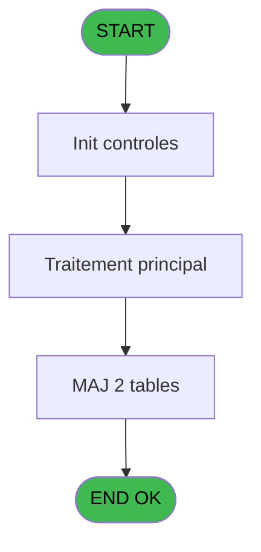

# PBG IDE 229 - Traitement Adherents Existant

> **Analyse**: Phases 1-4 2026-02-03 10:22 -> 10:22 (17s) | Assemblage 10:22
> **Pipeline**: V7.2 Enrichi
> **Structure**: 4 onglets (Resume | Ecrans | Donnees | Connexions)

<!-- TAB:Resume -->

## 1. FICHE D'IDENTITE

| Attribut | Valeur |
|----------|--------|
| Projet | PBG |
| IDE Position | 229 |
| Nom Programme | Traitement Adherents Existant |
| Fichier source | `Prg_229.xml` |
| Domaine metier | General |
| Taches | 4 (1 ecrans visibles) |
| Tables modifiees | 2 |
| Programmes appeles | 0 |

## 2. DESCRIPTION FONCTIONNELLE

**Traitement Adherents Existant** assure la gestion complete de ce processus, accessible depuis [Traitement des arrivants (IDE 206)](PBG-IDE-206.md).

Le flux de traitement s'organise en **2 blocs fonctionnels** :

- **Calcul** (3 taches) : calculs de montants, stocks ou compteurs
- **Traitement** (1 tache) : traitements metier divers

**Donnees modifiees** : 2 tables en ecriture (annulation_______anu, tempo_ecran_police).

**Logique metier** : 1 regles identifiees couvrant valeurs par defaut.

Detail : phases du traitement

#### Phase 1 : Traitement (1 tache)

- **229** - Veuillez patienter... **[[ECRAN]](#ecran-t1)**

#### Phase 2 : Calcul (3 taches)

- **229.1** - Creation Compte
- **229.2** - Creation Compte
- **229.3** - Creation Compte

#### Tables impactees

| Table | Operations | Role metier |
|-------|-----------|-------------|
| tempo_ecran_police | **W**/L (2 usages) | Table temporaire ecran |
| annulation_______anu | **W** (1 usages) |  |

## 3. BLOCS FONCTIONNELS

### 3.1 Traitement (1 tache)

Traitements internes.

---

#### 229 - Veuillez patienter... [[ECRAN]](#ecran-t1)

**Role** : Traitement : Veuillez patienter....
**Ecran** : 427 x 69 DLU (MDI) | [Voir mockup](#ecran-t1)

### 3.2 Calcul (3 taches)

Calculs metier : montants, stocks, compteurs.

---

#### 229.1 - Creation Compte

**Role** : Creation d'enregistrement : Creation Compte.
**Variables liees** : M (V.Compteur), N (V.Compteur annulation)

---

#### 229.2 - Creation Compte

**Role** : Creation d'enregistrement : Creation Compte.
**Variables liees** : M (V.Compteur), N (V.Compteur annulation)

---

#### 229.3 - Creation Compte

**Role** : Creation d'enregistrement : Creation Compte.
**Variables liees** : M (V.Compteur), N (V.Compteur annulation)

## 5. REGLES METIER

1 regles identifiees:

### Autres (1 regles)

#### [RM-001] Valeur par defaut si P0-Code Societe [A] est vide

| Element | Detail |
|---------|--------|
| **Condition** | `P0-Code Societe [A]=''` |
| **Si vrai** | 'C' |
| **Si faux** | P0-Code Societe [A]) |
| **Variables** | A (P0-Code Societe) |
| **Expression source** | Expression 18 : `IF (P0-Code Societe [A]='','C',P0-Code Societe [A])` |
| **Exemple** | Si P0-Code Societe [A]='' → 'C'. Sinon → P0-Code Societe [A]) |

## 6. CONTEXTE

- **Appele par**: [Traitement des arrivants (IDE 206)](PBG-IDE-206.md)
- **Appelle**: 0 programmes | **Tables**: 7 (W:2 R:2 L:4) | **Taches**: 4 | **Expressions**: 25

<!-- TAB:Ecrans -->

## 8. ECRANS

### 8.1 Forms visibles (1 / 4)

| # | Position | Tache | Nom | Type | Largeur | Hauteur | Bloc |
|---|----------|-------|-----|------|---------|---------|------|
| 1 | 229 | 229 | Veuillez patienter... | MDI | 427 | 69 | Traitement |

### 8.2 Mockups Ecrans

---

#### 229 - Veuillez patienter...
**Tache** : [229](#t1) | **Type** : MDI | **Dimensions** : 427 x 69 DLU
**Bloc** : Traitement | **Titre IDE** : Veuillez patienter...

<!-- FORM-DATA:
{
    "width":  427,
    "vFactor":  8,
    "type":  "MDI",
    "hFactor":  8,
    "controls":  [
                     {
                         "x":  1,
                         "type":  "label",
                         "var":  "",
                         "y":  0,
                         "w":  423,
                         "fmt":  "",
                         "name":  "",
                         "h":  29,
                         "color":  "",
                         "text":  "",
                         "parent":  null
                     },
                     {
                         "x":  83,
                         "type":  "label",
                         "var":  "",
                         "y":  10,
                         "w":  328,
                         "fmt":  "",
                         "name":  "",
                         "h":  8,
                         "color":  "7",
                         "text":  "Verification Presence Adherent",
                         "parent":  null
                     },
                     {
                         "x":  1,
                         "type":  "label",
                         "var":  "",
                         "y":  29,
                         "w":  423,
                         "fmt":  "",
                         "name":  "",
                         "h":  37,
                         "color":  "",
                         "text":  "",
                         "parent":  null
                     },
                     {
                         "x":  9,
                         "type":  "label",
                         "var":  "",
                         "y":  41,
                         "w":  405,
                         "fmt":  "",
                         "name":  "",
                         "h":  19,
                         "color":  "",
                         "text":  "",
                         "parent":  null
                     },
                     {
                         "x":  2,
                         "type":  "image",
                         "var":  "",
                         "y":  2,
                         "w":  72,
                         "fmt":  "",
                         "name":  "",
                         "h":  25,
                         "color":  "",
                         "text":  "",
                         "parent":  null
                     },
                     {
                         "x":  12,
                         "type":  "edit",
                         "var":  "",
                         "y":  42,
                         "w":  400,
                         "fmt":  "30",
                         "name":  "",
                         "h":  17,
                         "color":  "159",
                         "text":  "",
                         "parent":  4
                     },
                     {
                         "x":  177,
                         "type":  "edit",
                         "var":  "",
                         "y":  46,
                         "w":  64,
                         "fmt":  "3 %",
                         "name":  "",
                         "h":  8,
                         "color":  "143",
                         "text":  "",
                         "parent":  1
                     }
                 ],
    "taskId":  "229",
    "height":  69
}
-->

<strong>Champs : 2 champs</strong>

| Pos (x,y) | Nom | Variable | Type |
|-----------|-----|----------|------|
| 12,42 | 30 | - | edit |
| 177,46 | 3 % | - | edit |

## 9. NAVIGATION

Ecran unique: **Veuillez patienter...**

### 9.3 Structure hierarchique (4 taches)

| Position | Tache | Type | Dimensions | Bloc |
|----------|-------|------|------------|------|
| **229.1** | [**Veuillez patienter...** (229)](#t1) [mockup](#ecran-t1) | MDI | 427x69 | Traitement |
| **229.2** | [**Creation Compte** (229.1)](#t2) | MDI | - | Calcul |
| 229.2.1 | [Creation Compte (229.2)](#t3) | MDI | - | |
| 229.2.2 | [Creation Compte (229.3)](#t4) | MDI | - | |

### 9.4 Algorigramme

> **Legende**: Vert = START/END OK | Rouge = END KO | Bleu = Decisions
> *Algorigramme auto-genere. Utiliser `/algorigramme` pour une synthese metier detaillee.*

<!-- TAB:Donnees -->

## 10. TABLES

### Tables utilisees (7)

| ID | Nom | Description | Type | R | W | L | Usages |
|----|-----|-------------|------|---|---|---|--------|
| 35 | personnel_go______go |  | DB | R |   |   | 1 |
| 36 | client_gm |  | DB |   |   | L | 1 |
| 47 | compte_gm________cgm | Comptes GM (generaux) | DB | R |   |   | 1 |
| 170 | annulation_______anu |  | DB |   | **W** |   | 1 |
| 569 | pointage_articles_caution | Articles et stock | TMP |   |   | L | 1 |
| 571 | inter_prestation_inp | Prestations/services vendus | TMP |   |   | L | 1 |
| 645 | tempo_ecran_police | Table temporaire ecran | DB |   | **W** | L | 2 |

### Colonnes par table (4 / 4 tables avec colonnes identifiees)

Table 35 - personnel_go______go (R) - 1 usages

| Lettre | Variable | Acces | Type |
|--------|----------|-------|------|
| A | P0-Code Societe | R | Alpha |
| B | P0-Lieu de Sejour | R | Alpha |
| C | P0-Nb Arrivants | R | Numeric |
| D | P0-Numero Import | R | Numeric |
| E | W0-Operande | R | Numeric |
| F | W0-Operateur | R | Numeric |
| G | W0-Pourcentage | R | Numeric |
| H | W0-Calcul Pourcent | R | Numeric |
| I | W0-Code Famille | R | Alpha |
| J | W0-Ret Lien Client | R | Logical |
| K | W0-Suppression | R | Logical |
| L | W0-Ret Lien Personnel | R | Logical |
| M | V.Compteur | R | Numeric |
| N | V.Compteur annulation | R | Numeric |

Table 47 - compte_gm________cgm (R) - 1 usages

| Lettre | Variable | Acces | Type |
|--------|----------|-------|------|
| A | P.Compte | R | Numeric |
| M | V.Compteur | R | Numeric |
| N | V.Compteur annulation | R | Numeric |

Table 170 - annulation_______anu (**W**) - 1 usages

| Lettre | Variable | Acces | Type |
|--------|----------|-------|------|
| N | V.Compteur annulation | W | Numeric |

Table 645 - tempo_ecran_police (**W**/L) - 2 usages

*Table utilisee uniquement en Link ou aucune colonne Real identifiee dans le DataView.*

## 11. VARIABLES

### 11.1 Variables de session (2)

Variables persistantes pendant toute la session.

| Lettre | Nom | Type | Usage dans |
|--------|-----|------|-----------|
| M | V.Compteur | Numeric | 2x session |
| N | V.Compteur annulation | Numeric | 1x session |

### 11.2 Autres (12)

Variables diverses.

| Lettre | Nom | Type | Usage dans |
|--------|-----|------|-----------|
| A | P0-Code Societe | Alpha | 2x refs |
| B | P0-Lieu de Sejour | Alpha | - |
| C | P0-Nb Arrivants | Numeric | - |
| D | P0-Numero Import | Numeric | - |
| E | W0-Operande | Numeric | - |
| F | W0-Operateur | Numeric | - |
| G | W0-Pourcentage | Numeric | - |
| H | W0-Calcul Pourcent | Numeric | - |
| I | W0-Code Famille | Alpha | - |
| J | W0-Ret Lien Client | Logical | 1x refs |
| K | W0-Suppression | Logical | 4x refs |
| L | W0-Ret Lien Personnel | Logical | 1x refs |

## 12. EXPRESSIONS

**25 / 25 expressions decodees (100%)**

### 12.1 Repartition par type

| Type | Expressions | Regles |
|------|-------------|--------|
| CALCULATION | 3 | 0 |
| CONDITION | 3 | 5 |
| CONSTANTE | 2 | 0 |
| NEGATION | 2 | 0 |
| REFERENCE_VG | 2 | 0 |
| OTHER | 11 | 0 |
| CAST_LOGIQUE | 2 | 0 |

### 12.2 Expressions cles par type

#### CALCULATION (3 expressions)

| Type | IDE | Expression | Regle |
|------|-----|------------|-------|
| CALCULATION | 22 | `[BM]+1` | - |
| CALCULATION | 3 | `([BM]/VG1)*50` | - |
| CALCULATION | 2 | `([BM]/VG1)*100` | - |

#### CONDITION (3 expressions)

| Type | IDE | Expression | Regle |
|------|-----|------------|-------|
| CONDITION | 18 | `IF (P0-Code Societe [A]='','C',P0-Code Societe [A])` | [RM-001](#rm-RM-001) |
| CONDITION | 14 | `[BX]>Date () OR [X]<=[BW]` | - |
| CONDITION | 13 | `[AF]>Date () OR [X]<=[AE]` | - |

#### CONSTANTE (2 expressions)

| Type | IDE | Expression | Regle |
|------|-----|------------|-------|
| CONSTANTE | 24 | `'C'` | - |
| CONSTANTE | 1 | `''` | - |

#### NEGATION (2 expressions)

| Type | IDE | Expression | Regle |
|------|-----|------------|-------|
| NEGATION | 16 | `NOT ([BX]>Date () OR [X]<=[BW]) AND NOT (W0-Suppression [K])` | - |
| NEGATION | 15 | `NOT ([AF]>Date () OR [X]<=[AE]) AND NOT (W0-Suppression [K])` | - |

#### REFERENCE_VG (2 expressions)

| Type | IDE | Expression | Regle |
|------|-----|------------|-------|
| REFERENCE_VG | 25 | `VG31` | - |
| REFERENCE_VG | 4 | `VG20` | - |

#### OTHER (11 expressions)

| Type | IDE | Expression | Regle |
|------|-----|------------|-------|
| OTHER | 19 | `W0-Ret Lien Personnel [L]` | - |
| OTHER | 17 | `W0-Suppression [K]` | - |
| OTHER | 20 | `V.Compteur [M]` | - |
| OTHER | 23 | `[BN]` | - |
| OTHER | 21 | `W0-Suppression [K]` | - |
| ... | | *+6 autres* | |

#### CAST_LOGIQUE (2 expressions)

| Type | IDE | Expression | Regle |
|------|-----|------------|-------|
| CAST_LOGIQUE | 12 | `'FALSE'LOG` | - |
| CAST_LOGIQUE | 11 | `'TRUE'LOG` | - |

### 12.3 Toutes les expressions (25)

Voir les 25 expressions

#### CALCULATION (3)

| IDE | Expression Decodee |
|-----|-------------------|
| 2 | `([BM]/VG1)*100` |
| 3 | `([BM]/VG1)*50` |
| 22 | `[BM]+1` |

#### CONDITION (3)

| IDE | Expression Decodee |
|-----|-------------------|
| 18 | `IF (P0-Code Societe [A]='','C',P0-Code Societe [A])` |
| 13 | `[AF]>Date () OR [X]<=[AE]` |
| 14 | `[BX]>Date () OR [X]<=[BW]` |

#### CONSTANTE (2)

| IDE | Expression Decodee |
|-----|-------------------|
| 1 | `''` |
| 24 | `'C'` |

#### NEGATION (2)

| IDE | Expression Decodee |
|-----|-------------------|
| 15 | `NOT ([AF]>Date () OR [X]<=[AE]) AND NOT (W0-Suppression [K])` |
| 16 | `NOT ([BX]>Date () OR [X]<=[BW]) AND NOT (W0-Suppression [K])` |

#### REFERENCE_VG (2)

| IDE | Expression Decodee |
|-----|-------------------|
| 4 | `VG20` |
| 25 | `VG31` |

#### OTHER (11)

| IDE | Expression Decodee |
|-----|-------------------|
| 5 | `P0-Code Societe [A]` |
| 6 | `V.Compteur annulation [N]` |
| 7 | `[O]` |
| 8 | `[P]` |
| 9 | `W0-Ret Lien Client [J]` |
| 10 | `[BT]` |
| 17 | `W0-Suppression [K]` |
| 19 | `W0-Ret Lien Personnel [L]` |
| 20 | `V.Compteur [M]` |
| 21 | `W0-Suppression [K]` |
| 23 | `[BN]` |

#### CAST_LOGIQUE (2)

| IDE | Expression Decodee |
|-----|-------------------|
| 11 | `'TRUE'LOG` |
| 12 | `'FALSE'LOG` |

<!-- TAB:Connexions -->

## 13. GRAPHE D'APPELS

### 13.1 Chaine depuis Main (Callers)

Main -> ... -> [Traitement des arrivants (IDE 206)](PBG-IDE-206.md) -> **Traitement Adherents Existant (IDE 229)**

### 13.2 Callers

| IDE | Nom Programme | Nb Appels |
|-----|---------------|-----------|
| [206](PBG-IDE-206.md) | Traitement des arrivants | 1 |

### 13.3 Callees (programmes appeles)

### 13.4 Detail Callees avec contexte

| IDE | Nom Programme | Appels | Contexte |
|-----|---------------|--------|----------|
| - | (aucun) | - | - |

## 14. RECOMMANDATIONS MIGRATION

### 14.1 Profil du programme

| Metrique | Valeur | Impact migration |
|----------|--------|-----------------|
| Lignes de logique | 140 | Programme compact |
| Expressions | 25 | Peu de logique |
| Tables WRITE | 2 | Impact faible |
| Sous-programmes | 0 | Peu de dependances |
| Ecrans visibles | 1 | Ecran unique ou traitement batch |
| Code desactive | 0% (0 / 140) | Code sain |
| Regles metier | 1 | Quelques regles a preserver |

### 14.2 Plan de migration par bloc

#### Traitement (1 tache: 1 ecran, 0 traitement)

- **Strategie** : 1 composant(s) UI (Razor/React) avec formulaires et validation.
- Decomposer les taches en services unitaires testables.

#### Calcul (3 taches: 0 ecran, 3 traitements)

- **Strategie** : Services de calcul purs (Domain Services).
- Migrer la logique de calcul (stock, compteurs, montants)

### 14.3 Dependances critiques

| Dependance | Type | Appels | Impact |
|------------|------|--------|--------|
| annulation_______anu | Table WRITE (Database) | 1x | Schema + repository |
| tempo_ecran_police | Table WRITE (Database) | 1x | Schema + repository |

---
*Spec DETAILED generee par Pipeline V7.2 - 2026-02-03 10:22*
