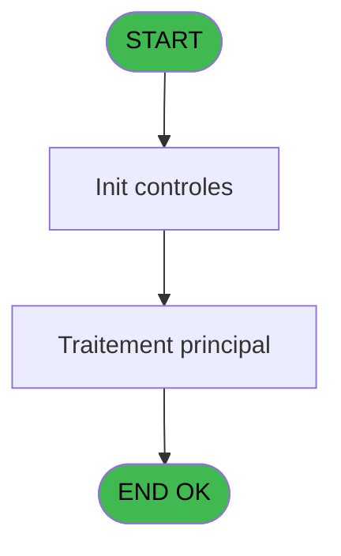

# PBG IDE 23 - Appel Curl Aff Auto

> **Analyse**: Phases 1-4 2026-02-03 01:10 -> 01:11 (38s) | Assemblage 01:11
> **Pipeline**: V7.2 Enrichi
> **Structure**: 4 onglets (Resume | Ecrans | Donnees | Connexions)

<!-- TAB:Resume -->

## 1. FICHE D'IDENTITE

| Attribut | Valeur |
|----------|--------|
| Projet | PBG |
| IDE Position | 23 |
| Nom Programme | Appel Curl Aff Auto |
| Fichier source | `Prg_23.xml` |
| Domaine metier | General |
| Taches | 4 (0 ecrans visibles) |
| Tables modifiees | 0 |
| Programmes appeles | 0 |

## 2. DESCRIPTION FONCTIONNELLE

**Appel Curl Aff Auto** assure la gestion complete de ce processus, accessible depuis [Affectation auto chambres v2 (IDE 7)](PBG-IDE-7.md).

Le flux de traitement s'organise en **1 blocs fonctionnels** :

- **Traitement** (4 taches) : traitements metier divers

Detail : phases du traitement

#### Phase 1 : Traitement (4 taches)

- **23** - ClubMedAPICall
- **23.1** - Lecture paramètres API
- **23.2** - Write curl
- **23.3** - XML refresh/access token

## 3. BLOCS FONCTIONNELS

### 3.1 Traitement (4 taches)

Traitements internes.

---

#### 23 - ClubMedAPICall

**Role** : Traitement : ClubMedAPICall.

3 sous-taches directes

| Tache | Nom | Bloc |
|-------|-----|------|
| [23.1](#t2) | Lecture paramètres API | Traitement |
| [23.2](#t3) | Write curl | Traitement |
| [23.3](#t4) | XML refresh/access token | Traitement |

---

#### 23.1 - Lecture paramètres API

**Role** : Traitement : Lecture paramètres API.

---

#### 23.2 - Write curl

**Role** : Traitement : Write curl.
**Variables liees** : D (v.répertoire fichiers curl), L (v.commande CURL), M (v.nom fichier curl bat), N (v.nom fichier curl reponse)

---

#### 23.3 - XML refresh/access token

**Role** : Traitement : XML refresh/access token.

## 5. REGLES METIER

*(Aucune regle metier identifiee)*

## 6. CONTEXTE

- **Appele par**: [Affectation auto chambres v2 (IDE 7)](PBG-IDE-7.md)
- **Appelle**: 0 programmes | **Tables**: 1 (W:0 R:1 L:0) | **Taches**: 4 | **Expressions**: 23

<!-- TAB:Ecrans -->

## 8. ECRANS

*(Programme sans ecran visible)*

## 9. NAVIGATION

### 9.3 Structure hierarchique (4 taches)

| Position | Tache | Type | Dimensions | Bloc |
|----------|-------|------|------------|------|
| **23.1** | [**ClubMedAPICall** (23)](#t1) | - | - | Traitement |
| 23.1.1 | [Lecture paramètres API (23.1)](#t2) | - | - | |
| 23.1.2 | [Write curl (23.2)](#t3) | - | - | |
| 23.1.3 | [XML refresh/access token (23.3)](#t4) | - | - | |

### 9.4 Algorigramme

> **Legende**: Vert = START/END OK | Rouge = END KO | Bleu = Decisions
> *Algorigramme auto-genere. Utiliser `/algorigramme` pour une synthese metier detaillee.*

<!-- TAB:Donnees -->

## 10. TABLES

### Tables utilisees (1)

| ID | Nom | Description | Type | R | W | L | Usages |
|----|-----|-------------|------|---|---|---|--------|
| 1065 | Table_1065 |  | MEM | R |   |   | 1 |

### Colonnes par table (0 / 1 tables avec colonnes identifiees)

Table 1065 - Table_1065 (R) - 1 usages

*Table utilisee uniquement en Link ou aucune colonne Real identifiee dans le DataView.*

## 11. VARIABLES

### 11.1 Parametres entrants (3)

Variables recues du programme appelant ([Affectation auto chambres v2 (IDE 7)](PBG-IDE-7.md)).

| Lettre | Nom | Type | Usage dans |
|--------|-----|------|-----------|
| A | P.i.JsonIN | Unicode | - |
| B | P.o.IsSuccess | Logical | 2x parametre entrant |
| C | P.o.Header Id | Numeric | - |

### 11.2 Variables de session (17)

Variables persistantes pendant toute la session.

| Lettre | Nom | Type | Usage dans |
|--------|-----|------|-----------|
| D | v.répertoire fichiers curl | Unicode | - |
| E | v.répertoire fichiers réponse | Unicode | - |
| F | v.méthode | Unicode | 1x session |
| G | v.ErrorMessage | Alpha | 1x session |
| H | v.JsonResponse | Blob | 1x session |
| I | v.Api Key | Unicode | - |
| J | v.Authentification | Unicode | - |
| K | v.Url complétée | Unicode | 1x session |
| L | v.commande CURL | Alpha | [23.2](#t3) |
| M | v.nom fichier curl bat | Alpha | [23.2](#t3) |
| N | v.nom fichier curl reponse | Alpha | - |
| O | v.XMLResponse | Blob | 2x session |
| P | v.status | Alpha | - |
| Q | v.error code | Alpha | 1x session |
| R | v.date | Date | 2x session |
| S | v.time | Time | - |
| T | v.timestamp alpha | Unicode | - |

Toutes les 20 variables (liste complete)

| Cat | Lettre | Nom Variable | Type |
|-----|--------|--------------|------|
| P0 | **A** | P.i.JsonIN | Unicode |
| P0 | **B** | P.o.IsSuccess | Logical |
| P0 | **C** | P.o.Header Id | Numeric |
| V. | **D** | v.répertoire fichiers curl | Unicode |
| V. | **E** | v.répertoire fichiers réponse | Unicode |
| V. | **F** | v.méthode | Unicode |
| V. | **G** | v.ErrorMessage | Alpha |
| V. | **H** | v.JsonResponse | Blob |
| V. | **I** | v.Api Key | Unicode |
| V. | **J** | v.Authentification | Unicode |
| V. | **K** | v.Url complétée | Unicode |
| V. | **L** | v.commande CURL | Alpha |
| V. | **M** | v.nom fichier curl bat | Alpha |
| V. | **N** | v.nom fichier curl reponse | Alpha |
| V. | **O** | v.XMLResponse | Blob |
| V. | **P** | v.status | Alpha |
| V. | **Q** | v.error code | Alpha |
| V. | **R** | v.date | Date |
| V. | **S** | v.time | Time |
| V. | **T** | v.timestamp alpha | Unicode |

## 12. EXPRESSIONS

**23 / 23 expressions decodees (100%)**

### 12.1 Repartition par type

| Type | Expressions | Regles |
|------|-------------|--------|
| CONCATENATION | 3 | 0 |
| FORMAT | 6 | 0 |
| CONSTANTE | 2 | 0 |
| DATE | 1 | 0 |
| OTHER | 5 | 0 |
| CAST_LOGIQUE | 1 | 0 |
| CONDITION | 1 | 0 |
| STRING | 4 | 0 |

### 12.2 Expressions cles par type

#### CONCATENATION (3 expressions)

| Type | IDE | Expression | Regle |
|------|-----|------------|-------|
| CONCATENATION | 21 | `Trim(v.méthode [F])&'testcurl.bat'` | - |
| CONCATENATION | 19 | `'<?xml version="1.0" encoding="UTF-8"?>' &ASCIIChr(13)& ASCIIChr(10)&DotNet.System.Xml.Linq.XElement.Load(  DotNet.System.Runtime.Serialization.Json.JsonReaderWriterFactory.CreateJsonReader(      v.commande CURL [L],     DotNet.System.Xml.XmlDictionaryReaderQuotas()   )).ToString()` | - |
| CONCATENATION | 6 | `Translate('%club_exe%')&'curl\bin\curl -X '&Trim(v.JsonResponse [H])&' "'&Trim(v.XMLResponse [O])&'"'&' -H "accept: application/json"'&' -H  "X_API_KEY: '&Trim(v.nom fichier curl bat [M])&'"'&' -H "Content-Type: application/json"'&IF(ISNULL(P.o.IsSuccess [B]) OR Trim(P.o.IsSuccess [B])='','',' -d "'&Trim(P.o.IsSuccess [B])&'"')& ' >'&Trim(v.date [R])` | - |

#### FORMAT (6 expressions)

| Type | IDE | Expression | Regle |
|------|-----|------------|-------|
| FORMAT | 16 | `Trim(RepStr(Trim(Left(v.Url complétée [K],InStr(v.Url complétée [K],',')-1)),'"',' '))&' ('&[U]&')'` | - |
| FORMAT | 5 | `Trim(v.ErrorMessage [G])&DStr([V],'YYYYMMDD')&'_'&TStr([W],'HHMMSS')&'.txt'` | - |
| FORMAT | 13 | `InStr(v.commande CURL [L],'"message"')=0` | - |
| FORMAT | 7 | `'c:\temp\log_ApiCall-'&Trim(Str(Counter(1),'3'))&'.pdf'` | - |
| FORMAT | 14 | `Del(v.commande CURL [L],1,InStr(v.commande CURL [L],'"status_code":')+13)` | - |
| ... | | *+1 autres* | |

#### CONSTANTE (2 expressions)

| Type | IDE | Expression | Regle |
|------|-----|------------|-------|
| CONSTANTE | 18 | `''` | - |
| CONSTANTE | 9 | `'Content-Type: application/json; charset=utf-8'` | - |

#### DATE (1 expressions)

| Type | IDE | Expression | Regle |
|------|-----|------------|-------|
| DATE | 1 | `Date()` | - |

#### OTHER (5 expressions)

| Type | IDE | Expression | Regle |
|------|-----|------------|-------|
| OTHER | 10 | `Left(v.commande CURL [L],2000)` | - |
| OTHER | 12 | `File2Blb(v.date [R])` | - |
| OTHER | 8 | `Left(P.o.IsSuccess [B],2000)` | - |
| OTHER | 2 | `Time()` | - |
| OTHER | 3 | `Counter(1)` | - |

#### CAST_LOGIQUE (1 expressions)

| Type | IDE | Expression | Regle |
|------|-----|------------|-------|
| CAST_LOGIQUE | 17 | `'FALSE'LOG` | - |

#### CONDITION (1 expressions)

| Type | IDE | Expression | Regle |
|------|-----|------------|-------|
| CONDITION | 20 | `Translate('%club_test%')='T'` | - |

#### STRING (4 expressions)

| Type | IDE | Expression | Regle |
|------|-----|------------|-------|
| STRING | 22 | `Val(v.commande CURL [L],'18')` | - |
| STRING | 23 | `Trim(v.commande CURL [L])` | - |
| STRING | 4 | `RTrim(StrBuild(v.XMLResponse [O],Translate(StrToken(StrToken(INIGet('[MAGIC_DATABASES]Pms'),5,','),1,'\'))))` | - |
| STRING | 11 | `Trim(v.error code [Q])` | - |

### 12.3 Toutes les expressions (23)

Voir les 23 expressions

#### CONCATENATION (3)

| IDE | Expression Decodee |
|-----|-------------------|
| 6 | `Translate('%club_exe%')&'curl\bin\curl -X '&Trim(v.JsonResponse [H])&' "'&Trim(v.XMLResponse [O])&'"'&' -H "accept: application/json"'&' -H  "X_API_KEY: '&Trim(v.nom fichier curl bat [M])&'"'&' -H "Content-Type: application/json"'&IF(ISNULL(P.o.IsSuccess [B]) OR Trim(P.o.IsSuccess [B])='','',' -d "'&Trim(P.o.IsSuccess [B])&'"')& ' >'&Trim(v.date [R])` |
| 19 | `'<?xml version="1.0" encoding="UTF-8"?>' &ASCIIChr(13)& ASCIIChr(10)&DotNet.System.Xml.Linq.XElement.Load(  DotNet.System.Runtime.Serialization.Json.JsonReaderWriterFactory.CreateJsonReader(      v.commande CURL [L],     DotNet.System.Xml.XmlDictionaryReaderQuotas()   )).ToString()` |
| 21 | `Trim(v.méthode [F])&'testcurl.bat'` |

#### FORMAT (6)

| IDE | Expression Decodee |
|-----|-------------------|
| 7 | `'c:\temp\log_ApiCall-'&Trim(Str(Counter(1),'3'))&'.pdf'` |
| 14 | `Del(v.commande CURL [L],1,InStr(v.commande CURL [L],'"status_code":')+13)` |
| 15 | `RepStr(Del(v.commande CURL [L],1,InStr(v.commande CURL [L],'"error"')+7),'_',' ')` |
| 16 | `Trim(RepStr(Trim(Left(v.Url complétée [K],InStr(v.Url complétée [K],',')-1)),'"',' '))&' ('&[U]&')'` |
| 5 | `Trim(v.ErrorMessage [G])&DStr([V],'YYYYMMDD')&'_'&TStr([W],'HHMMSS')&'.txt'` |
| 13 | `InStr(v.commande CURL [L],'"message"')=0` |

#### CONSTANTE (2)

| IDE | Expression Decodee |
|-----|-------------------|
| 9 | `'Content-Type: application/json; charset=utf-8'` |
| 18 | `''` |

#### DATE (1)

| IDE | Expression Decodee |
|-----|-------------------|
| 1 | `Date()` |

#### OTHER (5)

| IDE | Expression Decodee |
|-----|-------------------|
| 2 | `Time()` |
| 3 | `Counter(1)` |
| 8 | `Left(P.o.IsSuccess [B],2000)` |
| 10 | `Left(v.commande CURL [L],2000)` |
| 12 | `File2Blb(v.date [R])` |

#### CAST_LOGIQUE (1)

| IDE | Expression Decodee |
|-----|-------------------|
| 17 | `'FALSE'LOG` |

#### CONDITION (1)

| IDE | Expression Decodee |
|-----|-------------------|
| 20 | `Translate('%club_test%')='T'` |

#### STRING (4)

| IDE | Expression Decodee |
|-----|-------------------|
| 4 | `RTrim(StrBuild(v.XMLResponse [O],Translate(StrToken(StrToken(INIGet('[MAGIC_DATABASES]Pms'),5,','),1,'\'))))` |
| 11 | `Trim(v.error code [Q])` |
| 22 | `Val(v.commande CURL [L],'18')` |
| 23 | `Trim(v.commande CURL [L])` |

<!-- TAB:Connexions -->

## 13. GRAPHE D'APPELS

### 13.1 Chaine depuis Main (Callers)

Main -> ... -> [Affectation auto chambres v2 (IDE 7)](PBG-IDE-7.md) -> **Appel Curl Aff Auto (IDE 23)**

### 13.2 Callers

| IDE | Nom Programme | Nb Appels |
|-----|---------------|-----------|
| [7](PBG-IDE-7.md) | Affectation auto chambres v2 | 1 |

### 13.3 Callees (programmes appeles)

### 13.4 Detail Callees avec contexte

| IDE | Nom Programme | Appels | Contexte |
|-----|---------------|--------|----------|
| - | (aucun) | - | - |

## 14. RECOMMANDATIONS MIGRATION

### 14.1 Profil du programme

| Metrique | Valeur | Impact migration |
|----------|--------|-----------------|
| Lignes de logique | 100 | Programme compact |
| Expressions | 23 | Peu de logique |
| Tables WRITE | 0 | Impact faible |
| Sous-programmes | 0 | Peu de dependances |
| Ecrans visibles | 0 | Ecran unique ou traitement batch |
| Code desactive | 2% (2 / 100) | Code sain |
| Regles metier | 0 | Pas de regle identifiee |

### 14.2 Plan de migration par bloc

#### Traitement (4 taches: 0 ecran, 4 traitements)

- **Strategie** : 4 service(s) backend injectable(s) (Domain Services).
- Decomposer les taches en services unitaires testables.

### 14.3 Dependances critiques

| Dependance | Type | Appels | Impact |
|------------|------|--------|--------|

---
*Spec DETAILED generee par Pipeline V7.2 - 2026-02-03 01:11*
