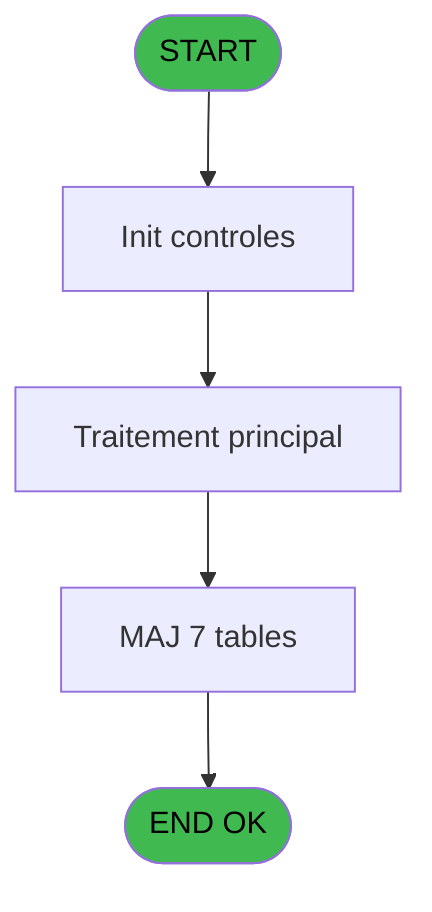
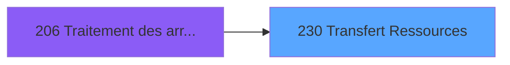

# PBG IDE 230 - Transfert Ressources

> **Analyse**: Phases 1-4 2026-02-03 10:23 -> 10:23 (17s) | Assemblage 10:23
> **Pipeline**: V7.2 Enrichi
> **Structure**: 4 onglets (Resume | Ecrans | Donnees | Connexions)

<!-- TAB:Resume -->

## 1. FICHE D'IDENTITE

| Attribut | Valeur |
|----------|--------|
| Projet | PBG |
| IDE Position | 230 |
| Nom Programme | Transfert Ressources |
| Fichier source | `Prg_230.xml` |
| Domaine metier | General |
| Taches | 11 (1 ecrans visibles) |
| Tables modifiees | 7 |
| Programmes appeles | 1 |

## 2. DESCRIPTION FONCTIONNELLE

**Transfert Ressources** assure la gestion complete de ce processus, accessible depuis [Traitement des arrivants (IDE 206)](PBG-IDE-206.md).

Le flux de traitement s'organise en **3 blocs fonctionnels** :

- **Creation** (6 taches) : insertion d'enregistrements en base (mouvements, prestations)
- **Traitement** (4 taches) : traitements metier divers
- **Validation** (1 tache) : controles et verifications de coherence

**Donnees modifiees** : 7 tables en ecriture (inter_prestation_inp, nouvelles_prestations, tempo_ecran_mecano, temp_recap_sessions, temp_recap_telecollecte, moyen_de_paiement_reference, Table_991).

Detail : phases du traitement

#### Phase 1 : Traitement (4 taches)

- **230** - Veuillez patienter... **[[ECRAN]](#ecran-t1)**
- **230.1** - Chemin FRA.DAT
- **230.2** - Traitement FRA.DAT
- **230.2.6** - Historisation chaine

Delegue a : [Création Import Réponses (IDE 264)](PBG-IDE-264.md)

#### Phase 2 : Validation (1 tache)

- **230.2.1** - Verification Logement

#### Phase 3 : Creation (6 taches)

- **230.2.1.1** - Creation Logement
- **230.2.2** - Creation Circuit
- **230.2.3** - Creation Circuit
- **230.2.4** - Creation Voyage
- **230.2.5** - Creation Circuit
- **230.2.7** - Creation Resort Credit

#### Tables impactees

| Table | Operations | Role metier |
|-------|-----------|-------------|
| inter_prestation_inp | **W** (2 usages) | Prestations/services vendus |
| temp_recap_telecollecte | **W** (1 usages) |  |
| temp_recap_sessions | **W** (1 usages) | Sessions de caisse |
| moyen_de_paiement_reference | **W** (1 usages) |  |
| Table_991 | **W** (1 usages) |  |
| tempo_ecran_mecano | **W** (1 usages) | Table temporaire ecran |
| nouvelles_prestations | **W** (1 usages) | Prestations/services vendus |

## 3. BLOCS FONCTIONNELS

### 3.1 Traitement (4 taches)

Traitements internes.

---

#### 230 - Veuillez patienter... [[ECRAN]](#ecran-t1)

**Role** : Traitement : Veuillez patienter....
**Ecran** : 429 x 69 DLU (MDI) | [Voir mockup](#ecran-t1)

3 sous-taches directes

| Tache | Nom | Bloc |
|-------|-----|------|
| [230.1](#t2) | Chemin FRA.DAT | Traitement |
| [230.2](#t3) | Traitement FRA.DAT | Traitement |
| [230.2.6](#t10) | Historisation chaine | Traitement |

**Delegue a** : [Création Import Réponses (IDE 264)](PBG-IDE-264.md)

---

#### 230.1 - Chemin FRA.DAT

**Role** : Traitement : Chemin FRA.DAT.
**Delegue a** : [Création Import Réponses (IDE 264)](PBG-IDE-264.md)

---

#### 230.2 - Traitement FRA.DAT

**Role** : Traitement : Traitement FRA.DAT.
**Delegue a** : [Création Import Réponses (IDE 264)](PBG-IDE-264.md)

---

#### 230.2.6 - Historisation chaine

**Role** : Traitement : Historisation chaine.
**Delegue a** : [Création Import Réponses (IDE 264)](PBG-IDE-264.md)

### 3.2 Validation (1 tache)

Controles de coherence : 1 tache verifie les donnees et conditions.

---

#### 230.2.1 - Verification Logement

**Role** : Verification : Verification Logement.

### 3.3 Creation (6 taches)

Insertion de nouveaux enregistrements en base.

---

#### 230.2.1.1 - Creation Logement

**Role** : Creation d'enregistrement : Creation Logement.

---

#### 230.2.2 - Creation Circuit

**Role** : Creation d'enregistrement : Creation Circuit.
**Variables liees** : G (P0-Nb Circuits)

---

#### 230.2.3 - Creation Circuit

**Role** : Creation d'enregistrement : Creation Circuit.
**Variables liees** : G (P0-Nb Circuits)

---

#### 230.2.4 - Creation Voyage

**Role** : Creation d'enregistrement : Creation Voyage.
**Variables liees** : E (P0-Nb Voyages)

---

#### 230.2.5 - Creation Circuit

**Role** : Creation d'enregistrement : Creation Circuit.
**Variables liees** : G (P0-Nb Circuits)

---

#### 230.2.7 - Creation Resort Credit

**Role** : Creation d'enregistrement : Creation Resort Credit.

## 5. REGLES METIER

*(Aucune regle metier identifiee)*

## 6. CONTEXTE

- **Appele par**: [Traitement des arrivants (IDE 206)](PBG-IDE-206.md)
- **Appelle**: 1 programmes | **Tables**: 9 (W:7 R:1 L:1) | **Taches**: 11 | **Expressions**: 4

<!-- TAB:Ecrans -->

## 8. ECRANS

### 8.1 Forms visibles (1 / 11)

| # | Position | Tache | Nom | Type | Largeur | Hauteur | Bloc |
|---|----------|-------|-----|------|---------|---------|------|
| 1 | 230 | 230 | Veuillez patienter... | MDI | 429 | 69 | Traitement |

### 8.2 Mockups Ecrans

---

#### 230 - Veuillez patienter...
**Tache** : [230](#t1) | **Type** : MDI | **Dimensions** : 429 x 69 DLU
**Bloc** : Traitement | **Titre IDE** : Veuillez patienter...

<!-- FORM-DATA:
{
    "width":  429,
    "vFactor":  8,
    "type":  "MDI",
    "hFactor":  8,
    "controls":  [
                     {
                         "x":  1,
                         "type":  "label",
                         "var":  "",
                         "y":  0,
                         "w":  423,
                         "fmt":  "",
                         "name":  "",
                         "h":  29,
                         "color":  "",
                         "text":  "",
                         "parent":  null
                     },
                     {
                         "x":  99,
                         "type":  "label",
                         "var":  "",
                         "y":  10,
                         "w":  275,
                         "fmt":  "",
                         "name":  "",
                         "h":  8,
                         "color":  "7",
                         "text":  "Transfert Ressources",
                         "parent":  null
                     },
                     {
                         "x":  1,
                         "type":  "label",
                         "var":  "",
                         "y":  29,
                         "w":  423,
                         "fmt":  "",
                         "name":  "",
                         "h":  37,
                         "color":  "",
                         "text":  "",
                         "parent":  null
                     },
                     {
                         "x":  9,
                         "type":  "label",
                         "var":  "",
                         "y":  41,
                         "w":  405,
                         "fmt":  "",
                         "name":  "",
                         "h":  19,
                         "color":  "",
                         "text":  "",
                         "parent":  null
                     },
                     {
                         "x":  2,
                         "type":  "image",
                         "var":  "",
                         "y":  2,
                         "w":  72,
                         "fmt":  "",
                         "name":  "",
                         "h":  25,
                         "color":  "",
                         "text":  "",
                         "parent":  null
                     },
                     {
                         "x":  12,
                         "type":  "edit",
                         "var":  "",
                         "y":  42,
                         "w":  400,
                         "fmt":  "30",
                         "name":  "",
                         "h":  17,
                         "color":  "159",
                         "text":  "",
                         "parent":  4
                     },
                     {
                         "x":  177,
                         "type":  "edit",
                         "var":  "",
                         "y":  46,
                         "w":  64,
                         "fmt":  "3 %",
                         "name":  "",
                         "h":  8,
                         "color":  "143",
                         "text":  "",
                         "parent":  1
                     }
                 ],
    "taskId":  "230",
    "height":  69
}
-->

<strong>Champs : 2 champs</strong>

| Pos (x,y) | Nom | Variable | Type |
|-----------|-----|----------|------|
| 12,42 | 30 | - | edit |
| 177,46 | 3 % | - | edit |

## 9. NAVIGATION

Ecran unique: **Veuillez patienter...**

### 9.3 Structure hierarchique (11 taches)

| Position | Tache | Type | Dimensions | Bloc |
|----------|-------|------|------------|------|
| **230.1** | [**Veuillez patienter...** (230)](#t1) [mockup](#ecran-t1) | MDI | 429x69 | Traitement |
| 230.1.1 | [Chemin FRA.DAT (230.1)](#t2) | MDI | - | |
| 230.1.2 | [Traitement FRA.DAT (230.2)](#t3) | MDI | - | |
| 230.1.3 | [Historisation chaine (230.2.6)](#t10) | MDI | - | |
| **230.2** | [**Verification Logement** (230.2.1)](#t4) | MDI | - | Validation |
| **230.3** | [**Creation Logement** (230.2.1.1)](#t5) | MDI | - | Creation |
| 230.3.1 | [Creation Circuit (230.2.2)](#t6) | MDI | - | |
| 230.3.2 | [Creation Circuit (230.2.3)](#t7) | MDI | - | |
| 230.3.3 | [Creation Voyage (230.2.4)](#t8) | MDI | - | |
| 230.3.4 | [Creation Circuit (230.2.5)](#t9) | MDI | - | |
| 230.3.5 | [Creation Resort Credit (230.2.7)](#t11) | - | - | |

### 9.4 Algorigramme

> **Legende**: Vert = START/END OK | Rouge = END KO | Bleu = Decisions
> *Algorigramme auto-genere. Utiliser `/algorigramme` pour une synthese metier detaillee.*

<!-- TAB:Donnees -->

## 10. TABLES

### Tables utilisees (9)

| ID | Nom | Description | Type | R | W | L | Usages |
|----|-----|-------------|------|---|---|---|--------|
| 118 | tables_imports |  | DB | R |   |   | 1 |
| 125 | correspondance_occupation |  | DB |   |   | L | 1 |
| 571 | inter_prestation_inp | Prestations/services vendus | TMP |   | **W** |   | 2 |
| 572 | nouvelles_prestations | Prestations/services vendus | DB |   | **W** |   | 1 |
| 573 | tempo_ecran_mecano | Table temporaire ecran | TMP |   | **W** |   | 1 |
| 576 | temp_recap_sessions | Sessions de caisse | TMP |   | **W** |   | 1 |
| 577 | temp_recap_telecollecte |  | TMP |   | **W** |   | 1 |
| 687 | moyen_de_paiement_reference |  | DB |   | **W** |   | 1 |
| 991 | Table_991 |  | MEM |   | **W** |   | 1 |

### Colonnes par table (3 / 8 tables avec colonnes identifiees)

Table 118 - tables_imports (R) - 1 usages

*Table utilisee uniquement en Link ou aucune colonne Real identifiee dans le DataView.*

Table 571 - inter_prestation_inp (**W**) - 2 usages

| Lettre | Variable | Acces | Type |
|--------|----------|-------|------|
| A | W2-U/P | W | Alpha |
| B | W2-Base Occupation | W | Alpha |
| C | W2-Code Retour | W | Numeric |

Table 572 - nouvelles_prestations (**W**) - 1 usages

| Lettre | Variable | Acces | Type |
|--------|----------|-------|------|
| F | P0-Nb Prestations | W | Numeric |

Table 573 - tempo_ecran_mecano (**W**) - 1 usages

*Table utilisee uniquement en Link ou aucune colonne Real identifiee dans le DataView.*

Table 576 - temp_recap_sessions (**W**) - 1 usages

*Table utilisee uniquement en Link ou aucune colonne Real identifiee dans le DataView.*

Table 577 - temp_recap_telecollecte (**W**) - 1 usages

*Table utilisee uniquement en Link ou aucune colonne Real identifiee dans le DataView.*

Table 687 - moyen_de_paiement_reference (**W**) - 1 usages

*Table utilisee uniquement en Link ou aucune colonne Real identifiee dans le DataView.*

Table 991 - Table_991 (**W**) - 1 usages

*Table utilisee uniquement en Link ou aucune colonne Real identifiee dans le DataView.*

## 11. VARIABLES

### 11.1 Variables de session (1)

Variables persistantes pendant toute la session.

| Lettre | Nom | Type | Usage dans |
|--------|-----|------|-----------|
| M | V.Compteur | Numeric | - |

### 11.2 Autres (12)

Variables diverses.

| Lettre | Nom | Type | Usage dans |
|--------|-----|------|-----------|
| A | P0-Code Societe | Alpha | - |
| B | P0-Lieu de Sejour | Alpha | - |
| C | P0-Nb Ressources | Numeric | - |
| D | P0-Nb Hebergements | Numeric | - |
| E | P0-Nb Voyages | Numeric | - |
| F | P0-Nb Prestations | Numeric | - |
| G | P0-Nb Circuits | Numeric | - |
| H | P0-Nb Troncon | Numeric | - |
| I | P0-Nb Commentaire | Numeric | - |
| J | P0-Nb Reponses | Numeric | - |
| K | P0-Numero Ressource | Numeric | - |
| L | W0-Ligne de Commande | Alpha | - |

## 12. EXPRESSIONS

**4 / 4 expressions decodees (100%)**

### 12.1 Repartition par type

| Type | Expressions | Regles |
|------|-------------|--------|
| CALCULATION | 2 | 0 |
| CALCUL | 1 | 0 |
| CONSTANTE | 1 | 0 |

### 12.2 Expressions cles par type

#### CALCULATION (2 expressions)

| Type | IDE | Expression | Regle |
|------|-----|------------|-------|
| CALCULATION | 3 | `([AE]/VG9)*50` | - |
| CALCULATION | 2 | `([AE]/VG9)*100` | - |

#### CALCUL (1 expressions)

| Type | IDE | Expression | Regle |
|------|-----|------------|-------|
| CALCUL | 4 | `Fix((FileInfo ([O], 5)/40),10,0)` | - |

#### CONSTANTE (1 expressions)

| Type | IDE | Expression | Regle |
|------|-----|------------|-------|
| CONSTANTE | 1 | `''` | - |

<!-- TAB:Connexions -->

## 13. GRAPHE D'APPELS

### 13.1 Chaine depuis Main (Callers)

Main -> ... -> [Traitement des arrivants (IDE 206)](PBG-IDE-206.md) -> **Transfert Ressources (IDE 230)**

### 13.2 Callers

| IDE | Nom Programme | Nb Appels |
|-----|---------------|-----------|
| [206](PBG-IDE-206.md) | Traitement des arrivants | 1 |

### 13.3 Callees (programmes appeles)

### 13.4 Detail Callees avec contexte

| IDE | Nom Programme | Appels | Contexte |
|-----|---------------|--------|----------|
| [264](PBG-IDE-264.md) | Création Import Réponses | 1 | Sous-programme |

## 14. RECOMMANDATIONS MIGRATION

### 14.1 Profil du programme

| Metrique | Valeur | Impact migration |
|----------|--------|-----------------|
| Lignes de logique | 265 | Taille moyenne |
| Expressions | 4 | Peu de logique |
| Tables WRITE | 7 | Fort impact donnees |
| Sous-programmes | 1 | Peu de dependances |
| Ecrans visibles | 1 | Ecran unique ou traitement batch |
| Code desactive | 0% (0 / 265) | Code sain |
| Regles metier | 0 | Pas de regle identifiee |

### 14.2 Plan de migration par bloc

#### Traitement (4 taches: 1 ecran, 3 traitements)

- **Strategie** : Orchestrateur avec 1 ecrans (Razor/React) et 3 traitements backend (services).
- Les ecrans deviennent des composants UI, les traitements invisibles deviennent des services injectables.
- 1 sous-programme(s) a migrer ou a reutiliser depuis les services existants.
- Decomposer les taches en services unitaires testables.

#### Validation (1 tache: 0 ecran, 1 traitement)

- **Strategie** : FluentValidation avec validators specifiques.
- Chaque tache de validation -> un validator injectable

#### Creation (6 taches: 0 ecran, 6 traitements)

- **Strategie** : Repository pattern avec Entity Framework Core.
- Insertion via `IRepository<T>.CreateAsync()`

### 14.3 Dependances critiques

| Dependance | Type | Appels | Impact |
|------------|------|--------|--------|
| inter_prestation_inp | Table WRITE (Temp) | 2x | Schema + repository |
| nouvelles_prestations | Table WRITE (Database) | 1x | Schema + repository |
| tempo_ecran_mecano | Table WRITE (Temp) | 1x | Schema + repository |
| temp_recap_sessions | Table WRITE (Temp) | 1x | Schema + repository |
| temp_recap_telecollecte | Table WRITE (Temp) | 1x | Schema + repository |
| moyen_de_paiement_reference | Table WRITE (Database) | 1x | Schema + repository |
| Table_991 | Table WRITE (Memory) | 1x | Schema + repository |
| [Création Import Réponses (IDE 264)](PBG-IDE-264.md) | Sous-programme | 1x | Normale - Sous-programme |

---
*Spec DETAILED generee par Pipeline V7.2 - 2026-02-03 10:23*
