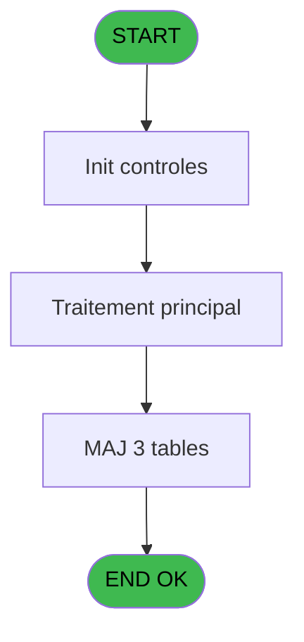
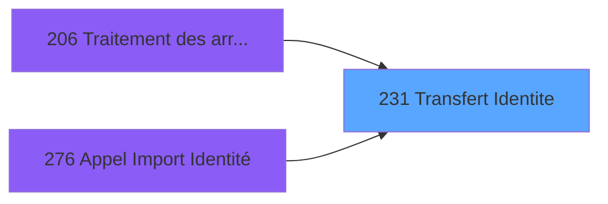
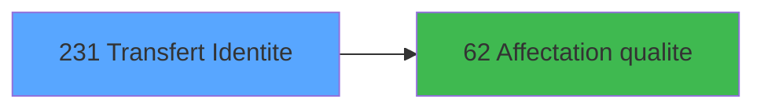

# PBG IDE 231 - Transfert Identite

> **Analyse**: Phases 1-4 2026-02-03 10:23 -> 10:23 (17s) | Assemblage 10:23
> **Pipeline**: V7.2 Enrichi
> **Structure**: 4 onglets (Resume | Ecrans | Donnees | Connexions)

<!-- TAB:Resume -->

## 1. FICHE D'IDENTITE

| Attribut | Valeur |
|----------|--------|
| Projet | PBG |
| IDE Position | 231 |
| Nom Programme | Transfert Identite |
| Fichier source | `Prg_231.xml` |
| Domaine metier | General |
| Taches | 9 (1 ecrans visibles) |
| Tables modifiees | 3 |
| Programmes appeles | 1 |

## 2. DESCRIPTION FONCTIONNELLE

**Transfert Identite** assure la gestion complete de ce processus, accessible depuis [Traitement des arrivants (IDE 206)](PBG-IDE-206.md), [Appel Import Identité (IDE 276)](PBG-IDE-276.md).

Le flux de traitement s'organise en **2 blocs fonctionnels** :

- **Traitement** (7 taches) : traitements metier divers
- **Creation** (2 taches) : insertion d'enregistrements en base (mouvements, prestations)

**Donnees modifiees** : 3 tables en ecriture (types_erreurs_od, pointage_articles_caution, moyen_de_paiement_reference).

Detail : phases du traitement

#### Phase 1 : Traitement (7 taches)

- **231** - Veuillez patienter... **[[ECRAN]](#ecran-t1)**
- **231.1** - Chemin IDE.DAT
- **231.2** - Import IDE.DAT
- **231.2.1** - Historisation chaine
- **231.3** - Import IDE.DAT
- **231.4** - Import IDE.DAT
- **231.4.1** - Historisation chaine

Delegue a : [Affectation qualite (IDE 62)](PBG-IDE-62.md)

#### Phase 2 : Creation (2 taches)

- **231.2.2** - Creation Dossier
- **231.4.2** - Creation Dossier

#### Tables impactees

| Table | Operations | Role metier |
|-------|-----------|-------------|
| types_erreurs_od | **W** (2 usages) |  |
| moyen_de_paiement_reference | **W** (2 usages) |  |
| pointage_articles_caution | **W** (2 usages) | Articles et stock |

## 3. BLOCS FONCTIONNELS

### 3.1 Traitement (7 taches)

Traitements internes.

---

#### 231 - Veuillez patienter... [[ECRAN]](#ecran-t1)

**Role** : Tache d'orchestration : point d'entree du programme (7 sous-taches). Coordonne l'enchainement des traitements.
**Ecran** : 427 x 68 DLU (MDI) | [Voir mockup](#ecran-t1)

6 sous-taches directes

| Tache | Nom | Bloc |
|-------|-----|------|
| [231.1](#t2) | Chemin IDE.DAT | Traitement |
| [231.2](#t3) | Import IDE.DAT | Traitement |
| [231.2.1](#t4) | Historisation chaine | Traitement |
| [231.3](#t6) | Import IDE.DAT | Traitement |
| [231.4](#t10) | Import IDE.DAT | Traitement |
| [231.4.1](#t11) | Historisation chaine | Traitement |

**Delegue a** : [Affectation qualite (IDE 62)](PBG-IDE-62.md)

---

#### 231.1 - Chemin IDE.DAT

**Role** : Traitement : Chemin IDE.DAT.
**Delegue a** : [Affectation qualite (IDE 62)](PBG-IDE-62.md)

---

#### 231.2 - Import IDE.DAT

**Role** : Traitement : Import IDE.DAT.
**Variables liees** : D (P0-Numero import)
**Delegue a** : [Affectation qualite (IDE 62)](PBG-IDE-62.md)

---

#### 231.2.1 - Historisation chaine

**Role** : Traitement : Historisation chaine.
**Delegue a** : [Affectation qualite (IDE 62)](PBG-IDE-62.md)

---

#### 231.3 - Import IDE.DAT

**Role** : Traitement : Import IDE.DAT.
**Variables liees** : D (P0-Numero import)
**Delegue a** : [Affectation qualite (IDE 62)](PBG-IDE-62.md)

---

#### 231.4 - Import IDE.DAT

**Role** : Traitement : Import IDE.DAT.
**Variables liees** : D (P0-Numero import)
**Delegue a** : [Affectation qualite (IDE 62)](PBG-IDE-62.md)

---

#### 231.4.1 - Historisation chaine

**Role** : Traitement : Historisation chaine.
**Delegue a** : [Affectation qualite (IDE 62)](PBG-IDE-62.md)

### 3.2 Creation (2 taches)

Insertion de nouveaux enregistrements en base.

---

#### 231.2.2 - Creation Dossier

**Role** : Creation d'enregistrement : Creation Dossier.

---

#### 231.4.2 - Creation Dossier

**Role** : Creation d'enregistrement : Creation Dossier.

## 5. REGLES METIER

*(Aucune regle metier identifiee)*

## 6. CONTEXTE

- **Appele par**: [Traitement des arrivants (IDE 206)](PBG-IDE-206.md), [Appel Import Identité (IDE 276)](PBG-IDE-276.md)
- **Appelle**: 1 programmes | **Tables**: 6 (W:3 R:1 L:2) | **Taches**: 9 | **Expressions**: 7

<!-- TAB:Ecrans -->

## 8. ECRANS

### 8.1 Forms visibles (1 / 9)

| # | Position | Tache | Nom | Type | Largeur | Hauteur | Bloc |
|---|----------|-------|-----|------|---------|---------|------|
| 1 | 231 | 231 | Veuillez patienter... | MDI | 427 | 68 | Traitement |

### 8.2 Mockups Ecrans

---

#### 231 - Veuillez patienter...
**Tache** : [231](#t1) | **Type** : MDI | **Dimensions** : 427 x 68 DLU
**Bloc** : Traitement | **Titre IDE** : Veuillez patienter...

<!-- FORM-DATA:
{
    "width":  427,
    "vFactor":  8,
    "type":  "MDI",
    "hFactor":  8,
    "controls":  [
                     {
                         "x":  1,
                         "type":  "label",
                         "var":  "",
                         "y":  0,
                         "w":  423,
                         "fmt":  "",
                         "name":  "",
                         "h":  29,
                         "color":  "",
                         "text":  "",
                         "parent":  null
                     },
                     {
                         "x":  99,
                         "type":  "label",
                         "var":  "",
                         "y":  10,
                         "w":  275,
                         "fmt":  "",
                         "name":  "",
                         "h":  8,
                         "color":  "7",
                         "text":  "Traitement Identite",
                         "parent":  null
                     },
                     {
                         "x":  1,
                         "type":  "label",
                         "var":  "",
                         "y":  29,
                         "w":  423,
                         "fmt":  "",
                         "name":  "",
                         "h":  37,
                         "color":  "",
                         "text":  "",
                         "parent":  null
                     },
                     {
                         "x":  9,
                         "type":  "label",
                         "var":  "",
                         "y":  41,
                         "w":  405,
                         "fmt":  "",
                         "name":  "",
                         "h":  19,
                         "color":  "",
                         "text":  "",
                         "parent":  null
                     },
                     {
                         "x":  2,
                         "type":  "image",
                         "var":  "",
                         "y":  2,
                         "w":  72,
                         "fmt":  "",
                         "name":  "",
                         "h":  25,
                         "color":  "",
                         "text":  "",
                         "parent":  null
                     },
                     {
                         "x":  12,
                         "type":  "edit",
                         "var":  "",
                         "y":  42,
                         "w":  400,
                         "fmt":  "30",
                         "name":  "",
                         "h":  17,
                         "color":  "159",
                         "text":  "",
                         "parent":  4
                     },
                     {
                         "x":  177,
                         "type":  "edit",
                         "var":  "",
                         "y":  46,
                         "w":  64,
                         "fmt":  "3 %",
                         "name":  "",
                         "h":  8,
                         "color":  "143",
                         "text":  "",
                         "parent":  1
                     }
                 ],
    "taskId":  "231",
    "height":  68
}
-->

<strong>Champs : 2 champs</strong>

| Pos (x,y) | Nom | Variable | Type |
|-----------|-----|----------|------|
| 12,42 | 30 | - | edit |
| 177,46 | 3 % | - | edit |

## 9. NAVIGATION

Ecran unique: **Veuillez patienter...**

### 9.3 Structure hierarchique (9 taches)

| Position | Tache | Type | Dimensions | Bloc |
|----------|-------|------|------------|------|
| **231.1** | [**Veuillez patienter...** (231)](#t1) [mockup](#ecran-t1) | MDI | 427x68 | Traitement |
| 231.1.1 | [Chemin IDE.DAT (231.1)](#t2) | MDI | - | |
| 231.1.2 | [Import IDE.DAT (231.2)](#t3) | MDI | - | |
| 231.1.3 | [Historisation chaine (231.2.1)](#t4) | MDI | - | |
| 231.1.4 | [Import IDE.DAT (231.3)](#t6) | MDI | - | |
| 231.1.5 | [Import IDE.DAT (231.4)](#t10) | MDI | - | |
| 231.1.6 | [Historisation chaine (231.4.1)](#t11) | MDI | - | |
| **231.2** | [**Creation Dossier** (231.2.2)](#t5) | MDI | - | Creation |
| 231.2.1 | [Creation Dossier (231.4.2)](#t12) | MDI | - | |

### 9.4 Algorigramme

> **Legende**: Vert = START/END OK | Rouge = END KO | Bleu = Decisions
> *Algorigramme auto-genere. Utiliser `/algorigramme` pour une synthese metier detaillee.*

<!-- TAB:Donnees -->

## 10. TABLES

### Tables utilisees (6)

| ID | Nom | Description | Type | R | W | L | Usages |
|----|-----|-------------|------|---|---|---|--------|
| 118 | tables_imports |  | DB | R |   |   | 1 |
| 121 | tables_pays_ventes | Donnees de ventes | DB |   |   | L | 2 |
| 130 | fichier_langue |  | DB |   |   | L | 2 |
| 360 | types_erreurs_od |  | DB |   | **W** |   | 2 |
| 569 | pointage_articles_caution | Articles et stock | TMP |   | **W** |   | 2 |
| 687 | moyen_de_paiement_reference |  | DB |   | **W** |   | 2 |

### Colonnes par table (2 / 4 tables avec colonnes identifiees)

Table 118 - tables_imports (R) - 1 usages

*Table utilisee uniquement en Link ou aucune colonne Real identifiee dans le DataView.*

Table 360 - types_erreurs_od (**W**) - 2 usages

*Table utilisee uniquement en Link ou aucune colonne Real identifiee dans le DataView.*

Table 569 - pointage_articles_caution (**W**) - 2 usages

| Lettre | Variable | Acces | Type |
|--------|----------|-------|------|
| A | v.mail | W | Alpha |
| B | v.accept_eco | W | Alpha |
| C | v.dossier_direct | W | Alpha |
| D | W1 ret lien inscript | W | Numeric |
| E | W1 ret lien langue | W | Numeric |

Table 687 - moyen_de_paiement_reference (**W**) - 2 usages

*Table utilisee uniquement en Link ou aucune colonne Real identifiee dans le DataView.*

## 11. VARIABLES

### 11.1 Variables de session (1)

Variables persistantes pendant toute la session.

| Lettre | Nom | Type | Usage dans |
|--------|-----|------|-----------|
| Q | V.Compteur | Numeric | 2x session |

### 11.2 Autres (16)

Variables diverses.

| Lettre | Nom | Type | Usage dans |
|--------|-----|------|-----------|
| A | P0-Code Societe | Alpha | - |
| B | P0-Lieu de Sejour | Alpha | - |
| C | P0-Nb Arrivants | Numeric | - |
| D | P0-Numero import | Numeric | - |
| E | W0-Operande | Numeric | - |
| F | W0-Operateur | Numeric | - |
| G | W0-Pourcentage | Numeric | - |
| H | W0-Calcul Pourcent | Numeric | - |
| I | W0-Ligne de Commande | Alpha | 1x refs |
| J | W0-Ligne commande mod | Alpha | - |
| K | W0-Type Client | Alpha | - |
| L | W0-NíAdherent | Numeric | - |
| M | W0-Filiation Adh. | Numeric | - |
| N | W0-Type Accompagnant | Alpha | - |
| O | W0-NíAccompagnant | Numeric | - |
| P | W0-Filiation Acc. | Numeric | - |

Toutes les 17 variables (liste complete)

| Cat | Lettre | Nom Variable | Type |
|-----|--------|--------------|------|
| V. | **Q** | V.Compteur | Numeric |
| Autre | **A** | P0-Code Societe | Alpha |
| Autre | **B** | P0-Lieu de Sejour | Alpha |
| Autre | **C** | P0-Nb Arrivants | Numeric |
| Autre | **D** | P0-Numero import | Numeric |
| Autre | **E** | W0-Operande | Numeric |
| Autre | **F** | W0-Operateur | Numeric |
| Autre | **G** | W0-Pourcentage | Numeric |
| Autre | **H** | W0-Calcul Pourcent | Numeric |
| Autre | **I** | W0-Ligne de Commande | Alpha |
| Autre | **J** | W0-Ligne commande mod | Alpha |
| Autre | **K** | W0-Type Client | Alpha |
| Autre | **L** | W0-NíAdherent | Numeric |
| Autre | **M** | W0-Filiation Adh. | Numeric |
| Autre | **N** | W0-Type Accompagnant | Alpha |
| Autre | **O** | W0-NíAccompagnant | Numeric |
| Autre | **P** | W0-Filiation Acc. | Numeric |

## 12. EXPRESSIONS

**7 / 7 expressions decodees (100%)**

### 12.1 Repartition par type

| Type | Expressions | Regles |
|------|-------------|--------|
| CALCULATION | 2 | 0 |
| CALCUL | 1 | 0 |
| CONSTANTE | 1 | 0 |
| OTHER | 3 | 0 |

### 12.2 Expressions cles par type

#### CALCULATION (2 expressions)

| Type | IDE | Expression | Regle |
|------|-----|------------|-------|
| CALCULATION | 4 | `(V.Compteur [Q]/VG7)*50` | - |
| CALCULATION | 3 | `(V.Compteur [Q]/VG7)*100` | - |

#### CALCUL (1 expressions)

| Type | IDE | Expression | Regle |
|------|-----|------------|-------|
| CALCUL | 5 | `Fix((FileInfo (W0-Ligne de Commande [I], 5)/663),10,0)` | - |

#### CONSTANTE (1 expressions)

| Type | IDE | Expression | Regle |
|------|-----|------------|-------|
| CONSTANTE | 1 | `''` | - |

#### OTHER (3 expressions)

| Type | IDE | Expression | Regle |
|------|-----|------------|-------|
| OTHER | 7 | `NOT(ExpCalc('10'EXP))` | - |
| OTHER | 6 | `VG84 OR VG85` | - |
| OTHER | 2 | `DbDel ('{687,2}'DSOURCE,'')` | - |

<!-- TAB:Connexions -->

## 13. GRAPHE D'APPELS

### 13.1 Chaine depuis Main (Callers)

Main -> ... -> [Traitement des arrivants (IDE 206)](PBG-IDE-206.md) -> **Transfert Identite (IDE 231)**

Main -> ... -> [Appel Import Identité (IDE 276)](PBG-IDE-276.md) -> **Transfert Identite (IDE 231)**

### 13.2 Callers

| IDE | Nom Programme | Nb Appels |
|-----|---------------|-----------|
| [206](PBG-IDE-206.md) | Traitement des arrivants | 1 |
| [276](PBG-IDE-276.md) | Appel Import Identité | 1 |

### 13.3 Callees (programmes appeles)

### 13.4 Detail Callees avec contexte

| IDE | Nom Programme | Appels | Contexte |
|-----|---------------|--------|----------|
| [62](PBG-IDE-62.md) | Affectation qualite | 2 | Sous-programme |

## 14. RECOMMANDATIONS MIGRATION

### 14.1 Profil du programme

| Metrique | Valeur | Impact migration |
|----------|--------|-----------------|
| Lignes de logique | 418 | Taille moyenne |
| Expressions | 7 | Peu de logique |
| Tables WRITE | 3 | Impact modere |
| Sous-programmes | 1 | Peu de dependances |
| Ecrans visibles | 1 | Ecran unique ou traitement batch |
| Code desactive | 1.4% (6 / 418) | Code sain |
| Regles metier | 0 | Pas de regle identifiee |

### 14.2 Plan de migration par bloc

#### Traitement (7 taches: 1 ecran, 6 traitements)

- **Strategie** : Orchestrateur avec 1 ecrans (Razor/React) et 6 traitements backend (services).
- Les ecrans deviennent des composants UI, les traitements invisibles deviennent des services injectables.
- 1 sous-programme(s) a migrer ou a reutiliser depuis les services existants.
- Decomposer les taches en services unitaires testables.

#### Creation (2 taches: 0 ecran, 2 traitements)

- **Strategie** : Repository pattern avec Entity Framework Core.
- Insertion via `IRepository<T>.CreateAsync()`

### 14.3 Dependances critiques

| Dependance | Type | Appels | Impact |
|------------|------|--------|--------|
| types_erreurs_od | Table WRITE (Database) | 2x | Schema + repository |
| pointage_articles_caution | Table WRITE (Temp) | 2x | Schema + repository |
| moyen_de_paiement_reference | Table WRITE (Database) | 2x | Schema + repository |
| [Affectation qualite (IDE 62)](PBG-IDE-62.md) | Sous-programme | 2x | Haute - Sous-programme |

---
*Spec DETAILED generee par Pipeline V7.2 - 2026-02-03 10:23*
