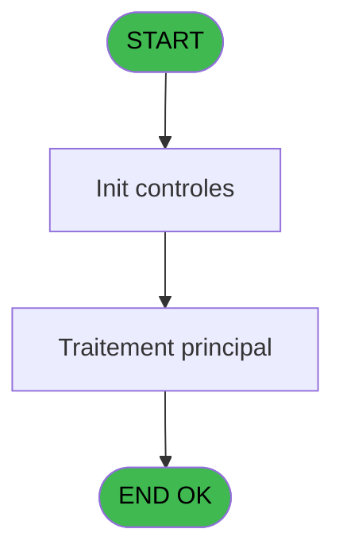
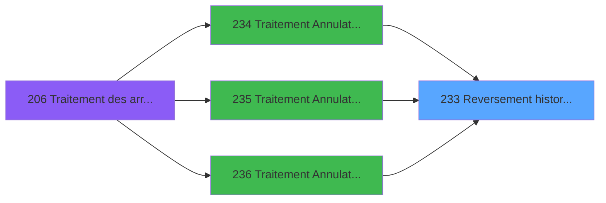

# PBG IDE 233 - Reversement historique

> **Analyse**: Phases 1-4 2026-02-03 10:24 -> 10:24 (21s) | Assemblage 10:24
> **Pipeline**: V7.2 Enrichi
> **Structure**: 4 onglets (Resume | Ecrans | Donnees | Connexions)

<!-- TAB:Resume -->

## 1. FICHE D'IDENTITE

| Attribut | Valeur |
|----------|--------|
| Projet | PBG |
| IDE Position | 233 |
| Nom Programme | Reversement historique |
| Fichier source | `Prg_233.xml` |
| Domaine metier | General |
| Taches | 1 (1 ecrans visibles) |
| Tables modifiees | 0 |
| Programmes appeles | 0 |

## 2. DESCRIPTION FONCTIONNELLE

**Reversement historique** assure la gestion complete de ce processus, accessible depuis [Traitement Annulation sur modi (IDE 234)](PBG-IDE-234.md), [Traitement Annulation/pms-682 (IDE 235)](PBG-IDE-235.md), [Traitement Annulation/pms-912 (IDE 236)](PBG-IDE-236.md).

Le flux de traitement s'organise en **1 blocs fonctionnels** :

- **Traitement** (1 tache) : traitements metier divers

## 3. BLOCS FONCTIONNELS

### 3.1 Traitement (1 tache)

Traitements internes.

---

#### 233 - Reversement historisation [[ECRAN]](#ecran-t1)

**Role** : Traitement : Reversement historisation.
**Ecran** : 427 x 69 DLU (MDI) | [Voir mockup](#ecran-t1)

## 5. REGLES METIER

*(Aucune regle metier identifiee)*

## 6. CONTEXTE

- **Appele par**: [Traitement Annulation sur modi (IDE 234)](PBG-IDE-234.md), [Traitement Annulation/pms-682 (IDE 235)](PBG-IDE-235.md), [Traitement Annulation/pms-912 (IDE 236)](PBG-IDE-236.md)
- **Appelle**: 0 programmes | **Tables**: 2 (W:0 R:1 L:1) | **Taches**: 1 | **Expressions**: 15

<!-- TAB:Ecrans -->

## 8. ECRANS

### 8.1 Forms visibles (1 / 1)

| # | Position | Tache | Nom | Type | Largeur | Hauteur | Bloc |
|---|----------|-------|-----|------|---------|---------|------|
| 1 | 233 | 233 | Reversement historisation | MDI | 427 | 69 | Traitement |

### 8.2 Mockups Ecrans

---

#### 233 - Reversement historisation
**Tache** : [233](#t1) | **Type** : MDI | **Dimensions** : 427 x 69 DLU
**Bloc** : Traitement | **Titre IDE** : Reversement historisation

<!-- FORM-DATA:
{
    "width":  427,
    "vFactor":  8,
    "type":  "MDI",
    "hFactor":  8,
    "controls":  [
                     {
                         "x":  3,
                         "type":  "label",
                         "var":  "",
                         "y":  3,
                         "w":  423,
                         "fmt":  "",
                         "name":  "",
                         "h":  29,
                         "color":  "",
                         "text":  "",
                         "parent":  null
                     },
                     {
                         "x":  95,
                         "type":  "label",
                         "var":  "",
                         "y":  13,
                         "w":  237,
                         "fmt":  "",
                         "name":  "",
                         "h":  9,
                         "color":  "7",
                         "text":  "Reversement historisation",
                         "parent":  null
                     },
                     {
                         "x":  3,
                         "type":  "label",
                         "var":  "",
                         "y":  32,
                         "w":  423,
                         "fmt":  "",
                         "name":  "",
                         "h":  37,
                         "color":  "",
                         "text":  "",
                         "parent":  null
                     },
                     {
                         "x":  11,
                         "type":  "label",
                         "var":  "",
                         "y":  44,
                         "w":  405,
                         "fmt":  "",
                         "name":  "",
                         "h":  19,
                         "color":  "",
                         "text":  "",
                         "parent":  null
                     },
                     {
                         "x":  4,
                         "type":  "image",
                         "var":  "",
                         "y":  5,
                         "w":  72,
                         "fmt":  "",
                         "name":  "",
                         "h":  25,
                         "color":  "",
                         "text":  "",
                         "parent":  null
                     },
                     {
                         "x":  14,
                         "type":  "edit",
                         "var":  "",
                         "y":  45,
                         "w":  400,
                         "fmt":  "30",
                         "name":  "",
                         "h":  17,
                         "color":  "159",
                         "text":  "",
                         "parent":  14
                     },
                     {
                         "x":  179,
                         "type":  "edit",
                         "var":  "",
                         "y":  49,
                         "w":  64,
                         "fmt":  "3 %",
                         "name":  "",
                         "h":  8,
                         "color":  "143",
                         "text":  "",
                         "parent":  11
                     }
                 ],
    "taskId":  "233",
    "height":  69
}
-->

<strong>Champs : 2 champs</strong>

| Pos (x,y) | Nom | Variable | Type |
|-----------|-----|----------|------|
| 14,45 | 30 | - | edit |
| 179,49 | 3 % | - | edit |

## 9. NAVIGATION

Ecran unique: **   Reversement historisation**

### 9.3 Structure hierarchique (1 tache)

| Position | Tache | Type | Dimensions | Bloc |
|----------|-------|------|------------|------|
| **233.1** | [**Reversement historisation** (233)](#t1) [mockup](#ecran-t1) | MDI | 427x69 | Traitement |

### 9.4 Algorigramme

> **Legende**: Vert = START/END OK | Rouge = END KO | Bleu = Decisions
> *Algorigramme auto-genere. Utiliser `/algorigramme` pour une synthese metier detaillee.*

<!-- TAB:Donnees -->

## 10. TABLES

### Tables utilisees (2)

| ID | Nom | Description | Type | R | W | L | Usages |
|----|-----|-------------|------|---|---|---|--------|
| 338 | import_historique_chaine | Historique / journal | DB |   |   | L | 1 |
| 687 | moyen_de_paiement_reference |  | DB | R |   |   | 1 |

### Colonnes par table (0 / 1 tables avec colonnes identifiees)

Table 687 - moyen_de_paiement_reference (R) - 1 usages

*Table utilisee uniquement en Link ou aucune colonne Real identifiee dans le DataView.*

## 11. VARIABLES

*(Programme sans variables locales mappees)*

## 12. EXPRESSIONS

**15 / 15 expressions decodees (100%)**

### 12.1 Repartition par type

| Type | Expressions | Regles |
|------|-------------|--------|
| CALCULATION | 3 | 0 |
| CONSTANTE | 3 | 0 |
| OTHER | 9 | 0 |

### 12.2 Expressions cles par type

#### CALCULATION (3 expressions)

| Type | IDE | Expression | Regle |
|------|-----|------------|-------|
| CALCULATION | 14 | `([AL]/VG18)*50` | - |
| CALCULATION | 12 | `([AL]/VG18)*100` | - |
| CALCULATION | 11 | `[AL]+1` | - |

#### CONSTANTE (3 expressions)

| Type | IDE | Expression | Regle |
|------|-----|------------|-------|
| CONSTANTE | 13 | `''` | - |
| CONSTANTE | 2 | `'CMED'` | - |
| CONSTANTE | 1 | `1` | - |

#### OTHER (9 expressions)

| Type | IDE | Expression | Regle |
|------|-----|------------|-------|
| OTHER | 9 | `[H]` | - |
| OTHER | 8 | `[D]` | - |
| OTHER | 15 | `DbRecs('{687,2}'DSOURCE,'')` | - |
| OTHER | 10 | `[I]` | - |
| OTHER | 7 | `[F]` | - |
| ... | | *+4 autres* | |

<!-- TAB:Connexions -->

## 13. GRAPHE D'APPELS

### 13.1 Chaine depuis Main (Callers)

Main -> ... -> [Traitement Annulation sur modi (IDE 234)](PBG-IDE-234.md) -> **Reversement historique (IDE 233)**

Main -> ... -> [Traitement Annulation/pms-682 (IDE 235)](PBG-IDE-235.md) -> **Reversement historique (IDE 233)**

Main -> ... -> [Traitement Annulation/pms-912 (IDE 236)](PBG-IDE-236.md) -> **Reversement historique (IDE 233)**

### 13.2 Callers

| IDE | Nom Programme | Nb Appels |
|-----|---------------|-----------|
| [234](PBG-IDE-234.md) | Traitement Annulation sur modi | 2 |
| [235](PBG-IDE-235.md) | Traitement Annulation/pms-682 | 2 |
| [236](PBG-IDE-236.md) | Traitement Annulation/pms-912 | 2 |

### 13.3 Callees (programmes appeles)

### 13.4 Detail Callees avec contexte

| IDE | Nom Programme | Appels | Contexte |
|-----|---------------|--------|----------|
| - | (aucun) | - | - |

## 14. RECOMMANDATIONS MIGRATION

### 14.1 Profil du programme

| Metrique | Valeur | Impact migration |
|----------|--------|-----------------|
| Lignes de logique | 31 | Programme compact |
| Expressions | 15 | Peu de logique |
| Tables WRITE | 0 | Impact faible |
| Sous-programmes | 0 | Peu de dependances |
| Ecrans visibles | 1 | Ecran unique ou traitement batch |
| Code desactive | 0% (0 / 31) | Code sain |
| Regles metier | 0 | Pas de regle identifiee |

### 14.2 Plan de migration par bloc

#### Traitement (1 tache: 1 ecran, 0 traitement)

- **Strategie** : 1 composant(s) UI (Razor/React) avec formulaires et validation.
- Decomposer les taches en services unitaires testables.

### 14.3 Dependances critiques

| Dependance | Type | Appels | Impact |
|------------|------|--------|--------|

---
*Spec DETAILED generee par Pipeline V7.2 - 2026-02-03 10:24*
