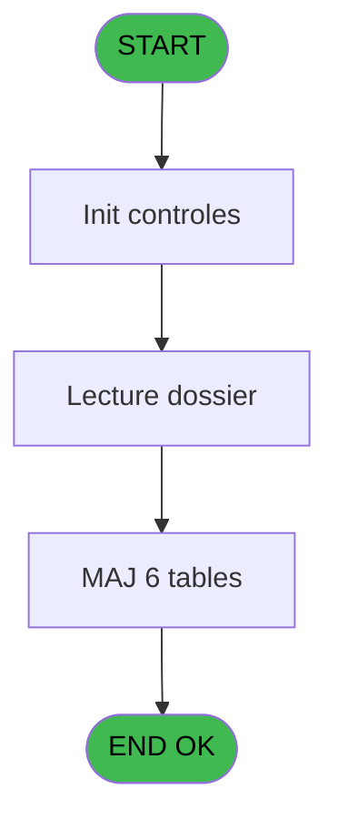

# PBG IDE 234 - Traitement Annulation sur modi

> **Analyse**: Phases 1-4 2026-02-03 10:24 -> 10:25 (21s) | Assemblage 10:25
> **Pipeline**: V7.2 Enrichi
> **Structure**: 4 onglets (Resume | Ecrans | Donnees | Connexions)

<!-- TAB:Resume -->

## 1. FICHE D'IDENTITE

| Attribut | Valeur |
|----------|--------|
| Projet | PBG |
| IDE Position | 234 |
| Nom Programme | Traitement Annulation sur modi |
| Fichier source | `Prg_234.xml` |
| Domaine metier | General |
| Taches | 14 (1 ecrans visibles) |
| Tables modifiees | 6 |
| Programmes appeles | 8 |

## 2. DESCRIPTION FONCTIONNELLE

**Traitement Annulation sur modi** assure la gestion complete de ce processus, accessible depuis [Traitement des arrivants (IDE 206)](PBG-IDE-206.md).

Le flux de traitement s'organise en **3 blocs fonctionnels** :

- **Traitement** (11 taches) : traitements metier divers
- **Calcul** (2 taches) : calculs de montants, stocks ou compteurs
- **Initialisation** (1 tache) : reinitialisation d'etats et de variables de travail

**Donnees modifiees** : 6 tables en ecriture (types_erreurs_od, import_troncon___imt, pms_chained_listing, saisie_od_taiforfait, seminaires, tempo_comptage_tul).

Detail : phases du traitement

#### Phase 1 : Traitement (11 taches)

- **234** - Veuillez patienter ... **[[ECRAN]](#ecran-t1)**
- **234.1** - Age Enfant/Bebe
- **234.2** - Veuillez patienter ... **[[ECRAN]](#ecran-t3)**
- **234.2.1** - Annulation GM
- **234.2.1.1** - Cloture Caisse en cours ?
- **234.2.1.3** - Maj ASD
- **234.2.1.4** - Avertissement Import
- **234.2.1.5** - Avertissement Import
- **234.2.1.6** - Avertissement Import
- **234.2.2** - Lecture fichier
- **234.2.3** - Suppression ?

Delegue a : [   Reversement historique (IDE 233)](PBG-IDE-233.md), [   Suppression Client (IDE 82)](PBG-IDE-82.md), [GM analyse suppression 1 (IDE 128)](PBG-IDE-128.md), [GM supprimes en modif 1 (IDE 130)](PBG-IDE-130.md), [Demarquage Caisse (IDE 176)](PBG-IDE-176.md), [Marquage Caisse(S) (IDE 177)](PBG-IDE-177.md)

#### Phase 2 : Initialisation (1 tache)

- **234.2.1.2** - Definition N° cas

#### Phase 3 : Calcul (2 taches)

- **234.2.1.7** - Lecture compte
- **234.2.3.1** - Calcul chambre

#### Tables impactees

| Table | Operations | Role metier |
|-------|-----------|-------------|
| pms_chained_listing | **W**/L (2 usages) |  |
| types_erreurs_od | **W** (1 usages) |  |
| saisie_od_taiforfait | **W** (1 usages) |  |
| import_troncon___imt | **W** (1 usages) |  |
| seminaires | **W** (1 usages) |  |
| tempo_comptage_tul | **W** (1 usages) | Table temporaire ecran |

## 3. BLOCS FONCTIONNELS

### 3.1 Traitement (11 taches)

Traitements internes.

---

#### 234 - Veuillez patienter ... [[ECRAN]](#ecran-t1)

**Role** : Tache d'orchestration : point d'entree du programme (11 sous-taches). Coordonne l'enchainement des traitements.
**Ecran** : 424 x 66 DLU (MDI) | [Voir mockup](#ecran-t1)

10 sous-taches directes

| Tache | Nom | Bloc |
|-------|-----|------|
| [234.1](#t2) | Age Enfant/Bebe | Traitement |
| [234.2](#t3) | Veuillez patienter ... **[[ECRAN]](#ecran-t3)** | Traitement |
| [234.2.1](#t4) | Annulation GM | Traitement |
| [234.2.1.1](#t5) | Cloture Caisse en cours ? | Traitement |
| [234.2.1.3](#t7) | Maj ASD | Traitement |
| [234.2.1.4](#t8) | Avertissement Import | Traitement |
| [234.2.1.5](#t9) | Avertissement Import | Traitement |
| [234.2.1.6](#t10) | Avertissement Import | Traitement |
| [234.2.2](#t12) | Lecture fichier | Traitement |
| [234.2.3](#t13) | Suppression ? | Traitement |

---

#### 234.1 - Age Enfant/Bebe

**Role** : Traitement : Age Enfant/Bebe.

---

#### 234.2 - Veuillez patienter ... [[ECRAN]](#ecran-t3)

**Role** : Traitement : Veuillez patienter ....
**Ecran** : 229 x 78 DLU (MDI) | [Voir mockup](#ecran-t3)

---

#### 234.2.1 - Annulation GM

**Role** : Traitement : Annulation GM.
**Variables liees** : C (P0-Nb Annulation)

---

#### 234.2.1.1 - Cloture Caisse en cours ?

**Role** : Traitement : Cloture Caisse en cours ?.

---

#### 234.2.1.3 - Maj ASD

**Role** : Traitement : Maj ASD.

---

#### 234.2.1.4 - Avertissement Import

**Role** : Traitement : Avertissement Import.
**Variables liees** : D (P0 N° Import)

---

#### 234.2.1.5 - Avertissement Import

**Role** : Traitement : Avertissement Import.
**Variables liees** : D (P0 N° Import)

---

#### 234.2.1.6 - Avertissement Import

**Role** : Traitement : Avertissement Import.
**Variables liees** : D (P0 N° Import)

---

#### 234.2.2 - Lecture fichier

**Role** : Traitement : Lecture fichier.

---

#### 234.2.3 - Suppression ?

**Role** : Traitement : Suppression ?.

### 3.2 Initialisation (1 tache)

Reinitialisation d'etats et variables de travail.

---

#### 234.2.1.2 - Definition N° cas

**Role** : Reinitialisation : Definition N° cas.

### 3.3 Calcul (2 taches)

Calculs metier : montants, stocks, compteurs.

---

#### 234.2.1.7 - Lecture compte

**Role** : Traitement : Lecture compte.
**Variables liees** : R (V.Compteur)

---

#### 234.2.3.1 - Calcul chambre

**Role** : Calcul : Calcul chambre.
**Variables liees** : H (W0-Calcul Pourcent)

## 5. REGLES METIER

*(Aucune regle metier identifiee)*

## 6. CONTEXTE

- **Appele par**: [Traitement des arrivants (IDE 206)](PBG-IDE-206.md)
- **Appelle**: 8 programmes | **Tables**: 14 (W:6 R:5 L:6) | **Taches**: 14 | **Expressions**: 16

<!-- TAB:Ecrans -->

## 8. ECRANS

### 8.1 Forms visibles (1 / 14)

| # | Position | Tache | Nom | Type | Largeur | Hauteur | Bloc |
|---|----------|-------|-----|------|---------|---------|------|
| 1 | 234.2 | 234.2 | Veuillez patienter ... | MDI | 229 | 78 | Traitement |

### 8.2 Mockups Ecrans

---

#### 234.2 - Veuillez patienter ...
**Tache** : [234.2](#t3) | **Type** : MDI | **Dimensions** : 229 x 78 DLU
**Bloc** : Traitement | **Titre IDE** : Veuillez patienter ...

<!-- FORM-DATA:
{
    "width":  229,
    "vFactor":  8,
    "type":  "MDI",
    "hFactor":  4,
    "controls":  [
                     {
                         "x":  2,
                         "type":  "label",
                         "var":  "",
                         "y":  4,
                         "w":  220,
                         "fmt":  "",
                         "name":  "",
                         "h":  29,
                         "color":  "",
                         "text":  "",
                         "parent":  null
                     },
                     {
                         "x":  60,
                         "type":  "label",
                         "var":  "",
                         "y":  14,
                         "w":  141,
                         "fmt":  "",
                         "name":  "",
                         "h":  9,
                         "color":  "7",
                         "text":  "Traitement annulation sur modi",
                         "parent":  null
                     },
                     {
                         "x":  2,
                         "type":  "label",
                         "var":  "",
                         "y":  33,
                         "w":  220,
                         "fmt":  "",
                         "name":  "",
                         "h":  37,
                         "color":  "",
                         "text":  "",
                         "parent":  null
                     },
                     {
                         "x":  10,
                         "type":  "label",
                         "var":  "",
                         "y":  45,
                         "w":  204,
                         "fmt":  "",
                         "name":  "",
                         "h":  19,
                         "color":  "",
                         "text":  "",
                         "parent":  null
                     },
                     {
                         "x":  3,
                         "type":  "image",
                         "var":  "",
                         "y":  6,
                         "w":  40,
                         "fmt":  "",
                         "name":  "",
                         "h":  25,
                         "color":  "",
                         "text":  "",
                         "parent":  null
                     },
                     {
                         "x":  13,
                         "type":  "edit",
                         "var":  "",
                         "y":  46,
                         "w":  200,
                         "fmt":  "30",
                         "name":  "",
                         "h":  17,
                         "color":  "159",
                         "text":  "",
                         "parent":  4
                     },
                     {
                         "x":  102,
                         "type":  "edit",
                         "var":  "",
                         "y":  50,
                         "w":  24,
                         "fmt":  "3 %",
                         "name":  "",
                         "h":  8,
                         "color":  "143",
                         "text":  "",
                         "parent":  1
                     }
                 ],
    "taskId":  "234.2",
    "height":  78
}
-->

<strong>Champs : 2 champs</strong>

| Pos (x,y) | Nom | Variable | Type |
|-----------|-----|----------|------|
| 13,46 | 30 | - | edit |
| 102,50 | 3 % | - | edit |

## 9. NAVIGATION

Ecran unique: **Veuillez patienter ...**

### 9.3 Structure hierarchique (14 taches)

| Position | Tache | Type | Dimensions | Bloc |
|----------|-------|------|------------|------|
| **234.1** | [**Veuillez patienter ...** (234)](#t1) [mockup](#ecran-t1) | MDI | 424x66 | Traitement |
| 234.1.1 | [Age Enfant/Bebe (234.1)](#t2) | MDI | - | |
| 234.1.2 | [Veuillez patienter ... (234.2)](#t3) [mockup](#ecran-t3) | MDI | 229x78 | |
| 234.1.3 | [Annulation GM (234.2.1)](#t4) | MDI | - | |
| 234.1.4 | [Cloture Caisse en cours ? (234.2.1.1)](#t5) | MDI | - | |
| 234.1.5 | [Maj ASD (234.2.1.3)](#t7) | MDI | - | |
| 234.1.6 | [Avertissement Import (234.2.1.4)](#t8) | MDI | - | |
| 234.1.7 | [Avertissement Import (234.2.1.5)](#t9) | MDI | - | |
| 234.1.8 | [Avertissement Import (234.2.1.6)](#t10) | MDI | - | |
| 234.1.9 | [Lecture fichier (234.2.2)](#t12) | MDI | - | |
| 234.1.10 | [Suppression ? (234.2.3)](#t13) | MDI | - | |
| **234.2** | [**Definition N° cas** (234.2.1.2)](#t6) | MDI | - | Initialisation |
| **234.3** | [**Lecture compte** (234.2.1.7)](#t11) | MDI | - | Calcul |
| 234.3.1 | [Calcul chambre (234.2.3.1)](#t16) | MDI | - | |

### 9.4 Algorigramme

> **Legende**: Vert = START/END OK | Rouge = END KO | Bleu = Decisions
> *Algorigramme auto-genere. Utiliser `/algorigramme` pour une synthese metier detaillee.*

<!-- TAB:Donnees -->

## 10. TABLES

### Tables utilisees (14)

| ID | Nom | Description | Type | R | W | L | Usages |
|----|-----|-------------|------|---|---|---|--------|
| 23 | reseau_cloture___rec | Donnees reseau/cloture | DB | R |   |   | 1 |
| 30 | gm-recherche_____gmr | Index de recherche | DB | R |   |   | 2 |
| 31 | gm-complet_______gmc |  | DB | R |   | L | 3 |
| 34 | hebergement______heb | Hebergement (chambres) | DB | R |   | L | 2 |
| 113 | tables_village |  | DB | R |   |   | 1 |
| 131 | fichier_validation |  | DB |   |   | L | 1 |
| 133 | new_asd |  | DB |   |   | L | 1 |
| 360 | types_erreurs_od |  | DB |   | **W** |   | 1 |
| 558 | import_troncon___imt |  | TMP |   | **W** |   | 1 |
| 562 | import_avertiss__mod2_bis |  | TMP |   |   | L | 3 |
| 563 | pms_chained_listing |  | TMP |   | **W** | L | 2 |
| 578 | saisie_od_taiforfait |  | TMP |   | **W** |   | 1 |
| 579 | seminaires |  | TMP |   | **W** |   | 1 |
| 580 | tempo_comptage_tul | Table temporaire ecran | TMP |   | **W** |   | 1 |

### Colonnes par table (5 / 11 tables avec colonnes identifiees)

Table 23 - reseau_cloture___rec (R) - 1 usages

| Lettre | Variable | Acces | Type |
|--------|----------|-------|------|
| A | W3 Cloture en cours | R | Numeric |

Table 30 - gm-recherche_____gmr (R) - 2 usages

*Table utilisee uniquement en Link ou aucune colonne Real identifiee dans le DataView.*

Table 31 - gm-complet_______gmc (R/L) - 3 usages

| Lettre | Variable | Acces | Type |
|--------|----------|-------|------|
| A | W2 Accord Suite | R | Alpha |
| B | W2 N° Compte | R | Numeric |
| C | W2 N° Filiation | R | Numeric |
| D | W2 Nom/Prenom | R | Alpha |
| E | W2 N° cas | R | Numeric |
| F | W2 Avertissement ? | R | Alpha |
| G | W2 Millesia | R | Alpha |
| H | W2 Honey Moon | R | Alpha |
| I | W2 Filler | R | Alpha |
| J | W2 Filler | R | Alpha |
| K | W2 Filler | R | Alpha |
| L | W2 Compte separe | R | Numeric |
| M | W2 Filiation separe | R | Numeric |

Table 34 - hebergement______heb (R/L) - 2 usages

| Lettre | Variable | Acces | Type |
|--------|----------|-------|------|
| A | v. cdrt hebergement | R | Logical |

Table 113 - tables_village (R) - 1 usages

*Table utilisee uniquement en Link ou aucune colonne Real identifiee dans le DataView.*

Table 360 - types_erreurs_od (**W**) - 1 usages

*Table utilisee uniquement en Link ou aucune colonne Real identifiee dans le DataView.*

Table 558 - import_troncon___imt (**W**) - 1 usages

| Lettre | Variable | Acces | Type |
|--------|----------|-------|------|
| D | P0 N° Import | W | Numeric |

Table 563 - pms_chained_listing (**W**/L) - 2 usages

*Table utilisee uniquement en Link ou aucune colonne Real identifiee dans le DataView.*

Table 578 - saisie_od_taiforfait (**W**) - 1 usages

*Table utilisee uniquement en Link ou aucune colonne Real identifiee dans le DataView.*

Table 579 - seminaires (**W**) - 1 usages

*Table utilisee uniquement en Link ou aucune colonne Real identifiee dans le DataView.*

Table 580 - tempo_comptage_tul (**W**) - 1 usages

*Table utilisee uniquement en Link ou aucune colonne Real identifiee dans le DataView.*

## 11. VARIABLES

### 11.1 Parametres entrants (1)

Variables recues du programme appelant ([Traitement des arrivants (IDE 206)](PBG-IDE-206.md)).

| Lettre | Nom | Type | Usage dans |
|--------|-----|------|-----------|
| D | P0 N° Import | Numeric | - |

### 11.2 Variables de session (1)

Variables persistantes pendant toute la session.

| Lettre | Nom | Type | Usage dans |
|--------|-----|------|-----------|
| R | V.Compteur | Numeric | - |

### 11.3 Variables de travail (2)

Variables internes au programme.

| Lettre | Nom | Type | Usage dans |
|--------|-----|------|-----------|
| P | W0 Age Bebe | Numeric | - |
| Q | W0 Age Enfant | Numeric | - |

### 11.4 Autres (14)

Variables diverses.

| Lettre | Nom | Type | Usage dans |
|--------|-----|------|-----------|
| A | P0-Code Societe | Alpha | - |
| B | P0-Lieu de Sejour | Alpha | - |
| C | P0-Nb Annulation | Numeric | - |
| E | W0-Operande | Numeric | - |
| F | W0-Operateur | Numeric | - |
| G | W0-Pourcentage | Numeric | - |
| H | W0-Calcul Pourcent | Numeric | - |
| I | W0-Ligne de Commande | Alpha | - |
| J | W0-Type Client | Alpha | - |
| K | W0-N°Adherent | Numeric | - |
| L | W0-Filiation Adh. | Numeric | - |
| M | W0-Type Accompagnant | Alpha | - |
| N | W0-N°Accompagnant | Numeric | - |
| O | W0-Filiation Acc. | Numeric | - |

Toutes les 18 variables (liste complete)

| Cat | Lettre | Nom Variable | Type |
|-----|--------|--------------|------|
| P0 | **D** | P0 N° Import | Numeric |
| W0 | **P** | W0 Age Bebe | Numeric |
| W0 | **Q** | W0 Age Enfant | Numeric |
| V. | **R** | V.Compteur | Numeric |
| Autre | **A** | P0-Code Societe | Alpha |
| Autre | **B** | P0-Lieu de Sejour | Alpha |
| Autre | **C** | P0-Nb Annulation | Numeric |
| Autre | **E** | W0-Operande | Numeric |
| Autre | **F** | W0-Operateur | Numeric |
| Autre | **G** | W0-Pourcentage | Numeric |
| Autre | **H** | W0-Calcul Pourcent | Numeric |
| Autre | **I** | W0-Ligne de Commande | Alpha |
| Autre | **J** | W0-Type Client | Alpha |
| Autre | **K** | W0-N°Adherent | Numeric |
| Autre | **L** | W0-Filiation Adh. | Numeric |
| Autre | **M** | W0-Type Accompagnant | Alpha |
| Autre | **N** | W0-N°Accompagnant | Numeric |
| Autre | **O** | W0-Filiation Acc. | Numeric |

## 12. EXPRESSIONS

**16 / 16 expressions decodees (100%)**

### 12.1 Repartition par type

| Type | Expressions | Regles |
|------|-------------|--------|
| CONDITION | 2 | 0 |
| CALCULATION | 3 | 0 |
| CAST_LOGIQUE | 1 | 0 |
| OTHER | 10 | 0 |

### 12.2 Expressions cles par type

#### CONDITION (2 expressions)

| Type | IDE | Expression | Regle |
|------|-----|------------|-------|
| CONDITION | 15 | `INIGet ('[MAGIC_LOGICAL_NAMES]club_modif_dossier')<>'O'` | - |
| CONDITION | 2 | `CallProg('{493,-1}'PROG,DbName('{338,2}'DSOURCE))=0` | - |

#### CALCULATION (3 expressions)

| Type | IDE | Expression | Regle |
|------|-----|------------|-------|
| CALCULATION | 9 | `CallProg('{492,-1}'PROG,DbName('{579,2}'DSOURCE))` | - |
| CALCULATION | 7 | `CallProg('{492,-1}'PROG,DbName('{558,2}'DSOURCE))` | - |
| CALCULATION | 4 | `CallProg('{492,-1}'PROG,DbName('{578,2}'DSOURCE))` | - |

#### CAST_LOGIQUE (1 expressions)

| Type | IDE | Expression | Regle |
|------|-----|------------|-------|
| CAST_LOGIQUE | 1 | `INIPut ('[MAGIC_LOGICAL_NAMES]club_user='&VG20,'FALSE'LOG)` | - |

#### OTHER (10 expressions)

| Type | IDE | Expression | Regle |
|------|-----|------------|-------|
| OTHER | 12 | `DbDel ('{567,2}'DSOURCE,'')` | - |
| OTHER | 11 | `DbDel ('{566,2}'DSOURCE,'')` | - |
| OTHER | 13 | `DbDel ('{561,2}'DSOURCE,'')` | - |
| OTHER | 16 | `NOT(VG138)` | - |
| OTHER | 14 | `DbDel ('{563,2}'DSOURCE,'')` | - |
| ... | | *+5 autres* | |

<!-- TAB:Connexions -->

## 13. GRAPHE D'APPELS

### 13.1 Chaine depuis Main (Callers)

Main -> ... -> [Traitement des arrivants (IDE 206)](PBG-IDE-206.md) -> **Traitement Annulation sur modi (IDE 234)**

### 13.2 Callers

| IDE | Nom Programme | Nb Appels |
|-----|---------------|-----------|
| [206](PBG-IDE-206.md) | Traitement des arrivants | 1 |

### 13.3 Callees (programmes appeles)

### 13.4 Detail Callees avec contexte

| IDE | Nom Programme | Appels | Contexte |
|-----|---------------|--------|----------|
| [233](PBG-IDE-233.md) |    Reversement historique | 2 | Historique/consultation |
| [82](PBG-IDE-82.md) |    Suppression Client | 1 | Sous-programme |
| [128](PBG-IDE-128.md) | GM analyse suppression 1 | 1 | Sous-programme |
| [130](PBG-IDE-130.md) | GM supprimes en modif 1 | 1 | Sous-programme |
| [176](PBG-IDE-176.md) | Demarquage Caisse | 1 | Sous-programme |
| [177](PBG-IDE-177.md) | Marquage Caisse(S) | 1 | Sous-programme |
| [182](PBG-IDE-182.md) | Verification Suppression | 1 | Controle/validation |
| [237](PBG-IDE-237.md) | Transfert MOD | 1 | Transfert donnees |

## 14. RECOMMANDATIONS MIGRATION

### 14.1 Profil du programme

| Metrique | Valeur | Impact migration |
|----------|--------|-----------------|
| Lignes de logique | 477 | Taille moyenne |
| Expressions | 16 | Peu de logique |
| Tables WRITE | 6 | Fort impact donnees |
| Sous-programmes | 8 | Dependances moderees |
| Ecrans visibles | 1 | Ecran unique ou traitement batch |
| Code desactive | 0.6% (3 / 477) | Code sain |
| Regles metier | 0 | Pas de regle identifiee |

### 14.2 Plan de migration par bloc

#### Traitement (11 taches: 2 ecrans, 9 traitements)

- **Strategie** : Orchestrateur avec 2 ecrans (Razor/React) et 9 traitements backend (services).
- Les ecrans deviennent des composants UI, les traitements invisibles deviennent des services injectables.
- 8 sous-programme(s) a migrer ou a reutiliser depuis les services existants.
- Decomposer les taches en services unitaires testables.

#### Initialisation (1 tache: 0 ecran, 1 traitement)

- **Strategie** : Constructeur/methode `InitAsync()` dans l'orchestrateur.

#### Calcul (2 taches: 0 ecran, 2 traitements)

- **Strategie** : Services de calcul purs (Domain Services).
- Migrer la logique de calcul (stock, compteurs, montants)

### 14.3 Dependances critiques

| Dependance | Type | Appels | Impact |
|------------|------|--------|--------|
| types_erreurs_od | Table WRITE (Database) | 1x | Schema + repository |
| import_troncon___imt | Table WRITE (Temp) | 1x | Schema + repository |
| pms_chained_listing | Table WRITE (Temp) | 1x | Schema + repository |
| saisie_od_taiforfait | Table WRITE (Temp) | 1x | Schema + repository |
| seminaires | Table WRITE (Temp) | 1x | Schema + repository |
| tempo_comptage_tul | Table WRITE (Temp) | 1x | Schema + repository |
| [   Reversement historique (IDE 233)](PBG-IDE-233.md) | Sous-programme | 2x | Haute - Historique/consultation |
| [Marquage Caisse(S) (IDE 177)](PBG-IDE-177.md) | Sous-programme | 1x | Normale - Sous-programme |
| [Verification Suppression (IDE 182)](PBG-IDE-182.md) | Sous-programme | 1x | Normale - Controle/validation |
| [Transfert MOD (IDE 237)](PBG-IDE-237.md) | Sous-programme | 1x | Normale - Transfert donnees |
| [Demarquage Caisse (IDE 176)](PBG-IDE-176.md) | Sous-programme | 1x | Normale - Sous-programme |
| [   Suppression Client (IDE 82)](PBG-IDE-82.md) | Sous-programme | 1x | Normale - Sous-programme |
| [GM analyse suppression 1 (IDE 128)](PBG-IDE-128.md) | Sous-programme | 1x | Normale - Sous-programme |
| [GM supprimes en modif 1 (IDE 130)](PBG-IDE-130.md) | Sous-programme | 1x | Normale - Sous-programme |

---
*Spec DETAILED generee par Pipeline V7.2 - 2026-02-03 10:25*
