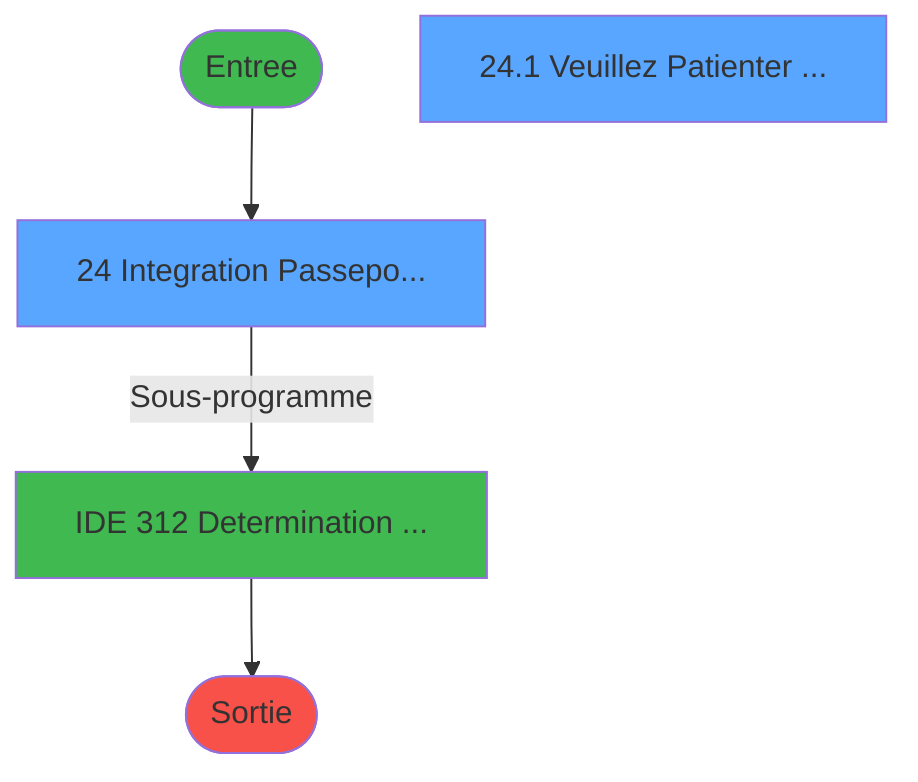
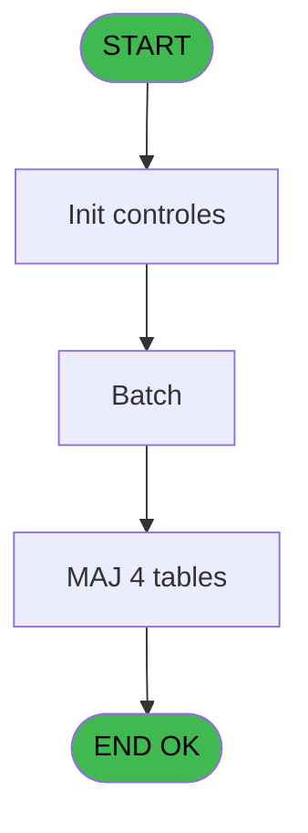

# PBG IDE 24 - Import GM seminaire via txt

> **Analyse**: Phases 1-4 2026-02-03 01:11 -> 01:12 (42s) | Assemblage 01:12
> **Pipeline**: V7.2 Enrichi
> **Structure**: 4 onglets (Resume | Ecrans | Donnees | Connexions)

<!-- TAB:Resume -->

## 1. FICHE D'IDENTITE

| Attribut | Valeur |
|----------|--------|
| Projet | PBG |
| IDE Position | 24 |
| Nom Programme | Import GM seminaire via txt |
| Fichier source | `Prg_24.xml` |
| Domaine metier | General |
| Taches | 8 (2 ecrans visibles) |
| Tables modifiees | 4 |
| Programmes appeles | 1 |
| :warning: Statut | **ORPHELIN_POTENTIEL** |

## 2. DESCRIPTION FONCTIONNELLE

**Import GM seminaire via txt** assure la gestion complete de ce processus.

Le flux de traitement s'organise en **4 blocs fonctionnels** :

- **Traitement** (5 taches) : traitements metier divers
- **Validation** (1 tache) : controles et verifications de coherence
- **Creation** (1 tache) : insertion d'enregistrements en base (mouvements, prestations)
- **Consultation** (1 tache) : ecrans de recherche, selection et consultation

**Donnees modifiees** : 4 tables en ecriture (gm-complet_______gmc, client_gm, fichier_validation, handicap).

Detail : phases du traitement

#### Phase 1 : Traitement (5 taches)

- **24** - Integration Passeports Via TXT **[[ECRAN]](#ecran-t1)**
- **24.1** - Veuillez Patienter ... **[[ECRAN]](#ecran-t2)**
- **24.1.2** - Delivrance passeport
- **24.1.4** - Mise a jour GMC
- **24.1.5** - Mise a jour GML

Delegue a : [Determination Age Debut Sejour (IDE 312)](PBG-IDE-312.md)

#### Phase 2 : Consultation (1 tache)

- **24.1.1** - Recherche GM

#### Phase 3 : Creation (1 tache)

- **24.1.3** - Creation Visa

#### Phase 4 : Validation (1 tache)

- **24.1.6** - Mise a jour Validation

#### Tables impactees

| Table | Operations | Role metier |
|-------|-----------|-------------|
| client_gm | R/**W** (2 usages) |  |
| fichier_validation | **W** (1 usages) |  |
| gm-complet_______gmc | **W** (1 usages) |  |
| handicap | **W** (1 usages) |  |

## 3. BLOCS FONCTIONNELS

### 3.1 Traitement (5 taches)

Traitements internes.

---

#### 24 - Integration Passeports Via TXT [[ECRAN]](#ecran-t1)

**Role** : Traitement : Integration Passeports Via TXT.
**Ecran** : 990 x 141 DLU (MDI) | [Voir mockup](#ecran-t1)

4 sous-taches directes

| Tache | Nom | Bloc |
|-------|-----|------|
| [24.1](#t2) | Veuillez Patienter ... **[[ECRAN]](#ecran-t2)** | Traitement |
| [24.1.2](#t4) | Delivrance passeport | Traitement |
| [24.1.4](#t6) | Mise a jour GMC | Traitement |
| [24.1.5](#t8) | Mise a jour GML | Traitement |

**Delegue a** : [Determination Age Debut Sejour (IDE 312)](PBG-IDE-312.md)

---

#### 24.1 - Veuillez Patienter ... [[ECRAN]](#ecran-t2)

**Role** : Traitement : Veuillez Patienter ....
**Ecran** : 426 x 56 DLU (MDI) | [Voir mockup](#ecran-t2)
**Delegue a** : [Determination Age Debut Sejour (IDE 312)](PBG-IDE-312.md)

---

#### 24.1.2 - Delivrance passeport

**Role** : Traitement : Delivrance passeport.
**Variables liees** : K (v. date delivrance), L (v. pays de delivrance), N (v. date de delivrance), O (v. lieu de delivrance), P (v. pays de delivrance)
**Delegue a** : [Determination Age Debut Sejour (IDE 312)](PBG-IDE-312.md)

---

#### 24.1.4 - Mise a jour GMC

**Role** : Traitement : Mise a jour GMC.
**Delegue a** : [Determination Age Debut Sejour (IDE 312)](PBG-IDE-312.md)

---

#### 24.1.5 - Mise a jour GML

**Role** : Traitement : Mise a jour GML.
**Delegue a** : [Determination Age Debut Sejour (IDE 312)](PBG-IDE-312.md)

### 3.2 Consultation (1 tache)

Ecrans de recherche et consultation.

---

#### 24.1.1 - Recherche GM

**Role** : Traitement : Recherche GM.

### 3.3 Creation (1 tache)

Insertion de nouveaux enregistrements en base.

---

#### 24.1.3 - Creation Visa

**Role** : Creation d'enregistrement : Creation Visa.
**Variables liees** : M (v. visa)

### 3.4 Validation (1 tache)

Controles de coherence : 1 tache verifie les donnees et conditions.

---

#### 24.1.6 - Mise a jour Validation

**Role** : Verification : Mise a jour Validation.

## 5. REGLES METIER

*(Aucune regle metier identifiee)*

## 6. CONTEXTE

- **Appele par**: (aucun)
- **Appelle**: 1 programmes | **Tables**: 6 (W:4 R:2 L:1) | **Taches**: 8 | **Expressions**: 2

<!-- TAB:Ecrans -->

## 8. ECRANS

### 8.1 Forms visibles (2 / 8)

| # | Position | Tache | Nom | Type | Largeur | Hauteur | Bloc |
|---|----------|-------|-----|------|---------|---------|------|
| 1 | 24 | 24 | Integration Passeports Via TXT | MDI | 990 | 141 | Traitement |
| 2 | 24.1 | 24.1 | Veuillez Patienter ... | MDI | 426 | 56 | Traitement |

### 8.2 Mockups Ecrans

---

#### 24 - Integration Passeports Via TXT
**Tache** : [24](#t1) | **Type** : MDI | **Dimensions** : 990 x 141 DLU
**Bloc** : Traitement | **Titre IDE** : Integration Passeports Via TXT

<!-- FORM-DATA:
{
    "width":  990,
    "vFactor":  8,
    "type":  "MDI",
    "hFactor":  8,
    "controls":  [
                     {
                         "x":  54,
                         "type":  "label",
                         "var":  "",
                         "y":  11,
                         "w":  736,
                         "fmt":  "",
                         "name":  "",
                         "h":  14,
                         "color":  "",
                         "text":  "Import des GM à partir du fichier preformate",
                         "parent":  null
                     },
                     {
                         "x":  272,
                         "type":  "label",
                         "var":  "",
                         "y":  42,
                         "w":  672,
                         "fmt":  "",
                         "name":  "",
                         "h":  43,
                         "color":  "",
                         "text":  "Chemin du fichier à importer",
                         "parent":  null
                     },
                     {
                         "x":  0,
                         "type":  "label",
                         "var":  "",
                         "y":  113,
                         "w":  987,
                         "fmt":  "",
                         "name":  "",
                         "h":  24,
                         "color":  "1",
                         "text":  "",
                         "parent":  null
                     },
                     {
                         "x":  320,
                         "type":  "edit",
                         "var":  "",
                         "y":  60,
                         "w":  572,
                         "fmt":  "",
                         "name":  "v.file path",
                         "h":  13,
                         "color":  "110",
                         "text":  "",
                         "parent":  3
                     },
                     {
                         "x":  9,
                         "type":  "button",
                         "var":  "",
                         "y":  116,
                         "w":  154,
                         "fmt":  "\u0026Ok",
                         "name":  "b.ok",
                         "h":  18,
                         "color":  "",
                         "text":  "",
                         "parent":  null
                     },
                     {
                         "x":  46,
                         "type":  "image",
                         "var":  "",
                         "y":  39,
                         "w":  160,
                         "fmt":  "",
                         "name":  "",
                         "h":  57,
                         "color":  "",
                         "text":  "",
                         "parent":  null
                     },
                     {
                         "x":  185,
                         "type":  "button",
                         "var":  "",
                         "y":  116,
                         "w":  154,
                         "fmt":  "A\u0026bandonner",
                         "name":  "",
                         "h":  18,
                         "color":  "",
                         "text":  "",
                         "parent":  null
                     }
                 ],
    "taskId":  "24",
    "height":  141
}
-->

<strong>Champs : 1 champs</strong>

| Pos (x,y) | Nom | Variable | Type |
|-----------|-----|----------|------|
| 320,60 | v.file path | - | edit |

<strong>Boutons : 2 boutons</strong>

| Bouton | Pos (x,y) | Action |
|--------|-----------|--------|
| Ok | 9,116 | Valide la saisie et enregistre |
| Abandonner | 185,116 | Annule et retour au menu |

---

#### 24.1 - Veuillez Patienter ...
**Tache** : [24.1](#t2) | **Type** : MDI | **Dimensions** : 426 x 56 DLU
**Bloc** : Traitement | **Titre IDE** : Veuillez Patienter ...

<!-- FORM-DATA:
{
    "width":  426,
    "vFactor":  8,
    "type":  "MDI",
    "hFactor":  8,
    "controls":  [
                     {
                         "x":  1,
                         "type":  "label",
                         "var":  "",
                         "y":  0,
                         "w":  423,
                         "fmt":  "",
                         "name":  "",
                         "h":  29,
                         "color":  "",
                         "text":  "",
                         "parent":  null
                     },
                     {
                         "x":  118,
                         "type":  "label",
                         "var":  "",
                         "y":  10,
                         "w":  275,
                         "fmt":  "",
                         "name":  "",
                         "h":  8,
                         "color":  "7",
                         "text":  "Integration Passeports",
                         "parent":  null
                     },
                     {
                         "x":  1,
                         "type":  "label",
                         "var":  "",
                         "y":  29,
                         "w":  423,
                         "fmt":  "",
                         "name":  "",
                         "h":  27,
                         "color":  "",
                         "text":  "",
                         "parent":  null
                     },
                     {
                         "x":  2,
                         "type":  "image",
                         "var":  "",
                         "y":  2,
                         "w":  72,
                         "fmt":  "",
                         "name":  "",
                         "h":  25,
                         "color":  "",
                         "text":  "",
                         "parent":  null
                     },
                     {
                         "x":  11,
                         "type":  "edit",
                         "var":  "",
                         "y":  38,
                         "w":  406,
                         "fmt":  "U30",
                         "name":  "",
                         "h":  10,
                         "color":  "",
                         "text":  "",
                         "parent":  null
                     }
                 ],
    "taskId":  "24.1",
    "height":  56
}
-->

<strong>Champs : 1 champs</strong>

| Pos (x,y) | Nom | Variable | Type |
|-----------|-----|----------|------|
| 11,38 | U30 | - | edit |

## 9. NAVIGATION

### 9.1 Enchainement des ecrans

**Detail par enchainement :**

| Depuis | Action | Vers | Retour |
|--------|--------|------|--------|
| Integration Passeports Via TXT | Sous-programme | [Determination Age Debut Sejour (IDE 312)](PBG-IDE-312.md) | Retour ecran |

### 9.3 Structure hierarchique (8 taches)

| Position | Tache | Type | Dimensions | Bloc |
|----------|-------|------|------------|------|
| **24.1** | [**Integration Passeports Via TXT** (24)](#t1) [mockup](#ecran-t1) | MDI | 990x141 | Traitement |
| 24.1.1 | [Veuillez Patienter ... (24.1)](#t2) [mockup](#ecran-t2) | MDI | 426x56 | |
| 24.1.2 | [Delivrance passeport (24.1.2)](#t4) | MDI | - | |
| 24.1.3 | [Mise a jour GMC (24.1.4)](#t6) | MDI | - | |
| 24.1.4 | [Mise a jour GML (24.1.5)](#t8) | MDI | - | |
| **24.2** | [**Recherche GM** (24.1.1)](#t3) | MDI | - | Consultation |
| **24.3** | [**Creation Visa** (24.1.3)](#t5) | MDI | - | Creation |
| **24.4** | [**Mise a jour Validation** (24.1.6)](#t9) | MDI | - | Validation |

### 9.4 Algorigramme

> **Legende**: Vert = START/END OK | Rouge = END KO | Bleu = Decisions
> *Algorigramme auto-genere. Utiliser `/algorigramme` pour une synthese metier detaillee.*

<!-- TAB:Donnees -->

## 10. TABLES

### Tables utilisees (6)

| ID | Nom | Description | Type | R | W | L | Usages |
|----|-----|-------------|------|---|---|---|--------|
| 31 | gm-complet_______gmc |  | DB |   | **W** |   | 1 |
| 36 | client_gm |  | DB | R | **W** |   | 2 |
| 119 | tables_pays_tel_ |  | DB | R |   |   | 1 |
| 131 | fichier_validation |  | DB |   | **W** |   | 1 |
| 337 | handicap |  | DB |   | **W** |   | 1 |
| 478 | tempo_ventes | Table temporaire ecran | TMP |   |   | L | 1 |

### Colonnes par table (2 / 5 tables avec colonnes identifiees)

Table 31 - gm-complet_______gmc (**W**) - 1 usages

*Table utilisee uniquement en Link ou aucune colonne Real identifiee dans le DataView.*

Table 36 - client_gm (R/**W**) - 2 usages

*Table utilisee uniquement en Link ou aucune colonne Real identifiee dans le DataView.*

Table 119 - tables_pays_tel_ (R) - 1 usages

| Lettre | Variable | Acces | Type |
|--------|----------|-------|------|
| H | v. pays de naissance | R | Alpha |
| L | v. pays de delivrance | R | Alpha |
| P | v. pays de delivrance | R | Alpha |

Table 131 - fichier_validation (**W**) - 1 usages

*Table utilisee uniquement en Link ou aucune colonne Real identifiee dans le DataView.*

Table 337 - handicap (**W**) - 1 usages

| Lettre | Variable | Acces | Type |
|--------|----------|-------|------|
| R | v. handicap | W | Logical |

## 11. VARIABLES

### 11.1 Variables de session (21)

Variables persistantes pendant toute la session.

| Lettre | Nom | Type | Usage dans |
|--------|-----|------|-----------|
| A | v.file path | Alpha | - |
| D | v. titre | Alpha | - |
| E | v. nom | Alpha | - |
| F | v. prenom | Alpha | - |
| G | v. date de naissance | Date | - |
| H | v. pays de naissance | Alpha | - |
| I | v. nationalite | Alpha | - |
| J | v. numero de piece | Alpha | - |
| K | v. date delivrance | Date | - |
| L | v. pays de delivrance | Alpha | - |
| M | v. visa | Logical | - |
| N | v. date de delivrance | Date | - |
| O | v. lieu de delivrance | Alpha | - |
| P | v. pays de delivrance | Alpha | - |
| Q | v. profession | Alpha | - |
| R | v. handicap | Logical | - |
| S | v. age numerique | Numeric | - |
| T | v. age codifie | Alpha | - |
| U | v. date de debut | Date | - |
| V | v. ville delivrance passport | Alpha | - |
| W | V.Nb mois | Numeric | - |

### 11.2 Autres (2)

Variables diverses.

| Lettre | Nom | Type | Usage dans |
|--------|-----|------|-----------|
| B | b.ok | Alpha | - |
| C | b.quitter | Alpha | - |

Toutes les 23 variables (liste complete)

| Cat | Lettre | Nom Variable | Type |
|-----|--------|--------------|------|
| V. | **A** | v.file path | Alpha |
| V. | **D** | v. titre | Alpha |
| V. | **E** | v. nom | Alpha |
| V. | **F** | v. prenom | Alpha |
| V. | **G** | v. date de naissance | Date |
| V. | **H** | v. pays de naissance | Alpha |
| V. | **I** | v. nationalite | Alpha |
| V. | **J** | v. numero de piece | Alpha |
| V. | **K** | v. date delivrance | Date |
| V. | **L** | v. pays de delivrance | Alpha |
| V. | **M** | v. visa | Logical |
| V. | **N** | v. date de delivrance | Date |
| V. | **O** | v. lieu de delivrance | Alpha |
| V. | **P** | v. pays de delivrance | Alpha |
| V. | **Q** | v. profession | Alpha |
| V. | **R** | v. handicap | Logical |
| V. | **S** | v. age numerique | Numeric |
| V. | **T** | v. age codifie | Alpha |
| V. | **U** | v. date de debut | Date |
| V. | **V** | v. ville delivrance passport | Alpha |
| V. | **W** | V.Nb mois | Numeric |
| Autre | **B** | b.ok | Alpha |
| Autre | **C** | b.quitter | Alpha |

## 12. EXPRESSIONS

**2 / 2 expressions decodees (100%)**

### 12.1 Repartition par type

| Type | Expressions | Regles |
|------|-------------|--------|
| CALCULATION | 1 | 0 |
| CONSTANTE | 1 | 0 |

### 12.2 Expressions cles par type

#### CALCULATION (1 expressions)

| Type | IDE | Expression | Regle |
|------|-----|------------|-------|
| CALCULATION | 2 | `FileDlg ('','*.csv')` | - |

#### CONSTANTE (1 expressions)

| Type | IDE | Expression | Regle |
|------|-----|------------|-------|
| CONSTANTE | 1 | `'A:\GM.TXT'` | - |

<!-- TAB:Connexions -->

## 13. GRAPHE D'APPELS

### 13.1 Chaine depuis Main (Callers)

**Chemin**: (pas de callers directs)

### 13.2 Callers

| IDE | Nom Programme | Nb Appels |
|-----|---------------|-----------|
| - | (aucun) | - |

### 13.3 Callees (programmes appeles)

### 13.4 Detail Callees avec contexte

| IDE | Nom Programme | Appels | Contexte |
|-----|---------------|--------|----------|
| [312](PBG-IDE-312.md) | Determination Age Debut Sejour | 1 | Sous-programme |

## 14. RECOMMANDATIONS MIGRATION

### 14.1 Profil du programme

| Metrique | Valeur | Impact migration |
|----------|--------|-----------------|
| Lignes de logique | 155 | Programme compact |
| Expressions | 2 | Peu de logique |
| Tables WRITE | 4 | Impact modere |
| Sous-programmes | 1 | Peu de dependances |
| Ecrans visibles | 2 | Quelques ecrans |
| Code desactive | 0% (0 / 155) | Code sain |
| Regles metier | 0 | Pas de regle identifiee |

### 14.2 Plan de migration par bloc

#### Traitement (5 taches: 2 ecrans, 3 traitements)

- **Strategie** : Orchestrateur avec 2 ecrans (Razor/React) et 3 traitements backend (services).
- Les ecrans deviennent des composants UI, les traitements invisibles deviennent des services injectables.
- 1 sous-programme(s) a migrer ou a reutiliser depuis les services existants.
- Decomposer les taches en services unitaires testables.

#### Consultation (1 tache: 0 ecran, 1 traitement)

- **Strategie** : Composants de recherche/selection en modales.

#### Creation (1 tache: 0 ecran, 1 traitement)

- **Strategie** : Repository pattern avec Entity Framework Core.
- Insertion via `IRepository<T>.CreateAsync()`

#### Validation (1 tache: 0 ecran, 1 traitement)

- **Strategie** : FluentValidation avec validators specifiques.
- Chaque tache de validation -> un validator injectable

### 14.3 Dependances critiques

| Dependance | Type | Appels | Impact |
|------------|------|--------|--------|
| gm-complet_______gmc | Table WRITE (Database) | 1x | Schema + repository |
| client_gm | Table WRITE (Database) | 1x | Schema + repository |
| fichier_validation | Table WRITE (Database) | 1x | Schema + repository |
| handicap | Table WRITE (Database) | 1x | Schema + repository |
| [Determination Age Debut Sejour (IDE 312)](PBG-IDE-312.md) | Sous-programme | 1x | Normale - Sous-programme |

---
*Spec DETAILED generee par Pipeline V7.2 - 2026-02-03 01:12*
