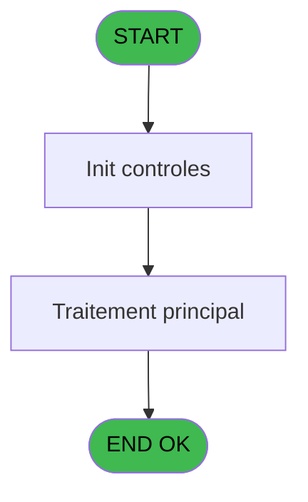
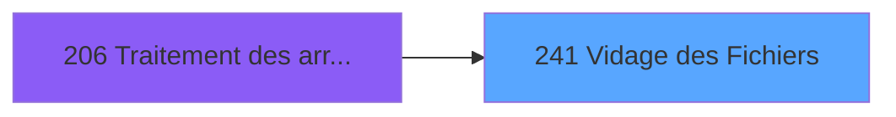

# PBG IDE 241 - Vidage des Fichiers

> **Analyse**: Phases 1-4 2026-02-03 10:28 -> 10:29 (27s) | Assemblage 10:29
> **Pipeline**: V7.2 Enrichi
> **Structure**: 4 onglets (Resume | Ecrans | Donnees | Connexions)

<!-- TAB:Resume -->

## 1. FICHE D'IDENTITE

| Attribut | Valeur |
|----------|--------|
| Projet | PBG |
| IDE Position | 241 |
| Nom Programme | Vidage des Fichiers |
| Fichier source | `Prg_241.xml` |
| Domaine metier | General |
| Taches | 1 (1 ecrans visibles) |
| Tables modifiees | 0 |
| Programmes appeles | 1 |

## 2. DESCRIPTION FONCTIONNELLE

**Vidage des Fichiers** assure la gestion complete de ce processus, accessible depuis [Traitement des arrivants (IDE 206)](PBG-IDE-206.md).

Le flux de traitement s'organise en **1 blocs fonctionnels** :

- **Traitement** (1 tache) : traitements metier divers

## 3. BLOCS FONCTIONNELS

### 3.1 Traitement (1 tache)

Traitements internes.

---

#### 241 - Veuillez patienter... [[ECRAN]](#ecran-t1)

**Role** : Traitement : Veuillez patienter....
**Ecran** : 424 x 31 DLU (MDI) | [Voir mockup](#ecran-t1)
**Delegue a** : [   SQL Delete modif (IDE 240)](PBG-IDE-240.md)

## 5. REGLES METIER

*(Aucune regle metier identifiee)*

## 6. CONTEXTE

- **Appele par**: [Traitement des arrivants (IDE 206)](PBG-IDE-206.md)
- **Appelle**: 1 programmes | **Tables**: 0 (W:0 R:0 L:0) | **Taches**: 1 | **Expressions**: 21

<!-- TAB:Ecrans -->

## 8. ECRANS

### 8.1 Forms visibles (1 / 1)

| # | Position | Tache | Nom | Type | Largeur | Hauteur | Bloc |
|---|----------|-------|-----|------|---------|---------|------|
| 1 | 241 | 241 | Veuillez patienter... | MDI | 424 | 31 | Traitement |

### 8.2 Mockups Ecrans

---

#### 241 - Veuillez patienter...
**Tache** : [241](#t1) | **Type** : MDI | **Dimensions** : 424 x 31 DLU
**Bloc** : Traitement | **Titre IDE** : Veuillez patienter...

<!-- FORM-DATA:
{
    "width":  424,
    "vFactor":  8,
    "type":  "MDI",
    "hFactor":  8,
    "controls":  [
                     {
                         "x":  1,
                         "type":  "label",
                         "var":  "",
                         "y":  0,
                         "w":  423,
                         "fmt":  "",
                         "name":  "",
                         "h":  29,
                         "color":  "",
                         "text":  "",
                         "parent":  null
                     },
                     {
                         "x":  112,
                         "type":  "label",
                         "var":  "",
                         "y":  10,
                         "w":  258,
                         "fmt":  "",
                         "name":  "",
                         "h":  8,
                         "color":  "7",
                         "text":  "Vidage des Fichiers Import.",
                         "parent":  null
                     },
                     {
                         "x":  2,
                         "type":  "image",
                         "var":  "",
                         "y":  2,
                         "w":  72,
                         "fmt":  "",
                         "name":  "",
                         "h":  25,
                         "color":  "",
                         "text":  "",
                         "parent":  null
                     }
                 ],
    "taskId":  "241",
    "height":  31
}
-->

## 9. NAVIGATION

Ecran unique: **Veuillez patienter...**

### 9.3 Structure hierarchique (1 tache)

| Position | Tache | Type | Dimensions | Bloc |
|----------|-------|------|------------|------|
| **241.1** | [**Veuillez patienter...** (241)](#t1) [mockup](#ecran-t1) | MDI | 424x31 | Traitement |

### 9.4 Algorigramme

> **Legende**: Vert = START/END OK | Rouge = END KO | Bleu = Decisions
> *Algorigramme auto-genere. Utiliser `/algorigramme` pour une synthese metier detaillee.*

<!-- TAB:Donnees -->

## 10. TABLES

### Tables utilisees (0)

| ID | Nom | Description | Type | R | W | L | Usages |
|----|-----|-------------|------|---|---|---|--------|

### Colonnes par table (0 / 0 tables avec colonnes identifiees)

## 11. VARIABLES

### 11.1 Autres (2)

Variables diverses.

| Lettre | Nom | Type | Usage dans |
|--------|-----|------|-----------|
| A | P0-Code Societe | Alpha | - |
| B | P0-Lieu de Sejour | Alpha | - |

## 12. EXPRESSIONS

**21 / 21 expressions decodees (100%)**

### 12.1 Repartition par type

| Type | Expressions | Regles |
|------|-------------|--------|
| CALCULATION | 12 | 0 |
| OTHER | 9 | 0 |

### 12.2 Expressions cles par type

#### CALCULATION (12 expressions)

| Type | IDE | Expression | Regle |
|------|-----|------------|-------|
| CALCULATION | 15 | `CallProg('{492,-1}'PROG,DbName('{579,2}'DSOURCE))` | - |
| CALCULATION | 14 | `CallProg('{492,-1}'PROG,DbName('{645,2}'DSOURCE))` | - |
| CALCULATION | 13 | `CallProg('{492,-1}'PROG,DbName('{558,2}'DSOURCE))` | - |
| CALCULATION | 18 | `CallProg('{492,-1}'PROG,DbName('{617,2}'DSOURCE))` | - |
| CALCULATION | 17 | `CallProg('{492,-1}'PROG,DbName('{590,2}'DSOURCE))` | - |
| ... | | *+7 autres* | |

#### OTHER (9 expressions)

| Type | IDE | Expression | Regle |
|------|-----|------------|-------|
| OTHER | 19 | `DbDel('{809,2}'DSOURCE,'')` | - |
| OTHER | 6 | `DbDel('{577,2}'DSOURCE,'')` | - |
| OTHER | 21 | `NOT(VG138)` | - |
| OTHER | 20 | `DbDel('{991,2}'DSOURCE,'')` | - |
| OTHER | 5 | `DbDel('{576,2}'DSOURCE,'')` | - |
| ... | | *+4 autres* | |

### 12.3 Toutes les expressions (21)

Voir les 21 expressions

#### CALCULATION (12)

| IDE | Expression Decodee |
|-----|-------------------|
| 7 | `CallProg('{492,-1}'PROG,DbName('{569,2}'DSOURCE))` |
| 8 | `CallProg('{492,-1}'PROG,DbName('{571,2}'DSOURCE))` |
| 9 | `CallProg('{492,-1}'PROG,DbName('{574,2}'DSOURCE))` |
| 10 | `CallProg('{492,-1}'PROG,DbName('{549,2}'DSOURCE))` |
| 11 | `CallProg('{492,-1}'PROG,DbName('{559,2}'DSOURCE))` |
| 12 | `CallProg('{492,-1}'PROG,DbName('{578,2}'DSOURCE))` |
| 13 | `CallProg('{492,-1}'PROG,DbName('{558,2}'DSOURCE))` |
| 14 | `CallProg('{492,-1}'PROG,DbName('{645,2}'DSOURCE))` |
| 15 | `CallProg('{492,-1}'PROG,DbName('{579,2}'DSOURCE))` |
| 16 | `CallProg('{492,-1}'PROG,DbName('{560,2}'DSOURCE))` |
| 17 | `CallProg('{492,-1}'PROG,DbName('{590,2}'DSOURCE))` |
| 18 | `CallProg('{492,-1}'PROG,DbName('{617,2}'DSOURCE))` |

#### OTHER (9)

| IDE | Expression Decodee |
|-----|-------------------|
| 1 | `DbDel('{572,2}'DSOURCE,'')` |
| 2 | `DbDel('{573,2}'DSOURCE,'')` |
| 3 | `DbDel('{574,2}'DSOURCE,'')` |
| 4 | `DbDel('{549,2}'DSOURCE,'')` |
| 5 | `DbDel('{576,2}'DSOURCE,'')` |
| 6 | `DbDel('{577,2}'DSOURCE,'')` |
| 19 | `DbDel('{809,2}'DSOURCE,'')` |
| 20 | `DbDel('{991,2}'DSOURCE,'')` |
| 21 | `NOT(VG138)` |

<!-- TAB:Connexions -->

## 13. GRAPHE D'APPELS

### 13.1 Chaine depuis Main (Callers)

Main -> ... -> [Traitement des arrivants (IDE 206)](PBG-IDE-206.md) -> **Vidage des Fichiers (IDE 241)**

### 13.2 Callers

| IDE | Nom Programme | Nb Appels |
|-----|---------------|-----------|
| [206](PBG-IDE-206.md) | Traitement des arrivants | 1 |

### 13.3 Callees (programmes appeles)

### 13.4 Detail Callees avec contexte

| IDE | Nom Programme | Appels | Contexte |
|-----|---------------|--------|----------|
| [240](PBG-IDE-240.md) |    SQL Delete modif | 1 | Sous-programme |

## 14. RECOMMANDATIONS MIGRATION

### 14.1 Profil du programme

| Metrique | Valeur | Impact migration |
|----------|--------|-----------------|
| Lignes de logique | 32 | Programme compact |
| Expressions | 21 | Peu de logique |
| Tables WRITE | 0 | Impact faible |
| Sous-programmes | 1 | Peu de dependances |
| Ecrans visibles | 1 | Ecran unique ou traitement batch |
| Code desactive | 6.2% (2 / 32) | A verifier |
| Regles metier | 0 | Pas de regle identifiee |

### 14.2 Plan de migration par bloc

#### Traitement (1 tache: 1 ecran, 0 traitement)

- **Strategie** : 1 composant(s) UI (Razor/React) avec formulaires et validation.
- 1 sous-programme(s) a migrer ou a reutiliser depuis les services existants.
- Decomposer les taches en services unitaires testables.

### 14.3 Dependances critiques

| Dependance | Type | Appels | Impact |
|------------|------|--------|--------|
| [   SQL Delete modif (IDE 240)](PBG-IDE-240.md) | Sous-programme | 1x | Normale - Sous-programme |

---
*Spec DETAILED generee par Pipeline V7.2 - 2026-02-03 10:29*
