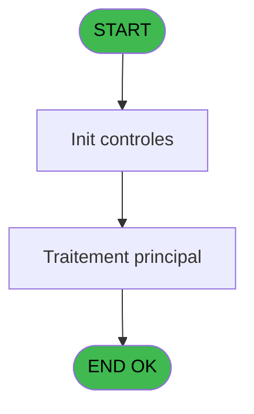

# PBG IDE 242 - Verification et Analyse

> **Analyse**: Phases 1-4 2026-02-03 10:29 -> 10:29 (25s) | Assemblage 10:29
> **Pipeline**: V7.2 Enrichi
> **Structure**: 4 onglets (Resume | Ecrans | Donnees | Connexions)

<!-- TAB:Resume -->

## 1. FICHE D'IDENTITE

| Attribut | Valeur |
|----------|--------|
| Projet | PBG |
| IDE Position | 242 |
| Nom Programme | Verification et Analyse |
| Fichier source | `Prg_242.xml` |
| Domaine metier | General |
| Taches | 8 (0 ecrans visibles) |
| Tables modifiees | 0 |
| Programmes appeles | 0 |

## 2. DESCRIPTION FONCTIONNELLE

**Verification et Analyse** assure la gestion complete de ce processus, accessible depuis [Traitement des arrivants (IDE 206)](PBG-IDE-206.md).

Le flux de traitement s'organise en **3 blocs fonctionnels** :

- **Traitement** (5 taches) : traitements metier divers
- **Calcul** (2 taches) : calculs de montants, stocks ou compteurs
- **Validation** (1 tache) : controles et verifications de coherence

Detail : phases du traitement

#### Phase 1 : Validation (1 tache)

- **242** - Verification et Analyse new **

#### Phase 2 : Traitement (5 taches)

- **242.1** - Chemin de Commande
- **242.2** - Determination Suite
- **242.2.1** - Dernier N° Import
- **242.3.1** - Lecture IDE
- **242.3.2** - Lecture FRA

#### Phase 3 : Calcul (2 taches)

- **242.3** - Calcul equilibre
- **242.2.2** - calcul nb lignes fichier

## 3. BLOCS FONCTIONNELS

### 3.1 Validation (1 tache)

Controles de coherence : 1 tache verifie les donnees et conditions.

---

#### 242 - Verification et Analyse new **

**Role** : Verification : Verification et Analyse new **.

### 3.2 Traitement (5 taches)

Traitements internes.

---

#### 242.1 - Chemin de Commande

**Role** : Traitement : Chemin de Commande.
**Variables liees** : V (W0-Ligne Commande), X (W0-Chemin IDE), Y (W0-Chemin FRA), Z (W0-Chemin ANN)

---

#### 242.2 - Determination Suite

**Role** : Traitement : Determination Suite.
**Variables liees** : E (P0-Accord Suite)

---

#### 242.2.1 - Dernier N° Import

**Role** : Traitement : Dernier N° Import.
**Variables liees** : F (P0-Numero Import)

---

#### 242.3.1 - Lecture IDE

**Role** : Traitement : Lecture IDE.
**Variables liees** : W (W0-Ligne Lecture)

---

#### 242.3.2 - Lecture FRA

**Role** : Traitement : Lecture FRA.
**Variables liees** : W (W0-Ligne Lecture)

### 3.3 Calcul (2 taches)

Calculs metier : montants, stocks, compteurs.

---

#### 242.3 - Calcul equilibre

**Role** : Calcul : Calcul equilibre.
**Variables liees** : N (W0-Equilibre)

---

#### 242.2.2 - calcul nb lignes fichier

**Role** : Calcul : calcul nb lignes fichier.

## 5. REGLES METIER

*(Aucune regle metier identifiee)*

## 6. CONTEXTE

- **Appele par**: [Traitement des arrivants (IDE 206)](PBG-IDE-206.md)
- **Appelle**: 0 programmes | **Tables**: 2 (W:0 R:2 L:0) | **Taches**: 8 | **Expressions**: 5

<!-- TAB:Ecrans -->

## 8. ECRANS

*(Programme sans ecran visible)*

## 9. NAVIGATION

### 9.3 Structure hierarchique (8 taches)

| Position | Tache | Type | Dimensions | Bloc |
|----------|-------|------|------------|------|
| **242.1** | [**Verification et Analyse new **** (242)](#t1) | MDI | - | Validation |
| **242.2** | [**Chemin de Commande** (242.1)](#t2) | MDI | - | Traitement |
| 242.2.1 | [Determination Suite (242.2)](#t4) | MDI | - | |
| 242.2.2 | [Dernier N° Import (242.2.1)](#t5) | MDI | - | |
| 242.2.3 | [Lecture IDE (242.3.1)](#t7) | MDI | - | |
| 242.2.4 | [Lecture FRA (242.3.2)](#t8) | MDI | - | |
| **242.3** | [**Calcul equilibre** (242.3)](#t6) | MDI | - | Calcul |
| 242.3.1 | [calcul nb lignes fichier (242.2.2)](#t9) | - | - | |

### 9.4 Algorigramme

> **Legende**: Vert = START/END OK | Rouge = END KO | Bleu = Decisions
> *Algorigramme auto-genere. Utiliser `/algorigramme` pour une synthese metier detaillee.*

<!-- TAB:Donnees -->

## 10. TABLES

### Tables utilisees (2)

| ID | Nom | Description | Type | R | W | L | Usages |
|----|-----|-------------|------|---|---|---|--------|
| 118 | tables_imports |  | DB | R |   |   | 1 |
| 129 | fichier_statistiques |  | DB | R |   |   | 2 |

### Colonnes par table (1 / 2 tables avec colonnes identifiees)

Table 118 - tables_imports (R) - 1 usages

*Table utilisee uniquement en Link ou aucune colonne Real identifiee dans le DataView.*

Table 129 - fichier_statistiques (R) - 2 usages

| Lettre | Variable | Acces | Type |
|--------|----------|-------|------|
| A | P.Fichier | R | Alpha |
| C | V.Ligne fichier | R | Alpha |

## 11. VARIABLES

### 11.1 Autres (30)

Variables diverses.

| Lettre | Nom | Type | Usage dans |
|--------|-----|------|-----------|
| A | P0-Lieu de Sejour | Alpha | - |
| B | P0-Nb Arrivants | Numeric | - |
| C | P0-Nb Ressources | Numeric | 1x refs |
| D | P0-Nb ANN | Numeric | 1x refs |
| E | P0-Accord Suite | Alpha | [242.2](#t4) |
| F | P0-Numero Import | Numeric | - |
| G | P0-Octets IDE | Numeric | - |
| H | P0-Octets FRA | Numeric | - |
| I | P0-Date IDE | Date | - |
| J | P0-Date FRA | Date | - |
| K | W0-Presence IDE | Alpha | - |
| L | W0-Presence FRA | Alpha | - |
| M | W0-Presence ANN | Alpha | - |
| N | W0-Equilibre | Alpha | - |
| O | W0-Nb Arrivants | Numeric | - |
| P | W0-Nb Ressources | Numeric | - |
| Q | W0-Octets IDE | Numeric | - |
| R | W0-Octets FRA | Numeric | - |
| S | W0-Date IDE | Date | - |
| T | W0-Date FRA | Date | - |
| U | W0-Date ANN | Date | - |
| V | W0-Ligne Commande | Alpha | - |
| W | W0-Ligne Lecture | Alpha | - |
| X | W0-Chemin IDE | Alpha | - |
| Y | W0-Chemin FRA | Alpha | - |
| Z | W0-Chemin ANN | Alpha | - |
| BA | W0-Nbre IDE | Numeric | - |
| BB | W0-Nbre IDE Last Record | Numeric | - |
| BC | W0-Nbre FRA | Numeric | - |
| BD | W0-Nb ANN | Numeric | - |

Toutes les 30 variables (liste complete)

| Cat | Lettre | Nom Variable | Type |
|-----|--------|--------------|------|
| Autre | **A** | P0-Lieu de Sejour | Alpha |
| Autre | **B** | P0-Nb Arrivants | Numeric |
| Autre | **C** | P0-Nb Ressources | Numeric |
| Autre | **D** | P0-Nb ANN | Numeric |
| Autre | **E** | P0-Accord Suite | Alpha |
| Autre | **F** | P0-Numero Import | Numeric |
| Autre | **G** | P0-Octets IDE | Numeric |
| Autre | **H** | P0-Octets FRA | Numeric |
| Autre | **I** | P0-Date IDE | Date |
| Autre | **J** | P0-Date FRA | Date |
| Autre | **K** | W0-Presence IDE | Alpha |
| Autre | **L** | W0-Presence FRA | Alpha |
| Autre | **M** | W0-Presence ANN | Alpha |
| Autre | **N** | W0-Equilibre | Alpha |
| Autre | **O** | W0-Nb Arrivants | Numeric |
| Autre | **P** | W0-Nb Ressources | Numeric |
| Autre | **Q** | W0-Octets IDE | Numeric |
| Autre | **R** | W0-Octets FRA | Numeric |
| Autre | **S** | W0-Date IDE | Date |
| Autre | **T** | W0-Date FRA | Date |
| Autre | **U** | W0-Date ANN | Date |
| Autre | **V** | W0-Ligne Commande | Alpha |
| Autre | **W** | W0-Ligne Lecture | Alpha |
| Autre | **X** | W0-Chemin IDE | Alpha |
| Autre | **Y** | W0-Chemin FRA | Alpha |
| Autre | **Z** | W0-Chemin ANN | Alpha |
| Autre | **BA** | W0-Nbre IDE | Numeric |
| Autre | **BB** | W0-Nbre IDE Last Record | Numeric |
| Autre | **BC** | W0-Nbre FRA | Numeric |
| Autre | **BD** | W0-Nb ANN | Numeric |

## 12. EXPRESSIONS

**5 / 5 expressions decodees (100%)**

### 12.1 Repartition par type

| Type | Expressions | Regles |
|------|-------------|--------|
| CONSTANTE | 1 | 0 |
| OTHER | 1 | 0 |
| STRING | 3 | 0 |

### 12.2 Expressions cles par type

#### CONSTANTE (1 expressions)

| Type | IDE | Expression | Regle |
|------|-----|------------|-------|
| CONSTANTE | 1 | `'O'` | - |

#### OTHER (1 expressions)

| Type | IDE | Expression | Regle |
|------|-----|------------|-------|
| OTHER | 2 | `{1,1}` | - |

#### STRING (3 expressions)

| Type | IDE | Expression | Regle |
|------|-----|------------|-------|
| STRING | 5 | `Translate('%club_import%')&Trim (P0-Accord Suite [E])` | - |
| STRING | 4 | `Translate('%club_import%')&Trim (P0-Nb ANN [D])` | - |
| STRING | 3 | `Translate('%club_import%')&Trim (P0-Nb Ressources [C])` | - |

<!-- TAB:Connexions -->

## 13. GRAPHE D'APPELS

### 13.1 Chaine depuis Main (Callers)

Main -> ... -> [Traitement des arrivants (IDE 206)](PBG-IDE-206.md) -> **Verification et Analyse (IDE 242)**

### 13.2 Callers

| IDE | Nom Programme | Nb Appels |
|-----|---------------|-----------|
| [206](PBG-IDE-206.md) | Traitement des arrivants | 1 |

### 13.3 Callees (programmes appeles)

### 13.4 Detail Callees avec contexte

| IDE | Nom Programme | Appels | Contexte |
|-----|---------------|--------|----------|
| - | (aucun) | - | - |

## 14. RECOMMANDATIONS MIGRATION

### 14.1 Profil du programme

| Metrique | Valeur | Impact migration |
|----------|--------|-----------------|
| Lignes de logique | 139 | Programme compact |
| Expressions | 5 | Peu de logique |
| Tables WRITE | 0 | Impact faible |
| Sous-programmes | 0 | Peu de dependances |
| Ecrans visibles | 0 | Ecran unique ou traitement batch |
| Code desactive | 0% (0 / 139) | Code sain |
| Regles metier | 0 | Pas de regle identifiee |

### 14.2 Plan de migration par bloc

#### Validation (1 tache: 0 ecran, 1 traitement)

- **Strategie** : FluentValidation avec validators specifiques.
- Chaque tache de validation -> un validator injectable

#### Traitement (5 taches: 0 ecran, 5 traitements)

- **Strategie** : 5 service(s) backend injectable(s) (Domain Services).
- Decomposer les taches en services unitaires testables.

#### Calcul (2 taches: 0 ecran, 2 traitements)

- **Strategie** : Services de calcul purs (Domain Services).
- Migrer la logique de calcul (stock, compteurs, montants)

### 14.3 Dependances critiques

| Dependance | Type | Appels | Impact |
|------------|------|--------|--------|

---
*Spec DETAILED generee par Pipeline V7.2 - 2026-02-03 10:29*
