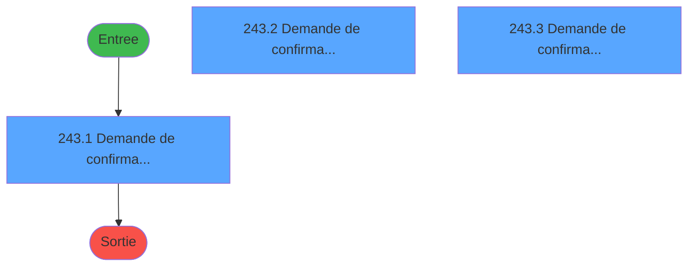
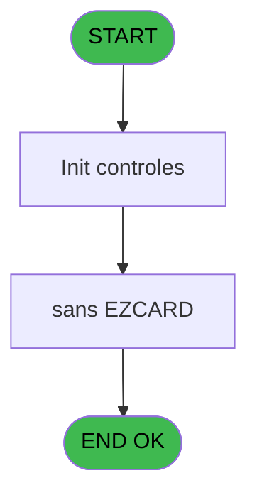
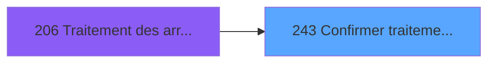
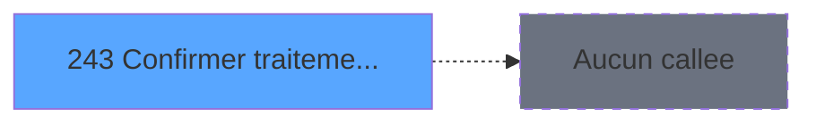

# PBG IDE 243 - Confirmer traitement arrivants

> **Analyse**: Phases 1-4 2026-02-03 10:29 -> 10:30 (25s) | Assemblage 10:30
> **Pipeline**: V7.2 Enrichi
> **Structure**: 4 onglets (Resume | Ecrans | Donnees | Connexions)

<!-- TAB:Resume -->

## 1. FICHE D'IDENTITE

| Attribut | Valeur |
|----------|--------|
| Projet | PBG |
| IDE Position | 243 |
| Nom Programme | Confirmer traitement arrivants |
| Fichier source | `Prg_243.xml` |
| Domaine metier | General |
| Taches | 4 (3 ecrans visibles) |
| Tables modifiees | 0 |
| Programmes appeles | 0 |

## 2. DESCRIPTION FONCTIONNELLE

**Confirmer traitement arrivants** assure la gestion complete de ce processus, accessible depuis [Traitement des arrivants (IDE 206)](PBG-IDE-206.md).

Le flux de traitement s'organise en **1 blocs fonctionnels** :

- **Traitement** (4 taches) : traitements metier divers

Detail : phases du traitement

#### Phase 1 : Traitement (4 taches)

- **243** - Confirmer traitement arrivants **[[ECRAN]](#ecran-t1)**
- **243.1** - Demande de confirmation **[[ECRAN]](#ecran-t2)**
- **243.2** - Demande de confirmation **[[ECRAN]](#ecran-t3)**
- **243.3** - Demande de confirmation **[[ECRAN]](#ecran-t4)**

## 3. BLOCS FONCTIONNELS

### 3.1 Traitement (4 taches)

Traitements internes.

---

#### 243 - Confirmer traitement arrivants [[ECRAN]](#ecran-t1)

**Role** : Traitement : Confirmer traitement arrivants.
**Ecran** : 458 x 121 DLU (MDI) | [Voir mockup](#ecran-t1)

3 sous-taches directes

| Tache | Nom | Bloc |
|-------|-----|------|
| [243.1](#t2) | Demande de confirmation **[[ECRAN]](#ecran-t2)** | Traitement |
| [243.2](#t3) | Demande de confirmation **[[ECRAN]](#ecran-t3)** | Traitement |
| [243.3](#t4) | Demande de confirmation **[[ECRAN]](#ecran-t4)** | Traitement |

---

#### 243.1 - Demande de confirmation [[ECRAN]](#ecran-t2)

**Role** : Traitement : Demande de confirmation.
**Ecran** : 458 x 65 DLU (MDI) | [Voir mockup](#ecran-t2)

---

#### 243.2 - Demande de confirmation [[ECRAN]](#ecran-t3)

**Role** : Traitement : Demande de confirmation.
**Ecran** : 458 x 89 DLU (MDI) | [Voir mockup](#ecran-t3)

---

#### 243.3 - Demande de confirmation [[ECRAN]](#ecran-t4)

**Role** : Traitement : Demande de confirmation.
**Ecran** : 458 x 121 DLU (MDI) | [Voir mockup](#ecran-t4)

## 5. REGLES METIER

*(Aucune regle metier identifiee)*

## 6. CONTEXTE

- **Appele par**: [Traitement des arrivants (IDE 206)](PBG-IDE-206.md)
- **Appelle**: 0 programmes | **Tables**: 0 (W:0 R:0 L:0) | **Taches**: 4 | **Expressions**: 3

<!-- TAB:Ecrans -->

## 8. ECRANS

### 8.1 Forms visibles (3 / 4)

| # | Position | Tache | Nom | Type | Largeur | Hauteur | Bloc |
|---|----------|-------|-----|------|---------|---------|------|
| 1 | 243.1 | 243.1 | Demande de confirmation | MDI | 458 | 65 | Traitement |
| 2 | 243.2 | 243.2 | Demande de confirmation | MDI | 458 | 89 | Traitement |
| 3 | 243.3 | 243.3 | Demande de confirmation | MDI | 458 | 121 | Traitement |

### 8.2 Mockups Ecrans

---

#### 243.1 - Demande de confirmation
**Tache** : [243.1](#t2) | **Type** : MDI | **Dimensions** : 458 x 65 DLU
**Bloc** : Traitement | **Titre IDE** : Demande de confirmation

<!-- FORM-DATA:
{
    "width":  458,
    "vFactor":  8,
    "type":  "MDI",
    "hFactor":  8,
    "controls":  [
                     {
                         "x":  0,
                         "type":  "label",
                         "var":  "",
                         "y":  1,
                         "w":  458,
                         "fmt":  "",
                         "name":  "",
                         "h":  34,
                         "color":  "",
                         "text":  "",
                         "parent":  null
                     },
                     {
                         "x":  1,
                         "type":  "label",
                         "var":  "",
                         "y":  37,
                         "w":  454,
                         "fmt":  "",
                         "name":  "",
                         "h":  25,
                         "color":  "1",
                         "text":  "",
                         "parent":  null
                     },
                     {
                         "x":  108,
                         "type":  "edit",
                         "var":  "",
                         "y":  4,
                         "w":  326,
                         "fmt":  "",
                         "name":  "",
                         "h":  26,
                         "color":  "7",
                         "text":  "",
                         "parent":  null
                     },
                     {
                         "x":  40,
                         "type":  "button",
                         "var":  "",
                         "y":  41,
                         "w":  154,
                         "fmt":  "",
                         "name":  "Bouton Ok",
                         "h":  18,
                         "color":  "",
                         "text":  "",
                         "parent":  null
                     },
                     {
                         "x":  261,
                         "type":  "button",
                         "var":  "",
                         "y":  41,
                         "w":  154,
                         "fmt":  "",
                         "name":  "Bouton Quitter",
                         "h":  18,
                         "color":  "",
                         "text":  "",
                         "parent":  null
                     },
                     {
                         "x":  6,
                         "type":  "image",
                         "var":  "",
                         "y":  4,
                         "w":  73,
                         "fmt":  "",
                         "name":  "",
                         "h":  26,
                         "color":  "",
                         "text":  "",
                         "parent":  null
                     }
                 ],
    "taskId":  "243.1",
    "height":  65
}
-->

<strong>Champs : 1 champs</strong>

| Pos (x,y) | Nom | Variable | Type |
|-----------|-----|----------|------|
| 108,4 | (sans nom) | - | edit |

<strong>Boutons : 2 boutons</strong>

| Bouton | Pos (x,y) | Action |
|--------|-----------|--------|
| Ok | 40,41 | Valide la saisie et enregistre |
| Quitter | 261,41 | Quitte le programme |

---

#### 243.2 - Demande de confirmation
**Tache** : [243.2](#t3) | **Type** : MDI | **Dimensions** : 458 x 89 DLU
**Bloc** : Traitement | **Titre IDE** : Demande de confirmation

<!-- FORM-DATA:
{
    "width":  458,
    "vFactor":  8,
    "type":  "MDI",
    "hFactor":  8,
    "controls":  [
                     {
                         "x":  0,
                         "type":  "label",
                         "var":  "",
                         "y":  1,
                         "w":  458,
                         "fmt":  "",
                         "name":  "",
                         "h":  60,
                         "color":  "",
                         "text":  "",
                         "parent":  null
                     },
                     {
                         "x":  1,
                         "type":  "label",
                         "var":  "",
                         "y":  62,
                         "w":  454,
                         "fmt":  "",
                         "name":  "",
                         "h":  25,
                         "color":  "1",
                         "text":  "",
                         "parent":  null
                     },
                     {
                         "x":  108,
                         "type":  "edit",
                         "var":  "",
                         "y":  4,
                         "w":  326,
                         "fmt":  "",
                         "name":  "",
                         "h":  26,
                         "color":  "7",
                         "text":  "",
                         "parent":  null
                     },
                     {
                         "x":  109,
                         "type":  "edit",
                         "var":  "",
                         "y":  33,
                         "w":  326,
                         "fmt":  "",
                         "name":  "",
                         "h":  26,
                         "color":  "7",
                         "text":  "",
                         "parent":  null
                     },
                     {
                         "x":  40,
                         "type":  "button",
                         "var":  "",
                         "y":  66,
                         "w":  154,
                         "fmt":  "",
                         "name":  "Bouton Ok",
                         "h":  18,
                         "color":  "",
                         "text":  "",
                         "parent":  null
                     },
                     {
                         "x":  261,
                         "type":  "button",
                         "var":  "",
                         "y":  66,
                         "w":  154,
                         "fmt":  "",
                         "name":  "Bouton Quitter",
                         "h":  18,
                         "color":  "",
                         "text":  "",
                         "parent":  null
                     },
                     {
                         "x":  6,
                         "type":  "image",
                         "var":  "",
                         "y":  4,
                         "w":  73,
                         "fmt":  "",
                         "name":  "",
                         "h":  26,
                         "color":  "",
                         "text":  "",
                         "parent":  null
                     }
                 ],
    "taskId":  "243.2",
    "height":  89
}
-->

<strong>Champs : 2 champs</strong>

| Pos (x,y) | Nom | Variable | Type |
|-----------|-----|----------|------|
| 108,4 | (sans nom) | - | edit |
| 109,33 | (sans nom) | - | edit |

<strong>Boutons : 2 boutons</strong>

| Bouton | Pos (x,y) | Action |
|--------|-----------|--------|
| Ok | 40,66 | Valide la saisie et enregistre |
| Quitter | 261,66 | Quitte le programme |

---

#### 243.3 - Demande de confirmation
**Tache** : [243.3](#t4) | **Type** : MDI | **Dimensions** : 458 x 121 DLU
**Bloc** : Traitement | **Titre IDE** : Demande de confirmation

<!-- FORM-DATA:
{
    "width":  458,
    "vFactor":  8,
    "type":  "MDI",
    "hFactor":  8,
    "controls":  [
                     {
                         "x":  0,
                         "type":  "label",
                         "var":  "",
                         "y":  1,
                         "w":  458,
                         "fmt":  "",
                         "name":  "",
                         "h":  90,
                         "color":  "",
                         "text":  "",
                         "parent":  null
                     },
                     {
                         "x":  1,
                         "type":  "label",
                         "var":  "",
                         "y":  94,
                         "w":  454,
                         "fmt":  "",
                         "name":  "",
                         "h":  25,
                         "color":  "1",
                         "text":  "",
                         "parent":  null
                     },
                     {
                         "x":  108,
                         "type":  "edit",
                         "var":  "",
                         "y":  4,
                         "w":  326,
                         "fmt":  "",
                         "name":  "",
                         "h":  26,
                         "color":  "7",
                         "text":  "",
                         "parent":  null
                     },
                     {
                         "x":  109,
                         "type":  "edit",
                         "var":  "",
                         "y":  33,
                         "w":  326,
                         "fmt":  "",
                         "name":  "",
                         "h":  26,
                         "color":  "7",
                         "text":  "",
                         "parent":  null
                     },
                     {
                         "x":  109,
                         "type":  "edit",
                         "var":  "",
                         "y":  62,
                         "w":  326,
                         "fmt":  "",
                         "name":  "",
                         "h":  26,
                         "color":  "7",
                         "text":  "",
                         "parent":  null
                     },
                     {
                         "x":  40,
                         "type":  "button",
                         "var":  "",
                         "y":  98,
                         "w":  154,
                         "fmt":  "",
                         "name":  "Bouton Ok",
                         "h":  18,
                         "color":  "",
                         "text":  "",
                         "parent":  null
                     },
                     {
                         "x":  261,
                         "type":  "button",
                         "var":  "",
                         "y":  98,
                         "w":  154,
                         "fmt":  "",
                         "name":  "Bouton Quitter",
                         "h":  18,
                         "color":  "",
                         "text":  "",
                         "parent":  null
                     },
                     {
                         "x":  6,
                         "type":  "image",
                         "var":  "",
                         "y":  4,
                         "w":  73,
                         "fmt":  "",
                         "name":  "",
                         "h":  26,
                         "color":  "",
                         "text":  "",
                         "parent":  null
                     }
                 ],
    "taskId":  "243.3",
    "height":  121
}
-->

<strong>Champs : 3 champs</strong>

| Pos (x,y) | Nom | Variable | Type |
|-----------|-----|----------|------|
| 108,4 | (sans nom) | - | edit |
| 109,33 | (sans nom) | - | edit |
| 109,62 | (sans nom) | - | edit |

<strong>Boutons : 2 boutons</strong>

| Bouton | Pos (x,y) | Action |
|--------|-----------|--------|
| Ok | 40,98 | Valide la saisie et enregistre |
| Quitter | 261,98 | Quitte le programme |

## 9. NAVIGATION

### 9.1 Enchainement des ecrans

**Detail par enchainement :**

| Depuis | Action | Vers | Retour |
|--------|--------|------|--------|

### 9.3 Structure hierarchique (4 taches)

| Position | Tache | Type | Dimensions | Bloc |
|----------|-------|------|------------|------|
| **243.1** | [**Confirmer traitement arrivants** (243)](#t1) [mockup](#ecran-t1) | MDI | 458x121 | Traitement |
| 243.1.1 | [Demande de confirmation (243.1)](#t2) [mockup](#ecran-t2) | MDI | 458x65 | |
| 243.1.2 | [Demande de confirmation (243.2)](#t3) [mockup](#ecran-t3) | MDI | 458x89 | |
| 243.1.3 | [Demande de confirmation (243.3)](#t4) [mockup](#ecran-t4) | MDI | 458x121 | |

### 9.4 Algorigramme

> **Legende**: Vert = START/END OK | Rouge = END KO | Bleu = Decisions
> *Algorigramme auto-genere. Utiliser `/algorigramme` pour une synthese metier detaillee.*

<!-- TAB:Donnees -->

## 10. TABLES

### Tables utilisees (0)

| ID | Nom | Description | Type | R | W | L | Usages |
|----|-----|-------------|------|---|---|---|--------|

### Colonnes par table (0 / 0 tables avec colonnes identifiees)

## 11. VARIABLES

### 11.1 Autres (7)

Variables diverses.

| Lettre | Nom | Type | Usage dans |
|--------|-----|------|-----------|
| A | Param In cas numero | Numeric | 3x refs |
| B | Param In message 1 | Alpha | - |
| C | Param In message 2 | Alpha | - |
| D | Param In message 3 | Alpha | - |
| E | Param Out Reponse | Logical | - |
| F | Bouton Ok | Alpha | - |
| G | Bouton Quitter | Alpha | - |

## 12. EXPRESSIONS

**3 / 3 expressions decodees (100%)**

### 12.1 Repartition par type

| Type | Expressions | Regles |
|------|-------------|--------|
| CONDITION | 3 | 0 |

### 12.2 Expressions cles par type

#### CONDITION (3 expressions)

| Type | IDE | Expression | Regle |
|------|-----|------------|-------|
| CONDITION | 3 | `Param In cas numero [A]=3` | - |
| CONDITION | 2 | `Param In cas numero [A]=2` | - |
| CONDITION | 1 | `Param In cas numero [A]=1` | - |

<!-- TAB:Connexions -->

## 13. GRAPHE D'APPELS

### 13.1 Chaine depuis Main (Callers)

Main -> ... -> [Traitement des arrivants (IDE 206)](PBG-IDE-206.md) -> **Confirmer traitement arrivants (IDE 243)**

### 13.2 Callers

| IDE | Nom Programme | Nb Appels |
|-----|---------------|-----------|
| [206](PBG-IDE-206.md) | Traitement des arrivants | 3 |

### 13.3 Callees (programmes appeles)

### 13.4 Detail Callees avec contexte

| IDE | Nom Programme | Appels | Contexte |
|-----|---------------|--------|----------|
| - | (aucun) | - | - |

## 14. RECOMMANDATIONS MIGRATION

### 14.1 Profil du programme

| Metrique | Valeur | Impact migration |
|----------|--------|-----------------|
| Lignes de logique | 66 | Programme compact |
| Expressions | 3 | Peu de logique |
| Tables WRITE | 0 | Impact faible |
| Sous-programmes | 0 | Peu de dependances |
| Ecrans visibles | 3 | Quelques ecrans |
| Code desactive | 0% (0 / 66) | Code sain |
| Regles metier | 0 | Pas de regle identifiee |

### 14.2 Plan de migration par bloc

#### Traitement (4 taches: 4 ecrans, 0 traitement)

- **Strategie** : 4 composant(s) UI (Razor/React) avec formulaires et validation.
- Decomposer les taches en services unitaires testables.

### 14.3 Dependances critiques

| Dependance | Type | Appels | Impact |
|------------|------|--------|--------|

---
*Spec DETAILED generee par Pipeline V7.2 - 2026-02-03 10:30*
