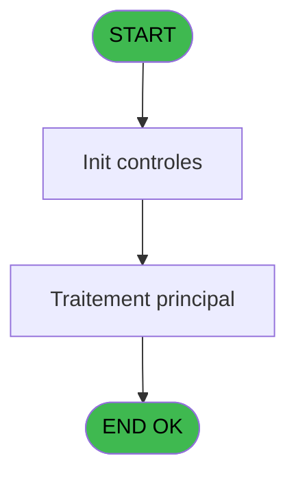
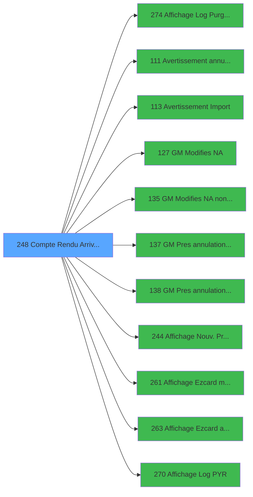

# PBG IDE 248 - Compte Rendu Arrivants

> **Analyse**: Phases 1-4 2026-02-03 10:33 -> 10:33 (26s) | Assemblage 10:33
> **Pipeline**: V7.2 Enrichi
> **Structure**: 4 onglets (Resume | Ecrans | Donnees | Connexions)

<!-- TAB:Resume -->

## 1. FICHE D'IDENTITE

| Attribut | Valeur |
|----------|--------|
| Projet | PBG |
| IDE Position | 248 |
| Nom Programme | Compte Rendu Arrivants |
| Fichier source | `Prg_248.xml` |
| Domaine metier | Comptabilite |
| Taches | 2 (1 ecrans visibles) |
| Tables modifiees | 0 |
| Programmes appeles | 11 |

## 2. DESCRIPTION FONCTIONNELLE

**Compte Rendu Arrivants** assure la gestion complete de ce processus, accessible depuis [Traitement des arrivants (IDE 206)](PBG-IDE-206.md).

Le flux de traitement s'organise en **2 blocs fonctionnels** :

- **Consultation** (1 tache) : ecrans de recherche, selection et consultation
- **Calcul** (1 tache) : calculs de montants, stocks ou compteurs

**Logique metier** : 15 regles identifiees couvrant conditions metier.

Detail : phases du traitement

#### Phase 1 : Calcul (1 tache)

- **248** - Compte Rendu Arrivants **[[ECRAN]](#ecran-t2)**

#### Phase 2 : Consultation (1 tache)

- **248.1** - Affichages

Delegue a : [Affichage Log Purge Unit (IDE 274)](PBG-IDE-274.md), [Affichage Nouv. Prestations (IDE 244)](PBG-IDE-244.md), [Affichage Ezcard modifiees (IDE 261)](PBG-IDE-261.md), [Affichage Ezcard annulees (IDE 263)](PBG-IDE-263.md), [Affichage Log PYR (IDE 270)](PBG-IDE-270.md)

## 3. BLOCS FONCTIONNELS

### 3.1 Calcul (1 tache)

Calculs metier : montants, stocks, compteurs.

---

#### 248 - Compte Rendu Arrivants [[ECRAN]](#ecran-t2)

**Role** : Traitement : Compte Rendu Arrivants.
**Ecran** : 1006 x 264 DLU (MDI) | [Voir mockup](#ecran-t2)

### 3.2 Consultation (1 tache)

Ecrans de recherche et consultation.

---

#### 248.1 - Affichages

**Role** : Reinitialisation : Affichages.
**Delegue a** : [Affichage Log Purge Unit (IDE 274)](PBG-IDE-274.md), [Affichage Nouv. Prestations (IDE 244)](PBG-IDE-244.md), [Affichage Ezcard modifiees (IDE 261)](PBG-IDE-261.md)

## 5. REGLES METIER

15 regles identifiees:

### Autres (15 regles)

#### [RM-001] Si [D] alors MlsTrans ('OUI') sinon MlsTrans ('NON'))

| Element | Detail |
|---------|--------|
| **Condition** | `[D]` |
| **Si vrai** | MlsTrans ('OUI') |
| **Si faux** | MlsTrans ('NON')) |
| **Expression source** | Expression 9 : `IF ([D],MlsTrans ('OUI'),MlsTrans ('NON'))` |
| **Exemple** | Si [D] → MlsTrans ('OUI'). Sinon → MlsTrans ('NON')) |

#### [RM-002] Si [F] alors MlsTrans ('OUI') sinon MlsTrans ('NON'))

| Element | Detail |
|---------|--------|
| **Condition** | `[F]` |
| **Si vrai** | MlsTrans ('OUI') |
| **Si faux** | MlsTrans ('NON')) |
| **Expression source** | Expression 11 : `IF ([F],MlsTrans ('OUI'),MlsTrans ('NON'))` |
| **Exemple** | Si [F] → MlsTrans ('OUI'). Sinon → MlsTrans ('NON')) |

#### [RM-003] Si [H] alors MlsTrans ('OUI') sinon MlsTrans ('NON'))

| Element | Detail |
|---------|--------|
| **Condition** | `[H]` |
| **Si vrai** | MlsTrans ('OUI') |
| **Si faux** | MlsTrans ('NON')) |
| **Expression source** | Expression 13 : `IF ([H],MlsTrans ('OUI'),MlsTrans ('NON'))` |
| **Exemple** | Si [H] → MlsTrans ('OUI'). Sinon → MlsTrans ('NON')) |

#### [RM-004] Si [J] alors MlsTrans ('OUI') sinon MlsTrans ('NON'))

| Element | Detail |
|---------|--------|
| **Condition** | `[J]` |
| **Si vrai** | MlsTrans ('OUI') |
| **Si faux** | MlsTrans ('NON')) |
| **Expression source** | Expression 15 : `IF ([J],MlsTrans ('OUI'),MlsTrans ('NON'))` |
| **Exemple** | Si [J] → MlsTrans ('OUI'). Sinon → MlsTrans ('NON')) |

#### [RM-005] Si [L] alors MlsTrans ('OUI') sinon MlsTrans ('NON'))

| Element | Detail |
|---------|--------|
| **Condition** | `[L]` |
| **Si vrai** | MlsTrans ('OUI') |
| **Si faux** | MlsTrans ('NON')) |
| **Expression source** | Expression 17 : `IF ([L],MlsTrans ('OUI'),MlsTrans ('NON'))` |
| **Exemple** | Si [L] → MlsTrans ('OUI'). Sinon → MlsTrans ('NON')) |

#### [RM-006] Si [N] alors MlsTrans ('OUI') sinon MlsTrans ('NON'))

| Element | Detail |
|---------|--------|
| **Condition** | `[N]` |
| **Si vrai** | MlsTrans ('OUI') |
| **Si faux** | MlsTrans ('NON')) |
| **Expression source** | Expression 19 : `IF ([N],MlsTrans ('OUI'),MlsTrans ('NON'))` |
| **Exemple** | Si [N] → MlsTrans ('OUI'). Sinon → MlsTrans ('NON')) |

#### [RM-007] Si [P] alors MlsTrans ('OUI') sinon MlsTrans ('NON'))

| Element | Detail |
|---------|--------|
| **Condition** | `[P]` |
| **Si vrai** | MlsTrans ('OUI') |
| **Si faux** | MlsTrans ('NON')) |
| **Expression source** | Expression 21 : `IF ([P],MlsTrans ('OUI'),MlsTrans ('NON'))` |
| **Exemple** | Si [P] → MlsTrans ('OUI'). Sinon → MlsTrans ('NON')) |

#### [RM-008] Si [R] alors MlsTrans ('OUI') sinon MlsTrans ('NON'))

| Element | Detail |
|---------|--------|
| **Condition** | `[R]` |
| **Si vrai** | MlsTrans ('OUI') |
| **Si faux** | MlsTrans ('NON')) |
| **Expression source** | Expression 23 : `IF ([R],MlsTrans ('OUI'),MlsTrans ('NON'))` |
| **Exemple** | Si [R] → MlsTrans ('OUI'). Sinon → MlsTrans ('NON')) |

#### [RM-009] Si [T] alors MlsTrans ('OUI') sinon MlsTrans ('NON'))

| Element | Detail |
|---------|--------|
| **Condition** | `[T]` |
| **Si vrai** | MlsTrans ('OUI') |
| **Si faux** | MlsTrans ('NON')) |
| **Expression source** | Expression 25 : `IF ([T],MlsTrans ('OUI'),MlsTrans ('NON'))` |
| **Exemple** | Si [T] → MlsTrans ('OUI'). Sinon → MlsTrans ('NON')) |

#### [RM-010] Si VG60>0 alors MlsTrans('OUI') sinon MlsTrans('NON'))

| Element | Detail |
|---------|--------|
| **Condition** | `VG60>0` |
| **Si vrai** | MlsTrans('OUI') |
| **Si faux** | MlsTrans('NON')) |
| **Expression source** | Expression 38 : `IF(VG60>0,MlsTrans('OUI'),MlsTrans('NON'))` |
| **Exemple** | Si VG60>0 → MlsTrans('OUI'). Sinon → MlsTrans('NON')) |

#### [RM-011] Si VG61>0 alors MlsTrans('OUI') sinon MlsTrans('NON'))

| Element | Detail |
|---------|--------|
| **Condition** | `VG61>0` |
| **Si vrai** | MlsTrans('OUI') |
| **Si faux** | MlsTrans('NON')) |
| **Expression source** | Expression 39 : `IF(VG61>0,MlsTrans('OUI'),MlsTrans('NON'))` |
| **Exemple** | Si VG61>0 → MlsTrans('OUI'). Sinon → MlsTrans('NON')) |

#### [RM-012] Si VG62>0 alors MlsTrans('OUI') sinon MlsTrans('NON'))

| Element | Detail |
|---------|--------|
| **Condition** | `VG62>0` |
| **Si vrai** | MlsTrans('OUI') |
| **Si faux** | MlsTrans('NON')) |
| **Expression source** | Expression 40 : `IF(VG62>0,MlsTrans('OUI'),MlsTrans('NON'))` |
| **Exemple** | Si VG62>0 → MlsTrans('OUI'). Sinon → MlsTrans('NON')) |

#### [RM-013] Si VG69>0 alors MlsTrans('OUI') sinon MlsTrans('NON'))

| Element | Detail |
|---------|--------|
| **Condition** | `VG69>0` |
| **Si vrai** | MlsTrans('OUI') |
| **Si faux** | MlsTrans('NON')) |
| **Expression source** | Expression 48 : `IF(VG69>0,MlsTrans('OUI'),MlsTrans('NON'))` |
| **Exemple** | Si VG69>0 → MlsTrans('OUI'). Sinon → MlsTrans('NON')) |

#### [RM-014] Si VG70>0 alors MlsTrans('OUI') sinon MlsTrans('NON'))

| Element | Detail |
|---------|--------|
| **Condition** | `VG70>0` |
| **Si vrai** | MlsTrans('OUI') |
| **Si faux** | MlsTrans('NON')) |
| **Expression source** | Expression 49 : `IF(VG70>0,MlsTrans('OUI'),MlsTrans('NON'))` |
| **Exemple** | Si VG70>0 → MlsTrans('OUI'). Sinon → MlsTrans('NON')) |

#### [RM-015] Si [BG] alors MlsTrans('OUI') sinon MlsTrans('NON'))

| Element | Detail |
|---------|--------|
| **Condition** | `[BG]` |
| **Si vrai** | MlsTrans('OUI') |
| **Si faux** | MlsTrans('NON')) |
| **Expression source** | Expression 54 : `IF([BG],MlsTrans('OUI'),MlsTrans('NON'))` |
| **Exemple** | Si [BG] → MlsTrans('OUI'). Sinon → MlsTrans('NON')) |

## 6. CONTEXTE

- **Appele par**: [Traitement des arrivants (IDE 206)](PBG-IDE-206.md)
- **Appelle**: 11 programmes | **Tables**: 2 (W:0 R:1 L:1) | **Taches**: 2 | **Expressions**: 56

<!-- TAB:Ecrans -->

## 8. ECRANS

### 8.1 Forms visibles (1 / 2)

| # | Position | Tache | Nom | Type | Largeur | Hauteur | Bloc |
|---|----------|-------|-----|------|---------|---------|------|
| 1 | 248.1 | 248 | Compte Rendu Arrivants | MDI | 1006 | 264 | Calcul |

### 8.2 Mockups Ecrans

---

#### 248.1 - Compte Rendu Arrivants
**Tache** : [248](#t2) | **Type** : MDI | **Dimensions** : 1006 x 264 DLU
**Bloc** : Calcul | **Titre IDE** : Compte Rendu Arrivants

<!-- FORM-DATA:
{
    "width":  1006,
    "vFactor":  8,
    "type":  "MDI",
    "hFactor":  8,
    "controls":  [
                     {
                         "x":  4,
                         "type":  "label",
                         "var":  "",
                         "y":  2,
                         "w":  992,
                         "fmt":  "",
                         "name":  "",
                         "h":  20,
                         "color":  "",
                         "text":  "",
                         "parent":  null
                     },
                     {
                         "x":  4,
                         "type":  "label",
                         "var":  "",
                         "y":  24,
                         "w":  484,
                         "fmt":  "",
                         "name":  "",
                         "h":  211,
                         "color":  "",
                         "text":  "",
                         "parent":  null
                     },
                     {
                         "x":  488,
                         "type":  "label",
                         "var":  "",
                         "y":  24,
                         "w":  508,
                         "fmt":  "",
                         "name":  "",
                         "h":  211,
                         "color":  "",
                         "text":  "",
                         "parent":  null
                     },
                     {
                         "x":  60,
                         "type":  "label",
                         "var":  "",
                         "y":  26,
                         "w":  130,
                         "fmt":  "",
                         "name":  "",
                         "h":  10,
                         "color":  "",
                         "text":  "Societe:",
                         "parent":  4
                     },
                     {
                         "x":  932,
                         "type":  "label",
                         "var":  "",
                         "y":  36,
                         "w":  20,
                         "fmt":  "",
                         "name":  "",
                         "h":  14,
                         "color":  "",
                         "text":  "ê",
                         "parent":  5
                     },
                     {
                         "x":  60,
                         "type":  "label",
                         "var":  "",
                         "y":  37,
                         "w":  130,
                         "fmt":  "",
                         "name":  "",
                         "h":  10,
                         "color":  "",
                         "text":  "Lieu Sejour:",
                         "parent":  4
                     },
                     {
                         "x":  704,
                         "type":  "label",
                         "var":  "",
                         "y":  38,
                         "w":  224,
                         "fmt":  "",
                         "name":  "",
                         "h":  10,
                         "color":  "",
                         "text":  "cliquer pour voir et imprimer",
                         "parent":  5
                     },
                     {
                         "x":  60,
                         "type":  "label",
                         "var":  "",
                         "y":  50,
                         "w":  130,
                         "fmt":  "",
                         "name":  "",
                         "h":  10,
                         "color":  "",
                         "text":  "Numero Import:",
                         "parent":  4
                     },
                     {
                         "x":  516,
                         "type":  "label",
                         "var":  "",
                         "y":  51,
                         "w":  261,
                         "fmt":  "",
                         "name":  "",
                         "h":  10,
                         "color":  "",
                         "text":  "Avertissement import",
                         "parent":  5
                     },
                     {
                         "x":  516,
                         "type":  "label",
                         "var":  "",
                         "y":  63,
                         "w":  261,
                         "fmt":  "",
                         "name":  "",
                         "h":  10,
                         "color":  "",
                         "text":  "Avertissement annulation",
                         "parent":  5
                     },
                     {
                         "x":  48,
                         "type":  "label",
                         "var":  "",
                         "y":  74,
                         "w":  308,
                         "fmt":  "",
                         "name":  "",
                         "h":  10,
                         "color":  "",
                         "text":  "Report des cartes des comptes modifies",
                         "parent":  4
                     },
                     {
                         "x":  516,
                         "type":  "label",
                         "var":  "",
                         "y":  75,
                         "w":  261,
                         "fmt":  "",
                         "name":  "",
                         "h":  10,
                         "color":  "",
                         "text":  "Avertissement modification",
                         "parent":  5
                     },
                     {
                         "x":  48,
                         "type":  "label",
                         "var":  "",
                         "y":  85,
                         "w":  308,
                         "fmt":  "",
                         "name":  "",
                         "h":  10,
                         "color":  "",
                         "text":  "Nombre arrivants",
                         "parent":  4
                     },
                     {
                         "x":  516,
                         "type":  "label",
                         "var":  "",
                         "y":  87,
                         "w":  261,
                         "fmt":  "",
                         "name":  "",
                         "h":  10,
                         "color":  "",
                         "text":  "GM Presents non traites",
                         "parent":  5
                     },
                     {
                         "x":  48,
                         "type":  "label",
                         "var":  "",
                         "y":  97,
                         "w":  308,
                         "fmt":  "",
                         "name":  "",
                         "h":  10,
                         "color":  "",
                         "text":  "Import complet",
                         "parent":  4
                     },
                     {
                         "x":  516,
                         "type":  "label",
                         "var":  "",
                         "y":  99,
                         "w":  261,
                         "fmt":  "",
                         "name":  "",
                         "h":  10,
                         "color":  "",
                         "text":  "GM Presents : traitement possible",
                         "parent":  5
                     },
                     {
                         "x":  48,
                         "type":  "label",
                         "var":  "",
                         "y":  109,
                         "w":  308,
                         "fmt":  "",
                         "name":  "",
                         "h":  10,
                         "color":  "",
                         "text":  "Temps de traitement",
                         "parent":  4
                     },
                     {
                         "x":  516,
                         "type":  "label",
                         "var":  "",
                         "y":  111,
                         "w":  261,
                         "fmt":  "",
                         "name":  "",
                         "h":  10,
                         "color":  "",
                         "text":  "Modification / NA non reportee",
                         "parent":  5
                     },
                     {
                         "x":  516,
                         "type":  "label",
                         "var":  "",
                         "y":  123,
                         "w":  261,
                         "fmt":  "",
                         "name":  "",
                         "h":  10,
                         "color":  "",
                         "text":  "Cartes annulees",
                         "parent":  5
                     },
                     {
                         "x":  516,
                         "type":  "label",
                         "var":  "",
                         "y":  135,
                         "w":  261,
                         "fmt":  "",
                         "name":  "",
                         "h":  10,
                         "color":  "",
                         "text":  "Cartes mises à jour",
                         "parent":  5
                     },
                     {
                         "x":  516,
                         "type":  "label",
                         "var":  "",
                         "y":  147,
                         "w":  261,
                         "fmt":  "",
                         "name":  "",
                         "h":  10,
                         "color":  "",
                         "text":  "Nouvelles prestations",
                         "parent":  5
                     },
                     {
                         "x":  4,
                         "type":  "label",
                         "var":  "",
                         "y":  242,
                         "w":  992,
                         "fmt":  "",
                         "name":  "",
                         "h":  20,
                         "color":  "",
                         "text":  "",
                         "parent":  null
                     },
                     {
                         "x":  516,
                         "type":  "label",
                         "var":  "",
                         "y":  159,
                         "w":  261,
                         "fmt":  "",
                         "name":  "",
                         "h":  10,
                         "color":  "",
                         "text":  "Souscriptions PYR",
                         "parent":  5
                     },
                     {
                         "x":  516,
                         "type":  "label",
                         "var":  "",
                         "y":  171,
                         "w":  261,
                         "fmt":  "",
                         "name":  "",
                         "h":  10,
                         "color":  "",
                         "text":  "Annulations PYR",
                         "parent":  5
                     },
                     {
                         "x":  516,
                         "type":  "label",
                         "var":  "",
                         "y":  183,
                         "w":  261,
                         "fmt":  "",
                         "name":  "",
                         "h":  10,
                         "color":  "",
                         "text":  "Modifications PYR",
                         "parent":  5
                     },
                     {
                         "x":  516,
                         "type":  "label",
                         "var":  "",
                         "y":  195,
                         "w":  261,
                         "fmt":  "",
                         "name":  "",
                         "h":  10,
                         "color":  "",
                         "text":  "Purge Unitaire",
                         "parent":  5
                     },
                     {
                         "x":  516,
                         "type":  "label",
                         "var":  "",
                         "y":  207,
                         "w":  261,
                         "fmt":  "",
                         "name":  "",
                         "h":  10,
                         "color":  "",
                         "text":  "Erreurs Purge Unitaire",
                         "parent":  5
                     },
                     {
                         "x":  516,
                         "type":  "label",
                         "var":  "",
                         "y":  220,
                         "w":  261,
                         "fmt":  "",
                         "name":  "",
                         "h":  10,
                         "color":  "",
                         "text":  "Création aéroports/gares",
                         "parent":  5
                     },
                     {
                         "x":  204,
                         "type":  "edit",
                         "var":  "",
                         "y":  26,
                         "w":  64,
                         "fmt":  "",
                         "name":  "",
                         "h":  10,
                         "color":  "110",
                         "text":  "",
                         "parent":  4
                     },
                     {
                         "x":  204,
                         "type":  "edit",
                         "var":  "",
                         "y":  37,
                         "w":  64,
                         "fmt":  "",
                         "name":  "",
                         "h":  10,
                         "color":  "110",
                         "text":  "",
                         "parent":  4
                     },
                     {
                         "x":  204,
                         "type":  "edit",
                         "var":  "",
                         "y":  50,
                         "w":  64,
                         "fmt":  "",
                         "name":  "",
                         "h":  10,
                         "color":  "110",
                         "text":  "",
                         "parent":  4
                     },
                     {
                         "x":  868,
                         "type":  "edit",
                         "var":  "",
                         "y":  51,
                         "w":  82,
                         "fmt":  "",
                         "name":  "NOMBRE01",
                         "h":  10,
                         "color":  "110",
                         "text":  "",
                         "parent":  5
                     },
                     {
                         "x":  868,
                         "type":  "edit",
                         "var":  "",
                         "y":  63,
                         "w":  82,
                         "fmt":  "",
                         "name":  "NOMBRE02",
                         "h":  10,
                         "color":  "110",
                         "text":  "",
                         "parent":  5
                     },
                     {
                         "x":  868,
                         "type":  "edit",
                         "var":  "",
                         "y":  75,
                         "w":  82,
                         "fmt":  "",
                         "name":  "NOMBRE03",
                         "h":  10,
                         "color":  "110",
                         "text":  "",
                         "parent":  5
                     },
                     {
                         "x":  868,
                         "type":  "edit",
                         "var":  "",
                         "y":  87,
                         "w":  82,
                         "fmt":  "",
                         "name":  "NOMBRE04",
                         "h":  10,
                         "color":  "110",
                         "text":  "",
                         "parent":  5
                     },
                     {
                         "x":  868,
                         "type":  "edit",
                         "var":  "",
                         "y":  99,
                         "w":  82,
                         "fmt":  "",
                         "name":  "NOMBRE05",
                         "h":  10,
                         "color":  "110",
                         "text":  "",
                         "parent":  5
                     },
                     {
                         "x":  868,
                         "type":  "edit",
                         "var":  "",
                         "y":  111,
                         "w":  82,
                         "fmt":  "",
                         "name":  "NOMBRE06",
                         "h":  10,
                         "color":  "110",
                         "text":  "",
                         "parent":  5
                     },
                     {
                         "x":  868,
                         "type":  "edit",
                         "var":  "",
                         "y":  123,
                         "w":  82,
                         "fmt":  "",
                         "name":  "NOMBRE07",
                         "h":  10,
                         "color":  "110",
                         "text":  "",
                         "parent":  5
                     },
                     {
                         "x":  868,
                         "type":  "edit",
                         "var":  "",
                         "y":  135,
                         "w":  82,
                         "fmt":  "",
                         "name":  "NOMBRE08",
                         "h":  10,
                         "color":  "110",
                         "text":  "",
                         "parent":  5
                     },
                     {
                         "x":  868,
                         "type":  "edit",
                         "var":  "",
                         "y":  147,
                         "w":  82,
                         "fmt":  "",
                         "name":  "NOMBRE09",
                         "h":  10,
                         "color":  "110",
                         "text":  "",
                         "parent":  5
                     },
                     {
                         "x":  374,
                         "type":  "edit",
                         "var":  "",
                         "y":  85,
                         "w":  92,
                         "fmt":  "",
                         "name":  "",
                         "h":  10,
                         "color":  "110",
                         "text":  "",
                         "parent":  4
                     },
                     {
                         "x":  374,
                         "type":  "edit",
                         "var":  "",
                         "y":  97,
                         "w":  92,
                         "fmt":  "",
                         "name":  "",
                         "h":  10,
                         "color":  "110",
                         "text":  "",
                         "parent":  4
                     },
                     {
                         "x":  374,
                         "type":  "edit",
                         "var":  "",
                         "y":  109,
                         "w":  92,
                         "fmt":  "",
                         "name":  "",
                         "h":  10,
                         "color":  "110",
                         "text":  "",
                         "parent":  4
                     },
                     {
                         "x":  16,
                         "type":  "edit",
                         "var":  "",
                         "y":  7,
                         "w":  395,
                         "fmt":  "30",
                         "name":  "",
                         "h":  8,
                         "color":  "",
                         "text":  "",
                         "parent":  null
                     },
                     {
                         "x":  784,
                         "type":  "edit",
                         "var":  "",
                         "y":  7,
                         "w":  203,
                         "fmt":  "WWW DD MMM YYYYT",
                         "name":  "",
                         "h":  8,
                         "color":  "",
                         "text":  "",
                         "parent":  null
                     },
                     {
                         "x":  784,
                         "type":  "edit",
                         "var":  "",
                         "y":  51,
                         "w":  64,
                         "fmt":  "3",
                         "name":  "",
                         "h":  10,
                         "color":  "110",
                         "text":  "",
                         "parent":  5
                     },
                     {
                         "x":  784,
                         "type":  "edit",
                         "var":  "",
                         "y":  63,
                         "w":  64,
                         "fmt":  "3",
                         "name":  "",
                         "h":  10,
                         "color":  "110",
                         "text":  "",
                         "parent":  5
                     },
                     {
                         "x":  374,
                         "type":  "edit",
                         "var":  "",
                         "y":  74,
                         "w":  92,
                         "fmt":  "1",
                         "name":  "",
                         "h":  10,
                         "color":  "110",
                         "text":  "",
                         "parent":  4
                     },
                     {
                         "x":  784,
                         "type":  "edit",
                         "var":  "",
                         "y":  75,
                         "w":  64,
                         "fmt":  "3",
                         "name":  "",
                         "h":  10,
                         "color":  "110",
                         "text":  "",
                         "parent":  5
                     },
                     {
                         "x":  784,
                         "type":  "edit",
                         "var":  "",
                         "y":  87,
                         "w":  64,
                         "fmt":  "3",
                         "name":  "",
                         "h":  10,
                         "color":  "110",
                         "text":  "",
                         "parent":  5
                     },
                     {
                         "x":  784,
                         "type":  "edit",
                         "var":  "",
                         "y":  99,
                         "w":  64,
                         "fmt":  "3",
                         "name":  "",
                         "h":  10,
                         "color":  "110",
                         "text":  "",
                         "parent":  5
                     },
                     {
                         "x":  784,
                         "type":  "edit",
                         "var":  "",
                         "y":  111,
                         "w":  64,
                         "fmt":  "3",
                         "name":  "",
                         "h":  10,
                         "color":  "110",
                         "text":  "",
                         "parent":  5
                     },
                     {
                         "x":  784,
                         "type":  "edit",
                         "var":  "",
                         "y":  123,
                         "w":  64,
                         "fmt":  "3",
                         "name":  "",
                         "h":  10,
                         "color":  "110",
                         "text":  "",
                         "parent":  5
                     },
                     {
                         "x":  784,
                         "type":  "edit",
                         "var":  "",
                         "y":  135,
                         "w":  64,
                         "fmt":  "3",
                         "name":  "",
                         "h":  10,
                         "color":  "110",
                         "text":  "",
                         "parent":  5
                     },
                     {
                         "x":  784,
                         "type":  "edit",
                         "var":  "",
                         "y":  147,
                         "w":  64,
                         "fmt":  "3",
                         "name":  "",
                         "h":  10,
                         "color":  "110",
                         "text":  "",
                         "parent":  5
                     },
                     {
                         "x":  820,
                         "type":  "button",
                         "var":  "",
                         "y":  245,
                         "w":  154,
                         "fmt":  "Quitter",
                         "name":  "",
                         "h":  14,
                         "color":  "",
                         "text":  "",
                         "parent":  49
                     },
                     {
                         "x":  784,
                         "type":  "edit",
                         "var":  "",
                         "y":  159,
                         "w":  64,
                         "fmt":  "3",
                         "name":  "",
                         "h":  10,
                         "color":  "110",
                         "text":  "",
                         "parent":  5
                     },
                     {
                         "x":  868,
                         "type":  "edit",
                         "var":  "",
                         "y":  159,
                         "w":  82,
                         "fmt":  "",
                         "name":  "NOMBREPYRC",
                         "h":  10,
                         "color":  "110",
                         "text":  "",
                         "parent":  5
                     },
                     {
                         "x":  784,
                         "type":  "edit",
                         "var":  "",
                         "y":  171,
                         "w":  64,
                         "fmt":  "3",
                         "name":  "",
                         "h":  10,
                         "color":  "110",
                         "text":  "",
                         "parent":  5
                     },
                     {
                         "x":  868,
                         "type":  "edit",
                         "var":  "",
                         "y":  171,
                         "w":  82,
                         "fmt":  "",
                         "name":  "NOMBREPYRA",
                         "h":  10,
                         "color":  "110",
                         "text":  "",
                         "parent":  5
                     },
                     {
                         "x":  784,
                         "type":  "edit",
                         "var":  "",
                         "y":  183,
                         "w":  64,
                         "fmt":  "3",
                         "name":  "",
                         "h":  10,
                         "color":  "110",
                         "text":  "",
                         "parent":  5
                     },
                     {
                         "x":  868,
                         "type":  "edit",
                         "var":  "",
                         "y":  183,
                         "w":  82,
                         "fmt":  "",
                         "name":  "NOMBREPYRM",
                         "h":  10,
                         "color":  "110",
                         "text":  "",
                         "parent":  5
                     },
                     {
                         "x":  784,
                         "type":  "edit",
                         "var":  "",
                         "y":  195,
                         "w":  64,
                         "fmt":  "3",
                         "name":  "",
                         "h":  10,
                         "color":  "110",
                         "text":  "",
                         "parent":  5
                     },
                     {
                         "x":  784,
                         "type":  "edit",
                         "var":  "",
                         "y":  207,
                         "w":  64,
                         "fmt":  "3",
                         "name":  "",
                         "h":  10,
                         "color":  "110",
                         "text":  "",
                         "parent":  5
                     },
                     {
                         "x":  868,
                         "type":  "edit",
                         "var":  "",
                         "y":  207,
                         "w":  82,
                         "fmt":  "",
                         "name":  "NOMBREERRPUN",
                         "h":  10,
                         "color":  "110",
                         "text":  "",
                         "parent":  5
                     },
                     {
                         "x":  868,
                         "type":  "edit",
                         "var":  "",
                         "y":  195,
                         "w":  82,
                         "fmt":  "",
                         "name":  "NOMBREPUN",
                         "h":  10,
                         "color":  "110",
                         "text":  "",
                         "parent":  5
                     },
                     {
                         "x":  784,
                         "type":  "edit",
                         "var":  "",
                         "y":  220,
                         "w":  64,
                         "fmt":  "3",
                         "name":  "",
                         "h":  10,
                         "color":  "110",
                         "text":  "",
                         "parent":  5
                     },
                     {
                         "x":  868,
                         "type":  "edit",
                         "var":  "",
                         "y":  220,
                         "w":  82,
                         "fmt":  "",
                         "name":  "NOMBREAERO",
                         "h":  10,
                         "color":  "110",
                         "text":  "",
                         "parent":  5
                     }
                 ],
    "taskId":  "248.1",
    "height":  264
}
-->

<strong>Champs : 39 champs</strong>

| Pos (x,y) | Nom | Variable | Type |
|-----------|-----|----------|------|
| 204,26 | (sans nom) | - | edit |
| 204,37 | (sans nom) | - | edit |
| 204,50 | (sans nom) | - | edit |
| 868,51 | NOMBRE01 | - | edit |
| 868,63 | NOMBRE02 | - | edit |
| 868,75 | NOMBRE03 | - | edit |
| 868,87 | NOMBRE04 | - | edit |
| 868,99 | NOMBRE05 | - | edit |
| 868,111 | NOMBRE06 | - | edit |
| 868,123 | NOMBRE07 | - | edit |
| 868,135 | NOMBRE08 | - | edit |
| 868,147 | NOMBRE09 | - | edit |
| 374,85 | (sans nom) | - | edit |
| 374,97 | (sans nom) | - | edit |
| 374,109 | (sans nom) | - | edit |
| 16,7 | 30 | - | edit |
| 784,7 | WWW DD MMM YYYYT | - | edit |
| 784,51 | 3 | - | edit |
| 784,63 | 3 | - | edit |
| 374,74 | 1 | - | edit |
| 784,75 | 3 | - | edit |
| 784,87 | 3 | - | edit |
| 784,99 | 3 | - | edit |
| 784,111 | 3 | - | edit |
| 784,123 | 3 | - | edit |
| 784,135 | 3 | - | edit |
| 784,147 | 3 | - | edit |
| 784,159 | 3 | - | edit |
| 868,159 | NOMBREPYRC | - | edit |
| 784,171 | 3 | - | edit |
| 868,171 | NOMBREPYRA | - | edit |
| 784,183 | 3 | - | edit |
| 868,183 | NOMBREPYRM | - | edit |
| 784,195 | 3 | - | edit |
| 784,207 | 3 | - | edit |
| 868,207 | NOMBREERRPUN | - | edit |
| 868,195 | NOMBREPUN | - | edit |
| 784,220 | 3 | - | edit |
| 868,220 | NOMBREAERO | - | edit |

<strong>Boutons : 1 boutons</strong>

| Bouton | Pos (x,y) | Action |
|--------|-----------|--------|
| Quitter | 820,245 | Quitte le programme |

## 9. NAVIGATION

Ecran unique: **Compte Rendu Arrivants**

### 9.3 Structure hierarchique (2 taches)

| Position | Tache | Type | Dimensions | Bloc |
|----------|-------|------|------------|------|
| **248.1** | [**Compte Rendu Arrivants** (248)](#t2) [mockup](#ecran-t2) | MDI | 1006x264 | Calcul |
| **248.2** | [**Affichages** (248.1)](#t57) | MDI | - | Consultation |

### 9.4 Algorigramme

> **Legende**: Vert = START/END OK | Rouge = END KO | Bleu = Decisions
> *Algorigramme auto-genere. Utiliser `/algorigramme` pour une synthese metier detaillee.*

<!-- TAB:Donnees -->

## 10. TABLES

### Tables utilisees (2)

| ID | Nom | Description | Type | R | W | L | Usages |
|----|-----|-------------|------|---|---|---|--------|
| 129 | fichier_statistiques |  | DB | R |   |   | 1 |
| 559 | import_commentai_imo |  | TMP |   |   | L | 1 |

### Colonnes par table (2 / 1 tables avec colonnes identifiees)

Table 129 - fichier_statistiques (R) - 1 usages

| Lettre | Variable | Acces | Type |
|--------|----------|-------|------|
| A | P.LieuSejour | R | Unicode |
| B | P.NumeroImport | R | Numeric |

## 11. VARIABLES

### 11.1 Parametres entrants (2)

Variables recues du programme appelant ([Traitement des arrivants (IDE 206)](PBG-IDE-206.md)).

| Lettre | Nom | Type | Usage dans |
|--------|-----|------|-----------|
| A | P.LieuSejour | Unicode | - |
| B | P.NumeroImport | Numeric | 1x parametre entrant |

## 12. EXPRESSIONS

**56 / 56 expressions decodees (100%)**

### 12.1 Repartition par type

| Type | Expressions | Regles |
|------|-------------|--------|
| CONDITION | 45 | 15 |
| DATE | 1 | 0 |
| REFERENCE_VG | 3 | 0 |
| OTHER | 7 | 0 |

### 12.2 Expressions cles par type

#### CONDITION (45 expressions)

| Type | IDE | Expression | Regle |
|------|-----|------------|-------|
| CONDITION | 25 | `IF ([T],MlsTrans ('OUI'),MlsTrans ('NON'))` | [RM-009](#rm-RM-009) |
| CONDITION | 38 | `IF(VG60>0,MlsTrans('OUI'),MlsTrans('NON'))` | [RM-010](#rm-RM-010) |
| CONDITION | 23 | `IF ([R],MlsTrans ('OUI'),MlsTrans ('NON'))` | [RM-008](#rm-RM-008) |
| CONDITION | 19 | `IF ([N],MlsTrans ('OUI'),MlsTrans ('NON'))` | [RM-006](#rm-RM-006) |
| CONDITION | 21 | `IF ([P],MlsTrans ('OUI'),MlsTrans ('NON'))` | [RM-007](#rm-RM-007) |
| ... | | *+40 autres* | |

#### DATE (1 expressions)

| Type | IDE | Expression | Regle |
|------|-----|------------|-------|
| DATE | 2 | `Date ()` | - |

#### REFERENCE_VG (3 expressions)

| Type | IDE | Expression | Regle |
|------|-----|------------|-------|
| REFERENCE_VG | 56 | `VG76` | - |
| REFERENCE_VG | 47 | `VG68` | - |
| REFERENCE_VG | 1 | `VG21` | - |

#### OTHER (7 expressions)

| Type | IDE | Expression | Regle |
|------|-----|------------|-------|
| OTHER | 7 | `[C]` | - |
| OTHER | 8 | `GetParam ('REAEZCARD')` | - |
| OTHER | 28 | `LastClicked ()` | - |
| OTHER | 6 | `P.NumeroImport [B]` | - |
| OTHER | 3 | `GetParam ('SOCIETE')` | - |
| ... | | *+2 autres* | |

### 12.3 Toutes les expressions (56)

Voir les 56 expressions

#### CONDITION (45)

| IDE | Expression Decodee |
|-----|-------------------|
| 9 | `IF ([D],MlsTrans ('OUI'),MlsTrans ('NON'))` |
| 10 | `IF ([D],144,111)` |
| 11 | `IF ([F],MlsTrans ('OUI'),MlsTrans ('NON'))` |
| 12 | `IF ([F],144,111)` |
| 13 | `IF ([H],MlsTrans ('OUI'),MlsTrans ('NON'))` |
| 14 | `IF ([H],144,111)` |
| 15 | `IF ([J],MlsTrans ('OUI'),MlsTrans ('NON'))` |
| 16 | `IF ([J],144,111)` |
| 17 | `IF ([L],MlsTrans ('OUI'),MlsTrans ('NON'))` |
| 18 | `IF ([L],144,111)` |
| 19 | `IF ([N],MlsTrans ('OUI'),MlsTrans ('NON'))` |
| 20 | `IF ([N],144,111)` |
| 21 | `IF ([P],MlsTrans ('OUI'),MlsTrans ('NON'))` |
| 22 | `IF ([P],144,111)` |
| 23 | `IF ([R],MlsTrans ('OUI'),MlsTrans ('NON'))` |
| 24 | `IF ([R],144,111)` |
| 25 | `IF ([T],MlsTrans ('OUI'),MlsTrans ('NON'))` |
| 26 | `IF ([T],144,111)` |
| 38 | `IF(VG60>0,MlsTrans('OUI'),MlsTrans('NON'))` |
| 39 | `IF(VG61>0,MlsTrans('OUI'),MlsTrans('NON'))` |
| 40 | `IF(VG62>0,MlsTrans('OUI'),MlsTrans('NON'))` |
| 44 | `IF(VG60>0,144,111)` |
| 45 | `IF(VG61>0,144,111)` |
| 46 | `IF(VG62>0,144,111)` |
| 48 | `IF(VG69>0,MlsTrans('OUI'),MlsTrans('NON'))` |
| 49 | `IF(VG70>0,MlsTrans('OUI'),MlsTrans('NON'))` |
| 50 | `IF(VG69>0,144,111)` |
| 51 | `IF(VG70>0,144,111)` |
| 54 | `IF([BG],MlsTrans('OUI'),MlsTrans('NON'))` |
| 55 | `IF([BG],144,111)` |
| 27 | `Left (LastClicked (),6)='NOMBRE'` |
| 29 | `[E]>0` |
| 30 | `[G]>0` |
| 31 | `[I]>0` |
| 32 | `[K]>0` |
| 33 | `[M]>0` |
| 34 | `[O]>0` |
| 35 | `[Q]>0` |
| 36 | `[S]>0` |
| 37 | `[U]>0` |
| 41 | `VG60>0` |
| 42 | `VG61>0` |
| 43 | `VG62>0` |
| 52 | `VG69>0` |
| 53 | `VG70>0` |

#### DATE (1)

| IDE | Expression Decodee |
|-----|-------------------|
| 2 | `Date ()` |

#### REFERENCE_VG (3)

| IDE | Expression Decodee |
|-----|-------------------|
| 1 | `VG21` |
| 47 | `VG68` |
| 56 | `VG76` |

#### OTHER (7)

| IDE | Expression Decodee |
|-----|-------------------|
| 3 | `GetParam ('SOCIETE')` |
| 4 | `[BC]` |
| 5 | `[BD]` |
| 6 | `P.NumeroImport [B]` |
| 7 | `[C]` |
| 8 | `GetParam ('REAEZCARD')` |
| 28 | `LastClicked ()` |

<!-- TAB:Connexions -->

## 13. GRAPHE D'APPELS

### 13.1 Chaine depuis Main (Callers)

Main -> ... -> [Traitement des arrivants (IDE 206)](PBG-IDE-206.md) -> **Compte Rendu Arrivants (IDE 248)**

### 13.2 Callers

| IDE | Nom Programme | Nb Appels |
|-----|---------------|-----------|
| [206](PBG-IDE-206.md) | Traitement des arrivants | 1 |

### 13.3 Callees (programmes appeles)

### 13.4 Detail Callees avec contexte

| IDE | Nom Programme | Appels | Contexte |
|-----|---------------|--------|----------|
| [274](PBG-IDE-274.md) | Affichage Log Purge Unit | 2 | Affichage donnees |
| [111](PBG-IDE-111.md) | Avertissement annul/Valide | 1 | Sous-programme |
| [113](PBG-IDE-113.md) | Avertissement Import | 1 | Sous-programme |
| [127](PBG-IDE-127.md) | GM Modifies / NA | 1 | Sous-programme |
| [135](PBG-IDE-135.md) | GM Modifies / NA non reportes | 1 | Sous-programme |
| [137](PBG-IDE-137.md) | GM Pres annulation traitee | 1 | Sous-programme |
| [138](PBG-IDE-138.md) | GM Pres annulation non traitee | 1 | Sous-programme |
| [244](PBG-IDE-244.md) | Affichage Nouv. Prestations | 1 | Affichage donnees |
| [261](PBG-IDE-261.md) | Affichage Ezcard modifiees | 1 | Affichage donnees |
| [263](PBG-IDE-263.md) | Affichage Ezcard annulees | 1 | Affichage donnees |
| [270](PBG-IDE-270.md) | Affichage Log PYR | 1 | Affichage donnees |

## 14. RECOMMANDATIONS MIGRATION

### 14.1 Profil du programme

| Metrique | Valeur | Impact migration |
|----------|--------|-----------------|
| Lignes de logique | 54 | Programme compact |
| Expressions | 56 | Logique moderee |
| Tables WRITE | 0 | Impact faible |
| Sous-programmes | 11 | Forte dependance |
| Ecrans visibles | 1 | Ecran unique ou traitement batch |
| Code desactive | 0% (0 / 54) | Code sain |
| Regles metier | 15 | Logique metier riche |

### 14.2 Plan de migration par bloc

#### Calcul (1 tache: 1 ecran, 0 traitement)

- **Strategie** : Services de calcul purs (Domain Services).
- Migrer la logique de calcul (stock, compteurs, montants)

#### Consultation (1 tache: 0 ecran, 1 traitement)

- **Strategie** : Composants de recherche/selection en modales.

### 14.3 Dependances critiques

| Dependance | Type | Appels | Impact |
|------------|------|--------|--------|
| [Affichage Log Purge Unit (IDE 274)](PBG-IDE-274.md) | Sous-programme | 2x | Haute - Affichage donnees |
| [Affichage Nouv. Prestations (IDE 244)](PBG-IDE-244.md) | Sous-programme | 1x | Normale - Affichage donnees |
| [GM Pres annulation non traitee (IDE 138)](PBG-IDE-138.md) | Sous-programme | 1x | Normale - Sous-programme |
| [Affichage Ezcard modifiees (IDE 261)](PBG-IDE-261.md) | Sous-programme | 1x | Normale - Affichage donnees |
| [Affichage Log PYR (IDE 270)](PBG-IDE-270.md) | Sous-programme | 1x | Normale - Affichage donnees |
| [Affichage Ezcard annulees (IDE 263)](PBG-IDE-263.md) | Sous-programme | 1x | Normale - Affichage donnees |
| [Avertissement Import (IDE 113)](PBG-IDE-113.md) | Sous-programme | 1x | Normale - Sous-programme |
| [Avertissement annul/Valide (IDE 111)](PBG-IDE-111.md) | Sous-programme | 1x | Normale - Sous-programme |
| [GM Modifies / NA (IDE 127)](PBG-IDE-127.md) | Sous-programme | 1x | Normale - Sous-programme |
| [GM Pres annulation traitee (IDE 137)](PBG-IDE-137.md) | Sous-programme | 1x | Normale - Sous-programme |

---
*Spec DETAILED generee par Pipeline V7.2 - 2026-02-03 10:33*
