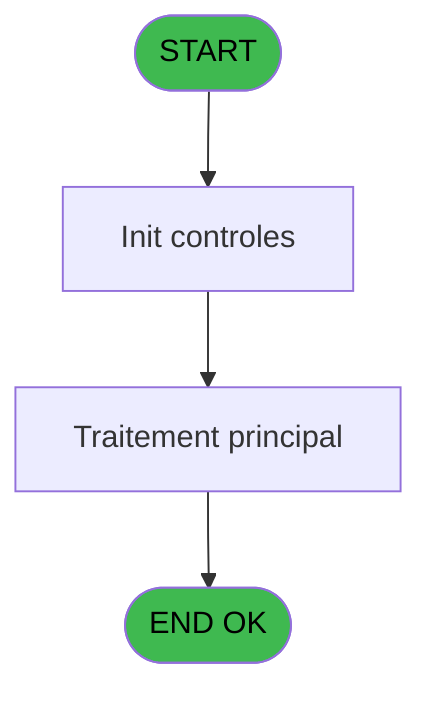
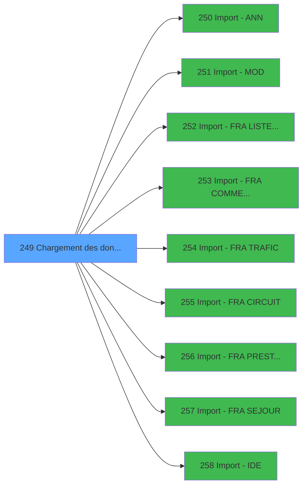

# PBG IDE 249 - Chargement des donnees NA

> **Analyse**: Phases 1-4 2026-02-03 10:33 -> 10:34 (25s) | Assemblage 10:34
> **Pipeline**: V7.2 Enrichi
> **Structure**: 4 onglets (Resume | Ecrans | Donnees | Connexions)

<!-- TAB:Resume -->

## 1. FICHE D'IDENTITE

| Attribut | Valeur |
|----------|--------|
| Projet | PBG |
| IDE Position | 249 |
| Nom Programme | Chargement des donnees NA |
| Fichier source | `Prg_249.xml` |
| Domaine metier | General |
| Taches | 2 (1 ecrans visibles) |
| Tables modifiees | 0 |
| Programmes appeles | 9 |

## 2. DESCRIPTION FONCTIONNELLE

**Chargement des donnees NA** assure la gestion complete de ce processus, accessible depuis [Traitement des arrivants (IDE 206)](PBG-IDE-206.md).

Le flux de traitement s'organise en **1 blocs fonctionnels** :

- **Traitement** (2 taches) : traitements metier divers

## 3. BLOCS FONCTIONNELS

### 3.1 Traitement (2 taches)

Traitements internes.

---

#### 249 - (sans nom) [[ECRAN]](#ecran-t1)

**Role** : Traitement interne.
**Ecran** : 427 x 67 DLU (MDI) | [Voir mockup](#ecran-t1)
**Delegue a** : [Import - ANN (IDE 250)](PBG-IDE-250.md), [Import - MOD (IDE 251)](PBG-IDE-251.md), [Import - FRA LISTE BLANCHE (IDE 252)](PBG-IDE-252.md)

---

#### 249.1 - Chemin IDE.DAT

**Role** : Traitement : Chemin IDE.DAT.
**Variables liees** : C (Chemin IDE), D (Chemin FRA), E (Chemin MOD), F (Chemin ANN)
**Delegue a** : [Import - ANN (IDE 250)](PBG-IDE-250.md), [Import - MOD (IDE 251)](PBG-IDE-251.md), [Import - FRA LISTE BLANCHE (IDE 252)](PBG-IDE-252.md)

## 5. REGLES METIER

*(Aucune regle metier identifiee)*

## 6. CONTEXTE

- **Appele par**: [Traitement des arrivants (IDE 206)](PBG-IDE-206.md)
- **Appelle**: 9 programmes | **Tables**: 1 (W:0 R:1 L:0) | **Taches**: 2 | **Expressions**: 10

<!-- TAB:Ecrans -->

## 8. ECRANS

### 8.1 Forms visibles (1 / 2)

| # | Position | Tache | Nom | Type | Largeur | Hauteur | Bloc |
|---|----------|-------|-----|------|---------|---------|------|
| 1 | 249 | 249 | (sans nom) | MDI | 427 | 67 | Traitement |

### 8.2 Mockups Ecrans

---

#### 249 - (sans nom)
**Tache** : [249](#t1) | **Type** : MDI | **Dimensions** : 427 x 67 DLU
**Bloc** : Traitement | **Titre IDE** : (sans nom)

<!-- FORM-DATA:
{
    "width":  427,
    "vFactor":  8,
    "type":  "MDI",
    "hFactor":  8,
    "controls":  [
                     {
                         "x":  0,
                         "type":  "label",
                         "var":  "",
                         "y":  0,
                         "w":  423,
                         "fmt":  "",
                         "name":  "",
                         "h":  29,
                         "color":  "",
                         "text":  "",
                         "parent":  null
                     },
                     {
                         "x":  98,
                         "type":  "label",
                         "var":  "",
                         "y":  10,
                         "w":  275,
                         "fmt":  "",
                         "name":  "",
                         "h":  8,
                         "color":  "7",
                         "text":  "Chargement donnees NA",
                         "parent":  null
                     },
                     {
                         "x":  0,
                         "type":  "label",
                         "var":  "",
                         "y":  29,
                         "w":  423,
                         "fmt":  "",
                         "name":  "",
                         "h":  37,
                         "color":  "",
                         "text":  "",
                         "parent":  null
                     },
                     {
                         "x":  98,
                         "type":  "label",
                         "var":  "",
                         "y":  42,
                         "w":  275,
                         "fmt":  "",
                         "name":  "",
                         "h":  14,
                         "color":  "7",
                         "text":  "en cours ...",
                         "parent":  4
                     },
                     {
                         "x":  1,
                         "type":  "image",
                         "var":  "",
                         "y":  2,
                         "w":  72,
                         "fmt":  "",
                         "name":  "",
                         "h":  25,
                         "color":  "",
                         "text":  "",
                         "parent":  null
                     }
                 ],
    "taskId":  "249",
    "height":  67
}
-->

## 9. NAVIGATION

Ecran unique: ****

### 9.3 Structure hierarchique (2 taches)

| Position | Tache | Type | Dimensions | Bloc |
|----------|-------|------|------------|------|
| **249.1** | [**(sans nom)** (249)](#t1) [mockup](#ecran-t1) | MDI | 427x67 | Traitement |
| 249.1.1 | [Chemin IDE.DAT (249.1)](#t2) | MDI | - | |

### 9.4 Algorigramme

> **Legende**: Vert = START/END OK | Rouge = END KO | Bleu = Decisions
> *Algorigramme auto-genere. Utiliser `/algorigramme` pour une synthese metier detaillee.*

<!-- TAB:Donnees -->

## 10. TABLES

### Tables utilisees (1)

| ID | Nom | Description | Type | R | W | L | Usages |
|----|-----|-------------|------|---|---|---|--------|
| 118 | tables_imports |  | DB | R |   |   | 1 |

### Colonnes par table (0 / 1 tables avec colonnes identifiees)

Table 118 - tables_imports (R) - 1 usages

*Table utilisee uniquement en Link ou aucune colonne Real identifiee dans le DataView.*

## 11. VARIABLES

### 11.1 Autres (6)

Variables diverses.

| Lettre | Nom | Type | Usage dans |
|--------|-----|------|-----------|
| A | PARAM Societe | Alpha | - |
| B | PARAM Lieu sejour | Alpha | - |
| C | Chemin IDE | Alpha | - |
| D | Chemin FRA | Alpha | - |
| E | Chemin MOD | Alpha | - |
| F | Chemin ANN | Alpha | - |

## 12. EXPRESSIONS

**10 / 10 expressions decodees (100%)**

### 12.1 Repartition par type

| Type | Expressions | Regles |
|------|-------------|--------|
| CALCULATION | 9 | 0 |
| CONDITION | 1 | 0 |

### 12.2 Expressions cles par type

#### CALCULATION (9 expressions)

| Type | IDE | Expression | Regle |
|------|-----|------------|-------|
| CALCULATION | 7 | `CallProg('{492,-1}'PROG,DbName('{319,2}'DSOURCE))` | - |
| CALCULATION | 6 | `CallProg('{492,-1}'PROG,DbName('{318,2}'DSOURCE))` | - |
| CALCULATION | 9 | `CallProg('{492,-1}'PROG,DbName('{11,2}'DSOURCE))` | - |
| CALCULATION | 8 | `CallProg('{492,-1}'PROG,DbName('{359,2}'DSOURCE))` | - |
| CALCULATION | 5 | `CallProg('{492,-1}'PROG,DbName('{322,2}'DSOURCE))` | - |
| ... | | *+4 autres* | |

#### CONDITION (1 expressions)

| Type | IDE | Expression | Regle |
|------|-----|------------|-------|
| CONDITION | 10 | `Translate('%Trace_arrivant%')='O'` | - |

<!-- TAB:Connexions -->

## 13. GRAPHE D'APPELS

### 13.1 Chaine depuis Main (Callers)

Main -> ... -> [Traitement des arrivants (IDE 206)](PBG-IDE-206.md) -> **Chargement des donnees NA (IDE 249)**

### 13.2 Callers

| IDE | Nom Programme | Nb Appels |
|-----|---------------|-----------|
| [206](PBG-IDE-206.md) | Traitement des arrivants | 1 |

### 13.3 Callees (programmes appeles)

### 13.4 Detail Callees avec contexte

| IDE | Nom Programme | Appels | Contexte |
|-----|---------------|--------|----------|
| [250](PBG-IDE-250.md) | Import - ANN | 1 | Sous-programme |
| [251](PBG-IDE-251.md) | Import - MOD | 1 | Sous-programme |
| [252](PBG-IDE-252.md) | Import - FRA LISTE BLANCHE | 1 | Configuration impression |
| [253](PBG-IDE-253.md) | Import - FRA COMMENTAIRE | 1 | Sous-programme |
| [254](PBG-IDE-254.md) | Import - FRA TRAFIC | 1 | Sous-programme |
| [255](PBG-IDE-255.md) | Import - FRA CIRCUIT | 1 | Sous-programme |
| [256](PBG-IDE-256.md) | Import - FRA PRESTATION | 1 | Sous-programme |
| [257](PBG-IDE-257.md) | Import - FRA SEJOUR | 1 | Sous-programme |
| [258](PBG-IDE-258.md) | Import - IDE | 1 | Sous-programme |

## 14. RECOMMANDATIONS MIGRATION

### 14.1 Profil du programme

| Metrique | Valeur | Impact migration |
|----------|--------|-----------------|
| Lignes de logique | 45 | Programme compact |
| Expressions | 10 | Peu de logique |
| Tables WRITE | 0 | Impact faible |
| Sous-programmes | 9 | Dependances moderees |
| Ecrans visibles | 1 | Ecran unique ou traitement batch |
| Code desactive | 0% (0 / 45) | Code sain |
| Regles metier | 0 | Pas de regle identifiee |

### 14.2 Plan de migration par bloc

#### Traitement (2 taches: 1 ecran, 1 traitement)

- **Strategie** : Orchestrateur avec 1 ecrans (Razor/React) et 1 traitements backend (services).
- Les ecrans deviennent des composants UI, les traitements invisibles deviennent des services injectables.
- 9 sous-programme(s) a migrer ou a reutiliser depuis les services existants.
- Decomposer les taches en services unitaires testables.

### 14.3 Dependances critiques

| Dependance | Type | Appels | Impact |
|------------|------|--------|--------|
| [Import - FRA PRESTATION (IDE 256)](PBG-IDE-256.md) | Sous-programme | 1x | Normale - Sous-programme |
| [Import - FRA CIRCUIT (IDE 255)](PBG-IDE-255.md) | Sous-programme | 1x | Normale - Sous-programme |
| [Import - IDE (IDE 258)](PBG-IDE-258.md) | Sous-programme | 1x | Normale - Sous-programme |
| [Import - FRA SEJOUR (IDE 257)](PBG-IDE-257.md) | Sous-programme | 1x | Normale - Sous-programme |
| [Import - FRA TRAFIC (IDE 254)](PBG-IDE-254.md) | Sous-programme | 1x | Normale - Sous-programme |
| [Import - MOD (IDE 251)](PBG-IDE-251.md) | Sous-programme | 1x | Normale - Sous-programme |
| [Import - ANN (IDE 250)](PBG-IDE-250.md) | Sous-programme | 1x | Normale - Sous-programme |
| [Import - FRA COMMENTAIRE (IDE 253)](PBG-IDE-253.md) | Sous-programme | 1x | Normale - Sous-programme |
| [Import - FRA LISTE BLANCHE (IDE 252)](PBG-IDE-252.md) | Sous-programme | 1x | Normale - Configuration impression |

---
*Spec DETAILED generee par Pipeline V7.2 - 2026-02-03 10:34*
