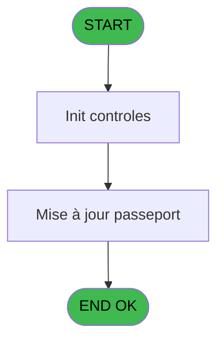

# PBG IDE 25 - Mise à jour passeport par secu

> **Analyse**: Phases 1-4 2026-02-03 01:12 -> 01:13 (38s) | Assemblage 01:13
> **Pipeline**: V7.2 Enrichi
> **Structure**: 4 onglets (Resume | Ecrans | Donnees | Connexions)

<!-- TAB:Resume -->

## 1. FICHE D'IDENTITE

| Attribut | Valeur |
|----------|--------|
| Projet | PBG |
| IDE Position | 25 |
| Nom Programme | Mise à jour passeport par secu |
| Fichier source | `Prg_25.xml` |
| Domaine metier | General |
| Taches | 2 (1 ecrans visibles) |
| Tables modifiees | 0 |
| Programmes appeles | 0 |
| :warning: Statut | **ORPHELIN_POTENTIEL** |

## 2. DESCRIPTION FONCTIONNELLE

**Mise à jour passeport par secu** assure la gestion complete de ce processus.

Le flux de traitement s'organise en **1 blocs fonctionnels** :

- **Traitement** (2 taches) : traitements metier divers

## 3. BLOCS FONCTIONNELS

### 3.1 Traitement (2 taches)

Traitements internes.

---

#### 25 - Mise à jour passeport par secu [[ECRAN]](#ecran-t1)

**Role** : Traitement : Mise à jour passeport par secu.
**Ecran** : 630 x 300 DLU (MDI) | [Voir mockup](#ecran-t1)
**Variables liees** : B (W0 secu), G (v. pays delivrance passeport)

---

#### 25.1 - Passeport par N° Securite [[ECRAN]](#ecran-t2)

**Role** : Traitement : Passeport par N° Securite.
**Ecran** : 632 x 304 DLU (MDI) | [Voir mockup](#ecran-t2)
**Variables liees** : G (v. pays delivrance passeport)

## 5. REGLES METIER

*(Aucune regle metier identifiee)*

## 6. CONTEXTE

- **Appele par**: (aucun)
- **Appelle**: 0 programmes | **Tables**: 7 (W:0 R:1 L:6) | **Taches**: 2 | **Expressions**: 1

<!-- TAB:Ecrans -->

## 8. ECRANS

### 8.1 Forms visibles (1 / 2)

| # | Position | Tache | Nom | Type | Largeur | Hauteur | Bloc |
|---|----------|-------|-----|------|---------|---------|------|
| 1 | 25.1 | 25.1 | Passeport par N° Securite | MDI | 632 | 304 | Traitement |

### 8.2 Mockups Ecrans

---

#### 25.1 - Passeport par N° Securite
**Tache** : [25.1](#t2) | **Type** : MDI | **Dimensions** : 632 x 304 DLU
**Bloc** : Traitement | **Titre IDE** : Passeport par N° Securite

<!-- FORM-DATA:
{
    "width":  632,
    "vFactor":  8,
    "type":  "MDI",
    "hFactor":  4,
    "controls":  [
                     {
                         "x":  0,
                         "type":  "label",
                         "var":  "",
                         "y":  0,
                         "w":  632,
                         "fmt":  "",
                         "name":  "",
                         "h":  246,
                         "color":  "",
                         "text":  "",
                         "parent":  null
                     },
                     {
                         "x":  4,
                         "type":  "table",
                         "var":  "",
                         "name":  "",
                         "titleH":  11,
                         "color":  "110",
                         "w":  624,
                         "y":  8,
                         "fmt":  "",
                         "parent":  null,
                         "text":  "",
                         "rowH":  16,
                         "h":  218,
                         "cols":  [
                                      {
                                          "title":  "Nom",
                                          "layer":  1,
                                          "w":  73
                                      },
                                      {
                                          "title":  "Nom",
                                          "layer":  2,
                                          "w":  136
                                      },
                                      {
                                          "title":  "Prénom",
                                          "layer":  3,
                                          "w":  101
                                      },
                                      {
                                          "title":  "N° Passeport",
                                          "layer":  4,
                                          "w":  126
                                      },
                                      {
                                          "title":  "Date délivrance",
                                          "layer":  5,
                                          "w":  73
                                      },
                                      {
                                          "title":  "Nationalité",
                                          "layer":  6,
                                          "w":  99
                                      }
                                  ],
                         "rows":  6
                     },
                     {
                         "x":  6,
                         "type":  "label",
                         "var":  "",
                         "y":  231,
                         "w":  63,
                         "fmt":  "",
                         "name":  "",
                         "h":  11,
                         "color":  "",
                         "text":  "Pays naissance",
                         "parent":  null
                     },
                     {
                         "x":  251,
                         "type":  "label",
                         "var":  "",
                         "y":  231,
                         "w":  65,
                         "fmt":  "",
                         "name":  "",
                         "h":  11,
                         "color":  "",
                         "text":  "Pays delivrance",
                         "parent":  null
                     },
                     {
                         "x":  0,
                         "type":  "label",
                         "var":  "",
                         "y":  246,
                         "w":  630,
                         "fmt":  "",
                         "name":  "",
                         "h":  54,
                         "color":  "",
                         "text":  "",
                         "parent":  null
                     },
                     {
                         "x":  234,
                         "type":  "label",
                         "var":  "",
                         "y":  249,
                         "w":  171,
                         "fmt":  "",
                         "name":  "",
                         "h":  46,
                         "color":  "7",
                         "text":  "Recherche par Numero de securite",
                         "parent":  null
                     },
                     {
                         "x":  288,
                         "type":  "edit",
                         "var":  "",
                         "y":  269,
                         "w":  63,
                         "fmt":  "",
                         "name":  "",
                         "h":  10,
                         "color":  "110",
                         "text":  "",
                         "parent":  19
                     },
                     {
                         "x":  10,
                         "type":  "edit",
                         "var":  "",
                         "y":  24,
                         "w":  60,
                         "fmt":  "",
                         "name":  "",
                         "h":  8,
                         "color":  "110",
                         "text":  "",
                         "parent":  2
                     },
                     {
                         "x":  83,
                         "type":  "edit",
                         "var":  "",
                         "y":  24,
                         "w":  128,
                         "fmt":  "",
                         "name":  "",
                         "h":  8,
                         "color":  "110",
                         "text":  "",
                         "parent":  2
                     },
                     {
                         "x":  219,
                         "type":  "edit",
                         "var":  "",
                         "y":  24,
                         "w":  91,
                         "fmt":  "",
                         "name":  "",
                         "h":  8,
                         "color":  "110",
                         "text":  "",
                         "parent":  2
                     },
                     {
                         "x":  319,
                         "type":  "edit",
                         "var":  "",
                         "y":  24,
                         "w":  116,
                         "fmt":  "U20",
                         "name":  "",
                         "h":  8,
                         "color":  "110",
                         "text":  "",
                         "parent":  2
                     },
                     {
                         "x":  445,
                         "type":  "edit",
                         "var":  "",
                         "y":  24,
                         "w":  62,
                         "fmt":  "",
                         "name":  "",
                         "h":  8,
                         "color":  "110",
                         "text":  "",
                         "parent":  2
                     },
                     {
                         "x":  516,
                         "type":  "combobox",
                         "var":  "",
                         "y":  22,
                         "w":  95,
                         "fmt":  "",
                         "name":  "",
                         "h":  12,
                         "color":  "110",
                         "text":  "1,2",
                         "parent":  2
                     },
                     {
                         "x":  79,
                         "type":  "edit",
                         "var":  "",
                         "y":  231,
                         "w":  74,
                         "fmt":  "U12",
                         "name":  "",
                         "h":  10,
                         "color":  "110",
                         "text":  "",
                         "parent":  null
                     },
                     {
                         "x":  325,
                         "type":  "edit",
                         "var":  "",
                         "y":  231,
                         "w":  203,
                         "fmt":  "",
                         "name":  "",
                         "h":  10,
                         "color":  "110",
                         "text":  "",
                         "parent":  null
                     }
                 ],
    "taskId":  "25.1",
    "height":  304
}
-->

<strong>Champs : 9 champs</strong>

| Pos (x,y) | Nom | Variable | Type |
|-----------|-----|----------|------|
| 288,269 | (sans nom) | - | edit |
| 10,24 | (sans nom) | - | edit |
| 83,24 | (sans nom) | - | edit |
| 219,24 | (sans nom) | - | edit |
| 319,24 | U20 | - | edit |
| 445,24 | (sans nom) | - | edit |
| 516,22 | 1,2 | - | combobox |
| 79,231 | U12 | - | edit |
| 325,231 | (sans nom) | - | edit |

## 9. NAVIGATION

Ecran unique: **Passeport par N° Securite**

### 9.3 Structure hierarchique (2 taches)

| Position | Tache | Type | Dimensions | Bloc |
|----------|-------|------|------------|------|
| **25.1** | [**Mise à jour passeport par secu** (25)](#t1) [mockup](#ecran-t1) | MDI | 630x300 | Traitement |
| 25.1.1 | [Passeport par N° Securite (25.1)](#t2) [mockup](#ecran-t2) | MDI | 632x304 | |

### 9.4 Algorigramme

> **Legende**: Vert = START/END OK | Rouge = END KO | Bleu = Decisions
> *Algorigramme auto-genere. Utiliser `/algorigramme` pour une synthese metier detaillee.*

<!-- TAB:Donnees -->

## 10. TABLES

### Tables utilisees (7)

| ID | Nom | Description | Type | R | W | L | Usages |
|----|-----|-------------|------|---|---|---|--------|
| 30 | gm-recherche_____gmr | Index de recherche | DB | R |   |   | 1 |
| 31 | gm-complet_______gmc |  | DB |   |   | L | 1 |
| 35 | personnel_go______go |  | DB |   |   | L | 1 |
| 36 | client_gm |  | DB |   |   | L | 1 |
| 119 | tables_pays_tel_ |  | DB |   |   | L | 1 |
| 131 | fichier_validation |  | DB |   |   | L | 1 |
| 281 | crew |  | DB |   |   | L | 1 |

### Colonnes par table (3 / 1 tables avec colonnes identifiees)

Table 30 - gm-recherche_____gmr (R) - 1 usages

| Lettre | Variable | Acces | Type |
|--------|----------|-------|------|
| A | W1 secu | R | Numeric |
| B | v. cdrt validation | R | Logical |
| C | v. cdrt gm | R | Logical |
| D | v. cdrt go | R | Logical |
| E | v. nationalite | R | Alpha |
| F | v. pays naissance | R | Alpha |
| G | v. pays delivrance passeport | R | Alpha |
| H | v. pay go delivrance | R | Alpha |

## 11. VARIABLES

### 11.1 Variables de session (5)

Variables persistantes pendant toute la session.

| Lettre | Nom | Type | Usage dans |
|--------|-----|------|-----------|
| D | v. cdrt go | Logical | - |
| E | v. nationalite | Alpha | - |
| F | v. pays naissance | Alpha | - |
| G | v. pays delivrance passeport | Alpha | - |
| H | v. pay go delivrance | Alpha | - |

### 11.2 Variables de travail (2)

Variables internes au programme.

| Lettre | Nom | Type | Usage dans |
|--------|-----|------|-----------|
| B | W0 secu | Numeric | - |
| C | W0 fin | Logical | 1x calcul interne |

### 11.3 Autres (1)

Variables diverses.

| Lettre | Nom | Type | Usage dans |
|--------|-----|------|-----------|
| A | > GO | Logical | - |

## 12. EXPRESSIONS

**1 / 1 expressions decodees (100%)**

### 12.1 Repartition par type

| Type | Expressions | Regles |
|------|-------------|--------|
| OTHER | 1 | 0 |

### 12.2 Expressions cles par type

#### OTHER (1 expressions)

| Type | IDE | Expression | Regle |
|------|-----|------------|-------|
| OTHER | 1 | `W0 fin [C]` | - |

<!-- TAB:Connexions -->

## 13. GRAPHE D'APPELS

### 13.1 Chaine depuis Main (Callers)

**Chemin**: (pas de callers directs)

### 13.2 Callers

| IDE | Nom Programme | Nb Appels |
|-----|---------------|-----------|
| - | (aucun) | - |

### 13.3 Callees (programmes appeles)

### 13.4 Detail Callees avec contexte

| IDE | Nom Programme | Appels | Contexte |
|-----|---------------|--------|----------|
| - | (aucun) | - | - |

## 14. RECOMMANDATIONS MIGRATION

### 14.1 Profil du programme

| Metrique | Valeur | Impact migration |
|----------|--------|-----------------|
| Lignes de logique | 111 | Programme compact |
| Expressions | 1 | Peu de logique |
| Tables WRITE | 0 | Impact faible |
| Sous-programmes | 0 | Peu de dependances |
| Ecrans visibles | 1 | Ecran unique ou traitement batch |
| Code desactive | 0% (0 / 111) | Code sain |
| Regles metier | 0 | Pas de regle identifiee |

### 14.2 Plan de migration par bloc

#### Traitement (2 taches: 2 ecrans, 0 traitement)

- **Strategie** : 2 composant(s) UI (Razor/React) avec formulaires et validation.
- Decomposer les taches en services unitaires testables.

### 14.3 Dependances critiques

| Dependance | Type | Appels | Impact |
|------------|------|--------|--------|

---
*Spec DETAILED generee par Pipeline V7.2 - 2026-02-03 01:13*
