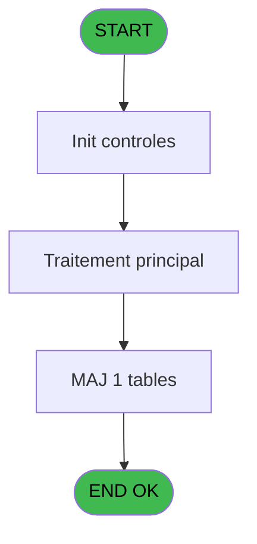

# PBG IDE 254 - Import - FRA TRAFIC

> **Analyse**: Phases 1-4 2026-02-03 10:36 -> 10:37 (21s) | Assemblage 10:37
> **Pipeline**: V7.2 Enrichi
> **Structure**: 4 onglets (Resume | Ecrans | Donnees | Connexions)

<!-- TAB:Resume -->

## 1. FICHE D'IDENTITE

| Attribut | Valeur |
|----------|--------|
| Projet | PBG |
| IDE Position | 254 |
| Nom Programme | Import - FRA TRAFIC |
| Fichier source | `Prg_254.xml` |
| Domaine metier | General |
| Taches | 2 (0 ecrans visibles) |
| Tables modifiees | 1 |
| Programmes appeles | 0 |

## 2. DESCRIPTION FONCTIONNELLE

**Import - FRA TRAFIC** assure la gestion complete de ce processus, accessible depuis [Chargement des donnees NA (IDE 249)](PBG-IDE-249.md).

Le flux de traitement s'organise en **2 blocs fonctionnels** :

- **Creation** (1 tache) : insertion d'enregistrements en base (mouvements, prestations)
- **Traitement** (1 tache) : traitements metier divers

**Donnees modifiees** : 1 tables en ecriture (fra_trafic).

Detail : phases du traitement

#### Phase 1 : Traitement (1 tache)

- **254** - Import - FRA TRAFIC

#### Phase 2 : Creation (1 tache)

- **254.1** - CREATION

#### Tables impactees

| Table | Operations | Role metier |
|-------|-----------|-------------|
| fra_trafic | **W** (1 usages) |  |

## 3. BLOCS FONCTIONNELS

### 3.1 Traitement (1 tache)

Traitements internes.

---

#### 254 - Import - FRA TRAFIC

**Role** : Traitement : Import - FRA TRAFIC.

### 3.2 Creation (1 tache)

Insertion de nouveaux enregistrements en base.

---

#### 254.1 - CREATION

**Role** : Creation d'enregistrement : CREATION.

## 5. REGLES METIER

*(Aucune regle metier identifiee)*

## 6. CONTEXTE

- **Appele par**: [Chargement des donnees NA (IDE 249)](PBG-IDE-249.md)
- **Appelle**: 0 programmes | **Tables**: 1 (W:1 R:0 L:0) | **Taches**: 2 | **Expressions**: 4

<!-- TAB:Ecrans -->

## 8. ECRANS

*(Programme sans ecran visible)*

## 9. NAVIGATION

### 9.3 Structure hierarchique (2 taches)

| Position | Tache | Type | Dimensions | Bloc |
|----------|-------|------|------------|------|
| **254.1** | [**Import - FRA TRAFIC** (254)](#t1) | MDI | - | Traitement |
| **254.2** | [**CREATION** (254.1)](#t2) | MDI | - | Creation |

### 9.4 Algorigramme

> **Legende**: Vert = START/END OK | Rouge = END KO | Bleu = Decisions
> *Algorigramme auto-genere. Utiliser `/algorigramme` pour une synthese metier detaillee.*

<!-- TAB:Donnees -->

## 10. TABLES

### Tables utilisees (1)

| ID | Nom | Description | Type | R | W | L | Usages |
|----|-----|-------------|------|---|---|---|--------|
| 322 | fra_trafic |  | DB |   | **W** |   | 1 |

### Colonnes par table (0 / 1 tables avec colonnes identifiees)

Table 322 - fra_trafic (**W**) - 1 usages

*Table utilisee uniquement en Link ou aucune colonne Real identifiee dans le DataView.*

## 11. VARIABLES

### 11.1 Autres (19)

Variables diverses.

| Lettre | Nom | Type | Usage dans |
|--------|-----|------|-----------|
| A | PARAM fichier FRA | Alpha | 1x refs |
| B | ressource | Alpha | 1x refs |
| C | type ressource | Alpha | 1x refs |
| D | type produit | Alpha | - |
| E | code produit | Alpha | - |
| F | sous type produit | Alpha | - |
| G | sens | Alpha | - |
| H | numero vol | Alpha | - |
| I | date depart | Alpha | - |
| J | heure depart | Alpha | - |
| K | code iata aeroport depart | Alpha | - |
| L | date arrivee | Alpha | - |
| M | heure arrivee | Alpha | - |
| N | code iata arrivee | Alpha | - |
| O | categorie | Alpha | - |
| P | classe | Alpha | - |
| Q | numero pnr | Alpha | - |
| R | compagnie | Alpha | - |
| S | affreteur | Alpha | - |

Toutes les 19 variables (liste complete)

| Cat | Lettre | Nom Variable | Type |
|-----|--------|--------------|------|
| Autre | **A** | PARAM fichier FRA | Alpha |
| Autre | **B** | ressource | Alpha |
| Autre | **C** | type ressource | Alpha |
| Autre | **D** | type produit | Alpha |
| Autre | **E** | code produit | Alpha |
| Autre | **F** | sous type produit | Alpha |
| Autre | **G** | sens | Alpha |
| Autre | **H** | numero vol | Alpha |
| Autre | **I** | date depart | Alpha |
| Autre | **J** | heure depart | Alpha |
| Autre | **K** | code iata aeroport depart | Alpha |
| Autre | **L** | date arrivee | Alpha |
| Autre | **M** | heure arrivee | Alpha |
| Autre | **N** | code iata arrivee | Alpha |
| Autre | **O** | categorie | Alpha |
| Autre | **P** | classe | Alpha |
| Autre | **Q** | numero pnr | Alpha |
| Autre | **R** | compagnie | Alpha |
| Autre | **S** | affreteur | Alpha |

## 12. EXPRESSIONS

**4 / 4 expressions decodees (100%)**

### 12.1 Repartition par type

| Type | Expressions | Regles |
|------|-------------|--------|
| OTHER | 2 | 0 |
| CONDITION | 1 | 0 |
| STRING | 1 | 0 |

### 12.2 Expressions cles par type

#### OTHER (2 expressions)

| Type | IDE | Expression | Regle |
|------|-----|------------|-------|
| OTHER | 2 | `EOF (0,1)` | - |
| OTHER | 1 | `Counter (0)` | - |

#### CONDITION (1 expressions)

| Type | IDE | Expression | Regle |
|------|-----|------------|-------|
| CONDITION | 4 | `type ressource [C]='7'` | - |

#### STRING (1 expressions)

| Type | IDE | Expression | Regle |
|------|-----|------------|-------|
| STRING | 3 | `Trim (PARAM fichier FRA [A])` | - |

<!-- TAB:Connexions -->

## 13. GRAPHE D'APPELS

### 13.1 Chaine depuis Main (Callers)

Main -> ... -> [Chargement des donnees NA (IDE 249)](PBG-IDE-249.md) -> **Import - FRA TRAFIC (IDE 254)**

### 13.2 Callers

| IDE | Nom Programme | Nb Appels |
|-----|---------------|-----------|
| [249](PBG-IDE-249.md) | Chargement des donnees NA | 1 |

### 13.3 Callees (programmes appeles)

### 13.4 Detail Callees avec contexte

| IDE | Nom Programme | Appels | Contexte |
|-----|---------------|--------|----------|
| - | (aucun) | - | - |

## 14. RECOMMANDATIONS MIGRATION

### 14.1 Profil du programme

| Metrique | Valeur | Impact migration |
|----------|--------|-----------------|
| Lignes de logique | 47 | Programme compact |
| Expressions | 4 | Peu de logique |
| Tables WRITE | 1 | Impact faible |
| Sous-programmes | 0 | Peu de dependances |
| Ecrans visibles | 0 | Ecran unique ou traitement batch |
| Code desactive | 0% (0 / 47) | Code sain |
| Regles metier | 0 | Pas de regle identifiee |

### 14.2 Plan de migration par bloc

#### Traitement (1 tache: 0 ecran, 1 traitement)

- **Strategie** : 1 service(s) backend injectable(s) (Domain Services).
- Decomposer les taches en services unitaires testables.

#### Creation (1 tache: 0 ecran, 1 traitement)

- **Strategie** : Repository pattern avec Entity Framework Core.
- Insertion via `IRepository<T>.CreateAsync()`

### 14.3 Dependances critiques

| Dependance | Type | Appels | Impact |
|------------|------|--------|--------|
| fra_trafic | Table WRITE (Database) | 1x | Schema + repository |

---
*Spec DETAILED generee par Pipeline V7.2 - 2026-02-03 10:37*
