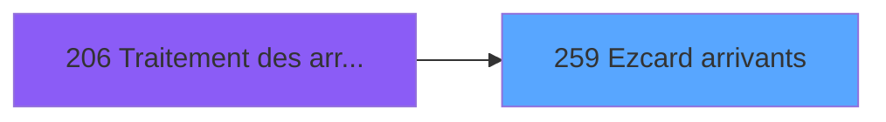

# PBG IDE 259 - Ezcard arrivants

> **Analyse**: Phases 1-4 2026-02-03 10:39 -> 10:39 (19s) | Assemblage 10:39
> **Pipeline**: V7.2 Enrichi
> **Structure**: 4 onglets (Resume | Ecrans | Donnees | Connexions)

<!-- TAB:Resume -->

## 1. FICHE D'IDENTITE

| Attribut | Valeur |
|----------|--------|
| Projet | PBG |
| IDE Position | 259 |
| Nom Programme | Ezcard arrivants |
| Fichier source | `Prg_259.xml` |
| Domaine metier | General |
| Taches | 24 (3 ecrans visibles) |
| Tables modifiees | 6 |
| Programmes appeles | 0 |

## 2. DESCRIPTION FONCTIONNELLE

**Ezcard arrivants** assure la gestion complete de ce processus, accessible depuis [Traitement des arrivants (IDE 206)](PBG-IDE-206.md).

Le flux de traitement s'organise en **3 blocs fonctionnels** :

- **Traitement** (19 taches) : traitements metier divers
- **Creation** (4 taches) : insertion d'enregistrements en base (mouvements, prestations)
- **Calcul** (1 tache) : calculs de montants, stocks ou compteurs

**Donnees modifiees** : 6 tables en ecriture (bl_detail, cc_total_par_type, cc_total, cc_type_detail, ez_card, import_avertiss__mod).

Detail : phases du traitement

#### Phase 1 : Traitement (19 taches)

- **259** - Veuillez patienter... **[[ECRAN]](#ecran-t1)**
- **259.1** - Veuillez patienter... **[[ECRAN]](#ecran-t2)**
- **259.2** - Veuillez patienter... **[[ECRAN]](#ecran-t4)**
- **259.2.1** - Suppression carte
- **259.2.2** - Suppression CC
- **259.2.2.1** - CCTotal
- **259.2.2.2** - CCTotalTyp
- **259.2.2.3** - CCTypDet
- **259.2.3** - Suppression BL
- **259.3** - Veuillez patienter... **[[ECRAN]](#ecran-t18)**
- **259.3.1** - MAJ EZCARD
- **259.3.2** - Report CC
- **259.3.2.1** - CCTOTAL
- **259.3.2.1.2** - Delete
- **259.3.2.2** - CCTOTALPARTYP
- **259.3.2.2.2** - Delete
- **259.3.2.3** - CCTYPDET
- **259.3.2.3.2** - Delete
- **259.3.3** - Report BL

#### Phase 2 : Calcul (1 tache)

- **259.1.1** - Stockage ancien compte

#### Phase 3 : Creation (4 taches)

- **259.3.2.1.1** - Creation
- **259.3.2.2.1** - Creation
- **259.3.2.3.1** - Creation
- **259.3.3.1** - Creation

#### Tables impactees

| Table | Operations | Role metier |
|-------|-----------|-------------|
| cc_total | **W**/L (5 usages) |  |
| cc_total_par_type | **W** (4 usages) |  |
| cc_type_detail | **W** (4 usages) |  |
| import_avertiss__mod | **W**/L (3 usages) |  |
| ez_card | **W**/L (3 usages) |  |
| bl_detail | **W** (3 usages) |  |

## 3. BLOCS FONCTIONNELS

### 3.1 Traitement (19 taches)

Traitements internes.

---

#### 259 - Veuillez patienter... [[ECRAN]](#ecran-t1)

**Role** : Tache d'orchestration : point d'entree du programme (19 sous-taches). Coordonne l'enchainement des traitements.
**Ecran** : 427 x 69 DLU (MDI) | [Voir mockup](#ecran-t1)

18 sous-taches directes

| Tache | Nom | Bloc |
|-------|-----|------|
| [259.1](#t2) | Veuillez patienter... **[[ECRAN]](#ecran-t2)** | Traitement |
| [259.2](#t4) | Veuillez patienter... **[[ECRAN]](#ecran-t4)** | Traitement |
| [259.2.1](#t5) | Suppression carte | Traitement |
| [259.2.2](#t6) | Suppression CC | Traitement |
| [259.2.2.1](#t7) | CCTotal | Traitement |
| [259.2.2.2](#t8) | CCTotalTyp | Traitement |
| [259.2.2.3](#t9) | CCTypDet | Traitement |
| [259.2.3](#t10) | Suppression BL | Traitement |
| [259.3](#t18) | Veuillez patienter... **[[ECRAN]](#ecran-t18)** | Traitement |
| [259.3.1](#t19) | MAJ EZCARD | Traitement |
| [259.3.2](#t20) | Report CC | Traitement |
| [259.3.2.1](#t21) | CCTOTAL | Traitement |
| [259.3.2.1.2](#t23) | Delete | Traitement |
| [259.3.2.2](#t24) | CCTOTALPARTYP | Traitement |
| [259.3.2.2.2](#t26) | Delete | Traitement |
| [259.3.2.3](#t27) | CCTYPDET | Traitement |
| [259.3.2.3.2](#t29) | Delete | Traitement |
| [259.3.3](#t30) | Report BL | Traitement |

---

#### 259.1 - Veuillez patienter... [[ECRAN]](#ecran-t2)

**Role** : Traitement : Veuillez patienter....
**Ecran** : 224 x 78 DLU (MDI) | [Voir mockup](#ecran-t2)

---

#### 259.2 - Veuillez patienter... [[ECRAN]](#ecran-t4)

**Role** : Traitement : Veuillez patienter....
**Ecran** : 223 x 78 DLU (MDI) | [Voir mockup](#ecran-t4)

---

#### 259.2.1 - Suppression carte

**Role** : Traitement : Suppression carte.

---

#### 259.2.2 - Suppression CC

**Role** : Traitement : Suppression CC.

---

#### 259.2.2.1 - CCTotal

**Role** : Traitement : CCTotal.

---

#### 259.2.2.2 - CCTotalTyp

**Role** : Traitement : CCTotalTyp.

---

#### 259.2.2.3 - CCTypDet

**Role** : Traitement : CCTypDet.

---

#### 259.2.3 - Suppression BL

**Role** : Traitement : Suppression BL.

---

#### 259.3 - Veuillez patienter... [[ECRAN]](#ecran-t18)

**Role** : Traitement : Veuillez patienter....
**Ecran** : 223 x 78 DLU (MDI) | [Voir mockup](#ecran-t18)

---

#### 259.3.1 - MAJ EZCARD

**Role** : Traitement : MAJ EZCARD.

---

#### 259.3.2 - Report CC

**Role** : Traitement : Report CC.

---

#### 259.3.2.1 - CCTOTAL

**Role** : Traitement : CCTOTAL.

---

#### 259.3.2.1.2 - Delete

**Role** : Traitement : Delete.

---

#### 259.3.2.2 - CCTOTALPARTYP

**Role** : Traitement : CCTOTALPARTYP.

---

#### 259.3.2.2.2 - Delete

**Role** : Traitement : Delete.

---

#### 259.3.2.3 - CCTYPDET

**Role** : Traitement : CCTYPDET.

---

#### 259.3.2.3.2 - Delete

**Role** : Traitement : Delete.

---

#### 259.3.3 - Report BL

**Role** : Traitement : Report BL.

### 3.2 Calcul (1 tache)

Calculs metier : montants, stocks, compteurs.

---

#### 259.1.1 - Stockage ancien compte

**Role** : Calcul : Stockage ancien compte.
**Variables liees** : B (V.compteur)

### 3.3 Creation (4 taches)

Insertion de nouveaux enregistrements en base.

---

#### 259.3.2.1.1 - Creation

**Role** : Creation d'enregistrement : Creation.

---

#### 259.3.2.2.1 - Creation

**Role** : Creation d'enregistrement : Creation.

---

#### 259.3.2.3.1 - Creation

**Role** : Creation d'enregistrement : Creation.

---

#### 259.3.3.1 - Creation

**Role** : Creation d'enregistrement : Creation.

## 5. REGLES METIER

*(Aucune regle metier identifiee)*

## 6. CONTEXTE

- **Appele par**: [Traitement des arrivants (IDE 206)](PBG-IDE-206.md)
- **Appelle**: 0 programmes | **Tables**: 7 (W:6 R:1 L:3) | **Taches**: 24 | **Expressions**: 4

<!-- TAB:Ecrans -->

## 8. ECRANS

### 8.1 Forms visibles (3 / 24)

| # | Position | Tache | Nom | Type | Largeur | Hauteur | Bloc |
|---|----------|-------|-----|------|---------|---------|------|
| 1 | 259.1 | 259.1 | Veuillez patienter... | MDI | 224 | 78 | Traitement |
| 2 | 259.2 | 259.2 | Veuillez patienter... | MDI | 223 | 78 | Traitement |
| 3 | 259.3 | 259.3 | Veuillez patienter... | MDI | 223 | 78 | Traitement |

### 8.2 Mockups Ecrans

---

#### 259.1 - Veuillez patienter...
**Tache** : [259.1](#t2) | **Type** : MDI | **Dimensions** : 224 x 78 DLU
**Bloc** : Traitement | **Titre IDE** : Veuillez patienter...

<!-- FORM-DATA:
{
    "width":  224,
    "vFactor":  8,
    "type":  "MDI",
    "hFactor":  4,
    "controls":  [
                     {
                         "x":  4,
                         "type":  "label",
                         "var":  "",
                         "y":  2,
                         "w":  216,
                         "fmt":  "",
                         "name":  "",
                         "h":  29,
                         "color":  "",
                         "text":  "",
                         "parent":  null
                     },
                     {
                         "x":  65,
                         "type":  "label",
                         "var":  "",
                         "y":  12,
                         "w":  94,
                         "fmt":  "",
                         "name":  "",
                         "h":  9,
                         "color":  "7",
                         "text":  "Cartes - Initialisation",
                         "parent":  null
                     },
                     {
                         "x":  4,
                         "type":  "label",
                         "var":  "",
                         "y":  31,
                         "w":  216,
                         "fmt":  "",
                         "name":  "",
                         "h":  37,
                         "color":  "",
                         "text":  "",
                         "parent":  null
                     },
                     {
                         "x":  12,
                         "type":  "label",
                         "var":  "",
                         "y":  43,
                         "w":  200,
                         "fmt":  "",
                         "name":  "",
                         "h":  19,
                         "color":  "",
                         "text":  "",
                         "parent":  null
                     },
                     {
                         "x":  5,
                         "type":  "image",
                         "var":  "",
                         "y":  4,
                         "w":  40,
                         "fmt":  "",
                         "name":  "",
                         "h":  25,
                         "color":  "",
                         "text":  "",
                         "parent":  null
                     },
                     {
                         "x":  12,
                         "type":  "edit",
                         "var":  "",
                         "y":  44,
                         "w":  198,
                         "fmt":  "30",
                         "name":  "",
                         "h":  17,
                         "color":  "159",
                         "text":  "",
                         "parent":  4
                     },
                     {
                         "x":  99,
                         "type":  "edit",
                         "var":  "",
                         "y":  48,
                         "w":  24,
                         "fmt":  "3 %",
                         "name":  "",
                         "h":  8,
                         "color":  "143",
                         "text":  "",
                         "parent":  1
                     }
                 ],
    "taskId":  "259.1",
    "height":  78
}
-->

<strong>Champs : 2 champs</strong>

| Pos (x,y) | Nom | Variable | Type |
|-----------|-----|----------|------|
| 12,44 | 30 | - | edit |
| 99,48 | 3 % | - | edit |

---

#### 259.2 - Veuillez patienter...
**Tache** : [259.2](#t4) | **Type** : MDI | **Dimensions** : 223 x 78 DLU
**Bloc** : Traitement | **Titre IDE** : Veuillez patienter...

<!-- FORM-DATA:
{
    "width":  223,
    "vFactor":  8,
    "type":  "MDI",
    "hFactor":  4,
    "controls":  [
                     {
                         "x":  4,
                         "type":  "label",
                         "var":  "",
                         "y":  4,
                         "w":  216,
                         "fmt":  "",
                         "name":  "",
                         "h":  29,
                         "color":  "",
                         "text":  "",
                         "parent":  null
                     },
                     {
                         "x":  71,
                         "type":  "label",
                         "var":  "",
                         "y":  14,
                         "w":  80,
                         "fmt":  "",
                         "name":  "",
                         "h":  9,
                         "color":  "7",
                         "text":  "Cartes - GM Final",
                         "parent":  null
                     },
                     {
                         "x":  4,
                         "type":  "label",
                         "var":  "",
                         "y":  33,
                         "w":  216,
                         "fmt":  "",
                         "name":  "",
                         "h":  37,
                         "color":  "",
                         "text":  "",
                         "parent":  null
                     },
                     {
                         "x":  12,
                         "type":  "label",
                         "var":  "",
                         "y":  45,
                         "w":  200,
                         "fmt":  "",
                         "name":  "",
                         "h":  19,
                         "color":  "",
                         "text":  "",
                         "parent":  null
                     },
                     {
                         "x":  5,
                         "type":  "image",
                         "var":  "",
                         "y":  6,
                         "w":  40,
                         "fmt":  "",
                         "name":  "",
                         "h":  25,
                         "color":  "",
                         "text":  "",
                         "parent":  null
                     },
                     {
                         "x":  12,
                         "type":  "edit",
                         "var":  "",
                         "y":  46,
                         "w":  199,
                         "fmt":  "30",
                         "name":  "",
                         "h":  17,
                         "color":  "159",
                         "text":  "",
                         "parent":  null
                     },
                     {
                         "x":  100,
                         "type":  "edit",
                         "var":  "",
                         "y":  50,
                         "w":  24,
                         "fmt":  "3 %",
                         "name":  "",
                         "h":  8,
                         "color":  "143",
                         "text":  "",
                         "parent":  null
                     }
                 ],
    "taskId":  "259.2",
    "height":  78
}
-->

<strong>Champs : 2 champs</strong>

| Pos (x,y) | Nom | Variable | Type |
|-----------|-----|----------|------|
| 12,46 | 30 | - | edit |
| 100,50 | 3 % | - | edit |

---

#### 259.3 - Veuillez patienter...
**Tache** : [259.3](#t18) | **Type** : MDI | **Dimensions** : 223 x 78 DLU
**Bloc** : Traitement | **Titre IDE** : Veuillez patienter...

<!-- FORM-DATA:
{
    "width":  223,
    "vFactor":  8,
    "type":  "MDI",
    "hFactor":  4,
    "controls":  [
                     {
                         "x":  2,
                         "type":  "label",
                         "var":  "",
                         "y":  1,
                         "w":  216,
                         "fmt":  "",
                         "name":  "",
                         "h":  29,
                         "color":  "",
                         "text":  "",
                         "parent":  null
                     },
                     {
                         "x":  76,
                         "type":  "label",
                         "var":  "",
                         "y":  11,
                         "w":  70,
                         "fmt":  "",
                         "name":  "",
                         "h":  9,
                         "color":  "7",
                         "text":  "Cartes - Report",
                         "parent":  null
                     },
                     {
                         "x":  2,
                         "type":  "label",
                         "var":  "",
                         "y":  30,
                         "w":  216,
                         "fmt":  "",
                         "name":  "",
                         "h":  37,
                         "color":  "",
                         "text":  "",
                         "parent":  null
                     },
                     {
                         "x":  10,
                         "type":  "label",
                         "var":  "",
                         "y":  42,
                         "w":  200,
                         "fmt":  "",
                         "name":  "",
                         "h":  19,
                         "color":  "",
                         "text":  "",
                         "parent":  null
                     },
                     {
                         "x":  3,
                         "type":  "image",
                         "var":  "",
                         "y":  3,
                         "w":  40,
                         "fmt":  "",
                         "name":  "",
                         "h":  25,
                         "color":  "",
                         "text":  "",
                         "parent":  null
                     },
                     {
                         "x":  10,
                         "type":  "edit",
                         "var":  "",
                         "y":  43,
                         "w":  200,
                         "fmt":  "30",
                         "name":  "",
                         "h":  17,
                         "color":  "159",
                         "text":  "",
                         "parent":  11
                     },
                     {
                         "x":  97,
                         "type":  "edit",
                         "var":  "",
                         "y":  47,
                         "w":  24,
                         "fmt":  "3 %",
                         "name":  "",
                         "h":  8,
                         "color":  "143",
                         "text":  "",
                         "parent":  8
                     }
                 ],
    "taskId":  "259.3",
    "height":  78
}
-->

<strong>Champs : 2 champs</strong>

| Pos (x,y) | Nom | Variable | Type |
|-----------|-----|----------|------|
| 10,43 | 30 | - | edit |
| 97,47 | 3 % | - | edit |

## 9. NAVIGATION

### 9.1 Enchainement des ecrans

**Detail par enchainement :**

| Depuis | Action | Vers | Retour |
|--------|--------|------|--------|

### 9.3 Structure hierarchique (24 taches)

| Position | Tache | Type | Dimensions | Bloc |
|----------|-------|------|------------|------|
| **259.1** | [**Veuillez patienter...** (259)](#t1) [mockup](#ecran-t1) | MDI | 427x69 | Traitement |
| 259.1.1 | [Veuillez patienter... (259.1)](#t2) [mockup](#ecran-t2) | MDI | 224x78 | |
| 259.1.2 | [Veuillez patienter... (259.2)](#t4) [mockup](#ecran-t4) | MDI | 223x78 | |
| 259.1.3 | [Suppression carte (259.2.1)](#t5) | MDI | - | |
| 259.1.4 | [Suppression CC (259.2.2)](#t6) | MDI | - | |
| 259.1.5 | [CCTotal (259.2.2.1)](#t7) | MDI | - | |
| 259.1.6 | [CCTotalTyp (259.2.2.2)](#t8) | MDI | - | |
| 259.1.7 | [CCTypDet (259.2.2.3)](#t9) | MDI | - | |
| 259.1.8 | [Suppression BL (259.2.3)](#t10) | MDI | - | |
| 259.1.9 | [Veuillez patienter... (259.3)](#t18) [mockup](#ecran-t18) | MDI | 223x78 | |
| 259.1.10 | [MAJ EZCARD (259.3.1)](#t19) | MDI | - | |
| 259.1.11 | [Report CC (259.3.2)](#t20) | MDI | - | |
| 259.1.12 | [CCTOTAL (259.3.2.1)](#t21) | MDI | - | |
| 259.1.13 | [Delete (259.3.2.1.2)](#t23) | MDI | - | |
| 259.1.14 | [CCTOTALPARTYP (259.3.2.2)](#t24) | MDI | - | |
| 259.1.15 | [Delete (259.3.2.2.2)](#t26) | MDI | - | |
| 259.1.16 | [CCTYPDET (259.3.2.3)](#t27) | MDI | - | |
| 259.1.17 | [Delete (259.3.2.3.2)](#t29) | MDI | - | |
| 259.1.18 | [Report BL (259.3.3)](#t30) | MDI | - | |
| **259.2** | [**Stockage ancien compte** (259.1.1)](#t3) | MDI | - | Calcul |
| **259.3** | [**Creation** (259.3.2.1.1)](#t22) | MDI | - | Creation |
| 259.3.1 | [Creation (259.3.2.2.1)](#t25) | MDI | - | |
| 259.3.2 | [Creation (259.3.2.3.1)](#t28) | MDI | - | |
| 259.3.3 | [Creation (259.3.3.1)](#t31) | MDI | - | |

### 9.4 Algorigramme

> **Legende**: Vert = START/END OK | Rouge = END KO | Bleu = Decisions
> *Algorigramme auto-genere. Utiliser `/algorigramme` pour une synthese metier detaillee.*

<!-- TAB:Donnees -->

## 10. TABLES

### Tables utilisees (7)

| ID | Nom | Description | Type | R | W | L | Usages |
|----|-----|-------------|------|---|---|---|--------|
| 19 | bl_detail |  | DB |   | **W** |   | 3 |
| 31 | gm-complet_______gmc |  | DB | R |   |   | 3 |
| 268 | cc_total_par_type |  | DB |   | **W** |   | 4 |
| 271 | cc_total |  | DB |   | **W** | L | 5 |
| 272 | cc_type_detail |  | DB |   | **W** |   | 4 |
| 312 | ez_card |  | DB |   | **W** | L | 3 |
| 560 | import_avertiss__mod |  | DB |   | **W** | L | 3 |

### Colonnes par table (2 / 7 tables avec colonnes identifiees)

Table 19 - bl_detail (**W**) - 3 usages

*Table utilisee uniquement en Link ou aucune colonne Real identifiee dans le DataView.*

Table 31 - gm-complet_______gmc (R) - 3 usages

| Lettre | Variable | Acces | Type |
|--------|----------|-------|------|
| A | ExisteEzcard | R | Logical |
| B | V.compteur | R | Numeric |

Table 268 - cc_total_par_type (**W**) - 4 usages

*Table utilisee uniquement en Link ou aucune colonne Real identifiee dans le DataView.*

Table 271 - cc_total (**W**/L) - 5 usages

*Table utilisee uniquement en Link ou aucune colonne Real identifiee dans le DataView.*

Table 272 - cc_type_detail (**W**) - 4 usages

*Table utilisee uniquement en Link ou aucune colonne Real identifiee dans le DataView.*

Table 312 - ez_card (**W**/L) - 3 usages

| Lettre | Variable | Acces | Type |
|--------|----------|-------|------|
| A | ExisteEzcard | W | Logical |

Table 560 - import_avertiss__mod (**W**/L) - 3 usages

*Table utilisee uniquement en Link ou aucune colonne Real identifiee dans le DataView.*

## 11. VARIABLES

### 11.1 Variables de session (1)

Variables persistantes pendant toute la session.

| Lettre | Nom | Type | Usage dans |
|--------|-----|------|-----------|
| B | V.compteur | Numeric | - |

### 11.2 Autres (1)

Variables diverses.

| Lettre | Nom | Type | Usage dans |
|--------|-----|------|-----------|
| A | PARAM Code Traitement | Numeric | 4x refs |

## 12. EXPRESSIONS

**4 / 4 expressions decodees (100%)**

### 12.1 Repartition par type

| Type | Expressions | Regles |
|------|-------------|--------|
| CONDITION | 4 | 0 |

### 12.2 Expressions cles par type

#### CONDITION (4 expressions)

| Type | IDE | Expression | Regle |
|------|-----|------------|-------|
| CONDITION | 3 | `PARAM Code Traitement [A]=3` | - |
| CONDITION | 4 | `PARAM Code Traitement [A]=4` | - |
| CONDITION | 1 | `PARAM Code Traitement [A]=1` | - |
| CONDITION | 2 | `PARAM Code Traitement [A]=2` | - |

<!-- TAB:Connexions -->

## 13. GRAPHE D'APPELS

### 13.1 Chaine depuis Main (Callers)

Main -> ... -> [Traitement des arrivants (IDE 206)](PBG-IDE-206.md) -> **Ezcard arrivants (IDE 259)**

### 13.2 Callers

| IDE | Nom Programme | Nb Appels |
|-----|---------------|-----------|
| [206](PBG-IDE-206.md) | Traitement des arrivants | 4 |

### 13.3 Callees (programmes appeles)

### 13.4 Detail Callees avec contexte

| IDE | Nom Programme | Appels | Contexte |
|-----|---------------|--------|----------|
| - | (aucun) | - | - |

## 14. RECOMMANDATIONS MIGRATION

### 14.1 Profil du programme

| Metrique | Valeur | Impact migration |
|----------|--------|-----------------|
| Lignes de logique | 294 | Taille moyenne |
| Expressions | 4 | Peu de logique |
| Tables WRITE | 6 | Fort impact donnees |
| Sous-programmes | 0 | Peu de dependances |
| Ecrans visibles | 3 | Quelques ecrans |
| Code desactive | 0% (0 / 294) | Code sain |
| Regles metier | 0 | Pas de regle identifiee |

### 14.2 Plan de migration par bloc

#### Traitement (19 taches: 4 ecrans, 15 traitements)

- **Strategie** : Orchestrateur avec 4 ecrans (Razor/React) et 15 traitements backend (services).
- Les ecrans deviennent des composants UI, les traitements invisibles deviennent des services injectables.
- Decomposer les taches en services unitaires testables.

#### Calcul (1 tache: 0 ecran, 1 traitement)

- **Strategie** : Services de calcul purs (Domain Services).
- Migrer la logique de calcul (stock, compteurs, montants)

#### Creation (4 taches: 0 ecran, 4 traitements)

- **Strategie** : Repository pattern avec Entity Framework Core.
- Insertion via `IRepository<T>.CreateAsync()`

### 14.3 Dependances critiques

| Dependance | Type | Appels | Impact |
|------------|------|--------|--------|
| bl_detail | Table WRITE (Database) | 3x | Schema + repository |
| cc_total_par_type | Table WRITE (Database) | 4x | Schema + repository |
| cc_total | Table WRITE (Database) | 4x | Schema + repository |
| cc_type_detail | Table WRITE (Database) | 4x | Schema + repository |
| ez_card | Table WRITE (Database) | 2x | Schema + repository |
| import_avertiss__mod | Table WRITE (Database) | 1x | Schema + repository |

---
*Spec DETAILED generee par Pipeline V7.2 - 2026-02-03 10:39*
