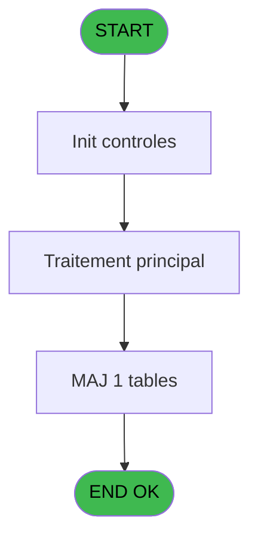

# PBG IDE 264 - Création Import Réponses

> **Analyse**: Phases 1-4 2026-02-03 10:41 -> 10:41 (17s) | Assemblage 10:41
> **Pipeline**: V7.2 Enrichi
> **Structure**: 4 onglets (Resume | Ecrans | Donnees | Connexions)

<!-- TAB:Resume -->

## 1. FICHE D'IDENTITE

| Attribut | Valeur |
|----------|--------|
| Projet | PBG |
| IDE Position | 264 |
| Nom Programme | Création Import Réponses |
| Fichier source | `Prg_264.xml` |
| Domaine metier | General |
| Taches | 1 (0 ecrans visibles) |
| Tables modifiees | 1 |
| Programmes appeles | 0 |

## 2. DESCRIPTION FONCTIONNELLE

**Création Import Réponses** assure la gestion complete de ce processus, accessible depuis [Transfert Ressources (IDE 230)](PBG-IDE-230.md).

Le flux de traitement s'organise en **1 blocs fonctionnels** :

- **Traitement** (1 tache) : traitements metier divers

**Donnees modifiees** : 1 tables en ecriture (vols codes supprimes).

## 3. BLOCS FONCTIONNELS

### 3.1 Traitement (1 tache)

Traitements internes.

---

#### 264 - Création Import Réponses

**Role** : Traitement : Création Import Réponses.
**Variables liees** : B (p. Ligne Import)

## 5. REGLES METIER

*(Aucune regle metier identifiee)*

## 6. CONTEXTE

- **Appele par**: [Transfert Ressources (IDE 230)](PBG-IDE-230.md)
- **Appelle**: 0 programmes | **Tables**: 1 (W:1 R:0 L:0) | **Taches**: 1 | **Expressions**: 11

<!-- TAB:Ecrans -->

## 8. ECRANS

*(Programme sans ecran visible)*

## 9. NAVIGATION

### 9.3 Structure hierarchique (1 tache)

| Position | Tache | Type | Dimensions | Bloc |
|----------|-------|------|------------|------|
| **264.1** | [**Création Import Réponses** (264)](#t1) | - | - | Traitement |

### 9.4 Algorigramme

> **Legende**: Vert = START/END OK | Rouge = END KO | Bleu = Decisions
> *Algorigramme auto-genere. Utiliser `/algorigramme` pour une synthese metier detaillee.*

<!-- TAB:Donnees -->

## 10. TABLES

### Tables utilisees (1)

| ID | Nom | Description | Type | R | W | L | Usages |
|----|-----|-------------|------|---|---|---|--------|
| 809 | vols codes supprimes |  | DB |   | **W** |   | 1 |

### Colonnes par table (1 / 1 tables avec colonnes identifiees)

Table 809 - vols codes supprimes (**W**) - 1 usages

| Lettre | Variable | Acces | Type |
|--------|----------|-------|------|
| A | p. Num Ressource | W | Numeric |
| B | p. Ligne Import | W | Alpha |
| C | p. Nb Reponses | W | Numeric |

## 11. VARIABLES

### 11.1 Parametres entrants (3)

Variables recues du programme appelant ([Transfert Ressources (IDE 230)](PBG-IDE-230.md)).

| Lettre | Nom | Type | Usage dans |
|--------|-----|------|-----------|
| A | p. Num Ressource | Numeric | 8x parametre entrant |
| B | p. Ligne Import | Alpha | - |
| C | p. Nb Reponses | Numeric | - |

## 12. EXPRESSIONS

**11 / 11 expressions decodees (100%)**

### 12.1 Repartition par type

| Type | Expressions | Regles |
|------|-------------|--------|
| CALCULATION | 1 | 0 |
| REFERENCE_VG | 1 | 0 |
| OTHER | 4 | 0 |
| STRING | 5 | 0 |

### 12.2 Expressions cles par type

#### CALCULATION (1 expressions)

| Type | IDE | Expression | Regle |
|------|-----|------------|-------|
| CALCULATION | 11 | `[O]+1` | - |

#### REFERENCE_VG (1 expressions)

| Type | IDE | Expression | Regle |
|------|-----|------------|-------|
| REFERENCE_VG | 1 | `VG20` | - |

#### OTHER (4 expressions)

| Type | IDE | Expression | Regle |
|------|-----|------------|-------|
| OTHER | 9 | `MID(p. Num Ressource [A],46,80)` | - |
| OTHER | 10 | `MID(p. Num Ressource [A],126,6)` | - |
| OTHER | 2 | `[F]` | - |
| OTHER | 8 | `MID(p. Num Ressource [A],40,6)` | - |

#### STRING (5 expressions)

| Type | IDE | Expression | Regle |
|------|-----|------------|-------|
| STRING | 6 | `Val(MID(p. Num Ressource [A],22,9),'9')` | - |
| STRING | 7 | `Val(MID(p. Num Ressource [A],31,9),'9')` | - |
| STRING | 5 | `Val(MID(p. Num Ressource [A],19,3),'3')` | - |
| STRING | 3 | `Val(MID(p. Num Ressource [A],1,9),'9')` | - |
| STRING | 4 | `Val(MID(p. Num Ressource [A],10,9),'9')` | - |

<!-- TAB:Connexions -->

## 13. GRAPHE D'APPELS

### 13.1 Chaine depuis Main (Callers)

Main -> ... -> [Transfert Ressources (IDE 230)](PBG-IDE-230.md) -> **Création Import Réponses (IDE 264)**

### 13.2 Callers

| IDE | Nom Programme | Nb Appels |
|-----|---------------|-----------|
| [230](PBG-IDE-230.md) | Transfert Ressources | 1 |

### 13.3 Callees (programmes appeles)

### 13.4 Detail Callees avec contexte

| IDE | Nom Programme | Appels | Contexte |
|-----|---------------|--------|----------|
| - | (aucun) | - | - |

## 14. RECOMMANDATIONS MIGRATION

### 14.1 Profil du programme

| Metrique | Valeur | Impact migration |
|----------|--------|-----------------|
| Lignes de logique | 27 | Programme compact |
| Expressions | 11 | Peu de logique |
| Tables WRITE | 1 | Impact faible |
| Sous-programmes | 0 | Peu de dependances |
| Ecrans visibles | 0 | Ecran unique ou traitement batch |
| Code desactive | 0% (0 / 27) | Code sain |
| Regles metier | 0 | Pas de regle identifiee |

### 14.2 Plan de migration par bloc

#### Traitement (1 tache: 0 ecran, 1 traitement)

- **Strategie** : 1 service(s) backend injectable(s) (Domain Services).
- Decomposer les taches en services unitaires testables.

### 14.3 Dependances critiques

| Dependance | Type | Appels | Impact |
|------------|------|--------|--------|
| vols codes supprimes | Table WRITE (Database) | 1x | Schema + repository |

---
*Spec DETAILED generee par Pipeline V7.2 - 2026-02-03 10:41*
