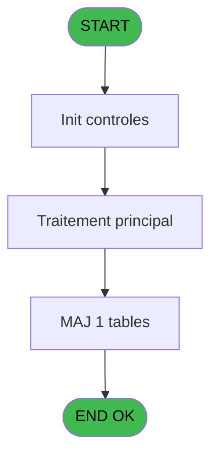
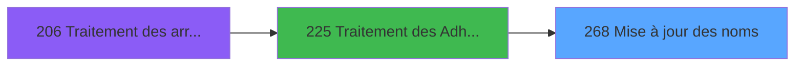

# PBG IDE 268 - Mise à jour des noms

> **Analyse**: Phases 1-4 2026-02-03 10:43 -> 10:43 (19s) | Assemblage 10:43
> **Pipeline**: V7.2 Enrichi
> **Structure**: 4 onglets (Resume | Ecrans | Donnees | Connexions)

<!-- TAB:Resume -->

## 1. FICHE D'IDENTITE

| Attribut | Valeur |
|----------|--------|
| Projet | PBG |
| IDE Position | 268 |
| Nom Programme | Mise à jour des noms |
| Fichier source | `Prg_268.xml` |
| Domaine metier | General |
| Taches | 1 (0 ecrans visibles) |
| Tables modifiees | 1 |
| Programmes appeles | 0 |

## 2. DESCRIPTION FONCTIONNELLE

**Mise à jour des noms** assure la gestion complete de ce processus, accessible depuis [Traitement des Adherents (IDE 225)](PBG-IDE-225.md).

Le flux de traitement s'organise en **1 blocs fonctionnels** :

- **Traitement** (1 tache) : traitements metier divers

**Donnees modifiees** : 1 tables en ecriture (gm-recherche_____gmr).

## 3. BLOCS FONCTIONNELS

### 3.1 Traitement (1 tache)

Traitements internes.

---

#### 268 - Mise à jour des noms

**Role** : Traitement : Mise à jour des noms.

## 5. REGLES METIER

*(Aucune regle metier identifiee)*

## 6. CONTEXTE

- **Appele par**: [Traitement des Adherents (IDE 225)](PBG-IDE-225.md)
- **Appelle**: 0 programmes | **Tables**: 5 (W:1 R:0 L:4) | **Taches**: 1 | **Expressions**: 10

<!-- TAB:Ecrans -->

## 8. ECRANS

*(Programme sans ecran visible)*

## 9. NAVIGATION

### 9.3 Structure hierarchique (1 tache)

| Position | Tache | Type | Dimensions | Bloc |
|----------|-------|------|------------|------|
| **268.1** | [**Mise à jour des noms** (268)](#t1) | - | - | Traitement |

### 9.4 Algorigramme

> **Legende**: Vert = START/END OK | Rouge = END KO | Bleu = Decisions
> *Algorigramme auto-genere. Utiliser `/algorigramme` pour une synthese metier detaillee.*

<!-- TAB:Donnees -->

## 10. TABLES

### Tables utilisees (5)

| ID | Nom | Description | Type | R | W | L | Usages |
|----|-----|-------------|------|---|---|---|--------|
| 30 | gm-recherche_____gmr | Index de recherche | DB |   | **W** |   | 1 |
| 31 | gm-complet_______gmc |  | DB |   |   | L | 1 |
| 36 | client_gm |  | DB |   |   | L | 1 |
| 47 | compte_gm________cgm | Comptes GM (generaux) | DB |   |   | L | 1 |
| 131 | fichier_validation |  | DB |   |   | L | 1 |

### Colonnes par table (2 / 1 tables avec colonnes identifiees)

Table 30 - gm-recherche_____gmr (**W**) - 1 usages

| Lettre | Variable | Acces | Type |
|--------|----------|-------|------|
| A | P.Societe | W | Unicode |
| B | P. Compte | W | Numeric |
| C | P.Filiation | W | Numeric |
| D | P.Nom | W | Unicode |
| E | P.Prenom | W | Unicode |

## 11. VARIABLES

### 11.1 Parametres entrants (5)

Variables recues du programme appelant ([Traitement des Adherents (IDE 225)](PBG-IDE-225.md)).

| Lettre | Nom | Type | Usage dans |
|--------|-----|------|-----------|
| A | P.Societe | Unicode | 1x parametre entrant |
| B | P. Compte | Numeric | 1x parametre entrant |
| C | P.Filiation | Numeric | 1x parametre entrant |
| D | P.Nom | Unicode | 3x parametre entrant |
| E | P.Prenom | Unicode | 4x parametre entrant |

## 12. EXPRESSIONS

**10 / 10 expressions decodees (100%)**

### 12.1 Repartition par type

| Type | Expressions | Regles |
|------|-------------|--------|
| OTHER | 8 | 0 |
| CONCATENATION | 1 | 0 |
| CONDITION | 1 | 0 |

### 12.2 Expressions cles par type

#### OTHER (8 expressions)

| Type | IDE | Expression | Regle |
|------|-----|------------|-------|
| OTHER | 6 | `P.Prenom [E]` | - |
| OTHER | 5 | `Left(P.Prenom [E],8)` | - |
| OTHER | 8 | `Left(P.Prenom [E],10)` | - |
| OTHER | 7 | `Left(P.Nom [D],15)` | - |
| OTHER | 2 | `P.Societe [A]` | - |
| ... | | *+3 autres* | |

#### CONCATENATION (1 expressions)

| Type | IDE | Expression | Regle |
|------|-----|------------|-------|
| CONCATENATION | 9 | `Left(P.Nom [D],15)&' '&Left(P.Prenom [E],8)` | - |

#### CONDITION (1 expressions)

| Type | IDE | Expression | Regle |
|------|-----|------------|-------|
| CONDITION | 10 | `Trim([P])='' AND Trim(VG20)='DSIOP'` | - |

<!-- TAB:Connexions -->

## 13. GRAPHE D'APPELS

### 13.1 Chaine depuis Main (Callers)

Main -> ... -> [Traitement des Adherents (IDE 225)](PBG-IDE-225.md) -> **Mise à jour des noms (IDE 268)**

### 13.2 Callers

| IDE | Nom Programme | Nb Appels |
|-----|---------------|-----------|
| [225](PBG-IDE-225.md) | Traitement des Adherents | 1 |

### 13.3 Callees (programmes appeles)

### 13.4 Detail Callees avec contexte

| IDE | Nom Programme | Appels | Contexte |
|-----|---------------|--------|----------|
| - | (aucun) | - | - |

## 14. RECOMMANDATIONS MIGRATION

### 14.1 Profil du programme

| Metrique | Valeur | Impact migration |
|----------|--------|-----------------|
| Lignes de logique | 59 | Programme compact |
| Expressions | 10 | Peu de logique |
| Tables WRITE | 1 | Impact faible |
| Sous-programmes | 0 | Peu de dependances |
| Ecrans visibles | 0 | Ecran unique ou traitement batch |
| Code desactive | 1.7% (1 / 59) | Code sain |
| Regles metier | 0 | Pas de regle identifiee |

### 14.2 Plan de migration par bloc

#### Traitement (1 tache: 0 ecran, 1 traitement)

- **Strategie** : 1 service(s) backend injectable(s) (Domain Services).
- Decomposer les taches en services unitaires testables.

### 14.3 Dependances critiques

| Dependance | Type | Appels | Impact |
|------------|------|--------|--------|
| gm-recherche_____gmr | Table WRITE (Database) | 1x | Schema + repository |

---
*Spec DETAILED generee par Pipeline V7.2 - 2026-02-03 10:43*
