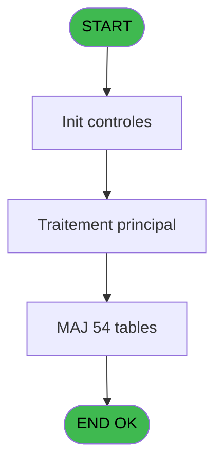
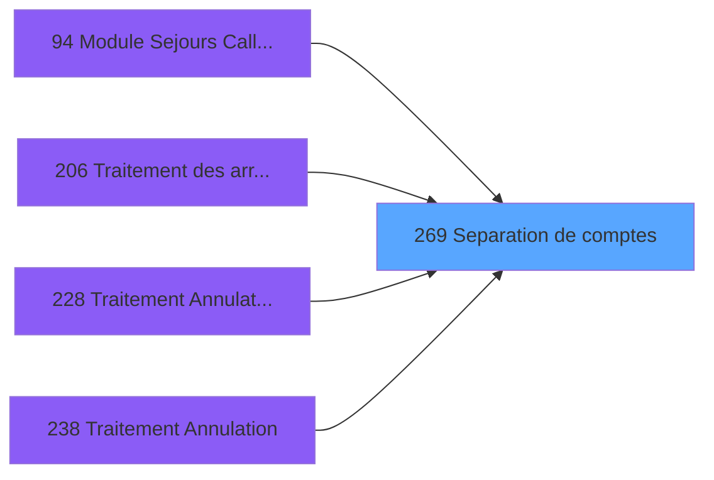

# PBG IDE 269 - Separation de comptes

> **Analyse**: Phases 1-4 2026-02-03 10:43 -> 10:43 (18s) | Assemblage 10:43
> **Pipeline**: V7.2 Enrichi
> **Structure**: 4 onglets (Resume | Ecrans | Donnees | Connexions)

<!-- TAB:Resume -->

## 1. FICHE D'IDENTITE

| Attribut | Valeur |
|----------|--------|
| Projet | PBG |
| IDE Position | 269 |
| Nom Programme | Separation de comptes |
| Fichier source | `Prg_269.xml` |
| Domaine metier | Comptabilite |
| Taches | 57 (1 ecrans visibles) |
| Tables modifiees | 54 |
| Programmes appeles | 1 |

## 2. DESCRIPTION FONCTIONNELLE

**Separation de comptes** assure la gestion complete de ce processus, accessible depuis [Module Sejours CallTask (IDE 0)](PBG-IDE-0.md), [Module Sejours CallTask (IDE 94)](PBG-IDE-94.md), [Traitement des arrivants (IDE 206)](PBG-IDE-206.md), [Traitement Annulation Existant (IDE 228)](PBG-IDE-228.md), [Traitement Annulation (IDE 238)](PBG-IDE-238.md), [Module Sejours SubForm (IDE 391)](PBG-IDE-391.md).

Le flux de traitement s'organise en **2 blocs fonctionnels** :

- **Traitement** (56 taches) : traitements metier divers
- **Calcul** (1 tache) : calculs de montants, stocks ou compteurs

**Donnees modifiees** : 54 tables en ecriture (transac_entete_bar, bl_detail, comptes_speciaux_spc, voyages__________voy, gm-recherche_____gmr, gm-complet_______gmc, prestations, prestations______pre, hebergement______heb, personnel_go______go, client_gm, commentaire_gm_________acc, comptable_gratuite, depot_garantie___dga, comptable________cte, depot_objets_____doa, depot_devises____dda, solde_devises____sda, change___________chg, mvt_prestation___mpr, compte_gm________cgm, compteurs________cpt, cartes_a_memoire_cam, gratuites________gra, codes_autocom____aut, vendeurs_________ven, fichier_messagerie, fichier_validation, fichier_histotel, change_vente_____chg, bibop____________bib, troncon__________tro, heb_circuit______hci, commentaire______com, transactions_____tra, chargements______cha, carte_pme________car, int_saisie_trans_tra, cc_comptable, cc_total_par_type, cc_total, cc_type_detail, ez_card, fid_cumul, import_mod, heure_de_passage, comptage_caisse, pms_chained_listing, vente_par_moyen_paiement, plafond_lit, pv_globalca_prepaid, num_tpe_par_service, ##_pv_rentals_dat, Table_948).

Detail : phases du traitement

#### Phase 1 : Traitement (56 taches)

- **269** - Veuillez patienter ... **[[ECRAN]](#ecran-t1)**
- **269.1** - (sans nom) **[[ECRAN]](#ecran-t2)**
- **269.2** - (sans nom) **[[ECRAN]](#ecran-t3)**
- **269.2.1** - (sans nom) **[[ECRAN]](#ecran-t4)**
- **269.2.2** - (sans nom) **[[ECRAN]](#ecran-t5)**
- **269.2.3** - (sans nom) **[[ECRAN]](#ecran-t6)**
- **269.2.4** - (sans nom) **[[ECRAN]](#ecran-t7)**
- **269.2.5** - (sans nom) **[[ECRAN]](#ecran-t8)**
- **269.2.6** - (sans nom) **[[ECRAN]](#ecran-t9)**
- **269.2.7** - (sans nom) **[[ECRAN]](#ecran-t10)**
- **269.2.8** - (sans nom) **[[ECRAN]](#ecran-t11)**
- **269.2.9** - (sans nom) **[[ECRAN]](#ecran-t12)**
- **269.2.10** - (sans nom) **[[ECRAN]](#ecran-t13)**
- **269.2.11** - (sans nom) **[[ECRAN]](#ecran-t14)**
- **269.2.12** - (sans nom) **[[ECRAN]](#ecran-t15)**
- **269.2.13** - (sans nom) **[[ECRAN]](#ecran-t16)**
- **269.2.14** - (sans nom) **[[ECRAN]](#ecran-t17)**
- **269.2.15** - (sans nom) **[[ECRAN]](#ecran-t18)**
- **269.2.16** - (sans nom) **[[ECRAN]](#ecran-t19)**
- **269.2.17** - (sans nom) **[[ECRAN]](#ecran-t20)**
- **269.2.18** - (sans nom) **[[ECRAN]](#ecran-t21)**
- **269.2.19** - (sans nom) **[[ECRAN]](#ecran-t22)**
- **269.2.20** - (sans nom) **[[ECRAN]](#ecran-t23)**
- **269.2.21** - (sans nom) **[[ECRAN]](#ecran-t24)**
- **269.2.22** - (sans nom) **[[ECRAN]](#ecran-t25)**
- **269.2.23** - (sans nom) **[[ECRAN]](#ecran-t26)**
- **269.2.24** - (sans nom) **[[ECRAN]](#ecran-t27)**
- **269.2.25** - (sans nom) **[[ECRAN]](#ecran-t28)**
- **269.2.26** - (sans nom) **[[ECRAN]](#ecran-t29)**
- **269.2.27** - (sans nom) **[[ECRAN]](#ecran-t30)**
- **269.2.28** - (sans nom) **[[ECRAN]](#ecran-t31)**
- **269.2.29** - (sans nom) **[[ECRAN]](#ecran-t32)**
- **269.2.30** - (sans nom) **[[ECRAN]](#ecran-t33)**
- **269.2.31** - (sans nom) **[[ECRAN]](#ecran-t34)**
- **269.2.32** - (sans nom) **[[ECRAN]](#ecran-t35)**
- **269.2.33** - (sans nom) **[[ECRAN]](#ecran-t36)**
- **269.2.34** - (sans nom) **[[ECRAN]](#ecran-t37)**
- **269.2.35** - (sans nom) **[[ECRAN]](#ecran-t38)**
- **269.2.36** - (sans nom) **[[ECRAN]](#ecran-t39)**
- **269.2.37** - (sans nom) **[[ECRAN]](#ecran-t40)**
- **269.2.38** - (sans nom) **[[ECRAN]](#ecran-t41)**
- **269.2.39** - (sans nom) **[[ECRAN]](#ecran-t42)**
- **269.2.40** - (sans nom) **[[ECRAN]](#ecran-t43)**
- **269.3** - (sans nom) **[[ECRAN]](#ecran-t44)**
- **269.4** - (sans nom) **[[ECRAN]](#ecran-t45)**
- **269.5** - (sans nom) **[[ECRAN]](#ecran-t46)**
- **269.6** - (sans nom) **[[ECRAN]](#ecran-t47)**
- **269.7.1** - Determination Periodes
- **269.2.41** - (sans nom) **[[ECRAN]](#ecran-t52)**
- **269.2.42** - (sans nom) **[[ECRAN]](#ecran-t59)**
- **269.2.43** - (sans nom) **[[ECRAN]](#ecran-t62)**
- **269.2.44** - (sans nom) **[[ECRAN]](#ecran-t65)**
- **269.2.45** - (sans nom) **[[ECRAN]](#ecran-t68)**
- **269.2.46** - (sans nom) **[[ECRAN]](#ecran-t71)**
- **269.2.47** - (sans nom) **[[ECRAN]](#ecran-t74)**
- **269.2.48** - (sans nom) **[[ECRAN]](#ecran-t77)**

Delegue a : [GM separes en modif 2 (IDE 131)](PBG-IDE-131.md)

#### Phase 2 : Calcul (1 tache)

- **269.7** - Creation Compte

#### Tables impactees

| Table | Operations | Role metier |
|-------|-----------|-------------|
| compte_gm________cgm | R/**W** (3 usages) | Comptes GM (generaux) |
| hebergement______heb | R/**W** (2 usages) | Hebergement (chambres) |
| compteurs________cpt | **W** (1 usages) | Comptes GM (generaux) |
| depot_garantie___dga | **W** (1 usages) | Depots et garanties |
| prestations______pre | **W** (1 usages) | Prestations/services vendus |
| transac_entete_bar | **W** (1 usages) |  |
| vendeurs_________ven | **W** (1 usages) |  |
| mvt_prestation___mpr | **W** (1 usages) | Prestations/services vendus |
| comptable________cte | **W** (1 usages) |  |
| personnel_go______go | **W** (1 usages) |  |
| ez_card | **W** (1 usages) |  |
| commentaire_gm_________acc | **W** (1 usages) |  |
| cc_comptable | **W** (1 usages) |  |
| comptes_speciaux_spc | **W** (1 usages) | Comptes GM (generaux) |
| plafond_lit | **W** (1 usages) |  |
| Table_948 | **W** (1 usages) |  |
| cc_type_detail | **W** (1 usages) |  |
| gm-complet_______gmc | **W** (1 usages) |  |
| ##_pv_rentals_dat | **W** (1 usages) |  |
| gratuites________gra | **W** (1 usages) |  |
| prestations | **W** (1 usages) | Prestations/services vendus |
| chargements______cha | **W** (1 usages) |  |
| pv_globalca_prepaid | **W** (1 usages) |  |
| transactions_____tra | **W** (1 usages) |  |
| heure_de_passage | **W** (1 usages) |  |
| depot_devises____dda | **W** (1 usages) | Depots et garanties |
| troncon__________tro | **W** (1 usages) |  |
| import_mod | **W** (1 usages) |  |
| fichier_histotel | **W** (1 usages) | Historique / journal |
| commentaire______com | **W** (1 usages) |  |
| vente_par_moyen_paiement | **W** (1 usages) | Donnees de ventes |
| solde_devises____sda | **W** (1 usages) | Devises / taux de change |
| comptage_caisse | **W** (1 usages) | Sessions de caisse |
| change___________chg | **W** (1 usages) |  |
| heb_circuit______hci | **W** (1 usages) | Hebergement (chambres) |
| cartes_a_memoire_cam | **W** (1 usages) |  |
| depot_objets_____doa | **W** (1 usages) | Depots et garanties |
| fid_cumul | **W** (1 usages) |  |
| carte_pme________car | **W** (1 usages) |  |
| cc_total_par_type | **W** (1 usages) |  |
| num_tpe_par_service | **W** (1 usages) | Services / filieres |
| bl_detail | **W** (1 usages) |  |
| int_saisie_trans_tra | **W** (1 usages) |  |
| voyages__________voy | **W** (1 usages) |  |
| fichier_messagerie | **W** (1 usages) |  |
| change_vente_____chg | **W** (1 usages) | Donnees de ventes |
| comptable_gratuite | **W** (1 usages) |  |
| codes_autocom____aut | **W** (1 usages) |  |
| client_gm | **W** (1 usages) |  |
| bibop____________bib | **W** (1 usages) |  |
| gm-recherche_____gmr | **W** (1 usages) | Index de recherche |
| pms_chained_listing | **W** (1 usages) |  |
| fichier_validation | **W** (1 usages) |  |
| cc_total | **W** (1 usages) |  |

## 3. BLOCS FONCTIONNELS

### 3.1 Traitement (56 taches)

Traitements internes.

---

#### 269 - Veuillez patienter ... [[ECRAN]](#ecran-t1)

**Role** : Tache d'orchestration : point d'entree du programme (56 sous-taches). Coordonne l'enchainement des traitements.
**Ecran** : 427 x 60 DLU (MDI) | [Voir mockup](#ecran-t1)

55 sous-taches directes

| Tache | Nom | Bloc |
|-------|-----|------|
| [269.1](#t2) | (sans nom) **[[ECRAN]](#ecran-t2)** | Traitement |
| [269.2](#t3) | (sans nom) **[[ECRAN]](#ecran-t3)** | Traitement |
| [269.2.1](#t4) | (sans nom) **[[ECRAN]](#ecran-t4)** | Traitement |
| [269.2.2](#t5) | (sans nom) **[[ECRAN]](#ecran-t5)** | Traitement |
| [269.2.3](#t6) | (sans nom) **[[ECRAN]](#ecran-t6)** | Traitement |
| [269.2.4](#t7) | (sans nom) **[[ECRAN]](#ecran-t7)** | Traitement |
| [269.2.5](#t8) | (sans nom) **[[ECRAN]](#ecran-t8)** | Traitement |
| [269.2.6](#t9) | (sans nom) **[[ECRAN]](#ecran-t9)** | Traitement |
| [269.2.7](#t10) | (sans nom) **[[ECRAN]](#ecran-t10)** | Traitement |
| [269.2.8](#t11) | (sans nom) **[[ECRAN]](#ecran-t11)** | Traitement |
| [269.2.9](#t12) | (sans nom) **[[ECRAN]](#ecran-t12)** | Traitement |
| [269.2.10](#t13) | (sans nom) **[[ECRAN]](#ecran-t13)** | Traitement |
| [269.2.11](#t14) | (sans nom) **[[ECRAN]](#ecran-t14)** | Traitement |
| [269.2.12](#t15) | (sans nom) **[[ECRAN]](#ecran-t15)** | Traitement |
| [269.2.13](#t16) | (sans nom) **[[ECRAN]](#ecran-t16)** | Traitement |
| [269.2.14](#t17) | (sans nom) **[[ECRAN]](#ecran-t17)** | Traitement |
| [269.2.15](#t18) | (sans nom) **[[ECRAN]](#ecran-t18)** | Traitement |
| [269.2.16](#t19) | (sans nom) **[[ECRAN]](#ecran-t19)** | Traitement |
| [269.2.17](#t20) | (sans nom) **[[ECRAN]](#ecran-t20)** | Traitement |
| [269.2.18](#t21) | (sans nom) **[[ECRAN]](#ecran-t21)** | Traitement |
| [269.2.19](#t22) | (sans nom) **[[ECRAN]](#ecran-t22)** | Traitement |
| [269.2.20](#t23) | (sans nom) **[[ECRAN]](#ecran-t23)** | Traitement |
| [269.2.21](#t24) | (sans nom) **[[ECRAN]](#ecran-t24)** | Traitement |
| [269.2.22](#t25) | (sans nom) **[[ECRAN]](#ecran-t25)** | Traitement |
| [269.2.23](#t26) | (sans nom) **[[ECRAN]](#ecran-t26)** | Traitement |
| [269.2.24](#t27) | (sans nom) **[[ECRAN]](#ecran-t27)** | Traitement |
| [269.2.25](#t28) | (sans nom) **[[ECRAN]](#ecran-t28)** | Traitement |
| [269.2.26](#t29) | (sans nom) **[[ECRAN]](#ecran-t29)** | Traitement |
| [269.2.27](#t30) | (sans nom) **[[ECRAN]](#ecran-t30)** | Traitement |
| [269.2.28](#t31) | (sans nom) **[[ECRAN]](#ecran-t31)** | Traitement |
| [269.2.29](#t32) | (sans nom) **[[ECRAN]](#ecran-t32)** | Traitement |
| [269.2.30](#t33) | (sans nom) **[[ECRAN]](#ecran-t33)** | Traitement |
| [269.2.31](#t34) | (sans nom) **[[ECRAN]](#ecran-t34)** | Traitement |
| [269.2.32](#t35) | (sans nom) **[[ECRAN]](#ecran-t35)** | Traitement |
| [269.2.33](#t36) | (sans nom) **[[ECRAN]](#ecran-t36)** | Traitement |
| [269.2.34](#t37) | (sans nom) **[[ECRAN]](#ecran-t37)** | Traitement |
| [269.2.35](#t38) | (sans nom) **[[ECRAN]](#ecran-t38)** | Traitement |
| [269.2.36](#t39) | (sans nom) **[[ECRAN]](#ecran-t39)** | Traitement |
| [269.2.37](#t40) | (sans nom) **[[ECRAN]](#ecran-t40)** | Traitement |
| [269.2.38](#t41) | (sans nom) **[[ECRAN]](#ecran-t41)** | Traitement |
| [269.2.39](#t42) | (sans nom) **[[ECRAN]](#ecran-t42)** | Traitement |
| [269.2.40](#t43) | (sans nom) **[[ECRAN]](#ecran-t43)** | Traitement |
| [269.3](#t44) | (sans nom) **[[ECRAN]](#ecran-t44)** | Traitement |
| [269.4](#t45) | (sans nom) **[[ECRAN]](#ecran-t45)** | Traitement |
| [269.5](#t46) | (sans nom) **[[ECRAN]](#ecran-t46)** | Traitement |
| [269.6](#t47) | (sans nom) **[[ECRAN]](#ecran-t47)** | Traitement |
| [269.7.1](#t49) | Determination Periodes | Traitement |
| [269.2.41](#t52) | (sans nom) **[[ECRAN]](#ecran-t52)** | Traitement |
| [269.2.42](#t59) | (sans nom) **[[ECRAN]](#ecran-t59)** | Traitement |
| [269.2.43](#t62) | (sans nom) **[[ECRAN]](#ecran-t62)** | Traitement |
| [269.2.44](#t65) | (sans nom) **[[ECRAN]](#ecran-t65)** | Traitement |
| [269.2.45](#t68) | (sans nom) **[[ECRAN]](#ecran-t68)** | Traitement |
| [269.2.46](#t71) | (sans nom) **[[ECRAN]](#ecran-t71)** | Traitement |
| [269.2.47](#t74) | (sans nom) **[[ECRAN]](#ecran-t74)** | Traitement |
| [269.2.48](#t77) | (sans nom) **[[ECRAN]](#ecran-t77)** | Traitement |

---

#### 269.1 - (sans nom) [[ECRAN]](#ecran-t2)

**Role** : Traitement interne.
**Ecran** : 148 x 24 DLU (MDI) | [Voir mockup](#ecran-t2)

---

#### 269.2 - (sans nom) [[ECRAN]](#ecran-t3)

**Role** : Traitement interne.
**Ecran** : 296 x 40 DLU (MDI) | [Voir mockup](#ecran-t3)

---

#### 269.2.1 - (sans nom) [[ECRAN]](#ecran-t4)

**Role** : Traitement interne.
**Ecran** : 148 x 24 DLU (MDI) | [Voir mockup](#ecran-t4)

---

#### 269.2.2 - (sans nom) [[ECRAN]](#ecran-t5)

**Role** : Traitement interne.
**Ecran** : 148 x 24 DLU (MDI) | [Voir mockup](#ecran-t5)

---

#### 269.2.3 - (sans nom) [[ECRAN]](#ecran-t6)

**Role** : Traitement interne.
**Ecran** : 148 x 24 DLU (MDI) | [Voir mockup](#ecran-t6)

---

#### 269.2.4 - (sans nom) [[ECRAN]](#ecran-t7)

**Role** : Traitement interne.
**Ecran** : 148 x 24 DLU (MDI) | [Voir mockup](#ecran-t7)

---

#### 269.2.5 - (sans nom) [[ECRAN]](#ecran-t8)

**Role** : Traitement interne.
**Ecran** : 148 x 24 DLU (MDI) | [Voir mockup](#ecran-t8)

---

#### 269.2.6 - (sans nom) [[ECRAN]](#ecran-t9)

**Role** : Traitement interne.
**Ecran** : 148 x 24 DLU (MDI) | [Voir mockup](#ecran-t9)

---

#### 269.2.7 - (sans nom) [[ECRAN]](#ecran-t10)

**Role** : Traitement interne.
**Ecran** : 148 x 24 DLU (MDI) | [Voir mockup](#ecran-t10)

---

#### 269.2.8 - (sans nom) [[ECRAN]](#ecran-t11)

**Role** : Traitement interne.
**Ecran** : 148 x 24 DLU (MDI) | [Voir mockup](#ecran-t11)

---

#### 269.2.9 - (sans nom) [[ECRAN]](#ecran-t12)

**Role** : Traitement interne.
**Ecran** : 148 x 24 DLU (MDI) | [Voir mockup](#ecran-t12)

---

#### 269.2.10 - (sans nom) [[ECRAN]](#ecran-t13)

**Role** : Traitement interne.
**Ecran** : 148 x 24 DLU (MDI) | [Voir mockup](#ecran-t13)

---

#### 269.2.11 - (sans nom) [[ECRAN]](#ecran-t14)

**Role** : Traitement interne.
**Ecran** : 148 x 24 DLU (MDI) | [Voir mockup](#ecran-t14)

---

#### 269.2.12 - (sans nom) [[ECRAN]](#ecran-t15)

**Role** : Traitement interne.
**Ecran** : 148 x 24 DLU (MDI) | [Voir mockup](#ecran-t15)

---

#### 269.2.13 - (sans nom) [[ECRAN]](#ecran-t16)

**Role** : Traitement interne.
**Ecran** : 148 x 24 DLU (MDI) | [Voir mockup](#ecran-t16)

---

#### 269.2.14 - (sans nom) [[ECRAN]](#ecran-t17)

**Role** : Traitement interne.
**Ecran** : 148 x 24 DLU (MDI) | [Voir mockup](#ecran-t17)

---

#### 269.2.15 - (sans nom) [[ECRAN]](#ecran-t18)

**Role** : Traitement interne.
**Ecran** : 148 x 24 DLU (MDI) | [Voir mockup](#ecran-t18)

---

#### 269.2.16 - (sans nom) [[ECRAN]](#ecran-t19)

**Role** : Traitement interne.
**Ecran** : 148 x 24 DLU (MDI) | [Voir mockup](#ecran-t19)

---

#### 269.2.17 - (sans nom) [[ECRAN]](#ecran-t20)

**Role** : Traitement interne.
**Ecran** : 148 x 24 DLU (MDI) | [Voir mockup](#ecran-t20)

---

#### 269.2.18 - (sans nom) [[ECRAN]](#ecran-t21)

**Role** : Traitement interne.
**Ecran** : 148 x 24 DLU (MDI) | [Voir mockup](#ecran-t21)

---

#### 269.2.19 - (sans nom) [[ECRAN]](#ecran-t22)

**Role** : Traitement interne.
**Ecran** : 148 x 24 DLU (MDI) | [Voir mockup](#ecran-t22)

---

#### 269.2.20 - (sans nom) [[ECRAN]](#ecran-t23)

**Role** : Traitement interne.
**Ecran** : 148 x 24 DLU (MDI) | [Voir mockup](#ecran-t23)

---

#### 269.2.21 - (sans nom) [[ECRAN]](#ecran-t24)

**Role** : Traitement interne.
**Ecran** : 148 x 24 DLU (MDI) | [Voir mockup](#ecran-t24)

---

#### 269.2.22 - (sans nom) [[ECRAN]](#ecran-t25)

**Role** : Traitement interne.
**Ecran** : 148 x 24 DLU (MDI) | [Voir mockup](#ecran-t25)

---

#### 269.2.23 - (sans nom) [[ECRAN]](#ecran-t26)

**Role** : Traitement interne.
**Ecran** : 148 x 24 DLU (MDI) | [Voir mockup](#ecran-t26)

---

#### 269.2.24 - (sans nom) [[ECRAN]](#ecran-t27)

**Role** : Traitement interne.
**Ecran** : 148 x 24 DLU (MDI) | [Voir mockup](#ecran-t27)

---

#### 269.2.25 - (sans nom) [[ECRAN]](#ecran-t28)

**Role** : Traitement interne.
**Ecran** : 148 x 24 DLU (MDI) | [Voir mockup](#ecran-t28)

---

#### 269.2.26 - (sans nom) [[ECRAN]](#ecran-t29)

**Role** : Traitement interne.
**Ecran** : 148 x 24 DLU (MDI) | [Voir mockup](#ecran-t29)

---

#### 269.2.27 - (sans nom) [[ECRAN]](#ecran-t30)

**Role** : Traitement interne.
**Ecran** : 148 x 24 DLU (MDI) | [Voir mockup](#ecran-t30)

---

#### 269.2.28 - (sans nom) [[ECRAN]](#ecran-t31)

**Role** : Traitement interne.
**Ecran** : 148 x 24 DLU (MDI) | [Voir mockup](#ecran-t31)

---

#### 269.2.29 - (sans nom) [[ECRAN]](#ecran-t32)

**Role** : Traitement interne.
**Ecran** : 148 x 24 DLU (MDI) | [Voir mockup](#ecran-t32)

---

#### 269.2.30 - (sans nom) [[ECRAN]](#ecran-t33)

**Role** : Traitement interne.
**Ecran** : 148 x 24 DLU (MDI) | [Voir mockup](#ecran-t33)

---

#### 269.2.31 - (sans nom) [[ECRAN]](#ecran-t34)

**Role** : Traitement interne.
**Ecran** : 148 x 24 DLU (MDI) | [Voir mockup](#ecran-t34)

---

#### 269.2.32 - (sans nom) [[ECRAN]](#ecran-t35)

**Role** : Traitement interne.
**Ecran** : 148 x 24 DLU (MDI) | [Voir mockup](#ecran-t35)

---

#### 269.2.33 - (sans nom) [[ECRAN]](#ecran-t36)

**Role** : Traitement interne.
**Ecran** : 148 x 24 DLU (MDI) | [Voir mockup](#ecran-t36)

---

#### 269.2.34 - (sans nom) [[ECRAN]](#ecran-t37)

**Role** : Traitement interne.
**Ecran** : 148 x 24 DLU (MDI) | [Voir mockup](#ecran-t37)

---

#### 269.2.35 - (sans nom) [[ECRAN]](#ecran-t38)

**Role** : Traitement interne.
**Ecran** : 148 x 24 DLU (MDI) | [Voir mockup](#ecran-t38)

---

#### 269.2.36 - (sans nom) [[ECRAN]](#ecran-t39)

**Role** : Traitement interne.
**Ecran** : 148 x 24 DLU (MDI) | [Voir mockup](#ecran-t39)

---

#### 269.2.37 - (sans nom) [[ECRAN]](#ecran-t40)

**Role** : Traitement interne.
**Ecran** : 148 x 24 DLU (MDI) | [Voir mockup](#ecran-t40)

---

#### 269.2.38 - (sans nom) [[ECRAN]](#ecran-t41)

**Role** : Traitement interne.
**Ecran** : 148 x 24 DLU (MDI) | [Voir mockup](#ecran-t41)

---

#### 269.2.39 - (sans nom) [[ECRAN]](#ecran-t42)

**Role** : Traitement interne.
**Ecran** : 148 x 24 DLU (MDI) | [Voir mockup](#ecran-t42)

---

#### 269.2.40 - (sans nom) [[ECRAN]](#ecran-t43)

**Role** : Traitement interne.
**Ecran** : 148 x 24 DLU (MDI) | [Voir mockup](#ecran-t43)

---

#### 269.3 - (sans nom) [[ECRAN]](#ecran-t44)

**Role** : Traitement interne.
**Ecran** : 148 x 24 DLU (MDI) | [Voir mockup](#ecran-t44)

---

#### 269.4 - (sans nom) [[ECRAN]](#ecran-t45)

**Role** : Traitement interne.
**Ecran** : 148 x 24 DLU (MDI) | [Voir mockup](#ecran-t45)

---

#### 269.5 - (sans nom) [[ECRAN]](#ecran-t46)

**Role** : Traitement interne.
**Ecran** : 148 x 24 DLU (MDI) | [Voir mockup](#ecran-t46)

---

#### 269.6 - (sans nom) [[ECRAN]](#ecran-t47)

**Role** : Traitement interne.
**Ecran** : 148 x 24 DLU (MDI) | [Voir mockup](#ecran-t47)

---

#### 269.7.1 - Determination Periodes

**Role** : Traitement : Determination Periodes.

---

#### 269.2.41 - (sans nom) [[ECRAN]](#ecran-t52)

**Role** : Traitement interne.
**Ecran** : 148 x 24 DLU (MDI) | [Voir mockup](#ecran-t52)

---

#### 269.2.42 - (sans nom) [[ECRAN]](#ecran-t59)

**Role** : Traitement interne.
**Ecran** : 148 x 24 DLU (MDI) | [Voir mockup](#ecran-t59)

---

#### 269.2.43 - (sans nom) [[ECRAN]](#ecran-t62)

**Role** : Traitement interne.
**Ecran** : 148 x 24 DLU (MDI) | [Voir mockup](#ecran-t62)

---

#### 269.2.44 - (sans nom) [[ECRAN]](#ecran-t65)

**Role** : Traitement interne.
**Ecran** : 148 x 24 DLU (MDI) | [Voir mockup](#ecran-t65)

---

#### 269.2.45 - (sans nom) [[ECRAN]](#ecran-t68)

**Role** : Traitement interne.
**Ecran** : 148 x 24 DLU (MDI) | [Voir mockup](#ecran-t68)

---

#### 269.2.46 - (sans nom) [[ECRAN]](#ecran-t71)

**Role** : Traitement interne.
**Ecran** : 148 x 24 DLU (MDI) | [Voir mockup](#ecran-t71)

---

#### 269.2.47 - (sans nom) [[ECRAN]](#ecran-t74)

**Role** : Traitement interne.
**Ecran** : 148 x 24 DLU (MDI) | [Voir mockup](#ecran-t74)

---

#### 269.2.48 - (sans nom) [[ECRAN]](#ecran-t77)

**Role** : Traitement interne.
**Ecran** : 148 x 24 DLU (MDI) | [Voir mockup](#ecran-t77)

### 3.2 Calcul (1 tache)

Calculs metier : montants, stocks, compteurs.

---

#### 269.7 - Creation Compte

**Role** : Creation d'enregistrement : Creation Compte.
**Variables liees** : D (W0 n° compteur), I (W0 Retour Compte)

## 5. REGLES METIER

*(Aucune regle metier identifiee)*

## 6. CONTEXTE

- **Appele par**: [Module Sejours CallTask (IDE 0)](PBG-IDE-0.md), [Module Sejours CallTask (IDE 94)](PBG-IDE-94.md), [Traitement des arrivants (IDE 206)](PBG-IDE-206.md), [Traitement Annulation Existant (IDE 228)](PBG-IDE-228.md), [Traitement Annulation (IDE 238)](PBG-IDE-238.md), [Module Sejours SubForm (IDE 391)](PBG-IDE-391.md)
- **Appelle**: 1 programmes | **Tables**: 54 (W:54 R:2 L:0) | **Taches**: 57 | **Expressions**: 6

<!-- TAB:Ecrans -->

## 8. ECRANS

### 8.1 Forms visibles (1 / 57)

| # | Position | Tache | Nom | Type | Largeur | Hauteur | Bloc |
|---|----------|-------|-----|------|---------|---------|------|
| 1 | 269 | 269 | Veuillez patienter ... | MDI | 427 | 60 | Traitement |

### 8.2 Mockups Ecrans

---

#### 269 - Veuillez patienter ...
**Tache** : [269](#t1) | **Type** : MDI | **Dimensions** : 427 x 60 DLU
**Bloc** : Traitement | **Titre IDE** : Veuillez patienter ...

<!-- FORM-DATA:
{
    "width":  427,
    "vFactor":  8,
    "type":  "MDI",
    "hFactor":  8,
    "controls":  [
                     {
                         "x":  0,
                         "type":  "label",
                         "var":  "",
                         "y":  0,
                         "w":  423,
                         "fmt":  "",
                         "name":  "",
                         "h":  29,
                         "color":  "",
                         "text":  "",
                         "parent":  null
                     },
                     {
                         "x":  120,
                         "type":  "label",
                         "var":  "",
                         "y":  10,
                         "w":  221,
                         "fmt":  "",
                         "name":  "",
                         "h":  8,
                         "color":  "7",
                         "text":  "Suppression en cours ...",
                         "parent":  null
                     },
                     {
                         "x":  0,
                         "type":  "label",
                         "var":  "",
                         "y":  29,
                         "w":  423,
                         "fmt":  "",
                         "name":  "",
                         "h":  27,
                         "color":  "",
                         "text":  "",
                         "parent":  null
                     },
                     {
                         "x":  72,
                         "type":  "label",
                         "var":  "",
                         "y":  38,
                         "w":  280,
                         "fmt":  "",
                         "name":  "",
                         "h":  8,
                         "color":  "",
                         "text":  "OCA Separation de comptes",
                         "parent":  null
                     },
                     {
                         "x":  4,
                         "type":  "image",
                         "var":  "",
                         "y":  2,
                         "w":  72,
                         "fmt":  "",
                         "name":  "",
                         "h":  25,
                         "color":  "",
                         "text":  "",
                         "parent":  null
                     }
                 ],
    "taskId":  "269",
    "height":  60
}
-->

## 9. NAVIGATION

Ecran unique: **Veuillez patienter ...**

### 9.3 Structure hierarchique (57 taches)

| Position | Tache | Type | Dimensions | Bloc |
|----------|-------|------|------------|------|
| **269.1** | [**Veuillez patienter ...** (269)](#t1) [mockup](#ecran-t1) | MDI | 427x60 | Traitement |
| 269.1.1 | [(sans nom) (269.1)](#t2) [mockup](#ecran-t2) | MDI | 148x24 | |
| 269.1.2 | [(sans nom) (269.2)](#t3) [mockup](#ecran-t3) | MDI | 296x40 | |
| 269.1.3 | [(sans nom) (269.2.1)](#t4) [mockup](#ecran-t4) | MDI | 148x24 | |
| 269.1.4 | [(sans nom) (269.2.2)](#t5) [mockup](#ecran-t5) | MDI | 148x24 | |
| 269.1.5 | [(sans nom) (269.2.3)](#t6) [mockup](#ecran-t6) | MDI | 148x24 | |
| 269.1.6 | [(sans nom) (269.2.4)](#t7) [mockup](#ecran-t7) | MDI | 148x24 | |
| 269.1.7 | [(sans nom) (269.2.5)](#t8) [mockup](#ecran-t8) | MDI | 148x24 | |
| 269.1.8 | [(sans nom) (269.2.6)](#t9) [mockup](#ecran-t9) | MDI | 148x24 | |
| 269.1.9 | [(sans nom) (269.2.7)](#t10) [mockup](#ecran-t10) | MDI | 148x24 | |
| 269.1.10 | [(sans nom) (269.2.8)](#t11) [mockup](#ecran-t11) | MDI | 148x24 | |
| 269.1.11 | [(sans nom) (269.2.9)](#t12) [mockup](#ecran-t12) | MDI | 148x24 | |
| 269.1.12 | [(sans nom) (269.2.10)](#t13) [mockup](#ecran-t13) | MDI | 148x24 | |
| 269.1.13 | [(sans nom) (269.2.11)](#t14) [mockup](#ecran-t14) | MDI | 148x24 | |
| 269.1.14 | [(sans nom) (269.2.12)](#t15) [mockup](#ecran-t15) | MDI | 148x24 | |
| 269.1.15 | [(sans nom) (269.2.13)](#t16) [mockup](#ecran-t16) | MDI | 148x24 | |
| 269.1.16 | [(sans nom) (269.2.14)](#t17) [mockup](#ecran-t17) | MDI | 148x24 | |
| 269.1.17 | [(sans nom) (269.2.15)](#t18) [mockup](#ecran-t18) | MDI | 148x24 | |
| 269.1.18 | [(sans nom) (269.2.16)](#t19) [mockup](#ecran-t19) | MDI | 148x24 | |
| 269.1.19 | [(sans nom) (269.2.17)](#t20) [mockup](#ecran-t20) | MDI | 148x24 | |
| 269.1.20 | [(sans nom) (269.2.18)](#t21) [mockup](#ecran-t21) | MDI | 148x24 | |
| 269.1.21 | [(sans nom) (269.2.19)](#t22) [mockup](#ecran-t22) | MDI | 148x24 | |
| 269.1.22 | [(sans nom) (269.2.20)](#t23) [mockup](#ecran-t23) | MDI | 148x24 | |
| 269.1.23 | [(sans nom) (269.2.21)](#t24) [mockup](#ecran-t24) | MDI | 148x24 | |
| 269.1.24 | [(sans nom) (269.2.22)](#t25) [mockup](#ecran-t25) | MDI | 148x24 | |
| 269.1.25 | [(sans nom) (269.2.23)](#t26) [mockup](#ecran-t26) | MDI | 148x24 | |
| 269.1.26 | [(sans nom) (269.2.24)](#t27) [mockup](#ecran-t27) | MDI | 148x24 | |
| 269.1.27 | [(sans nom) (269.2.25)](#t28) [mockup](#ecran-t28) | MDI | 148x24 | |
| 269.1.28 | [(sans nom) (269.2.26)](#t29) [mockup](#ecran-t29) | MDI | 148x24 | |
| 269.1.29 | [(sans nom) (269.2.27)](#t30) [mockup](#ecran-t30) | MDI | 148x24 | |
| 269.1.30 | [(sans nom) (269.2.28)](#t31) [mockup](#ecran-t31) | MDI | 148x24 | |
| 269.1.31 | [(sans nom) (269.2.29)](#t32) [mockup](#ecran-t32) | MDI | 148x24 | |
| 269.1.32 | [(sans nom) (269.2.30)](#t33) [mockup](#ecran-t33) | MDI | 148x24 | |
| 269.1.33 | [(sans nom) (269.2.31)](#t34) [mockup](#ecran-t34) | MDI | 148x24 | |
| 269.1.34 | [(sans nom) (269.2.32)](#t35) [mockup](#ecran-t35) | MDI | 148x24 | |
| 269.1.35 | [(sans nom) (269.2.33)](#t36) [mockup](#ecran-t36) | MDI | 148x24 | |
| 269.1.36 | [(sans nom) (269.2.34)](#t37) [mockup](#ecran-t37) | MDI | 148x24 | |
| 269.1.37 | [(sans nom) (269.2.35)](#t38) [mockup](#ecran-t38) | MDI | 148x24 | |
| 269.1.38 | [(sans nom) (269.2.36)](#t39) [mockup](#ecran-t39) | MDI | 148x24 | |
| 269.1.39 | [(sans nom) (269.2.37)](#t40) [mockup](#ecran-t40) | MDI | 148x24 | |
| 269.1.40 | [(sans nom) (269.2.38)](#t41) [mockup](#ecran-t41) | MDI | 148x24 | |
| 269.1.41 | [(sans nom) (269.2.39)](#t42) [mockup](#ecran-t42) | MDI | 148x24 | |
| 269.1.42 | [(sans nom) (269.2.40)](#t43) [mockup](#ecran-t43) | MDI | 148x24 | |
| 269.1.43 | [(sans nom) (269.3)](#t44) [mockup](#ecran-t44) | MDI | 148x24 | |
| 269.1.44 | [(sans nom) (269.4)](#t45) [mockup](#ecran-t45) | MDI | 148x24 | |
| 269.1.45 | [(sans nom) (269.5)](#t46) [mockup](#ecran-t46) | MDI | 148x24 | |
| 269.1.46 | [(sans nom) (269.6)](#t47) [mockup](#ecran-t47) | MDI | 148x24 | |
| 269.1.47 | [Determination Periodes (269.7.1)](#t49) | MDI | - | |
| 269.1.48 | [(sans nom) (269.2.41)](#t52) [mockup](#ecran-t52) | MDI | 148x24 | |
| 269.1.49 | [(sans nom) (269.2.42)](#t59) [mockup](#ecran-t59) | MDI | 148x24 | |
| 269.1.50 | [(sans nom) (269.2.43)](#t62) [mockup](#ecran-t62) | MDI | 148x24 | |
| 269.1.51 | [(sans nom) (269.2.44)](#t65) [mockup](#ecran-t65) | MDI | 148x24 | |
| 269.1.52 | [(sans nom) (269.2.45)](#t68) [mockup](#ecran-t68) | MDI | 148x24 | |
| 269.1.53 | [(sans nom) (269.2.46)](#t71) [mockup](#ecran-t71) | MDI | 148x24 | |
| 269.1.54 | [(sans nom) (269.2.47)](#t74) [mockup](#ecran-t74) | MDI | 148x24 | |
| 269.1.55 | [(sans nom) (269.2.48)](#t77) [mockup](#ecran-t77) | MDI | 148x24 | |
| **269.2** | [**Creation Compte** (269.7)](#t48) | MDI | - | Calcul |

### 9.4 Algorigramme

> **Legende**: Vert = START/END OK | Rouge = END KO | Bleu = Decisions
> *Algorigramme auto-genere. Utiliser `/algorigramme` pour une synthese metier detaillee.*

<!-- TAB:Donnees -->

## 10. TABLES

### Tables utilisees (54)

| ID | Nom | Description | Type | R | W | L | Usages |
|----|-----|-------------|------|---|---|---|--------|
| 15 | transac_entete_bar |  | DB |   | **W** |   | 1 |
| 19 | bl_detail |  | DB |   | **W** |   | 1 |
| 26 | comptes_speciaux_spc | Comptes GM (generaux) | DB |   | **W** |   | 1 |
| 29 | voyages__________voy |  | DB |   | **W** |   | 1 |
| 30 | gm-recherche_____gmr | Index de recherche | DB |   | **W** |   | 1 |
| 31 | gm-complet_______gmc |  | DB |   | **W** |   | 1 |
| 32 | prestations | Prestations/services vendus | DB |   | **W** |   | 1 |
| 33 | prestations______pre | Prestations/services vendus | DB |   | **W** |   | 1 |
| 34 | hebergement______heb | Hebergement (chambres) | DB | R | **W** |   | 2 |
| 35 | personnel_go______go |  | DB |   | **W** |   | 1 |
| 36 | client_gm |  | DB |   | **W** |   | 1 |
| 37 | commentaire_gm_________acc |  | DB |   | **W** |   | 1 |
| 38 | comptable_gratuite |  | DB |   | **W** |   | 1 |
| 39 | depot_garantie___dga | Depots et garanties | DB |   | **W** |   | 1 |
| 40 | comptable________cte |  | DB |   | **W** |   | 1 |
| 41 | depot_objets_____doa | Depots et garanties | DB |   | **W** |   | 1 |
| 42 | depot_devises____dda | Depots et garanties | DB |   | **W** |   | 1 |
| 43 | solde_devises____sda | Devises / taux de change | DB |   | **W** |   | 1 |
| 44 | change___________chg |  | DB |   | **W** |   | 1 |
| 46 | mvt_prestation___mpr | Prestations/services vendus | DB |   | **W** |   | 1 |
| 47 | compte_gm________cgm | Comptes GM (generaux) | DB | R | **W** |   | 3 |
| 68 | compteurs________cpt | Comptes GM (generaux) | DB |   | **W** |   | 1 |
| 76 | cartes_a_memoire_cam |  | DB |   | **W** |   | 1 |
| 79 | gratuites________gra |  | DB |   | **W** |   | 1 |
| 80 | codes_autocom____aut |  | DB |   | **W** |   | 1 |
| 93 | vendeurs_________ven |  | DB |   | **W** |   | 1 |
| 123 | fichier_messagerie |  | DB |   | **W** |   | 1 |
| 131 | fichier_validation |  | DB |   | **W** |   | 1 |
| 137 | fichier_histotel | Historique / journal | DB |   | **W** |   | 1 |
| 147 | change_vente_____chg | Donnees de ventes | DB |   | **W** |   | 1 |
| 160 | bibop____________bib |  | DB |   | **W** |   | 1 |
| 167 | troncon__________tro |  | DB |   | **W** |   | 1 |
| 168 | heb_circuit______hci | Hebergement (chambres) | DB |   | **W** |   | 1 |
| 171 | commentaire______com |  | DB |   | **W** |   | 1 |
| 179 | transactions_____tra |  | DB |   | **W** |   | 1 |
| 180 | chargements______cha |  | DB |   | **W** |   | 1 |
| 181 | carte_pme________car |  | DB |   | **W** |   | 1 |
| 185 | int_saisie_trans_tra |  | DB |   | **W** |   | 1 |
| 266 | cc_comptable |  | DB |   | **W** |   | 1 |
| 268 | cc_total_par_type |  | DB |   | **W** |   | 1 |
| 271 | cc_total |  | DB |   | **W** |   | 1 |
| 272 | cc_type_detail |  | DB |   | **W** |   | 1 |
| 312 | ez_card |  | DB |   | **W** |   | 1 |
| 314 | fid_cumul |  | DB |   | **W** |   | 1 |
| 358 | import_mod |  | DB |   | **W** |   | 1 |
| 463 | heure_de_passage |  | DB |   | **W** |   | 1 |
| 473 | comptage_caisse | Sessions de caisse | TMP |   | **W** |   | 1 |
| 563 | pms_chained_listing |  | TMP |   | **W** |   | 1 |
| 805 | vente_par_moyen_paiement | Donnees de ventes | DB |   | **W** |   | 1 |
| 807 | plafond_lit |  | DB |   | **W** |   | 1 |
| 832 | pv_globalca_prepaid |  | DB |   | **W** |   | 1 |
| 835 | num_tpe_par_service | Services / filieres | DB |   | **W** |   | 1 |
| 838 | ##_pv_rentals_dat |  | DB |   | **W** |   | 1 |
| 948 | Table_948 |  | MEM |   | **W** |   | 1 |

### Colonnes par table (2 / 54 tables avec colonnes identifiees)

Table 15 - transac_entete_bar (**W**) - 1 usages

*Table utilisee uniquement en Link ou aucune colonne Real identifiee dans le DataView.*

Table 19 - bl_detail (**W**) - 1 usages

*Table utilisee uniquement en Link ou aucune colonne Real identifiee dans le DataView.*

Table 26 - comptes_speciaux_spc (**W**) - 1 usages

*Table utilisee uniquement en Link ou aucune colonne Real identifiee dans le DataView.*

Table 29 - voyages__________voy (**W**) - 1 usages

*Table utilisee uniquement en Link ou aucune colonne Real identifiee dans le DataView.*

Table 30 - gm-recherche_____gmr (**W**) - 1 usages

*Table utilisee uniquement en Link ou aucune colonne Real identifiee dans le DataView.*

Table 31 - gm-complet_______gmc (**W**) - 1 usages

*Table utilisee uniquement en Link ou aucune colonne Real identifiee dans le DataView.*

Table 32 - prestations (**W**) - 1 usages

*Table utilisee uniquement en Link ou aucune colonne Real identifiee dans le DataView.*

Table 33 - prestations______pre (**W**) - 1 usages

*Table utilisee uniquement en Link ou aucune colonne Real identifiee dans le DataView.*

Table 34 - hebergement______heb (R/**W**) - 2 usages

*Table utilisee uniquement en Link ou aucune colonne Real identifiee dans le DataView.*

Table 35 - personnel_go______go (**W**) - 1 usages

*Table utilisee uniquement en Link ou aucune colonne Real identifiee dans le DataView.*

Table 36 - client_gm (**W**) - 1 usages

*Table utilisee uniquement en Link ou aucune colonne Real identifiee dans le DataView.*

Table 37 - commentaire_gm_________acc (**W**) - 1 usages

*Table utilisee uniquement en Link ou aucune colonne Real identifiee dans le DataView.*

Table 38 - comptable_gratuite (**W**) - 1 usages

*Table utilisee uniquement en Link ou aucune colonne Real identifiee dans le DataView.*

Table 39 - depot_garantie___dga (**W**) - 1 usages

*Table utilisee uniquement en Link ou aucune colonne Real identifiee dans le DataView.*

Table 40 - comptable________cte (**W**) - 1 usages

*Table utilisee uniquement en Link ou aucune colonne Real identifiee dans le DataView.*

Table 41 - depot_objets_____doa (**W**) - 1 usages

*Table utilisee uniquement en Link ou aucune colonne Real identifiee dans le DataView.*

Table 42 - depot_devises____dda (**W**) - 1 usages

*Table utilisee uniquement en Link ou aucune colonne Real identifiee dans le DataView.*

Table 43 - solde_devises____sda (**W**) - 1 usages

| Lettre | Variable | Acces | Type |
|--------|----------|-------|------|
| F | W0 date solde | W | Date |
| G | W0 DateLimiteSoldeRenum | W | Date |

Table 44 - change___________chg (**W**) - 1 usages

*Table utilisee uniquement en Link ou aucune colonne Real identifiee dans le DataView.*

Table 46 - mvt_prestation___mpr (**W**) - 1 usages

*Table utilisee uniquement en Link ou aucune colonne Real identifiee dans le DataView.*

Table 47 - compte_gm________cgm (R/**W**) - 3 usages

| Lettre | Variable | Acces | Type |
|--------|----------|-------|------|
| A | P0 societe | W | Alpha |
| B | P0 code GM | W | Numeric |
| C | P.o new code gm | W | Numeric |
| D | W0 n° compteur | W | Numeric |
| E | W0 nom/prenom newcpt | W | Alpha |
| F | W0 date solde | W | Date |
| G | W0 DateLimiteSoldeRenum | W | Date |
| H | W0 fin tâche | W | Alpha |
| I | W0 Retour Compte | W | Logical |

Table 68 - compteurs________cpt (**W**) - 1 usages

*Table utilisee uniquement en Link ou aucune colonne Real identifiee dans le DataView.*

Table 76 - cartes_a_memoire_cam (**W**) - 1 usages

*Table utilisee uniquement en Link ou aucune colonne Real identifiee dans le DataView.*

Table 79 - gratuites________gra (**W**) - 1 usages

*Table utilisee uniquement en Link ou aucune colonne Real identifiee dans le DataView.*

Table 80 - codes_autocom____aut (**W**) - 1 usages

*Table utilisee uniquement en Link ou aucune colonne Real identifiee dans le DataView.*

Table 93 - vendeurs_________ven (**W**) - 1 usages

*Table utilisee uniquement en Link ou aucune colonne Real identifiee dans le DataView.*

Table 123 - fichier_messagerie (**W**) - 1 usages

*Table utilisee uniquement en Link ou aucune colonne Real identifiee dans le DataView.*

Table 131 - fichier_validation (**W**) - 1 usages

*Table utilisee uniquement en Link ou aucune colonne Real identifiee dans le DataView.*

Table 137 - fichier_histotel (**W**) - 1 usages

*Table utilisee uniquement en Link ou aucune colonne Real identifiee dans le DataView.*

Table 147 - change_vente_____chg (**W**) - 1 usages

*Table utilisee uniquement en Link ou aucune colonne Real identifiee dans le DataView.*

Table 160 - bibop____________bib (**W**) - 1 usages

*Table utilisee uniquement en Link ou aucune colonne Real identifiee dans le DataView.*

Table 167 - troncon__________tro (**W**) - 1 usages

*Table utilisee uniquement en Link ou aucune colonne Real identifiee dans le DataView.*

Table 168 - heb_circuit______hci (**W**) - 1 usages

*Table utilisee uniquement en Link ou aucune colonne Real identifiee dans le DataView.*

Table 171 - commentaire______com (**W**) - 1 usages

*Table utilisee uniquement en Link ou aucune colonne Real identifiee dans le DataView.*

Table 179 - transactions_____tra (**W**) - 1 usages

*Table utilisee uniquement en Link ou aucune colonne Real identifiee dans le DataView.*

Table 180 - chargements______cha (**W**) - 1 usages

*Table utilisee uniquement en Link ou aucune colonne Real identifiee dans le DataView.*

Table 181 - carte_pme________car (**W**) - 1 usages

*Table utilisee uniquement en Link ou aucune colonne Real identifiee dans le DataView.*

Table 185 - int_saisie_trans_tra (**W**) - 1 usages

*Table utilisee uniquement en Link ou aucune colonne Real identifiee dans le DataView.*

Table 266 - cc_comptable (**W**) - 1 usages

*Table utilisee uniquement en Link ou aucune colonne Real identifiee dans le DataView.*

Table 268 - cc_total_par_type (**W**) - 1 usages

*Table utilisee uniquement en Link ou aucune colonne Real identifiee dans le DataView.*

Table 271 - cc_total (**W**) - 1 usages

*Table utilisee uniquement en Link ou aucune colonne Real identifiee dans le DataView.*

Table 272 - cc_type_detail (**W**) - 1 usages

*Table utilisee uniquement en Link ou aucune colonne Real identifiee dans le DataView.*

Table 312 - ez_card (**W**) - 1 usages

*Table utilisee uniquement en Link ou aucune colonne Real identifiee dans le DataView.*

Table 314 - fid_cumul (**W**) - 1 usages

*Table utilisee uniquement en Link ou aucune colonne Real identifiee dans le DataView.*

Table 358 - import_mod (**W**) - 1 usages

*Table utilisee uniquement en Link ou aucune colonne Real identifiee dans le DataView.*

Table 463 - heure_de_passage (**W**) - 1 usages

*Table utilisee uniquement en Link ou aucune colonne Real identifiee dans le DataView.*

Table 473 - comptage_caisse (**W**) - 1 usages

*Table utilisee uniquement en Link ou aucune colonne Real identifiee dans le DataView.*

Table 563 - pms_chained_listing (**W**) - 1 usages

*Table utilisee uniquement en Link ou aucune colonne Real identifiee dans le DataView.*

Table 805 - vente_par_moyen_paiement (**W**) - 1 usages

*Table utilisee uniquement en Link ou aucune colonne Real identifiee dans le DataView.*

Table 807 - plafond_lit (**W**) - 1 usages

*Table utilisee uniquement en Link ou aucune colonne Real identifiee dans le DataView.*

Table 832 - pv_globalca_prepaid (**W**) - 1 usages

*Table utilisee uniquement en Link ou aucune colonne Real identifiee dans le DataView.*

Table 835 - num_tpe_par_service (**W**) - 1 usages

*Table utilisee uniquement en Link ou aucune colonne Real identifiee dans le DataView.*

Table 838 - ##_pv_rentals_dat (**W**) - 1 usages

*Table utilisee uniquement en Link ou aucune colonne Real identifiee dans le DataView.*

Table 948 - Table_948 (**W**) - 1 usages

*Table utilisee uniquement en Link ou aucune colonne Real identifiee dans le DataView.*

## 11. VARIABLES

### 11.1 Parametres entrants (3)

Variables recues du programme appelant ([Module Sejours CallTask (IDE 0)](PBG-IDE-0.md)).

| Lettre | Nom | Type | Usage dans |
|--------|-----|------|-----------|
| A | P0 societe | Alpha | 1x parametre entrant |
| B | P0 code GM | Numeric | 1x parametre entrant |
| C | P.o new code gm | Numeric | - |

### 11.2 Variables de travail (6)

Variables internes au programme.

| Lettre | Nom | Type | Usage dans |
|--------|-----|------|-----------|
| D | W0 n° compteur | Numeric | - |
| E | W0 nom/prenom newcpt | Alpha | - |
| F | W0 date solde | Date | - |
| G | W0 DateLimiteSoldeRenum | Date | - |
| H | W0 fin tâche | Alpha | 1x calcul interne |
| I | W0 Retour Compte | Logical | - |

## 12. EXPRESSIONS

**6 / 6 expressions decodees (100%)**

### 12.1 Repartition par type

| Type | Expressions | Regles |
|------|-------------|--------|
| CONSTANTE | 1 | 0 |
| CONDITION | 1 | 0 |
| OTHER | 4 | 0 |

### 12.2 Expressions cles par type

#### CONSTANTE (1 expressions)

| Type | IDE | Expression | Regle |
|------|-----|------------|-------|
| CONSTANTE | 1 | `'F'` | - |

#### CONDITION (1 expressions)

| Type | IDE | Expression | Regle |
|------|-----|------------|-------|
| CONDITION | 2 | `W0 fin tâche [H]='F'` | - |

#### OTHER (4 expressions)

| Type | IDE | Expression | Regle |
|------|-----|------------|-------|
| OTHER | 5 | `P0 societe [A]` | - |
| OTHER | 6 | `P0 code GM [B]` | - |
| OTHER | 3 | `[R]` | - |
| OTHER | 4 | `NOT([R])` | - |

<!-- TAB:Connexions -->

## 13. GRAPHE D'APPELS

### 13.1 Chaine depuis Main (Callers)

Main -> ... -> [Module Sejours CallTask (IDE 0)](PBG-IDE-0.md) -> **Separation de comptes (IDE 269)**

Main -> ... -> [Module Sejours CallTask (IDE 94)](PBG-IDE-94.md) -> **Separation de comptes (IDE 269)**

Main -> ... -> [Traitement des arrivants (IDE 206)](PBG-IDE-206.md) -> **Separation de comptes (IDE 269)**

Main -> ... -> [Traitement Annulation Existant (IDE 228)](PBG-IDE-228.md) -> **Separation de comptes (IDE 269)**

Main -> ... -> [Traitement Annulation (IDE 238)](PBG-IDE-238.md) -> **Separation de comptes (IDE 269)**

Main -> ... -> [Module Sejours SubForm (IDE 391)](PBG-IDE-391.md) -> **Separation de comptes (IDE 269)**

### 13.2 Callers

| IDE | Nom Programme | Nb Appels |
|-----|---------------|-----------|
| [0](PBG-IDE-0.md) | Module Sejours CallTask | 1 |
| [94](PBG-IDE-94.md) | Module Sejours CallTask | 1 |
| [206](PBG-IDE-206.md) | Traitement des arrivants | 1 |
| [228](PBG-IDE-228.md) | Traitement Annulation Existant | 1 |
| [238](PBG-IDE-238.md) | Traitement Annulation | 1 |
| [391](PBG-IDE-391.md) | Module Sejours SubForm | 1 |

### 13.3 Callees (programmes appeles)

### 13.4 Detail Callees avec contexte

| IDE | Nom Programme | Appels | Contexte |
|-----|---------------|--------|----------|
| [131](PBG-IDE-131.md) | GM separes en modif 2 | 1 | Sous-programme |

## 14. RECOMMANDATIONS MIGRATION

### 14.1 Profil du programme

| Metrique | Valeur | Impact migration |
|----------|--------|-----------------|
| Lignes de logique | 452 | Taille moyenne |
| Expressions | 6 | Peu de logique |
| Tables WRITE | 54 | Fort impact donnees |
| Sous-programmes | 1 | Peu de dependances |
| Ecrans visibles | 1 | Ecran unique ou traitement batch |
| Code desactive | 0% (0 / 452) | Code sain |
| Regles metier | 0 | Pas de regle identifiee |

### 14.2 Plan de migration par bloc

#### Traitement (56 taches: 55 ecrans, 1 traitement)

- **Strategie** : Orchestrateur avec 55 ecrans (Razor/React) et 1 traitements backend (services).
- Les ecrans deviennent des composants UI, les traitements invisibles deviennent des services injectables.
- 1 sous-programme(s) a migrer ou a reutiliser depuis les services existants.
- Decomposer les taches en services unitaires testables.

#### Calcul (1 tache: 0 ecran, 1 traitement)

- **Strategie** : Services de calcul purs (Domain Services).
- Migrer la logique de calcul (stock, compteurs, montants)

### 14.3 Dependances critiques

| Dependance | Type | Appels | Impact |
|------------|------|--------|--------|
| transac_entete_bar | Table WRITE (Database) | 1x | Schema + repository |
| bl_detail | Table WRITE (Database) | 1x | Schema + repository |
| comptes_speciaux_spc | Table WRITE (Database) | 1x | Schema + repository |
| voyages__________voy | Table WRITE (Database) | 1x | Schema + repository |
| gm-recherche_____gmr | Table WRITE (Database) | 1x | Schema + repository |
| gm-complet_______gmc | Table WRITE (Database) | 1x | Schema + repository |
| prestations | Table WRITE (Database) | 1x | Schema + repository |
| prestations______pre | Table WRITE (Database) | 1x | Schema + repository |
| hebergement______heb | Table WRITE (Database) | 1x | Schema + repository |
| personnel_go______go | Table WRITE (Database) | 1x | Schema + repository |
| client_gm | Table WRITE (Database) | 1x | Schema + repository |
| commentaire_gm_________acc | Table WRITE (Database) | 1x | Schema + repository |
| comptable_gratuite | Table WRITE (Database) | 1x | Schema + repository |
| depot_garantie___dga | Table WRITE (Database) | 1x | Schema + repository |
| comptable________cte | Table WRITE (Database) | 1x | Schema + repository |
| depot_objets_____doa | Table WRITE (Database) | 1x | Schema + repository |
| depot_devises____dda | Table WRITE (Database) | 1x | Schema + repository |
| solde_devises____sda | Table WRITE (Database) | 1x | Schema + repository |
| change___________chg | Table WRITE (Database) | 1x | Schema + repository |
| mvt_prestation___mpr | Table WRITE (Database) | 1x | Schema + repository |
| compte_gm________cgm | Table WRITE (Database) | 2x | Schema + repository |
| compteurs________cpt | Table WRITE (Database) | 1x | Schema + repository |
| cartes_a_memoire_cam | Table WRITE (Database) | 1x | Schema + repository |
| gratuites________gra | Table WRITE (Database) | 1x | Schema + repository |
| codes_autocom____aut | Table WRITE (Database) | 1x | Schema + repository |
| vendeurs_________ven | Table WRITE (Database) | 1x | Schema + repository |
| fichier_messagerie | Table WRITE (Database) | 1x | Schema + repository |
| fichier_validation | Table WRITE (Database) | 1x | Schema + repository |
| fichier_histotel | Table WRITE (Database) | 1x | Schema + repository |
| change_vente_____chg | Table WRITE (Database) | 1x | Schema + repository |
| bibop____________bib | Table WRITE (Database) | 1x | Schema + repository |
| troncon__________tro | Table WRITE (Database) | 1x | Schema + repository |
| heb_circuit______hci | Table WRITE (Database) | 1x | Schema + repository |
| commentaire______com | Table WRITE (Database) | 1x | Schema + repository |
| transactions_____tra | Table WRITE (Database) | 1x | Schema + repository |
| chargements______cha | Table WRITE (Database) | 1x | Schema + repository |
| carte_pme________car | Table WRITE (Database) | 1x | Schema + repository |
| int_saisie_trans_tra | Table WRITE (Database) | 1x | Schema + repository |
| cc_comptable | Table WRITE (Database) | 1x | Schema + repository |
| cc_total_par_type | Table WRITE (Database) | 1x | Schema + repository |
| cc_total | Table WRITE (Database) | 1x | Schema + repository |
| cc_type_detail | Table WRITE (Database) | 1x | Schema + repository |
| ez_card | Table WRITE (Database) | 1x | Schema + repository |
| fid_cumul | Table WRITE (Database) | 1x | Schema + repository |
| import_mod | Table WRITE (Database) | 1x | Schema + repository |
| heure_de_passage | Table WRITE (Database) | 1x | Schema + repository |
| comptage_caisse | Table WRITE (Temp) | 1x | Schema + repository |
| pms_chained_listing | Table WRITE (Temp) | 1x | Schema + repository |
| vente_par_moyen_paiement | Table WRITE (Database) | 1x | Schema + repository |
| plafond_lit | Table WRITE (Database) | 1x | Schema + repository |
| pv_globalca_prepaid | Table WRITE (Database) | 1x | Schema + repository |
| num_tpe_par_service | Table WRITE (Database) | 1x | Schema + repository |
| ##_pv_rentals_dat | Table WRITE (Database) | 1x | Schema + repository |
| Table_948 | Table WRITE (Memory) | 1x | Schema + repository |
| [GM separes en modif 2 (IDE 131)](PBG-IDE-131.md) | Sous-programme | 1x | Normale - Sous-programme |

---
*Spec DETAILED generee par Pipeline V7.2 - 2026-02-03 10:43*
