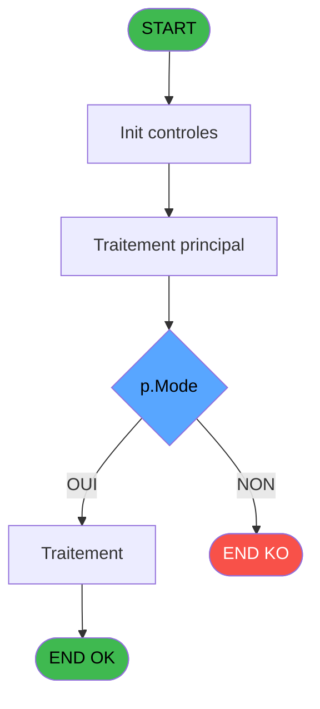
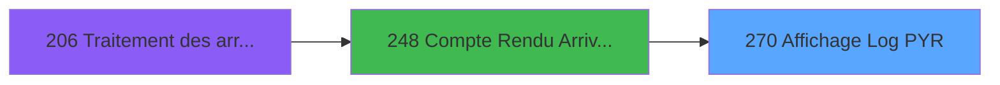
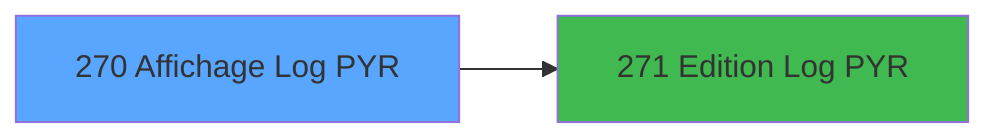

# PBG IDE 270 - Affichage Log PYR

> **Analyse**: Phases 1-4 2026-02-03 10:43 -> 10:44 (19s) | Assemblage 10:44
> **Pipeline**: V7.2 Enrichi
> **Structure**: 4 onglets (Resume | Ecrans | Donnees | Connexions)

<!-- TAB:Resume -->

## 1. FICHE D'IDENTITE

| Attribut | Valeur |
|----------|--------|
| Projet | PBG |
| IDE Position | 270 |
| Nom Programme | Affichage Log PYR |
| Fichier source | `Prg_270.xml` |
| Domaine metier | General |
| Taches | 1 (1 ecrans visibles) |
| Tables modifiees | 0 |
| Programmes appeles | 1 |

## 2. DESCRIPTION FONCTIONNELLE

**Affichage Log PYR** assure la gestion complete de ce processus, accessible depuis [Compte Rendu Arrivants (IDE 248)](PBG-IDE-248.md).

Le flux de traitement s'organise en **1 blocs fonctionnels** :

- **Consultation** (1 tache) : ecrans de recherche, selection et consultation

**Logique metier** : 1 regles identifiees couvrant conditions metier.

## 3. BLOCS FONCTIONNELS

### 3.1 Consultation (1 tache)

Ecrans de recherche et consultation.

---

#### 270 - Affichage Log PYR [[ECRAN]](#ecran-t1)

**Role** : Reinitialisation : Affichage Log PYR.
**Ecran** : 1190 x 250 DLU | [Voir mockup](#ecran-t1)

## 5. REGLES METIER

1 regles identifiees:

### Autres (1 regles)

#### [RM-001] Si p.Mode [A]='M' alors 3.625 sinon 13.375)

| Element | Detail |
|---------|--------|
| **Condition** | `p.Mode [A]='M'` |
| **Si vrai** | 3.625 |
| **Si faux** | 13.375) |
| **Variables** | A (p.Mode) |
| **Expression source** | Expression 11 : `IF(p.Mode [A]='M',3.625,13.375)` |
| **Exemple** | Si p.Mode [A]='M' → 3.625. Sinon → 13.375) |

## 6. CONTEXTE

- **Appele par**: [Compte Rendu Arrivants (IDE 248)](PBG-IDE-248.md)
- **Appelle**: 1 programmes | **Tables**: 3 (W:0 R:1 L:2) | **Taches**: 1 | **Expressions**: 13

<!-- TAB:Ecrans -->

## 8. ECRANS

### 8.1 Forms visibles (1 / 1)

| # | Position | Tache | Nom | Type | Largeur | Hauteur | Bloc |
|---|----------|-------|-----|------|---------|---------|------|
| 1 | 270 | 270 | Affichage Log PYR | Type0 | 1190 | 250 | Consultation |

### 8.2 Mockups Ecrans

---

#### 270 - Affichage Log PYR
**Tache** : [270](#t1) | **Type** : Type0 | **Dimensions** : 1190 x 250 DLU
**Bloc** : Consultation | **Titre IDE** : Affichage Log PYR

<!-- FORM-DATA:
{
    "width":  1190,
    "vFactor":  8,
    "type":  "Type0",
    "hFactor":  8,
    "controls":  [
                     {
                         "x":  5,
                         "type":  "label",
                         "var":  "",
                         "y":  224,
                         "w":  1179,
                         "fmt":  "",
                         "name":  "",
                         "h":  24,
                         "color":  "",
                         "text":  "",
                         "parent":  null
                     },
                     {
                         "x":  29,
                         "type":  "table",
                         "var":  "",
                         "name":  "",
                         "titleH":  13,
                         "color":  "110",
                         "w":  1133,
                         "y":  25,
                         "fmt":  "",
                         "parent":  null,
                         "text":  "",
                         "rowH":  13,
                         "h":  194,
                         "cols":  [
                                      {
                                          "title":  "Nom / Prénom",
                                          "layer":  1,
                                          "w":  329
                                      },
                                      {
                                          "title":  "Fidélisation",
                                          "layer":  2,
                                          "w":  138
                                      },
                                      {
                                          "title":  "Dates Séjour",
                                          "layer":  3,
                                          "w":  230
                                      },
                                      {
                                          "title":  "Code Logement",
                                          "layer":  4,
                                          "w":  139
                                      },
                                      {
                                          "title":  "Chambre",
                                          "layer":  5,
                                          "w":  105
                                      },
                                      {
                                          "title":  "Ancienne Chambre",
                                          "layer":  6,
                                          "w":  154
                                      }
                                  ],
                         "rows":  6
                     },
                     {
                         "x":  5,
                         "type":  "label",
                         "var":  "",
                         "y":  0,
                         "w":  1181,
                         "fmt":  "",
                         "name":  "",
                         "h":  21,
                         "color":  "",
                         "text":  "",
                         "parent":  null
                     },
                     {
                         "x":  11,
                         "type":  "edit",
                         "var":  "",
                         "y":  7,
                         "w":  267,
                         "fmt":  "20",
                         "name":  "",
                         "h":  8,
                         "color":  "",
                         "text":  "",
                         "parent":  9
                     },
                     {
                         "x":  874,
                         "type":  "edit",
                         "var":  "",
                         "y":  7,
                         "w":  296,
                         "fmt":  "WWW DD MMM YYYYT",
                         "name":  "",
                         "h":  8,
                         "color":  "",
                         "text":  "",
                         "parent":  9
                     },
                     {
                         "x":  35,
                         "type":  "edit",
                         "var":  "",
                         "y":  41,
                         "w":  320,
                         "fmt":  "40",
                         "name":  "",
                         "h":  10,
                         "color":  "110",
                         "text":  "",
                         "parent":  2
                     },
                     {
                         "x":  363,
                         "type":  "edit",
                         "var":  "",
                         "y":  41,
                         "w":  130,
                         "fmt":  "",
                         "name":  "libelle",
                         "h":  10,
                         "color":  "110",
                         "text":  "",
                         "parent":  2
                     },
                     {
                         "x":  501,
                         "type":  "edit",
                         "var":  "",
                         "y":  41,
                         "w":  120,
                         "fmt":  "",
                         "name":  "gmr_debut_sejour",
                         "h":  10,
                         "color":  "110",
                         "text":  "",
                         "parent":  2
                     },
                     {
                         "x":  621,
                         "type":  "edit",
                         "var":  "",
                         "y":  41,
                         "w":  100,
                         "fmt":  "",
                         "name":  "gmr_fin_sejour",
                         "h":  10,
                         "color":  "110",
                         "text":  "",
                         "parent":  2
                     },
                     {
                         "x":  762,
                         "type":  "edit",
                         "var":  "",
                         "y":  41,
                         "w":  74,
                         "fmt":  "",
                         "name":  "tmp_code_logement",
                         "h":  10,
                         "color":  "6",
                         "text":  "",
                         "parent":  2
                     },
                     {
                         "x":  870,
                         "type":  "edit",
                         "var":  "",
                         "y":  41,
                         "w":  92,
                         "fmt":  "",
                         "name":  "tmp_nom_logement",
                         "h":  10,
                         "color":  "110",
                         "text":  "",
                         "parent":  2
                     },
                     {
                         "x":  1016,
                         "type":  "edit",
                         "var":  "",
                         "y":  41,
                         "w":  74,
                         "fmt":  "",
                         "name":  "tmp_ancienne_chambre",
                         "h":  10,
                         "color":  "6",
                         "text":  "",
                         "parent":  2
                     },
                     {
                         "x":  11,
                         "type":  "button",
                         "var":  "",
                         "y":  227,
                         "w":  154,
                         "fmt":  "\u0026Quitter",
                         "name":  "",
                         "h":  18,
                         "color":  "",
                         "text":  "",
                         "parent":  1
                     },
                     {
                         "x":  1016,
                         "type":  "button",
                         "var":  "",
                         "y":  227,
                         "w":  154,
                         "fmt":  "\u0026Impression",
                         "name":  "",
                         "h":  18,
                         "color":  "",
                         "text":  "",
                         "parent":  1
                     }
                 ],
    "taskId":  "270",
    "height":  250
}
-->

<strong>Champs : 9 champs</strong>

| Pos (x,y) | Nom | Variable | Type |
|-----------|-----|----------|------|
| 11,7 | 20 | - | edit |
| 874,7 | WWW DD MMM YYYYT | - | edit |
| 35,41 | 40 | - | edit |
| 363,41 | libelle | - | edit |
| 501,41 | gmr_debut_sejour | - | edit |
| 621,41 | gmr_fin_sejour | - | edit |
| 762,41 | tmp_code_logement | - | edit |
| 870,41 | tmp_nom_logement | - | edit |
| 1016,41 | tmp_ancienne_chambre | - | edit |

<strong>Boutons : 2 boutons</strong>

| Bouton | Pos (x,y) | Action |
|--------|-----------|--------|
| Quitter | 11,227 | Quitte le programme |
| Impression | 1016,227 | Bouton fonctionnel |

## 9. NAVIGATION

Ecran unique: **Affichage Log PYR**

### 9.3 Structure hierarchique (1 tache)

| Position | Tache | Type | Dimensions | Bloc |
|----------|-------|------|------------|------|
| **270.1** | [**Affichage Log PYR** (270)](#t1) [mockup](#ecran-t1) | - | 1190x250 | Consultation |

### 9.4 Algorigramme

> **Legende**: Vert = START/END OK | Rouge = END KO | Bleu = Decisions
> *Algorigramme auto-genere. Utiliser `/algorigramme` pour une synthese metier detaillee.*

<!-- TAB:Donnees -->

## 10. TABLES

### Tables utilisees (3)

| ID | Nom | Description | Type | R | W | L | Usages |
|----|-----|-------------|------|---|---|---|--------|
| 30 | gm-recherche_____gmr | Index de recherche | DB | R |   |   | 1 |
| 617 | tempo_trafic | Table temporaire ecran | TMP |   |   | L | 1 |
| 846 | stat_lieu_vente | Statistiques point de vente | TMP |   |   | L | 1 |

### Colonnes par table (0 / 1 tables avec colonnes identifiees)

Table 30 - gm-recherche_____gmr (R) - 1 usages

*Table utilisee uniquement en Link ou aucune colonne Real identifiee dans le DataView.*

## 11. VARIABLES

*(Programme sans variables locales mappees)*

## 12. EXPRESSIONS

**13 / 13 expressions decodees (100%)**

### 12.1 Repartition par type

| Type | Expressions | Regles |
|------|-------------|--------|
| CONDITION | 4 | 5 |
| DATE | 1 | 0 |
| OTHER | 4 | 0 |
| REFERENCE_VG | 2 | 0 |
| STRING | 1 | 0 |
| CONCATENATION | 1 | 0 |

### 12.2 Expressions cles par type

#### CONDITION (4 expressions)

| Type | IDE | Expression | Regle |
|------|-----|------------|-------|
| CONDITION | 11 | `IF(p.Mode [A]='M',3.625,13.375)` | [RM-001](#rm-RM-001) |
| CONDITION | 10 | `p.Mode [A]='M'` | - |
| CONDITION | 13 | `CASE(p.Mode [A],'C',MlsTrans('Souscription Pick Your Room'),'M',MlsTrans('Modification Pick Your Room'),'A',MlsTrans('Annulation Pick Your Room'),'')` | - |
| CONDITION | 12 | `IF(p.Mode [A]='M',141.5,122.25)` | - |

#### DATE (1 expressions)

| Type | IDE | Expression | Regle |
|------|-----|------------|-------|
| DATE | 9 | `Date()` | - |

#### OTHER (4 expressions)

| Type | IDE | Expression | Regle |
|------|-----|------------|-------|
| OTHER | 3 | `[D]` | - |
| OTHER | 4 | `[E]` | - |
| OTHER | 1 | `p.Mode [A]` | - |
| OTHER | 2 | `[C]` | - |

#### REFERENCE_VG (2 expressions)

| Type | IDE | Expression | Regle |
|------|-----|------------|-------|
| REFERENCE_VG | 8 | `VG21` | - |
| REFERENCE_VG | 5 | `VG64` | - |

#### STRING (1 expressions)

| Type | IDE | Expression | Regle |
|------|-----|------------|-------|
| STRING | 6 | `Trim([N])` | - |

#### CONCATENATION (1 expressions)

| Type | IDE | Expression | Regle |
|------|-----|------------|-------|
| CONCATENATION | 7 | `Trim([O])&' '&Trim([P])` | - |

<!-- TAB:Connexions -->

## 13. GRAPHE D'APPELS

### 13.1 Chaine depuis Main (Callers)

Main -> ... -> [Compte Rendu Arrivants (IDE 248)](PBG-IDE-248.md) -> **Affichage Log PYR (IDE 270)**

### 13.2 Callers

| IDE | Nom Programme | Nb Appels |
|-----|---------------|-----------|
| [248](PBG-IDE-248.md) | Compte Rendu Arrivants | 1 |

### 13.3 Callees (programmes appeles)

### 13.4 Detail Callees avec contexte

| IDE | Nom Programme | Appels | Contexte |
|-----|---------------|--------|----------|
| [271](PBG-IDE-271.md) | Edition Log PYR | 1 | Impression ticket/document |

## 14. RECOMMANDATIONS MIGRATION

### 14.1 Profil du programme

| Metrique | Valeur | Impact migration |
|----------|--------|-----------------|
| Lignes de logique | 28 | Programme compact |
| Expressions | 13 | Peu de logique |
| Tables WRITE | 0 | Impact faible |
| Sous-programmes | 1 | Peu de dependances |
| Ecrans visibles | 1 | Ecran unique ou traitement batch |
| Code desactive | 0% (0 / 28) | Code sain |
| Regles metier | 1 | Quelques regles a preserver |

### 14.2 Plan de migration par bloc

#### Consultation (1 tache: 1 ecran, 0 traitement)

- **Strategie** : Composants de recherche/selection en modales.
- 1 ecran : Affichage Log PYR

### 14.3 Dependances critiques

| Dependance | Type | Appels | Impact |
|------------|------|--------|--------|
| [Edition Log PYR (IDE 271)](PBG-IDE-271.md) | Sous-programme | 1x | Normale - Impression ticket/document |

---
*Spec DETAILED generee par Pipeline V7.2 - 2026-02-03 10:44*
