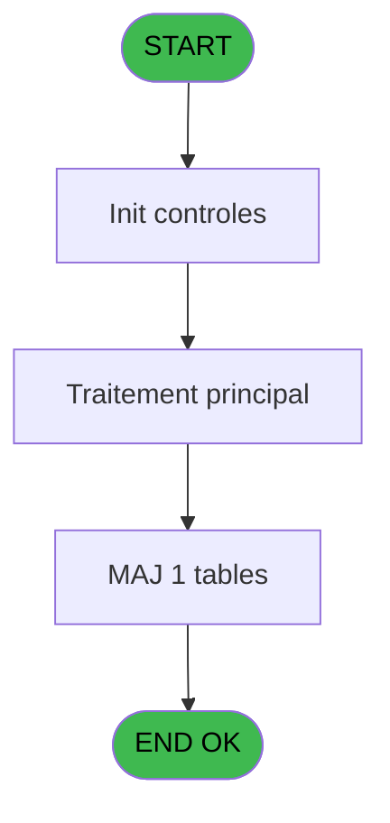
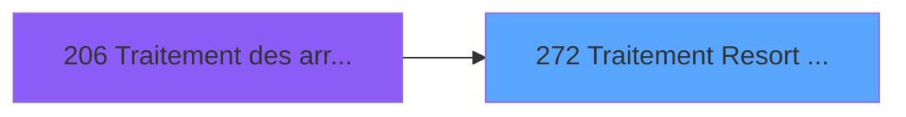
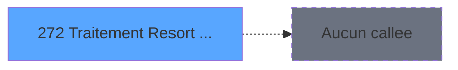

# PBG IDE 272 - Traitement Resort Credit

> **Analyse**: Phases 1-4 2026-02-03 10:44 -> 10:45 (19s) | Assemblage 10:45
> **Pipeline**: V7.2 Enrichi
> **Structure**: 4 onglets (Resume | Ecrans | Donnees | Connexions)

<!-- TAB:Resume -->

## 1. FICHE D'IDENTITE

| Attribut | Valeur |
|----------|--------|
| Projet | PBG |
| IDE Position | 272 |
| Nom Programme | Traitement Resort Credit |
| Fichier source | `Prg_272.xml` |
| Domaine metier | General |
| Taches | 3 (0 ecrans visibles) |
| Tables modifiees | 1 |
| Programmes appeles | 0 |

## 2. DESCRIPTION FONCTIONNELLE

**Traitement Resort Credit** assure la gestion complete de ce processus, accessible depuis [Traitement des arrivants (IDE 206)](PBG-IDE-206.md).

Le flux de traitement s'organise en **2 blocs fonctionnels** :

- **Traitement** (2 taches) : traitements metier divers
- **Creation** (1 tache) : insertion d'enregistrements en base (mouvements, prestations)

**Donnees modifiees** : 1 tables en ecriture (Table_982).

Detail : phases du traitement

#### Phase 1 : Traitement (2 taches)

- **272** - Veuillez patienter... **[[ECRAN]](#ecran-t1)**
- **272.2** - Del Prev RC

#### Phase 2 : Creation (1 tache)

- **272.1** - Creation Circuit

#### Tables impactees

| Table | Operations | Role metier |
|-------|-----------|-------------|
| Table_982 | **W** (2 usages) |  |

## 3. BLOCS FONCTIONNELS

### 3.1 Traitement (2 taches)

Traitements internes.

---

#### 272 - Veuillez patienter... [[ECRAN]](#ecran-t1)

**Role** : Traitement : Veuillez patienter....
**Ecran** : 427 x 68 DLU (MDI) | [Voir mockup](#ecran-t1)

---

#### 272.2 - Del Prev RC

**Role** : Traitement : Del Prev RC.

### 3.2 Creation (1 tache)

Insertion de nouveaux enregistrements en base.

---

#### 272.1 - Creation Circuit

**Role** : Creation d'enregistrement : Creation Circuit.

## 5. REGLES METIER

*(Aucune regle metier identifiee)*

## 6. CONTEXTE

- **Appele par**: [Traitement des arrivants (IDE 206)](PBG-IDE-206.md)
- **Appelle**: 0 programmes | **Tables**: 3 (W:1 R:1 L:1) | **Taches**: 3 | **Expressions**: 12

<!-- TAB:Ecrans -->

## 8. ECRANS

*(Programme sans ecran visible)*

## 9. NAVIGATION

### 9.3 Structure hierarchique (3 taches)

| Position | Tache | Type | Dimensions | Bloc |
|----------|-------|------|------------|------|
| **272.1** | [**Veuillez patienter...** (272)](#t1) [mockup](#ecran-t1) | MDI | 427x68 | Traitement |
| 272.1.1 | [Del Prev RC (272.2)](#t18) | - | - | |
| **272.2** | [**Creation Circuit** (272.1)](#t2) | MDI | - | Creation |

### 9.4 Algorigramme

> **Legende**: Vert = START/END OK | Rouge = END KO | Bleu = Decisions
> *Algorigramme auto-genere. Utiliser `/algorigramme` pour une synthese metier detaillee.*

<!-- TAB:Donnees -->

## 10. TABLES

### Tables utilisees (3)

| ID | Nom | Description | Type | R | W | L | Usages |
|----|-----|-------------|------|---|---|---|--------|
| 569 | pointage_articles_caution | Articles et stock | TMP | R |   |   | 1 |
| 982 | Table_982 |  | MEM |   | **W** |   | 2 |
| 991 | Table_991 |  | MEM |   |   | L | 1 |

### Colonnes par table (1 / 2 tables avec colonnes identifiees)

Table 569 - pointage_articles_caution (R) - 1 usages

| Lettre | Variable | Acces | Type |
|--------|----------|-------|------|
| A | P0-Code Societe | R | Alpha |
| B | P0-Nb Reponses | R | Numeric |
| C | P0-Num ressource | R | Numeric |
| D | W0-Operande | R | Numeric |
| E | W0-Operateur | R | Numeric |
| F | W0-Pourcentage | R | Numeric |
| G | W0-Calcul Pourcent | R | Numeric |
| H | W0-Compteur | R | Numeric |

Table 982 - Table_982 (**W**) - 2 usages

*Table utilisee uniquement en Link ou aucune colonne Real identifiee dans le DataView.*

## 11. VARIABLES

### 11.1 Autres (8)

Variables diverses.

| Lettre | Nom | Type | Usage dans |
|--------|-----|------|-----------|
| A | P0-Code Societe | Alpha | - |
| B | P0-Nb Reponses | Numeric | - |
| C | P0-Num ressource | Numeric | - |
| D | W0-Operande | Numeric | - |
| E | W0-Operateur | Numeric | 2x refs |
| F | W0-Pourcentage | Numeric | - |
| G | W0-Calcul Pourcent | Numeric | 1x refs |
| H | W0-Compteur | Numeric | - |

## 12. EXPRESSIONS

**12 / 12 expressions decodees (100%)**

### 12.1 Repartition par type

| Type | Expressions | Regles |
|------|-------------|--------|
| CALCULATION | 7 | 0 |
| CONSTANTE | 1 | 0 |
| REFERENCE_VG | 1 | 0 |
| OTHER | 1 | 0 |
| CONDITION | 2 | 0 |

### 12.2 Expressions cles par type

#### CALCULATION (7 expressions)

| Type | IDE | Expression | Regle |
|------|-----|------------|-------|
| CALCULATION | 7 | `W0-Operateur [E]/W0-Calcul Pourcent [G]` | - |
| CALCULATION | 9 | `W0-Operateur [E]+1` | - |
| CALCULATION | 10 | `[BA]+1` | - |
| CALCULATION | 6 | `[AS]/98` | - |
| CALCULATION | 2 | `([BA]/VG17)*100` | - |
| ... | | *+2 autres* | |

#### CONSTANTE (1 expressions)

| Type | IDE | Expression | Regle |
|------|-----|------------|-------|
| CONSTANTE | 1 | `''` | - |

#### REFERENCE_VG (1 expressions)

| Type | IDE | Expression | Regle |
|------|-----|------------|-------|
| REFERENCE_VG | 4 | `VG20` | - |

#### OTHER (1 expressions)

| Type | IDE | Expression | Regle |
|------|-----|------------|-------|
| OTHER | 8 | `[I]` | - |

#### CONDITION (2 expressions)

| Type | IDE | Expression | Regle |
|------|-----|------------|-------|
| CONDITION | 12 | `[R]>0` | - |
| CONDITION | 11 | `CndRange([AP]<>0,[AP])` | - |

<!-- TAB:Connexions -->

## 13. GRAPHE D'APPELS

### 13.1 Chaine depuis Main (Callers)

Main -> ... -> [Traitement des arrivants (IDE 206)](PBG-IDE-206.md) -> **Traitement Resort Credit (IDE 272)**

### 13.2 Callers

| IDE | Nom Programme | Nb Appels |
|-----|---------------|-----------|
| [206](PBG-IDE-206.md) | Traitement des arrivants | 1 |

### 13.3 Callees (programmes appeles)

### 13.4 Detail Callees avec contexte

| IDE | Nom Programme | Appels | Contexte |
|-----|---------------|--------|----------|
| - | (aucun) | - | - |

## 14. RECOMMANDATIONS MIGRATION

### 14.1 Profil du programme

| Metrique | Valeur | Impact migration |
|----------|--------|-----------------|
| Lignes de logique | 48 | Programme compact |
| Expressions | 12 | Peu de logique |
| Tables WRITE | 1 | Impact faible |
| Sous-programmes | 0 | Peu de dependances |
| Ecrans visibles | 0 | Ecran unique ou traitement batch |
| Code desactive | 0% (0 / 48) | Code sain |
| Regles metier | 0 | Pas de regle identifiee |

### 14.2 Plan de migration par bloc

#### Traitement (2 taches: 1 ecran, 1 traitement)

- **Strategie** : Orchestrateur avec 1 ecrans (Razor/React) et 1 traitements backend (services).
- Les ecrans deviennent des composants UI, les traitements invisibles deviennent des services injectables.
- Decomposer les taches en services unitaires testables.

#### Creation (1 tache: 0 ecran, 1 traitement)

- **Strategie** : Repository pattern avec Entity Framework Core.
- Insertion via `IRepository<T>.CreateAsync()`

### 14.3 Dependances critiques

| Dependance | Type | Appels | Impact |
|------------|------|--------|--------|
| Table_982 | Table WRITE (Memory) | 2x | Schema + repository |

---
*Spec DETAILED generee par Pipeline V7.2 - 2026-02-03 10:45*
